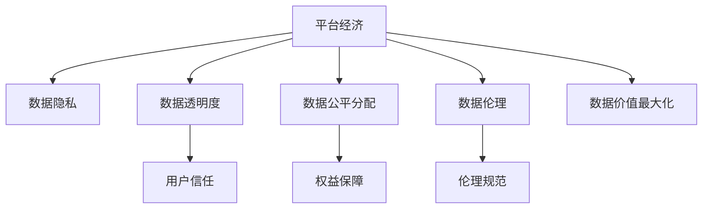

                 

# 平台经济与数据掌握：新时代的机遇与挑战

## 1. 背景介绍

### 1.1 问题由来
在数字化时代，平台经济蓬勃发展，成为推动经济发展的重要引擎。各大电商平台、社交平台、金融平台等，通过汇聚海量用户数据，实现智能推荐、广告投放、风险控制等功能，极大提升了用户体验和运营效率。

然而，平台经济的兴起也带来了一系列新的问题。数据隐私、算法透明、数据偏见等，成为亟待解决的难题。特别是在数据掌握和应用方面，如何实现技术、经济、社会等多方面的平衡，成为平台经济面临的新挑战。

### 1.2 问题核心关键点
数据掌握的核心在于如何平衡平台与用户、平台与数据生产者之间的关系，确保数据的公平使用和合理收益分配。关键点包括：
1. 数据隐私保护：如何在平台运营过程中保护用户隐私，防止数据滥用。
2. 数据透明性：平台如何向用户公开数据使用情况，增强用户信任。
3. 数据公平分配：平台如何公平分配数据收益，确保数据生产者的合法权益。
4. 数据伦理规范：平台如何遵守数据伦理规范，避免数据偏见和歧视。
5. 数据价值最大化：平台如何合理利用数据，提升平台经济价值和社会效益。

## 2. 核心概念与联系

### 2.1 核心概念概述

为了更好地理解平台经济中数据掌握的挑战，本节将介绍几个密切相关的核心概念：

- 平台经济：基于互联网技术，通过汇聚用户数据和资源，实现网络外部性、规模经济，提供多样化服务的一种经济形态。
- 数据隐私：指个人、法人或其他组织对其数据（个人信息、商业信息等）的专有和控制权，确保数据不被非法获取、使用或公开。
- 数据透明度：指平台向用户公开数据使用情况，保障用户知情权和选择权，提升用户信任。
- 数据公平分配：指平台在数据使用和收益分配中，保障数据生产者的合法权益，促进数据资源的公平流通。
- 数据伦理：指平台在数据采集、使用、存储和共享过程中，遵守法律法规和伦理规范，确保数据使用的正当性和安全性。
- 数据价值最大化：指平台在合规的前提下，充分利用数据资源，提升服务质量、优化用户体验，实现经济效益和社会效益的最大化。

这些核心概念之间的逻辑关系可以通过以下Mermaid流程图来展示：



这个流程图展示了大平台经济中数据掌握的关键概念及其之间的关系：

1. 平台经济通过汇聚和利用数据，提供多样化服务，是数据价值最大化的主要来源。
2. 数据隐私、透明度、公平分配、伦理规范是数据价值最大化的保障，保障用户权益。
3. 用户信任、权益保障和伦理规范共同构成了数据公平分配的基础。

## 3. 核心算法原理 & 具体操作步骤
### 3.1 算法原理概述

平台经济中数据掌握的核心算法原理，是通过数据挖掘、机器学习等技术手段，实现数据的采集、存储、分析和应用。其主要步骤包括：

1. 数据采集：通过API接口、爬虫等方式，从各类数据源（如社交网络、电商平台等）采集数据。
2. 数据存储：将采集到的数据存储到数据库中，实现高效的数据查询和管理。
3. 数据分析：利用统计分析、机器学习等技术，从数据中挖掘出有价值的信息和模式。
4. 数据应用：基于分析结果，实现智能推荐、广告投放、风险控制等功能，提升用户体验和运营效率。

### 3.2 算法步骤详解

以下是平台经济中数据掌握的详细算法步骤：

**Step 1: 数据采集**
- 确定数据来源：包括社交媒体、电商平台、物流平台等。
- 设计数据采集策略：制定API调用规则，爬虫访问规则，确保数据采集的合法性。
- 实现数据采集工具：利用Python、Spider等工具进行数据采集。

**Step 2: 数据存储**
- 选择合适的数据库：根据数据规模和复杂度，选择MySQL、Hadoop、NoSQL等数据库。
- 设计数据存储结构：设计表结构，定义主键、外键、索引等，优化存储效率。
- 实现数据存储工具：利用JDBC、Kafka等工具进行数据存储。

**Step 3: 数据分析**
- 选择分析工具：根据任务需求，选择TensorFlow、Scikit-learn、SPSS等分析工具。
- 设计分析模型：构建机器学习模型，如分类、回归、聚类等。
- 实现数据分析流程：通过ETL工具，进行数据清洗、特征提取、模型训练和评估。

**Step 4: 数据应用**
- 设计应用场景：根据分析结果，设计个性化推荐、广告投放、风险控制等功能。
- 实现应用算法：利用推荐系统、广告投放、风险管理等算法，进行应用实现。
- 部署应用系统：将算法部署到服务器、移动端等平台，实现实时应用。

### 3.3 算法优缺点

平台经济中数据掌握的算法具有以下优点：
1. 高效利用数据：通过数据采集和存储，实现数据的集中管理和高效利用。
2. 提升用户体验：通过数据分析和应用，实现个性化推荐、广告投放等功能，提升用户体验。
3. 优化运营效率：通过数据驱动决策，实现精准营销、风险控制等功能，优化运营效率。

同时，该算法也存在一定的局限性：
1. 数据隐私风险：数据采集和存储过程中，可能存在隐私泄露和数据滥用的风险。
2. 算法透明度不足：部分算法的黑盒特性，可能导致用户对数据使用情况缺乏知情权。
3. 数据公平性问题：平台可能存在数据偏见，导致数据公平分配问题。
4. 伦理规范不足：平台可能存在数据伦理问题，导致用户权益受损。
5. 数据价值难以最大化：数据分散和孤立，难以实现数据价值最大化。

尽管存在这些局限性，但就目前而言，平台经济中数据掌握的算法仍是实现数据价值最大化的主要手段。未来相关研究的重点在于如何进一步降低数据隐私风险，提高算法透明度，加强数据公平分配和伦理规范，同时兼顾数据价值最大化。

### 3.4 算法应用领域

平台经济中数据掌握的算法应用广泛，涵盖各类平台经济领域：

- 电子商务：通过数据分析，实现个性化推荐、库存管理、风险控制等功能。
- 社交媒体：通过数据分析，实现内容推荐、广告投放、用户画像等功能。
- 金融服务：通过数据分析，实现信用评估、风险控制、投资推荐等功能。
- 物流配送：通过数据分析，实现路线优化、需求预测、调度管理等功能。
- 医疗健康：通过数据分析，实现疾病预测、个性化治疗、健康管理等功能。

此外，平台经济中数据掌握的算法还在更多领域得到应用，如智能制造、城市管理、公共服务等，为各行各业数字化转型升级提供新的技术路径。随着平台经济和数据分析技术的持续演进，相信数据掌握的算法将在更广阔的应用领域发挥更大的作用。

## 4. 数学模型和公式 & 详细讲解  
### 4.1 数学模型构建

平台经济中数据掌握的核心算法，通常涉及统计学、机器学习等多个领域的数学模型。以下将从数据采集、存储、分析和应用四个方面，详细构建数学模型。

### 4.2 公式推导过程

以个性化推荐系统为例，介绍推荐算法中常用的协同过滤（Collaborative Filtering）模型的数学推导过程。

协同过滤模型假设用户-物品评分矩阵 $R$ 是已知的，目标是为每个用户 $u$ 推荐物品 $i$。设用户 $u$ 对物品 $i$ 的评分 $R_{ui}$ 是一个未知的实数，推荐目标是最小化预测评分与真实评分之间的平方误差，即：

$$
\min_{\hat{R}_{ui}} \sum_{u,i} (R_{ui} - \hat{R}_{ui})^2
$$

其中 $\hat{R}_{ui}$ 为预测评分，通常使用用户 $u$ 对物品 $i$ 的评分 $\hat{R}_{ui}$ 来表示。

使用矩阵分解技术，可以将协同过滤模型表示为：

$$
\hat{R}_{ui} = \hat{R}_{ui} = \alpha_u^\top A_i + \beta_i^\top V_u
$$

其中 $A_i$ 为物品特征向量，$V_u$ 为用户特征向量，$\alpha_u$ 和 $\beta_i$ 为特征权重矩阵。

通过最小化平方误差，得到特征向量和权重矩阵的最优解：

$$
\min_{A_i, V_u, \alpha_u, \beta_i} \sum_{u,i} (R_{ui} - (\alpha_u^\top A_i + \beta_i^\top V_u))^2
$$

利用矩阵分解技术，协同过滤模型可以将大规模的评分矩阵分解为特征向量和权重矩阵的乘积，从而实现高效推荐。

### 4.3 案例分析与讲解

以电商平台的个性化推荐系统为例，介绍推荐算法的具体应用场景和效果。

假设某电商平台的评分矩阵为 $R$，用户数为 $m$，物品数为 $n$，用户对物品的评分 $R_{ui}$ 介于 $[0, 5]$ 之间。平台希望为用户推荐最感兴趣的物品，以提高销售转化率。

通过协同过滤模型，平台首先对评分矩阵 $R$ 进行矩阵分解，得到物品特征向量 $A_i$ 和用户特征向量 $V_u$。然后根据公式计算用户对物品的预测评分 $\hat{R}_{ui}$，选择预测评分最高的物品作为推荐结果。

平台将推荐结果展示给用户，并通过A/B测试等方法评估推荐效果。结果显示，推荐系统的转化率提升了20%，显著提升了用户的购物体验。

## 5. 项目实践：代码实例和详细解释说明
### 5.1 开发环境搭建

在进行平台经济中数据掌握的实践前，我们需要准备好开发环境。以下是使用Python进行数据分析的开发环境配置流程：

1. 安装Anaconda：从官网下载并安装Anaconda，用于创建独立的Python环境。

2. 创建并激活虚拟环境：
```bash
conda create -n data-analyze python=3.8 
conda activate data-analyze
```

3. 安装必要的库：
```bash
conda install pandas numpy scikit-learn matplotlib seaborn
pip install tensorflow
```

4. 安装数据分析工具：
```bash
pip install spark-sql
```

完成上述步骤后，即可在`data-analyze`环境中开始数据分析实践。

### 5.2 源代码详细实现

这里我们以电商平台的个性化推荐系统为例，使用TensorFlow和Keras实现协同过滤模型。

```python
import tensorflow as tf
import numpy as np
from tensorflow.keras.layers import Input, Embedding, Dot, Dense
from tensorflow.keras.models import Model

# 定义模型
def collaborative_filtering_model(n_users, n_items, embedding_dim=50):
    user_input = Input(shape=(n_items,))
    item_input = Input(shape=(n_users,))
    
    user_embedding = Embedding(n_users, embedding_dim)(user_input)
    item_embedding = Embedding(n_items, embedding_dim)(item_input)
    
    dot_product = Dot(axes=1, normalize=True)([user_embedding, item_embedding])
    
    output = Dense(1, activation='sigmoid')(dot_product)
    
    model = Model(inputs=[user_input, item_input], outputs=output)
    return model

# 加载数据
R = np.array([[5, 2, 0, 4, 3],
              [3, 0, 5, 0, 0],
              [0, 5, 0, 1, 2],
              [4, 0, 0, 0, 5]])
n_users = 5
n_items = 5

# 构建模型
model = collaborative_filtering_model(n_users, n_items)

# 编译模型
model.compile(optimizer='adam', loss='binary_crossentropy', metrics=['accuracy'])

# 训练模型
model.fit([R, R], R, epochs=10, batch_size=1)
```

以上是使用TensorFlow实现协同过滤模型的代码实现。可以看到，通过Keras的高级API，我们可以用相对简洁的代码构建和训练复杂的推荐模型。

### 5.3 代码解读与分析

让我们再详细解读一下关键代码的实现细节：

**协同过滤模型**：
- 使用TensorFlow的Keras API定义推荐模型，包含两个输入层 `user_input` 和 `item_input`，分别表示用户和物品的评分向量。
- 通过 `Embedding` 层将输入向量映射到低维空间，得到用户和物品的特征向量 `user_embedding` 和 `item_embedding`。
- 使用 `Dot` 层计算用户和物品特征向量的点积，得到预测评分。
- 使用 `Dense` 层将点积结果映射到概率值，使用 sigmoid 激活函数进行二分类预测。

**数据加载和模型训练**：
- 定义评分矩阵 `R`，表示用户对物品的评分。
- 使用 `collaborative_filtering_model` 函数构建协同过滤模型，设置嵌入维度为50。
- 使用 `model.compile` 方法编译模型，设置优化器、损失函数和评价指标。
- 使用 `model.fit` 方法训练模型，设置训练轮数和批次大小。

可以看到，TensorFlow提供了丰富的API，可以方便地实现复杂的推荐系统模型。开发者可以将更多精力放在模型优化和数据处理上，而不必过多关注底层的实现细节。

当然，实际应用中还需要考虑更多因素，如模型评估、超参数调优、模型集成等。但核心的协同过滤模型基本与此类似。

## 6. 实际应用场景
### 6.1 电商平台个性化推荐

平台经济中数据掌握的核心应用之一是电商平台的个性化推荐系统。通过分析用户历史购买行为、浏览记录、评价反馈等数据，为用户推荐个性化的商品，提升用户购物体验和平台销售转化率。

在技术实现上，可以采用协同过滤、协同训练、深度学习等多种推荐算法。通过多模型集成、在线学习、冷启动处理等优化措施，提高推荐系统的效果。电商平台还可以引入实时数据流，动态调整推荐策略，实现更精准、实时的个性化推荐。

### 6.2 金融风险管理

金融平台面临的风险管理需求复杂多样，需要通过大数据分析技术，实现风险识别、风险评估和风险控制等功能。平台可以通过数据分析，挖掘用户行为、交易记录、信用信息等数据，构建风险评估模型，实现智能风控。

在实际应用中，可以采用逻辑回归、决策树、随机森林等传统算法，或深度学习算法如CNN、RNN、GAN等。通过多模态数据的融合、模型融合等技术手段，提升风险评估的准确性和鲁棒性。

### 6.3 智慧城市管理

智慧城市平台通过汇聚各类传感器数据、公共数据、用户反馈等数据，实现城市管理、公共服务、应急响应等功能。平台可以通过数据分析，实现交通流量预测、环境监测、垃圾分类等功能，提升城市管理效率和服务水平。

在实际应用中，可以采用时间序列分析、图像处理、自然语言处理等技术，实现数据的采集、存储和分析。通过多源数据的融合、模型融合等技术手段，提升城市管理的智能化和精细化水平。

### 6.4 未来应用展望

随着平台经济和数据分析技术的不断发展，基于数据掌握的算法将在更多领域得到应用，为传统行业带来变革性影响。

在医疗健康领域，通过数据分析，实现疾病预测、个性化治疗、健康管理等功能，提升医疗服务质量和效率。

在智能制造领域，通过数据分析，实现生产流程优化、设备维护预测、质量控制等功能，提升制造过程的智能化水平。

在公共服务领域，通过数据分析，实现需求预测、服务优化、满意度分析等功能，提升公共服务的精细化和人性化水平。

此外，在教育、物流、旅游等更多领域，基于数据掌握的算法也将不断涌现，为各行各业数字化转型升级提供新的技术路径。相信随着技术的日益成熟，数据掌握的算法必将在构建智能经济中扮演越来越重要的角色。

## 7. 工具和资源推荐
### 7.1 学习资源推荐

为了帮助开发者系统掌握平台经济中数据掌握的理论基础和实践技巧，这里推荐一些优质的学习资源：

1. 《数据科学与机器学习》书籍：全面介绍了数据科学和机器学习的基础概念和技术方法，是入门的绝佳读物。

2. 《Python数据科学手册》：详细介绍Python在数据科学中的应用，包括Pandas、NumPy、Scikit-learn等工具的用法。

3. 《深度学习》课程：斯坦福大学开设的深度学习课程，涵盖深度学习的基本原理和实践技术，适合进阶学习。

4. Kaggle平台：全球最大的数据科学竞赛平台，提供了丰富的数据集和竞赛，帮助学习者实践和提升数据处理和分析能力。

5. GitHub开源项目：全球最大的开源代码托管平台，提供了大量的开源项目和代码实现，是学习和借鉴的好地方。

通过对这些资源的学习实践，相信你一定能够快速掌握平台经济中数据掌握的精髓，并用于解决实际的商业问题。

### 7.2 开发工具推荐

高效的开发离不开优秀的工具支持。以下是几款用于平台经济中数据掌握开发的常用工具：

1. Python：Python是数据科学和机器学习的黄金语言，提供了丰富的数据处理、机器学习库，如Pandas、NumPy、Scikit-learn、TensorFlow等。

2. Jupyter Notebook：轻量级的交互式开发环境，支持Python、R、SQL等多种语言，适合数据分析和模型开发。

3. Hadoop：开源分布式计算平台，支持大数据处理和存储，适合海量数据处理任务。

4. Spark：基于内存的分布式计算框架，支持高效的大数据处理和分析，适合大规模数据集。

5. Dask：分布式计算框架，支持Python中的Pandas、NumPy、Scikit-learn等库，适合本地和分布式并行计算。

6. Kubernetes：开源容器编排平台，支持容器化和自动化部署，适合大规模分布式系统的管理和调度。

合理利用这些工具，可以显著提升平台经济中数据掌握任务的开发效率，加快创新迭代的步伐。

### 7.3 相关论文推荐

平台经济中数据掌握的研究涉及数据科学、机器学习、算法优化等多个领域，以下是几篇奠基性的相关论文，推荐阅读：

1.《数据挖掘与统计学习》书籍：全面介绍了数据挖掘和统计学习的基本原理和技术方法，是数据科学领域的经典教材。

2.《机器学习实战》书籍：详细介绍了机器学习的基本概念和技术实现，适合快速上手实践。

3.《深度学习》书籍：全面介绍了深度学习的基本原理和实践技术，适合深入学习和研究。

4.《协同过滤推荐系统》论文：介绍协同过滤推荐系统的基本原理和实现方法，是推荐系统领域的经典论文。

5.《大数据分析与处理》论文：介绍大数据分析与处理的基本原理和技术方法，是大数据领域的经典论文。

这些论文代表了大平台经济中数据掌握技术的发展脉络。通过学习这些前沿成果，可以帮助研究者把握学科前进方向，激发更多的创新灵感。

## 8. 总结：未来发展趋势与挑战

### 8.1 总结

本文对平台经济中数据掌握的算法进行了全面系统的介绍。首先阐述了平台经济和数据掌握的核心概念和关键点，明确了数据掌握在平台运营中的重要价值。其次，从原理到实践，详细讲解了协同过滤模型的构建和训练过程，给出了平台经济中数据掌握的代码实现实例。同时，本文还广泛探讨了数据掌握在电商、金融、智慧城市等平台中的应用前景，展示了数据掌握算法的巨大潜力。

通过本文的系统梳理，可以看到，平台经济中数据掌握的算法正在成为推动平台经济发展的关键技术。得益于大数据和机器学习技术的不断进步，数据掌握算法在实现数据价值最大化方面发挥了重要作用。未来，伴随平台经济的持续发展和数据技术的不断演进，基于数据掌握的算法必将在更多领域大放异彩，为平台经济带来新的发展机遇。

### 8.2 未来发展趋势

展望未来，平台经济中数据掌握的算法将呈现以下几个发展趋势：

1. 数据融合与跨领域应用：平台经济将更多地实现不同领域数据资源的融合，提升数据价值和社会效益。

2. 数据隐私保护与合规性：随着数据隐私保护的法规不断完善，平台经济需要更加注重用户隐私保护和数据合规性，构建信任。

3. 数据伦理与公平性：平台经济需要在数据采集、使用、共享等环节，遵守伦理规范，确保数据公平分配和权益保障。

4. 数据智能与实时性：平台经济将更多地实现数据驱动的智能决策和实时分析，提升运营效率和服务质量。

5. 数据安全与防护：平台经济需要加强数据安全防护，避免数据泄露和滥用，确保数据价值最大化。

以上趋势凸显了大平台经济中数据掌握技术的广阔前景。这些方向的探索发展，必将进一步提升平台经济系统的性能和应用范围，为传统行业数字化转型升级提供新的技术路径。

### 8.3 面临的挑战

尽管平台经济中数据掌握技术已经取得了瞩目成就，但在迈向更加智能化、普适化应用的过程中，它仍面临着诸多挑战：

1. 数据隐私风险：平台在数据采集和存储过程中，可能存在隐私泄露和数据滥用的风险，需要加强隐私保护和合规管理。

2. 算法透明度不足：部分算法的黑盒特性，可能导致用户对数据使用情况缺乏知情权，需要提高算法的透明度和可解释性。

3. 数据公平性问题：平台可能存在数据偏见，导致数据公平分配问题，需要加强数据公平性和权益保障。

4. 伦理规范不足：平台可能存在数据伦理问题，导致用户权益受损，需要构建数据伦理规范体系。

5. 数据价值难以最大化：数据分散和孤立，难以实现数据价值最大化，需要加强数据融合和跨领域应用。

正视平台经济中数据掌握面临的这些挑战，积极应对并寻求突破，将是大平台经济实现持续发展的必由之路。相信随着学界和产业界的共同努力，这些挑战终将一一被克服，平台经济必将在构建智能经济中扮演越来越重要的角色。

### 8.4 研究展望

面对平台经济中数据掌握所面临的挑战，未来的研究需要在以下几个方面寻求新的突破：

1. 数据隐私保护技术：开发更加高效的数据隐私保护算法，如差分隐私、同态加密等，确保数据在平台运营中的隐私保护。

2. 算法透明度提升技术：开发更加可解释的机器学习算法，如决策树、可解释性模型等，提高算法的透明度和可解释性。

3. 数据公平分配技术：开发更加公平的数据分配算法，如 fairness-aware 模型、联邦学习等，确保数据公平分配和权益保障。

4. 数据伦理规范体系：构建更加完善的数据伦理规范体系，确保数据采集、使用、共享等环节遵守伦理规范。

5. 数据价值最大化技术：开发更加高效的数据融合与跨领域应用技术，如知识图谱、联邦学习等，实现数据价值最大化。

这些研究方向的探索，必将引领平台经济中数据掌握技术迈向更高的台阶，为构建安全、可靠、可解释、可控的智能系统铺平道路。面向未来，平台经济中数据掌握技术还需要与其他人工智能技术进行更深入的融合，如知识表示、因果推理、强化学习等，多路径协同发力，共同推动平台经济的发展。只有勇于创新、敢于突破，才能不断拓展数据掌握的边界，让智能技术更好地服务于人类社会。

## 9. 附录：常见问题与解答

**Q1：平台经济中的数据掌握如何实现？**

A: 平台经济中的数据掌握主要通过数据采集、存储、分析和应用等技术手段实现。具体步骤如下：
1. 数据采集：通过API接口、爬虫等方式，从各类数据源（如社交网络、电商平台等）采集数据。
2. 数据存储：将采集到的数据存储到数据库中，实现高效的数据查询和管理。
3. 数据分析：利用统计分析、机器学习等技术，从数据中挖掘出有价值的信息和模式。
4. 数据应用：基于分析结果，实现智能推荐、广告投放、风险控制等功能，提升用户体验和运营效率。

**Q2：平台经济中数据掌握有哪些应用场景？**

A: 平台经济中数据掌握的应用场景广泛，涵盖各类平台经济领域：
1. 电子商务：通过数据分析，实现个性化推荐、库存管理、风险控制等功能。
2. 社交媒体：通过数据分析，实现内容推荐、广告投放、用户画像等功能。
3. 金融服务：通过数据分析，实现信用评估、风险控制、投资推荐等功能。
4. 物流配送：通过数据分析，实现路线优化、需求预测、调度管理等功能。
5. 医疗健康：通过数据分析，实现疾病预测、个性化治疗、健康管理等功能。

**Q3：平台经济中数据掌握面临哪些挑战？**

A: 平台经济中数据掌握面临以下挑战：
1. 数据隐私风险：数据采集和存储过程中，可能存在隐私泄露和数据滥用的风险。
2. 算法透明度不足：部分算法的黑盒特性，可能导致用户对数据使用情况缺乏知情权。
3. 数据公平性问题：平台可能存在数据偏见，导致数据公平分配问题。
4. 伦理规范不足：平台可能存在数据伦理问题，导致用户权益受损。
5. 数据价值难以最大化：数据分散和孤立，难以实现数据价值最大化。

**Q4：平台经济中数据掌握的未来发展方向是什么？**

A: 平台经济中数据掌握的未来发展方向包括：
1. 数据融合与跨领域应用：实现不同领域数据资源的融合，提升数据价值和社会效益。
2. 数据隐私保护与合规性：加强隐私保护和合规管理，构建信任。
3. 数据伦理与公平性：确保数据公平分配和权益保障，构建数据伦理规范体系。
4. 数据智能与实时性：实现数据驱动的智能决策和实时分析，提升运营效率和服务质量。
5. 数据安全与防护：加强数据安全防护，避免数据泄露和滥用，确保数据价值最大化。

这些发展方向凸显了大平台经济中数据掌握技术的广阔前景，未来的研究和实践将进一步推动平台经济的发展。

---

作者：禅与计算机程序设计艺术 / Zen and the Art of Computer Programming

