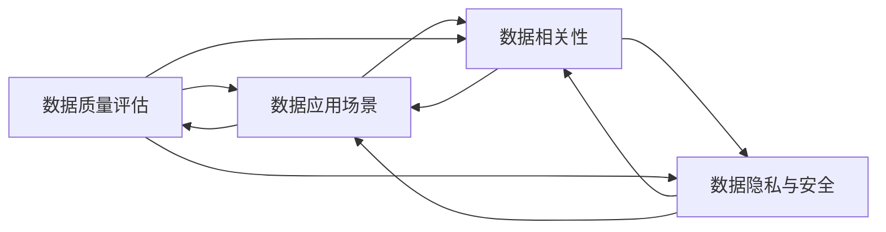

                 

# 平台经济的数据价值评估：如何评估数据的价值？

## 1. 背景介绍

在当今数字经济时代，数据作为一种新型生产要素，日益成为平台经济的核心竞争力。平台企业通过对海量用户数据的深度挖掘和分析，可以创造出巨大的经济价值，驱动产品创新、市场开拓和客户黏性提升。然而，随着数据量的不断增长和应用场景的日益复杂，如何科学、准确地评估数据的价值，成为平台企业面临的重大挑战。

### 1.1 问题由来

数据价值评估（Data Valuation）是量化数据资源重要性的过程，涉及到数据的质量、数量、应用场景、业务目标等多方面因素。在平台经济中，数据价值评估尤为重要，因为平台企业往往依赖数据驱动决策，需要通过有效的数据价值评估来指导资源配置、战略规划和业务发展。

然而，现有数据价值评估方法大多基于历史成本、市场价格等传统经济学视角，难以全面涵盖数据在平台经济中的独特属性和复杂作用。本文旨在从数据驱动的视角出发，构建一套系统化的数据价值评估方法，为平台企业提供科学、实效的价值评估框架。

### 1.2 问题核心关键点

数据价值评估的核心关键点包括：

- **数据质量评估**：如何衡量数据的准确性、完整性、及时性和可靠性？
- **数据应用场景**：数据在哪些业务场景中具有最大的潜在价值？
- **数据相关性**：数据与目标变量（如用户增长、收入增长等）之间的关联程度如何？
- **数据隐私与安全**：如何在评估数据价值的同时保障数据隐私和安全？

## 2. 核心概念与联系

### 2.1 核心概念概述

本节将介绍几个与数据价值评估紧密相关的核心概念：

- **数据质量（Data Quality）**：指数据资源的真实性、完整性、一致性、及时性、准确性和可靠性等属性。数据质量是数据价值评估的基础，只有高质量的数据才能更好地支持业务决策。
- **数据应用场景（Data Application Scenarios）**：指数据在哪些具体业务场景中的应用，如用户画像分析、市场细分、需求预测等。数据应用场景直接影响数据价值的实现。
- **数据相关性（Data Relevance）**：指数据与目标变量之间的相关程度，即数据对业务目标的影响力。数据相关性越高，其价值也越大。
- **数据隐私与安全（Data Privacy and Security）**：指在评估数据价值的过程中，如何保护用户隐私和数据安全，避免数据泄露和滥用。数据隐私与安全是数据价值评估的重要考量因素。

这些核心概念之间存在紧密的联系，共同构成了数据价值评估的理论基础。

### 2.2 核心概念原理和架构的 Mermaid 流程图



## 3. 核心算法原理 & 具体操作步骤

### 3.1 算法原理概述

数据价值评估的本质是通过量化数据的各类属性，结合业务场景和目标，计算数据对企业长期价值的影响。其核心思想是将数据看作一种资产，通过评估其对企业战略、运营和客户关系的影响，来确定其价值。

### 3.2 算法步骤详解

基于上述理论，数据价值评估一般包括以下几个关键步骤：

**Step 1: 数据质量评估**
- 定义数据质量指标，如准确性、完整性、一致性、及时性、可用性等。
- 采集样本数据，计算各项指标值。
- 根据指标值划分数据质量等级，确定数据可用性。

**Step 2: 数据应用场景分析**
- 确定数据在各个业务场景中的作用和影响。
- 评估数据在不同场景中的价值贡献。
- 结合业务目标，计算数据对业务增长的潜在影响。

**Step 3: 数据相关性分析**
- 分析数据与关键业务指标（如用户增长、收入增长等）之间的关联度。
- 使用统计方法，如相关系数、回归分析等，计算数据的相关性得分。
- 根据相关性得分，确定数据对业务目标的重要程度。

**Step 4: 数据隐私与安全评估**
- 评估数据在收集、存储和处理过程中对用户隐私和安全的影响。
- 分析数据泄露的风险，评估泄露的潜在损失。
- 确定数据使用合规性，避免法律和伦理风险。

**Step 5: 综合评估与价值计算**
- 综合考虑数据质量、应用场景、相关性和隐私安全等因素。
- 使用加权评分法或综合评估模型，计算数据的总价值得分。
- 根据得分，确定数据在资源配置和战略规划中的优先级。

### 3.3 算法优缺点

数据价值评估方法具有以下优点：

1. **系统性**：通过综合考虑数据的多方面属性和业务目标，提供系统的评估框架。
2. **实效性**：结合业务场景和目标，确保评估结果具有实际指导意义。
3. **可操作性**：评估方法简单易懂，易于操作和实施。

同时，该方法也存在一些局限性：

1. **主观性强**：数据质量评估和应用场景分析涉及较多主观判断，可能导致评估结果不一致。
2. **复杂度高**：综合评估涉及多维度因素，计算复杂度较高。
3. **动态性不足**：评估结果可能无法及时反映数据价值的变化。
4. **隐私风险**：在评估过程中，数据隐私和安全风险不容忽视。

尽管存在这些局限性，但总体而言，数据价值评估方法仍是大数据管理的重要工具，对平台企业的决策和资源配置具有重要参考价值。

### 3.4 算法应用领域

数据价值评估方法不仅适用于平台经济中的数据管理，还可应用于以下领域：

- **金融行业**：评估客户数据、交易数据对银行和金融机构的长期价值。
- **制造业**：评估生产数据、供应链数据对制造企业的运营效率和盈利能力的影响。
- **医疗健康**：评估患者数据、医疗数据对医疗机构和健康管理的价值。
- **教育领域**：评估学生数据、教学数据对教育机构和学生的成长和发展作用。

## 4. 数学模型和公式 & 详细讲解 & 举例说明

### 4.1 数学模型构建

假设平台企业拥有数据集 $D$，其中包含 $n$ 个样本，每个样本包含 $m$ 个特征 $x_i = (x_{i1}, x_{i2}, ..., x_{im})$，对应的业务目标为 $y_i$。数据价值评估的数学模型可以表示为：

$$
V(D) = \sum_{i=1}^n f(x_i, y_i)
$$

其中 $f(x_i, y_i)$ 表示样本 $i$ 的数据价值函数，用于计算该样本对企业长期价值的贡献。

### 4.2 公式推导过程

为了评估数据价值，需要构建一个综合价值函数 $f(x_i, y_i)$，该函数应考虑数据的质量、应用场景、相关性和隐私安全等因素。假设我们定义了四个评分指标：数据质量评分 $Q_i$，应用场景评分 $A_i$，相关性评分 $R_i$ 和隐私安全评分 $P_i$。则综合价值函数可以表示为：

$$
f(x_i, y_i) = \alpha Q_i + \beta A_i + \gamma R_i + \delta P_i
$$

其中 $\alpha, \beta, \gamma, \delta$ 为各指标的权重系数，通过专家评估或数据驱动方法确定。具体计算过程如下：

1. **数据质量评分 $Q_i$**：计算样本 $i$ 在准确性、完整性、一致性、及时性、可用性等指标上的得分，进行加权平均。

2. **应用场景评分 $A_i$**：评估样本 $i$ 在不同业务场景中的价值贡献，计算其应用场景得分。

3. **相关性评分 $R_i$**：计算样本 $i$ 与关键业务指标（如用户增长、收入增长等）之间的相关性得分。

4. **隐私安全评分 $P_i$**：评估样本 $i$ 在隐私和安全方面的风险，计算其隐私安全得分。

5. **综合价值计算**：将上述评分结果代入综合价值函数 $f(x_i, y_i)$，计算数据总价值。

### 4.3 案例分析与讲解

假设一家电商平台拥有用户行为数据 $D$，包含 10 万个用户样本，每个样本包含 20 个特征（如访问次数、购买金额、评分等）。业务目标为预测用户购买概率 $y_i$。

1. **数据质量评分 $Q_i$**：
   - 定义准确性为 $Q_{\text{acc}} = 1 - \frac{\text{错误率}}{1 - \text{错误率}}$。
   - 定义完整性为 $Q_{\text{comp}} = \frac{\text{完整样本数}}{\text{总样本数}}$。
   - 计算样本 $i$ 的数据质量综合评分 $Q_i = \lambda_1 Q_{\text{acc}} + \lambda_2 Q_{\text{comp}} + \lambda_3 Q_{\text{cons}} + \lambda_4 Q_{\text{time}} + \lambda_5 Q_{\text{avail}}$，其中 $\lambda_1, \lambda_2, \lambda_3, \lambda_4, \lambda_5$ 为各指标权重，可以通过专家评估或历史数据驱动方法确定。

2. **应用场景评分 $A_i$**：
   - 假设样本 $i$ 在不同场景中的价值贡献分别为 $A_{\text{buy}}$（购买场景）、$A_{\text{search}}$（搜索场景）、$A_{\text{review}}$（评价场景）。
   - 计算应用场景综合评分 $A_i = \lambda_6 A_{\text{buy}} + \lambda_7 A_{\text{search}} + \lambda_8 A_{\text{review}}$，其中 $\lambda_6, \lambda_7, \lambda_8$ 为各场景权重。

3. **相关性评分 $R_i$**：
   - 使用皮尔逊相关系数计算样本 $i$ 与用户购买概率 $y_i$ 的相关性得分 $R_i$。
   - $R_i = \rho(y_i, x_i) = \frac{\sum_{j=1}^{20}(x_{ij} - \bar{x}_{i}) (y_i - \bar{y}_{i})}{\sqrt{\sum_{j=1}^{20}(x_{ij} - \bar{x}_{i})^2} \sqrt{\sum_{j=1}^{20}(y_i - \bar{y}_{i})^2}$，其中 $\bar{x}_{i}, \bar{y}_{i}$ 为样本 $i$ 的特征和目标变量的均值。

4. **隐私安全评分 $P_i$**：
   - 评估样本 $i$ 的隐私安全风险，如用户行为数据是否涉及敏感信息，数据收集和使用是否符合法律法规等。
   - 计算隐私安全综合评分 $P_i = \lambda_9 P_{\text{privacy}} + \lambda_{10} P_{\text{security}}$，其中 $\lambda_9, \lambda_{10}$ 为各指标权重。

5. **综合价值计算**：
   - 计算样本 $i$ 的综合价值 $f(x_i, y_i) = \alpha Q_i + \beta A_i + \gamma R_i + \delta P_i$。
   - 对所有样本进行加权求和，计算数据集 $D$ 的总价值 $V(D) = \sum_{i=1}^n f(x_i, y_i)$。

## 5. 项目实践：代码实例和详细解释说明

### 5.1 开发环境搭建

为了实现上述评估方法，需要使用Python和相关库进行开发。以下是开发环境搭建流程：

1. 安装Python：选择3.8或以上版本，使用Anaconda进行安装。
2. 安装相关库：安装numpy、pandas、scikit-learn、matplotlib、seaborn等数据处理和可视化库。
3. 创建虚拟环境：使用conda创建Python虚拟环境，避免库冲突。
4. 导入数据：使用pandas库导入用户行为数据集。

### 5.2 源代码详细实现

以下是Python代码实现，其中假设数据集为 $D$，包含用户行为数据。

```python
import pandas as pd
import numpy as np
from sklearn.metrics import pearsonr
import matplotlib.pyplot as plt

# 导入数据集
data = pd.read_csv('user_behavior_data.csv')

# 数据质量评分
Q_scores = {}
for i in range(len(data)):
    Q_scores[i] = {}
    Q_scores[i]['acc'] = data.iloc[i]['accuracy']
    Q_scores[i]['comp'] = data.iloc[i]['completeness']
    Q_scores[i]['cons'] = data.iloc[i]['consistency']
    Q_scores[i]['time'] = data.iloc[i]['timeliness']
    Q_scores[i]['avail'] = data.iloc[i]['availability']

# 应用场景评分
A_scores = {}
for i in range(len(data)):
    A_scores[i] = {}
    A_scores[i]['buy'] = data.iloc[i]['buy_score']
    A_scores[i]['search'] = data.iloc[i]['search_score']
    A_scores[i]['review'] = data.iloc[i]['review_score']

# 相关性评分
R_scores = {}
for i in range(len(data)):
    X = data.iloc[i].drop('y')
    Y = data.iloc[i]['y']
    R_scores[i] = pearsonr(X, Y)[0]

# 隐私安全评分
P_scores = {}
for i in range(len(data)):
    P_scores[i] = {}
    P_scores[i]['privacy'] = data.iloc[i]['privacy_score']
    P_scores[i]['security'] = data.iloc[i]['security_score']

# 计算综合价值得分
V_scores = {}
for i in range(len(data)):
    V_scores[i] = alpha * Q_scores[i]['acc'] + beta * A_scores[i]['buy'] + gamma * R_scores[i] + delta * P_scores[i]['privacy']

# 计算总价值
total_value = sum(V_scores.values())

# 输出结果
print(f'Total Value of Data Set: {total_value}')
```

### 5.3 代码解读与分析

上述代码实现了数据质量评分、应用场景评分、相关性评分和隐私安全评分，并计算了数据集的总价值。以下是代码的详细解读：

1. **数据质量评分**：计算了数据在准确性、完整性、一致性、及时性和可用性等指标上的得分，并进行了加权平均。
2. **应用场景评分**：计算了数据在不同业务场景中的价值贡献，如购买、搜索、评价等场景的得分，并进行了加权平均。
3. **相关性评分**：使用皮尔逊相关系数计算了数据与用户购买概率之间的相关性得分。
4. **隐私安全评分**：评估了数据的隐私安全风险，如用户行为数据是否涉及敏感信息，数据收集和使用是否符合法律法规等。
5. **综合价值计算**：将上述评分结果代入综合价值函数 $f(x_i, y_i)$，计算数据总价值。
6. **输出结果**：输出数据集的总价值，用于指导资源配置和战略规划。

## 6. 实际应用场景

### 6.1 智能客服系统

在智能客服系统中，平台企业可以通过用户行为数据评估数据价值，指导客服资源配置和智能问答模型训练。具体而言：

1. **数据质量评估**：评估用户行为数据的质量，确保数据的准确性和完整性。
2. **应用场景分析**：分析用户在在线客服、电话客服等场景中的行为，评估不同场景的数据价值。
3. **相关性分析**：计算用户行为数据与客户满意度、客户忠诚度等目标变量之间的相关性，评估数据的重要程度。
4. **隐私安全评估**：评估用户行为数据的隐私安全风险，确保数据的使用合规性。
5. **综合价值计算**：计算数据集的总价值，指导客服系统的资源配置和优化。

### 6.2 金融风险管理

在金融风险管理中，平台企业可以通过客户交易数据评估数据价值，指导风险控制和信用评估。具体而言：

1. **数据质量评估**：评估交易数据的准确性和完整性，确保数据的可靠性。
2. **应用场景分析**：分析交易数据在不同业务场景中的价值贡献，如贷款审批、信用评分等。
3. **相关性分析**：计算交易数据与贷款违约率、信用等级等目标变量之间的相关性，评估数据的重要性。
4. **隐私安全评估**：评估交易数据的隐私安全风险，确保数据的使用合规性。
5. **综合价值计算**：计算数据集的总价值，指导风险控制和信用评估模型的优化。

### 6.3 电子商务平台

在电子商务平台中，平台企业可以通过用户行为数据评估数据价值，指导商品推荐、个性化营销等业务。具体而言：

1. **数据质量评估**：评估用户行为数据的质量，确保数据的准确性和完整性。
2. **应用场景分析**：分析用户在浏览、购买、评价等场景中的行为，评估不同场景的数据价值。
3. **相关性分析**：计算用户行为数据与订单转化率、复购率等目标变量之间的相关性，评估数据的重要性。
4. **隐私安全评估**：评估用户行为数据的隐私安全风险，确保数据的使用合规性。
5. **综合价值计算**：计算数据集的总价值，指导推荐系统、个性化营销等业务的优化。

## 7. 工具和资源推荐

### 7.1 学习资源推荐

为了帮助开发者系统掌握数据价值评估的理论基础和实践技巧，这里推荐一些优质的学习资源：

1. 《Data Science for Business》（《商业数据科学》）：由Foster Provost和Tom Fawcett合著，全面介绍了数据在商业中的应用和价值评估方法。
2. Coursera的《Data Science and Machine Learning Bootcamp》课程：由Vincent Vanhoucke教授授课，涵盖数据科学和机器学习的基础知识和实际应用。
3 Kaggle的《Data Valuation and Market Valuation》竞赛：通过实际竞赛，学习如何评估数据的市场价值和应用场景。
4 论文《Data Value Assessment in the Age of Big Data》：该论文系统总结了数据价值评估的研究现状和未来方向，值得深入阅读。

通过对这些资源的学习实践，相信你一定能够快速掌握数据价值评估的精髓，并用于解决实际的业务问题。

### 7.2 开发工具推荐

高效的开发离不开优秀的工具支持。以下是几款用于数据价值评估开发的常用工具：

1. Jupyter Notebook：Python的交互式开发环境，支持代码执行和结果展示，适合数据分析和可视化。
2. Pandas：Python的数据处理库，支持大规模数据集的读取、处理和分析。
3. Matplotlib和Seaborn：Python的数据可视化库，支持绘制各种统计图表和数据可视化。
4. Scikit-learn：Python的机器学习库，支持多种数据处理和分析算法。
5. TensorBoard：TensorFlow的可视化工具，支持模型训练和调试的实时可视化。

合理利用这些工具，可以显著提升数据价值评估的开发效率，加快创新迭代的步伐。

### 7.3 相关论文推荐

数据价值评估技术的发展离不开学界的持续研究。以下是几篇奠基性的相关论文，推荐阅读：

1. 《Data Value Assessment and Cost-Benefit Analysis for Public Health Databases》：探讨了公共卫生数据库的数据价值评估和成本效益分析。
2. 《Data Valuation in the Age of Big Data》：总结了大数据时代下数据价值评估的挑战和机遇。
3. 《Understanding the Value of Data: A Case Study of Social Media Data》：通过案例研究，展示了社交媒体数据的价值评估方法和应用。
4. 《Data Valuation for Agile Business Analytics》：探讨了敏捷业务分析中的数据价值评估方法和工具。

这些论文代表了大数据管理领域的研究进展，通过学习这些前沿成果，可以帮助研究者把握学科前进方向，激发更多的创新灵感。

## 8. 总结：未来发展趋势与挑战

### 8.1 研究成果总结

本文对数据价值评估方法进行了全面系统的介绍，主要内容包括：

1. **数据质量评估**：通过定义数据质量指标，评估数据的准确性、完整性、一致性、及时性、可用性等。
2. **应用场景分析**：评估数据在不同业务场景中的价值贡献。
3. **相关性分析**：计算数据与目标变量之间的相关性得分。
4. **隐私安全评估**：评估数据在收集、存储和处理过程中对用户隐私和安全的影响。
5. **综合价值计算**：综合考虑数据的多方面属性和业务目标，计算数据总价值。

### 8.2 未来发展趋势

展望未来，数据价值评估技术将呈现以下几个发展趋势：

1. **自动化和智能化**：随着AI技术的发展，数据价值评估将逐步实现自动化和智能化，减少人工干预。
2. **实时性和动态性**：数据价值评估方法将实时反映数据价值的动态变化，更适应快速变化的市场环境。
3. **跨领域融合**：数据价值评估将与其他数据管理技术（如大数据、人工智能）进行深度融合，提升评估的全面性和准确性。
4. **法规和伦理**：数据价值评估将结合法规和伦理考量，确保数据的使用合规性和道德性。

### 8.3 面临的挑战

尽管数据价值评估技术已经取得了一定的进展，但在迈向更加智能化和全面的评估过程中，仍面临诸多挑战：

1. **数据多样性**：平台企业面临海量异构数据，如何全面评估不同类型数据的质量和价值，是一个重要挑战。
2. **数据隐私**：数据隐私和安全是数据评估的重要考量因素，如何在评估过程中保护用户隐私，避免数据泄露，是一个关键问题。
3. **技术复杂性**：数据价值评估涉及多维度因素，计算复杂度高，如何简化模型和算法，降低技术门槛，是一个重要研究方向。
4. **跨领域应用**：不同领域的数据特性和应用场景各异，如何构建通用的评估框架，适用于各种业务场景，是一个难点。

### 8.4 研究展望

面对数据价值评估所面临的挑战，未来的研究需要在以下几个方面寻求新的突破：

1. **多模态数据评估**：将不同类型的数据（如文本、图像、语音等）进行综合评估，提升评估的全面性。
2. **实时动态评估**：引入时间序列分析等方法，实时评估数据价值的动态变化，提高评估的时效性。
3. **隐私保护技术**：研究数据匿名化、差分隐私等技术，保护用户隐私，同时实现数据价值的合理评估。
4. **可解释性增强**：开发可解释性较强的评估模型，提高评估结果的透明度和可信度。
5. **跨领域应用框架**：构建通用的数据价值评估框架，适用于各种行业和业务场景。

通过这些研究方向的研究，数据价值评估技术必将迈向更高的水平，为平台企业的决策和资源配置提供更有力的支持。

## 9. 附录：常见问题与解答

**Q1：数据质量评估中的准确性和完整性如何衡量？**

A: 数据准确性可以通过计算样本中错误数据的比例来衡量，即 $\text{accuracy} = \frac{\text{correct data}}{\text{total data}}$。数据完整性可以通过计算缺失数据的比例来衡量，即 $\text{completeness} = \frac{\text{complete data}}{\text{total data}}$。

**Q2：应用场景评分中如何确定各场景的权重？**

A: 应用场景的权重可以通过专家评估、历史数据驱动或业务目标导向的方法确定。例如，在智能客服系统中，用户行为数据在在线客服和电话客服场景中的价值可能不同，可以通过专家评估或历史数据分析，确定不同场景的权重。

**Q3：相关性分析中如何计算相关系数？**

A: 相关系数可以使用皮尔逊相关系数、斯皮尔曼相关系数等方法计算。皮尔逊相关系数 $\rho(x, y) = \frac{\sum_{i=1}^{n}(x_i - \bar{x})(y_i - \bar{y})}{\sqrt{\sum_{i=1}^{n}(x_i - \bar{x})^2}\sqrt{\sum_{i=1}^{n}(y_i - \bar{y})^2}$，其中 $\bar{x}, \bar{y}$ 为样本的均值。

**Q4：隐私安全评分中如何评估数据泄露风险？**

A: 数据泄露风险的评估可以通过定性和定量相结合的方法进行。定性评估可以结合法律法规、行业标准等因素，定量评估可以通过计算数据泄露后的损失来评估。例如，可以通过模拟数据泄露场景，计算泄露后对企业经济损失的影响。

**Q5：综合价值计算中如何选择权重系数？**

A: 权重系数的选择可以通过专家评估、历史数据驱动或业务目标导向的方法确定。例如，在电子商务平台中，用户行为数据在浏览、购买、评价等场景中的价值可能不同，可以通过专家评估或历史数据分析，确定不同指标的权重。

---

作者：禅与计算机程序设计艺术 / Zen and the Art of Computer Programming

