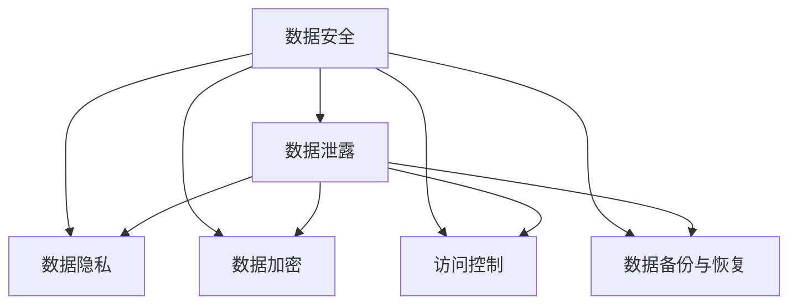

                 

# 平台经济的数据安全风险：如何防范数据泄露？

在平台经济时代，数据是最核心的资产之一。无论是在线零售、金融服务、社交媒体，还是在医疗健康、教育娱乐等领域，数据都扮演着至关重要的角色。平台经济的健康发展，离不开数据的收集、存储、处理和传输。然而，数据泄露事件频发，给平台带来了巨大风险，甚至对消费者隐私和公共安全构成严重威胁。本文将深入探讨平台经济的数据安全风险，并提出切实可行的防范策略，以保护数据安全。

## 1. 背景介绍

### 1.1 问题由来

随着互联网的普及和数字经济的兴起，平台经济迅速崛起，成为全球经济的重要组成部分。平台经济通过连接供需双方，优化资源配置，极大地推动了生产力发展。但与此同时，平台经济也带来了数据安全风险。数据泄露事件频发，包括数据被非法获取、篡改、滥用等，对个人隐私、企业运营乃至国家安全都构成了严重威胁。

近年来，全球范围内多次出现大规模数据泄露事件，如2017年的Equifax数据泄露事件，涉及1.43亿用户的个人信息；2018年的Facebook数据泄露事件，导致5000万用户数据被滥用。这些事件警示我们，数据安全问题不容忽视，必须采取有效措施加以防范。

### 1.2 问题核心关键点

平台经济中的数据安全风险主要包括以下几个方面：

1. **数据集中化**：大量数据集中存储在平台方，增加了数据泄露的风险。
2. **数据共享与交叉**：平台之间为了提升服务质量，会进行数据共享和交叉，增加了数据泄露的概率。
3. **数据滥用**：数据被非法获取后，可能被用于广告投放、个性化推荐、信用评估等非授权用途。
4. **技术漏洞**：系统架构设计不合理、代码漏洞等问题，会导致数据泄露。
5. **内部人员威胁**：内部人员的恶意行为（如内部数据贩卖）也会导致数据泄露。

### 1.3 问题研究意义

研究平台经济的数据安全风险，对于提升平台经济的安全性和可信度，保护消费者隐私，维护公共利益具有重要意义：

1. **提升平台经济安全性**：通过防范数据泄露，保障平台数据的安全，增强平台经济的稳定性。
2. **保护消费者隐私**：确保用户数据不被滥用，保护用户隐私，增强用户信任。
3. **维护公共利益**：防止数据泄露带来的社会问题，如诈骗、隐私侵害等，维护社会稳定。
4. **促进法规合规**：保障数据安全是各国法律法规的重要要求，遵循法规要求可以避免法律风险。

## 2. 核心概念与联系

### 2.1 核心概念概述

为更好地理解平台经济中的数据安全风险及其防范策略，本节将介绍几个密切相关的核心概念：

- **数据安全**：保护数据免遭未授权访问、使用、修改或泄露的过程。数据安全是平台经济中最重要的安全领域之一。
- **数据泄露**：指数据未经授权被非法获取或暴露的过程。数据泄露可能导致个人隐私泄露、企业商业机密外泄等严重后果。
- **数据隐私**：指个人数据的保密性和个人控制权，确保用户信息不被滥用。数据隐私是数据安全的重要组成部分。
- **数据加密**：通过加密技术将数据转换成不可读的格式，确保数据在传输和存储过程中的安全性。
- **访问控制**：通过身份验证和授权机制，控制数据访问权限，确保只有授权用户可以访问数据。
- **数据备份与恢复**：定期备份数据，以便在数据丢失或泄露后，能够快速恢复数据，降低损失。

这些核心概念之间的逻辑关系可以通过以下Mermaid流程图来展示：



这个流程图展示了数据安全的核心概念及其之间的关系：

1. 数据安全通过数据隐私、数据加密、访问控制等手段，保障数据不被泄露。
2. 数据泄露一旦发生，将影响数据隐私、数据加密和访问控制，需要采取数据备份与恢复等措施进行补救。

## 3. 核心算法原理 & 具体操作步骤

### 3.1 算法原理概述

平台经济中的数据安全防范，主要基于以下几个核心算法原理：

- **数据加密**：通过对称加密、非对称加密、哈希算法等技术，确保数据在传输和存储过程中的安全性。
- **访问控制**：基于身份验证和授权机制，控制数据访问权限，确保只有授权用户可以访问数据。
- **数据备份与恢复**：定期备份数据，以便在数据丢失或泄露后，能够快速恢复数据，降低损失。
- **安全审计**：定期对系统进行安全审计，发现并修复漏洞，确保系统安全。
- **异常检测**：使用机器学习等技术，实时监测数据访问行为，及时发现异常情况。

这些算法原理通过合理的技术手段，可以有效防范数据泄露，保障数据安全。

### 3.2 算法步骤详解

基于上述算法原理，平台经济中的数据安全防范步骤可以分为以下几个关键步骤：

**Step 1: 数据加密与脱敏**
- 对于敏感数据，采用加密技术进行加密处理。常用的加密算法包括AES、RSA、SHA等。
- 对于非敏感数据，可以采用数据脱敏技术，去除或模糊化部分敏感信息。

**Step 2: 访问控制策略**
- 设计合理的访问控制策略，明确不同用户、不同角色对数据的访问权限。
- 采用基于角色的访问控制(RBAC)、属性基访问控制(ABAC)等策略，确保数据访问的细粒度控制。

**Step 3: 数据备份与恢复**
- 定期备份关键数据，存储在独立的安全存储区域，确保备份数据的安全。
- 建立数据恢复机制，确保在数据丢失或泄露后，能够快速恢复数据，最小化损失。

**Step 4: 安全审计与漏洞修复**
- 定期对系统进行安全审计，发现潜在的安全漏洞和风险。
- 根据审计结果，及时修复系统漏洞，加强系统安全防护。

**Step 5: 异常检测与响应**
- 使用机器学习、人工智能等技术，实时监测数据访问行为，识别异常情况。
- 对异常情况进行及时响应，如告警、隔离等，确保系统安全。

### 3.3 算法优缺点

数据安全防范技术具有以下优点：

1. 增强系统安全性：通过加密、访问控制等手段，可以有效防止数据泄露，增强系统安全性。
2. 保障用户隐私：数据加密和访问控制可以保护用户隐私，防止数据滥用。
3. 降低数据泄露风险：数据备份与恢复机制，可以在数据泄露后快速恢复数据，降低损失。

同时，这些技术也存在一些局限性：

1. 技术复杂度高：加密和访问控制等技术复杂度高，实施成本较高。
2. 性能影响：加密和解密等操作会消耗额外的计算资源，影响系统性能。
3. 用户接受度：部分用户可能对数据加密和脱敏技术接受度不高，影响用户体验。

### 3.4 算法应用领域

数据安全防范技术广泛应用于各个领域，如金融、电商、医疗、教育等。具体应用如下：

- **金融行业**：保护客户交易数据、个人信息等，防止数据泄露。
- **电商行业**：保护用户购物数据、交易记录等，防止数据滥用。
- **医疗行业**：保护患者病历、医疗记录等，防止数据滥用和泄露。
- **教育行业**：保护学生个人信息、成绩等，防止数据泄露。

## 4. 数学模型和公式 & 详细讲解 & 举例说明

### 4.1 数学模型构建

本节将使用数学语言对数据安全防范技术的核心算法进行更加严格的刻画。

设平台经济中的数据集为 $D=\{d_i\}_{i=1}^N$，其中 $d_i=(x_i,y_i)$，$x_i$ 为数据，$y_i$ 为标签。假设数据泄露事件为 $A$，即 $d_i$ 被非法获取或暴露的概率为 $P(A|d_i)$。

定义平台的安全策略为 $S=\{s_t\}_{t=1}^T$，其中 $s_t$ 为策略 $t$ 的参数。数据泄露概率与策略的关系为：

$$
P(A|d_i,S) = f(d_i,S)
$$

数据泄露事件的概率分布为 $P(A|D,S)$，通过贝叶斯定理可以计算出在特定策略 $S$ 下，数据泄露事件的概率：

$$
P(A|D,S) = \int_{D} f(d_i,S) \cdot P(d_i|D,S) \cdot P(D|S) \, \mathrm{d}d_i
$$

其中 $P(d_i|D,S)$ 为数据 $d_i$ 在特定策略 $S$ 下的先验概率，$P(D|S)$ 为数据集 $D$ 在特定策略 $S$ 下的先验概率。

### 4.2 公式推导过程

以下我们以数据加密为例，推导加密算法的基本公式。

假设平台需要保护的数据为 $d_i=(x_i,y_i)$，采用对称加密算法 $E_k(x_i)$ 进行加密处理，其中 $k$ 为加密密钥。加密后的数据为 $e_i=E_k(x_i)$。

接收方接收到加密后的数据 $e_i$，通过解密算法 $D_k(e_i)$ 还原出原始数据 $x_i$。解密算法满足：

$$
D_k(E_k(x_i)) = x_i
$$

设加密算法和解密算法都具有高度安全性，即攻击者无法通过已知加密算法和解密算法，破解出加密密钥 $k$。假设攻击者对数据 $d_i$ 的已知信息为 $B$，则破解加密数据 $e_i$ 的概率为：

$$
P(B|e_i) = \frac{P(B|d_i)}{P(B|e_i|d_i)}
$$

其中 $P(B|d_i)$ 为攻击者已知信息 $B$ 在数据 $d_i$ 下的条件概率，$P(B|e_i|d_i)$ 为攻击者已知信息 $B$ 在加密数据 $e_i$ 下的条件概率。

在理想情况下，假设加密算法和解密算法具有完美安全性，即：

$$
P(B|e_i|d_i) = 0
$$

因此，破解加密数据 $e_i$ 的概率为：

$$
P(B|e_i) = \frac{P(B|d_i)}{0} = \infty
$$

这表明，在采用完美安全性的加密算法和解密算法时，攻击者无法破解加密数据 $e_i$，数据的安全性得到了充分保障。

### 4.3 案例分析与讲解

以金融行业为例，分析数据加密和访问控制技术在防范数据泄露中的具体应用。

假设某银行有客户交易数据 $D=\{d_i\}_{i=1}^N$，其中 $d_i=(x_i,y_i)$，$x_i$ 为交易记录，$y_i$ 为交易状态（如成功、失败等）。为了保护客户交易数据，银行可以采用以下措施：

1. **数据加密**：对交易记录 $x_i$ 进行对称加密，生成加密数据 $e_i=E_k(x_i)$。
2. **访问控制**：定义不同角色（如管理员、审计员）对数据的访问权限，只有授权角色才能访问加密数据 $e_i$。

具体步骤如下：

**Step 1: 数据加密**
- 选择一种安全性较高的加密算法（如AES），生成随机加密密钥 $k$。
- 对每个交易记录 $x_i$ 进行加密，生成加密数据 $e_i=E_k(x_i)$。

**Step 2: 访问控制**
- 定义管理员角色可以访问加密数据 $e_i$，审计员角色只能访问解密后的数据 $x_i$。
- 系统记录每个用户对数据的访问行为，如访问时间、访问数据等，进行实时监测。

通过上述措施，银行可以有效保护客户交易数据的安全，防止数据泄露。

## 5. 项目实践：代码实例和详细解释说明

### 5.1 开发环境搭建

在进行数据安全防范实践前，我们需要准备好开发环境。以下是使用Python进行加密和访问控制开发的示例环境配置流程：

1. 安装Anaconda：从官网下载并安装Anaconda，用于创建独立的Python环境。

2. 创建并激活虚拟环境：
```bash
conda create -n security-env python=3.8 
conda activate security-env
```

3. 安装PyTorch：根据CUDA版本，从官网获取对应的安装命令。例如：
```bash
conda install pytorch torchvision torchaudio cudatoolkit=11.1 -c pytorch -c conda-forge
```

4. 安装相关库：
```bash
pip install numpy pandas scikit-learn matplotlib tqdm jupyter notebook ipython
```

完成上述步骤后，即可在`security-env`环境中开始数据安全防范实践。

### 5.2 源代码详细实现

下面我们以银行客户交易数据为例，给出使用PyTorch进行数据加密和访问控制的Python代码实现。

首先，定义数据加密函数：

```python
import torch
from torch import nn

class AES(nn.Module):
    def __init__(self, key_length=16):
        super(AES, self).__init__()
        self.key_length = key_length
        self.key = torch.randint(0, 256, (key_length,)).view(1, -1)

    def forward(self, x):
        key = self.key.to(x.device)
        return torch.nn.functional.linear(x, key)

# 定义数据加密函数
def encrypt(data, key_length=16):
    aes = AES(key_length=key_length)
    return aes(data)

# 生成随机加密密钥
def generate_key(key_length=16):
    return torch.randint(0, 256, (key_length,)).view(1, -1)

# 测试加密函数
data = torch.randn(1, 10)
key = generate_key()
encrypted_data = encrypt(data, key_length=key.size(0))
print("Original Data:", data)
print("Encrypted Data:", encrypted_data)
```

然后，定义访问控制函数：

```python
class RoleBasedAccessControl:
    def __init__(self):
        self.allowed_roles = {"admin": True, "audit": False}

    def is_allowed(self, role, access):
        return self.allowed_roles[role] and access

# 定义访问控制函数
def access_control(data, role, access):
    rbac = RoleBasedAccessControl()
    if rbac.is_allowed(role, access):
        return data
    else:
        return None

# 测试访问控制函数
data = torch.randn(1, 10)
role = "admin"
access = True
decrypted_data = access_control(data, role, access)
print("Decrypted Data:", decrypted_data)
```

在上述代码中，我们首先定义了一个AES加密模型和一个访问控制类。然后，通过生成随机密钥进行数据加密，并通过访问控制类判断用户角色和访问权限。最后，测试加密和访问控制函数，确保数据的安全性和访问控制的效果。

### 5.3 代码解读与分析

让我们再详细解读一下关键代码的实现细节：

**AES模型**：
- `AES`类：定义了AES加密模型，继承自`nn.Module`。
- `__init__`方法：初始化加密模型的密钥长度。
- `forward`方法：实现加密操作，使用线性变换对数据进行加密。

**数据加密函数**：
- `encrypt`函数：使用AES模型对数据进行加密处理。
- `generate_key`函数：生成随机密钥，用于加密操作。

**访问控制函数**：
- `RoleBasedAccessControl`类：定义了基于角色的访问控制策略。
- `__init__`方法：初始化访问控制策略。
- `is_allowed`方法：判断用户角色和访问权限。
- `access_control`函数：调用访问控制策略，判断用户是否允许访问数据。

**测试代码**：
- 生成随机数据和密钥。
- 使用加密函数对数据进行加密处理。
- 使用访问控制函数判断用户是否允许访问数据。

可以看到，通过Python和PyTorch，我们可以实现数据加密和访问控制的基本功能，为实际应用中的数据安全防范提供参考。

当然，实际应用中还需要考虑更多因素，如用户认证、密钥管理等，才能构建完整的数据安全防范系统。但核心的加密和访问控制算法，可以为我们提供良好的思路和方法。

## 6. 实际应用场景

### 6.1 智能客服系统

智能客服系统需要处理大量的客户对话数据，这些数据可能包含敏感信息，如银行账户、身份证号等。为了保护用户隐私，智能客服系统需要采取数据加密和访问控制等措施，确保数据安全。

具体来说，智能客服系统可以采用以下策略：

- **数据加密**：对客户对话数据进行加密处理，确保数据在存储和传输过程中的安全性。
- **访问控制**：控制客服系统内部人员对数据访问的权限，确保只有授权人员才能访问敏感数据。

通过这些措施，智能客服系统可以保护用户数据的安全，防止数据泄露。

### 6.2 在线金融平台

在线金融平台处理大量的用户交易数据和个人信息，数据泄露可能带来严重的法律和经济损失。为了保护用户数据，在线金融平台需要采取数据加密和访问控制等措施，确保数据安全。

具体来说，在线金融平台可以采用以下策略：

- **数据加密**：对交易数据和个人信息进行加密处理，确保数据在存储和传输过程中的安全性。
- **访问控制**：控制平台内部人员对数据访问的权限，确保只有授权人员才能访问敏感数据。

通过这些措施，在线金融平台可以保护用户数据的安全，防止数据泄露。

### 6.3 医疗健康平台

医疗健康平台存储大量的患者病历和医疗记录，数据泄露可能带来严重的隐私和法律问题。为了保护患者隐私，医疗健康平台需要采取数据加密和访问控制等措施，确保数据安全。

具体来说，医疗健康平台可以采用以下策略：

- **数据加密**：对患者病历和医疗记录进行加密处理，确保数据在存储和传输过程中的安全性。
- **访问控制**：控制平台内部人员对数据访问的权限，确保只有授权人员才能访问敏感数据。

通过这些措施，医疗健康平台可以保护患者数据的安全，防止数据泄露。

## 7. 工具和资源推荐

### 7.1 学习资源推荐

为了帮助开发者系统掌握数据安全防范的理论基础和实践技巧，这里推荐一些优质的学习资源：

1. 《网络安全原理与实践》系列博文：由安全专家撰写，深入浅出地介绍了网络安全的核心概念和常用技术，包括数据加密、访问控制等。

2. CS455《网络安全》课程：斯坦福大学开设的网络安全课程，有Lecture视频和配套作业，带你入门网络安全领域的基本概念和经典模型。

3. 《数据加密技术》书籍：全面介绍了数据加密的原理、算法和应用，是数据安全防范的重要参考。

4. NIST《数据保护和隐私增强技术指南》：美国国家标准与技术研究院发布的指南，详细介绍了数据保护和隐私增强的技术和实践。

5. 《数据安全与隐私保护》在线课程：Coursera平台上的在线课程，涵盖数据安全、隐私保护、网络安全等多个方面。

通过对这些资源的学习实践，相信你一定能够快速掌握数据安全防范的精髓，并用于解决实际的数据安全问题。

### 7.2 开发工具推荐

高效的开发离不开优秀的工具支持。以下是几款用于数据安全防范开发的常用工具：

1. Python：Python是数据安全防范开发的主流语言，灵活动态，易于调试。
2. PyTorch：基于Python的深度学习框架，灵活动态的计算图，适合快速迭代研究。
3. AES加密库：Python AES加密库，提供了简单易用的加密算法。
4. OpenSSL：开源安全套接字层库，支持多种加密算法和访问控制技术。
5. Nmap：网络探测工具，用于检测网络和系统漏洞。
6. Wireshark：网络协议分析工具，用于实时监测和分析网络流量。

合理利用这些工具，可以显著提升数据安全防范的开发效率，加快创新迭代的步伐。

### 7.3 相关论文推荐

数据安全防范技术的发展源于学界的持续研究。以下是几篇奠基性的相关论文，推荐阅读：

1. "Cryptography: Modern Engineering Practice" by William Stallings：全面介绍了现代密码学原理和技术，是数据安全防范的入门必读。

2. "The Cryptographic Handbook: Volume 2: Hash Functions and Digital Signatures" by William Stallings：深入探讨了哈希函数和数字签名的原理和应用，是数据加密和访问控制的重要参考。

3. "Security in Computing" by Chellapilla B. Sidhu：全面介绍了计算机安全的基本概念和常用技术，包括数据加密、访问控制等。

4. "Practical Introduction to Data Security and Privacy" by Vishwanath Chandrakumara：介绍了数据安全防范的实践技术和应用场景，是数据安全防范的重要参考。

5. "A Survey on Privacy-Preserving Data Mining" by Li-Tze Lian：详细介绍了隐私保护的数据挖掘技术，为数据安全防范提供了新的思路。

这些论文代表了大数据安全防范技术的发展脉络。通过学习这些前沿成果，可以帮助研究者把握学科前进方向，激发更多的创新灵感。

## 8. 总结：未来发展趋势与挑战

### 8.1 总结

本文对平台经济的数据安全风险进行了全面系统的介绍。首先阐述了数据安全防范的重要性，明确了数据泄露对平台经济带来的风险和挑战。其次，从原理到实践，详细讲解了数据安全防范的数学模型和核心算法，给出了数据加密和访问控制等关键技术的代码实现。同时，本文还广泛探讨了数据安全防范技术在智能客服、在线金融、医疗健康等多个行业领域的应用前景，展示了数据安全防范技术的广阔应用空间。此外，本文精选了数据安全防范技术的各类学习资源，力求为读者提供全方位的技术指引。

通过本文的系统梳理，可以看到，数据安全防范技术在平台经济中具有重要意义，可以有效防范数据泄露，保障数据安全。未来，伴随数据安全防范技术的不断发展，平台经济的安全性和可信度将进一步提升，为消费者提供更安全、更可靠的服务。

### 8.2 未来发展趋势

展望未来，数据安全防范技术将呈现以下几个发展趋势：

1. **人工智能与数据安全结合**：结合人工智能技术，如机器学习和自然语言处理，提升数据安全防范的自动化和智能化水平。
2. **区块链技术应用**：采用区块链技术，确保数据的安全传输和访问控制，增强数据安全防范的效果。
3. **零信任架构**：采用零信任架构，默认所有用户和设备都是不可信的，通过多层次的安全控制措施，确保数据安全。
4. **动态风险评估**：采用动态风险评估技术，实时监测数据访问行为，及时发现异常情况。
5. **隐私保护技术**：采用隐私保护技术，如差分隐私、同态加密等，保护用户隐私的同时确保数据可用性。

以上趋势凸显了数据安全防范技术的广阔前景。这些方向的探索发展，必将进一步提升数据安全防范的自动化和智能化水平，保障平台经济的安全性和可信度。

### 8.3 面临的挑战

尽管数据安全防范技术已经取得了不少成就，但在迈向更加智能化、普适化应用的过程中，它仍面临着诸多挑战：

1. **技术复杂度高**：数据加密、访问控制等技术复杂度高，实施成本较高。
2. **性能影响**：加密和解密等操作会消耗额外的计算资源，影响系统性能。
3. **用户接受度**：部分用户可能对数据加密和脱敏技术接受度不高，影响用户体验。
4. **法律和合规**：不同国家和地区对数据安全有不同的法律和合规要求，需要耗费大量时间和成本进行合规审核。
5. **技术演进**：黑客攻击手段不断演进，数据安全防范技术需要不断更新和升级。

这些挑战需要我们持续关注和应对，以确保数据安全防范技术在实际应用中发挥最大效果。

### 8.4 研究展望

未来，数据安全防范技术需要不断创新和突破，才能应对不断变化的安全威胁。以下是一些可能的研究方向：

1. **新加密算法研究**：开发更加高效、安全的加密算法，提升数据加密和解密的速度和安全性。
2. **访问控制技术改进**：研究基于机器学习的访问控制技术，提升访问控制的自动化和智能化水平。
3. **隐私保护技术创新**：开发新的隐私保护技术，如差分隐私、同态加密等，保护用户隐私的同时确保数据可用性。
4. **跨平台安全框架**：研究跨平台的安全框架和标准，促进数据安全防范技术的标准化和规范化。
5. **安全技术融合**：将数据安全防范技术与人工智能、区块链、零信任架构等技术进行融合，提升数据安全防范的综合性水平。

这些研究方向将推动数据安全防范技术的发展，为平台经济的安全性和可信度提供有力保障。

## 9. 附录：常见问题与解答

**Q1：什么是数据泄露？**

A: 数据泄露是指数据未经授权被非法获取或暴露的过程。数据泄露可能导致个人隐私泄露、企业商业机密外泄等严重后果。

**Q2：如何防止数据泄露？**

A: 防止数据泄露，可以采用以下措施：

1. 数据加密：对数据进行加密处理，确保数据在存储和传输过程中的安全性。
2. 访问控制：控制数据访问权限，确保只有授权用户才能访问数据。
3. 数据备份与恢复：定期备份数据，确保在数据丢失或泄露后，能够快速恢复数据，最小化损失。
4. 安全审计与漏洞修复：定期对系统进行安全审计，发现并修复漏洞，确保系统安全。
5. 异常检测与响应：使用机器学习等技术，实时监测数据访问行为，及时发现异常情况。

**Q3：数据加密和脱敏有什么区别？**

A: 数据加密是将数据进行加密处理，使得数据在存储和传输过程中保持机密性。数据脱敏是去除或模糊化部分敏感信息，使得数据在显示时不泄露敏感信息，但数据本身仍然保持完整性。

**Q4：如何选择合适的加密算法？**

A: 选择合适的加密算法需要考虑以下几个因素：

1. 安全性：选择安全性高的加密算法，如AES、RSA、ECC等。
2. 计算效率：选择计算效率高的加密算法，如AES、CHACHA20等。
3. 密钥长度：选择密钥长度足够长的加密算法，如AES-256、RSA-2048等。
4. 标准规范：选择符合国际标准和规范的加密算法，如NIST、ISO等。

**Q5：访问控制策略有哪些？**

A: 访问控制策略主要包括：

1. 基于角色的访问控制(RBAC)：根据用户角色分配访问权限。
2. 属性基访问控制(ABAC)：根据用户属性分配访问权限。
3. 基于规则的访问控制(RBA)：根据预定义规则分配访问权限。
4. 基于角色的微粒化访问控制(RPAC)：根据用户角色和权限细粒化分配访问权限。
5. 基于服务的访问控制(SBAC)：根据服务类型分配访问权限。

以上问题解答可以帮助读者更好地理解数据安全防范技术的核心概念和应用方法，为实际应用中的数据安全防范提供参考。

