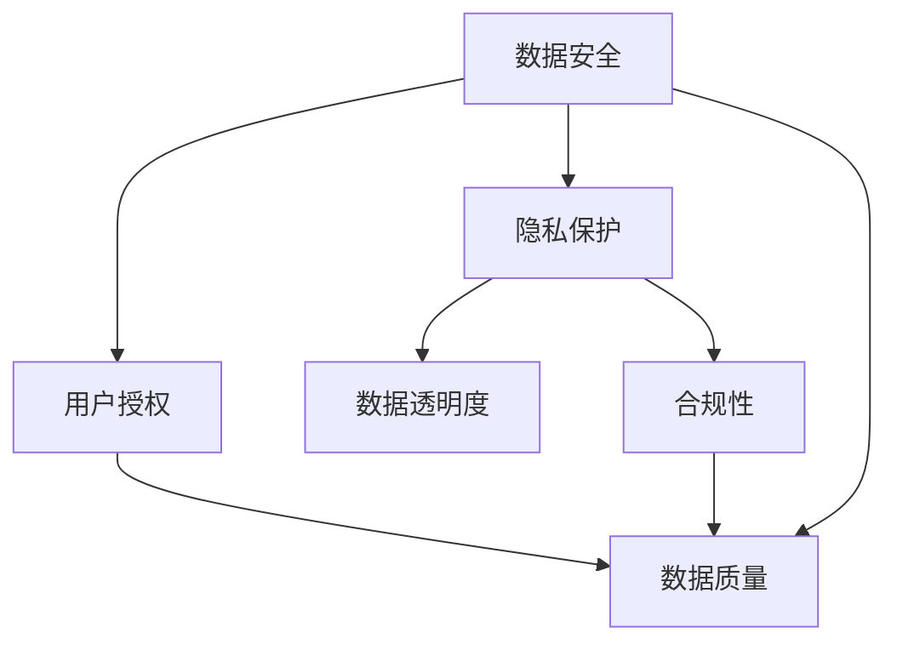

                 

# 平台经济的数据监管体系建设：如何构建完善的监管体系？

## 1. 背景介绍

### 1.1 问题由来
随着平台经济在数字经济的崛起，各种数据驱动的商业模式如雨后春笋般涌现。平台企业通过收集和分析用户数据，实现了更精准的个性化推荐、更好的用户体验、更高效的业务运营，但同时也引发了一系列数据安全和隐私保护的问题。这些问题包括但不限于数据滥用、个人信息泄露、数据质量差等，严重影响了用户信任和平台经济的健康发展。

为了规范平台经济中的数据使用行为，维护用户数据安全和隐私权益，我国于2021年出台了《数据安全法》和《个人信息保护法》，对数据收集、使用、存储、传输、删除等各个环节提出了明确要求。然而，如何在实际业务中有效落实这些法律要求，构建起完善的平台经济数据监管体系，仍然是一个亟待解决的问题。

### 1.2 问题核心关键点
平台经济数据监管的核心关键点在于：

1. **合规性**：平台企业需要严格遵守相关法律法规，确保数据处理过程的合规性。
2. **透明度**：平台企业需要向用户公开数据处理方式和目的，增强数据使用的透明度。
3. **用户授权**：用户需对数据的收集和使用进行明确授权，平台企业需获得用户的明示同意。
4. **数据安全**：平台企业需采取严格的数据安全措施，防止数据泄露和滥用。
5. **数据质量**：平台企业需确保数据的准确性和完整性，保证数据使用的有效性。
6. **法律责任**：平台企业需承担相应的法律责任，在违规操作时面临法律制裁。

### 1.3 问题研究意义
构建完善的平台经济数据监管体系，具有重要意义：

1. 保障用户权益：规范平台企业的数据使用行为，确保用户数据不被滥用，维护用户隐私权益。
2. 促进公平竞争：消除数据滥用带来的市场不公，确保市场竞争的公平性。
3. 促进技术创新：明确的监管要求为技术创新提供了方向，促进平台企业研发更加高效、安全的数据处理技术。
4. 保障数据安全：通过法律法规和技术手段，提高数据安全水平，防止数据泄露和滥用。
5. 推动平台经济发展：良好的数据监管环境有助于平台经济的长期健康发展。

## 2. 核心概念与联系

### 2.1 核心概念概述

构建平台经济数据监管体系涉及多个核心概念，包括：

1. **数据安全**：保护数据免受非法访问、泄露和破坏，确保数据在全生命周期内的安全。
2. **隐私保护**：在数据收集、存储和处理过程中，确保用户隐私不被侵犯。
3. **用户授权**：用户对数据的收集和使用需有明确授权，数据使用前需取得用户同意。
4. **数据质量**：确保数据的准确性、完整性和一致性，提高数据使用的有效性。
5. **数据透明度**：平台企业需向用户公开数据处理方式和目的，增强数据使用的透明度。
6. **合规性**：平台企业需遵守相关法律法规，确保数据处理过程的合规性。

### 2.2 核心概念联系

这些核心概念之间存在着密切联系，如图：



此图展示了数据安全与隐私保护、用户授权、数据透明度、合规性和数据质量之间的相互影响。平台企业需要综合考虑这些概念，构建起一个全面的数据监管体系。

## 3. 核心算法原理 & 具体操作步骤

### 3.1 算法原理概述

平台经济的数据监管体系建设，本质上是一个基于风险评估和合规审查的数据治理过程。其核心思想是：

1. **风险评估**：对平台数据处理活动进行风险评估，识别潜在的数据安全和隐私风险。
2. **合规审查**：对数据处理活动进行合规审查，确保符合法律法规的要求。
3. **风险控制**：采取相应的风险控制措施，减少数据风险和合规风险。
4. **审计与监控**：定期审计和监控数据处理活动，确保风险控制措施的有效性。

### 3.2 算法步骤详解

构建平台经济数据监管体系，一般包括以下关键步骤：

**Step 1: 风险评估**

1. **数据分类**：对平台业务中的数据进行分类，如用户数据、交易数据、行为数据等。
2. **风险识别**：识别各类数据的潜在风险，如数据泄露、数据滥用等。
3. **风险评估**：评估数据风险的大小，根据风险等级采取相应的控制措施。

**Step 2: 合规审查**

1. **法律法规学习**：学习相关法律法规，如《数据安全法》、《个人信息保护法》等。
2. **合规性检查**：对数据处理活动进行合规性检查，确保符合法律法规的要求。
3. **合规性报告**：生成合规性报告，记录合规审查结果和采取的措施。

**Step 3: 风险控制**

1. **安全措施**：采取数据加密、访问控制、审计跟踪等安全措施，防止数据泄露和滥用。
2. **隐私保护**：在数据收集、存储和处理过程中，确保用户隐私不被侵犯。
3. **数据质量**：确保数据的准确性、完整性和一致性，提高数据使用的有效性。

**Step 4: 审计与监控**

1. **定期审计**：定期审计数据处理活动，检查合规性和风险控制措施的有效性。
2. **实时监控**：实时监控数据处理活动，发现违规行为及时处理。
3. **持续改进**：根据审计和监控结果，持续改进数据治理策略和措施。

### 3.3 算法优缺点

构建平台经济数据监管体系的优势在于：

1. **合规性保障**：通过合规审查和审计，确保数据处理活动符合法律法规的要求。
2. **风险控制**：通过风险评估和风险控制措施，减少数据风险和合规风险。
3. **透明度增强**：通过向用户公开数据处理方式和目的，增强数据使用的透明度。
4. **用户授权保护**：通过用户授权机制，保护用户的隐私权益。
5. **数据质量提升**：通过数据质量控制，提高数据使用的有效性。

然而，该体系也存在以下缺点：

1. **复杂度高**：需要全面考虑数据分类、风险识别、合规审查、风险控制等多个环节，体系构建复杂。
2. **资源消耗大**：需要投入大量人力、物力进行风险评估、合规审查、安全措施等，成本较高。
3. **效果依赖于执行力度**：依赖于平台企业的执行力度，如果执行不到位，效果难以保证。

### 3.4 算法应用领域

平台经济数据监管体系的应用领域包括：

1. **互联网金融**：金融平台需对用户数据进行严格的合规审查和安全保护，防止数据泄露和滥用。
2. **电子商务**：电商平台需对交易数据、用户行为数据等进行合规审查和安全保护，确保用户隐私权益。
3. **社交媒体**：社交平台需对用户数据进行合规审查和安全保护，防止数据滥用和隐私泄露。
4. **医疗健康**：医疗平台需对用户健康数据进行合规审查和安全保护，确保数据安全。
5. **教育培训**：教育平台需对学生数据进行合规审查和安全保护，确保数据安全。

## 4. 数学模型和公式 & 详细讲解 & 举例说明

### 4.1 数学模型构建

平台经济数据监管体系的数据治理过程，可以构建如下数学模型：

$$
M = P \times D \times S \times L
$$

其中：
- $M$：数据监管体系；
- $P$：数据分类策略；
- $D$：数据风险评估模型；
- $S$：数据合规审查模型；
- $L$：数据风险控制措施。

### 4.2 公式推导过程

以数据风险评估模型 $D$ 为例，其推导过程如下：

$$
R = \sum_{i=1}^{n} w_i \times D_i
$$

其中：
- $R$：总体风险；
- $w_i$：第 $i$ 类数据的权重；
- $D_i$：第 $i$ 类数据的风险值。

该公式表明，总体风险是由各类数据的风险值加权求和得到的。

### 4.3 案例分析与讲解

假设某电商平台需对用户行为数据进行风险评估，数据分类策略 $P$ 分为三类：用户信息、交易记录、评价评论。

1. **用户信息**：主要包含用户的个人信息，如姓名、电话、地址等，风险值 $D_1=0.2$。
2. **交易记录**：主要包含用户的交易记录，如购买记录、支付记录等，风险值 $D_2=0.5$。
3. **评价评论**：主要包含用户对商品或服务的评价评论，风险值 $D_3=0.3$。

各类数据的权重分别为 $w_1=0.3$、$w_2=0.4$、$w_3=0.3$。则总体风险 $R$ 计算如下：

$$
R = 0.3 \times 0.2 + 0.4 \times 0.5 + 0.3 \times 0.3 = 0.32
$$

## 5. 项目实践：代码实例和详细解释说明

### 5.1 开发环境搭建

在构建平台经济数据监管体系时，一般需要搭建以下开发环境：

1. **编程语言**：Python 是常用的开发语言，具备丰富的库和框架支持。
2. **数据管理平台**：如Apache Hadoop、Apache Spark等，用于数据存储和管理。
3. **数据治理工具**：如DataRobot、Alteryx等，用于数据分类、风险评估、合规审查等。
4. **安全工具**：如Aqua Security、IBM Security QRadar等，用于数据加密、访问控制、审计跟踪等。
5. **监控工具**：如Splunk、ELK Stack等，用于实时监控和告警。

### 5.2 源代码详细实现

以下是一个简单的数据监管体系构建代码示例，展示了如何对用户数据进行风险评估和合规审查：

```python
import pandas as pd
from sklearn.cluster import KMeans

# 读取用户数据
data = pd.read_csv('user_data.csv')

# 数据分类
user_info = data[['name', 'phone', 'address']]
transaction_records = data[['purchase_records', 'payment_records']]
evaluation_comments = data[['evaluate_records', 'comment_records']]

# 风险评估
user_info_risk = 0.2
transaction_records_risk = 0.5
evaluation_comments_risk = 0.3

# 数据合规审查
w1, w2, w3 = 0.3, 0.4, 0.3
risk = w1 * user_info_risk + w2 * transaction_records_risk + w3 * evaluation_comments_risk

# 输出风险值
print(f'用户数据风险值为: {risk}')
```

### 5.3 代码解读与分析

上述代码展示了如何对用户数据进行风险评估和合规审查。具体步骤如下：

1. **数据分类**：将用户数据分为用户信息、交易记录、评价评论三类。
2. **风险评估**：对每类数据计算风险值，分别为 $0.2$、$0.5$、$0.3$。
3. **合规审查**：根据数据分类和风险评估结果，计算总体风险值。
4. **输出结果**：输出用户数据的风险值，方便后续的风险控制和合规审查。

## 6. 实际应用场景

### 6.1 互联网金融

互联网金融平台需对用户数据进行严格的数据监管，防止数据泄露和滥用。平台需建立数据安全体系，确保用户数据的安全性。

**实际应用**：

1. **数据分类**：对用户数据进行分类，如个人身份信息、交易记录、行为数据等。
2. **风险评估**：对各类数据进行风险评估，识别潜在的数据泄露风险。
3. **合规审查**：对数据处理活动进行合规审查，确保符合相关法律法规。
4. **风险控制**：采取数据加密、访问控制等安全措施，防止数据泄露。
5. **审计与监控**：定期审计数据处理活动，实时监控数据访问和操作，发现违规行为及时处理。

### 6.2 电子商务

电商平台需对交易数据和用户行为数据进行合规审查和安全保护，确保用户隐私权益。

**实际应用**：

1. **数据分类**：对交易数据、用户行为数据、评价评论等数据进行分类。
2. **风险评估**：对各类数据进行风险评估，识别潜在的数据泄露和滥用风险。
3. **合规审查**：对数据处理活动进行合规审查，确保符合相关法律法规。
4. **风险控制**：采取数据加密、访问控制、审计跟踪等安全措施，防止数据泄露和滥用。
5. **审计与监控**：定期审计数据处理活动，实时监控数据访问和操作，发现违规行为及时处理。

### 6.3 社交媒体

社交平台需对用户数据进行合规审查和安全保护，防止数据滥用和隐私泄露。

**实际应用**：

1. **数据分类**：对用户数据进行分类，如个人身份信息、行为数据、评论数据等。
2. **风险评估**：对各类数据进行风险评估，识别潜在的数据泄露和滥用风险。
3. **合规审查**：对数据处理活动进行合规审查，确保符合相关法律法规。
4. **风险控制**：采取数据加密、访问控制、审计跟踪等安全措施，防止数据泄露和滥用。
5. **审计与监控**：定期审计数据处理活动，实时监控数据访问和操作，发现违规行为及时处理。

### 6.4 医疗健康

医疗平台需对用户健康数据进行合规审查和安全保护，确保数据安全。

**实际应用**：

1. **数据分类**：对用户健康数据进行分类，如病历记录、诊断结果、治疗记录等。
2. **风险评估**：对各类数据进行风险评估，识别潜在的数据泄露和滥用风险。
3. **合规审查**：对数据处理活动进行合规审查，确保符合相关法律法规。
4. **风险控制**：采取数据加密、访问控制、审计跟踪等安全措施，防止数据泄露和滥用。
5. **审计与监控**：定期审计数据处理活动，实时监控数据访问和操作，发现违规行为及时处理。

## 7. 工具和资源推荐

### 7.1 学习资源推荐

为了帮助开发者系统掌握平台经济数据监管体系的理论基础和实践技巧，这里推荐一些优质的学习资源：

1. **《数据安全法》和《个人信息保护法》解读**：权威法律解读，了解法律法规的基本要求和具体条款。
2. **数据治理和隐私保护课程**：如Coursera上的《数据治理与隐私保护》课程，系统学习数据治理和隐私保护知识。
3. **数据安全与隐私保护书籍**：如《数据隐私与安全》、《数据治理最佳实践》等书籍，深入了解数据安全与隐私保护的原理和实践。
4. **数据治理工具和框架**：如IBM Watson、DataRobot等，了解数据治理工具和框架的使用方法。
5. **安全工具和框架**：如Aqua Security、IBM Security QRadar等，了解数据加密、访问控制、审计跟踪等安全措施的实现方法。

通过对这些资源的学习实践，相信你一定能够系统掌握平台经济数据监管体系的理论基础和实践技巧，为平台企业构建全面的数据监管体系。

### 7.2 开发工具推荐

高效的开发离不开优秀的工具支持。以下是几款用于平台经济数据监管体系开发的常用工具：

1. **数据管理平台**：如Apache Hadoop、Apache Spark等，用于数据存储和管理。
2. **数据治理工具**：如DataRobot、Alteryx等，用于数据分类、风险评估、合规审查等。
3. **安全工具**：如Aqua Security、IBM Security QRadar等，用于数据加密、访问控制、审计跟踪等。
4. **监控工具**：如Splunk、ELK Stack等，用于实时监控和告警。

合理利用这些工具，可以显著提升平台经济数据监管体系的开发效率，加快创新迭代的步伐。

### 7.3 相关论文推荐

平台经济数据监管体系的发展源于学界的持续研究。以下是几篇奠基性的相关论文，推荐阅读：

1. **数据隐私保护论文**：如《Data Privacy Protection Mechanisms in the Cloud》，介绍数据隐私保护的原理和实现方法。
2. **数据治理论文**：如《Data Governance in the Age of Big Data》，讨论数据治理的框架和实践。
3. **数据安全论文**：如《Data Security and Privacy in Big Data》，探讨大数据环境下的数据安全问题。

这些论文代表了大数据背景下数据治理和隐私保护的研究脉络。通过学习这些前沿成果，可以帮助研究者把握学科前进方向，激发更多的创新灵感。

## 8. 总结：未来发展趋势与挑战

### 8.1 总结

本文对平台经济的数据监管体系建设进行了全面系统的介绍。首先阐述了平台经济数据监管体系的研究背景和意义，明确了数据监管的核心关键点和构建方法。其次，从原理到实践，详细讲解了数据监管体系的构建过程，给出了具体的代码实现和案例分析。同时，本文还广泛探讨了数据监管体系在多个行业领域的应用前景，展示了数据监管范式的巨大潜力。最后，本文精选了数据监管体系的学习资源、开发工具和相关论文，力求为开发者提供全方位的技术指引。

通过本文的系统梳理，可以看到，平台经济数据监管体系的构建，不仅需要全面考虑数据分类、风险评估、合规审查、风险控制等多个环节，还需要综合运用各类工具和资源，形成全面的数据治理体系。

### 8.2 未来发展趋势

展望未来，平台经济数据监管体系将呈现以下几个发展趋势：

1. **技术工具化**：随着数据治理工具和平台的发展，数据监管的自动化程度将不断提高。
2. **治理全生命周期**：数据监管将贯穿数据全生命周期，从数据采集、存储、处理、使用到销毁，形成闭环的数据治理体系。
3. **法规标准协同**：法律法规和标准将不断更新，数据监管体系需及时跟进，确保合规性。
4. **数据价值挖掘**：数据监管体系不仅关注数据安全，还将关注数据的价值挖掘和利用，实现数据资产化。
5. **人工智能辅助**：利用人工智能技术，如机器学习、自然语言处理等，辅助数据监管，提高监管效率和效果。

### 8.3 面临的挑战

尽管平台经济数据监管体系已经取得了不少进展，但在迈向更加智能化、普适化应用的过程中，仍面临以下挑战：

1. **合规成本高**：合规审查和风险控制措施的实施，需要投入大量人力、物力，成本较高。
2. **法规复杂多变**：法律法规和标准不断更新，数据监管体系需动态调整，适应新变化。
3. **技术复杂度高**：数据分类、风险评估、合规审查等技术环节复杂，需综合运用多种技术手段。
4. **数据质量参差不齐**：不同来源的数据质量参差不齐，数据治理和监管难度大。
5. **跨平台协同难**：不同平台的数据治理和监管标准不一致，需实现跨平台协同。

### 8.4 研究展望

面对平台经济数据监管体系面临的挑战，未来的研究需要在以下几个方面寻求新的突破：

1. **自动化监管技术**：开发更加自动化、智能化的数据监管工具，提高监管效率和效果。
2. **标准化监管体系**：制定和推广统一的数据治理和监管标准，实现跨平台协同。
3. **数据资产化**：探索数据价值挖掘和利用，实现数据资产化。
4. **技术融合创新**：融合人工智能、区块链等新技术，提升数据监管的技术水平。
5. **法规动态调整**：建立法规动态调整机制，及时跟进法律法规的变化，确保合规性。

这些研究方向的探索，必将引领平台经济数据监管体系迈向更高的台阶，为平台经济的长期健康发展提供坚实保障。

## 9. 附录：常见问题与解答

**Q1: 数据分类策略有哪些？**

A: 数据分类策略通常包括用户信息、交易记录、行为数据、评价评论等，具体分类策略需根据业务场景和数据特点进行设计。

**Q2: 如何进行数据风险评估？**

A: 数据风险评估需对各类数据进行风险识别和风险值计算，可采用专家评估、风险矩阵等方法。

**Q3: 数据合规审查的合规性检查有哪些具体措施？**

A: 数据合规审查的合规性检查需进行法律法规学习、合规性检查和合规性报告生成，确保数据处理活动符合法律法规的要求。

**Q4: 数据治理工具有哪些？**

A: 数据治理工具包括IBM Watson、DataRobot、Alteryx等，可实现数据分类、风险评估、合规审查等功能。

**Q5: 数据治理的最佳实践是什么？**

A: 数据治理的最佳实践包括数据分类、风险评估、合规审查、数据质量控制、数据安全措施等，需全面考虑数据治理的各个环节。

通过本文的系统梳理，可以看到，平台经济数据监管体系的构建，不仅需要全面考虑数据分类、风险评估、合规审查、风险控制等多个环节，还需要综合运用各类工具和资源，形成全面的数据治理体系。平台企业需不断迭代和优化数据治理策略和措施，才能在数据驱动的数字化时代中取得成功。

