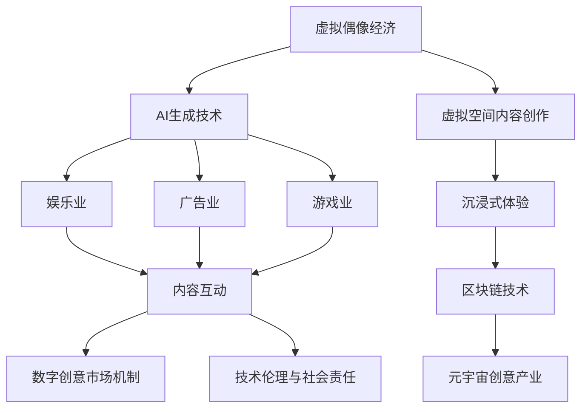

                 

# 2050年的数字创意：从虚拟偶像经济到元宇宙创意产业的数字创意经济

## 1. 背景介绍

### 1.1 问题由来

随着人工智能(AI)、虚拟现实(VR)、增强现实(AR)、区块链、物联网(IoT)等技术的不断突破，数字创意经济正成为新的经济增长点。未来数十年内，数字创意产业将实现重大变革，特别是在虚拟偶像经济和元宇宙创意产业方面的潜力巨大。

过去几年里，AI技术的快速发展，已经使得虚拟偶像成为一种现实。通过AI生成技术，虚拟偶像能够像真实人物一样在各种场景中表演，甚至具备情感交互能力。此外，元宇宙概念的兴起，使得数字创意内容在虚拟空间中获得更广泛的应用，成为数字创意产业的新方向。

### 1.2 问题核心关键点

当前数字创意经济的核心在于如何利用AI、VR、AR等前沿技术，打造具有沉浸感和交互性的数字内容。特别是虚拟偶像经济和元宇宙创意产业，通过数字化、虚拟化、智能化的方式，重新定义娱乐、教育、商业等多个领域的商业模式和用户体验。

这些问题核心关键点包括：

1. **虚拟偶像生成技术**：如何通过AI生成技术，创造出具有个性化、情感化、交互化的虚拟偶像。
2. **虚拟空间内容创作**：如何在元宇宙中，生成丰富的、具有沉浸感的数字内容。
3. **数字创意市场机制**：如何构建合理的数字创意市场机制，促进创意内容的生产、消费和传播。
4. **技术伦理与社会责任**：如何确保数字创意技术的健康发展，平衡技术创新与社会伦理的关系。

### 1.3 问题研究意义

数字创意经济的研究不仅有助于理解未来经济发展的趋势，而且可以为技术开发、市场推广和政策制定提供科学依据。

1. **技术创新**：通过深入研究虚拟偶像生成技术和元宇宙创意产业的关键技术，推动相关技术的突破和创新。
2. **市场应用**：为数字创意内容的市场推广提供策略建议，帮助企业更好地利用数字创意资源。
3. **社会影响**：评估数字创意技术的社会影响，提出相关的政策和法规建议，保障社会公共利益。

## 2. 核心概念与联系

### 2.1 核心概念概述

为了更好地理解从虚拟偶像经济到元宇宙创意产业的数字创意经济，本节将介绍几个密切相关的核心概念：

- **虚拟偶像经济**：以虚拟偶像为主体的经济活动，包括虚拟偶像的创作、表演、营销、互动等环节。虚拟偶像经济通过AI技术，为娱乐、广告、游戏等行业带来新的商业机会。

- **元宇宙创意产业**：在虚拟空间中，通过数字创意技术创作和传播的内容产业。元宇宙创意产业包括虚拟空间的游戏、教育、社交等多个领域，具有高度的沉浸感和交互性。

- **AI生成技术**：利用深度学习、生成对抗网络(GAN)等技术，自动生成高质量的虚拟偶像和元宇宙内容的算法和工具。

- **沉浸式体验**：通过VR、AR、MR等技术，提供具有高度沉浸感和交互性的数字内容体验。

- **区块链技术**：为数字创意内容的生产、消费和交易提供去中心化的信任机制和资产管理方式。

### 2.2 核心概念原理和架构的 Mermaid 流程图

这个流程图展示了虚拟偶像经济和元宇宙创意产业的核心概念及其相互关系：

1. 虚拟偶像经济通过AI生成技术，为娱乐、广告、游戏等行业带来新的商业机会。
2. 虚拟空间内容创作结合AI生成技术和沉浸式体验，创作出丰富多彩的数字内容。
3. 区块链技术为数字创意内容的生产、消费和交易提供去中心化的信任机制。
4. 元宇宙创意产业融合了虚拟偶像经济和虚拟空间内容创作，是未来数字创意经济的重要方向。

## 3. 核心算法原理 & 具体操作步骤

### 3.1 算法原理概述

虚拟偶像和元宇宙创意产业的开发，通常分为两个阶段：预训练和微调。

**预训练阶段**：使用大规模无标签数据，训练AI生成模型，使其具备生成高质量虚拟偶像和元宇宙内容的能力。预训练阶段的核心算法包括自监督学习、生成对抗网络(GAN)等。

**微调阶段**：在具体应用场景中，使用少量标注数据，对预训练模型进行有监督微调，使其适应特定任务。微调阶段的核心算法包括监督学习、迁移学习等。

### 3.2 算法步骤详解

#### 预训练阶段

1. **数据准备**：收集大规模无标签数据，如电影、音乐、文学作品等，用于训练AI生成模型。

2. **模型选择**：选择适合的生成模型，如GAN、变分自编码器(VAE)等，进行训练。

3. **模型训练**：使用自监督学习任务，如生成对抗网络(GAN)的对抗训练、变分自编码器(VAE)的变分推断等，训练生成模型。

4. **模型评估**：在验证集上评估生成模型的质量，通过指标如均方误差(MSE)、峰值信噪比(PSNR)等，调整模型超参数。

5. **模型保存**：保存训练好的模型，用于微调阶段。

#### 微调阶段

1. **数据准备**：收集少量标注数据，如虚拟偶像的表演数据、元宇宙内容的描述数据等，用于微调。

2. **模型加载**：加载预训练的生成模型，作为微调任务的基础。

3. **任务适配**：根据微调任务，添加任务适配层，如分类器、解码器等。

4. **优化器选择**：选择适合的优化算法，如AdamW、SGD等，设置学习率、批大小等超参数。

5. **模型训练**：在标注数据上训练微调后的模型，不断更新模型参数，最小化损失函数。

6. **模型评估**：在验证集上评估微调模型的性能，如精度、F1-score等。

7. **模型保存**：保存微调后的模型，用于实际应用。

### 3.3 算法优缺点

#### 优点

1. **高效生成**：预训练的AI生成模型可以高效生成虚拟偶像和元宇宙内容，节省了大量的手动创作时间。
2. **内容丰富**：通过微调，模型能够适应具体任务，生成更加符合需求的内容。
3. **技术可扩展**：AI生成技术可以应用于多个领域，如娱乐、广告、教育等，具有广泛的应用前景。

#### 缺点

1. **数据需求高**：预训练和微调阶段需要大量的数据，获取高质量数据成本较高。
2. **模型复杂**：AI生成模型结构复杂，训练和微调过程需要较高的计算资源。
3. **内容风险**：AI生成的内容可能包含不当信息，需要严格的审查机制。

### 3.4 算法应用领域

虚拟偶像经济和元宇宙创意产业涉及多个应用领域，具体如下：

- **娱乐业**：虚拟偶像在演唱会、音乐视频、直播等场景中的应用，提供了新的娱乐方式。
- **广告业**：虚拟偶像和元宇宙内容在广告投放中的创新应用，提高了广告的吸引力和效果。
- **游戏业**：虚拟偶像和元宇宙内容在游戏场景中的应用，如虚拟演唱会、虚拟社交等。
- **教育业**：虚拟偶像和元宇宙内容在在线教育中的应用，如虚拟教师、虚拟实验等。
- **社交业**：虚拟偶像和元宇宙内容在社交平台中的应用，如虚拟聚会、虚拟商店等。

## 4. 数学模型和公式 & 详细讲解 & 举例说明

### 4.1 数学模型构建

#### 预训练阶段

假设使用生成对抗网络(GAN)进行虚拟偶像生成，模型的生成器和判别器分别为$G$和$D$。则预训练模型的目标函数为：

$$
\min_G \max_D V(G,D)
$$

其中，$V$为生成对抗网络(GAN)的损失函数，定义如下：

$$
V(G,D) = E_{x \sim p_{data}(x)} [\log D(x)] + E_{z \sim p_z(z)} [\log(1-D(G(z)))]
$$

#### 微调阶段

假设使用监督学习进行虚拟偶像微调，模型的损失函数为交叉熵损失函数，定义如下：

$$
\ell(y, \hat{y}) = -\frac{1}{N} \sum_{i=1}^N [y_i \log \hat{y}_i + (1-y_i) \log(1-\hat{y}_i)]
$$

其中，$y$为真实标签，$\hat{y}$为模型预测概率。

### 4.2 公式推导过程

#### 预训练阶段

1. **生成器训练**：
   $$
   G_{w}(z) = x
   $$
   $$
   \min_G E_{x \sim p_{data}(x)} [\log D(x)] + E_{z \sim p_z(z)} [\log(1-D(G(z)))
   $$

2. **判别器训练**：
   $$
   D_{w}(x) = \hat{y}
   $$
   $$
   \max_D E_{x \sim p_{data}(x)} [\log D(x)] + E_{z \sim p_z(z)} [\log(1-D(G(z)))
   $$

#### 微调阶段

1. **数据准备**：
   $$
   (x_i, y_i) \sim p_{data}(x)
   $$

2. **模型加载**：
   $$
   M_{\theta} = \text{load pre-trained model}
   $$

3. **任务适配**：
   $$
   M_{\theta}^{\prime} = \text{add task-adapted layers to } M_{\theta}
   $$

4. **优化器选择**：
   $$
   \text{optimizer} = \text{AdamW}(M_{\theta}^{\prime}, \eta, \beta_1, \beta_2)
   $$

5. **模型训练**：
   $$
   \begin{aligned}
   \text{for each batch} \text{do} \\
   \text{    } x, y \text{    } \text{    } \text{    } \text{    } \text{    } \text{    } \text{    } \text{    } \text{    } \text{    } \text{    } \text{    } \text{    } \text{    } \text{    } \text{    } \text{    } \text{    } \text{    } \text{    } \text{    } \text{    } \text{    } \text{    } \text{    } \text{    } \text{    } \text{    } \text{    } \text{    } \text{    } \text{    } \text{    } \text{    } \text{    } \text{    } \text{    } \text{    } \text{    } \text{    } \text{    } \text{    } \text{    } \text{    } \text{    } \text{    } \text{    } \text{    } \text{    } \text{    } \text{    } \text{    } \text{    } \text{    } \text{    } \text{    } \text{    } \text{    } \text{    } \text{    } \text{    } \text{    } \text{    } \text{    } \text{    } \text{    } \text{    } \text{    } \text{    } \text{    } \text{    } \text{    } \text{    } \text{    } \text{    } \text{    } \text{    } \text{    } \text{    } \text{    } \text{    } \text{    } \text{    } \text{    } \text{    } \text{    } \text{    } \text{    } \text{    } \text{    } \text{    } \text{    } \text{    } \text{    } \text{    } \text{    } \text{    } \text{    } \text{    } \text{    } \text{    } \text{    } \text{    } \text{    } \text{    } \text{    } \text{    } \text{    } \text{    } \text{    } \text{    } \text{    } \text{    } \text{    } \text{    } \text{    } \text{    } \text{    } \text{    } \text{    } \text{    } \text{    } \text{    } \text{    } \text{    } \text{    } \text{    } \text{    } \text{    } \text{    } \text{    } \text{    } \text{    } \text{    } \text{    } \text{    } \text{    } \text{    } \text{    } \text{    } \text{    } \text{    } \text{    } \text{    } \text{    } \text{    } \text{    } \text{    } \text{    } \text{    } \text{    } \text{    } \text{    } \text{    } \text{    } \text{    } \text{    } \text{    } \text{    } \text{    } \text{    } \text{    } \text{    } \text{    } \text{    } \text{    } \text{    } \text{    } \text{    } \text{    } \text{    } \text{    } \text{    } \text{    } \text{    } \text{    } \text{    } \text{    } \text{    } \text{    } \text{    } \text{    } \text{    } \text{    } \text{    } \text{    } \text{    } \text{    } \text{    } \text{    } \text{    } \text{    } \text{    } \text{    } \text{    } \text{    } \text{    } \text{    } \text{    } \text{    } \text{    } \text{    } \text{    } \text{    } \text{    } \text{    } \text{    } \text{    } \text{    } \text{    } \text{    } \text{    } \text{    } \text{    } \text{    } \text{    } \text{    } \text{    } \text{    } \text{    } \text{    } \text{    } \text{    } \text{    } \text{    } \text{    } \text{    } \text{    } \text{    } \text{    } \text{    } \text{    } \text{    } \text{    } \text{    } \text{    } \text{    } \text{    } \text{    } \text{    } \text{    } \text{    } \text{    } \text{    } \text{    } \text{    } \text{    } \text{    } \text{    } \text{    } \text{    } \text{    } \text{    } \text{    } \text{    } \text{    } \text{    } \text{    } \text{    } \text{    } \text{    } \text{    } \text{    } \text{    } \text{    } \text{    } \text{    } \text{    } \text{    } \text{    } \text{    } \text{    } \text{    } \text{    } \text{    } \text{    } \text{    } \text{    } \text{    } \text{    } \text{    } \text{    } \text{    } \text{    } \text{    } \text{    } \text{    } \text{    } \text{    } \text{    } \text{    } \text{    } \text{    } \text{    } \text{    } \text{    } \text{    } \text{    } \text{    } \text{    } \text{    } \text{    } \text{    } \text{    } \text{    } \text{    } \text{    } \text{    } \text{    } \text{    } \text{    } \text{    } \text{    } \text{    } \text{    } \text{    } \text{    } \text{    } \text{    } \text{    } \text{    } \text{    } \text{    } \text{    } \text{    } \text{    } \text{    } \text{    } \text{    } \text{    } \text{    } \text{    } \text{    } \text{    } \text{    } \text{    } \text{    } \text{    } \text{    } \text{    } \text{    } \text{    } \text{    } \text{    } \text{    } \text{    } \text{    } \text{    } \text{    } \text{    } \text{    } \text{    } \text{    } \text{    } \text{    } \text{    } \text{    } \text{    } \text{    } \text{    } \text{    } \text{    } \text{    } \text{    } \text{    } \text{    } \text{    } \text{    } \text{    } \text{    } \text{    } \text{    } \text{    } \text{    } \text{    } \text{    } \text{    } \text{    } \text{    } \text{    } \text{    } \text{    } \text{    } \text{    } \text{    } \text{    } \text{    } \text{    } \text{    } \text{    } \text{    } \text{    } \text{    } \text{    } \text{    } \text{    } \text{    } \text{    } \text{    } \text{    } \text{    } \text{    } \text{    } \text{    } \text{    } \text{    } \text{    } \text{    } \text{    } \text{    } \text{    } \text{    } \text{    } \text{    } \text{    } \text{    } \text{    } \text{    } \text{    } \text{    } \text{    } \text{    } \text{    } \text{    } \text{    } \text{    } \text{    } \text{    } \text{    } \text{    } \text{    } \text{    } \text{    } \text{    } \text{    } \text{    } \text{    } \text{    } \text{    } \text{    } \text{    } \text{    } \text{    } \text{    } \text{    } \text{    } \text{    } \text{    } \text{    } \text{    } \text{    } \text{    } \text{    } \text{    } \text{    } \text{    } \text{    } \text{    } \text{    } \text{    } \text{    } \text{    } \text{    } \text{    } \text{    } \text{    } \text{    } \text{    } \text{    } \text{    } \text{    } \text{    } \text{    } \text{    } \text{    } \text{    } \text{    } \text{    } \text{    } \text{    } \text{    } \text{    } \text{    } \text{    } \text{    } \text{    } \text{    } \text{    } \text{    } \text{    } \text{    } \text{    } \text{    } \text{    } \text{    } \text{    } \text{    } \text{    } \text{    } \text{    } \text{    } \text{    } \text{    } \text{    } \text{    } \text{    } \text{    } \text{    } \text{    } \text{    } \text{    } \text{    } \text{    } \text{    } \text{    } \text{    } \text{    } \text{    } \text{    } \text{    } \text{    } \text{    } \text{    } \text{    } \text{    } \text{    } \text{    } \text{    } \text{    } \text{    } \text{    } \text{    } \text{    } \text{    } \text{    } \text{    } \text{    } \text{    } \text{    } \text{    } \text{    } \text{    } \text{    } \text{    } \text{    } \text{    } \text{    } \text{    } \text{    } \text{    } \text{    } \text{    } \text{    } \text{    } \text{    } \text{    } \text{    } \text{    } \text{    } \text{    } \text{    } \text{    } \text{    } \text{    } \text{    } \text{    } \text{    } \text{    } \text{    } \text{    } \text{    } \text{    } \text{    } \text{    } \text{    } \text{    } \text{    } \text{    } \text{    } \text{    } \text{    } \text{    } \text{    } \text{    } \text{    } \text{    } \text{    } \text{    } \text{    } \text{    } \text{    } \text{    } \text{    } \text{    } \text{    } \text{    } \text{    } \text{    } \text{    } \text{    } \text{    } \text{    } \text{    } \text{    } \text{    } \text{    } \text{    } \text{    } \text{    } \text{    } \text{    } \text{    } \text{    } \text{    } \text{    } \text{    } \text{    } \text{    } \text{    } \text{    } \text{    } \text{    } \text{    } \text{    } \text{    } \text{    } \text{    } \text{    } \text{    } \text{    } \text{    } \text{    } \text{    } \text{    } \text{    } \text{    } \text{    } \text{    } \text{    } \text{    } \text{    } \text{    } \text{    } \text{    } \text{    } \text{    } \text{    } \text{    } \text{    } \text{    } \text{    } \text{    } \text{    } \text{    } \text{    } \text{    } \text{    } \text{    } \text{    } \text{    } \text{    } \text{    } \text{    } \text{    } \text{    } \text{    } \text{    } \text{    } \text{    } \text{    } \text{    } \text{    } \text{    } \text{    } \text{    } \text{    } \text{    } \text{    } \text{    } \text{    } \text{    } \text{    } \text{    } \text{    } \text{    } \text{    } \text{    } \text{    } \text{    } \text{    } \text{    } \text{    } \text{    } \text{    } \text{    } \text{    } \text{    } \text{    } \text{    } \text{    } \text{    } \text{    } \text{    } \text{    } \text{    } \text{    } \text{    } \text{    } \text{    } \text{    } \text{    } \text{    } \text{    } \text{    } \text{    } \text{    } \text{    } \text{    } \text{    } \text{    } \text{    } \text{    } \text{    } \text{    } \text{    } \text{    } \text{    } \text{    } \text{    } \text{    } \text{    } \text{    } \text{    } \text{    } \text{    } \text{    } \text{    } \text{    } \text{    } \text{    } \text{    } \text{    } \text{    } \text{    } \text{    } \text{    } \text{    } \text{    } \text{    } \text{    } \text{    } \text{    } \text{    } \text{    } \text{    } \text{    } \text{    } \text{    } \text{    } \text{    } \text{    } \text{    } \text{    } \text{    } \text{    } \text{    } \text{    } \text{    } \text{    } \text{    } \text{    } \text{    } \text{    } \text{    } \text{    } \text{    } \text{    } \text{    } \text{    } \text{    } \text{    } \text{    } \text{    } \text{    } \text{    } \text{    } \text{    } \text{    } \text{    } \text{    } \text{    } \text{    } \text{    } \text{    } \text{    } \text{    } \text{    } \text{    } \text{    } \text{    } \text{    } \text{    } \text{    } \text{    } \text{    } \text{    } \text{    } \text{    } \text{    } \text{    } \text{    } \text{    } \text{    } \text{    } \text{    } \text{    } \text{    } \text{    } \text{    } \text{    } \text{    } \text{    } \text{    } \text{    } \text{    } \text{    } \text{    } \text{    } \text{    } \text{    } \text{    } \text{    } \text{    } \text{    } \text{    } \text{    } \text{    } \text{    } \text{    } \text{    } \text{    } \text{    } \text{    } \text{    } \text{    } \text{    } \text{    } \text{    } \text{    } \text{    } \text{    } \text{    } \text{    } \text{    } \text{    } \text{    } \text{    } \text{    } \text{    } \text{    } \text{    } \text{    } \text{    } \text{    } \text{    } \text{    } \text{    } \text{    } \text{    } \text{    } \text{    } \text{    } \text{    } \text{    } \text{    } \text{    } \text{    } \text{    } \text{    } \text{    } \text{    } \text{    } \text{    } \text{    } \text{    } \text{    } \text{    } \text{    } \text{    } \text{    } \text{    } \text{    } \text{    } \text{    } \text{    } \text{    } \text{    } \text{    } \text{    } \text{    } \text{    } \text{    } \text{    } \text{    } \text{    } \text{    } \text{    } \text{    } \text{    } \text{    } \text{    } \text{    } \text{    } \text{    } \text{    } \text{    } \text{    } \text{    } \text{    } \text{    } \text{    } \text{    } \text{    } \text{    } \text{    } \text{    } \text{    } \text{    } \text{    } \text{    } \text{    } \text{    } \text{    } \text{    } \text{    } \text{    } \text{    } \text{    } \text{    } \text{    } \text{    } \text{    } \text{    } \text{    } \text{    } \text{    } \text{    } \text{    } \text{    } \text{    } \text{    } \text{    } \text{    } \text{    } \text{    } \text{    } \text{    } \text{    } \text{    } \text{    } \text{    } \text{    } \text{    } \text{    } \text{    } \text{    } \text{    } \text{    } \text{    } \text{    } \text{    } \text{    } \text{    } \text{    } \text{    } \text{    } \text{    } \text{    } \text{    } \text{    } \text{    } \text{    } \text{    } \text{    } \text{    } \text{    } \text{    } \text{    } \text{    } \text{    } \text{    } \text{    } \text{    } \text{    } \text{    } \text{    } \text{    } \text{    } \text{    } \text{    } \text{    } \text{    } \text{    } \text{    } \text{    } \text{    } \text{    } \text{    } \text{    } \text{    } \text{    } \text{    } \text{    } \text{    } \text{    } \text{    } \text{    } \text{    } \text{    } \text{    } \text{    } \text{    } \text{    } \text{    } \text{    } \text{    } \text{    } \text{    } \text{    } \text{    } \text{    } \text{    } \text{    } \text{    } \text{    } \text{    } \text{    } \text{    } \text{    } \text{    } \text{    } \text{    } \text{    } \text{    } \text{    } \text{    } \text{    } \text{    } \text{    } \text{    } \text{    } \text{    } \text{    } \text{    } \text{    } \text{    } \text{    } \text{    } \text{    } \text{    } \text{    } \text{    } \text{    } \text{    } \text{    } \text{    } \text{    } \text{    } \text{    } \text{    } \text{    } \text{    } \text{    } \text{    } \text{    } \text{    } \text{    } \text{    } \text{    } \text{    } \text{    } \text{    } \text{    } \text{    } \text{    } \text{    } \text{    } \text{    } \text{    } \text{    } \text{    } \text{    } \text{    } \text{    } \text{    } \text{    } \text{    } \text{    } \text{    } \text{    } \text{    } \text{    } \text{    } \text{    } \text{    } \text{    } \text{    } \text{    } \text{    } \text{    } \text{    } \text{    } \text{    } \text{    } \text{    } \text{    } \text{    } \text{    } \text{    } \text{    } \text{    } \text{    } \text{    } \text{    } \text{    } \text{    } \text{    } \text{    } \text{    } \text{    } \text{    } \text{    } \text{    } \text{    } \text{    } \text{    } \text{    } \text{    } \text{    } \text{    } \text{    } \text{    } \text{    } \text{    } \text{    } \text{    } \text{    } \text{    } \text{    } \text{    } \text{    } \text{    } \text{    } \text{    } \text{    } \text{    } \text{    } \text{    } \text{    } \text{    } \text{    } \text{    } \text{    } \text{    } \text{    } \text{    } \text{    } \text{    } \text{    } \text{    } \text{    } \text{    } \text{    } \text{    } \text{    } \text{    } \text{    } \text{    } \text{    } \text{    } \text{    } \text{    } \text{    } \text{    } \text{    } \text{    } \text{    } \text{    } \text{    } \text{    } \text{    } \text{    } \text{    } \text{    } \text{    } \text{    } \text{    } \text{    } \text{    } \text{    } \text{    } \text{    } \text{    } \text{    } \text{    } \text{    } \text{    } \text{    } \text{    } \text{    } \text{    } \text{    } \text{    } \text{    } \text{    } \text{    } \text{    } \text{    } \text{    } \text{    } \text{    } \text{    } \text{    } \text{    } \text{    } \text{    } \text{    } \text{    } \text{    } \text{    } \text{    } \text{    } \text{    } \text{    } \text{    } \text{    } \text{    } \text{    } \text{    } \text{    } \text{    } \text{    } \text{    } \text{    } \text{    } \text{    } \text{    } \text{    } \text{    } \text{    } \text{    } \text{    } \text{    } \text{    } \text{    } \text{    } \text{    } \text{    } \text{    } \text{    } \text{    } \text{    } \text{    } \text{    } \text{    } \text{    } \text{    } \text{    } \text{    } \text{    } \text{    } \text{    } \text{    } \text{    } \text{    } \text{    } \text{    } \text{    } \text{    } \text{    } \text{    } \text{    } \text{    } \text{    } \text{    } \text{    } \text{    } \text{    } \text{    } \text{    } \text{    } \text{    } \text{    } \text{    } \text{    } \text{    } \text{    } \text{    } \text{    } \text{    } \text{    } \text{    } \text{    } \text{    } \text{    } \text{    } \text{    } \text{    } \text{    } \text{    } \text{    } \text{    } \text{    } \text{    } \text{    } \text{    } \text{    } \text{    } \text{    } \text{    } \text{    } \text{    } \text{    } \text{    } \text{    } \text{    } \text{    } \text{    } \text{    } \text{    } \text{    } \text{    } \text{    } \text{    } \text{    } \text{    } \text{    } \text{    } \text{    } \text{    } \text{    } \text{    } \text{    } \text{    } \text{    } \text{    } \text{    } \text{    } \text{    } \text{    } \text{    } \text{    } \text{    } \text{    } \text{    } \text{    } \text{    } \text{    } \text{    } \text{    } \text{    } \text{    } \text{    } \text{    } \text{    } \text{    } \text{    } \text{    } \text{    } \text{    }

