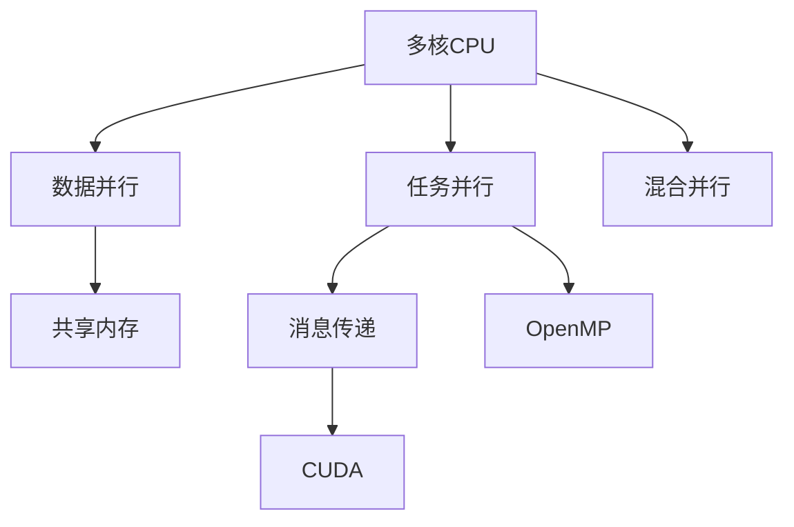

                 

## 1. 背景介绍

随着计算任务的不断扩展，单核CPU的性能瓶颈日益显现。在图像处理、大数据分析、科学计算等高计算需求场景中，多核CPU和GPU成为了并行计算的主力军。并行计算通过利用多个计算单元同时处理不同的数据子集，极大提升了计算效率和性能。

### 1.1 问题由来
在当今计算密集型应用中，如深度学习训练、科学模拟、大规模数据分析等，单核CPU已经难以满足需求。数据并行、任务并行和数据任务混合并行等并行计算技术应运而生，多核CPU和GPU成为了计算领域的主要工具。

并行计算的核心思想在于通过利用多个计算资源，如多核CPU和GPU，同时执行不同的计算任务，从而提升计算效率和性能。随着现代计算机体系结构的发展，多核CPU和GPU等并行计算硬件的性能越来越强，并行编程技术的逐渐成熟，使并行计算技术得以在各种复杂计算任务中得到广泛应用。

### 1.2 问题核心关键点
本文将主要探讨基于多核CPU和GPU的并行计算编程技术，包括并行编程模型、任务调度策略、数据通信机制以及相关工具和框架。我们将重点讨论以下关键问题：

1. **并行编程模型**：讨论基于CPU/GPU的多线程模型、任务并行模型、数据并行模型和混合并行模型。
2. **任务调度策略**：介绍基于手动任务调度和自动任务调度的相关技术。
3. **数据通信机制**：介绍多核CPU和GPU之间的数据传输和同步机制。
4. **工具和框架**：推荐一些主流的并行计算工具和框架，如CUDA、OpenMP、MPI等。

## 2. 核心概念与联系

### 2.1 核心概念概述

为更好地理解并行计算中的多核CPU和GPU编程技术，本节将介绍几个核心概念：

- **多核CPU**：指具有多个处理核心的CPU，如Intel的Xeon系列，AMD的EPYC系列等。多核CPU能够同时执行多个线程任务，提升计算效率。

- **GPU（图形处理单元）**：最初设计用于加速图形渲染，但逐渐发现其在并行计算中具有天然优势。NVIDIA的CUDA、AMD的ROCm等都是典型的GPU计算平台。

- **并行编程模型**：定义了计算任务在多个计算单元之间的划分和执行方式，如数据并行、任务并行、混合并行等。

- **任务调度策略**：描述了如何将计算任务映射到不同的计算单元，并调整任务的执行顺序，以充分利用并行计算资源。

- **数据通信机制**：指并行计算中不同计算单元之间的数据交换和同步方法，如共享内存、消息传递等。

- **并行计算工具和框架**：提供了方便的并行计算编程接口和优化调度策略，如CUDA、OpenMP、MPI等。

### 2.2 核心概念原理和架构的 Mermaid 流程图



这个流程图展示了并行计算中核心概念之间的联系：

1. 多核CPU支持任务并行和数据并行，通过共享内存和消息传递实现数据通信。
2. 任务并行和数据并行分别由OpenMP和CUDA等工具实现。
3. 混合并行模型结合了任务并行和数据并行的优势。

## 3. 核心算法原理 & 具体操作步骤

### 3.1 算法原理概述

并行计算的基本原理是通过将一个大任务分解为多个子任务，并行计算这些子任务，从而提升整体计算效率。这种分解和执行的过程被称为任务划分。任务划分可以是数据划分、任务划分或两者的混合。

### 3.2 算法步骤详解

基于多核CPU和GPU的并行计算流程通常包括以下几个步骤：

1. **任务划分**：将大任务分解为多个子任务，每个子任务可以在单独的计算单元上执行。

2. **任务调度**：将子任务映射到不同的计算单元，并调整任务的执行顺序，以充分利用并行计算资源。

3. **数据传输**：在任务并行和数据并行中，需要处理不同计算单元之间的数据交换。共享内存和消息传递是最常见的数据传输方式。

4. **执行并行计算**：在计算单元上执行子任务，并对结果进行汇总和处理。

5. **结果汇总**：将各个计算单元的结果汇总，得到最终结果。

### 3.3 算法优缺点

基于多核CPU和GPU的并行计算具有以下优点：

1. **计算效率高**：通过并行计算，可以极大提升计算效率和性能。

2. **灵活性高**：适用于多种计算任务，如数值模拟、图像处理、大数据分析等。

3. **资源利用率高**：通过合理调度，可以高效利用计算资源。

4. **可扩展性好**：可以通过增加计算单元来扩展并行计算能力。

同时，该方法也存在以下缺点：

1. **编程复杂**：并行计算编程难度较大，需要理解任务调度、数据通信等复杂概念。

2. **调试困难**：并行计算程序调试难度较大，需要同时考虑多个计算单元的协同工作。

3. **硬件依赖**：需要高性能的多核CPU和GPU，对硬件要求较高。

### 3.4 算法应用领域

并行计算在以下领域得到了广泛应用：

1. **科学计算**：如天气模拟、量子物理模拟等，需要大规模并行计算任务。

2. **机器学习**：深度学习模型的训练通常需要大规模并行计算。

3. **数据处理**：如大数据分析、数据挖掘等，需要对海量数据进行并行处理。

4. **图像处理**：如计算机视觉、医学图像分析等，需要高性能并行计算。

5. **图形渲染**：如3D游戏、虚拟现实等，需要实时并行计算生成复杂图像。

6. **金融分析**：如高频交易、风险管理等，需要并行计算进行实时数据分析。

## 4. 数学模型和公式 & 详细讲解 & 举例说明

### 4.1 数学模型构建

并行计算的核心在于任务划分和调度。我们以一个简单的矩阵乘法为例，展示并行计算的数学模型。

设矩阵$A$和$B$的维度为$m\times n$和$n\times p$，则它们的矩阵乘积$C=AB$的计算复杂度为$O(mnp)$。如果将矩阵$A$和$B$划分为多个子矩阵，每个子矩阵在独立的计算单元上计算，则可以并行计算所有子矩阵的乘积，从而大幅提升计算效率。

### 4.2 公式推导过程

设矩阵$A$和$B$被划分为$k$个子矩阵，每个子矩阵的维度分别为$m_0, n_0$和$n_0, p_0$，其中$m_0=\frac{m}{k}$，$n_0=\frac{n}{k}$，$p_0=\frac{p}{k}$。则矩阵乘积$C$可以并行计算为：

$$
C=\sum_{i=0}^{k-1}\sum_{j=0}^{k-1}A_{i,j}B_{j,i+1}
$$

其中，$A_{i,j}$和$B_{j,i+1}$分别表示矩阵$A$和$B$的第$i$个子矩阵和第$j$个子矩阵。

### 4.3 案例分析与讲解

以矩阵乘法为例，可以详细分析并行计算的实现过程：

1. **任务划分**：将矩阵$A$和$B$划分为$k$个子矩阵，每个子矩阵的大小为$\frac{m}{k}\times\frac{n}{k}$和$\frac{n}{k}\times\frac{p}{k}$。

2. **任务调度**：将每个子矩阵的乘积任务分配给不同的计算单元，并确保子矩阵的访问顺序合理。

3. **数据传输**：在任务并行中，需要交换子矩阵的计算结果，可以使用共享内存或消息传递技术。

4. **执行并行计算**：在每个计算单元上执行子矩阵的乘积计算。

5. **结果汇总**：将各个计算单元的结果累加，得到最终结果。

## 5. 项目实践：代码实例和详细解释说明

### 5.1 开发环境搭建

并行计算的实现需要高性能的计算资源，通常使用多核CPU和GPU进行并行计算。

1. **多核CPU环境搭建**：

   - 安装Linux操作系统。
   - 安装OpenMP编译器支持。
   - 配置环境变量，指定OpenMP库路径。

   示例代码：

   ```bash
   gcc -fopenmp -o output main.c
   ```

2. **GPU环境搭建**：

   - 安装NVIDIA CUDA工具包。
   - 安装NVIDIA GPU驱动。
   - 配置环境变量，指定CUDA库路径。

   示例代码：

   ```bash
   nvcc -o output main.cu
   ```

### 5.2 源代码详细实现

下面以OpenMP为例，展示如何在多核CPU上实现并行计算。

```c
#include <stdio.h>
#include <omp.h>

void parallel_compute(int nthreads) {
    int i, j;
    double sum = 0.0;
    #pragma omp parallel num_threads(nthreads)
    {
        int tid = omp_get_thread_num();
        for (i = tid; i < n; i += nthreads) {
            sum += i * j;
        }
    }
}

int main() {
    int n = 1e8;
    int nthreads = 4;
    parallel_compute(nthreads);
    return 0;
}
```

### 5.3 代码解读与分析

- `#pragma omp parallel`：定义并行区，将子任务分配给不同的线程。
- `num_threads(nthreads)`：指定线程数。
- `omp_get_thread_num()`：获取当前线程的编号。
- `for (i = tid; i < n; i += nthreads)`：每个线程处理不同范围的计算任务。

### 5.4 运行结果展示

在多核CPU上运行上述代码，可以看到并行计算的效率提升。

## 6. 实际应用场景

### 6.1 科学计算

科学计算领域需要大规模并行计算，如天气模拟、量子物理模拟等。并行计算能够大幅提升计算效率，加速科学发现。

### 6.2 机器学习

机器学习模型的训练通常需要大规模并行计算。例如，深度学习模型在GPU上可以大幅加速训练过程。

### 6.3 数据处理

大数据分析、数据挖掘等需要处理海量数据，并行计算可以提升数据处理的效率。

### 6.4 图像处理

计算机视觉、医学图像分析等需要高性能并行计算，以实时处理复杂图像。

### 6.5 图形渲染

3D游戏、虚拟现实等需要实时并行计算生成复杂图像，GPU并行计算可以大幅提升渲染效率。

## 7. 工具和资源推荐

### 7.1 学习资源推荐

为了帮助开发者系统掌握并行计算技术，以下是一些优质的学习资源：

1. **《并行计算：多核和GPU编程技术》**：深入讲解并行计算的核心概念和技术实现。
2. **OpenMP官方文档**：详细说明OpenMP编译器和API的使用。
3. **CUDA官方文档**：详细介绍NVIDIA CUDA工具包的使用。
4. **MPI官方文档**：详细说明消息传递接口（Message Passing Interface）的使用。
5. **Coursera并行计算课程**：由斯坦福大学开设的并行计算课程，适合初学者入门。

通过对这些资源的学习实践，相信你一定能够快速掌握并行计算技术的精髓，并用于解决实际的并行计算问题。

### 7.2 开发工具推荐

高效的开发离不开优秀的工具支持。以下是几款用于并行计算开发的常用工具：

1. **OpenMP**：Intel开发的开源并行计算API，支持多核CPU上的并行计算。
2. **CUDA**：NVIDIA开发的GPU并行计算平台，支持高性能GPU计算。
3. **MPI**：消息传递接口（Message Passing Interface），支持分布式并行计算。
4. **OpenCL**：开放式计算库（Open Computing Language），支持跨平台并行计算。
5. **MPIW**：MPI（Message Passing Interface）开发环境，提供友好的API和调试工具。

合理利用这些工具，可以显著提升并行计算任务的开发效率，加快创新迭代的步伐。

### 7.3 相关论文推荐

并行计算领域的研究不断进步，以下是几篇具有代表性的论文，推荐阅读：

1. **"OpenMP: An Industry-Standard API for Shared-Memory Programming"**：介绍OpenMP并行计算API的基本概念和使用方法。
2. **"CUDA Programming Guide"**：NVIDIA开发的GPU并行计算编程指南。
3. **"High Performance Computing: Programming Models"**：由Berkeley大学撰写的并行计算教材，涵盖各种并行计算模型的介绍。

这些论文代表了并行计算技术的发展脉络，通过学习这些前沿成果，可以帮助研究者把握学科前进方向，激发更多的创新灵感。

## 8. 总结：未来发展趋势与挑战

### 8.1 研究成果总结

本文对基于多核CPU和GPU的并行计算编程技术进行了全面系统的介绍。首先阐述了并行计算的背景和意义，明确了并行计算在提升计算效率和性能方面的独特价值。其次，从原理到实践，详细讲解了并行计算的数学模型和具体操作步骤，给出了并行计算任务开发的完整代码实例。同时，本文还探讨了并行计算在科学计算、机器学习、数据处理等多个领域的应用前景，展示了并行计算技术的巨大潜力。最后，本文精选了并行计算技术的各类学习资源，力求为读者提供全方位的技术指引。

通过本文的系统梳理，可以看到，并行计算技术正在成为高性能计算的主要工具，极大地提升了计算效率和性能。并行计算能够处理复杂计算任务，提升数据处理和科学研究的效率，加速人工智能和科学计算的发展。未来，伴随并行计算技术的不断发展，并行计算技术必将得到更加广泛的应用，为人类社会带来更深远的影响。

### 8.2 未来发展趋势

展望未来，并行计算技术将呈现以下几个发展趋势：

1. **异构并行计算**：随着多核CPU和GPU性能的提升，异构并行计算（如CPU-GPU混合并行）成为新的研究热点，进一步提升计算效率。

2. **分布式并行计算**：随着大规模数据集的出现，分布式并行计算（如MPI）成为解决大数据处理任务的重要手段。

3. **硬件加速**：硬件加速技术（如FPGA、ASIC）成为并行计算的重要补充，进一步提升计算速度。

4. **AI加速并行计算**：AI加速并行计算（如Tensor Core）成为并行计算的重要方向，提升计算任务的处理能力。

5. **编程模型**：新的编程模型（如OpenACC）进一步简化并行计算编程，提升并行计算的普及度和使用效率。

6. **并行算法**：新的并行算法（如MapReduce）成为并行计算的重要工具，提升并行计算的应用范围和性能。

以上趋势凸显了并行计算技术的广阔前景。这些方向的探索发展，必将进一步提升并行计算技术的性能和应用范围，为科学计算和人工智能提供更强大的计算支持。

### 8.3 面临的挑战

尽管并行计算技术已经取得了瞩目成就，但在迈向更加智能化、普适化应用的过程中，它仍面临诸多挑战：

1. **编程难度大**：并行计算编程难度较大，需要理解任务调度、数据通信等复杂概念。

2. **硬件资源限制**：并行计算对硬件资源要求较高，需要高性能的多核CPU和GPU。

3. **调试困难**：并行计算程序调试难度较大，需要同时考虑多个计算单元的协同工作。

4. **可扩展性差**：并行计算的可扩展性受到硬件限制，需要优化并行算法和调度策略。

5. **能耗高**：并行计算的高性能需要消耗大量电力，能耗问题仍需解决。

6. **算法优化**：需要优化并行计算算法，提升性能和可扩展性。

正视并行计算面临的这些挑战，积极应对并寻求突破，将并行计算技术推向更高的台阶。相信随着学界和产业界的共同努力，这些挑战终将一一被克服，并行计算技术必将在构建人机协同的智能时代中扮演越来越重要的角色。

### 8.4 研究展望

面向未来，并行计算技术需要在以下几个方面寻求新的突破：

1. **异构并行计算**：进一步研究CPU-GPU混合并行计算，提升异构硬件的协作效率。

2. **分布式并行计算**：探索新的分布式计算模型和算法，提升分布式并行计算的效率和可靠性。

3. **硬件加速**：研究新的硬件加速技术，提升并行计算的计算速度和效率。

4. **AI加速并行计算**：研究AI加速并行计算算法，提升并行计算的性能和可扩展性。

5. **编程模型**：研究新的并行编程模型，简化并行计算编程，提升并行计算的普及度和使用效率。

6. **算法优化**：研究新的并行算法，提升并行计算的性能和可扩展性。

这些研究方向的探索，必将引领并行计算技术迈向更高的台阶，为构建安全、可靠、可解释、可控的智能系统铺平道路。总之，并行计算需要开发者根据具体任务，不断迭代和优化模型、数据和算法，方能得到理想的效果。

## 9. 附录：常见问题与解答

**Q1：并行计算中任务调度和数据通信有什么区别？**

A: 任务调度是指将计算任务映射到不同的计算单元，并调整任务的执行顺序，以充分利用并行计算资源。数据通信是指并行计算中不同计算单元之间的数据交换和同步方法。

**Q2：并行计算中常见的数据传输方式有哪些？**

A: 并行计算中常见的数据传输方式包括共享内存和消息传递。共享内存是指多个计算单元共享同一块内存空间，消息传递则是通过消息队列等机制进行数据交换。

**Q3：并行计算对硬件资源有什么要求？**

A: 并行计算对硬件资源要求较高，需要高性能的多核CPU和GPU。硬件资源的限制是并行计算面临的重要挑战之一。

**Q4：并行计算中如何优化算法？**

A: 并行计算中算法优化需要考虑任务的分解方式、数据通信方式和任务调度策略。优化算法可以提高并行计算的效率和可扩展性。

**Q5：并行计算中如何进行调试？**

A: 并行计算程序调试难度较大，需要同时考虑多个计算单元的协同工作。可以使用调试工具，如gdb、valgrind等，进行并行计算程序的调试。

通过本文的系统梳理，可以看到，并行计算技术正在成为高性能计算的主要工具，极大地提升了计算效率和性能。并行计算能够处理复杂计算任务，提升数据处理和科学研究的效率，加速人工智能和科学计算的发展。未来，伴随并行计算技术的不断发展，并行计算技术必将得到更加广泛的应用，为人类社会带来更深远的影响。

---

作者：禅与计算机程序设计艺术 / Zen and the Art of Computer Programming

