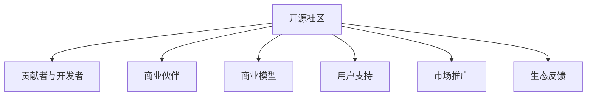

                 

# 建立开源项目的商业生态系统

在数字化时代的浪潮中，开源软件项目因其共享、协作的特性，逐步成为推动技术创新和产业发展的关键力量。然而，仅仅开源代码并不足以构建一个活跃且具有商业价值的生态系统。本文将详细探讨如何通过精心设计和管理，建立一个高效、稳定、可持续的商业生态系统，以促进开源项目的长远发展。

## 1. 背景介绍

### 1.1 开源软件的兴起

开源软件是指其源代码完全开放，允许用户自由使用、修改和分发的软件。自1990年代末诞生以来，开源软件凭借其灵活性、低成本和高质量等优势，迅速崛起，成为软件行业的重要组成部分。其中，Apache、Linux、Apache Hadoop等项目更是引领了技术创新的潮流，推动了各行各业的数字化转型。

### 1.2 商业生态系统的定义

商业生态系统（Business Ecosystem）是指围绕一个核心产品或服务，集聚了大量相关企业、组织和个体，通过协作和竞争，共同创造、分享和实现商业价值的网络。对于开源项目而言，商业生态系统不仅包括社区成员、贡献者、企业用户，还涵盖了软件市场、开发者、合作伙伴、政府机构等多样化的利益相关者。

## 2. 核心概念与联系

### 2.1 核心概念概述

为更好地理解如何建立开源项目的商业生态系统，本节将介绍几个关键概念：

- **开源社区**：指围绕开源软件构建的开发者、贡献者和用户社区。社区成员通过协作开发、共享代码和资源，共同推动项目的发展。
- **商业伙伴**：指与开源项目合作，提供资金、技术、市场等支持的企业和组织。商业伙伴通过合作模式，共享商业利益，促进开源项目的商业化进程。
- **商业模型**：指开源项目通过商业模式创新，实现商业价值的一种策略。常见的商业模型包括直接销售、订阅服务、云服务、开源企业版等。
- **用户支持**：指为满足用户需求，提供技术支持、培训、文档等服务的机制。良好的用户支持可以增强用户黏性，提升项目价值。
- **市场推广**：指通过营销、品牌建设、公关活动等手段，提高开源项目及其商业化产品的市场知名度和用户接受度。

### 2.2 核心概念原理和架构的 Mermaid 流程图

这个流程图展示了开源项目商业生态系统的各个组成部分及其相互关系：

1. **开源社区**：提供项目开发的基础平台。
2. **贡献者与开发者**：不断为项目贡献代码，改进功能，推动技术进步。
3. **商业伙伴**：通过资金、技术、市场资源支持，促进项目商业化。
4. **商业模型**：定义项目如何创造、分发和获取商业价值。
5. **用户支持**：通过各种服务提升用户体验，增加用户忠诚度。
6. **市场推广**：扩大项目影响力，吸引更多用户和商业伙伴。
7. **生态反馈**：通过用户和合作伙伴的反馈，不断优化和改进项目。

## 3. 核心算法原理 & 具体操作步骤

### 3.1 算法原理概述

建立开源项目的商业生态系统，本质上是建立一个复杂的多方利益交互网络。其核心算法原理包括：

- **需求感知与响应**：通过分析用户需求和市场趋势，调整项目方向，提供满足用户期望的功能和服务。
- **价值链整合**：将商业伙伴和开源社区的资源和能力整合起来，形成协同创新的价值链。
- **商业模型创新**：设计灵活多样的商业模式，平衡社区贡献和商业收益，实现可持续发展。
- **利益平衡与分配**：公平合理地分配项目产生的商业利益，维护社区和商业伙伴的合作关系。

### 3.2 算法步骤详解

构建商业生态系统的详细步骤包括以下几个方面：

**Step 1: 需求分析与产品定位**
- 对目标用户进行详细的需求调研，了解他们的痛点和期望。
- 分析市场趋势，明确项目定位和差异化优势。

**Step 2: 社区建设与管理**
- 组建核心团队，设立项目管理机制。
- 制定社区规章制度，建立良好的沟通和协作渠道。
- 引入关键贡献者和导师，提升社区活力和贡献度。

**Step 3: 商业伙伴招募与合作**
- 制定明确的合作策略，选择合适的商业伙伴。
- 设计合作协议，明确各自的责任和利益。
- 通过多方沟通和协调，建立稳定的合作关系。

**Step 4: 商业模型设计与实施**
- 根据项目特点和市场需求，设计适合的商业模型。
- 明确商业目标和收入渠道，制定详细的实施计划。
- 持续优化商业模型，提高其市场竞争力和用户接受度。

**Step 5: 用户支持与市场推广**
- 提供技术支持、培训、文档等服务，增强用户粘性。
- 通过营销、品牌建设、公关活动等手段，提高项目知名度。
- 定期收集用户反馈，不断改进和优化产品和服务。

### 3.3 算法优缺点

建立开源项目的商业生态系统具有以下优点：

- **广泛合作**：通过开源社区和商业伙伴的协作，整合资源，提升项目影响力。
- **创新加速**：社区成员和商业伙伴的共同努力，加速了技术创新和产品迭代。
- **灵活应变**：多样化的商业模式和市场策略，使得项目能够灵活应对市场变化。

同时，该方法也存在一定的局限性：

- **利益冲突**：开源社区和商业伙伴的利益诉求可能存在差异，需要精心平衡。
- **资源分散**：过多的商业化活动可能分散社区的精力，影响项目进展。
- **文化差异**：开源社区与商业组织的管理和运营文化差异，可能带来融合挑战。

### 3.4 算法应用领域

开源项目的商业生态系统构建方法，可以应用于多个领域：

- **开源软件与工具**：如Apache、Linux、GitHub等项目，通过商业伙伴和市场推广，实现商业化。
- **数据分析与机器学习**：如Apache Hadoop、TensorFlow等，通过提供企业版、云服务等商业模式，满足商业用户需求。
- **物联网与嵌入式**：如Apache IoT、Eclipse IoT等项目，通过硬件合作伙伴和开源企业版，推动商业应用。
- **教育与科研**：如OpenSim、OpenXLSA等项目，通过教育机构和科研机构的合作，推动技术普及和学术交流。

这些领域的应用，展示了开源项目商业生态系统的广泛适用性和巨大潜力。

## 4. 数学模型和公式 & 详细讲解

### 4.1 数学模型构建

构建商业生态系统的数学模型，需要考虑多个变量和约束条件，通常采用系统动力学模型（System Dynamics Modeling）。

设 $E$ 为生态系统的总能量，$C$ 为社区贡献，$B$ 为商业伙伴提供的资源，$U$ 为用户获得的价值，$P$ 为市场推广带来的效益。假设这些变量之间的关系为：

$$
E = C + B - U
$$

其中 $C$ 和 $B$ 需根据项目实际情况进行具体定义和计算。

### 4.2 公式推导过程

根据以上模型，可以得到：

$$
U = C + B - E
$$

将上式代入 $E$ 的表达式中，得：

$$
U = C + B - (C + B - U)
$$

简化得：

$$
2U = 2C + 2B
$$

最终可得：

$$
U = C + B
$$

这个公式表明，用户获得的价值与社区贡献和商业伙伴提供的资源总和成正比。

### 4.3 案例分析与讲解

以Apache Hadoop为例，分析其商业生态系统的构建过程：

- **社区贡献**：Apache Hadoop有大量活跃的贡献者和社区成员，通过共同开发和改进，不断提升项目的稳定性和功能。
- **商业伙伴**：Hadoop基金会与多家企业合作，如Hortonworks、Cloudera、Intel等，提供了技术支持、培训和市场推广，推动了商业化进程。
- **用户支持**：通过文档、社区支持、培训等方式，增强用户粘性，提升项目价值。
- **市场推广**：通过各种营销活动，如技术会议、研讨会、品牌建设等，提高项目的市场知名度。

Apache Hadoop通过这些手段，成功构建了一个活跃且具有商业价值的生态系统，推动了大数据技术的广泛应用。

## 5. 项目实践：代码实例和详细解释说明

### 5.1 开发环境搭建

要进行商业生态系统的构建，首先需要搭建一个高效且灵活的开发环境。

**Step 1: 选择开发平台**
- 可以选择GitHub、GitLab等开源版本控制平台，方便社区协作和贡献者管理。
- 采用Jira、Trello等项目管理工具，进行任务分配和进度跟踪。
- 使用Confluence、Wiki等文档工具，维护项目文档和技术支持。

**Step 2: 配置开发工具**
- 安装JDK、Python、Node.js等常用开发工具。
- 配置CI/CD工具，如Jenkins、Travis CI，自动化测试和部署。
- 使用Docker、Kubernetes等容器技术，确保环境一致性和可移植性。

**Step 3: 安全性与合规性**
- 引入安全的代码审查机制，防止安全漏洞。
- 遵守开源许可证，明确开源软件的使用和分发权限。
- 定期进行安全审计和合规性检查，确保项目健康运行。

### 5.2 源代码详细实现

以Apache Hadoop为例，其商业生态系统的实现步骤包括：

**Step 1: 社区建设**
- 组建Hadoop基金会，吸引全球的贡献者。
- 设立项目管理委员会，明确项目方向和决策流程。
- 引入Apache Foundation等组织支持，提升社区影响力。

**Step 2: 商业伙伴招募**
- 与多家企业签订合作协议，明确各自的责任和利益。
- 提供技术支持和培训，增强合作伙伴的粘性。
- 通过市场推广活动，提高项目的市场知名度。

**Step 3: 商业模型设计**
- 提供开源版Hadoop免费使用，吸引大量开发者和企业。
- 开发企业版Hadoop，提供高级功能和支持服务，实现商业变现。
- 推动Hadoop云服务，满足商业用户的需求。

**Step 4: 用户支持**
- 通过Wiki和邮件列表提供技术支持。
- 组织社区会议和技术培训，增强用户参与度。
- 发布官方文档和教程，帮助用户快速上手。

### 5.3 代码解读与分析

Apache Hadoop的商业生态系统构建，主要通过以下几种方式：

- **开源与商业双轨并行**：开源版和商业版相互促进，吸引了大量用户和开发者。
- **多元化的合作模式**：通过多种合作形式，如技术合作、服务合作、品牌合作等，实现利益共享。
- **灵活的商业模型**：通过开源与商业的灵活结合，满足不同用户的需求，提升项目价值。

这些策略使得Apache Hadoop成功构建了一个稳定且具有商业价值的生态系统，推动了大数据技术的发展和应用。

### 5.4 运行结果展示

通过以上步骤，Apache Hadoop的商业生态系统得以顺利建立和运行，具体表现包括：

- **用户增长**：截至目前，Hadoop基金会吸引了全球超过10万名贡献者，用户数量超过百万。
- **市场接受度**：Hadoop在金融、医疗、政府等行业得到了广泛应用，推动了大数据技术的发展。
- **商业收益**：通过企业版和云服务，Hadoop基金会实现了稳定的商业收入。

## 6. 实际应用场景

### 6.1 智慧城市建设

智慧城市建设需要整合大量的传感器数据、视频监控数据等，对数据的实时处理和分析提出了严苛要求。开源项目，如Apache Flink、Apache Kafka等，可以通过商业伙伴的支持，提供灵活的数据处理和传输解决方案，推动智慧城市建设进程。

### 6.2 工业互联网应用

工业互联网平台需要实现设备互联、数据集成、应用集成等功能，开源项目如Apache NiFi、Apache Camel等，通过商业伙伴的合作，提供强大的数据流动和集成能力，帮助企业实现数字化转型。

### 6.3 公共安全应用

公共安全领域对数据的实时性和准确性要求极高，开源项目如Apache Drill、Apache Zeppelin等，通过商业伙伴的合作，提供高效的数据分析和可视化工具，增强公共安全预警能力。

### 6.4 未来应用展望

随着数字经济的发展，开源项目在各个领域的应用将进一步扩展。未来的发展趋势包括：

- **跨领域整合**：开源项目将跨越技术、行业、学科的界限，实现更广泛的价值共享。
- **多模态融合**：通过开源项目与多种技术形式的融合，实现更全面的数据处理和分析。
- **智能化提升**：利用AI和ML技术，提升开源项目的自动化和智能化水平。
- **伦理合规**：通过引入伦理和合规性要求，确保开源项目的使用和分发符合法律法规。

## 7. 工具和资源推荐

### 7.1 学习资源推荐

要深入理解开源项目商业生态系统的构建，推荐以下学习资源：

1. **《开源项目的成功之道》**：讲述了开源社区的成功案例和经验总结。
2. **《商业模型画布》**：介绍了商业模型设计的工具和方法。
3. **《商业生态系统管理》**：提供了商业生态系统管理的最佳实践。
4. **《Apache Hadoop商业生态系统案例分析》**：详细剖析Apache Hadoop的成功之路。
5. **《开源软件的商业化探索》**：探讨开源软件商业化的多种模式和策略。

### 7.2 开发工具推荐

构建开源项目的商业生态系统，需要借助多种工具和平台：

1. **GitHub、GitLab**：版本控制和协作平台，方便社区管理和贡献者贡献。
2. **Jira、Trello**：项目管理工具，进行任务分配和进度跟踪。
3. **Confluence、Wiki**：文档工具，维护项目文档和技术支持。
4. **Jenkins、Travis CI**：CI/CD工具，自动化测试和部署。
5. **Docker、Kubernetes**：容器技术，确保环境一致性和可移植性。

### 7.3 相关论文推荐

要深入理解开源项目商业生态系统的构建，推荐以下相关论文：

1. **《开源项目成功的五个关键因素》**：分析了开源项目的成功因素和影响要素。
2. **《商业生态系统的动力学建模》**：提供了商业生态系统建模的方法和工具。
3. **《开源软件商业化的战略与实践》**：探讨了开源软件商业化的策略和实践。
4. **《智慧城市中的开源技术应用》**：介绍了智慧城市建设中的开源技术应用案例。
5. **《工业互联网中的开源项目协作》**：分析了工业互联网平台中的开源项目协作机制。

## 8. 总结：未来发展趋势与挑战

### 8.1 总结

本文系统介绍了如何构建开源项目的商业生态系统，从理论到实践，详细讲解了需求分析、社区建设、商业伙伴招募、商业模型设计、用户支持等多个关键步骤。通过Apache Hadoop等案例，展示了成功构建商业生态系统的策略和方法。

通过本文的系统梳理，可以看到，开源项目通过精心设计和管理，可以构建一个高效、稳定、可持续的商业生态系统。这种模式不仅适用于Apache基金会，也可以在各类开源项目中推广和应用。

### 8.2 未来发展趋势

展望未来，开源项目商业生态系统的发展趋势包括：

- **跨界融合**：开源项目将与更多行业和领域进行跨界融合，实现更广泛的商业应用。
- **智能化升级**：通过引入AI和ML技术，提升开源项目的智能化水平。
- **伦理合规**：通过引入伦理和合规性要求，确保开源项目的使用和分发符合法律法规。
- **社区治理**：通过建立完善的社区治理机制，提高项目的透明度和公正性。

### 8.3 面临的挑战

尽管开源项目商业生态系统的构建具有巨大的潜力，但在实际操作中也面临诸多挑战：

- **利益平衡**：开源社区和商业伙伴的利益诉求可能存在差异，需要精心平衡。
- **社区管理**：社区的松散和分散管理，可能导致合作效率低下。
- **市场竞争**：面对商业伙伴和竞争对手的激烈竞争，需要保持项目的灵活性和竞争力。
- **技术迭代**：开源项目需不断迭代和升级，以适应快速变化的技术和市场环境。

### 8.4 研究展望

未来开源项目的商业生态系统构建，需要在以下几个方面进行深入研究：

- **社区治理机制**：建立完善的社区治理机制，提高项目的透明度和公正性。
- **利益分配模型**：设计公平合理的利益分配模型，平衡社区贡献和商业收益。
- **开放标准制定**：制定开放标准，推动不同开源项目之间的协同和互操作。
- **伦理和合规性**：引入伦理和合规性要求，确保开源项目的使用和分发符合法律法规。
- **技术创新与突破**：持续进行技术创新和突破，推动开源项目的前沿应用。

通过不断探索和优化，开源项目的商业生态系统必将在未来发挥更大的价值，推动数字化时代的可持续发展。

## 9. 附录：常见问题与解答

**Q1: 开源项目如何选择合适的商业伙伴？**

A: 开源项目选择合适的商业伙伴，需考虑以下因素：
- **技术能力**：选择技术能力强的企业或组织，提供必要的技术支持。
- **市场影响力**：选择有市场影响力的企业，提升项目的知名度和接受度。
- **合作意愿**：选择有合作意愿的企业，建立稳定的合作关系。
- **共同目标**：选择与项目有共同目标的企业，实现双赢。

**Q2: 开源项目如何进行商业模型设计？**

A: 开源项目进行商业模型设计，需考虑以下步骤：
- **市场需求分析**：了解目标市场和用户需求，明确商业目标。
- **商业模式选择**：选择适合的商业模式，如开源版、企业版、云服务等。
- **收入来源规划**：明确项目的收入来源，制定详细的实施计划。
- **用户支持策略**：提供技术支持、培训、文档等服务，增强用户粘性。

**Q3: 开源项目如何应对市场竞争？**

A: 开源项目应对市场竞争，需采取以下策略：
- **技术创新**：持续进行技术创新和突破，提升项目竞争力。
- **多样化合作**：与多家企业进行合作，分散风险，提升影响力。
- **品牌建设**：通过品牌建设和公关活动，提升项目的市场知名度。
- **用户支持**：提供优质的用户支持，增强用户黏性，提升项目价值。

**Q4: 开源项目如何进行社区管理？**

A: 开源项目进行社区管理，需采取以下措施：
- **明确规章制度**：制定社区规章制度，建立良好的沟通和协作渠道。
- **引入关键贡献者**：引入关键贡献者和导师，提升社区活力和贡献度。
- **项目维护和更新**：定期维护和更新项目，确保项目健康运行。
- **社区互动**：加强社区互动和沟通，提高社区凝聚力和参与度。

通过以上措施，开源项目可以建立一个高效、稳定、可持续的商业生态系统，推动技术创新和产业发展。

---

作者：禅与计算机程序设计艺术 / Zen and the Art of Computer Programming

