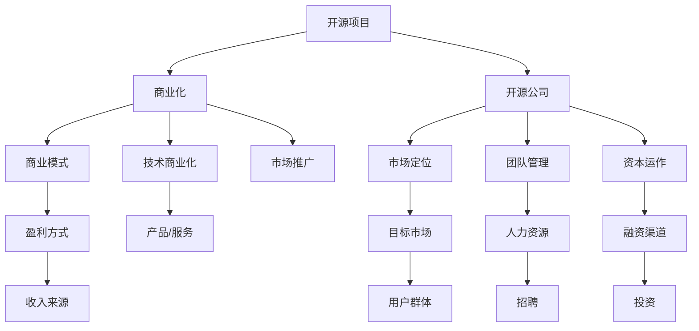

                 

# 开源创业：从项目到公司的转型之路

> 关键词：开源,创业,项目转型,公司运营,软件开发,技术商业化

## 1. 背景介绍

### 1.1 问题由来
近年来，开源运动在软件开发领域中迅速兴起，引领了全球软件行业的巨大变革。开源项目不仅推动了技术的创新和传播，还催生了许多开源公司，将优质的开源资源转化为实实在在的商业价值。开源创业的案例日益增多，吸引了越来越多的开发者和投资者关注。

然而，从开源项目到开源公司的转型并非易事，背后涉及技术、业务、市场、团队等多方面的挑战。如何高效地将开源项目转型为公司，实现商业化运营，是很多开发者和创业者的困惑所在。本文将从开源项目到公司转型的全流程出发，详细介绍这一过程中的关键环节和应对策略，希望能为开源创业者提供实用的指南。

### 1.2 问题核心关键点
开源项目向开源公司转型的关键在于：

- **技术沉淀**：如何将项目积累的技术沉淀转化为可商业化的产品或服务。
- **商业化策略**：如何制定并执行有效的商业化策略，实现收入增长。
- **市场定位**：确定公司的市场定位和目标用户，明确竞争优势。
- **团队管理**：组建和管理一支高效、有执行力的团队，确保项目和公司顺利发展。
- **资本运作**：如何吸引投资，合理利用资本资源，加速公司成长。
- **法律合规**：处理开源项目和商业化过程中的法律合规问题，避免法律风险。

通过解决这些关键点，开源创业者可以顺利实现从项目到公司的转型。

## 2. 核心概念与联系

### 2.1 核心概念概述

开源创业涉及多个关键概念，下面对它们进行简单概述：

- **开源项目**：基于公开许可协议（如GPL、Apache、MIT等）共享源代码的软件项目，旨在通过社区协作推动技术发展。
- **商业化**：将开源项目的技术、产品或服务转化为具有市场竞争力的商业模式，实现商业收入。
- **开源公司**：基于开源项目或技术，通过商业化运营，实现持续盈利和发展的公司。
- **技术商业化**：将技术转化为商品或服务，并推广到市场的过程。
- **市场定位**：确定公司的目标市场和用户群体，以及与之对应的产品或服务特性。
- **商业模式**：公司实现盈利的主要方式，包括产品销售、订阅服务、广告收入等。
- **团队管理**：组建和管理一支高效、灵活的团队，确保项目的顺利推进和公司的持续发展。
- **资本运作**：通过融资、投资等方式获取资金，加速公司成长。
- **法律合规**：遵守相关的知识产权法律和协议，避免法律风险。

这些概念之间的关系可以通过以下Mermaid流程图来展示：



这个流程图展示了开源创业的主要环节：

1. 开源项目通过商业化转变为开源公司。
2. 开源公司在确定市场定位和用户群体后，设计相应的商业模式和盈利方式。
3. 技术商业化为公司提供了产品和服务的核心竞争力。
4. 市场推广帮助公司在目标市场获得用户和收入。
5. 团队管理确保公司运营的高效性和灵活性。
6. 资本运作提供资金支持，加速公司发展。
7. 法律合规保障公司运营的合法性，避免法律风险。

这些概念紧密联系，共同构成了开源创业的核心框架。

## 3. 核心算法原理 & 具体操作步骤
### 3.1 算法原理概述

开源项目到开源公司转型的主要依据是技术商业化，即将开源项目的技术优势转化为具有市场竞争力的产品或服务。以下是这一转型的主要算法原理：

1. **需求分析**：分析目标市场的需求，确定产品或服务的功能和特性。
2. **技术评估**：评估开源项目的技术积累和可商业化的部分。
3. **商业模型设计**：设计商业模型，确定盈利方式和收入来源。
4. **市场定位**：明确公司的市场定位和目标用户。
5. **团队建设**：组建和管理高效的团队，确保项目和公司顺利推进。
6. **融资和投资**：通过融资和投资获取资金，支持公司成长。
7. **法律合规**：处理知识产权和法律合规问题，确保合法运营。

### 3.2 算法步骤详解

开源项目向开源公司转型的具体步骤如下：

**Step 1: 技术沉淀**
- 对开源项目进行技术评估，确定最具商业化潜力的技术或功能。
- 对关键技术进行提炼和优化，确保其可以转化为可商业化的产品或服务。

**Step 2: 商业化策略制定**
- 分析目标市场需求，确定产品的功能特性。
- 设计商业模型，确定盈利方式和收入来源。
- 制定市场推广策略，规划产品上市和市场扩展路径。

**Step 3: 团队建设**
- 组建具有技术能力和商业意识的核心团队，确保项目和公司顺利推进。
- 根据市场需要，招聘和培养相关人才，构建高效的团队结构。

**Step 4: 融资和投资**
- 制定融资计划，选择合适的融资渠道（如天使投资、风险投资等）。
- 准备融资材料，向投资者展示公司的商业潜力和增长前景。
- 管理好投资资金，确保公司健康发展。

**Step 5: 法律合规**
- 处理开源协议和知识产权问题，确保合法运营。
- 制定数据隐私和安全策略，保护用户数据和公司资产。

**Step 6: 产品开发**
- 基于市场需求和技术评估，设计产品原型。
- 开发和测试产品，优化用户体验和技术性能。
- 推出市场，进行市场推广和用户反馈收集。

**Step 7: 运营管理**
- 根据市场反馈和用户需求，不断迭代和改进产品。
- 建立销售和客户支持体系，提升用户体验和满意度。
- 持续关注市场动态和技术发展，调整公司战略和运营方向。

### 3.3 算法优缺点

开源项目向开源公司转型的优点：

- **成本低**：利用已有技术沉淀，减少研发成本和市场验证成本。
- **速度优势**：开源社区的协作机制可以加速产品开发和市场推广。
- **市场快速响应**：开源项目的灵活性使得公司能够快速适应市场变化。

开源项目向开源公司转型的缺点：

- **知识产权风险**：开源项目存在版权问题，需要处理法律合规。
- **技术风险**：开源项目的技术稳定性和成熟度可能影响商业化进程。
- **市场风险**：目标市场的需求变化和竞争格局可能导致商业失败。

### 3.4 算法应用领域

开源项目向开源公司转型的范式可以应用于各种规模和类型的公司，特别是以下领域：

- **软件开发**：开源项目如Apache、Linux、Git等广泛应用于软件开发，可快速转化为SaaS、PaaS、IaaS等商业服务。
- **互联网应用**：开源项目如Node.js、React等广泛应用于Web开发，可以转型为云服务提供商或开发平台。
- **硬件和制造**：开源项目如Arduino、OpenSCAD等应用于硬件和制造，可以转型为智能硬件解决方案提供商。
- **教育和科研**：开源项目如OpenSSL、OpenCV等应用于教育和科研，可以转型为教育和科研软件提供商。

这些领域的开源创业案例为开源项目向公司转型的可行性提供了丰富的参考。

## 4. 数学模型和公式 & 详细讲解
### 4.1 数学模型构建

本节将使用数学语言对开源项目向开源公司转型的过程进行更加严格的刻画。

记开源项目的技术价值为 $T$，市场需求为 $M$，商业化潜力为 $C$。开源项目转化为公司的数学模型为：

$$
C = f(T, M, \text{团队能力}, \text{融资能力}, \text{法律合规})
$$

其中，$f$ 表示函数映射关系，表示公司商业化的可能性。

### 4.2 公式推导过程

为了简化模型，假设市场需求 $M$ 和开源项目技术 $T$ 分别为固定值，则公司商业化的可能性可以表示为：

$$
C = \max(\text{团队能力}, \text{融资能力}, \text{法律合规})
$$

具体地，公司商业化的过程可以分为三个步骤：

1. 技术评估 $T$：评估技术成熟度和商业化潜力，确保其能够满足市场需求。
2. 团队建设：组建高效的团队，确保项目顺利推进和公司健康发展。
3. 融资和投资：获取资金支持，加速公司成长和市场扩展。

技术评估 $T$ 的数学模型为：

$$
T = T_0 + \sum_{i=1}^{n} t_i
$$

其中，$T_0$ 为技术的基本价值，$t_i$ 为第 $i$ 项技术改进带来的增值。

团队能力 $C_{\text{team}}$ 的数学模型为：

$$
C_{\text{team}} = \max(a_1, a_2, ..., a_n)
$$

其中，$a_i$ 为第 $i$ 个团队成员的能力。

融资能力 $C_{\text{funding}}$ 的数学模型为：

$$
C_{\text{funding}} = \max(b_1, b_2, ..., b_m)
$$

其中，$b_i$ 为第 $i$ 个融资渠道的资金规模。

### 4.3 案例分析与讲解

以GitHub为例，分析开源项目向开源公司转型的过程。GitHub通过将开源代码托管平台转型为软件开发协作工具，实现了商业化成功。

**Step 1: 技术沉淀**
- GitHub的核心技术是分布式版本控制系统Git，具有高度的稳定性和成熟度。
- 通过开源社区的贡献和协作，GitHub积累了丰富的技术沉淀。

**Step 2: 商业化策略制定**
- 制定了“开发者服务+企业服务”的商业模式，提供SaaS和PaaS服务。
- 推出GitHub Enterprise版，针对企业用户提供定制化服务。

**Step 3: 团队建设**
- 组建了一支具有丰富软件开发经验和开源社区背景的团队，确保项目顺利推进。
- 招聘了大量技术人才，构建了高效的技术研发和客户支持体系。

**Step 4: 融资和投资**
- GitHub通过风险投资和融资渠道获得了大量资金支持。
- 利用融资资金进行产品开发和市场推广，加速公司成长。

**Step 5: 法律合规**
- GitHub处理了开源协议和知识产权问题，确保合法运营。
- 制定了数据隐私和安全策略，保护用户数据和公司资产。

通过以上步骤，GitHub成功将开源项目转型为开源公司，实现了持续的商业增长。

## 5. 项目实践：代码实例和详细解释说明
### 5.1 开发环境搭建

在进行开源创业实践前，我们需要准备好开发环境。以下是使用Python进行开源创业环境配置的流程：

1. 安装Anaconda：从官网下载并安装Anaconda，用于创建独立的Python环境。

2. 创建并激活虚拟环境：
```bash
conda create -n startup-env python=3.8 
conda activate startup-env
```

3. 安装Python和开发工具：
```bash
pip install pip --upgrade
pip install numpy pandas scikit-learn matplotlib tqdm jupyter notebook ipython
```

4. 安装GitHub API库：
```bash
pip install gitpython
```

5. 安装Flask框架：
```bash
pip install flask
```

完成上述步骤后，即可在`startup-env`环境中开始开源创业实践。

### 5.2 源代码详细实现

下面我们以开源项目Apache Flask为例，给出开源创业项目的Python代码实现。

首先，定义API接口：

```python
from flask import Flask, jsonify, request

app = Flask(__name__)

@app.route('/api/hello', methods=['GET'])
def hello():
    return jsonify({'message': 'Hello, World!'})

@app.route('/api/data', methods=['POST'])
def data():
    data = request.json
    return jsonify(data)

if __name__ == '__main__':
    app.run(debug=True, host='0.0.0.0', port=5000)
```

然后，定义测试接口：

```python
import unittest
from flask import Flask

class TestHelloWorld(unittest.TestCase):
    def setUp(self):
        self.app = Flask(__name__)

    def test_hello_world(self):
        response = self.app.test_client().get('/api/hello')
        self.assertEqual(response.status_code, 200)
        self.assertEqual(response.data, b'{"message": "Hello, World!"}')

if __name__ == '__main__':
    unittest.main()
```

接着，启动API测试：

```bash
python test_hello_world.py
```

以上代码实现了Apache Flask的API接口和单元测试，展示了开源创业项目的Python代码实现。

### 5.3 代码解读与分析

让我们再详细解读一下关键代码的实现细节：

**Flask应用初始化**：
- 通过`Flask(__name__)`初始化Flask应用，并设置应用程序名称。

**API接口定义**：
- 通过`@app.route`装饰器定义API接口，指定URL路径和HTTP方法。
- 在`hello`接口中，返回JSON格式的`Hello, World!`消息。
- 在`data`接口中，接收POST请求的JSON数据，并返回原始数据。

**测试代码实现**：
- 通过`unittest`框架编写测试用例，模拟API请求和响应。
- 使用`self.app.test_client()`获取测试客户端对象，进行HTTP请求。
- 通过断言检查请求的响应状态码和响应数据是否符合预期。

这些代码展示了开源创业项目的基本实现过程，包括API接口定义和单元测试。通过Flask框架，开发者可以快速构建Web应用，实现开源创业项目的功能。

### 5.4 运行结果展示

运行上述代码，可以通过浏览器访问`http://127.0.0.1:5000/api/hello`，得到`Hello, World!`的响应。同时，可以通过POST请求发送JSON数据，验证`/api/data`接口的响应。

## 6. 实际应用场景
### 6.1 智能制造

开源项目向开源公司转型的典型应用场景之一是智能制造。智能制造通过将开源技术应用于工业生产，实现了生产自动化、智能化和高效化。

以OpenVAS为例，OpenVAS是一个开源的网络漏洞扫描工具，通过将其商业化，OpenVAS公司为各行各业的企业提供了高效的网络安全解决方案。OpenVAS通过将开源技术转化为可商业化的产品，实现了从项目到公司的转型。

具体而言，OpenVAS公司将OpenVAS技术应用于安全扫描服务，帮助企业检测和修复网络漏洞，提升网络安全防护水平。通过商业化运作，OpenVAS公司实现了稳定的收入增长和市场扩展。

### 6.2 医疗健康

开源项目向开源公司转型的另一个重要领域是医疗健康。开源项目在医疗健康领域的应用，可以提升医疗服务的效率和质量。

以OpenEMR为例，OpenEMR是一个开源的电子病历系统，通过将其商业化，OpenEMR公司为全球各地的医院提供了高效的医疗信息管理解决方案。OpenEMR通过将开源技术转化为可商业化的医疗软件，实现了从项目到公司的转型。

具体而言，OpenEMR公司将OpenEMR技术应用于电子病历管理，帮助医院管理患者数据、优化诊疗流程。通过商业化运作，OpenEMR公司实现了稳定的收入增长和市场扩展。

### 6.3 智能教育

开源项目向开源公司转型的第三个典型场景是智能教育。开源项目在教育领域的应用，可以提升教育质量和教育资源的普及。

以Open edX为例，Open edX是一个开源的在线教育平台，通过将其商业化，Open edX公司为全球各地的教育机构提供了高质量的在线课程和教学支持。Open edX通过将开源技术转化为可商业化的在线教育平台，实现了从项目到公司的转型。

具体而言，Open edX公司将Open edX技术应用于在线教育，帮助教育机构提供高质量的课程资源和教学支持。通过商业化运作，Open edX公司实现了稳定的收入增长和市场扩展。

### 6.4 未来应用展望

随着开源项目向开源公司转型的不断深入，未来在更多领域将涌现更多的应用场景，为各行各业带来深刻的变革：

1. **环保科技**：开源项目应用于环保科技，提升环境监测和治理水平。
2. **金融科技**：开源项目应用于金融科技，提供智能投顾和金融服务。
3. **农业科技**：开源项目应用于农业科技，提升农业生产效率和质量。
4. **智慧城市**：开源项目应用于智慧城市，提升城市管理和公共服务水平。

未来，开源项目向开源公司转型的应用领域将更加广泛，为各行各业带来更多的创新和机遇。

## 7. 工具和资源推荐
### 7.1 学习资源推荐

为了帮助开发者系统掌握开源创业的理论基础和实践技巧，这里推荐一些优质的学习资源：

1. **《开源项目创业指南》系列博文**：由开源创业专家撰写，深入浅出地介绍了开源创业的各个环节和关键点，涵盖技术评估、团队建设、融资策略等。

2. **CS241《软件创业》课程**：斯坦福大学开设的创业课程，提供系统的开源创业理论和方法，适合想要转型开源创业的开发者。

3. **《开源创业实战指南》书籍**：开源创业实践专家所著，系统讲解了开源项目向开源公司转型的全流程，包括技术评估、商业化策略、市场推广等。

4. **GitHub官方文档**：GitHub提供的官方文档和教程，详细介绍了GitHub平台的使用和开源项目商业化过程，是开源创业的重要参考资料。

5. **开源社区平台**：如Apache Software Foundation、Linux Foundation等，提供了丰富的开源项目资源和商业化案例，值得深入学习和研究。

通过对这些资源的学习实践，相信你一定能够快速掌握开源创业的理论基础和实践技巧，顺利实现从项目到公司的转型。

### 7.2 开发工具推荐

高效的开发离不开优秀的工具支持。以下是几款用于开源创业开发的常用工具：

1. **GitHub**：全球最大的代码托管平台，提供代码管理、版本控制和社区协作功能，是开源创业项目的基础设施。
2. **Jenkins**：开源的自动化工具，支持持续集成和持续部署(CI/CD)，帮助开源创业项目高效构建和部署。
3. **Docker**：开源的容器化平台，提供应用打包、部署和运维的解决方案，支持跨平台和跨环境的部署。
4. **Kubernetes**：开源的容器编排平台，提供容器集群管理和自动化部署功能，支持大规模应用部署和扩展。
5. **Jupyter Notebook**：开源的交互式开发环境，支持Python、R等语言的混合编程，适合快速迭代和开发验证。

合理利用这些工具，可以显著提升开源创业项目的开发效率，加快创新迭代的步伐。

### 7.3 相关论文推荐

开源项目向开源公司转型的研究源于学界的持续研究。以下是几篇奠基性的相关论文，推荐阅读：

1. **《开源软件的商业化：挑战与策略》**：该论文系统探讨了开源软件的商业化过程，提出了多种开源项目向开源公司转型的策略和路径。
2. **《开源创业的成功因素》**：该论文通过实证研究，分析了开源创业成功的重要因素，包括技术沉淀、商业化策略、团队管理等。
3. **《开源项目商业化的模式与方法》**：该论文详细介绍了开源项目商业化的多种模式和具体方法，提供了丰富的案例和实践建议。
4. **《开源公司的发展路径》**：该论文探讨了开源公司的发展路径和战略选择，提出了多种开源公司成长和扩张的策略。

这些论文代表了大规模开源创业的实践方向，对于开源创业者具有重要的参考价值。

## 8. 总结：未来发展趋势与挑战
### 8.1 总结

本文对开源项目向开源公司转型的全流程进行了详细系统的介绍。首先阐述了开源项目向开源公司转型的背景和意义，明确了这一转型过程的重要性。其次，从原理到实践，详细讲解了开源创业的数学模型和关键步骤，给出了开源创业项目的完整代码实例。同时，本文还广泛探讨了开源创业在智能制造、医疗健康、智能教育等多个领域的应用前景，展示了开源创业的广阔发展空间。此外，本文精选了开源创业的技术资源，力求为开发者提供全方位的技术指引。

通过本文的系统梳理，可以看到，开源创业的可行性和优势，以及在这一过程中需要考虑的关键环节和应对策略。开源创业将促进技术创新和传播，推动各行各业数字化转型升级，为经济社会发展注入新的动力。未来，伴随开源社区的不断发展和商业化实践的深入，开源创业必将在更多的领域得到应用，引领技术创新和产业变革。

### 8.2 未来发展趋势

展望未来，开源创业将呈现以下几个发展趋势：

1. **技术融合加速**：开源创业将与其他技术融合发展，如人工智能、物联网、区块链等，提升产品和技术竞争力。
2. **生态系统完善**：开源创业将构建更完善的生态系统，包括开源社区、技术合作伙伴、商业用户等，形成良性互动。
3. **商业模式创新**：开源创业将探索多种商业模式，如SaaS、PaaS、IaaS、API等，满足不同用户的需求和场景。
4. **全球化布局**：开源创业将拓展全球市场，利用开源技术的普适性和兼容性，实现国际化发展。
5. **持续创新能力**：开源创业将注重持续创新，不断引入新技术、新业务和新模式，保持竞争优势。
6. **社会价值提升**：开源创业将更加注重社会价值，提升技术在公共服务、环保科技等领域的应用，实现可持续发展。

这些趋势凸显了开源创业的广阔前景，为开源创业者提供了更多的机遇和挑战。

### 8.3 面临的挑战

尽管开源创业已经取得了显著成就，但在迈向更加智能化、普适化应用的过程中，它仍面临诸多挑战：

1. **知识产权风险**：开源项目涉及版权和专利问题，需要处理法律合规。
2. **市场竞争激烈**：开源创业面临激烈的市场竞争，需要不断创新和优化产品。
3. **用户需求多样**：开源创业需要满足不同用户的需求，设计灵活的解决方案。
4. **技术成熟度不足**：开源项目技术可能不成熟，需要进一步完善和优化。
5. **资本运作风险**：融资和投资需谨慎，避免资本运作风险。
6. **团队管理困难**：开源创业需要高效团队管理，提升项目推进速度。

这些挑战需要通过持续的创新和优化，逐步克服。

### 8.4 研究展望

未来，开源创业的研究需要在以下几个方面寻求新的突破：

1. **技术创新**：开发更加先进和高效的技术，提升开源创业项目的竞争力。
2. **商业模型创新**：探索多种商业模式，满足不同用户的需求和场景。
3. **市场拓展**：拓展全球市场，实现国际化发展。
4. **团队建设**：组建高效团队，提升项目推进速度和公司管理能力。
5. **资本运作优化**：优化融资和投资策略，降低资本运作风险。
6. **社会价值提升**：提升开源创业项目在公共服务、环保科技等领域的社会价值。

这些研究方向将为开源创业者提供更全面的指导，推动开源创业向更高的台阶迈进。

## 9. 附录：常见问题与解答
**Q1：开源项目向开源公司转型的关键步骤有哪些？**

A: 开源项目向开源公司转型的关键步骤包括：技术沉淀、商业化策略制定、团队建设、融资和投资、法律合规、产品开发和运营管理。这些步骤需要持续迭代和优化，确保项目和公司顺利发展。

**Q2：开源创业需要考虑哪些法律问题？**

A: 开源创业需要考虑的法律问题包括：开源协议、知识产权、数据隐私、用户合同等。需要处理这些法律问题，确保合规运营，避免法律风险。

**Q3：开源创业的盈利模式有哪些？**

A: 开源创业的盈利模式包括：SaaS、PaaS、IaaS、API、广告收入、订阅服务等。需要根据产品和市场特点选择适合的盈利模式，提升收入水平。

**Q4：开源创业的成功因素有哪些？**

A: 开源创业的成功因素包括：技术沉淀、商业化策略、市场推广、团队建设、融资和投资、法律合规等。需要综合考虑这些因素，确保开源创业项目的顺利推进和持续发展。

**Q5：开源创业的难点在哪里？**

A: 开源创业的难点在于技术沉淀、市场推广、融资和投资、团队建设、法律合规等方面。需要不断探索和优化，提升开源创业的成功率。

这些问题的回答展示了开源创业的复杂性和挑战性，希望能为开源创业者提供有价值的参考。

---

作者：禅与计算机程序设计艺术 / Zen and the Art of Computer Programming

