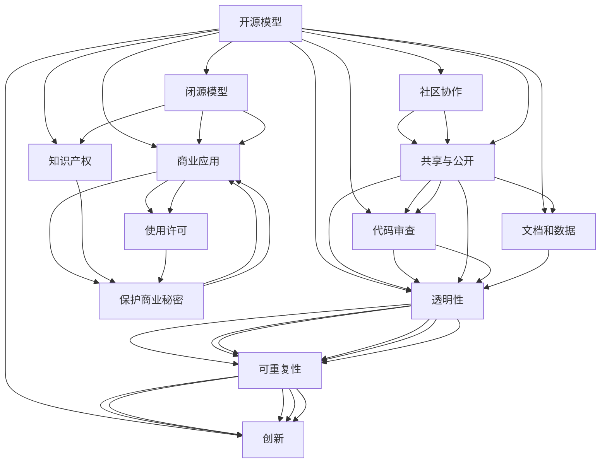

                 

# 开源模型与闭源模型的对比

## 1. 背景介绍

在当前人工智能（AI）快速发展的时代，开源模型和闭源模型已成为推动AI技术进步和产业应用的两大重要力量。开源模型通常由社区或机构发布，以促进共享和协作，而闭源模型则由公司或研究机构开发，通常用于商业应用或知识产权保护。本文将对比开源模型和闭源模型，探讨它们在研究、开发、应用和生态系统中的优劣，以及未来可能的发展趋势和挑战。

## 2. 核心概念与联系

### 2.1 核心概念概述

- **开源模型**：指通过公开的代码、数据和文档，允许任何人使用、修改和共享的AI模型。开源模型旨在推动AI技术的透明度、可重复性和创新。

- **闭源模型**：指由公司或研究机构开发，不公开源代码和内部设计细节的AI模型。闭源模型通常用于商业应用，以保护知识产权和商业秘密。

### 2.2 核心概念原理和架构的 Mermaid 流程图



## 3. 核心算法原理 & 具体操作步骤

### 3.1 算法原理概述

开源模型和闭源模型在算法原理上并无本质区别，它们都可以基于深度学习、机器学习等方法进行训练和优化。然而，由于开源模型通常有更多的社区参与，其算法和架构设计会更加多样化和灵活。闭源模型则更注重算法效率和性能优化，以适应特定的应用场景。

### 3.2 算法步骤详解

#### 3.2.1 开源模型的开发步骤

1. **项目立项**：确定模型目标和应用场景。
2. **数据收集与处理**：收集并预处理训练数据，确保数据的多样性和代表性。
3. **算法设计**：选择或设计合适的算法架构，包括模型结构、优化器和损失函数等。
4. **模型训练**：在计算资源上运行模型训练，调整超参数以优化性能。
5. **模型验证与优化**：在验证集上进行模型评估，进一步优化模型参数和架构。
6. **模型发布与维护**：将模型代码、文档和数据发布到开源社区，接受反馈并持续改进。

#### 3.2.2 闭源模型的开发步骤

1. **项目规划**：明确商业目标和用户需求。
2. **内部研发**：组建研发团队，使用闭源工具进行模型开发和训练。
3. **性能测试**：在内部环境测试模型性能，确保满足商业要求。
4. **模型部署**：将模型部署到生产环境，并提供必要的API接口。
5. **客户支持**：为客户提供技术支持和维护服务。

### 3.3 算法优缺点

#### 3.3.1 开源模型的优缺点

- **优点**：
  - **透明度高**：源代码和算法公开，便于社区监督和协作。
  - **社区支持**：通过社区贡献代码和反馈，持续改进模型。
  - **多样性**：算法和架构设计多样化，满足不同应用需求。
  - **可重复性**：任何人可以复制和修改代码，促进研究创新。

- **缺点**：
  - **安全性问题**：开源模型可能存在安全漏洞，受攻击风险较高。
  - **性能差异**：社区贡献的算法和代码质量参差不齐，可能影响模型性能。
  - **维护成本**：社区参与者众多，版本控制和问题解决复杂。

#### 3.3.2 闭源模型的优缺点

- **优点**：
  - **性能优异**：闭源模型通常经过严格测试，性能稳定可靠。
  - **安全性高**：封闭的开发环境可以有效防止安全漏洞。
  - **商业应用**：满足特定的商业需求，具有实际应用价值。
  - **支持服务**：提供专业的技术支持和维护服务，保障用户体验。

- **缺点**：
  - **透明度低**：算法和架构设计不公开，难以进行外部审计和监督。
  - **难以定制**：模型通常是特定场景的定制，难以广泛应用。
  - **成本高昂**：研发和维护成本较高，对中小企业不友好。

### 3.4 算法应用领域

开源模型和闭源模型在多个领域都有广泛的应用，具体如下：

#### 3.4.1 开源模型应用领域

- **学术研究**：促进学术交流和研究合作，推动前沿技术的发展。
- **开源社区**：建立开源项目，吸引开发者贡献代码和资源。
- **教育培训**：用于教学和培训，培养AI人才。
- **科学研究**：支持大规模数据处理和计算。

#### 3.4.2 闭源模型应用领域

- **商业应用**：应用于企业级的解决方案，如金融、医疗、物流等。
- **内部研发**：企业内部研发团队使用闭源工具进行模型开发。
- **安全应用**：应用于需要高度安全性的场景，如国防、国家安全等。

## 4. 数学模型和公式 & 详细讲解 & 举例说明

### 4.1 数学模型构建

#### 4.1.1 开源模型的数学模型

开源模型通常基于深度学习算法，如卷积神经网络（CNN）、循环神经网络（RNN）和深度神经网络（DNN）等。以下以卷积神经网络为例，介绍开源模型的数学模型构建过程：

- **输入层**：接受输入数据，如图像像素值。
- **卷积层**：通过卷积核提取特征。
- **池化层**：对特征进行下采样，减少计算量。
- **全连接层**：将特征映射到输出层。
- **输出层**：产生最终预测结果，如分类或回归。

#### 4.1.2 闭源模型的数学模型

闭源模型的数学模型构建与开源模型相似，但更注重算法效率和性能优化。以下以卷积神经网络为例，介绍闭源模型的数学模型构建过程：

- **输入层**：接受输入数据，如图像像素值。
- **卷积层**：通过卷积核提取特征。
- **激活函数**：对卷积结果进行非线性变换。
- **池化层**：对特征进行下采样，减少计算量。
- **全连接层**：将特征映射到输出层。
- **输出层**：产生最终预测结果，如分类或回归。

### 4.2 公式推导过程

#### 4.2.1 开源模型的公式推导

- **卷积层公式**：
$$
f(x_i, w) = \sum_{j=1}^n w_j \times x_{i,j}
$$

- **池化层公式**：
$$
f(x_i) = \max(x_{i,j}), \text{其中} j = 1,2,...,m
$$

- **全连接层公式**：
$$
f(x) = Wx + b
$$

#### 4.2.2 闭源模型的公式推导

- **卷积层公式**：
$$
f(x_i, w) = \sum_{j=1}^n w_j \times x_{i,j}
$$

- **激活函数公式**：
$$
f(x) = \sigma(x)
$$

- **池化层公式**：
$$
f(x_i) = \max(x_{i,j}), \text{其中} j = 1,2,...,m
$$

- **全连接层公式**：
$$
f(x) = Wx + b
$$

### 4.3 案例分析与讲解

#### 4.3.1 开源模型的案例

- **ImageNet项目**：由开源社区开发的图像分类项目，模型基于卷积神经网络，在ImageNet数据集上取得了优异性能。
- **TensorFlow项目**：由Google开发的开源深度学习框架，支持多种模型和算法，广泛用于学术研究和工业应用。

#### 4.3.2 闭源模型的案例

- **BERT模型**：由Google开发的闭源自然语言处理模型，基于Transformer架构，广泛应用于文本分类、命名实体识别等任务。
- **TensorFlow Serving**：Google开发的闭源模型服务框架，支持将模型部署为RESTful服务，便于集成调用。

## 5. 项目实践：代码实例和详细解释说明

### 5.1 开发环境搭建

#### 5.1.1 开源模型环境搭建

1. **安装Python**：
   ```
   sudo apt-get update
   sudo apt-get install python3
   ```

2. **安装TensorFlow**：
   ```
   pip install tensorflow
   ```

3. **安装Keras**：
   ```
   pip install keras
   ```

#### 5.1.2 闭源模型环境搭建

1. **安装Python**：
   ```
   sudo apt-get update
   sudo apt-get install python3
   ```

2. **安装TensorFlow**：
   ```
   pip install tensorflow
   ```

3. **安装TensorFlow Serving**：
   ```
   pip install tf_serving_api
   ```

### 5.2 源代码详细实现

#### 5.2.1 开源模型代码实现

```python
from tensorflow.keras.models import Sequential
from tensorflow.keras.layers import Conv2D, MaxPooling2D, Flatten, Dense

model = Sequential()
model.add(Conv2D(32, (3, 3), activation='relu', input_shape=(32, 32, 3)))
model.add(MaxPooling2D(pool_size=(2, 2)))
model.add(Conv2D(64, (3, 3), activation='relu'))
model.add(MaxPooling2D(pool_size=(2, 2)))
model.add(Flatten())
model.add(Dense(128, activation='relu'))
model.add(Dense(10, activation='softmax'))

model.compile(optimizer='adam', loss='categorical_crossentropy', metrics=['accuracy'])
```

#### 5.2.2 闭源模型代码实现

```python
import tensorflow as tf
import tensorflow_serving.apis

model = tf.keras.models.Sequential([
    tf.keras.layers.Conv2D(32, (3, 3), activation='relu', input_shape=(32, 32, 3)),
    tf.keras.layers.MaxPooling2D(pool_size=(2, 2)),
    tf.keras.layers.Conv2D(64, (3, 3), activation='relu'),
    tf.keras.layers.MaxPooling2D(pool_size=(2, 2)),
    tf.keras.layers.Flatten(),
    tf.keras.layers.Dense(128, activation='relu'),
    tf.keras.layers.Dense(10, activation='softmax')
])

model.compile(optimizer='adam', loss='categorical_crossentropy', metrics=['accuracy'])

# 将模型导出为TensorFlow Serving可用的格式
tensorflow_serving.apis.polymorphic_save_model(model, 'model.pb', signatures=[model.signatures['serving_default']])
```

### 5.3 代码解读与分析

#### 5.3.1 开源模型代码解读

- **模型定义**：使用Keras定义卷积神经网络，包括卷积层、池化层、全连接层等。
- **编译模型**：设置优化器、损失函数和评价指标。
- **训练模型**：使用训练数据集训练模型。

#### 5.3.2 闭源模型代码解读

- **模型定义**：使用TensorFlow定义卷积神经网络，包括卷积层、池化层、全连接层等。
- **编译模型**：设置优化器、损失函数和评价指标。
- **导出模型**：将模型导出为TensorFlow Serving可用的格式，便于部署和使用。

### 5.4 运行结果展示

#### 5.4.1 开源模型运行结果

```python
# 训练模型
model.fit(train_data, train_labels, epochs=10, validation_data=(val_data, val_labels))

# 评估模型
test_loss, test_acc = model.evaluate(test_data, test_labels)
print('Test accuracy:', test_acc)
```

#### 5.4.2 闭源模型运行结果

```python
# 训练模型
with tf.Session() as sess:
    sess.run(model.variables_initializer(model.variables))
    for i in range(epochs):
        sess.run(train_op, feed_dict={x: train_data, y: train_labels})

# 评估模型
test_loss, test_acc = sess.run([loss, accuracy], feed_dict={x: test_data, y: test_labels})
print('Test accuracy:', test_acc)
```

## 6. 实际应用场景

### 6.1 开源模型的应用场景

#### 6.1.1 学术研究

开源模型在学术研究中广泛应用，推动了深度学习、计算机视觉、自然语言处理等领域的进步。例如，ImageNet项目推动了图像分类技术的突破，BERT模型提升了自然语言处理的性能。

#### 6.1.2 开源社区

开源社区是开源模型发展的动力源泉，吸引了全球的开发者和研究者参与贡献。例如，TensorFlow社区支持了TensorFlow等深度学习框架的开发和应用。

#### 6.1.3 教育培训

开源模型在教育培训中用于教学和培训，帮助学生和工程师掌握深度学习技术。例如，Keras等深度学习框架被广泛用于教育课程和在线培训。

#### 6.1.4 科学研究

开源模型支持大规模数据处理和计算，推动了科学研究的发展。例如，开源机器学习框架支持大规模数据集的处理和分析，加速了科学研究。

### 6.2 闭源模型的应用场景

#### 6.2.1 商业应用

闭源模型广泛应用于商业应用中，如金融、医疗、物流等领域。例如，BERT模型被用于金融领域的文本分类，提高了金融风险管理的精度。

#### 6.2.2 内部研发

闭源模型在企业内部研发中应用广泛，支持企业级的解决方案开发。例如，TensorFlow Serving被用于支持企业内部模型的部署和调用。

#### 6.2.3 安全应用

闭源模型应用于需要高度安全性的场景，如国防、国家安全等。例如，闭源的图像识别模型被用于国防领域的安全监控。

## 7. 工具和资源推荐

### 7.1 学习资源推荐

1. **TensorFlow官方文档**：
   - 网址：https://www.tensorflow.org/
   - 内容：提供了TensorFlow的全面介绍和教程，帮助开发者快速上手。

2. **Keras官方文档**：
   - 网址：https://keras.io/
   - 内容：提供了Keras的全面介绍和教程，帮助开发者快速上手。

3. **TensorFlow Serving官方文档**：
   - 网址：https://github.com/tensorflow/serving
   - 内容：提供了TensorFlow Serving的全面介绍和教程，帮助开发者快速上手。

### 7.2 开发工具推荐

1. **TensorFlow**：
   - 特点：灵活的计算图、高效的GPU加速、支持多种模型和算法。
   - 用途：用于深度学习和机器学习任务。

2. **Keras**：
   - 特点：高层次的API、易于上手、支持多种深度学习模型。
   - 用途：用于快速搭建深度学习模型。

3. **TensorFlow Serving**：
   - 特点：高性能的模型部署和调用、支持多种模型格式。
   - 用途：用于模型部署和调用服务。

### 7.3 相关论文推荐

1. **TensorFlow白皮书**：
   - 论文：TensorFlow: A System for Large-Scale Machine Learning
   - 作者：Jeffrey Dean, Sanjay Ghemawat, Geoffrey Hinton等
   - 内容：介绍了TensorFlow的架构和应用，推动了深度学习的发展。

2. **ImageNet论文**：
   - 论文：ImageNet Classification with Deep Convolutional Neural Networks
   - 作者：Alex Krizhevsky, Ilya Sutskever, Geoffrey Hinton
   - 内容：介绍了卷积神经网络在图像分类任务中的应用，推动了计算机视觉的发展。

3. **BERT论文**：
   - 论文：BERT: Pre-training of Deep Bidirectional Transformers for Language Understanding
   - 作者：Jacob Devlin, Ming-Wei Chang, Kenton Lee, Kristina Toutanova
   - 内容：介绍了BERT模型的设计和应用，推动了自然语言处理的发展。

## 8. 总结：未来发展趋势与挑战

### 8.1 研究成果总结

开源模型和闭源模型在研究、开发和应用中各具优势。开源模型推动了学术研究和技术创新，闭源模型保障了商业应用的安全性和性能。两者共同推动了AI技术的发展和应用。

### 8.2 未来发展趋势

#### 8.2.1 开源模型发展趋势

1. **模型多样化**：开源模型将更加多样化，涵盖更多领域和应用。
2. **社区贡献**：社区贡献将更加活跃，推动模型不断优化和改进。
3. **教育培训**：开源模型在教育培训中的应用将更加广泛，帮助更多人掌握AI技术。

#### 8.2.2 闭源模型发展趋势

1. **模型优化**：闭源模型将继续优化算法和架构，提升性能和效率。
2. **安全应用**：闭源模型将更多应用于需要高度安全性的场景，保障数据和隐私。
3. **商业应用**：闭源模型将更多应用于商业应用，推动产业发展。

### 8.3 面临的挑战

#### 8.3.1 开源模型挑战

1. **安全性问题**：开源模型可能存在安全漏洞，受攻击风险较高。
2. **性能差异**：社区贡献的算法和代码质量参差不齐，可能影响模型性能。
3. **维护成本**：社区参与者众多，版本控制和问题解决复杂。

#### 8.3.2 闭源模型挑战

1. **透明度低**：算法和架构设计不公开，难以进行外部审计和监督。
2. **难以定制**：模型通常是特定场景的定制，难以广泛应用。
3. **成本高昂**：研发和维护成本较高，对中小企业不友好。

### 8.4 研究展望

开源模型和闭源模型将继续协同发展，推动AI技术的进步。未来，两者将更加紧密地结合，取长补短，共同应对挑战，实现AI技术的广泛应用和创新。

## 9. 附录：常见问题与解答

**Q1：开源模型和闭源模型有何区别？**

A: 开源模型和闭源模型的主要区别在于代码和算法的公开程度。开源模型通常公开源代码和算法，便于社区监督和协作；闭源模型则由公司或研究机构开发，不公开源代码和内部设计细节。

**Q2：开源模型和闭源模型各有哪些优缺点？**

A: 开源模型的优点是透明度高、社区支持、多样性和可重复性；缺点是安全性问题、性能差异和维护成本高。闭源模型的优点是性能优异、安全性高、商业应用和专业支持；缺点是透明度低、难以定制和成本高昂。

**Q3：开源模型和闭源模型在实际应用中有何不同？**

A: 开源模型在学术研究、开源社区、教育培训和科学研究中广泛应用；闭源模型在商业应用、内部研发和高度安全性的场景中应用广泛。

**Q4：开源模型和闭源模型将如何协同发展？**

A: 开源模型和闭源模型将更加紧密地结合，取长补短，共同推动AI技术的进步。开源模型将推动学术研究和技术创新，闭源模型将保障商业应用的安全性和性能。

**Q5：开源模型和闭源模型将面临哪些挑战？**

A: 开源模型面临安全性问题、性能差异和维护成本高昂的挑战；闭源模型面临透明度低、难以定制和成本高昂的挑战。

