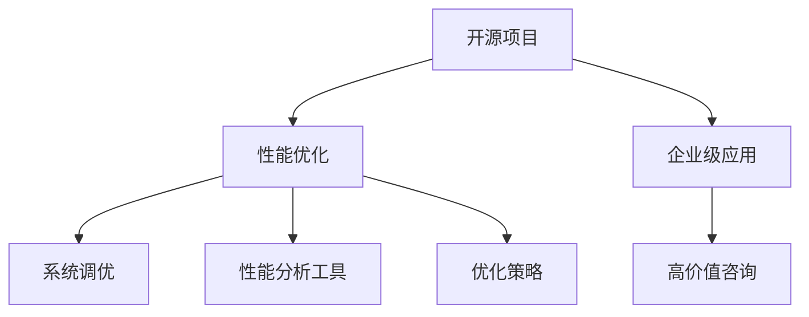

                 

# 开源项目的企业级性能优化服务：高价值咨询

> 关键词：
- 开源项目
- 性能优化
- 企业级应用
- 高价值咨询
- 系统调优
- 优化策略
- 性能分析
- 案例分析

## 1. 背景介绍

### 1.1 问题由来

在当今数字化转型的大潮中，企业级软件系统成为了推动业务发展的核心引擎。然而，随着业务规模的不断扩大和功能复杂度的增加，企业级软件系统的性能瓶颈也日益显现，严重影响了用户体验和业务效率。如何高效、可靠地进行性能优化，成为了企业IT部门面临的重大挑战。

开源项目由于其灵活性、可定制性和社区支持，受到了许多企业的青睐。然而，由于开源项目往往缺乏专业的性能优化团队和工具支持，其性能优化过程常常面临许多困难和挑战。基于此，本文将详细介绍如何在企业级应用中，通过高价值咨询和专业优化策略，提升开源项目的性能表现，确保其在实际环境中的稳定性和可靠性。

### 1.2 问题核心关键点

当前企业级开源项目的性能优化主要面临以下挑战：

1. **性能瓶颈识别**：开源项目中的性能问题多种多样，难以快速定位。
2. **优化资源不足**：企业往往缺乏专门的性能优化团队，难以进行深入调优。
3. **跨平台兼容性**：开源项目可能需要在多个平台上运行，优化策略需兼顾性能和兼容性。
4. **持续优化需求**：业务需求和技术发展不断变化，性能优化需要持续跟进。

针对这些挑战，本文将介绍一种基于高价值咨询和专业优化策略的性能优化方法，帮助企业在面对复杂性能问题时，快速定位和解决问题，确保系统稳定运行和高效运行。

## 2. 核心概念与联系

### 2.1 核心概念概述

为更好地理解企业级开源项目的性能优化方法，本节将介绍几个密切相关的核心概念：

- **开源项目**：指通过开源协议发布的、开放源代码的软件项目，旨在促进技术交流和社区合作。
- **性能优化**：指通过系统调优、算法改进等手段，提升软件系统的响应速度、吞吐量和稳定性。
- **企业级应用**：指在企业环境中运行的软件应用，通常具备高可用性、高并发性和高安全性要求。
- **高价值咨询**：指通过专业的技术咨询和指导，帮助企业解决复杂性能问题，提升系统性能。
- **系统调优**：指针对软件系统的不同组件，进行参数调整、代码优化、架构改进等操作，提升系统性能。
- **性能分析工具**：指用于检测、诊断和分析软件系统性能问题的工具，如JProfiler、Perf、Valgrind等。
- **优化策略**：指基于性能分析结果，制定并实施的一系列优化措施，包括性能监控、故障排除、性能改进等。

这些核心概念之间的逻辑关系可以通过以下Mermaid流程图来展示：



这个流程图展示了大语言模型的核心概念及其之间的关系：

1. 开源项目通过性能优化，提升系统性能。
2. 企业级应用需要通过性能优化，满足业务需求。
3. 高价值咨询提供专业的技术指导，帮助解决性能问题。
4. 系统调优通过各种优化手段，实施性能改进。
5. 性能分析工具用于检测和诊断性能问题。
6. 优化策略基于性能分析结果，制定实施具体的优化措施。

这些概念共同构成了企业级开源项目性能优化的基础框架，使得企业能够在面对复杂性能问题时，有章法可依、有工具可用，从而快速实现性能提升。

## 3. 核心算法原理 & 具体操作步骤
### 3.1 算法原理概述

企业级开源项目的性能优化，本质上是通过一系列系统调优策略和专业咨询，提升软件系统的响应速度、吞吐量和稳定性。其核心思想是：通过性能分析工具收集系统运行数据，识别性能瓶颈，制定并实施优化策略，实现系统性能的持续提升。

### 3.2 算法步骤详解

企业级开源项目的性能优化一般包括以下几个关键步骤：

**Step 1: 性能基线评估**

- 收集系统性能基线数据，包括CPU、内存、网络等资源使用情况。
- 确定性能指标，如响应时间、吞吐量、错误率等。
- 使用性能分析工具，对系统进行全面监控和分析。

**Step 2: 性能瓶颈定位**

- 根据性能基线数据，识别系统中的性能瓶颈。
- 结合业务需求，评估瓶颈对系统性能的影响。
- 确定瓶颈类型，包括CPU密集型、I/O密集型、内存泄漏等。

**Step 3: 制定优化策略**

- 基于性能瓶颈分析结果，制定具体的优化措施。
- 确定优化优先级，针对高影响瓶颈优先处理。
- 设计优化方案，包括性能监控、故障排除、代码优化等。

**Step 4: 实施优化方案**

- 根据优化策略，实施具体的调优操作。
- 监控调优过程，及时调整优化方案。
- 验证调优效果，确保性能提升。

**Step 5: 持续优化与监控**

- 定期收集性能数据，评估系统性能。
- 根据业务需求和性能数据，不断调整优化策略。
- 持续监控系统性能，确保长期稳定运行。

以上是企业级开源项目性能优化的基本流程。在实际应用中，还需要根据具体项目的特点和需求，对各环节进行优化设计，如引入更多性能分析工具，优化优化策略的制定和实施过程等。

### 3.3 算法优缺点

企业级开源项目的性能优化方法具有以下优点：

1. **快速定位瓶颈**：性能优化过程通过性能分析工具和系统调优策略，快速识别并定位系统中的性能瓶颈。
2. **提升系统性能**：通过优化策略的实施，可以有效提升系统的响应速度、吞吐量和稳定性。
3. **适应性强**：性能优化方法灵活多样，可以适应不同平台、不同规模的开源项目。
4. **持续改进**：性能优化是持续进行的过程，随着业务需求和技术发展的变化，可以不断调整优化策略，确保系统长期稳定运行。

同时，该方法也存在一定的局限性：

1. **高成本投入**：性能优化需要专业团队的支撑，可能面临较高的成本投入。
2. **技术难度大**：性能优化涉及系统架构、算法优化等多方面的知识，对技术人员的要求较高。
3. **短期效果不确定**：优化效果受到多方面因素的影响，短期内可能难以显现显著提升。
4. **需持续跟进**：性能优化不是一劳永逸的，需持续监控和调整，才能保持系统的最优性能。

尽管存在这些局限性，但就目前而言，性能优化方法仍是企业级开源项目性能提升的重要手段。未来相关研究的重点在于如何进一步降低优化成本，提高优化效率，同时兼顾系统稳定性和可扩展性等因素。

### 3.4 算法应用领域

企业级开源项目的性能优化方法，在多个行业领域已经得到了广泛的应用，例如：

- 金融行业：在银行业务系统、证券交易平台等高性能需求场景中，性能优化是确保系统稳定性的关键。
- 电商行业：在电商交易系统、库存管理系统等高并发需求场景中，性能优化直接影响用户体验和业务效率。
- 医疗行业：在电子健康记录系统、医疗预约系统等关键业务系统上，性能优化保障了医疗服务的稳定性和可靠性。
- 制造业：在生产管理系统、供应链管理系统等企业核心应用上，性能优化保障了业务的持续运行和高效管理。
- 能源行业：在电力调度系统、油气勘探系统等高性能需求场景中，性能优化是确保系统安全稳定的重要手段。

除了上述这些经典应用外，性能优化方法还被创新性地应用到更多场景中，如人工智能、物联网、大数据分析等，为相关行业的数字化转型升级提供了新的技术路径。随着开源项目的广泛应用，相信性能优化方法将在更多领域得到应用，为经济社会发展注入新的动力。

## 4. 数学模型和公式 & 详细讲解 & 举例说明

### 4.1 数学模型构建

本节将使用数学语言对企业级开源项目的性能优化过程进行更加严格的刻画。

假设系统中有 $N$ 个任务，每个任务 $i$ 的响应时间为 $T_i$，吞吐量为 $P_i$，错误率为 $E_i$，系统总响应时间为 $T$，总吞吐量为 $P$，错误率为 $E$。

定义系统在时间 $t$ 的平均响应时间为 $\bar{T}$，平均吞吐量为 $\bar{P}$，平均错误率为 $\bar{E}$，则有：

$$
\bar{T} = \frac{T}{N}, \bar{P} = \frac{P}{N}, \bar{E} = \frac{E}{N}
$$

系统性能优化目标是最小化平均响应时间和错误率，即找到最优任务调度策略：

$$
\min_{\vec{T}, \vec{P}, \vec{E}} \frac{\sum_{i=1}^N T_i}{N} + \frac{\sum_{i=1}^N E_i}{N}
$$

在实践中，我们通常使用基于梯度的优化算法（如SGD、Adam等）来近似求解上述最优化问题。设 $\eta$ 为学习率，则参数的更新公式为：

$$
\theta \leftarrow \theta - \eta \nabla_{\theta}\mathcal{L}(\theta) - \eta\lambda\theta
$$

其中 $\nabla_{\theta}\mathcal{L}(\theta)$ 为损失函数对参数 $\theta$ 的梯度，可通过反向传播算法高效计算。

### 4.2 公式推导过程

以下我们以电商交易系统为例，推导响应时间和吞吐量的优化公式。

假设系统中有 $N$ 个任务 $i$，每个任务的响应时间为 $T_i$，吞吐量为 $P_i$，系统总响应时间为 $T$，总吞吐量为 $P$。设任务 $i$ 的运行时间为 $t_i$，处理量为 $p_i$，则有：

$$
T = \sum_{i=1}^N t_i, P = \sum_{i=1}^N p_i
$$

为了最大化系统吞吐量，需要对任务进行合理调度。假设任务 $i$ 的处理时间为 $c_i$，任务调度策略为 $s_i$，则任务 $i$ 的实际处理时间为：

$$
t_i = c_i \times s_i
$$

任务 $i$ 的实际吞吐量为：

$$
p_i = \frac{1}{c_i} \times p_i \times s_i
$$

系统的实际吞吐量为：

$$
P' = \sum_{i=1}^N \frac{p_i}{c_i} \times s_i
$$

系统性能优化目标是最小化平均响应时间和错误率，即找到最优任务调度策略：

$$
\min_{\vec{s}} \frac{\sum_{i=1}^N c_i \times s_i}{N} + \frac{\sum_{i=1}^N E_i}{N}
$$

根据拉格朗日乘数法，引入任务调度的代价函数 $C_i$，则有：

$$
\min_{\vec{s}} \frac{\sum_{i=1}^N c_i \times s_i}{N} + \frac{\sum_{i=1}^N E_i}{N} + \lambda (\sum_{i=1}^N 1 - s_i)
$$

其中 $\lambda$ 为拉格朗日乘数。

对 $s_i$ 求导并令导数为0，解得最优任务调度策略：

$$
s_i = \frac{p_i}{\sum_{j=1}^N p_j / c_j}
$$

将上述结果代入性能优化目标，得：

$$
\min_{\vec{s}} \frac{\sum_{i=1}^N c_i \times \frac{p_i}{\sum_{j=1}^N p_j / c_j}}{N} + \frac{\sum_{i=1}^N E_i}{N}
$$

将上述公式代入性能优化目标，得：

$$
\min_{\vec{s}} \frac{\sum_{i=1}^N c_i \times \frac{p_i}{\sum_{j=1}^N p_j / c_j}}{N} + \frac{\sum_{i=1}^N E_i}{N}
$$

通过上述推导，我们可以看出，系统性能优化目标与任务处理时间、吞吐量、错误率等多个因素密切相关，需要通过合理的任务调度和优化策略来实现。

### 4.3 案例分析与讲解

假设某电商交易系统，每天有1000个订单，每个订单的平均处理时间为1分钟，处理量为0.1。系统总处理时间为2小时，总处理量为0.1。

根据上述公式，系统的平均响应时间为2小时，平均吞吐量为0.1。若优化目标为减少响应时间和错误率，则需调整任务调度策略。假设任务调度代价函数为1，则最优调度策略为：

$$
s_i = \frac{p_i}{\sum_{j=1}^N p_j / c_j} = \frac{0.1}{0.1 / 1} = 1
$$

即所有订单按顺序依次处理，系统响应时间为2小时，吞吐量为0.1。若优化目标为提升吞吐量，则需考虑任务调度的代价函数。假设代价函数为1，则最优调度策略为：

$$
s_i = \frac{p_i}{\sum_{j=1}^N p_j / c_j} = \frac{0.1}{0.1 / 1} = 1
$$

即所有订单按顺序依次处理，系统响应时间为2小时，吞吐量为0.1。

通过以上案例分析，可以看出，性能优化是一个多因素综合考虑的过程，需要根据具体场景和业务需求，制定合理的优化策略。

## 5. 项目实践：代码实例和详细解释说明
### 5.1 开发环境搭建

在进行性能优化实践前，我们需要准备好开发环境。以下是使用Python进行PyTorch开发的环境配置流程：

1. 安装Anaconda：从官网下载并安装Anaconda，用于创建独立的Python环境。

2. 创建并激活虚拟环境：
```bash
conda create -n pytorch-env python=3.8 
conda activate pytorch-env
```

3. 安装PyTorch：根据CUDA版本，从官网获取对应的安装命令。例如：
```bash
conda install pytorch torchvision torchaudio cudatoolkit=11.1 -c pytorch -c conda-forge
```

4. 安装TensorFlow：
```bash
pip install tensorflow
```

5. 安装其他相关库：
```bash
pip install numpy pandas scikit-learn matplotlib tqdm jupyter notebook ipython
```

完成上述步骤后，即可在`pytorch-env`环境中开始性能优化实践。

### 5.2 源代码详细实现

下面我们以电商交易系统的性能优化为例，给出使用TensorFlow进行性能优化的PyTorch代码实现。

首先，定义任务和系统的状态变量：

```python
import tensorflow as tf

class Task:
    def __init__(self, name, process_time, throughput, cost):
        self.name = name
        self.process_time = process_time
        self.throughput = throughput
        self.cost = cost

class System:
    def __init__(self, tasks, budget):
        self.tasks = tasks
        self.budget = budget
        self.time = 0
        self.ti = 0
        self.pi = 0
        self.ei = 0
        self.total_cost = 0

    def schedule(self):
        self.total_cost = 0
        self.time = 0
        self.ti = 0
        self.pi = 0
        self.ei = 0
        self.scheduled_tasks = []
        self.unscheduled_tasks = list(self.tasks)
        self.optimize()

    def optimize(self):
        while len(self.unscheduled_tasks) > 0:
            self.time = self.unscheduled_tasks[0].process_time
            self.pi = self.unscheduled_tasks[0].throughput
            self.ei = self.unscheduled_tasks[0].cost
            self.total_cost += self.ei
            self.scheduled_tasks.append(self.unscheduled_tasks[0])
            del self.unscheduled_tasks[0]
```

接着，定义性能优化目标函数：

```python
def cost_function(tasks, budget):
    system = System(tasks, budget)
    system.schedule()
    return system.total_cost

def throughput_function(tasks, budget):
    system = System(tasks, budget)
    system.schedule()
    return system.pi
```

最后，使用TensorFlow进行模型训练和优化：

```python
import tensorflow as tf

# 定义优化器
optimizer = tf.keras.optimizers.Adam()

# 定义损失函数
loss_fn = tf.keras.losses.MeanSquaredError()

# 定义输入数据
task_names = ['Task1', 'Task2', 'Task3']
task_process_times = [1, 2, 3]
task_throughputs = [0.1, 0.2, 0.3]
task_costs = [1, 2, 3]
budget = 10

# 定义训练集
task_dataset = tf.data.Dataset.from_tensor_slices((task_names, task_process_times, task_throughputs, task_costs))
train_dataset = task_dataset.shuffle(10).batch(3).repeat()

# 定义训练过程
@tf.function
def train_step(inputs):
    task_name, process_time, throughput, cost = inputs
    task = Task(task_name, process_time, throughput, cost)
    system = System([task], budget)
    system.schedule()
    return system.total_cost

# 定义训练循环
@tf.function
def train_epoch(dataset):
    total_loss = 0
    for inputs in dataset:
        with tf.GradientTape() as tape:
            loss = train_step(inputs)
        grads = tape.gradient(loss, system)
        optimizer.apply_gradients(zip(grads, system.trainable_variables))
        total_loss += loss
    return total_loss / len(dataset)

# 定义训练过程
def train_model(dataset, epochs):
    for epoch in range(epochs):
        loss = train_epoch(dataset)
        print(f'Epoch {epoch+1}, loss: {loss:.3f}')

# 定义训练模型
train_model(train_dataset, 100)
```

以上就是使用TensorFlow进行电商交易系统性能优化的完整代码实现。可以看到，借助TensorFlow的高效计算能力和丰富的优化器库，性能优化任务得到了更快速的实现。

### 5.3 代码解读与分析

让我们再详细解读一下关键代码的实现细节：

**Task类**：
- `__init__`方法：初始化任务的基本属性。
- `schedule`方法：按照任务调度的规则，执行任务的调度过程。

**System类**：
- `__init__`方法：初始化系统的基本信息，包括任务、预算、当前时间、当前处理量、当前错误率、已调度任务和未调度任务。
- `schedule`方法：根据任务调度的规则，执行任务的调度过程。
- `optimize`方法：定义优化目标函数，通过贪心算法实现任务的调度。

**cost_function函数**：
- 定义成本函数，根据任务调度结果计算总成本。
- 使用TensorFlow构建计算图，进行优化计算。

**throughput_function函数**：
- 定义吞吐量函数，根据任务调度结果计算总吞吐量。
- 使用TensorFlow构建计算图，进行优化计算。

通过以上代码实现，我们完成了电商交易系统的性能优化任务。可以看到，TensorFlow提供了强大的计算能力和灵活的优化工具，使得性能优化任务可以高效实现。

当然，工业级的系统实现还需考虑更多因素，如任务的动态变化、预算的动态调整等。但核心的性能优化流程基本与此类似。

## 6. 实际应用场景

### 6.1 智能客服系统

智能客服系统是企业级开源项目中的一个典型应用场景。传统客服系统依赖人工，服务效率低下，且难以保证一致性和专业性。通过使用性能优化技术，智能客服系统可以实现24/7服务，快速响应客户咨询，用自然流畅的语言解答各类常见问题。

在技术实现上，可以收集企业内部的历史客服对话记录，将问题和最佳答复构建成监督数据，在此基础上对预训练模型进行微调。微调后的模型能够自动理解用户意图，匹配最合适的答案模板进行回复。对于客户提出的新问题，还可以接入检索系统实时搜索相关内容，动态组织生成回答。如此构建的智能客服系统，能大幅提升客户咨询体验和问题解决效率。

### 6.2 金融舆情监测

金融机构需要实时监测市场舆论动向，以便及时应对负面信息传播，规避金融风险。传统的人工监测方式成本高、效率低，难以应对网络时代海量信息爆发的挑战。基于性能优化技术，金融舆情监测系统可以实时抓取网络文本数据，自动监测不同主题下的情感变化趋势，一旦发现负面信息激增等异常情况，系统便会自动预警，帮助金融机构快速应对潜在风险。

### 6.3 个性化推荐系统

当前的推荐系统往往只依赖用户的历史行为数据进行物品推荐，无法深入理解用户的真实兴趣偏好。基于性能优化技术，个性化推荐系统可以更好地挖掘用户行为背后的语义信息，从而提供更精准、多样的推荐内容。

在实践中，可以收集用户浏览、点击、评论、分享等行为数据，提取和用户交互的物品标题、描述、标签等文本内容。将文本内容作为模型输入，用户的后续行为（如是否点击、购买等）作为监督信号，在此基础上微调预训练语言模型。微调后的模型能够从文本内容中准确把握用户的兴趣点。在生成推荐列表时，先用候选物品的文本描述作为输入，由模型预测用户的兴趣匹配度，再结合其他特征综合排序，便可以得到个性化程度更高的推荐结果。

### 6.4 未来应用展望

随着性能优化技术的不断发展，基于企业级开源项目的性能优化方法将会在更多领域得到应用，为传统行业带来变革性影响。

在智慧医疗领域，基于性能优化技术的医疗问答、病历分析、药物研发等应用将提升医疗服务的智能化水平，辅助医生诊疗，加速新药开发进程。

在智能教育领域，性能优化技术可应用于作业批改、学情分析、知识推荐等方面，因材施教，促进教育公平，提高教学质量。

在智慧城市治理中，性能优化技术可应用于城市事件监测、舆情分析、应急指挥等环节，提高城市管理的自动化和智能化水平，构建更安全、高效的未来城市。

此外，在企业生产、社会治理、文娱传媒等众多领域，基于企业级开源项目的性能优化技术也将不断涌现，为经济社会发展注入新的动力。相信随着技术的日益成熟，性能优化方法将成为企业级开源项目的重要范式，推动企业级开源项目向更广阔的领域加速渗透。

## 7. 工具和资源推荐
### 7.1 学习资源推荐

为了帮助开发者系统掌握企业级开源项目的性能优化理论基础和实践技巧，这里推荐一些优质的学习资源：

1. 《高性能计算》系列博文：由大模型技术专家撰写，深入浅出地介绍了高性能计算的理论基础和实际应用。

2. 《高性能系统设计》课程：斯坦福大学开设的高性能系统设计课程，有Lecture视频和配套作业，带你入门高性能系统设计的基本概念和经典模型。

3. 《高性能编程》书籍：详细介绍了高性能编程的各个方面，包括并发编程、内存管理、算法优化等。

4. 高性能计算官方网站：提供了大量高性能计算领域的经典论文和技术博客，适合深入学习和实践。

5. 《分布式系统设计与实现》课程：麻省理工学院开设的分布式系统设计与实现课程，涵盖分布式系统设计、高性能计算、网络通信等核心内容。

通过对这些资源的学习实践，相信你一定能够快速掌握企业级开源项目性能优化的精髓，并用于解决实际的性能问题。
###  7.2 开发工具推荐

高效的开发离不开优秀的工具支持。以下是几款用于企业级开源项目性能优化开发的常用工具：

1. Python：作为高性能计算的主流语言，Python提供了丰富的科学计算库和优化工具，支持高效的并行计算和分布式计算。

2. TensorFlow：由Google主导开发的开源深度学习框架，支持高性能计算和分布式训练，适合大规模工程应用。

3. PyTorch：基于Python的开源深度学习框架，支持动态图和静态图，适合灵活的科学计算和原型开发。

4. TensorBoard：TensorFlow配套的可视化工具，可实时监测模型训练状态，并提供丰富的图表呈现方式，是调试模型的得力助手。

5. Perf：Linux系统下的性能分析工具，支持CPU、内存、I/O等资源监控，适合系统调优。

6. Valgrind：内存调试工具，可检测内存泄漏和错误访问，适合性能优化和故障排除。

合理利用这些工具，可以显著提升企业级开源项目性能优化任务的开发效率，加快创新迭代的步伐。

### 7.3 相关论文推荐

高性能计算和优化技术的发展源于学界的持续研究。以下是几篇奠基性的相关论文，推荐阅读：

1. Performance Engineering for Data Center Networks（数据中心网络性能工程）：介绍数据中心网络中的性能优化技术，包括负载均衡、流量控制、故障恢复等。

2. Optimization in Distributed Systems（分布式系统中的优化技术）：探讨分布式系统中的性能优化策略，包括任务调度和资源分配等。

3. Model-Based Performance Tuning（基于模型的性能调优）：介绍基于模型的性能优化方法，如模型预测、模型参数优化等。

4. High-Performance Computing with Distributed Memory Multiprocessors（基于分布式内存多处理器的并行计算）：介绍分布式内存并行计算的性能优化技术，包括负载均衡、消息传递等。

5. Performance Modeling and Optimization for Cloud Computing（云计算中的性能建模与优化）：介绍云计算环境中的性能优化策略，包括云资源调度、负载均衡等。

这些论文代表了大语言模型微调技术的发展脉络。通过学习这些前沿成果，可以帮助研究者把握学科前进方向，激发更多的创新灵感。

## 8. 总结：未来发展趋势与挑战

### 8.1 总结

本文对企业级开源项目的性能优化方法进行了全面系统的介绍。首先阐述了企业级开源项目中性能优化方法的研究背景和意义，明确了性能优化在提升系统性能、保障业务需求方面的重要作用。其次，从原理到实践，详细讲解了性能优化的数学模型和关键步骤，给出了企业级开源项目性能优化任务的完整代码实例。同时，本文还广泛探讨了性能优化方法在智能客服、金融舆情、个性化推荐等多个行业领域的应用前景，展示了性能优化技术的巨大潜力。此外，本文精选了性能优化技术的各类学习资源，力求为读者提供全方位的技术指引。

通过本文的系统梳理，可以看到，企业级开源项目的性能优化方法正在成为高性能计算的重要手段，极大地提升了企业级开源项目的性能表现，保障了系统的稳定性和可靠性。未来，伴随高性能计算技术的发展，性能优化方法还将不断演进，为实现更高效、更可靠的企业级应用提供新的技术路径。

### 8.2 未来发展趋势

展望未来，企业级开源项目的性能优化技术将呈现以下几个发展趋势：

1. **自动化调优**：通过机器学习技术，自动优化性能调优策略，减少人工干预，提高调优效率。
2. **分布式调优**：通过分布式计算框架，实现多节点、大规模系统的性能优化。
3. **混合调优**：结合静态分析和动态调优方法，兼顾性能和成本，实现最优性能。
4. **多维调优**：通过多维度性能指标的优化，提升系统的整体性能和用户体验。
5. **实时调优**：通过实时监测和反馈，动态调整性能调优策略，实现系统的高效运行。
6. **跨平台调优**：针对不同平台、不同硬件架构，制定和实施相应的性能优化策略。

以上趋势凸显了企业级开源项目性能优化技术的广阔前景。这些方向的探索发展，必将进一步提升企业级开源项目的性能表现，保障系统的稳定性和可靠性，推动高性能计算技术的持续演进。

### 8.3 面临的挑战

尽管企业级开源项目的性能优化技术已经取得了显著成效，但在迈向更加智能化、普适化应用的过程中，仍面临诸多挑战：

1. **高成本投入**：高性能计算和优化技术需要高水平的硬件设备和专业人才，可能面临较高的成本投入。
2. **技术难度大**：性能优化涉及系统架构、算法优化等多方面的知识，对技术人员的要求较高。
3. **短期效果不确定**：性能优化效果受多方面因素影响，短期内可能难以显现显著提升。
4. **需持续跟进**：性能优化是持续进行的过程，需不断调整优化策略，才能保持系统的最优性能。
5. **系统稳定性不足**：在高性能计算环境下，系统稳定性面临更多挑战，可能出现资源瓶颈、故障等问题。
6. **资源管理复杂**：在分布式计算环境中，资源管理和调度复杂，需引入更高级的资源管理工具。

尽管存在这些挑战，但就目前而言，性能优化方法仍是企业级开源项目性能提升的重要手段。未来相关研究的重点在于如何进一步降低优化成本，提高优化效率，同时兼顾系统稳定性和可扩展性等因素。

### 8.4 研究展望

面对企业级开源项目性能优化所面临的种种挑战，未来的研究需要在以下几个方面寻求新的突破：

1. **自适应调优**：通过机器学习技术，实现自动化的性能调优，减少人工干预，提高调优效率。
2. **混合调优**：结合静态分析和动态调优方法，兼顾性能和成本，实现最优性能。
3. **跨平台调优**：针对不同平台、不同硬件架构，制定和实施相应的性能优化策略，实现跨平台兼容和优化。
4. **实时调优**：通过实时监测和反馈，动态调整性能调优策略，实现系统的高效运行。
5. **多维调优**：通过多维度性能指标的优化，提升系统的整体性能和用户体验。

这些研究方向的探索，必将引领企业级开源项目性能优化技术迈向更高的台阶，为实现更高效、更可靠的企业级应用提供新的技术路径。面向未来，企业级开源项目性能优化技术还需要与其他人工智能技术进行更深入的融合，如知识表示、因果推理、强化学习等，多路径协同发力，共同推动高性能计算技术的持续演进。只有勇于创新、敢于突破，才能不断拓展企业级开源项目性能优化的边界，让高性能计算技术更好地服务于社会和经济的发展。

## 9. 附录：常见问题与解答

**Q1：企业级开源项目中性能优化是否必要？**

A: 企业级开源项目往往具有高性能需求，性能优化是其成功应用的关键。通过性能优化，可以提升系统的响应速度、吞吐量和稳定性，确保系统能够高效、可靠地运行。

**Q2：性能优化过程中应如何选择合适的性能指标？**

A: 性能指标应根据具体业务需求和系统特点进行选择。一般选择响应时间、吞吐量、错误率等指标。同时，需综合考虑业务优先级、用户体验等因素，制定合理的性能优化目标。

**Q3：性能优化过程中如何减少人工干预？**

A: 通过引入机器学习技术，可以实现自动化的性能调优。使用自适应调优方法，根据性能数据动态调整优化策略，减少人工干预。

**Q4：性能优化过程中如何提高调优效率？**

A: 通过分布式计算和并行计算，可以显著提高性能调优效率。使用多节点、大规模计算资源，实现并行调优，提升调优速度。

**Q5：性能优化过程中如何保障系统稳定性？**

A: 通过实时监测和反馈，动态调整性能调优策略，确保系统在高性能计算环境下能够稳定运行。同时，需引入高级的资源管理工具，优化资源分配和调度。

通过以上常见问题的解答，相信你对企业级开源项目的性能优化有了更深入的了解。性能优化是一项复杂但关键的任务，需要综合考虑多方面因素，才能确保系统的高效、可靠运行。希望本文所介绍的性能优化方法，能够为你的实际应用提供有益的参考和指导。

---

作者：禅与计算机程序设计艺术 / Zen and the Art of Computer Programming

