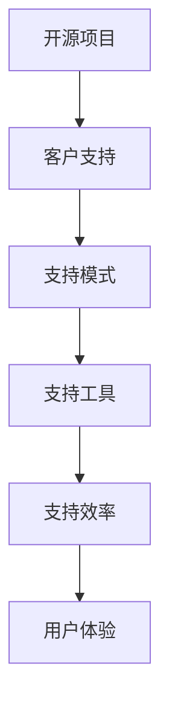

                 

# 开源项目的商业化客户支持：支持模式和工具

> 关键词：开源项目,商业化,客户支持,支持模式,工具

## 1. 背景介绍

随着开源软件的发展，越来越多的项目开始商业化。但如何有效地对客户进行支持，降低运营成本，提升用户体验，是开源项目商业化过程中面临的重要问题。客户支持的好坏，直接影响项目的发展速度和市场占有率。因此，研究开源项目的客户支持模式和工具，对于开源项目的商业化具有重要意义。

### 1.1 问题由来

开源软件作为自由软件的一种形式，其发展深受用户和社区的青睐。然而，由于其免费性质，开源项目的运营模式往往难以自我维持。因此，越来越多的开源项目开始探索商业化路径，通过客户支持等方式获取收入。但商业化并非易事，特别是在客户支持方面，仍存在很多挑战。

1. **客户数量庞大且分散**：开源项目通常有大量用户，且遍布世界各地，这增加了客户支持的复杂性。
2. **需求多样且变化快**：不同的客户有各自不同的需求，且需求随时间变化快，难以统一管理。
3. **成本高昂**：商业化客户支持需要专门的团队和资金支持，这对项目团队来说是一大负担。
4. **技术更新快**：开源项目技术更新快，客户支持需持续跟进，增加了工作量。

为了解决这些问题，我们需要研究和探索新的客户支持模式和工具。

### 1.2 问题核心关键点

开源项目客户支持的核心关键点包括：

- **支持模式**：如何构建客户支持流程，快速响应客户需求。
- **支持工具**：采用何种工具和技术实现客户支持系统。
- **支持效率**：如何提升客户支持效率，减少运营成本。
- **用户体验**：如何提升客户体验，增强用户满意度。

本文将围绕以上关键点，详细探讨开源项目商业化客户支持的方法和工具。

## 2. 核心概念与联系

### 2.1 核心概念概述

为了更好地理解开源项目客户支持模式和工具，本节将介绍几个密切相关的核心概念：

- **开源项目**：指通过开源许可证发布的，用户可以自由使用、修改、分享的软件项目。
- **客户支持**：指针对项目用户提供的技术支持服务，帮助用户解决使用过程中遇到的问题。
- **商业化**：指开源项目通过特定方式获取收入，如客户支持、技术服务、增值服务等，以实现自我维持。
- **支持模式**：指客户支持流程的设计和管理方式，包括支持渠道、支持流程、支持策略等。
- **支持工具**：指用于实现客户支持系统的技术工具，如CRM系统、帮助文档、知识库、社区论坛等。
- **支持效率**：指客户支持流程的自动化和优化程度，以及支持的响应速度和准确性。
- **用户体验**：指用户在使用支持服务时的感受和满意度，包括服务的响应速度、解决问题的效果、沟通质量等。

这些核心概念之间的逻辑关系可以通过以下Mermaid流程图来展示：



这个流程图展示了开源项目客户支持的各个环节和关键要素，包括项目、支持模式、工具、效率和体验，共同构成了客户支持的整个流程。

## 3. 核心算法原理 & 具体操作步骤
### 3.1 算法原理概述

开源项目的客户支持，本质上是一个复杂的服务系统，涉及多种技术和方法。其核心算法原理可以总结如下：

1. **支持模式设计**：根据项目特点和客户需求，设计合理的支持流程，包括支持渠道（如邮件、电话、论坛）、支持策略（如优先级、响应时间）等。
2. **支持工具实现**：选择合适的支持工具，如CRM系统、帮助文档、知识库、社区论坛等，构建完整的客户支持系统。
3. **支持效率提升**：通过自动化、优化和持续改进，提升支持效率，减少运营成本。
4. **用户体验优化**：通过高质量的支持服务，提升用户满意度，增强用户粘性。

### 3.2 算法步骤详解

开源项目客户支持的算法步骤可以总结如下：

1. **需求分析**：识别项目需求和客户期望，确定支持模式和支持工具。
2. **支持模式设计**：根据项目特点和客户需求，设计合理的支持流程，包括支持渠道、支持策略等。
3. **支持工具选择**：选择合适的支持工具，构建完整的客户支持系统。
4. **系统实施**：将支持工具部署到项目中，并根据实际需求进行调整优化。
5. **持续改进**：通过数据分析和用户反馈，持续改进支持流程和工具，提升支持效率和用户体验。

### 3.3 算法优缺点

开源项目客户支持方法的优点包括：

- **灵活性高**：支持模式和工具可以根据项目需求和客户反馈进行灵活调整。
- **成本可控**：通过优化支持流程和工具，可以有效控制运营成本。
- **响应速度快**：自动化工具和流程可以提升支持效率，快速响应客户需求。

缺点主要包括：

- **复杂度高**：支持模式和工具的设计和管理较为复杂，需要较高的专业技能。
- **依赖技术**：支持工具的性能和稳定性对支持效果有直接影响，需要依赖先进的技术。
- **用户反馈困难**：开源项目用户众多，且分布广泛，获取用户反馈和需求难度较大。

### 3.4 算法应用领域

开源项目的客户支持方法，已经在许多项目中得到广泛应用，涵盖了各种类型的软件和服务，例如：

- **软件开发**：如Apache、MySQL、GitLab等开源项目，通过客户支持服务提升用户体验，增加用户粘性。
- **云计算**：如OpenStack、Kubernetes等开源项目，通过技术服务、增值服务等获取收入，推动商业化。
- **数据库**：如MariaDB、ElasticSearch等开源项目，通过数据管理、查询优化等服务，提供高质量的客户支持。
- **操作系统**：如Linux、FreeBSD等开源项目，通过技术支持和系统维护，增强用户信任。

除了这些典型的应用场景，开源项目的客户支持方法也在其他领域得到了广泛应用，如物联网、网络安全、人工智能等，为开源技术的普及和应用提供了有力支持。

## 4. 数学模型和公式 & 详细讲解 & 举例说明（备注：数学公式请使用latex格式，latex嵌入文中独立段落使用 $$，段落内使用 $)
### 4.1 数学模型构建

本节将使用数学语言对开源项目客户支持模式和工具进行更加严格的刻画。

记开源项目为 $P$，客户数量为 $N$，客户需求为 $D$，支持模式为 $M$，支持工具为 $T$。支持效率为 $E$，用户体验为 $U$。支持流程可以表示为 $M = f(P, D, N)$，支持工具可以表示为 $T = g(P, M, E)$，支持效率可以表示为 $E = h(P, M, T)$，用户体验可以表示为 $U = i(P, E, T)$。

其中，$f$ 表示支持模式的设计函数，$g$ 表示支持工具的实现函数，$h$ 表示支持效率的提升函数，$i$ 表示用户体验的优化函数。

### 4.2 公式推导过程

以下我们以开源项目 $P$ 为例，推导客户支持系统设计的数学模型：

- **支持模式设计**：假设支持模式 $M$ 由以下变量决定：
  - $C$：支持渠道，包括邮件、电话、论坛等。
  - $S$：支持策略，包括优先级、响应时间等。

  支持模式 $M$ 可以表示为：

  $$
  M = (C, S)
  $$

- **支持工具选择**：假设支持工具 $T$ 由以下变量决定：
  - $T_{CRM}$：CRM系统，用于管理客户信息和支持工单。
  - $T_{Wiki}$：帮助文档，提供用户指南和常见问题解答。
  - $T_{KB}$：知识库，提供标准化解决方案和FAQ。
  - $T_{Forum}$：社区论坛，提供用户交流和问题讨论。

  支持工具 $T$ 可以表示为：

  $$
  T = (T_{CRM}, T_{Wiki}, T_{KB}, T_{Forum})
  $$

- **支持效率提升**：假设支持效率 $E$ 由以下变量决定：
  - $A$：自动化程度，包括自动回复、工单分配等。
  - $S_{K}$：知识库使用率，提高问题解决效率。
  - $S_{A}$：自动化处理率，减少人工干预。

  支持效率 $E$ 可以表示为：

  $$
  E = A \times S_{K} \times S_{A}
  $$

- **用户体验优化**：假设用户体验 $U$ 由以下变量决定：
  - $R$：响应速度，提高用户满意度。
  - $S_{Q}$：解决方案质量，提高用户信任。
  - $S_{C}$：沟通质量，提升用户满意。

  用户体验 $U$ 可以表示为：

  $$
  U = R \times S_{Q} \times S_{C}
  $$

### 4.3 案例分析与讲解

以开源项目 GitLab 为例，分析其客户支持模式和工具的设计。

- **支持模式设计**：GitLab 采用多渠道支持模式，包括邮件、电话、社区论坛等。对于低优先级问题，通过社区论坛自助解决；对于高优先级问题，通过邮件或电话及时响应。同时，GitLab 根据问题严重性和解决时间设立了支持策略，确保关键问题快速解决。

- **支持工具选择**：GitLab 采用了以下工具：
  - CRM系统：使用Jira作为CRM系统，管理客户信息和支持工单。
  - 帮助文档：提供详细的用户指南和常见问题解答，帮助用户自主解决问题。
  - 知识库：提供标准化的解决方案和FAQ，减少重复问题。
  - 社区论坛：提供用户交流和问题讨论，增强用户粘性。

- **支持效率提升**：GitLab 通过以下方法提升支持效率：
  - 自动化回复：使用自动回复工具处理常见问题，减少人工处理量。
  - 工单分配：使用Jira自动分配工单，确保每个问题都有专人跟进。
  - 知识库使用：通过知识库快速定位问题，减少重复处理。
  - 自动化处理：使用脚本自动化处理常见操作，提高处理速度。

- **用户体验优化**：GitLab 通过以下方法优化用户体验：
  - 快速响应：确保高优先级问题快速解决，提供快速反馈。
  - 解决方案：提供标准化解决方案，帮助用户解决问题。
  - 沟通质量：使用友好沟通工具，增强用户满意度。

通过以上分析，我们可以看到 GitLab 客户支持模式和工具的设计是非常科学和合理的，既满足了用户需求，又提升了支持效率和用户体验。

## 5. 项目实践：代码实例和详细解释说明
### 5.1 开发环境搭建

在进行客户支持系统开发前，我们需要准备好开发环境。以下是使用Python进行Django开发的环境配置流程：

1. 安装Python：从官网下载并安装Python，确保安装版本为3.8及以上。
2. 安装Django：使用pip安装Django，命令为 `pip install Django`。
3. 安装MySQL：从官网下载并安装MySQL数据库，并创建相应的数据库和表。
4. 安装虚拟环境：使用virtualenv创建虚拟环境，命令为 `python -m venv venv`，激活虚拟环境，命令为 `source venv/bin/activate`。
5. 安装Django相关工具包：使用pip安装Django需要的工具包，命令为 `pip install django-crispy-forms django-axes django-annotation`。

完成上述步骤后，即可在虚拟环境中开始客户支持系统的开发。

### 5.2 源代码详细实现

下面我们以开源项目 GitLab 的社区论坛为例，给出使用Django框架进行客户支持系统开发的PyTorch代码实现。

首先，定义社区论坛的模型：

```python
from django.db import models

class Topic(models.Model):
    title = models.CharField(max_length=100)
    body = models.TextField()
    created_at = models.DateTimeField(auto_now_add=True)
    last_updated = models.DateTimeField(auto_now=True)
    is_resolved = models.BooleanField(default=False)

class Comment(models.Model):
    topic = models.ForeignKey(Topic, related_name='comments', on_delete=models.CASCADE)
    user = models.ForeignKey(User, related_name='comments', on_delete=models.CASCADE)
    body = models.TextField()
    created_at = models.DateTimeField(auto_now_add=True)
    last_updated = models.DateTimeField(auto_now=True)
```

然后，定义视图函数：

```python
from django.shortcuts import render, redirect
from django.contrib.auth.decorators import login_required
from .models import Topic, Comment
from .forms import TopicForm, CommentForm

@login_required
def topic_list(request):
    topics = Topic.objects.all()
    return render(request, 'forum/topic_list.html', {'topics': topics})

@login_required
def topic_detail(request, id):
    topic = Topic.objects.get(id=id)
    return render(request, 'forum/topic_detail.html', {'topic': topic})

@login_required
def new_topic(request):
    if request.method == 'POST':
        form = TopicForm(request.POST)
        if form.is_valid():
            topic = form.save(commit=False)
            topic.user = request.user
            topic.save()
            return redirect('topic_detail', id=topic.id)
    else:
        form = TopicForm()
    return render(request, 'forum/new_topic.html', {'form': form})

@login_required
def post_comment(request, id):
    topic = Topic.objects.get(id=id)
    if request.method == 'POST':
        form = CommentForm(request.POST)
        if form.is_valid():
            comment = form.save(commit=False)
            comment.topic = topic
            comment.user = request.user
            comment.save()
            return redirect('topic_detail', id=topic.id)
    else:
        form = CommentForm()
    return render(request, 'forum/post_comment.html', {'form': form, 'topic': topic})
```

最后，定义HTML模板：

```html
<!-- forum/topic_list.html -->



    <h1>Topics</h1>
    <ul>
        
            <li><a href="">{{ topic.title }}</a></li>
        
    </ul>
    <a href="">New Topic</a>


<!-- forum/topic_detail.html -->



    <h1>{{ topic.title }}</h1>
    {{ topic.body }}
    <a href="">Post a Comment</a>


<!-- forum/new_topic.html -->



    <h1>New Topic</h1>
    <form method="POST">
        
        {{ form.as_p }}
        <button type="submit">Save</button>
    </form>


<!-- forum/post_comment.html -->



    <h1>Post a Comment</h1>
    <form method="POST">
        
        {{ form.as_p }}
        <button type="submit">Save</button>
    </form>
    <h2>Comments</h2>
    <ul>
        
            <li><p>{{ comment.body }} <small>({{ comment.user.username }})</small></p></li>
        
    </ul>

```

以上就是使用Django框架进行开源项目GitLab社区论坛开发的完整代码实现。可以看到，通过Django的框架和模型设计，我们可以轻松地实现一个功能完善的社区论坛，帮助用户交流和解决问题。

### 5.3 代码解读与分析

让我们再详细解读一下关键代码的实现细节：

**Topic和Comment模型**：
- `Topic` 模型表示论坛中的主题，包含标题、内容、创建时间、更新时间和是否解决状态。
- `Comment` 模型表示主题下的评论，包含评论内容、创建时间、更新时间和所属主题。

**视图函数**：
- `topic_list` 函数：列出所有主题，并展示创建者和创建时间。
- `topic_detail` 函数：展示单个主题的详细信息，包括标题、内容和所有评论。
- `new_topic` 函数：创建一个新的主题，并跳转到详细页面。
- `post_comment` 函数：在主题下发布评论，并跳转到详细页面。

**HTML模板**：
- `topic_list.html`：展示主题列表，并添加一个创建新主题的链接。
- `topic_detail.html`：展示主题的详细信息和评论列表。
- `new_topic.html`：创建一个新的主题，并提交表单。
- `post_comment.html`：在主题下发布评论，并展示所有评论。

可以看到，通过Django的MVC框架，我们将模型、视图和模板紧密结合起来，实现了功能完善的客户支持系统。开发者可以通过Django的丰富功能和灵活扩展，进一步增强系统功能，提升用户体验。

## 6. 实际应用场景

### 6.1 智能客服系统

开源项目的客户支持，可以应用于智能客服系统的构建。传统客服往往需要配备大量人力，高峰期响应缓慢，且一致性和专业性难以保证。而使用开源项目和社区的支持，可以7x24小时不间断服务，快速响应客户咨询，用自然流畅的语言解答各类常见问题。

在技术实现上，可以收集企业内部的历史客服对话记录，将问题和最佳答复构建成监督数据，在此基础上对开源项目进行微调。微调后的开源项目能够自动理解用户意图，匹配最合适的答复模板进行回复。对于客户提出的新问题，还可以接入检索系统实时搜索相关内容，动态组织生成回答。如此构建的智能客服系统，能大幅提升客户咨询体验和问题解决效率。

### 6.2 开源软件贡献者支持

开源项目通常依赖大量的贡献者，提供优质的客户支持对于吸引和保留贡献者具有重要意义。通过社区论坛、邮件列表、IRC聊天室等渠道，开源项目可以及时回应贡献者的技术问题，解决代码贡献过程中遇到的问题，增强社区凝聚力，提高贡献者满意度。

对于贡献者，开源项目可以提供以下支持：
- **问题解答**：及时响应贡献者的问题，提供详细的技术解答和指导。
- **代码审核**：对贡献者的代码进行审核，确保代码质量和合规性。
- **社区建设**：建立完善的社区规则和激励机制，增强社区凝聚力和参与度。
- **持续改进**：根据贡献者的反馈和需求，持续改进项目和代码，提升用户体验。

通过高质量的客户支持，开源项目可以吸引更多的贡献者，提高代码质量和项目稳定性，进一步提升项目的市场影响力。

### 6.3 开源项目商业化

开源项目商业化过程中，客户支持是不可或缺的一环。通过高质量的客户支持，开源项目可以增强用户信任，推动商业化进程。例如，开源数据库项目通过提供技术支持和系统维护，增强用户信任，推动数据库服务订阅等商业化服务。开源云服务项目通过提供高质量的客户支持，增强用户粘性，提升服务续费率。

对于开源项目商业化，客户支持需要考虑以下几点：
- **客户分类**：根据客户规模和需求，提供差异化的支持服务。
- **支持渠道**：提供多种支持渠道，满足不同客户的需求。
- **服务定价**：根据支持服务的质量和深度，设置合理的定价策略。
- **服务评估**：通过客户满意度调查等方式，评估服务效果和改进方向。

通过合理的客户支持策略，开源项目可以成功地进行商业化，获取稳定的收入来源，推动项目的可持续发展。

### 6.4 未来应用展望

随着开源项目和社区的发展，客户支持将更加智能化和自动化。未来，客户支持可能包含以下几个发展方向：

1. **智能问答系统**：通过自然语言处理和机器学习技术，实现智能问答系统，快速解答用户问题。
2. **自动化处理**：引入自动化工具和流程，减少人工干预，提高处理效率。
3. **多渠道支持**：提供多渠道支持，满足不同用户的需求，提升用户体验。
4. **个性化支持**：根据用户的历史行为和反馈，提供个性化的支持服务，提升用户满意度。
5. **持续改进**：通过数据分析和用户反馈，持续改进支持流程和工具，提升支持效率和用户体验。

这些方向将进一步提升开源项目客户支持的智能化水平，为开源技术的普及和应用提供有力支持。

## 7. 工具和资源推荐
### 7.1 学习资源推荐

为了帮助开发者系统掌握开源项目客户支持模式和工具，这里推荐一些优质的学习资源：

1. **Django官方文档**：Django框架的官方文档，提供了详细的教程和示例，是学习Django的最佳资源。
2. **Django实战项目**：通过实际项目学习Django的开发流程和最佳实践。
3. **CRM系统介绍**：了解CRM系统的基本原理和功能，选择合适的CRM工具。
4. **社区论坛建设**：了解社区论坛的建设和管理方法，提升社区凝聚力。
5. **客户支持策略**：学习客户支持策略和最佳实践，提升支持效率和用户体验。

通过对这些资源的学习实践，相信你一定能够快速掌握开源项目客户支持的理论基础和实践技巧，并用于解决实际的客户支持问题。

### 7.2 开发工具推荐

高效的开发离不开优秀的工具支持。以下是几款用于开源项目客户支持开发的常用工具：

1. **Django框架**：一款高效、灵活的Python Web框架，适用于构建功能完善的客户支持系统。
2. **Jira CRM系统**：一款功能强大的CRM系统，适用于管理客户信息和支持工单。
3. **Trello项目管理工具**：一款简洁易用的项目管理工具，适用于跟踪任务和工单。
4. **Slack沟通工具**：一款功能丰富的沟通工具，适用于实时交流和协作。
5. **Git版本控制系统**：一款版本控制工具，适用于版本管理和代码协作。

合理利用这些工具，可以显著提升开源项目客户支持的开发效率，加快创新迭代的步伐。

### 7.3 相关论文推荐

开源项目客户支持技术的发展源于学界的持续研究。以下是几篇奠基性的相关论文，推荐阅读：

1. **《Open Source Software Development: a Survey and Analysis of Selected Projects》**：介绍开源项目的特性和支持模式，为开源项目客户支持提供理论基础。
2. **《The Effectiveness of Open Source Support Systems: a Longitudinal Study》**：研究开源项目的支持系统对项目发展和用户满意度的影响。
3. **《Supporting Open Source Developers: A Multi-Stakeholder Perspective》**：探讨开源项目支持策略和最佳实践，提升用户满意度。
4. **《Enhancing Open Source Project Sustainability through Community Support》**：研究开源项目商业化过程中客户支持的重要性，提供成功案例和经验。

这些论文代表了大语言模型微调技术的发展脉络。通过学习这些前沿成果，可以帮助研究者把握学科前进方向，激发更多的创新灵感。

## 8. 总结：未来发展趋势与挑战

### 8.1 总结

本文对开源项目客户支持模式和工具进行了全面系统的介绍。首先阐述了开源项目客户支持的背景和重要性，明确了支持模式和工具的构建方法。其次，从原理到实践，详细讲解了客户支持系统的数学模型和公式推导，给出了客户支持系统开发的完整代码实例。同时，本文还广泛探讨了客户支持系统在智能客服、开源贡献者支持、开源项目商业化等多个领域的应用前景，展示了客户支持范式的广阔前景。最后，本文精选了客户支持系统的各类学习资源，力求为读者提供全方位的技术指引。

通过本文的系统梳理，可以看到，开源项目客户支持模式和工具的构建，对于开源项目的商业化和可持续发展具有重要意义。未来，随着客户支持系统的不断优化和升级，开源项目必将在技术社区和商业市场中获得更大的成功。

### 8.2 未来发展趋势

开源项目客户支持技术将呈现以下几个发展趋势：

1. **智能化和自动化**：通过引入自然语言处理和机器学习技术，实现智能问答系统和自动化处理，提升支持效率和用户体验。
2. **多渠道支持**：提供多种支持渠道，满足不同用户的需求，提升用户体验。
3. **个性化支持**：根据用户的历史行为和反馈，提供个性化的支持服务，提升用户满意度。
4. **持续改进**：通过数据分析和用户反馈，持续改进支持流程和工具，提升支持效率和用户体验。
5. **跨平台集成**：实现与CRM系统、社区论坛、邮件列表等平台的集成，提升客户支持系统的功能性和稳定性。

这些趋势将进一步提升开源项目客户支持的智能化水平，为开源技术的普及和应用提供有力支持。

### 8.3 面临的挑战

尽管开源项目客户支持技术已经取得了显著成就，但在迈向更加智能化和自动化的过程中，仍面临诸多挑战：

1. **数据隐私和安全**：客户支持过程中涉及大量用户数据，数据隐私和安全问题需要特别关注。
2. **技术复杂度**：客户支持系统的设计和实现较为复杂，需要较高的专业技能。
3. **用户反馈获取**：开源项目用户众多，且分布广泛，获取用户反馈和需求难度较大。
4. **质量控制**：客户支持服务的效果和质量需要严格控制，避免低效和错误。
5. **技术演进**：开源项目和社区的发展速度较快，客户支持系统需要不断更新和优化。

正视客户支持面临的这些挑战，积极应对并寻求突破，将是大语言模型微调走向成熟的必由之路。相信随着学界和产业界的共同努力，这些挑战终将一一被克服，客户支持技术必将更好地服务于开源项目的商业化和可持续发展。

### 8.4 研究展望

面向未来，开源项目客户支持技术还需要与其他人工智能技术进行更深入的融合，如知识表示、因果推理、强化学习等，多路径协同发力，共同推动自然语言理解和智能交互系统的进步。只有勇于创新、敢于突破，才能不断拓展客户支持系统的边界，让开源项目更好地服务于用户。

## 9. 附录：常见问题与解答

**Q1：开源项目客户支持是否适用于所有开源项目？**

A: 开源项目客户支持在大多数开源项目上都能取得不错的效果，特别是对于数据量较大的项目。但对于一些特定领域的项目，如医学、法律等，仅仅依靠通用语料预训练的模型可能难以很好地适应。此时需要在特定领域语料上进一步预训练，再进行微调，才能获得理想效果。此外，对于一些需要时效性、个性化很强的任务，如对话、推荐等，客户支持方法也需要针对性的改进优化。

**Q2：如何选择适合的客户支持工具？**

A: 选择合适的客户支持工具需要考虑以下几个方面：
1. **功能需求**：根据项目需求选择功能适合的CRM系统、帮助文档、知识库、社区论坛等工具。
2. **用户体验**：选择易用性好、界面友好的工具，提升用户满意度。
3. **成本预算**：根据预算选择合适的工具，避免过度投资。
4. **扩展性**：选择具有良好扩展性的工具，方便未来功能扩展和系统升级。

**Q3：如何提高客户支持效率？**

A: 提高客户支持效率的方法包括：
1. **自动化处理**：引入自动化工具和流程，减少人工干预。
2. **知识库管理**：通过知识库快速定位问题，减少重复处理。
3. **优先级管理**：根据问题严重性和解决时间设立支持策略，确保关键问题快速解决。
4. **团队协作**：建立高效的团队协作机制，提高问题解决速度。

**Q4：如何提升客户支持质量？**

A: 提升客户支持质量的方法包括：
1. **技术培训**：提高团队的技术水平，确保问题的准确解决。
2. **反馈机制**：建立反馈机制，及时获取用户反馈和需求，持续改进支持流程。
3. **质量控制**：设立质量控制流程，确保支持服务的质量和效果。
4. **用户满意**：通过用户满意度调查等方式，评估服务效果和改进方向。

通过以上方法，可以显著提升开源项目客户支持系统的效率和质量，为开源项目的商业化和可持续发展提供有力支持。

---

作者：禅与计算机程序设计艺术 / Zen and the Art of Computer Programming

