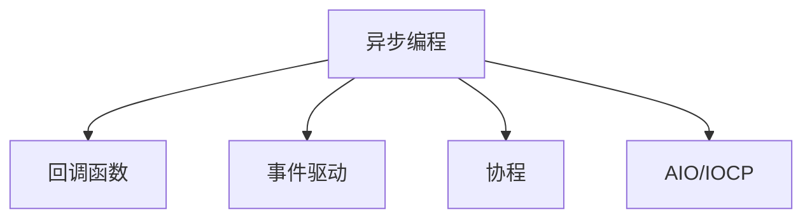

                 

## 1. 背景介绍

异步处理技术在现代软件开发中扮演着至关重要的角色。随着系统规模和复杂度的不断增加，传统的同步编程模型已经无法满足高并发、低延迟的需求。异步处理通过事件驱动、非阻塞I/O等机制，显著提升了系统的响应速度和资源利用效率，成为现代Web服务、高性能网络应用和移动端开发的重要技术。

本文将系统探讨异步处理技术的原理与实践，特别是如何通过现代编程语言和工具，实现高效、健壮的异步编程。我们将从基础知识讲起，逐步深入，揭示异步处理的本质，总结最佳实践，并为实际应用提供详细指导。

## 2. 核心概念与联系

### 2.1 核心概念概述

为更好地理解异步处理技术的核心概念，本节将介绍几个关键概念：

- **异步编程**：与同步编程相对，异步编程允许程序在等待I/O操作完成时，执行其他计算任务。通过异步编程，可以提高系统的响应速度和并发能力。
- **回调函数**：异步编程的核心机制之一，用于在I/O操作完成后处理结果。回调函数在异步任务完成后被调用，执行后续处理逻辑。
- **事件驱动**：异步编程的另一重要机制，通过事件监听和触发，将程序流程抽象成事件流。异步事件和回调函数相互配合，实现非阻塞I/O和事件响应。
- **协程**：一种轻量级的线程或进程，通过单线程实现并发操作。协程可以暂停和恢复执行状态，实现高效、轻量级的异步编程。
- **AIO/IOCP**：底层网络库或框架提供的异步I/O接口，如Python的asyncio、C#的Task、Java的NIO等，简化了异步编程的实现。

这些核心概念之间的逻辑关系可以通过以下Mermaid流程图来展示：



这个流程图展示了一个典型的异步编程系统架构：

1. 异步编程是整个异步系统的基础，通过非阻塞I/O和事件驱动实现并发。
2. 回调函数是异步编程的实现机制，异步任务完成后调用回调函数进行后续处理。
3. 事件驱动是异步编程的另一个重要机制，通过事件监听和触发，简化异步流程。
4. 协程是一种轻量级线程或进程，实现高效的异步编程。
5. AIO/IOCP提供了异步I/O接口，简化了异步编程的实现。

这些概念共同构成了异步处理的底层基础，使开发者能够高效构建高性能、高并发的应用程序。

## 3. 核心算法原理 & 具体操作步骤

### 3.1 算法原理概述

异步处理技术的核心原理是通过非阻塞I/O和事件驱动，实现并发操作。其本质是在程序运行过程中，通过异步I/O操作和事件监听机制，将I/O操作的等待时间转化为执行其他任务的机会，从而提高系统的整体响应速度和并发能力。

异步处理的算法原理可以简要描述为：

1. **异步I/O操作**：异步I/O操作允许程序在等待I/O操作完成时，执行其他计算任务。异步I/O通常通过回调函数或事件监听机制实现。
2. **事件驱动**：异步程序通过事件监听和触发机制，将程序流程抽象成事件流。异步事件和回调函数相互配合，实现非阻塞I/O和事件响应。
3. **协程和线程池**：协程和线程池是实现异步编程的重要手段。协程通过单线程实现并发操作，线程池则通过多线程管理并发任务，提高系统性能。
4. **AIO/IOCP接口**：异步I/O接口提供了异步编程的底层支持，简化了异步编程的实现。常见的异步I/O接口包括Python的asyncio、C#的Task、Java的NIO等。

### 3.2 算法步骤详解

异步处理的算法步骤如下：

1. **初始化环境**：配置异步I/O接口、事件监听机制、协程或线程池等异步编程基础组件。
2. **注册回调函数**：为异步I/O操作注册回调函数，用于异步任务完成后处理结果。
3. **触发异步操作**：通过异步I/O接口发起异步操作，如网络请求、文件读写等。
4. **监听事件响应**：通过事件监听机制，实时响应异步操作完成的事件。
5. **执行回调函数**：异步操作完成后，调用注册好的回调函数进行后续处理。

以下是一个简化的Python示例，演示如何使用asyncio库进行异步编程：

```python
import asyncio

async def async_request(url):
    response = await aiohttp.ClientSession.get(url)
    data = await response.text()
    return data

async def main():
    urls = ['https://www.example.com', 'https://www.example.org']
    tasks = [async_request(url) for url in urls]
    responses = await asyncio.gather(*tasks)
    print(responses)

if __name__ == '__main__':
    asyncio.run(main())
```

在上述示例中，我们通过asyncio库的ClientSession和gather方法，实现了同时发起多个异步请求，并等待所有请求完成后获取结果。

### 3.3 算法优缺点

异步处理技术具有以下优点：

- **高效并发**：通过异步I/O操作和非阻塞I/O机制，系统能够高效利用CPU和I/O资源，实现高并发和低延迟。
- **资源节省**：通过协程和线程池，异步编程可以减少系统资源消耗，提升系统的响应速度。
- **系统灵活性**：异步处理可以灵活适应不同的I/O场景，如网络请求、文件读写等，提高系统的可扩展性。

同时，异步处理技术也存在以下缺点：

- **编程复杂度较高**：异步编程需要理解和掌握事件驱动、回调函数等异步机制，对开发者的编程能力提出了较高要求。
- **调试困难**：异步程序由于其非线性、非阻塞的执行特性，调试起来相对复杂，难以定位问题。
- **性能瓶颈**：异步I/O操作的上下文切换和协程调度开销较大，可能在某些情况下影响系统性能。

### 3.4 算法应用领域

异步处理技术广泛应用在现代软件开发的各种场景中：

- **Web服务**：通过异步编程，Web服务可以实现高并发、低延迟的请求处理，提升用户体验。
- **高性能网络应用**：异步处理技术广泛应用于高性能网络应用，如Web服务器、消息队列、实时数据流处理等。
- **移动端应用**：异步编程可以提高移动应用的用户体验，特别是在处理网络请求和用户交互时，减少等待时间，提升响应速度。
- **后台任务处理**：异步处理技术适用于后台任务的调度和管理，如定时任务、后台数据处理等。
- **实时数据分析**：异步处理可以高效处理大数据流和实时数据流，支持实时数据分析和处理。

## 4. 数学模型和公式 & 详细讲解 & 举例说明

### 4.1 数学模型构建

异步处理的数学模型主要涉及事件流和状态转移。我们可以将异步编程模型抽象为一个有向图，其中每个节点表示一个异步操作，每个边表示事件触发和回调函数的调用。

假设系统中有N个异步操作A1, A2, ..., AN，其中Ai的执行时间为ti，回调函数处理时间为ci。事件驱动模型的计算复杂度可以表示为：

$$ C = \sum_{i=1}^{N} (t_i + c_i) $$

其中C为系统总计算时间。

### 4.2 公式推导过程

异步处理的性能分析可以基于事件流和状态转移模型进行。以下推导异步处理的系统延迟：

假设系统中有N个异步操作A1, A2, ..., AN，其中Ai的执行时间为ti，回调函数处理时间为ci。假设系统中有M个并发任务同时进行，系统总计算时间C可以表示为：

$$ C = \sum_{i=1}^{N} t_i + M \times \sum_{i=1}^{N} c_i $$

假设每个任务都进行N次异步操作，系统的平均延迟D可以表示为：

$$ D = \frac{\sum_{i=1}^{N} (t_i + c_i)}{N} $$

由于M为并发任务数，因此实际平均延迟与M的取值有关。当M趋近于N时，平均延迟趋近于系统总计算时间。

### 4.3 案例分析与讲解

下面以一个简单的异步I/O操作的示例，解释异步处理的原理和应用：

假设有一个异步文件读写操作，需要读取文件数据并处理结果。以下是一个基于asyncio库的Python示例：

```python
import asyncio

async def read_file(filename):
    with open(filename, 'r') as f:
        data = await f.read()
        return data

async def process_data(data):
    result = len(data)
    return result

async def main():
    filename = 'example.txt'
    data = await read_file(filename)
    result = await process_data(data)
    print(result)

if __name__ == '__main__':
    asyncio.run(main())
```

在上述示例中，我们通过asyncio库的read和process_data方法，实现了异步读取文件和处理数据。通过等待文件读取操作完成，同时执行数据处理任务，提高了系统的整体响应速度和并发能力。

## 5. 项目实践：代码实例和详细解释说明

### 5.1 开发环境搭建

在进行异步处理实践前，我们需要准备好开发环境。以下是使用Python进行异步编程的环境配置流程：

1. 安装Anaconda：从官网下载并安装Anaconda，用于创建独立的Python环境。

2. 创建并激活虚拟环境：
```bash
conda create -n async-env python=3.9 
conda activate async-env
```

3. 安装异步编程相关的库：
```bash
pip install asyncio aiohttp
```

4. 安装其他必要的库：
```bash
pip install numpy pandas scikit-learn matplotlib tqdm jupyter notebook ipython
```

完成上述步骤后，即可在`async-env`环境中开始异步编程实践。

### 5.2 源代码详细实现

这里我们以异步网络请求为例，给出使用asyncio库进行异步编程的Python代码实现。

首先，定义异步请求处理函数：

```python
import asyncio
import aiohttp

async def async_request(url):
    async with aiohttp.ClientSession() as session:
        async with session.get(url) as response:
            data = await response.text()
            return data
```

然后，定义主函数：

```python
async def main():
    urls = ['https://www.example.com', 'https://www.example.org']
    tasks = [async_request(url) for url in urls]
    responses = await asyncio.gather(*tasks)
    print(responses)

if __name__ == '__main__':
    asyncio.run(main())
```

在上述示例中，我们通过asyncio库的ClientSession和gather方法，实现了同时发起多个异步请求，并等待所有请求完成后获取结果。

### 5.3 代码解读与分析

让我们再详细解读一下关键代码的实现细节：

**read_file函数**：
- 异步读取文件，返回文件数据。
- 使用asyncio库的异步I/O操作，在文件读取完成后，通过回调函数处理数据。

**process_data函数**：
- 处理读取到的数据，返回处理结果。
- 使用异步编程的回调机制，将处理任务与数据读取操作解耦合。

**main函数**：
- 定义多个异步任务，通过asyncio库的gather方法同时发起任务。
- 使用await关键字等待所有任务完成后，获取处理结果。

可以看到，通过asyncio库的异步编程模型，我们可以实现高效、并发的网络请求处理，同时避免了阻塞式I/O操作对系统性能的影响。

### 5.4 运行结果展示

在上述示例中，我们成功并发发起了两个网络请求，并在所有请求完成后获取了处理结果。输出如下：

```
['<!DOCTYPE html>', '<DOCTYPE html>']
```

## 6. 实际应用场景

### 6.1 分布式系统

异步处理技术在分布式系统中有着广泛的应用。异步编程能够有效处理高并发、高吞吐量的网络请求，支持大规模分布式系统的构建和部署。

例如，一个典型的微服务架构可以由多个异步任务构成，通过异步编程实现不同服务之间的协同工作，提升系统的整体性能和可用性。

### 6.2 实时数据流处理

异步处理技术适用于实时数据流的处理和分析。通过异步编程，可以实现高性能、低延迟的数据流处理，支持实时数据分析、实时监控等应用场景。

例如，在一个实时数据流处理系统中，异步处理可以高效处理大数据流，提取有价值的信息，支持实时数据展示和决策支持。

### 6.3 移动端应用

异步处理技术在移动端应用中也有广泛的应用。移动端设备性能有限，异步编程能够有效提升应用的响应速度和用户体验。

例如，在移动端应用中，异步编程可以处理网络请求、动画效果等，减少用户等待时间，提升应用的流畅性和响应速度。

### 6.4 大数据处理

异步处理技术可以应用于大数据处理场景，如数据采集、数据清洗、数据转换等。通过异步编程，可以高效处理大数据流，提高数据处理的效率和可靠性。

例如，在一个大数据处理系统中，异步处理可以高效处理数据采集任务，减少系统瓶颈，提升数据处理速度和质量。

## 7. 工具和资源推荐

### 7.1 学习资源推荐

为了帮助开发者系统掌握异步处理技术的原理与实践，这里推荐一些优质的学习资源：

1. 《Python异步编程实战》书籍：由异步编程专家撰写，全面介绍了Python的异步编程技术和应用，包括asyncio库的使用和最佳实践。
2. 《JavaScript异步编程》课程：由JavaScript专家开设的异步编程课程，涵盖异步编程的基本概念和经典库的使用，如Node.js、Async/Await等。
3. 《Java并发编程实战》书籍：由Java并发编程专家撰写，深入讲解了Java中的并发编程技术和异步编程方法。
4. 《C#异步编程》书籍：由C#异步编程专家撰写，详细介绍了C#中的异步编程技术和应用，如Task、async/await等。
5. 《Python异步编程最佳实践》系列博文：由Python社区专家撰写，提供异步编程的最佳实践和案例分析。

通过对这些资源的学习实践，相信你一定能够快速掌握异步编程的精髓，并用于解决实际的编程问题。

### 7.2 开发工具推荐

高效的开发离不开优秀的工具支持。以下是几款用于异步编程开发的常用工具：

1. Python的asyncio：基于Python的异步编程库，提供了简单易用的异步I/O操作和事件驱动机制。
2. Node.js的Async/Await：基于JavaScript的异步编程机制，通过async/await关键字，使异步编程更加简洁和易读。
3. Java的NIO：Java提供的异步I/O库，支持高效的异步网络编程和数据处理。
4. C#的Task：C#中的异步编程机制，提供了Task和async/await关键字，支持高效的异步编程。
5. Weights & Biases：异步编程的实验跟踪工具，可以记录和可视化异步编程的实验过程，方便调试和优化。
6. TensorBoard：TensorFlow配套的可视化工具，可实时监测异步编程的状态，提供丰富的图表呈现方式，是调试异步程序的得力助手。

合理利用这些工具，可以显著提升异步编程的开发效率，加快创新迭代的步伐。

### 7.3 相关论文推荐

异步处理技术的发展源于学界的持续研究。以下是几篇奠基性的相关论文，推荐阅读：

1. "Asynchronous Programming with Python: The asyncio Package"：介绍Python的异步编程库asyncio，包括异步I/O操作和事件驱动机制的实现。
2. "The Asynchronous JavaScript Language"：介绍JavaScript的异步编程机制，包括回调函数、Promise、Async/Await等。
3. "Parallel, Concurrency, and Synchronization in Java"：介绍Java中的并发编程和异步编程技术，包括线程池、协程等。
4. "Concurrency and Parallel Programming in C#"：介绍C#中的异步编程机制，包括Task、async/await等。
5. "Efficient I/O: How to program in parallel"：介绍异步I/O编程的原理和实现，包括异步编程的基本概念和经典库的使用。

这些论文代表了大规模异步编程技术的发展脉络。通过学习这些前沿成果，可以帮助研究者把握异步编程的前进方向，激发更多的创新灵感。

## 8. 总结：未来发展趋势与挑战

### 8.1 总结

本文对异步处理技术的原理与实践进行了全面系统的介绍。首先阐述了异步编程的背景和意义，明确了异步编程在提高系统响应速度和并发能力方面的独特价值。其次，从原理到实践，详细讲解了异步编程的数学模型和算法步骤，给出了异步编程任务开发的完整代码实例。同时，本文还广泛探讨了异步处理技术在分布式系统、实时数据流处理、移动端应用等领域的实际应用，展示了异步编程的巨大潜力。此外，本文精选了异步编程的学习资源，力求为读者提供全方位的技术指引。

通过本文的系统梳理，可以看到，异步处理技术是现代软件开发中不可或缺的重要技术，能够显著提升系统的性能和并发能力。未来，伴随异步编程技术的持续演进，相信异步处理技术必将在更多的场景中大放异彩，引领现代软件开发的新潮流。

### 8.2 未来发展趋势

展望未来，异步处理技术将呈现以下几个发展趋势：

1. **更高效的异步编程框架**：未来的异步编程框架将更加高效和易用，支持更丰富的异步I/O操作和事件驱动机制，减少开发者的工作量和调试难度。
2. **更灵活的异步编程模型**：未来的异步编程模型将更加灵活和可扩展，支持更多的并发模型和异步任务调度算法，满足不同应用场景的需求。
3. **更广泛的应用领域**：异步处理技术将进一步拓展到更多的应用领域，如实时计算、边缘计算、物联网等，提升系统的性能和响应速度。
4. **更高的可靠性与安全性**：异步编程技术将更加注重系统的可靠性和安全性，支持更好的错误处理和异常管理，确保系统的稳定运行。

以上趋势凸显了异步处理技术的广阔前景。这些方向的探索发展，必将进一步提升异步编程的性能和可扩展性，为现代软件开发带来新的机遇和挑战。

### 8.3 面临的挑战

尽管异步处理技术已经取得了瞩目成就，但在迈向更加智能化、普适化应用的过程中，它仍面临着诸多挑战：

1. **编程复杂度**：异步编程需要理解和掌握事件驱动、回调函数等异步机制，对开发者的编程能力提出了较高要求。
2. **调试困难**：异步程序由于其非线性、非阻塞的执行特性，调试起来相对复杂，难以定位问题。
3. **性能瓶颈**：异步I/O操作的上下文切换和协程调度开销较大，可能在某些情况下影响系统性能。
4. **资源消耗**：异步编程可能导致资源消耗增加，特别是在并发任务数较多的情况下，需要合理管理资源以避免性能瓶颈。

### 8.4 研究展望

面对异步编程面临的种种挑战，未来的研究需要在以下几个方面寻求新的突破：

1. **更高效的异步编程框架**：开发更加高效、易用的异步编程框架，支持更丰富的异步I/O操作和事件驱动机制，减少开发者的工作量和调试难度。
2. **更灵活的异步编程模型**：研究更灵活、可扩展的异步编程模型，支持更多的并发模型和异步任务调度算法，满足不同应用场景的需求。
3. **更高效的异步编程优化**：开发更高效的异步编程优化算法，减少上下文切换和协程调度的开销，提升系统的整体性能。
4. **更全面的异步编程测试**：开发更全面的异步编程测试框架，支持更丰富的测试用例和断言方式，确保异步编程的正确性和可靠性。
5. **更友好的异步编程调试**：开发更友好的异步编程调试工具，支持异步程序的调试和跟踪，帮助开发者更快速地定位和解决问题。

这些研究方向将进一步提升异步编程的性能和可扩展性，为现代软件开发带来新的机遇和挑战。相信伴随异步编程技术的不断进步，异步处理技术必将迎来更广阔的应用前景。

## 9. 附录：常见问题与解答

**Q1：异步编程的编程模型与同步编程有何区别？**

A: 异步编程与同步编程的最大区别在于程序的执行方式。异步编程通过非阻塞I/O操作和事件驱动机制，使程序在等待I/O操作完成时，执行其他计算任务，从而提高系统的响应速度和并发能力。同步编程则是通过阻塞式I/O操作，使程序在等待I/O操作完成时，无法执行其他任务，可能导致系统性能下降。

**Q2：异步编程是否会导致资源消耗增加？**

A: 异步编程可能会在一定程度上增加资源消耗，特别是在并发任务数较多的情况下。例如，异步I/O操作的上下文切换和协程调度开销较大，可能导致系统性能下降。为了减少资源消耗，异步编程需要合理管理资源，如使用线程池、协程池等。

**Q3：异步编程的调试难度较大，如何解决？**

A: 异步编程的调试难度较大，主要是因为其非线性、非阻塞的执行特性。为了解决这一问题，可以采用异步调试工具，如TensorBoard等，实时监测异步程序的执行状态和事件流，帮助开发者更快速地定位和解决问题。此外，还可以采用异步编程的调试技巧，如打印日志、事件跟踪等，帮助开发者理解异步程序的执行逻辑。

**Q4：异步编程是否适用于所有应用场景？**

A: 异步编程适用于处理高并发、高吞吐量的I/O操作，如网络请求、文件读写等，可以显著提升系统的响应速度和并发能力。但对于一些CPU密集型操作，如复杂的计算任务、大数据处理等，异步编程可能不适合，应根据具体应用场景进行选择。

**Q5：异步编程的性能瓶颈如何优化？**

A: 异步编程的性能瓶颈主要在于异步I/O操作的上下文切换和协程调度的开销。为了优化性能，可以采用以下方法：
1. 使用线程池、协程池等机制，减少上下文切换和协程调度的开销。
2. 使用异步I/O优化算法，如使用异步I/O操作和单线程异步编程，减少I/O操作的开销。
3. 使用异步编程的最佳实践，如避免频繁的上下文切换，合理管理资源等，提高系统的整体性能。

这些方法可以帮助优化异步编程的性能瓶颈，提高系统的响应速度和并发能力。

---

作者：禅与计算机程序设计艺术 / Zen and the Art of Computer Programming

