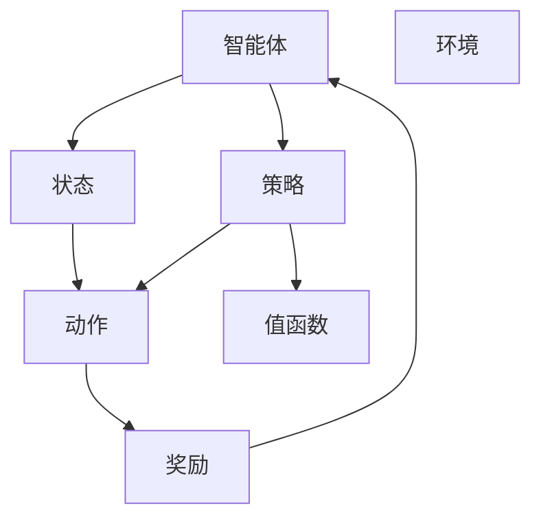

                 

# 强化学习 原理与代码实例讲解

> 关键词：强化学习, 马尔可夫决策过程, 策略, 值函数, 深度强化学习, Q-Learning, 策略梯度方法, 探索与利用权衡, 应用场景

## 1. 背景介绍

### 1.1 问题由来
强化学习（Reinforcement Learning, RL）作为一门经典的机器学习领域，与监督学习（Supervised Learning）和无监督学习（Unsupervised Learning）并列，是当今人工智能研究的核心方向之一。强化学习旨在通过智能体（Agent）与环境的交互，使智能体学习最优的决策策略，以最大化长期奖励（Reward）。强化学习在自动控制、机器人、游戏、推荐系统等领域展现出巨大潜力，被视为解决复杂决策问题的利器。

然而，传统强化学习算法如Q-Learning、SARSA等，在处理高维连续动作空间、大规模环境等问题时，效率低下，难以收敛到全局最优解。这促使深度强化学习（Deep Reinforcement Learning）的诞生，通过深度神经网络模型在状态空间中学习和近似最优策略，极大地提升了算法的复杂性和可扩展性。

### 1.2 问题核心关键点
强化学习核心思想在于构建智能体与环境之间的奖励函数，智能体通过与环境的交互，不断调整策略，以获得最大化的长期奖励。与监督学习不同，强化学习没有显式标签指导智能体的决策，完全依赖于智能体与环境的互动经验，因而具有更强的适应性和通用性。

强化学习涉及的关键问题包括：
- 如何选择最优策略：智能体需通过不断试验和学习，积累经验，构建和优化策略。
- 如何平衡探索与利用：在未确定状态价值时，智能体需探索不同行动，积累经验；当已有经验丰富时，智能体需利用已知的知识，优化行动。
- 如何优化值函数：智能体需通过状态-值函数或策略-值函数，学习最优策略，或直接学习策略。

强化学习的应用非常广泛，如自动驾驶、游戏AI、机器人控制、金融交易等，这些领域的高难度决策问题，均可以通过强化学习方法求解。

### 1.3 问题研究意义
研究强化学习算法，对于拓展人工智能的应用场景，提升决策系统的自动化和智能化水平，具有重要意义：

1. 提升决策系统自动化：强化学习可以自动从大量数据中学习最优策略，无需人工干预，实现决策过程的自动化。
2. 增强决策系统智能性：强化学习通过不断学习与环境交互的经验，可以积累更丰富、更鲁棒的决策知识，提升决策的准确性和鲁棒性。
3. 降低应用开发成本：通过强化学习算法，可以自动优化决策策略，减少开发和调试成本。
4. 推动技术创新：强化学习驱动的决策技术，催生了诸多新方法和新算法，如深度强化学习、元强化学习等，引领了AI研究的新方向。
5. 适应产业升级：强化学习算法可以应用于多种复杂系统，助力传统行业转型升级，推动产业智能化发展。

## 2. 核心概念与联系

### 2.1 核心概念概述

为更好地理解强化学习的核心思想和算法，本节将介绍几个关键概念：

- 智能体（Agent）：强化学习中，智能体指与环境交互并做出决策的主体，如机器人、游戏AI、推荐系统等。
- 环境（Environment）：智能体互动并获取奖励的虚拟或现实环境，包括状态空间、动作空间和奖励函数等。
- 状态（State）：环境中的具体情境，如当前游戏界面的状态，机器人当前的位置和速度等。
- 动作（Action）：智能体可采取的具体行为，如在游戏中选择的动作，机器人的转向操作等。
- 奖励（Reward）：环境对智能体动作的反馈，如游戏中的得分，机器人完成任务的效率等。
- 策略（Policy）：智能体选择动作的概率分布，如在状态s下选择动作a的概率。
- 值函数（Value Function）：描述状态或策略的长期奖励预期，如状态值函数、策略值函数等。

这些概念共同构成了强化学习的基本框架，其核心思想是通过智能体与环境的交互，学习最优策略以最大化长期奖励。

### 2.2 核心概念原理和架构的 Mermaid 流程图



这个流程图展示了强化学习中智能体与环境的基本交互过程。智能体在状态C下执行动作D，环境根据动作给出奖励E，智能体根据奖励更新策略F，并使用值函数G对策略进行评估和优化。

## 3. 核心算法原理 & 具体操作步骤
### 3.1 算法原理概述

强化学习的核心在于构建智能体与环境之间的互动模型，智能体通过不断试验和积累经验，学习最优策略，以最大化长期奖励。强化学习的目标是从状态空间S到动作空间A映射最优策略π，使得：

$$
\max_{\pi} \mathbb{E}_{s \sim S, a \sim \pi} \left[ \sum_{t=0}^{\infty} \gamma^t r_t \right]
$$

其中，S为状态空间，A为动作空间，r为奖励函数，$\gamma$为折扣因子。目标在于找到最优策略π，使得在任意状态s下，采取动作a的概率最大化长期奖励。

强化学习主要分为值函数方法和策略方法两类。值函数方法通过估计状态或动作的值函数，选择最优动作。策略方法直接优化策略，学习最优的决策函数。

### 3.2 算法步骤详解

以下详细介绍强化学习中常见的Q-Learning和策略梯度方法的具体实现步骤。

#### Q-Learning

Q-Learning是一种经典的值函数学习方法，其核心在于估计状态动作值函数$Q(s,a)$，表示在状态s下采取动作a的长期奖励。Q-Learning算法步骤如下：

1. 初始化Q表，设定学习率$\alpha$和折扣因子$\gamma$。
2. 智能体从当前状态s出发，根据当前状态和Q表，采取动作a，观察环境返回状态s'和奖励r。
3. 更新Q表：

$$
Q(s,a) \leftarrow Q(s,a) + \alpha \left[ r + \gamma \max_{a'} Q(s',a') - Q(s,a) \right]
$$

4. 如果智能体到达终止状态或达到最大迭代次数，算法结束。

Q-Learning算法利用Q表记录每个状态动作对的估计值，每次迭代根据当前状态和动作的实际奖励和下一个状态的最大奖励估计值，更新Q表中的值，逐步逼近最优策略。

#### 策略梯度方法

策略梯度方法如REINFORCE（REINforcement LEarning），通过直接优化策略，学习最优的决策函数。其核心在于定义一个策略函数θ，将状态s映射到动作a的概率分布。策略梯度算法的步骤如下：

1. 初始化策略参数θ，设定学习率$\eta$。
2. 智能体从当前状态s出发，根据当前状态和策略θ，采取动作a，观察环境返回状态s'和奖励r。
3. 计算对数概率和回报G：

$$
\log \pi(a|s) \leftarrow \log \pi(a|s), \quad G_t = \sum_{k=t}^{\infty} \gamma^{k-t} r_k
$$

4. 更新策略参数θ：

$$
\theta \leftarrow \theta + \eta \nabla_{\theta} \log \pi(a|s) G_t
$$

5. 如果智能体到达终止状态或达到最大迭代次数，算法结束。

策略梯度方法通过定义策略θ，在每个时间步对策略的梯度进行更新，直接优化策略函数，学习最优的决策行为。

### 3.3 算法优缺点

#### Q-Learning的优缺点

**优点：**
1. 简单易懂：Q-Learning算法基于Q表的更新机制，直观易懂。
2. 收敛性强：当环境足够复杂时，Q-Learning能够有效地收敛到全局最优策略。
3. 适用于多动作空间：Q-Learning可以处理多动作空间，通过Q表记录每个状态动作对的价值。

**缺点：**
1. 收敛速度慢：Q-Learning算法需要大量的迭代次数才能收敛，特别是当状态空间和动作空间巨大时，收敛速度较慢。
2. 状态动作值函数估计偏差：Q-Learning使用固定的一次性更新，无法充分利用未来状态的动作价值，可能导致收敛速度和精度不足。
3. 陷入局部最优：Q-Learning容易陷入局部最优，特别是在状态空间复杂度高时，难以找到全局最优策略。

#### 策略梯度方法的优缺点

**优点：**
1. 收敛速度快：策略梯度方法直接优化策略，通过梯度上升实现最优策略的学习，收敛速度较快。
2. 适用于高维连续动作空间：策略梯度方法可以直接处理连续动作空间，无需将动作离散化。
3. 鲁棒性强：策略梯度方法在处理非平稳环境时具有较好的鲁棒性。

**缺点：**
1. 策略更新不稳定：策略梯度方法使用对数概率和回报，更新不稳定，容易导致梯度消失或爆炸。
2. 参数维度高：策略梯度方法需要优化策略参数，参数维度较高，需要大量计算资源。
3. 对奖励函数要求高：策略梯度方法对奖励函数的要求较高，需要保证奖励函数具有良好的可微性和稳定性。

### 3.4 算法应用领域

强化学习因其自适应、自学习的能力，在众多领域得到了广泛应用：

- 游戏AI：如AlphaGo，AlphaStar等，通过强化学习技术在围棋、星际争霸等游戏中取得超越人类水平的表现。
- 机器人控制：如DRLab等，通过强化学习技术实现机器人自动导航、操作等复杂任务。
- 自动驾驶：如DeepDrive等，通过强化学习技术训练自动驾驶策略，实现精准控制。
- 金融交易：如AlphaGo交易系统，通过强化学习技术优化交易策略，提升盈利能力。
- 医疗决策：如TensorFlow Agents，通过强化学习技术构建医疗决策辅助系统，提升诊疗水平。

除了这些领域，强化学习还被应用于资源管理、交通控制、供应链优化等诸多场景中，展示出强大的通用性和应用潜力。

## 4. 数学模型和公式 & 详细讲解 & 举例说明

### 4.1 数学模型构建

强化学习的核心在于构建智能体与环境之间的互动模型。以下详细阐述其数学模型构建过程。

假设环境由状态空间S、动作空间A和奖励函数R组成，智能体在状态s下采取动作a，观察环境返回状态s'和奖励r，定义状态-值函数V(s)和策略-值函数J(θ)。目标在于最大化长期奖励，求解最优策略π。

1. 状态-值函数：

$$
V(s) = \mathbb{E}_{\pi} \left[ \sum_{t=0}^{\infty} \gamma^t r_t \right]
$$

其中，$\pi$为策略，r为奖励函数。

2. 策略-值函数：

$$
J(θ) = \mathbb{E}_{\pi_{\theta}} \left[ \sum_{t=0}^{\infty} \gamma^t r_t \right]
$$

其中，$\theta$为策略参数，$\pi_{\theta}$为策略函数。

### 4.2 公式推导过程

以下以Q-Learning算法为例，推导其核心公式：

假设智能体在状态s下采取动作a，观察环境返回状态s'和奖励r。根据Q-Learning算法，智能体通过状态动作值函数Q(s,a)更新Q表：

$$
Q(s,a) \leftarrow Q(s,a) + \alpha \left[ r + \gamma \max_{a'} Q(s',a') - Q(s,a) \right]
$$

其中，$\alpha$为学习率，$\gamma$为折扣因子。推导如下：

定义智能体从状态s到状态s'的回报G：

$$
G = r + \gamma \max_{a'} Q(s',a')
$$

根据Q-Learning算法的更新公式：

$$
Q(s,a) \leftarrow Q(s,a) + \alpha \left[ r + \gamma \max_{a'} Q(s',a') - Q(s,a) \right]
$$

整理得到：

$$
Q(s,a) \leftarrow Q(s,a) + \alpha G - Q(s,a)
$$

简化得：

$$
Q(s,a) \leftarrow \alpha G
$$

即Q-Learning算法的核心在于使用状态动作值函数Q(s,a)的更新机制，逐步逼近最优策略。

### 4.3 案例分析与讲解

以下以AlphaGo为例，介绍强化学习在游戏AI领域的应用。

AlphaGo通过深度强化学习技术，在围棋等游戏中取得了超越人类水平的表现。其核心在于以下几个步骤：

1. 策略网络：AlphaGo使用深度神经网络构建策略网络，将当前棋局状态映射到每个可行动作的概率分布。
2. 值网络：AlphaGo使用深度神经网络构建值网络，评估当前棋局的状态价值。
3. 蒙特卡罗树搜索：AlphaGo结合值网络，采用蒙特卡罗树搜索算法，选择最优的下一手棋。
4. 自我对弈：AlphaGo通过自我对弈，不断训练策略网络和值网络，逐步优化决策策略。

AlphaGo的核心在于策略网络和值网络的联合优化，通过蒙特卡罗树搜索和自我对弈，实现了对围棋规则的深入学习和理解和应用，展示了强化学习的巨大潜力。

## 5. 项目实践：代码实例和详细解释说明

### 5.1 开发环境搭建

在进行强化学习项目实践前，我们需要准备好开发环境。以下是使用Python进行TensorFlow开发的环境配置流程：

1. 安装Anaconda：从官网下载并安装Anaconda，用于创建独立的Python环境。

2. 创建并激活虚拟环境：
```bash
conda create -n tf-env python=3.8 
conda activate tf-env
```

3. 安装TensorFlow：根据CUDA版本，从官网获取对应的安装命令。例如：
```bash
conda install tensorflow -c tf -c conda-forge
```

4. 安装TensorBoard：
```bash
pip install tensorboard
```

5. 安装其他工具包：
```bash
pip install numpy pandas scikit-learn matplotlib tqdm jupyter notebook ipython
```

完成上述步骤后，即可在`tf-env`环境中开始强化学习实践。

### 5.2 源代码详细实现

这里我们以Q-Learning算法为例，给出使用TensorFlow进行强化学习实践的代码实现。

首先，定义Q-Learning算法的类和函数：

```python
import tensorflow as tf

class QLearning:
    def __init__(self, env, learning_rate=0.01, gamma=0.9, epsilon=0.1):
        self.env = env
        self.q_table = tf.Variable(tf.zeros([env.observation_space.n, env.action_space.n]))
        self.learning_rate = learning_rate
        self.gamma = gamma
        self.epsilon = epsilon
    
    def choose_action(self, observation):
        if np.random.uniform() < self.epsilon:
            return self.env.action_space.sample()
        else:
            return tf.argmax(self.q_table[observation]).numpy()
    
    def update_q_table(self, observation, action, reward, next_observation, done):
        best_next_action = tf.argmax(self.q_table[next_observation], axis=0)
        td_target = reward + self.gamma * tf.reduce_max(self.q_table[next_observation], axis=0)
        td_error = td_target - self.q_table[observation, action]
        self.q_table.assign_add(tf.expand_dims(td_error, 0))
```

然后，定义强化学习的训练函数：

```python
def train(env, num_episodes, num_steps):
    agent = QLearning(env)
    for episode in range(num_episodes):
        observation = env.reset()
        total_reward = 0
        
        for step in range(num_steps):
            action = agent.choose_action(observation)
            next_observation, reward, done, _ = env.step(action)
            total_reward += reward
            agent.update_q_table(observation, action, reward, next_observation, done)
            
            if done:
                break
            
            observation = next_observation
        
        print(f"Episode {episode+1}, reward: {total_reward}")
    
    env.close()
```

最后，启动训练流程：

```python
from gym import environments

env = environments.make("CartPole-v1")
train(env, 1000, 100)
```

以上就是使用TensorFlow进行Q-Learning算法实践的完整代码实现。可以看到，通过封装Q-Learning算法的类和函数，代码实现变得更加简洁高效。

### 5.3 代码解读与分析

让我们再详细解读一下关键代码的实现细节：

**QLearning类**：
- `__init__`方法：初始化环境、Q表、学习率、折扣因子、探索率等关键参数。
- `choose_action`方法：在当前状态下选择动作，探索与利用的权衡基于ε-greedy策略。
- `update_q_table`方法：根据当前状态、动作、奖励、下一个状态和是否完成，更新Q表。

**train函数**：
- 初始化Q-Learning算法实例，循环训练num_episodes次。
- 每次训练时，从环境获取初始状态，循环执行num_steps步。
- 在每一步中，根据当前状态选择动作，观察环境返回下一个状态和奖励，更新Q表。
- 如果达到终止状态，跳出循环，输出当前回合的奖励。

**训练流程**：
- 定义训练轮数num_episodes和每轮步数num_steps，开始循环训练。
- 每次训练，从环境中获取初始状态，开始执行每步操作。
- 在每步中，根据当前状态选择动作，观察环境返回下一个状态和奖励，更新Q表。
- 如果达到终止状态，跳出循环，输出当前回合的奖励。
- 所有训练轮结束后，关闭环境。

可以看到，TensorFlow提供了强大的计算图支持和自动微分功能，使得强化学习的实现变得更加简单和高效。

当然，工业级的系统实现还需考虑更多因素，如模型的保存和部署、超参数的自动搜索、更灵活的任务适配层等。但核心的强化学习算法基本与此类似。

## 6. 实际应用场景

### 6.1 游戏AI

强化学习在游戏AI领域已经取得了突破性进展，AlphaGo、AlphaStar等模型在游戏领域展现了超凡的智能水平。强化学习通过学习环境中的规则和策略，能够自主学习和优化游戏策略，实现自动博弈。

AlphaGo的实现包括策略网络和值网络两部分，分别用于决策和评估当前状态的优劣。通过蒙特卡罗树搜索和自我对弈，AlphaGo逐步优化决策策略，最终在围棋等游戏中超越人类水平。AlphaGo的成功展示了强化学习在解决复杂博弈问题中的巨大潜力。

### 6.2 机器人控制

强化学习在机器人控制领域也展示了强大的能力。通过智能体与环境的互动，强化学习可以学习最优的控制策略，实现自动驾驶、操作等复杂任务。

例如，OpenAI的Tennis AI通过强化学习技术训练了两个乒乓球机器人，能够自发地进行对抗性训练，掌握复杂的击球动作和策略。这种技术可以广泛应用于机器人制造、自动化生产线等领域，提升机器人的自主决策能力和智能化水平。

### 6.3 金融交易

强化学习在金融交易领域也具有广泛应用。通过学习市场动态和历史数据，强化学习可以优化交易策略，提升盈利能力。

例如，DeepMind开发的AlphaGo交易系统通过强化学习技术优化交易策略，取得了显著的盈利效果。这种技术可以应用于股票、外汇等金融市场，帮助投资者做出更精准的决策，提升收益水平。

### 6.4 未来应用展望

随着强化学习技术的不断成熟，未来其在更多领域的应用将进一步拓展：

1. 医疗决策：通过强化学习技术，构建医疗决策辅助系统，提升诊疗水平和效率。例如，基于强化学习技术的手术机器人，能够自主决策和操作，减少手术风险和操作时间。
2. 教育培训：通过强化学习技术，构建智能导师系统，根据学生的学习行为和表现，动态调整教学策略和内容，提升学习效果。
3. 交通控制：通过强化学习技术，优化交通信号灯和车辆调度，提升交通流畅性和安全性。例如，基于强化学习技术的智能交通管理系统，能够根据实时交通状况，动态调整信号灯时序和车辆调度，减少交通拥堵。
4. 资源管理：通过强化学习技术，优化资源分配和调度，提高资源利用效率。例如，基于强化学习技术的智能电网，能够根据用户需求和电网状况，动态调整能源分配和调度，降低能源浪费和成本。

未来，强化学习将在更多领域得到应用，推动智能化水平的全面提升。

## 7. 工具和资源推荐
### 7.1 学习资源推荐

为了帮助开发者系统掌握强化学习理论基础和实践技巧，这里推荐一些优质的学习资源：

1. 《Reinforcement Learning: An Introduction》：由Sutton和Barto合著的经典书籍，全面介绍了强化学习的理论基础和算法实现。
2. 《Deep Reinforcement Learning with TensorFlow 2 and Keras》：基于TensorFlow和Keras的深度强化学习实践指南，涵盖多种强化学习算法的代码实现。
3. 《Deep Reinforcement Learning with PyTorch》：基于PyTorch的深度强化学习实践指南，详细介绍了强化学习算法的实现和优化。
4. 《Hands-On Reinforcement Learning with Python》：适合初学者的Python强化学习实践指南，涵盖基础强化学习算法和项目实战。
5. 强化学习课程和讲座：如斯坦福大学的CS294T课程、DeepMind的强化学习讲座，深入浅出地介绍了强化学习的理论基础和实际应用。

通过对这些资源的学习实践，相信你一定能够快速掌握强化学习的精髓，并用于解决实际的决策问题。

### 7.2 开发工具推荐

高效的开发离不开优秀的工具支持。以下是几款用于强化学习开发的常用工具：

1. TensorFlow：由Google主导开发的开源深度学习框架，支持强化学习算法的实现和优化，易于与其他工具集成。
2. PyTorch：由Facebook主导开发的开源深度学习框架，灵活高效，适用于强化学习算法的实现和优化。
3. OpenAI Gym：用于强化学习环境模拟和算法测试的库，包含大量经典环境和任务。
4. TensorBoard：TensorFlow配套的可视化工具，实时监测模型训练状态，可视化模型决策过程和参数变化。
5. Weights & Biases：模型训练的实验跟踪工具，记录和可视化模型训练过程中的各项指标，方便对比和调优。

合理利用这些工具，可以显著提升强化学习的开发效率，加快创新迭代的步伐。

### 7.3 相关论文推荐

强化学习领域的研究不断涌现，以下是几篇奠基性的相关论文，推荐阅读：

1. Q-Learning：由Watkins提出，是强化学习中的经典算法，通过Q表记录每个状态动作对的价值，逐步逼近最优策略。
2. Policy Gradient Methods：由Sutton等人提出，通过直接优化策略，学习最优的决策函数，展示出强大的收敛性和应用潜力。
3. Deep Q-Learning：由Silver等人提出，通过深度神经网络估计状态动作值函数，提升了Q-Learning算法的复杂性和可扩展性。
4. Proximal Policy Optimization（PPO）：由Schmidhuber等人提出，通过近端策略优化，提升策略更新的稳定性和收敛速度。
5. A3C：由Mnih等人提出，通过分布式训练和参数共享，提升了强化学习算法的效率和泛化能力。

这些论文代表了大强化学习算法的演进历程，为理解算法原理和实践技巧提供了重要参考。

## 8. 总结：未来发展趋势与挑战

### 8.1 总结

本文对强化学习的核心思想和算法进行了全面系统的介绍。首先阐述了强化学习的背景和研究意义，明确了强化学习在复杂决策问题中的重要地位。其次，从原理到实践，详细讲解了Q-Learning和策略梯度方法的具体实现步骤，给出了强化学习任务开发的完整代码实例。同时，本文还广泛探讨了强化学习在多个领域的应用前景，展示了强化学习技术的强大应用潜力。

通过本文的系统梳理，可以看到，强化学习通过智能体与环境的互动，学习最优的决策策略，实现复杂决策问题的自动求解。其在游戏AI、机器人控制、金融交易等众多领域展示了巨大价值，为构建智能决策系统提供了新思路。

### 8.2 未来发展趋势

展望未来，强化学习技术将呈现以下几个发展趋势：

1. 深度强化学习：随着深度神经网络的发展，深度强化学习将进一步提升算法的复杂性和可扩展性，提升决策系统的智能化水平。
2. 多智能体强化学习：多智能体系统通过协调和合作，实现更加复杂的决策任务，未来在机器人协同控制、自动驾驶等领域将有广泛应用。
3. 元强化学习：元强化学习通过学习通用决策策略，适应不同的环境和任务，提升决策系统的鲁棒性和泛化能力。
4. 强化学习与神经网络融合：将强化学习与神经网络、深度学习等技术进行融合，提升决策系统的性能和鲁棒性。
5. 强化学习与自然语言处理结合：通过语言理解和生成技术，提升决策系统与人类交互的能力，实现更加智能化的决策。

以上趋势凸显了强化学习技术的广阔前景，为构建智能决策系统提供了新思路和新方法。这些方向的探索发展，必将进一步提升决策系统的性能和应用范围，推动人工智能技术的全面突破。

### 8.3 面临的挑战

尽管强化学习技术已经取得了显著成就，但在迈向更加智能化、普适化应用的过程中，仍面临诸多挑战：

1. 探索与利用权衡：如何在探索新知识与利用已有知识之间找到平衡，是强化学习的重要难题。探索不足可能导致知识积累缓慢，探索过度可能导致决策不稳定。
2. 参数维度高：强化学习算法需要优化大量参数，特别是在高维连续动作空间中，参数维度更高，需要大量计算资源。
3. 奖励函数设计：设计合理的奖励函数是强化学习的关键，错误的奖励函数可能导致学习效率低下，甚至陷入局部最优。
4. 可解释性不足：强化学习算法通常是"黑盒"系统，难以解释其内部工作机制和决策逻辑。对于医疗、金融等高风险应用，算法的可解释性和可审计性尤为重要。
5. 安全性有待保障：强化学习算法可能学习到有偏见、有害的信息，通过策略扩散到下游任务，产生误导性、歧视性的输出，给实际应用带来安全隐患。
6. 资源瓶颈：强化学习算法需要大量的计算资源和存储空间，特别是在高维连续动作空间中，计算效率和资源利用效率仍需提升。

正视强化学习面临的这些挑战，积极应对并寻求突破，将是强化学习技术走向成熟的必由之路。相信随着学界和产业界的共同努力，这些挑战终将一一被克服，强化学习技术必将在构建智能决策系统中扮演越来越重要的角色。

### 8.4 研究展望

面向未来，强化学习技术需要在以下几个方面寻求新的突破：

1. 探索与利用权衡的优化：改进探索与利用的平衡方法，如利用基于模型的规划、引入元学习等技术，优化探索策略。
2. 参数维度的降低：研究参数高效的强化学习算法，如DQN、TD3等，减小参数维度，提高计算效率。
3. 奖励函数的设计：通过引入外在奖励、内在奖励等方法，设计更加合理的奖励函数，提升学习效率。
4. 可解释性和可审计性：通过模型解释技术，如可视化、因果推断等，增强算法的可解释性和可审计性，提升应用的可靠性和安全性。
5. 资源优化：研究资源高效利用的方法，如模型剪枝、分布式训练等，提高算法的计算效率和资源利用效率。
6. 多模态融合：将强化学习与其他模态技术进行融合，如视觉、语音等，提升决策系统的感知能力和鲁棒性。

这些研究方向的探索，必将引领强化学习技术迈向更高的台阶，为构建智能决策系统提供新思路和新方法。通过不断创新和优化，强化学习技术必将在更多领域得到广泛应用，推动人工智能技术的全面发展。

## 9. 附录：常见问题与解答

**Q1：强化学习中的探索与利用权衡是什么？**

A: 强化学习中的探索与利用权衡是指智能体需要在未确定状态价值时探索不同行动，积累经验；在已有经验丰富时，利用已知的知识，优化行动。探索过度可能导致学习效率低下，而探索不足可能导致知识积累缓慢。平衡探索与利用是强化学习中重要的研究课题。

**Q2：如何在高维连续动作空间中进行强化学习？**

A: 在高维连续动作空间中，强化学习的参数维度较高，难以进行有效的优化。常用的方法是使用神经网络近似策略，如策略梯度方法。同时，可以通过参数共享、分布式训练等方法，提升算法的效率和鲁棒性。此外，还可以使用深度强化学习中的演员-评论家结构，优化策略和值函数的联合训练。

**Q3：强化学习中的奖励函数设计有哪些技巧？**

A: 强化学习中的奖励函数设计是关键，直接影响算法的学习效果。常用的技巧包括：
1. 稀疏奖励：设计稀疏奖励函数，避免奖励信号过于频繁，减少噪声影响。
2. 多层次奖励：设计多层次奖励函数，引导智能体逐步掌握复杂任务。
3. 即时奖励与长期奖励结合：设计即时奖励和长期奖励结合的奖励函数，平衡短期目标和长期目标。

**Q4：强化学习中的超参数调优有哪些方法？**

A: 强化学习中的超参数调优是提升算法效果的重要手段。常用的方法包括：
1. 网格搜索：对超参数空间进行网格化搜索，找到最优的超参数组合。
2. 随机搜索：在超参数空间中随机采样，优化搜索效率。
3. 贝叶斯优化：利用贝叶斯方法进行超参数调优，提升搜索效率和效果。

**Q5：强化学习在实际应用中需要注意哪些问题？**

A: 强化学习在实际应用中需要注意以下问题：
1. 奖励函数设计：设计合理的奖励函数，避免奖励信号过于复杂或过于稀疏，影响学习效果。
2. 探索与利用权衡：平衡探索新知识和利用已有知识，避免探索过度或利用不足。
3. 计算资源消耗：高维连续动作空间和大规模环境的强化学习，计算资源消耗较大，需要优化算法和设备配置。
4. 可解释性和可审计性：强化学习算法通常是"黑盒"系统，需要增强算法的可解释性和可审计性，确保应用的可靠性和安全性。
5. 模型鲁棒性：强化学习算法在处理非平稳环境时，需要保证鲁棒性，避免陷入局部最优。

正视这些问题，积极应对并寻求突破，将是在强化学习应用中取得成功的关键。相信随着学界和产业界的共同努力，这些挑战终将一一被克服，强化学习技术必将在构建智能决策系统中扮演越来越重要的角色。

