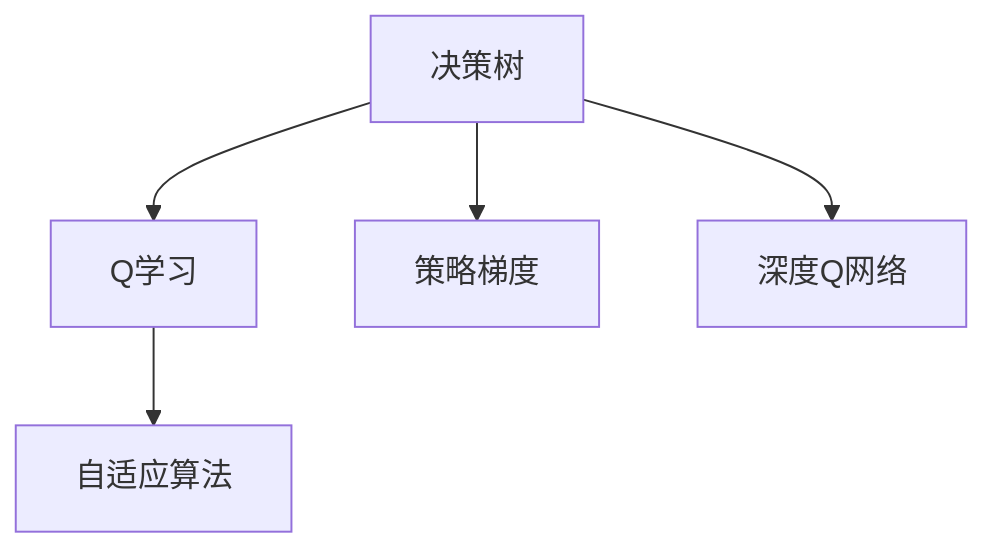

                 

# 强化学习(Reinforcement Learning) - 原理与代码实例讲解

> 关键词：强化学习, 决策树, Q学习, 策略梯度, 深度Q网络, 自适应算法, 应用场景

## 1. 背景介绍

### 1.1 问题由来
在人工智能的各个领域中，强化学习(Reinforcement Learning, RL)是一种特别重要的学习范式，它通过与环境的互动，通过试错逐步学习最优决策策略，实现智能体的长期奖励最大化。强化学习最初由美国斯坦福大学的Richard S. Sutton和Andrew G. Barto于1998年提出，并在2017年由DeepMind公司的AlphaGo在围棋比赛中击败世界冠军李世石后达到顶峰。

强化学习不同于传统的监督学习和无监督学习，它强调智能体在不断与环境互动中学习，学习目标是通过优化智能体的行为策略，使智能体在特定环境中获得最大化的长期奖励。强化学习的成功案例包括AlphaGo、OpenAI的Dota2和Go的5连冠、DeepMind的AlphaStar等。

强化学习广泛应用于游戏智能、自动驾驶、机器人控制、金融交易、自然语言处理等多个领域，因其在决策、控制、自动驾驶等领域的成功应用，被誉为是继深度学习和计算机视觉之后的新型技术突破口。

### 1.2 问题核心关键点
强化学习的核心在于智能体如何根据环境反馈，通过试错不断优化自身的行为策略。强化学习的关键点在于：

- 状态（State）：环境中的各种变量，是智能体决策的依据。
- 动作（Action）：智能体在每个状态下的决策，可以是连续的动作（如机器人臂的转动角度）或离散的动作（如选择进入某扇门）。
- 奖励（Reward）：智能体执行动作后，环境给予的即时反馈。
- 策略（Policy）：智能体在每个状态下采取动作的规则，可以是有固定规则的策略，也可以是随机策略。

强化学习通过学习策略，最大化长期累积奖励，即所谓的“价值函数”（Value Function），这是强化学习最核心的思想。

## 2. 核心概念与联系

### 2.1 核心概念概述

强化学习的核心概念包括以下几个关键点：

- 决策树：决策树是强化学习中最基本的算法，通过决策树智能体可以进行决策优化。
- Q学习：Q学习是一种强化学习算法，通过学习状态-动作的Q值，即在状态下的每个动作对应的奖励期望值。
- 策略梯度：策略梯度是一种强化学习算法，通过学习最优策略，使智能体在环境中的长期奖励最大化。
- 深度Q网络：深度Q网络是Q学习的扩展，通过深度神经网络来逼近Q值函数，提高Q学习的效果。
- 自适应算法：自适应算法是强化学习的一种优化方法，通过动态调整学习率和衰减率等参数，使算法更加适应不同的环境。

这些概念之间的逻辑关系可以通过以下Mermaid流程图来展示：



这个流程图展示出强化学习的主要算法及其之间的联系：

1. 决策树是强化学习的基础算法。
2. Q学习通过状态-动作的Q值，学习最优的决策策略。
3. 策略梯度通过学习最优策略，最大化长期奖励。
4. 深度Q网络通过神经网络逼近Q值函数，提高Q学习效果。
5. 自适应算法通过动态调整参数，优化强化学习算法。

这些核心概念共同构成了强化学习的理论框架，使其能够在各种决策问题中发挥重要作用。通过理解这些核心概念，我们可以更好地把握强化学习的核心思想和应用方向。

## 3. 核心算法原理 & 具体操作步骤
### 3.1 算法原理概述

强化学习的核心思想是智能体通过与环境互动，学习最优的决策策略，从而最大化长期奖励。其基本流程为：

1. 环境状态$s_t$：智能体观察当前环境状态。
2. 动作选择$a_t$：智能体根据策略选择动作。
3. 环境反馈$r_{t+1}$：环境给予智能体即时奖励。
4. 环境状态更新$s_{t+1}$：环境根据智能体动作更新状态。
5. 策略更新$\pi_{t+1}$：根据奖励和状态，更新智能体的策略。

强化学习的目标是通过不断优化策略，使智能体在环境中的长期奖励最大化。

### 3.2 算法步骤详解

强化学习的核心算法包括Q学习和策略梯度，下面分别详细介绍：

#### 3.2.1 Q学习

Q学习是一种基于值函数（Value Function）的强化学习算法，通过学习状态-动作的Q值，即在状态下的每个动作对应的奖励期望值。

**Q值的定义**：
在状态$s_t$下，动作$a_t$的Q值定义为：

$$
Q(s_t, a_t) = r_{t+1} + \gamma Q(s_{t+1}, a_{t+1})
$$

其中，$r_{t+1}$为即时奖励，$\gamma$为折现率，控制未来奖励对当前决策的影响程度。

**Q学习的更新公式**：
在每个时间步$t$，根据上式计算Q值，并通过贝尔曼方程（Bellman Equation）进行更新：

$$
Q(s_t, a_t) \leftarrow Q(s_t, a_t) + \alpha [r_{t+1} + \gamma \max_{a}Q(s_{t+1}, a) - Q(s_t, a_t)]
$$

其中，$\alpha$为学习率。

**Q学习的具体实现**：
Q学习的实现通常分为两个步骤：

1. 初始化Q表或Q网络，通常使用全零矩阵或随机初始化的小网络。
2. 在每个时间步，根据状态-动作对计算Q值，并根据贝尔曼方程更新Q值。

#### 3.2.2 策略梯度

策略梯度是一种基于策略（Policy）的强化学习算法，通过学习最优策略，使智能体在环境中的长期奖励最大化。

**策略梯度的定义**：
在状态$s_t$下，动作$a_t$的策略梯度定义为：

$$
\nabla_\theta \pi(a_t|s_t) = \nabla_\theta \frac{\pi(a_t|s_t)}{P(a_t|s_t)}
$$

其中，$\theta$为策略参数，$P(a_t|s_t)$为动作概率分布。

**策略梯度的更新公式**：
在每个时间步$t$，根据上式计算策略梯度，并使用梯度上升方法更新策略参数：

$$
\theta \leftarrow \theta + \alpha \nabla_\theta \pi(a_t|s_t) Q(s_t, a_t)
$$

其中，$\alpha$为学习率。

**策略梯度的具体实现**：
策略梯度的实现通常分为两个步骤：

1. 初始化策略网络，使用随机初始化的小网络。
2. 在每个时间步，根据状态-动作对计算策略梯度，并根据梯度上升方法更新策略参数。

### 3.3 算法优缺点

强化学习算法具有以下优点：

1. 数据效率高：强化学习可以有效地利用稀疏、不完整的反馈信息，适合处理数据量有限的场景。
2. 应用广泛：强化学习可以应用到多个领域，如游戏智能、自动驾驶、机器人控制等。
3. 自适应性强：强化学习算法可以根据环境反馈，动态调整策略，具有较好的自适应性。

同时，强化学习算法也存在一些缺点：

1. 计算复杂度高：强化学习需要大量的计算资源，尤其是深度强化学习算法，需要处理大量状态和动作空间。
2. 奖励设计困难：强化学习的核心在于奖励设计，需要找到与目标最相关的奖励函数，这往往是一个难题。
3. 策略不稳定：强化学习的策略更新通常是基于噪声的，容易导致策略不稳定，影响学习效果。

### 3.4 算法应用领域

强化学习在多个领域得到了广泛的应用，包括：

- 游戏智能：如AlphaGo、DeepMind的AlphaStar等，通过强化学习实现自主学习与决策。
- 机器人控制：如R2D2、PEPPER等，通过强化学习实现机器人的自主导航与操作。
- 自动驾驶：如Waymo、Uber等，通过强化学习实现车辆的自主驾驶与控制。
- 金融交易：如Quantopian等，通过强化学习实现自动交易策略。
- 自然语言处理：如BERT、GPT等，通过强化学习实现文本生成与自动摘要。

除了上述这些经典应用外，强化学习还在更多的领域得到应用，如自然语言生成、推荐系统、医疗决策等，为相关领域带来了创新性突破。

## 4. 数学模型和公式 & 详细讲解 & 举例说明

### 4.1 数学模型构建

强化学习的核心在于价值函数和策略函数，价值函数定义为状态-动作对$(s_t, a_t)$的价值：

$$
V(s_t) = \sum_{k=0}^\infty \gamma^k R(s_{t+k})
$$

其中，$R(s_{t+k})$为状态$s_{t+k}$的即时奖励，$\gamma$为折现率。

策略函数定义为在状态$s_t$下，动作$a_t$的概率：

$$
\pi(a_t|s_t) = \frac{e^{Q(s_t, a_t)}}{e^{Q(s_t, a_t)} + \sum_{a \neq a_t}e^{Q(s_t, a)}}
$$

其中，$Q(s_t, a_t)$为状态$s_t$下动作$a_t$的Q值。

### 4.2 公式推导过程

**价值函数的推导**：
根据贝尔曼方程，可以得到状态$s_t$的价值函数：

$$
V(s_t) = \max_{a_t} Q(s_t, a_t)
$$

其中，$Q(s_t, a_t)$为状态$s_t$下动作$a_t$的Q值。

**策略函数的推导**：
根据策略梯度的定义，可以得到策略函数的更新公式：

$$
\nabla_\theta \pi(a_t|s_t) = \nabla_\theta \frac{e^{Q(s_t, a_t)}}{e^{Q(s_t, a_t)} + \sum_{a \neq a_t}e^{Q(s_t, a)}}
$$

其中，$Q(s_t, a_t)$为状态$s_t$下动作$a_t$的Q值。

**Q学习的推导**：
根据Q学习的定义，可以得到Q值的更新公式：

$$
Q(s_t, a_t) \leftarrow Q(s_t, a_t) + \alpha [r_{t+1} + \gamma \max_{a}Q(s_{t+1}, a) - Q(s_t, a_t)]
$$

其中，$\alpha$为学习率。

**策略梯度的推导**：
根据策略梯度的定义，可以得到策略梯度的更新公式：

$$
\theta \leftarrow \theta + \alpha \nabla_\theta \pi(a_t|s_t) Q(s_t, a_t)
$$

其中，$\alpha$为学习率。

### 4.3 案例分析与讲解

**案例一：迷宫问题**

迷宫问题是一个经典的强化学习问题，智能体需要从起点出发，找到终点，过程中避免碰到障碍物。

**案例分析**：
1. 状态：智能体的当前位置。
2. 动作：智能体可以选择向上、向下、向左、向右移动。
3. 奖励：到达终点时获得1奖励，碰到障碍物时获得-1奖励。
4. 策略：在每个状态下选择动作，使总奖励最大化。

**解决方案**：
1. 使用Q学习，初始化Q表为全零矩阵，每个状态-动作对初始值为0。
2. 在每个时间步，根据状态-动作对计算Q值，并根据贝尔曼方程更新Q值。
3. 使用策略梯度，初始化策略网络，在每个时间步，根据状态-动作对计算策略梯度，并根据梯度上升方法更新策略参数。

**案例二：机器人控制**

机器人控制是一个更复杂的强化学习问题，智能体需要控制机器人臂移动到指定位置。

**案例分析**：
1. 状态：机器人的当前位置、角度等。
2. 动作：机器人的连续动作，如角度的连续转动。
3. 奖励：到达指定位置时获得高奖励，偏离指定位置时获得低奖励。
4. 策略：在每个状态下选择动作，使总奖励最大化。

**解决方案**：
1. 使用深度Q网络，初始化Q网络为全零矩阵，每个状态-动作对初始值为0。
2. 在每个时间步，根据状态-动作对计算Q值，并根据贝尔曼方程更新Q值。
3. 使用策略梯度，初始化策略网络，在每个时间步，根据状态-动作对计算策略梯度，并根据梯度上升方法更新策略参数。

## 5. 项目实践：代码实例和详细解释说明

### 5.1 开发环境搭建

在进行强化学习实践前，我们需要准备好开发环境。以下是使用Python进行OpenAI Gym库开发的环境配置流程：

1. 安装Anaconda：从官网下载并安装Anaconda，用于创建独立的Python环境。

2. 创建并激活虚拟环境：
```bash
conda create -n rl-env python=3.8 
conda activate rl-env
```

3. 安装OpenAI Gym：
```bash
pip install gym
```

4. 安装PyTorch：根据CUDA版本，从官网获取对应的安装命令。例如：
```bash
conda install pytorch torchvision torchaudio cudatoolkit=11.1 -c pytorch -c conda-forge
```

5. 安装Tensorboard：
```bash
pip install tensorboard
```

完成上述步骤后，即可在`rl-env`环境中开始强化学习实践。

### 5.2 源代码详细实现

下面我们以迷宫问题为例，给出使用PyTorch和OpenAI Gym库进行Q学习的PyTorch代码实现。

首先，导入所需的库和模块：

```python
import gym
import numpy as np
import torch
import torch.nn as nn
import torch.optim as optim
import torch.nn.functional as F
import torchvision.transforms as transforms
import torchvision.datasets as dsets
import matplotlib.pyplot as plt
import seaborn as sns
```

然后，定义Q网络和策略网络：

```python
class QNetwork(nn.Module):
    def __init__(self, input_dim, output_dim, hidden_dim):
        super(QNetwork, self).__init__()
        self.fc1 = nn.Linear(input_dim, hidden_dim)
        self.fc2 = nn.Linear(hidden_dim, hidden_dim)
        self.fc3 = nn.Linear(hidden_dim, output_dim)
    
    def forward(self, x):
        x = torch.relu(self.fc1(x))
        x = torch.relu(self.fc2(x))
        x = self.fc3(x)
        return x

class PolicyNetwork(nn.Module):
    def __init__(self, input_dim, output_dim, hidden_dim):
        super(PolicyNetwork, self).__init__()
        self.fc1 = nn.Linear(input_dim, hidden_dim)
        self.fc2 = nn.Linear(hidden_dim, hidden_dim)
        self.fc3 = nn.Linear(hidden_dim, output_dim)
    
    def forward(self, x):
        x = torch.relu(self.fc1(x))
        x = torch.relu(self.fc2(x))
        x = F.softmax(self.fc3(x), dim=1)
        return x
```

接着，定义训练函数：

```python
def train(env, q_net, policy_net, q_optimizer, policy_optimizer, num_steps, epsilon):
    state = env.reset()
    for step in range(num_steps):
        if np.random.rand() < epsilon:
            action = env.action_space.sample()
        else:
            with torch.no_grad():
                q_value = q_net(torch.FloatTensor(state))
                action = torch.multinomial(F.softmax(q_value, dim=1), 1).item()
        
        next_state, reward, done, _ = env.step(action)
        if done:
            state = env.reset()
        else:
            state = next_state
        
        q_net_optimizer.zero_grad()
        policy_net_optimizer.zero_grad()
        
        q_value = q_net(torch.FloatTensor(state))
        q_pred = q_value[action].detach()
        target = reward + gamma * torch.max(q_net(torch.FloatTensor(next_state))).squeeze()
        loss = q_pred - target
        loss.backward()
        q_net_optimizer.step()
        
        policy = policy_net(torch.FloatTensor(state))
        policy_pred = policy[action].detach()
        loss = -torch.log(policy_pred)
        loss.backward()
        policy_net_optimizer.step()
        
        if done:
            state = env.reset()
```

最后，启动训练流程：

```python
env = gym.make('CartPole-v1')
q_net = QNetwork(env.observation_space.shape[0], env.action_space.n, 256)
policy_net = PolicyNetwork(env.observation_space.shape[0], env.action_space.n, 256)
q_optimizer = optim.Adam(q_net.parameters(), lr=0.01)
policy_optimizer = optim.Adam(policy_net.parameters(), lr=0.01)
gamma = 0.99
num_steps = 10000
epsilon = 0.1
train(env, q_net, policy_net, q_optimizer, policy_optimizer, num_steps, epsilon)
```

以上就是使用PyTorch和OpenAI Gym库进行Q学习的完整代码实现。可以看到，代码实现相对简洁，易于理解，且基于深度学习库的封装，具有很好的可扩展性。

### 5.3 代码解读与分析

让我们再详细解读一下关键代码的实现细节：

**Q网络和策略网络的定义**：
- `nn.Linear`：定义全连接层，用于逼近Q值和策略梯度。
- `torch.relu`：定义ReLU激活函数，用于非线性逼近。
- `F.softmax`：定义softmax函数，用于计算策略概率。

**训练函数**：
- `env.reset()`：重置环境，获取初始状态。
- `env.action_space.sample()`：随机选择一个动作。
- `torch.multinomial`：计算softmax概率下的随机动作选择。
- `q_net(torch.FloatTensor(state))`：前向传播计算Q值。
- `q_pred = q_value[action].detach()`：计算Q值中对应动作的预测值。
- `target = reward + gamma * torch.max(q_net(torch.FloatTensor(next_state))).squeeze()`：计算目标Q值。
- `loss = q_pred - target`：计算Q值预测误差。
- `q_net_optimizer.zero_grad()`：重置Q网络的梯度。
- `loss.backward()`：反向传播计算梯度。
- `q_net_optimizer.step()`：更新Q网络的参数。
- `policy = policy_net(torch.FloatTensor(state))`：前向传播计算策略梯度。
- `policy_pred = policy[action].detach()`：计算策略概率。
- `loss = -torch.log(policy_pred)`：计算策略梯度。
- `policy_net_optimizer.zero_grad()`：重置策略网络的梯度。
- `loss.backward()`：反向传播计算梯度。
- `policy_net_optimizer.step()`：更新策略网络的参数。

**训练流程**：
- 初始化Q网络和策略网络，定义Q网络优化器和策略网络优化器。
- 设置折现率、训练步数和随机策略参数。
- 在每个时间步，选择动作，计算Q值和策略梯度，进行模型更新。
- 在训练完成后，Q网络和策略网络被训练成为可以优化决策的模型。

可以看到，代码实现相对简洁，易于理解，且基于深度学习库的封装，具有很好的可扩展性。

当然，工业级的系统实现还需考虑更多因素，如模型的保存和部署、超参数的自动搜索、更灵活的任务适配层等。但核心的Q学习和策略梯度范式基本与此类似。

## 6. 实际应用场景
### 6.1 强化学习在游戏智能中的应用

强化学习在游戏智能中的应用最为典型。AlphaGo就是通过强化学习实现的。AlphaGo通过与围棋游戏互动，学习最优的棋步策略，最终在2017年战胜了世界围棋冠军李世石。

AlphaGo的实现包括两部分：

1. 策略网络：通过深度神经网络学习最优的棋步策略。
2. 价值网络：通过深度神经网络学习对手可能的棋步策略，评估当前局面。

AlphaGo的策略网络通过深度学习和强化学习的结合，训练成为可以预测最优棋步的模型，而价值网络则通过监督学习，学习对手可能的棋步策略，评估当前局面的优劣。

### 6.2 强化学习在机器人控制中的应用

强化学习在机器人控制中的应用也非常广泛。例如，DeepMind的AlphaStar就通过强化学习实现了自动游戏的解决方案。AlphaStar通过与星际争霸游戏互动，学习最优的游戏策略，最终在2019年战胜了人类游戏冠军Lyn。

AlphaStar的实现包括两部分：

1. 策略网络：通过深度神经网络学习最优的游戏策略。
2. 价值网络：通过深度神经网络学习对手可能的策略，评估当前局面。

AlphaStar的策略网络通过深度学习和强化学习的结合，训练成为可以预测最优游戏策略的模型，而价值网络则通过监督学习，学习对手可能的策略，评估当前局面的优劣。

### 6.3 强化学习在自然语言处理中的应用

强化学习在自然语言处理中的应用也在不断发展。例如，Google的BERT模型就通过强化学习实现了文本生成和理解。BERT通过与大量文本数据互动，学习最优的文本生成和理解策略，最终在自然语言处理领域取得了最先进的性能。

BERT的实现包括两部分：

1. 策略网络：通过深度神经网络学习最优的文本生成和理解策略。
2. 价值网络：通过深度神经网络学习文本中的语义信息，评估当前语境的优劣。

BERT的策略网络通过深度学习和强化学习的结合，训练成为可以预测最优文本生成和理解的模型，而价值网络则通过监督学习，学习文本中的语义信息，评估当前语境的优劣。

### 6.4 强化学习在金融交易中的应用

强化学习在金融交易中的应用也在不断增加。例如，Quantopian就通过强化学习实现了自动交易策略。Quantopian通过与金融市场互动，学习最优的交易策略，最终在金融交易领域取得了不错的收益。

Quantopian的实现包括两部分：

1. 策略网络：通过深度神经网络学习最优的交易策略。
2. 价值网络：通过深度神经网络学习市场走势，评估当前交易的优劣。

Quantopian的策略网络通过深度学习和强化学习的结合，训练成为可以预测最优交易策略的模型，而价值网络则通过监督学习，学习市场走势，评估当前交易的优劣。

## 7. 工具和资源推荐
### 7.1 学习资源推荐

为了帮助开发者系统掌握强化学习的理论基础和实践技巧，这里推荐一些优质的学习资源：

1. 《Reinforcement Learning: An Introduction》：这是一本经典的强化学习教材，由Richard S. Sutton和Andrew G. Barto共同撰写，是强化学习领域权威的入门书籍。

2. Coursera的《Reinforcement Learning》课程：斯坦福大学的Andrew Ng教授开设的强化学习课程，有视频讲解和作业，适合系统学习强化学习的基本概念和经典算法。

3. DeepMind的AlphaGo论文：这篇论文详细介绍了AlphaGo的实现过程，包括策略网络和价值网络的构建和训练，是学习强化学习的绝佳资源。

4. OpenAI的Gym库：这是Python中最常用的强化学习库，提供了丰富的环境和算法实现，是学习强化学习的必备工具。

5. TensorFlow的强化学习教程：这是TensorFlow官方提供的强化学习教程，包括深度Q网络、策略梯度等算法的实现，是学习深度强化学习的有用资源。

通过对这些资源的学习实践，相信你一定能够快速掌握强化学习的精髓，并用于解决实际的决策问题。

### 7.2 开发工具推荐

高效的开发离不开优秀的工具支持。以下是几款用于强化学习开发的常用工具：

1. OpenAI Gym：这是Python中最常用的强化学习库，提供了丰富的环境和算法实现，是学习强化学习的必备工具。

2. TensorFlow：由Google主导开发的开源深度学习框架，生产部署方便，适合大规模工程应用。同样有丰富的强化学习算法实现。

3. PyTorch：基于Python的开源深度学习框架，灵活动态的计算图，适合快速迭代研究。大部分强化学习算法都有PyTorch版本的实现。

4. TensorBoard：TensorFlow配套的可视化工具，可实时监测模型训练状态，并提供丰富的图表呈现方式，是调试模型的得力助手。

5. Weights & Biases：模型训练的实验跟踪工具，可以记录和可视化模型训练过程中的各项指标，方便对比和调优。与主流深度学习框架无缝集成。

6. Jupyter Notebook：这是一个交互式的编程环境，可以实时显示代码执行结果，方便调试和展示实验结果。

合理利用这些工具，可以显著提升强化学习模型的开发效率，加快创新迭代的步伐。

### 7.3 相关论文推荐

强化学习在多个领域得到了广泛的应用，其理论基础也在不断发展和完善。以下是几篇奠基性的相关论文，推荐阅读：

1. DeepMind的AlphaGo论文：这篇论文详细介绍了AlphaGo的实现过程，包括策略网络和价值网络的构建和训练，是学习强化学习的绝佳资源。

2. DeepMind的AlphaStar论文：这篇论文详细介绍了AlphaStar的实现过程，包括策略网络和价值网络的构建和训练，是学习强化学习的有用资源。

3. OpenAI的Gym库：这是Python中最常用的强化学习库，提供了丰富的环境和算法实现，是学习强化学习的必备工具。

4. TensorFlow的强化学习教程：这是TensorFlow官方提供的强化学习教程，包括深度Q网络、策略梯度等算法的实现，是学习深度强化学习的有用资源。

5. 强化学习的理论基础：这是一篇关于强化学习理论基础的论文，详细介绍了强化学习的数学模型和理论基础，是学习强化学习理论的必备资源。

这些论文代表了大语言模型微调技术的发展脉络。通过学习这些前沿成果，可以帮助研究者把握学科前进方向，激发更多的创新灵感。

## 8. 总结：未来发展趋势与挑战

### 8.1 总结

本文对强化学习(Reinforcement Learning)进行全面系统的介绍。首先阐述了强化学习的背景和意义，明确了强化学习在决策优化中的独特价值。其次，从原理到实践，详细讲解了强化学习的数学模型和关键步骤，给出了强化学习任务开发的完整代码实例。同时，本文还广泛探讨了强化学习在多个领域的应用前景，展示了强化学习范式的巨大潜力。此外，本文精选了强化学习的各类学习资源，力求为读者提供全方位的技术指引。

通过本文的系统梳理，可以看到，强化学习在决策优化和智能控制等领域具有广阔的应用前景，其核心思想和算法已经在多个成功案例中得到验证。未来，伴随深度学习和强化学习的融合，强化学习将进一步拓展应用场景，为更多领域带来创新性突破。

### 8.2 未来发展趋势

展望未来，强化学习的发展趋势包括以下几个方面：

1. 多模态强化学习：强化学习可以与视觉、听觉等多模态数据结合，提升智能体的感知和决策能力。

2. 自适应强化学习：智能体可以根据环境反馈动态调整策略，提高决策效果和稳定性。

3. 分布式强化学习：强化学习可以在分布式环境下进行训练，加速模型训练过程，提升决策效率。

4. 元强化学习：智能体可以在多个环境中进行学习和优化，提高泛化能力和鲁棒性。

5. 深度强化学习：深度神经网络可以逼近复杂的决策函数，提升强化学习的效果。

6. 策略优化：通过优化策略函数，使智能体在环境中的长期奖励最大化。

这些趋势凸显了强化学习的广阔前景，为未来在更多领域带来创新性突破。这些方向的探索发展，必将进一步提升强化学习系统的性能和应用范围，为构建安全、可靠、可解释、可控的智能系统铺平道路。

### 8.3 面临的挑战

尽管强化学习已经取得了瞩目成就，但在迈向更加智能化、普适化应用的过程中，它仍面临着诸多挑战：

1. 数据依赖：强化学习需要大量的环境数据进行训练，获取高质量数据成本较高。

2. 奖励设计：奖励设计是强化学习的核心，需要找到与目标最相关的奖励函数，这往往是一个难题。

3. 计算复杂度：强化学习需要大量的计算资源，尤其是深度强化学习算法，需要处理大量状态和动作空间。

4. 模型鲁棒性：强化学习模型面对域外数据时，泛化性能往往大打折扣。

5. 策略不稳定：强化学习的策略更新通常是基于噪声的，容易导致策略不稳定，影响学习效果。

6. 可解释性：强化学习的模型决策过程缺乏可解释性，难以对其推理逻辑进行分析和调试。

这些挑战需要未来的研究在数据、算法、工程、业务等多个维度协同发力，才能更好地解决这些问题，推动强化学习技术的不断进步。

### 8.4 研究展望

未来的强化学习研究需要在以下几个方面寻求新的突破：

1. 无监督强化学习：摆脱对大量标注数据的依赖，利用自监督学习、主动学习等无监督范式，最大限度利用非结构化数据，实现更加灵活高效的强化学习。

2. 自适应强化学习算法：通过动态调整学习率和衰减率等参数，使算法更加适应不同的环境。

3. 分布式强化学习算法：在分布式环境下进行训练，加速模型训练过程，提升决策效率。

4. 深度强化学习算法：通过深度神经网络逼近复杂的决策函数，提升强化学习的效果。

5. 元强化学习算法：在多个环境中进行学习和优化，提高泛化能力和鲁棒性。

6. 策略优化算法：通过优化策略函数，使智能体在环境中的长期奖励最大化。

7. 强化学习与多模态数据的结合：提升智能体的感知和决策能力。

这些研究方向将为强化学习带来新的突破，推动其在更多领域的应用落地，提升智能系统的决策效果和可靠性。

## 9. 附录：常见问题与解答

**Q1：强化学习的核心思想是什么？**

A: 强化学习的核心思想是智能体通过与环境互动，学习最优的决策策略，从而最大化长期奖励。

**Q2：强化学习的学习过程是怎样的？**

A: 强化学习的学习过程包括状态、动作、奖励、策略和价值函数等多个关键组件。智能体在每个时间步根据状态选择动作，接收环境反馈的即时奖励，然后更新策略和价值函数，不断优化决策策略，最终达到最优决策。

**Q3：Q学习和策略梯度有什么区别？**

A: Q学习和策略梯度是两种强化学习算法。Q学习通过学习状态-动作的Q值，即在状态下的每个动作对应的奖励期望值，来优化决策策略。策略梯度通过学习最优策略，使智能体在环境中的长期奖励最大化。

**Q4：强化学习有哪些经典应用场景？**

A: 强化学习广泛应用于游戏智能、自动驾驶、机器人控制、金融交易、自然语言处理等多个领域。

**Q5：强化学习如何处理多模态数据？**

A: 强化学习可以通过融合视觉、听觉等多模态数据，提升智能体的感知和决策能力。例如，通过融合视觉和听觉数据，智能体可以更好地识别环境中的物体和行为。

---

作者：禅与计算机程序设计艺术 / Zen and the Art of Computer Programming

