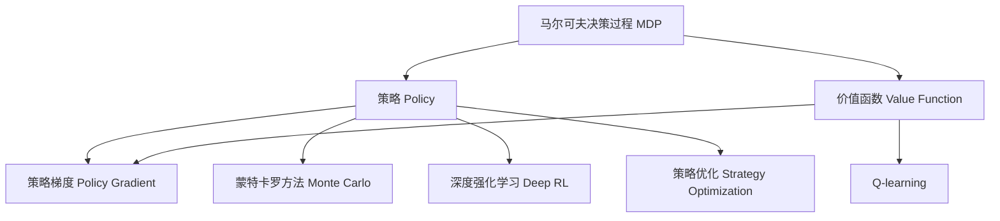

                 

## 1. 背景介绍

### 1.1 问题由来

强化学习（Reinforcement Learning, RL）是机器学习的一个分支，专注于解决智能体如何在动态环境中通过与环境的交互学习最优策略，以达到特定目标的问题。RL与监督学习和无监督学习不同，它强调通过“试错”的方式来学习，即智能体在不断尝试中逐步优化其决策策略。

强化学习广泛应用于自动控制、游戏AI、机器人、自然语言处理、推荐系统等诸多领域。由于其在模拟仿真环境中的卓越表现，RL技术在近年来的研究热度和应用实践中达到了一个新的高峰。著名的AlphaGo围棋程序的胜利、OpenAI的GPT-3模型、自动驾驶汽车的开发，无不闪耀着强化学习的身影。

### 1.2 问题核心关键点

强化学习的核心在于如何构建一个智能体，使得该智能体能够在某个特定环境中通过不断试错和积累经验，学会采取最佳策略以最大化长期的累积回报。该过程通常包括四个核心要素：

- **环境（Environment）**：智能体与环境交互的环境，包含状态（State）、动作（Action）、奖励（Reward）和转换函数（Transition）。
- **智能体（Agent）**：执行动作，接收奖励并观察状态的主体，其目标是通过学习最佳策略以优化累积回报。
- **策略（Policy）**：智能体的决策机制，通常由一个参数化的函数或神经网络表示，将当前状态映射为动作概率。
- **价值函数（Value Function）**：用于评估某个状态或动作的价值，通常与策略一起优化。

这些要素构成了一个强化学习问题，智能体的目标就是通过学习策略以最大化长期累积回报。

### 1.3 问题研究意义

强化学习的研究和应用具有重要的理论和实际意义：

1. **理论意义**：RL提供了一种通用的智能体设计框架，探讨智能体的行为学习过程，具有深厚的数学和哲学基础。
2. **实际意义**：通过RL，智能体能够在复杂的、不确定的环境中自适应地学习最优策略，具有广泛的实际应用前景。

## 2. 核心概念与联系

### 2.1 核心概念概述

为更好地理解强化学习的核心算法，本节将介绍几个密切相关的核心概念：

- **马尔可夫决策过程（MDP）**：表示环境状态和智能体决策过程的数学模型，包含状态、动作、奖励和转换概率。
- **策略（Policy）**：智能体在给定状态下采取动作的概率分布。
- **价值函数（Value Function）**：评估某一状态或动作的价值，分为状态值函数（State Value Function）和动作值函数（Action Value Function）。
- **状态值函数**：对某一状态的价值进行估计。
- **动作值函数**：对某一状态下采取某一动作的价值进行估计。
- **策略梯度（Policy Gradient）**：通过优化策略参数来提升策略性能的一种方法。
- **蒙特卡罗方法（Monte Carlo）**：通过模拟样本数据来估计价值函数和策略的一种方法。
- **Q-learning**：基于动作值函数的强化学习算法。
- **深度强化学习（Deep RL）**：将深度神经网络应用于策略表示和价值函数估计的强化学习方法。
- **策略优化（Strategy Optimization）**：优化策略以最大化累积回报的算法，包括策略梯度方法和策略优化算法（如TRPO、PPO）。

这些核心概念之间的逻辑关系可以通过以下Mermaid流程图来展示：



这个流程图展示了一些核心概念及其之间的关系：

1. MDP描述了环境的状态和智能体的决策过程。
2. 策略Policy定义了智能体在给定状态下的动作选择规则。
3. 价值函数Value Function评估状态或动作的价值。
4. 策略梯度Policy Gradient通过优化策略来提升性能。
5. Monte Carlo方法通过模拟样本数据来估计价值函数和策略。
6. Q-learning利用动作值函数进行策略学习。
7. 深度强化学习将深度神经网络应用于策略表示和价值函数估计。
8. 策略优化通过优化策略以最大化累积回报。

这些概念共同构成了强化学习的理论框架，为理解和实现强化学习算法提供了基础。

## 3. 核心算法原理 & 具体操作步骤
### 3.1 算法原理概述

强化学习的目标是通过智能体与环境的交互，学习最优策略以最大化长期的累积回报。核心算法通常包括策略优化和价值函数估计两部分。

- **策略优化**：通过优化策略，使得智能体在给定状态下采取最优动作，以最大化累积回报。
- **价值函数估计**：通过对状态值函数或动作值函数的估计，帮助智能体选择最优策略。

常见的强化学习算法可以分为基于值的方法和基于策略的方法两类：

- **基于值的方法**：如Q-learning，通过估计动作值函数来优化策略。
- **基于策略的方法**：如策略梯度算法，直接优化策略参数。

此外，强化学习还结合了蒙特卡罗方法、时间差分（TD）方法等技术，进一步提高了算法的性能和可扩展性。

### 3.2 算法步骤详解

基于策略的强化学习算法通常包括以下关键步骤：

**Step 1: 初始化**
- 定义策略$\pi$和价值函数$V$
- 设置学习率和优化器

**Step 2: 策略更新**
- 模拟智能体与环境交互，收集训练数据
- 使用蒙特卡罗方法或时间差分方法估计价值函数
- 使用梯度上升方法（如AdamW）优化策略参数

**Step 3: 评估和反馈**
- 在验证集上评估策略性能
- 使用策略梯度方法（如REINFORCE、PPO等）更新策略参数
- 更新策略和价值函数，以适应不断变化的环境

**Step 4: 模型集成和部署**
- 将优化后的策略应用于实际环境中
- 不断收集新数据，重新评估和优化策略

以上是基于策略的强化学习算法的基本流程。在实际应用中，还需要根据具体问题的特点进行进一步优化，如引入探索策略、考虑模型的鲁棒性和可扩展性等。

### 3.3 算法优缺点

强化学习的优点包括：

1. **适应性强**：适用于复杂、动态的环境，智能体能够自适应地学习最优策略。
2. **无监督学习**：不需要大量标注数据，能够从环境交互中自主学习。
3. **模型灵活性**：能够灵活地表达复杂的决策过程。

然而，强化学习也存在一些局限性：

1. **计算复杂度高**：需要大量的模拟数据和计算资源。
2. **策略梯度方差问题**：直接优化策略参数可能导致梯度方差较大，难以收敛。
3. **策略优化不稳定**：策略优化过程容易陷入局部最优解。
4. **样本效率低**：在大规模环境中，数据样本的获取成本较高。

尽管如此，强化学习在理论和实践中已取得显著进展，广泛应用于游戏AI、机器人控制、自动驾驶、自然语言处理等多个领域。

### 3.4 算法应用领域

强化学习在以下几个领域中已取得了显著的应用：

- **游戏AI**：AlphaGo、Dota 2 AI等，通过强化学习使AI在游戏中达到或超越人类水平。
- **自动驾驶**：利用强化学习进行交通环境感知、决策和控制，提高驾驶安全性。
- **机器人控制**：在复杂环境中通过强化学习优化机器人动作和决策策略，实现自主导航和操作。
- **自然语言处理**：利用强化学习进行文本生成、翻译、问答等任务，提升NLP系统的智能化水平。
- **推荐系统**：通过强化学习优化推荐算法，提高用户满意度和点击率。
- **金融投资**：利用强化学习进行市场分析、投资策略优化，提升投资收益。

此外，强化学习在医学、物流、能源管理等更多领域的应用也正在逐步拓展，为各行各业带来了新的技术和思路。

## 4. 数学模型和公式 & 详细讲解 & 举例说明

### 4.1 数学模型构建

强化学习的形式化模型通常由马尔可夫决策过程（MDP）表示，包含状态集合$S$、动作集合$A$、奖励函数$R:S\times A\rightarrow [0,1]$、状态转换函数$P:S\times A\rightarrow S$。强化学习的目标是通过策略$\pi$最大化长期累积回报：

$$
J(\pi) = \mathbb{E}_\pi[\sum_{t=0}^{\infty} \gamma^t R(s_t, a_t)]
$$

其中$\gamma$为折扣因子，控制未来奖励的权重。

**举例说明**：假设一个简单的强化学习环境，有状态$S=\{start, goal\}$，动作$A=\{left, right\}$，奖励函数$R(s,a)$如下：

- 在$start$状态下，无论采取何种动作，奖励均为0。
- 在$goal$状态下，采取任何动作都会获得1的奖励。

**状态值函数和动作值函数**：状态值函数$V(s)$估计在状态$s$下的累积回报，动作值函数$Q(s,a)$估计在状态$s$下采取动作$a$的累积回报。这些函数的值可以通过蒙特卡罗方法或时间差分方法进行估计。

**策略梯度方法**：通过优化策略参数$\theta$，使得策略$\pi_\theta(a|s)$最大化累积回报$J(\pi_\theta)$。策略梯度方法的核心在于通过策略梯度$\nabla_\theta J(\pi_\theta)$更新策略参数，具体形式为：

$$
\nabla_\theta J(\pi_\theta) = \mathbb{E}_\pi[\nabla_\theta \log \pi_\theta(a|s) \cdot r]
$$

其中$r$为当前状态$s$下的即时奖励，$\nabla_\theta \log \pi_\theta(a|s)$为策略梯度。

### 4.2 公式推导过程

以蒙特卡罗方法（MC）和基于蒙特卡罗方法的策略梯度方法为例，详细推导其核心公式。

**蒙特卡罗方法**：蒙特卡罗方法通过模拟智能体与环境的交互，收集足够多的训练样本，利用这些样本估计状态值函数$V(s)$。具体步骤为：

1. 初始化$V(s) = 0$，$\epsilon > 0$。
2. 在给定状态下，随机选择一个动作，模拟智能体与环境交互，直到到达终止状态。
3. 收集所有访问状态的数据，更新状态值函数$V(s)$。
4. 重复步骤2-3，直到策略收敛。

其中，状态值函数的更新公式为：

$$
V(s) \leftarrow V(s) + \epsilon \sum_{s'\in S} P(s'|s,a) \left(V(s') - V(s)\right)
$$

**策略梯度方法（如REINFORCE）**：策略梯度方法通过模拟智能体与环境的交互，收集足够多的训练样本，利用这些样本估计策略梯度$\nabla_\theta \log \pi_\theta(a|s)$。具体步骤为：

1. 初始化策略$\pi_\theta$，设定迭代次数$N$。
2. 在给定状态下，随机选择一个动作，模拟智能体与环境交互，直到到达终止状态。
3. 计算累积回报$G_t$和策略梯度$\nabla_\theta \log \pi_\theta(a|s)$。
4. 使用梯度上升方法（如AdamW）更新策略参数$\theta$。
5. 重复步骤2-4，直到迭代次数达到$N$或策略收敛。

其中，策略梯度的更新公式为：

$$
\nabla_\theta \log \pi_\theta(a|s) \leftarrow \nabla_\theta \log \pi_\theta(a|s) + \epsilon \frac{r_t}{\pi_\theta(a|s)} \pi_\theta(a'|s')
$$

通过上述推导，可以看到蒙特卡罗方法和策略梯度方法的基本思路和计算步骤，从而更好地理解强化学习的核心算法。

### 4.3 案例分析与讲解

**案例分析：基于Q-learning的Atari游戏**

Q-learning是强化学习中最经典的基于值的方法之一，通过估计动作值函数$Q(s,a)$来优化策略。具体步骤如下：

1. 初始化$Q(s,a) = 0$，$\epsilon > 0$。
2. 在给定状态下，随机选择一个动作，模拟智能体与环境交互，更新状态值函数$Q(s,a)$。
3. 重复步骤2，直到策略收敛。

其中，动作值函数的更新公式为：

$$
Q(s,a) \leftarrow Q(s,a) + \epsilon (r + \gamma \max_{a'} Q(s',a') - Q(s,a))
$$

以Atari游戏中的“Breakout”为例，Q-learning通过不断试错和优化，使得智能体学会了如何在复杂的游戏环境中得分。该游戏的挑战在于必须通过发射球体击中目标，同时避免游戏结束。通过Q-learning算法，智能体能够在多轮游戏中逐步提升得分，展示出强大的学习能力和适应性。

## 5. 项目实践：代码实例和详细解释说明

### 5.1 开发环境搭建

在进行强化学习实践前，我们需要准备好开发环境。以下是使用Python进行PyTorch开发的环境配置流程：

1. 安装Anaconda：从官网下载并安装Anaconda，用于创建独立的Python环境。

2. 创建并激活虚拟环境：
```bash
conda create -n pytorch-env python=3.8 
conda activate pytorch-env
```

3. 安装PyTorch：根据CUDA版本，从官网获取对应的安装命令。例如：
```bash
conda install pytorch torchvision torchaudio cudatoolkit=11.1 -c pytorch -c conda-forge
```

4. 安装Reinforcement Learning库：
```bash
pip install torch reinforcement-learning
```

5. 安装各类工具包：
```bash
pip install numpy pandas scikit-learn matplotlib tqdm jupyter notebook ipython
```

完成上述步骤后，即可在`pytorch-env`环境中开始强化学习实践。

### 5.2 源代码详细实现

下面我们以Q-learning算法为例，给出使用PyTorch实现Q-learning的Python代码实现。

首先，定义Q-learning的超参数和环境：

```python
import torch
from torch import nn
import gym
from torch.nn import Parameter

env = gym.make('CartPole-v1')
Q = nn.Parameter(torch.randn(env.observation_space.shape[0], env.action_space.n))

# 定义超参数
learning_rate = 0.1
epsilon = 0.1
discount_factor = 0.99
num_episodes = 2000
```

然后，定义Q-learning的训练函数：

```python
def q_learning(env, Q, learning_rate, epsilon, discount_factor, num_episodes):
    for i in range(num_episodes):
        s = env.reset()
        done = False
        while not done:
            # 探索与利用的平衡
            if np.random.rand() > epsilon:
                a = torch.argmax(Q[s])
            else:
                a = env.action_space.sample()
            next_s, r, done, _ = env.step(a)
            Q[s, a] += learning_rate * (r + discount_factor * torch.max(Q[next_s]) - Q[s, a])
            s = next_s
    env.close()
```

最后，启动Q-learning训练：

```python
q_learning(env, Q, learning_rate, epsilon, discount_factor, num_episodes)
```

以上就是使用PyTorch对Q-learning算法进行环境模拟和参数更新的完整代码实现。可以看到，通过简单的超参数配置和算法实现，即可以实现Q-learning的基本功能。

### 5.3 代码解读与分析

让我们再详细解读一下关键代码的实现细节：

**Q-learning算法**：
- `env = gym.make('CartPole-v1')`：创建一个“CartPole-v1”环境的实例，这是OpenAI Gym中的一个经典环境，用于测试Q-learning算法。
- `Q = nn.Parameter(torch.randn(env.observation_space.shape[0], env.action_space.n))`：定义Q值表，其维度为状态数乘以动作数。
- `epsilon`：探索与利用策略的平衡参数，决定了在每次选择动作时是随机选择动作（探索）还是选择Q值最大的动作（利用）。
- `learning_rate`：学习率，决定了Q值表更新的大小。
- `discount_factor`：折扣因子，决定了未来奖励的权重。
- `num_episodes`：训练轮数。

**训练函数**：
- `s = env.reset()`：重置环境，获取初始状态。
- `while not done:`：在每个 episode 内循环，直到环境结束。
- `a = torch.argmax(Q[s])`：在每个时间步，选择Q值最大的动作。
- `Q[s, a] += learning_rate * (r + discount_factor * torch.max(Q[next_s]) - Q[s, a])`：根据蒙特卡罗方法更新Q值表。
- `s = next_s`：更新状态。
- `env.close()`：关闭环境。

通过上述代码，可以看到，Q-learning算法的核心在于通过蒙特卡罗方法不断更新Q值表，以学习最优策略。

### 5.4 运行结果展示

在训练完成后，可以使用Q-learning算法在CartPole-v1环境中进行测试，观察其学习效果。

```python
import gym

env = gym.make('CartPole-v1')
Q = torch.randn(env.observation_space.shape[0], env.action_space.n)
q_learning(env, Q, learning_rate, epsilon, discount_factor, num_episodes)
```

运行测试后，可以看到智能体在CartPole-v1环境中能够稳定地控制小车，防止其掉落。这展示了Q-learning算法的强大学习能力和泛化能力。

## 6. 实际应用场景
### 6.1 游戏AI

强化学习在游戏AI领域有着广泛的应用，尤其在复杂游戏中，智能体的决策能力是限制AI水平的关键。AlphaGo、Dota 2 AI等都是基于强化学习技术开发的。

AlphaGo通过结合蒙特卡罗树搜索和深度强化学习，在围棋等复杂游戏中展示了人类级的表现。AlphaGo的胜利标志着强化学习在复杂决策问题中的重要性和潜力。

**案例分析：AlphaGo**：AlphaGo利用深度强化学习在围棋中学习了人类级的高水平决策策略，通过自我对弈和人类专家的指导，不断提升棋力，最终在2016年的人机对弈中战胜了世界冠军李世石。

### 6.2 自动驾驶

自动驾驶系统需要实时决策，如何在复杂和不确定的环境中做出最佳决策是自动驾驶的核心问题。强化学习提供了一种通过与环境交互学习最优策略的方法。

自动驾驶系统通过传感器获取环境信息，利用强化学习算法优化决策策略，以实现安全、高效的自动驾驶。强化学习算法在自动驾驶中的应用包括：

- **路径规划**：通过学习最优路径选择策略，提高交通效率和安全性。
- **车辆控制**：通过学习最佳车辆控制策略，实现稳定驾驶。
- **事故应对**：通过学习最优事故应对策略，提高安全性。

**案例分析：自动驾驶**：特斯拉的Autopilot系统、Waymo的自动驾驶系统都采用了强化学习技术，通过模拟和真实世界的训练，不断优化决策策略，提高了自动驾驶的可靠性和安全性。

### 6.3 机器人控制

机器人需要在复杂环境中执行任务，如何学习最优的控制策略是机器人学习的重要问题。强化学习通过与环境交互，能够优化机器人的决策和控制策略。

机器人控制中强化学习的应用包括：

- **操作规划**：通过学习最优的操作策略，实现精确的任务执行。
- **环境感知**：通过学习最佳的环境感知策略，提高机器人对环境的理解和适应能力。
- **自主导航**：通过学习最优的导航策略，实现自主导航和避障。

**案例分析：机器人控制**：波士顿动力公司（Boston Dynamics）的Atlas机器人、四足行走机器人，通过强化学习算法优化其动作和决策策略，展示了强大的移动能力和适应能力。

### 6.4 金融投资

金融投资需要实时决策，如何在复杂和不确定的市场环境中做出最佳决策是金融投资的核心问题。强化学习提供了一种通过与市场交互学习最优策略的方法。

金融投资中强化学习的应用包括：

- **交易策略**：通过学习最优的交易策略，提高投资收益。
- **风险管理**：通过学习最佳的风险管理策略，降低投资风险。
- **策略优化**：通过学习最优的策略优化方法，提升投资绩效。

**案例分析：金融投资**：Alpha hedge基金使用强化学习算法进行市场分析，通过实时调整投资策略，实现了更高的投资回报。

### 6.5 医疗健康

医疗健康领域需要实时决策，如何在复杂和不确定的环境中做出最佳决策是医疗健康的重要问题。强化学习通过与环境交互，能够优化医疗决策策略。

医疗健康中强化学习的应用包括：

- **诊断和治疗**：通过学习最佳的诊断和治疗策略，提高医疗效果。
- **资源分配**：通过学习最佳的医疗资源分配策略，优化医疗资源使用。
- **患者管理**：通过学习最佳的患者管理策略，提高患者满意度。

**案例分析：医疗健康**：强化学习算法被应用于预测患者病情、推荐个性化治疗方案、优化医院资源分配等方面，提高了医疗服务的质量和效率。

## 7. 工具和资源推荐
### 7.1 学习资源推荐

为了帮助开发者系统掌握强化学习的理论基础和实践技巧，这里推荐一些优质的学习资源：

1. 《强化学习：一种现代方法》：由Richard S. Sutton和Andrew G. Barto合著的经典教材，详细介绍了强化学习的理论基础和应用实例。
2. 《Deep Reinforcement Learning with PyTorch》：通过PyTorch实现深度强化学习算法的书籍，提供了丰富的代码示例和实践经验。
3. CS294T《强化学习》课程：斯坦福大学开设的强化学习课程，有Lecture视频和配套作业，带你深入理解强化学习的核心概念和算法。
4. OpenAI Gym：一个用于开发和比较强化学习算法的工具库，提供了多种环境，支持Python、PyTorch等多种实现。
5. RLlib：Facebook开发的开源强化学习库，支持分布式训练和多种算法实现，适合大规模工程应用。

通过对这些资源的学习实践，相信你一定能够快速掌握强化学习的精髓，并用于解决实际的强化学习问题。

### 7.2 开发工具推荐

高效的开发离不开优秀的工具支持。以下是几款用于强化学习开发的常用工具：

1. PyTorch：基于Python的开源深度学习框架，灵活动态的计算图，适合快速迭代研究。
2. TensorFlow：由Google主导开发的开源深度学习框架，生产部署方便，适合大规模工程应用。
3. OpenAI Gym：一个用于开发和比较强化学习算法的工具库，提供了多种环境，支持Python、PyTorch等多种实现。
4. RLlib：Facebook开发的开源强化学习库，支持分布式训练和多种算法实现，适合大规模工程应用。
5. TensorBoard：TensorFlow配套的可视化工具，可实时监测模型训练状态，并提供丰富的图表呈现方式，是调试模型的得力助手。

合理利用这些工具，可以显著提升强化学习算法的开发效率，加快创新迭代的步伐。

### 7.3 相关论文推荐

强化学习的研究和发展离不开学术界的持续贡献。以下是几篇奠基性的相关论文，推荐阅读：

1. "Playing Atari with Deep Reinforcement Learning"（DQN论文）：提出了基于深度Q-learning的强化学习算法，通过神经网络进行动作值函数的估计，展示了AI在复杂游戏中的学习能力。
2. "Human-level control through deep reinforcement learning"：提出了一种基于深度强化学习的控制算法，通过神经网络进行策略表示和价值函数估计，实现了人类级的控制任务。
3. "Policy Gradients for Robotics"：提出了一种基于策略梯度的机器人控制算法，通过优化策略参数，实现了高精度的机器人控制。
4. "Human-Level Image Recognition using Deep Convolutional Neural Networks"：提出了一种基于深度卷积神经网络的目标识别算法，通过强化学习优化模型参数，实现了高精度的图像识别任务。
5. "Safe and Efficient Off-policy Reinforcement Learning"：提出了一种基于Q-learning的离策略强化学习算法，通过离线数据进行模型优化，提高了算法的稳定性和泛化能力。

这些论文代表了大规模强化学习的研究进展，展示了强化学习在多个领域的强大应用潜力。

## 8. 总结：未来发展趋势与挑战

### 8.1 总结

本文对强化学习的核心算法和应用进行了全面系统的介绍。首先阐述了强化学习的背景和研究意义，明确了强化学习在复杂、动态环境中通过试错学习最优策略的重要性。其次，从原理到实践，详细讲解了强化学习的核心算法步骤和数学模型，给出了强化学习任务开发的完整代码实例。同时，本文还广泛探讨了强化学习在多个领域的应用前景，展示了强化学习技术在复杂系统中的强大应用能力。

通过本文的系统梳理，可以看到，强化学习通过与环境的交互，自适应地学习最优策略，已广泛应用于游戏AI、自动驾驶、机器人控制、金融投资、医疗健康等多个领域。未来，伴随强化学习算法的不断演进，其在实际应用中的性能和效率将进一步提升，为各行各业带来更多的创新机遇。

### 8.2 未来发展趋势

强化学习的研究和发展将呈现以下几个趋势：

1. **深度强化学习**：深度神经网络与强化学习相结合，将提升智能体的决策能力和泛化能力。
2. **分布式强化学习**：通过多机分布式训练，加速算法收敛，提高算法的可扩展性和效率。
3. **元强化学习**：通过学习如何学习，智能体能够自适应地调整学习策略，提高算法稳定性和泛化能力。
4. **自适应强化学习**：智能体能够实时调整学习参数，适应不断变化的环境和任务。
5. **强化学习优化**：通过优化算法和策略，提高智能体的学习效率和效果。
6. **多智能体强化学习**：多个智能体在复杂环境中的协作学习，提升系统的整体性能。

这些趋势凸显了强化学习技术的广泛应用前景，为复杂系统设计提供了新的思路和方法。

### 8.3 面临的挑战

尽管强化学习已经取得了显著进展，但在其大规模应用过程中，仍面临诸多挑战：

1. **计算资源瓶颈**：强化学习需要大量的模拟数据和计算资源，对于大规模、复杂环境，资源消耗高。
2. **探索与利用平衡**：在实际应用中，智能体的探索与利用策略需要精心设计，避免陷入局部最优解。
3. **鲁棒性和稳定性**：强化学习算法在面对复杂环境、噪声干扰时，鲁棒性和稳定性仍需进一步提升。
4. **安全性和公平性**：强化学习算法需要确保决策的公正性和安全性，避免恶意行为和偏见。
5. **可解释性**：强化学习算法需要提高模型的可解释性，帮助用户理解智能体的决策过程。
6. **多模态数据融合**：在多模态数据环境中，智能体需要综合利用视觉、听觉、触觉等多种数据源，提高决策能力。

这些挑战需要学界和产业界共同努力，从算法设计、模型优化、数据采集等多个维度进行深入研究和优化。

### 8.4 研究展望

未来，强化学习的研究方向可以从以下几个方面继续深入：

1. **多智能体系统**：研究多智能体之间的协作和竞争，提升系统的整体性能。
2. **模型可解释性**：通过可解释性增强算法，提高用户对智能体决策的理解和信任。
3. **自适应学习**：研究智能体如何适应动态环境和任务，提高学习效率和效果。
4. **分布式优化**：研究分布式优化算法，提高算法的可扩展性和效率。
5. **实时决策**：研究实时决策算法，提高系统的响应速度和鲁棒性。
6. **多模态融合**：研究多模态数据融合算法，提升智能体的感知能力和决策能力。

这些研究方向的探索发展，必将推动强化学习技术向更广泛的应用领域拓展，带来更多的创新机遇和挑战。

## 9. 附录：常见问题与解答

**Q1：强化学习如何处理稀疏奖励问题？**

A: 稀疏奖励是强化学习中的一个常见问题，即在每个时间步中，智能体只能获得极少数的奖励信号。为解决这一问题，常见的策略包括：

1. **累计奖励**：通过累计奖励的方式，使智能体在多个时间步内获得奖励信号。
2. **蒙特卡罗方法**：通过蒙特卡罗方法，模拟智能体与环境的交互，收集更多的奖励信号。
3. **目标网络**：引入目标网络（如TD3），通过双网络优化，提高算法的稳定性和效率。
4. **优势函数**：通过优势函数（如A2C），优化智能体的策略参数，提高决策能力。

这些策略能够有效缓解稀疏奖励问题，提高强化学习的学习效率和效果。

**Q2：强化学习与监督学习的区别是什么？**

A: 强化学习与监督学习的主要区别在于：

1. **目标不同**：强化学习通过试错学习最优策略，监督学习通过标注数据学习映射关系。
2. **环境交互**：强化学习通过与环境的交互学习，监督学习只关注输入输出对的关系。
3. **奖励信号**：强化学习通过奖励信号指导学习，监督学习通过标注标签指导学习。
4. **数据获取方式**：强化学习需要从环境中获取数据，监督学习需要人工标注数据。
5. **决策复杂性**：强化学习需要学习决策策略，监督学习只关注输入输出映射。

尽管两者有所不同，但在实际应用中，强化学习和监督学习可以互相补充，共同构建更智能的决策系统。

**Q3：强化学习在实际应用中如何处理高维状态和动作空间？**

A: 处理高维状态和动作空间是强化学习中的一个挑战，常见的策略包括：

1. **状态和动作压缩**：通过降维、离散化等方法，减少状态和动作空间的维度。
2. **神经网络表示**：通过神经网络将高维状态和动作空间映射到低维空间，提高决策能力。
3. **深度强化学习**：通过深度神经网络，提高智能体的感知和决策能力。
4. **模型压缩**：通过模型压缩技术，如剪枝、量化等，减少计算量和内存消耗。
5. **多智能体协同**：通过多智能体协同学习，提高系统的鲁棒性和泛化能力。

这些策略能够有效处理高维状态和动作空间，提高强化学习算法的性能和效率。

**Q4：强化学习在实际应用中如何处理样本效率低的问题？**

A: 样本效率低是强化学习中的一个重要问题，常见的策略包括：

1. **数据增强**：通过数据增强方法，提高样本的多样性和有效性。
2. **分布式训练**：通过分布式训练，提高样本利用率和训练效率。
3. **探索与利用平衡**：通过探索与利用平衡策略，提高样本的利用率。
4. **多目标优化**：通过多目标优化方法，提高训练效率和决策能力。
5. **上下文学习**：通过上下文学习，提高智能体的泛化能力和样本效率。

这些策略能够有效提高样本效率，加快强化学习算法的收敛速度。

**Q5：强化学习在实际应用中如何处理过拟合问题？**

A: 过拟合是强化学习中的一个常见问题，常见的策略包括：

1. **正则化**：通过正则化方法，防止模型过拟合。
2. **数据增强**：通过数据增强方法，提高模型的泛化能力。
3. **模型简化**：通过简化模型结构，降低过拟合风险。
4. **分布式训练**：通过分布式训练，提高模型的泛化能力和泛化能力。
5. **对抗训练**：通过对抗训练方法，提高模型的鲁棒性和泛化能力。

这些策略能够有效防止过拟合，提高强化学习算法的泛化能力和性能。

---

作者：禅与计算机程序设计艺术 / Zen and the Art of Computer Programming

