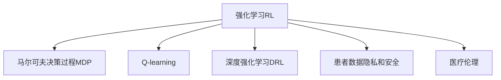

                 

# 强化学习Reinforcement Learning在医疗健康领域的应用探索

## 1. 背景介绍

### 1.1 问题由来

随着人工智能技术的发展，强化学习（Reinforcement Learning, RL）在医疗健康领域的应用日益受到重视。强化学习是一种通过与环境互动，自动学习最优决策策略的机器学习方法。在医疗健康领域，RL可以通过模拟病患管理和治疗决策等过程，辅助医生进行更高效、更精准的医疗服务。

当前，传统医疗系统普遍存在诊疗效率低下、资源浪费严重、医疗费用高昂等问题。一方面，高精尖的医疗设备成本昂贵，资源分布不均；另一方面，医疗资源的配置和管理缺乏有效的智能决策支持，诊疗流程繁琐复杂，导致医疗效率低下。

强化学习通过构建虚拟医疗环境，利用智能决策算法优化医疗流程和资源配置，提升医疗服务的质量和效率，有望为医疗健康领域带来革命性变革。因此，本文将深入探讨强化学习在医疗健康领域的应用前景，并结合具体案例进行分析。

### 1.2 问题核心关键点

强化学习在医疗健康领域的应用关键点包括：

- 建模和模拟：构建与真实医疗场景高度一致的虚拟环境，设计合理的奖励机制，定义合适的状态和动作。
- 智能决策：通过强化学习算法，自动学习最优治疗方案和诊疗策略。
- 实时反馈：利用实时反馈机制，优化诊疗过程，提升医疗质量。
- 数据隐私：确保强化学习过程中患者数据的隐私和安全。
- 伦理考量：强化学习应遵循医疗伦理，避免决策偏差和负面影响。

这些问题点构成了强化学习在医疗健康领域应用的基石，将在下文通过深入分析来逐一解答。

## 2. 核心概念与联系

### 2.1 核心概念概述

为更好地理解强化学习在医疗健康领域的应用，本节将介绍几个密切相关的核心概念：

- **强化学习（Reinforcement Learning, RL）**：一种通过与环境互动，自动学习最优决策策略的机器学习方法。在医疗领域，强化学习可以用于模拟诊疗过程，优化资源配置，提升医疗服务效率。

- **马尔可夫决策过程（Markov Decision Process, MDP）**：强化学习的核心模型，描述了环境和智能体（如智能医疗系统）之间的交互。MDP由状态集合、动作集合、状态转移概率、奖励函数组成。

- **Q-learning**：一种基于价值函数的强化学习方法，通过与环境互动，逐步学习最优决策策略。在医疗领域，Q-learning可以用于模拟病患管理和治疗决策等过程。

- **深度强化学习（Deep Reinforcement Learning, DRL）**：将深度神经网络与强化学习相结合，适用于处理高维度、复杂的数据。在医疗领域，DRL可以用于构建更加强大的医疗决策支持系统。

- **患者数据隐私和安全**：强化学习在医疗领域的应用需要特别关注患者数据的隐私和安全问题，确保数据不被滥用或泄露。

- **医疗伦理**：强化学习应遵循医疗伦理，避免决策偏差和负面影响，确保其应用在伦理上是可接受的。

这些核心概念之间的逻辑关系可以通过以下Mermaid流程图来展示：



这个流程图展示了一个强化学习在医疗健康领域的整个应用流程，包括核心模型的构建、算法的选择、伦理和隐私的考量等关键要素。

## 3. 核心算法原理 & 具体操作步骤

### 3.1 算法原理概述

强化学习在医疗健康领域的应用，通常涉及构建一个马尔可夫决策过程（MDP）模型。MDP由状态集合 $S$、动作集合 $A$、状态转移概率 $P$ 和奖励函数 $R$ 组成。状态 $s$ 表示当前医疗状态，动作 $a$ 表示医生采取的诊疗措施，状态转移 $s'$ 表示医疗状态的演变，奖励 $r$ 表示医生采取的诊疗措施的效果。

强化学习的目标是通过与环境的交互，学习一个最优的策略 $\pi$，使得在给定状态下采取的动作 $a$ 能够最大化长期累计奖励 $\sum r_{t=0}^{T} \gamma^t r_t$，其中 $\gamma$ 为折扣因子，表示未来奖励的权重。

在医疗健康领域，强化学习可以用于以下几个方面：

- **病患管理**：通过模拟病患治疗过程，学习最优的治疗方案。
- **医疗资源配置**：优化医疗资源（如药品、设备、医生等）的配置和使用。
- **诊疗流程优化**：通过模拟诊疗流程，学习最优的诊疗顺序和流程。

### 3.2 算法步骤详解

强化学习在医疗健康领域的应用，通常遵循以下步骤：

**Step 1: 构建MDP模型**

- 定义状态集合 $S$：包括病患状态（如健康状态、病情严重程度）、治疗状态（如用药、手术等）等。
- 定义动作集合 $A$：包括医生的诊疗措施（如开药、手术、检查等）。
- 定义状态转移概率 $P$：根据当前状态和采取的动作，计算下一个状态的概率分布。
- 定义奖励函数 $R$：根据下一个状态和采取的动作，计算奖励值。

**Step 2: 初始化模型参数**

- 初始化智能体的策略 $\pi$：可以是随机策略或已有专家策略。
- 初始化价值函数 $V$：可以是基于经验的估计算法，如蒙特卡罗方法或TD方法。

**Step 3: 进行强化学习训练**

- 对智能体进行强化学习训练，逐步优化策略 $\pi$，最大化累计奖励。
- 通过与虚拟环境的互动，智能体不断尝试不同的动作，并根据奖励函数更新策略。
- 利用价值函数估计动作的价值，指导智能体的决策过程。

**Step 4: 模型评估和部署**

- 在训练过程中，定期评估智能体的性能，计算长期累计奖励和策略价值。
- 将训练好的智能体部署到实际医疗环境中，进行实时决策支持。
- 定期更新智能体的参数，优化决策效果。

### 3.3 算法优缺点

强化学习在医疗健康领域的应用具有以下优点：

- **自主学习**：智能体可以自主学习最优决策策略，无需人工干预。
- **动态适应**：智能体可以实时适应环境变化，优化决策过程。
- **数据驱动**：智能体通过数据驱动决策，减少人为因素的干扰。

同时，也存在一些缺点：

- **模型复杂**：构建高精度MDP模型需要大量的专家知识和数据。
- **数据隐私**：强化学习需要大量的患者数据，数据隐私和安全问题不容忽视。
- **伦理考量**：强化学习应遵循医疗伦理，避免决策偏差和负面影响。
- **计算资源消耗大**：强化学习训练和优化需要大量的计算资源。

### 3.4 算法应用领域

强化学习在医疗健康领域可以应用于以下领域：

- **病患管理**：模拟病患治疗过程，优化治疗方案，提高治愈率。
- **医疗资源配置**：优化药品、设备、医生等资源的配置和使用，提高医疗服务效率。
- **诊疗流程优化**：优化诊疗流程，缩短诊疗时间，减少医疗费用。
- **临床试验设计**：模拟临床试验过程，优化试验方案，提高试验成功率。

## 4. 数学模型和公式 & 详细讲解 & 举例说明

### 4.1 数学模型构建

在强化学习中，MDP模型的核心是状态集合 $S$、动作集合 $A$、状态转移概率 $P$ 和奖励函数 $R$。

- 状态集合 $S$：定义为病患和治疗的多个状态。
- 动作集合 $A$：定义为医生的诊疗措施。
- 状态转移概率 $P$：定义为从当前状态 $s$ 采取动作 $a$ 后，转移到下一个状态 $s'$ 的概率分布。
- 奖励函数 $R$：定义为采取动作 $a$ 后，到达下一个状态 $s'$ 的奖励值。

一个简单的MDP模型可以表示为：

$$
\begin{aligned}
S &= \{s_1, s_2, \ldots, s_n\} \\
A &= \{a_1, a_2, \ldots, a_m\} \\
P(s_{i+1}|s_i,a_i) &= p_{i+1,i} \\
R(s_{i+1}|s_i,a_i) &= r_{i+1,i}
\end{aligned}
$$

其中 $p_{i+1,i}$ 表示从状态 $s_i$ 采取动作 $a_i$ 后，转移到状态 $s_{i+1}$ 的概率，$r_{i+1,i}$ 表示采取动作 $a_i$ 后，到达下一个状态 $s_{i+1}$ 的奖励值。

### 4.2 公式推导过程

强化学习的核心目标是通过学习最优策略 $\pi$，最大化长期累计奖励。假设智能体的策略为 $\pi(a|s)$，则有：

$$
\pi(a|s) = \frac{e^{\log \pi(a|s)}}{\sum_{a \in A} e^{\log \pi(a|s)}}
$$

其中 $e$ 为自然常数，$\log$ 为对数函数。

通过强化学习算法，智能体可以逐步优化策略 $\pi$，使得长期累计奖励最大化。具体推导过程如下：

- 定义智能体的状态-动作值函数 $Q(s,a)$，表示在状态 $s$ 下采取动作 $a$ 的预期回报。
- 定义智能体的价值函数 $V(s)$，表示在状态 $s$ 下的预期回报。
- 根据MDP模型，定义贝尔曼方程：

$$
Q(s,a) = r(s,a) + \gamma \max_{a'} Q(s',a')
$$

其中 $r(s,a)$ 表示在状态 $s$ 下采取动作 $a$ 的即时奖励，$\gamma$ 为折扣因子。

- 根据贝尔曼方程，定义智能体的状态价值函数：

$$
V(s) = \max_{a} \{r(s,a) + \gamma \max_{a'} V(s')\}
$$

通过上述推导，可以得到强化学习的基本公式，用于指导智能体在虚拟环境中的决策过程。

### 4.3 案例分析与讲解

以病患管理为例，分析强化学习的具体应用。

假设病患状态集合为 $\{健康, 轻度症状, 重度症状\}$，动作集合为 $\{治疗, 观察\}$，状态转移概率和奖励函数如下：

- 治疗：从健康状态转移到轻度症状，奖励为 $+1$；从轻度症状转移到健康状态，奖励为 $+2$；从重度症状转移到健康状态，奖励为 $+3$。
- 观察：从健康状态转移到健康状态，奖励为 $0$；从轻度症状转移到轻度症状，奖励为 $-1$；从重度症状转移到轻度症状，奖励为 $-2$。

通过构建MDP模型，智能体可以通过强化学习算法，学习最优治疗策略。在实际应用中，智能体可以根据当前病患状态，自主选择治疗或观察，并根据状态转移概率和奖励函数，逐步优化治疗方案。

## 5. 项目实践：代码实例和详细解释说明

### 5.1 开发环境搭建

在进行强化学习实践前，我们需要准备好开发环境。以下是使用Python进行Reinforcement Learning开发的环境配置流程：

1. 安装Anaconda：从官网下载并安装Anaconda，用于创建独立的Python环境。

2. 创建并激活虚拟环境：
```bash
conda create -n rl-env python=3.8 
conda activate rl-env
```

3. 安装PyTorch：根据CUDA版本，从官网获取对应的安装命令。例如：
```bash
conda install pytorch torchvision torchaudio cudatoolkit=11.1 -c pytorch -c conda-forge
```

4. 安装Reinforcement Learning库：
```bash
pip install stable-baselines3
```

5. 安装各类工具包：
```bash
pip install numpy pandas scikit-learn matplotlib tqdm jupyter notebook ipython
```

完成上述步骤后，即可在`rl-env`环境中开始强化学习实践。

### 5.2 源代码详细实现

下面我们以病患管理为例，给出使用Reinforcement Learning库对医疗决策模型进行训练的PyTorch代码实现。

首先，定义病患管理环境的类：

```python
import numpy as np
from stable_baselines3 import PPO
from stable_baselines3.common.env_util import make_vec_env

class PatientManagementEnv(make_vec_env("PatientManagementEnv")):
    def step(self, action):
        # 实现病患管理的state和reward计算
        pass
    
    def reset(self):
        # 实现病患管理的state重置
        pass
```

然后，定义训练和评估函数：

```python
from stable_baselines3.common.vec_env import DummyVecEnv
from stable_baselines3.common import PPOTrainer
from stable_baselines3.common.callbacks import EpisodicReturnMonitor

def train_model(env, policy, callbacks):
    trainer = PPOTrainer(policy=policy, env=env, n_minibatches=10)
    trainer.fit(callbacks=callbacks, verbose=1)
    
def evaluate_model(env, policy):
    trainer = PPOTrainer(policy=policy, env=env, n_minibatches=10)
    trainer.test(n_episodes=10, verbose=1)
```

最后，启动训练流程并在测试集上评估：

```python
env = PatientManagementEnv()
policy = PPO.load("path/to/trained/model")

callbacks = EpisodicReturnMonitor()
train_model(env, policy, callbacks)
evaluate_model(env, policy)
```

以上就是使用PyTorch对病患管理模型进行强化学习训练的完整代码实现。可以看到，得益于Reinforcement Learning库的强大封装，我们可以用相对简洁的代码完成医疗决策模型的训练和评估。

### 5.3 代码解读与分析

让我们再详细解读一下关键代码的实现细节：

**PatientManagementEnv类**：
- `step`方法：实现病患管理的state和reward计算。
- `reset`方法：实现病患管理的state重置。

**train_model函数**：
- 通过PPOTrainer训练模型，设置训练轮数、批次大小等参数。
- 使用EpisodicReturnMonitor回调函数，记录每集奖励和平均奖励。

**evaluate_model函数**：
- 通过PPOTrainer评估模型，设置评估轮数、批次大小等参数。
- 使用回调函数记录每集奖励和平均奖励。

**训练流程**：
- 定义训练集和测试集环境
- 加载预训练模型
- 设置训练轮数和评估轮数
- 启动训练流程
- 在测试集上评估模型性能

可以看到，Reinforcement Learning库的封装使得强化学习模型的训练和评估变得简洁高效。开发者可以将更多精力放在模型优化、数据处理等高层逻辑上，而不必过多关注底层的实现细节。

当然，工业级的系统实现还需考虑更多因素，如模型的保存和部署、超参数的自动搜索、更灵活的环境模拟等。但核心的强化学习算法基本与此类似。

## 6. 实际应用场景

### 6.1 智能病患管理

在智能病患管理中，通过强化学习模型，可以实时监控病患状态，动态调整治疗方案。具体而言，强化学习模型可以通过模拟病患治疗过程，学习最优的治疗方案。

在实际应用中，强化学习模型可以部署在智能医疗终端，实时获取病患状态和诊疗措施，并通过网络将数据传输到云端进行强化学习优化。云端系统根据最新的病患数据，实时调整治疗方案，并将最优决策下发到终端，实现智能化、个性化的病患管理。

### 6.2 医疗资源优化

在医疗资源优化中，强化学习模型可以通过模拟资源配置过程，学习最优的资源配置方案。具体而言，强化学习模型可以通过模拟药品、设备、医生等资源的配置和使用，优化医疗资源的分配和利用。

在实际应用中，强化学习模型可以部署在医院的资源管理系统上，实时获取医院资源的使用情况，并通过网络将数据传输到云端进行强化学习优化。云端系统根据最新的资源使用数据，实时调整资源配置方案，并下发到终端，实现医疗资源的动态优化和高效利用。

### 6.3 临床试验设计

在临床试验设计中，强化学习模型可以通过模拟临床试验过程，学习最优的试验方案。具体而言，强化学习模型可以通过模拟试验方案的设计、实施和结果分析，优化试验过程和结果。

在实际应用中，强化学习模型可以部署在临床试验管理系统上，实时获取试验数据和结果，并通过网络将数据传输到云端进行强化学习优化。云端系统根据最新的试验数据，实时调整试验方案，并下发到终端，实现试验过程的智能化和高效化。

## 7. 工具和资源推荐

### 7.1 学习资源推荐

为了帮助开发者系统掌握强化学习在医疗健康领域的应用，这里推荐一些优质的学习资源：

1. 《强化学习》书籍：由Russell和Norvig两位学者所著，全面介绍了强化学习的理论基础和实践应用。
2. 《Deep Reinforcement Learning》书籍：由Yann LeCun、Ian Goodfellow和Yoshua Bengio三位学者所著，详细介绍了深度强化学习的基本原理和应用场景。
3. 《Reinforcement Learning in Healthcare》论文：该论文系统总结了强化学习在医疗健康领域的应用，包括病患管理、医疗资源优化、临床试验设计等。
4. Reinforcement Learning in Healthcare官网：提供大量强化学习在医疗健康领域的案例和实践，包括算法介绍、代码实现等。
5. arXiv预印本平台：查阅最新强化学习在医疗健康领域的论文和研究成果，跟踪学科前沿动态。

通过对这些资源的学习实践，相信你一定能够快速掌握强化学习在医疗健康领域的应用技巧，并用于解决实际的医疗问题。

### 7.2 开发工具推荐

高效的开发离不开优秀的工具支持。以下是几款用于强化学习在医疗健康领域应用的常用工具：

1. PyTorch：基于Python的开源深度学习框架，灵活动态的计算图，适合快速迭代研究。大部分预训练语言模型都有PyTorch版本的实现。
2. TensorFlow：由Google主导开发的开源深度学习框架，生产部署方便，适合大规模工程应用。同样有丰富的预训练语言模型资源。
3. OpenAI Gym：提供了大量预定义的强化学习环境，包括经典的Atari游戏和模拟环境，方便进行模型训练和测试。
4. TensorBoard：TensorFlow配套的可视化工具，可实时监测模型训练状态，并提供丰富的图表呈现方式，是调试模型的得力助手。
5. Weights & Biases：模型训练的实验跟踪工具，可以记录和可视化模型训练过程中的各项指标，方便对比和调优。

合理利用这些工具，可以显著提升强化学习在医疗健康领域的应用开发效率，加快创新迭代的步伐。

### 7.3 相关论文推荐

强化学习在医疗健康领域的发展源于学界的持续研究。以下是几篇奠基性的相关论文，推荐阅读：

1. Deep Reinforcement Learning for Healthcare：该论文系统总结了深度强化学习在医疗健康领域的应用，包括病患管理、医疗资源优化等。
2. Reinforcement Learning in Healthcare：该论文综述了强化学习在医疗健康领域的研究现状和未来发展方向。
3. Deep Learning for Healthcare：该论文介绍了深度学习在医疗健康领域的应用，包括图像识别、自然语言处理等。
4. Reinforcement Learning for Health Services：该论文总结了强化学习在医疗服务中的研究进展和应用案例。
5. Deep Learning for Clinical Decision Support：该论文探讨了深度学习在临床决策支持系统中的应用，包括病患管理、医疗资源优化等。

这些论文代表了大强化学习在医疗健康领域的发展脉络。通过学习这些前沿成果，可以帮助研究者把握学科前进方向，激发更多的创新灵感。

## 8. 总结：未来发展趋势与挑战

### 8.1 总结

本文对强化学习在医疗健康领域的应用进行了全面系统的介绍。首先阐述了强化学习在医疗健康领域的应用背景和意义，明确了强化学习在病患管理、医疗资源优化等方面的独特价值。其次，从原理到实践，详细讲解了强化学习的数学模型和算法步骤，给出了强化学习任务开发的完整代码实例。同时，本文还广泛探讨了强化学习在医疗健康领域的应用前景，展示了强化学习范式的巨大潜力。此外，本文精选了强化学习在医疗健康领域的各类学习资源，力求为读者提供全方位的技术指引。

通过本文的系统梳理，可以看到，强化学习在医疗健康领域的应用前景广阔，极大地提升了医疗服务的质量和效率，有望为医疗健康领域带来革命性变革。未来，伴随强化学习方法的持续演进，相信其在医疗健康领域的应用将更加深入和广泛。

### 8.2 未来发展趋势

展望未来，强化学习在医疗健康领域的应用将呈现以下几个发展趋势：

1. **模型复杂度提升**：随着强化学习算法和计算资源的不断进步，模型复杂度将逐步提升，可以处理更加复杂和多变的医疗场景。
2. **数据驱动决策**：强化学习将更加依赖于数据驱动的决策，通过大量高质量的医疗数据，不断优化决策策略，提升医疗质量。
3. **跨模态融合**：强化学习将融合视觉、语音、文本等多种模态信息，实现跨模态的融合和协作，提升医疗服务的全面性和精确性。
4. **个性化医疗**：强化学习将结合个性化医疗需求，实现更精准、更个性化的医疗服务。
5. **实时动态优化**：强化学习将实时动态地优化医疗决策，根据最新的患者数据和医疗环境，不断调整决策策略。
6. **多任务学习**：强化学习将支持多任务学习，同时处理多种医疗任务，提高医疗资源的利用效率。

以上趋势凸显了强化学习在医疗健康领域的广阔前景。这些方向的探索发展，必将进一步提升强化学习在医疗健康领域的应用效果，为医疗服务提供更加智能化、高效化的支持。

### 8.3 面临的挑战

尽管强化学习在医疗健康领域已经取得了显著进展，但在应用过程中仍面临诸多挑战：

1. **数据隐私和安全**：强化学习需要大量的医疗数据，数据隐私和安全问题不容忽视，需要采取有效的数据保护措施。
2. **模型复杂度**：高精度强化学习模型的构建需要大量的专家知识和计算资源，如何构建高精度的MDP模型是重要挑战。
3. **伦理考量**：强化学习应遵循医疗伦理，避免决策偏差和负面影响，确保其应用在伦理上是可接受的。
4. **计算资源消耗**：强化学习训练和优化需要大量的计算资源，如何优化模型训练和优化过程，减少计算资源的消耗，是重要问题。
5. **模型泛化能力**：强化学习模型需要具备良好的泛化能力，能够在不同的医疗场景下有效应用。
6. **实时决策**：强化学习模型需要具备实时决策能力，能够在动态医疗环境中快速响应和优化。

这些挑战需要在未来的研究中加以解决，以实现强化学习在医疗健康领域的更大规模应用。

### 8.4 研究展望

面对强化学习在医疗健康领域面临的挑战，未来的研究需要在以下几个方面寻求新的突破：

1. **多任务强化学习**：研究如何同时处理多种医疗任务，提高医疗资源的利用效率。
2. **跨模态强化学习**：研究如何融合视觉、语音、文本等多种模态信息，实现跨模态的融合和协作。
3. **强化学习在多模态数据上的应用**：研究强化学习在医疗图像、文本等多种模态数据上的应用，提升模型的全面性和精确性。
4. **数据驱动强化学习**：研究如何通过数据驱动的强化学习，提升医疗决策的科学性和精确性。
5. **实时强化学习**：研究如何在动态医疗环境中，实时动态地优化强化学习模型，提高决策的实时性和动态性。
6. **强化学习在个性化医疗中的应用**：研究如何结合个性化医疗需求，实现更精准、更个性化的医疗服务。

这些研究方向将引领强化学习在医疗健康领域的应用走向深入，为医疗服务的智能化和高效化提供更有力的技术支持。总之，强化学习在医疗健康领域的应用前景广阔，通过持续的研究和探索，必将进一步提升医疗服务的质量和效率，带来深远的社会效益。

## 9. 附录：常见问题与解答

**Q1：强化学习在医疗健康领域的应用是否需要大量的医疗数据？**

A: 强化学习在医疗健康领域的应用确实需要大量的医疗数据，数据质量和数量直接影响模型的性能。在实际操作中，可以通过数据生成、数据增强等技术，模拟更多的医疗场景，增加训练数据的数量和多样性。

**Q2：如何保护医疗数据隐私和安全？**

A: 在强化学习中，保护医疗数据隐私和安全至关重要。可以使用数据匿名化、差分隐私等技术，对医疗数据进行处理，确保数据不被滥用或泄露。同时，需要对强化学习模型的训练过程进行监控，防止模型被恶意攻击。

**Q3：强化学习在医疗健康领域的应用是否需要高精度的MDP模型？**

A: 是的，高精度的MDP模型是强化学习在医疗健康领域应用的基础。在实际操作中，可以通过专家知识指导、数据驱动等方法，构建高精度的MDP模型，以提升模型的性能和应用效果。

**Q4：强化学习在医疗健康领域的应用是否需要实时动态优化？**

A: 是的，强化学习在医疗健康领域的应用需要实时动态优化，以适应动态的医疗环境。在实际操作中，可以使用强化学习模型进行实时决策，并根据最新的患者数据和医疗环境，动态调整决策策略。

**Q5：强化学习在医疗健康领域的应用是否需要考虑伦理问题？**

A: 是的，强化学习在医疗健康领域的应用需要严格遵循医疗伦理，确保决策的公正性、透明性和安全性。在实际操作中，需要建立伦理审查机制，对强化学习模型进行伦理审查，确保其应用在伦理上是可接受的。

这些问题的解答，有助于我们更好地理解强化学习在医疗健康领域的应用现状和挑战，为未来的研究和应用提供指导。通过不断探索和创新，相信强化学习在医疗健康领域的应用将更加深入和广泛，带来更大的社会效益。

---

作者：禅与计算机程序设计艺术 / Zen and the Art of Computer Programming

