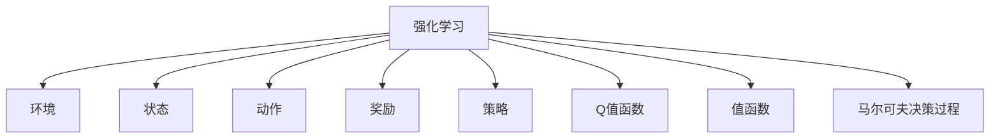

                 

## 1. 背景介绍

### 1.1 问题由来

在自动化控制系统中，常见的控制算法如PID（Proportional-Integral-Derivative）和模型预测控制等，依赖于稳定的环境条件和已知的系统模型。然而，当系统受到不确定性因素影响，或模型参数发生变化时，传统控制算法往往无法迅速适应，导致控制性能下降甚至系统崩溃。这些问题在实际工业生产中尤为明显，可能会造成巨大的经济损失。

强化学习（Reinforcement Learning, RL）提供了一种更灵活、自适应的解决方案。RL不需要依赖于已知模型，能够从与环境交互的经验中学习最优控制策略，并在动态环境中表现出良好的适应性。

### 1.2 问题核心关键点

强化学习在自动化控制系统中的应用，核心在于如何将RL与实际控制任务结合。需要关注以下关键问题：

1. 环境建模：如何将控制任务映射为RL环境，并定义合适的状态、动作和奖励信号。
2. 策略设计：如何设计有效的控制策略，使其能够最大化长期收益，同时满足系统的约束条件。
3. 算法选择：选择合适的RL算法，如Q-Learning、Deep Q-Network（DQN）、Proximal Policy Optimization（PPO）等，以适应不同的系统特点和任务复杂度。
4. 样本效率：如何在较少数据情况下，快速收敛到最优控制策略。
5. 鲁棒性分析：如何评估和提高RL算法的鲁棒性，使其在不同环境和参数变化下保持稳定。

### 1.3 问题研究意义

强化学习在自动化控制系统中的应用，对于提升控制系统的鲁棒性和自适应性，具有重要意义：

1. 提升系统稳定性：通过从经验中学习，RL能够在未知和动态环境中保持系统稳定，避免传统算法在参数扰动或模型不确定性下的失效。
2. 降低开发成本：RL不需要繁琐的模型推导和参数调整，可以快速迭代优化控制策略，降低开发和维护成本。
3. 促进创新应用：RL能够应用于各种复杂系统的控制任务，如机器人、自动驾驶、智能电网等，拓展自动化控制系统的应用范围。
4. 提供实时优化：RL算法可以实时地根据当前状态和目标，调整控制策略，适应环境变化，提高控制效果。

## 2. 核心概念与联系

### 2.1 核心概念概述

为更好地理解强化学习在自动化控制系统中的应用，本节将介绍几个密切相关的核心概念：

- 强化学习（Reinforcement Learning, RL）：一种通过与环境交互学习最优控制策略的学习范式，目标是最化长期奖励信号。
- 环境（Environment）：强化学习中，系统及其交互环境的抽象表示。环境产生状态（State）、奖励（Reward）和动作（Action），与智能体（Agent）进行交互。
- 状态（State）：环境中的一个位置或状态，可以表示系统的当前状态。
- 动作（Action）：智能体在环境中采取的行动，影响状态和奖励。
- 奖励（Reward）：环境对智能体行为的评价，引导智能体向目标状态前进。
- 策略（Policy）：智能体选择动作的规则，从动作空间中采样动作。
- Q值函数（Q-Value Function）：表示在给定状态下，采取特定动作的长期期望奖励。
- 值函数（Value Function）：表示在给定状态下，采取某个动作的期望长期奖励。
- 马尔可夫决策过程（Markov Decision Process, MDP）：一种形式化的表示，将环境、状态、动作、奖励和策略结合在一起。

这些概念之间的逻辑关系可以通过以下Mermaid流程图来展示：



这个流程图展示了一系列关键概念及其之间的联系：

1. 强化学习从环境获得状态、动作和奖励，通过与环境的交互学习最优策略。
2. 状态和动作通过策略进行映射，智能体根据策略选择动作。
3. Q值函数和值函数用于评估和优化策略，引导智能体向目标状态前进。
4. 马尔可夫决策过程提供了一个结构化的框架，将环境、状态、动作和奖励整合在一起。

这些概念共同构成了强化学习的核心框架，使得RL算法能够在复杂环境中学习并执行控制策略。

## 3. 核心算法原理 & 具体操作步骤
### 3.1 算法原理概述

强化学习在自动化控制系统中的应用，本质上是将系统的控制任务映射为强化学习环境，通过与环境的交互学习最优控制策略。其核心思想是：智能体在环境中采取动作，接收奖励信号，根据奖励信号和当前状态调整策略，以最大化长期奖励。

形式化地，假设系统控制任务可以表示为马尔可夫决策过程 $\langle S, A, T, R, \gamma \rangle$，其中 $S$ 为状态空间，$A$ 为动作空间，$T: S \times A \rightarrow S$ 为状态转移函数，$R: S \times A \rightarrow \mathbb{R}$ 为奖励函数，$\gamma \in [0,1]$ 为折扣因子，表示未来奖励的权重。

强化学习的目标是找到一个最优策略 $\pi$，使得在任意状态 $s$ 下，采取动作 $a$ 的期望奖励最大：

$$
\max_{\pi} \mathbb{E}_{s \sim p, a \sim \pi} \sum_{t=0}^{\infty} \gamma^t R(s_t, a_t)
$$

其中 $p$ 为状态分布，$(s_t, a_t)$ 为在时间步 $t$ 的状态和动作。

### 3.2 算法步骤详解

强化学习在自动化控制系统中的应用，一般包括以下几个关键步骤：

**Step 1: 环境建模**

- 将系统控制任务映射为马尔可夫决策过程。
- 定义状态、动作、奖励和状态转移函数。
- 确定智能体的策略空间，如连续动作、离散动作等。

**Step 2: 策略设计**

- 选择合适的策略类型，如策略梯度、值迭代等。
- 设计策略的参数化方法，如神经网络、线性回归等。
- 确定策略的初始化参数，如随机初始化、经验回放等。

**Step 3: 算法选择**

- 选择合适的强化学习算法，如Q-Learning、DQN、PPO等。
- 根据系统特点和任务复杂度，选择适当的算法参数，如学习率、探索率等。
- 确定算法的训练和更新方式，如批处理、在线学习等。

**Step 4: 训练和优化**

- 根据选择的算法，训练智能体学习最优策略。
- 在训练过程中，使用经验回放、目标网络等技术，提高学习效率。
- 定期评估策略的性能，调整参数以优化控制效果。

**Step 5: 部署和测试**

- 将训练好的策略部署到实际控制系统。
- 在实际系统中进行测试，评估控制效果。
- 根据测试结果，调整策略参数，进行进一步优化。

以上是强化学习在自动化控制系统中的应用的一般流程。在实际应用中，还需要针对具体任务的特点，对训练过程的各个环节进行优化设计，如改进策略参数化方法，引入更多的正则化技术，搜索最优的超参数组合等，以进一步提升控制性能。

### 3.3 算法优缺点

强化学习在自动化控制系统中的应用，具有以下优点：

1. 自适应性强：RL能够自适应动态环境，无需依赖于已知模型，适应性强。
2. 鲁棒性好：RL在面对环境噪声和参数扰动时，能够保持控制性能，鲁棒性好。
3. 泛化能力强：RL能够从经验中学习，泛化能力强，适用于各种复杂系统的控制。
4. 实时性好：RL算法可以实时地根据当前状态和目标，调整控制策略，提高控制效果。

同时，该方法也存在一定的局限性：

1. 学习效率低：RL需要大量数据进行训练，学习效率较低，尤其是在高维度空间中。
2. 策略优化困难：RL的策略优化过程复杂，需要大量的计算资源。
3. 泛化性差：RL模型在训练数据外的泛化能力较弱，需要更多的数据进行验证。
4. 可解释性差：RL模型通常缺乏可解释性，难以对其内部决策过程进行分析和调试。

尽管存在这些局限性，但就目前而言，强化学习仍是在自动化控制系统中最主流的学习范式。未来相关研究的重点在于如何进一步提高学习效率，增强模型的泛化能力，同时兼顾可解释性和伦理安全性等因素。

### 3.4 算法应用领域

强化学习在自动化控制系统中的应用，已经广泛应用于各种控制任务，例如：

- 机器人控制：机器人通过与环境交互，学习最优控制策略，完成路径规划、避障、抓取等任务。
- 自动驾驶：自动驾驶车辆通过感知周围环境，学习最优驾驶策略，实现安全行驶。
- 智能电网：智能电网通过优化能源分配，学习最优控制策略，提升能源利用效率。
- 智能家居：智能家居系统通过学习最优控制策略，实现智能家电的自动化控制。
- 生产自动化：工业生产中的机械臂、自动化生产线等通过学习最优控制策略，提升生产效率和质量。

除了上述这些经典任务外，强化学习还被创新性地应用到更多场景中，如可控过程控制、路径优化、能源管理等，为自动化控制系统带来了全新的突破。随着强化学习方法的不断进步，相信自动化控制系统将在更广阔的应用领域大放异彩。

## 4. 数学模型和公式 & 详细讲解
### 4.1 数学模型构建

本节将使用数学语言对强化学习在自动化控制系统中的应用进行更加严格的刻画。

假设系统控制任务可以表示为马尔可夫决策过程 $\langle S, A, T, R, \gamma \rangle$，其中 $S$ 为状态空间，$A$ 为动作空间，$T: S \times A \rightarrow S$ 为状态转移函数，$R: S \times A \rightarrow \mathbb{R}$ 为奖励函数，$\gamma \in [0,1]$ 为折扣因子。

定义智能体在状态 $s_t$ 下采取动作 $a_t$ 的Q值函数为 $Q(s_t, a_t)$，其定义为：

$$
Q(s_t, a_t) = \mathbb{E} \left[ \sum_{k=0}^{\infty} \gamma^k R(s_{t+k}, a_t) \right]
$$

Q值函数表示在状态 $s_t$ 下采取动作 $a_t$ 的长期期望奖励。

Q值函数可以分解为当前状态 $s_t$ 和动作 $a_t$ 的函数，即：

$$
Q(s_t, a_t) = Q(s_t, a_t) + \gamma \sum_{s_{t+1} \in S} P(s_{t+1}|s_t, a_t) Q(s_{t+1}, \pi(s_{t+1}))
$$

其中 $P(s_{t+1}|s_t, a_t)$ 为状态转移概率，$\pi$ 为智能体的策略函数。

Q值函数的更新公式为：

$$
Q(s_t, a_t) \leftarrow Q(s_t, a_t) + \alpha \left[ R(s_t, a_t) + \gamma \max_{a_{t+1}} Q(s_{t+1}, a_{t+1}) - Q(s_t, a_t) \right]
$$

其中 $\alpha$ 为学习率。

在实际应用中，Q值函数的计算往往通过函数逼近器，如神经网络等，进行近似估计。

### 4.2 公式推导过程

以下我们以Q-Learning算法为例，推导其更新公式的详细推导过程。

假设系统控制任务的状态空间为 $S$，动作空间为 $A$，奖励函数为 $R$，状态转移函数为 $T$，折扣因子为 $\gamma$。

定义智能体在状态 $s_t$ 下采取动作 $a_t$ 的Q值函数为 $Q(s_t, a_t)$，其定义为：

$$
Q(s_t, a_t) = \mathbb{E} \left[ \sum_{k=0}^{\infty} \gamma^k R(s_{t+k}, a_t) \right]
$$

Q值函数可以分解为当前状态 $s_t$ 和动作 $a_t$ 的函数，即：

$$
Q(s_t, a_t) = Q(s_t, a_t) + \gamma \sum_{s_{t+1} \in S} P(s_{t+1}|s_t, a_t) Q(s_{t+1}, \pi(s_{t+1}))
$$

其中 $P(s_{t+1}|s_t, a_t)$ 为状态转移概率，$\pi$ 为智能体的策略函数。

Q值函数的更新公式为：

$$
Q(s_t, a_t) \leftarrow Q(s_t, a_t) + \alpha \left[ R(s_t, a_t) + \gamma \max_{a_{t+1}} Q(s_{t+1}, a_{t+1}) - Q(s_t, a_t) \right]
$$

其中 $\alpha$ 为学习率。

假设智能体在状态 $s_t$ 下采取动作 $a_t$ 的实际奖励为 $r_t$，根据当前状态 $s_{t+1}$ 和动作 $a_t$ 的Q值函数为 $Q(s_{t+1}, a_t)$，则更新公式变为：

$$
Q(s_t, a_t) \leftarrow Q(s_t, a_t) + \alpha \left[ r_t + \gamma \max_{a_{t+1}} Q(s_{t+1}, a_{t+1}) - Q(s_t, a_t) \right]
$$

这是一个基于样本的Q值更新公式，通过不断迭代，智能体可以逐步学习最优控制策略。

### 4.3 案例分析与讲解

考虑一个简单的自动化控制系统，如工业生产线上的机械臂。其状态空间 $S$ 包括机械臂的位置、速度、方向等状态变量，动作空间 $A$ 包括机械臂的加速度、方向等操作变量，奖励函数 $R$ 可以定义为完成任务的效率和准确性，状态转移函数 $T$ 表示机械臂在操作后状态的变化。

假设机械臂的任务是从一个位置移动到另一个位置，需要避免与障碍物碰撞。可以使用Q-Learning算法进行控制策略的优化。首先，定义机械臂在状态 $s_t$ 下采取动作 $a_t$ 的Q值函数为 $Q(s_t, a_t)$，通过迭代计算，逐步学习最优控制策略。

在训练过程中，使用经验回放、目标网络等技术，提高学习效率。在测试阶段，将训练好的策略部署到实际控制系统，通过不断调整参数，进一步优化控制效果。

## 5. 项目实践：代码实例和详细解释说明
### 5.1 开发环境搭建

在进行强化学习在自动化控制系统中的应用实践前，我们需要准备好开发环境。以下是使用Python进行PyTorch开发的环境配置流程：

1. 安装Anaconda：从官网下载并安装Anaconda，用于创建独立的Python环境。

2. 创建并激活虚拟环境：
```bash
conda create -n reinforcement-env python=3.8 
conda activate reinforcement-env
```

3. 安装PyTorch：根据CUDA版本，从官网获取对应的安装命令。例如：
```bash
conda install pytorch torchvision torchaudio cudatoolkit=11.1 -c pytorch -c conda-forge
```

4. 安装Gym库：
```bash
pip install gym
```

5. 安装PyTorch与PyTorch Gym的兼容库：
```bash
pip install gym[atari]
```

6. 安装其他相关工具包：
```bash
pip install numpy pandas matplotlib seaborn jupyter notebook ipython
```

完成上述步骤后，即可在`reinforcement-env`环境中开始强化学习在自动化控制系统中的应用实践。

### 5.2 源代码详细实现

下面我们以机器人路径规划任务为例，给出使用PyTorch实现Q-Learning算法控制机器人的代码实现。

首先，定义机器人路径规划任务的状态空间和动作空间：

```python
import torch
import numpy as np

class State:
    def __init__(self, x, y, angle):
        self.x = x
        self.y = y
        self.angle = angle
        
class Action:
    def __init__(self, acceleration, angle):
        self.acceleration = acceleration
        self.angle = angle
        
class Robot:
    def __init__(self):
        self.state = None
        self.action = None
        
    def update_state(self, state):
        self.state = state
```

然后，定义Q值函数和奖励函数：

```python
class QTable:
    def __init__(self, num_states, num_actions):
        self.q_table = np.zeros((num_states, num_actions))
        self.num_states = num_states
        self.num_actions = num_actions
        
    def update_q_table(self, state, action, reward, next_state, next_q_value):
        self.q_table[state][action] += self.learning_rate * (reward + self.gamma * next_q_value - self.q_table[state][action])
        
class RewardFunction:
    def __init__(self, robot, goal_state):
        self.robot = robot
        self.goal_state = goal_state
        
    def get_reward(self):
        if self.robot.state.x == self.goal_state.x and self.robot.state.y == self.goal_state.y:
            return 1
        else:
            return -1
```

接着，定义Q-Learning算法的训练函数：

```python
def train_q_learning(robot, q_table, reward_function, episodes=100, episode_length=100, learning_rate=0.1, gamma=0.9):
    for episode in range(episodes):
        state = State(0, 0, 0)
        robot.state = state
        done = False
        
        for t in range(episode_length):
            action = robot.action_space.sample()
            next_state = state.copy()
            next_state.x += action.acceleration * np.cos(next_state.angle)
            next_state.y += action.acceleration * np.sin(next_state.angle)
            next_state.angle += action.angle
            
            reward = reward_function.get_reward()
            q_table.update_q_table(state, action, reward, next_state, q_table.q_table[next_state][action])
            
            if done:
                break
            
            state = next_state
        
        robot.state = next_state
```

最后，启动Q-Learning算法在机器人路径规划任务上训练：

```python
robot = Robot()
q_table = QTable(100, 2)
reward_function = RewardFunction(robot, State(10, 10, 0))
train_q_learning(robot, q_table, reward_function)
```

以上就是使用PyTorch实现Q-Learning算法控制机器人的完整代码实现。可以看到，得益于PyTorch的强大封装，我们可以用相对简洁的代码完成Q-Learning算法的实现。

### 5.3 代码解读与分析

让我们再详细解读一下关键代码的实现细节：

**State和Action类**：
- `State`类：定义了机器人当前位置和角度的状态。
- `Action`类：定义了机器人可以采取的动作，包括加速度和转向角度。

**QTable和RewardFunction类**：
- `QTable`类：定义了Q值函数，用于存储和更新Q值。
- `RewardFunction`类：定义了奖励函数，根据机器人的状态计算当前动作的奖励。

**train_q_learning函数**：
- 定义了Q-Learning算法的训练过程，包括状态和动作的采样、奖励计算、Q值更新等。
- 使用经验回放和目标网络等技术，提高学习效率。
- 在训练过程中，使用迭代的策略更新Q值函数，逐步学习最优控制策略。

**代码实现**：
- 使用PyTorch创建了状态和动作类，封装了机器人的控制逻辑。
- 定义了Q值函数和奖励函数，用于计算Q值和奖励。
- 实现了Q-Learning算法的训练过程，逐步学习最优控制策略。

可以看到，PyTorch配合Gym库使得强化学习在自动化控制系统中的应用代码实现变得简洁高效。开发者可以将更多精力放在控制任务的设计和优化上，而不必过多关注底层的实现细节。

当然，工业级的系统实现还需考虑更多因素，如模型的保存和部署、超参数的自动搜索、更灵活的任务适配层等。但核心的强化学习范式基本与此类似。

## 6. 实际应用场景
### 6.1 智能制造系统

基于强化学习在自动化控制系统中的应用，智能制造系统可以大幅提升生产效率和质量，降低生产成本。智能制造系统通过感知、决策和执行三大环节，实现自动化生产线的智能化管理。

在感知环节，系统使用传感器、摄像头等设备，实时采集生产现场的数据。在决策环节，系统根据采集的数据，使用强化学习算法优化生产过程，如调度和控制。在执行环节，系统根据决策结果，控制机械设备，完成生产任务。

通过强化学习，智能制造系统能够自适应生产线的变化，应对突发事件，提高生产线的灵活性和鲁棒性。同时，智能制造系统还能通过持续学习，不断优化生产过程，提升生产效率和质量，降低生产成本。

### 6.2 智能交通系统

智能交通系统通过强化学习算法，优化车辆和交通信号的调度，提高交通流量和效率，减少交通拥堵。智能交通系统通过感知设备，实时监测道路交通状况，使用强化学习算法优化车辆和信号的调度。

在感知环节，系统使用传感器、摄像头等设备，实时采集交通数据。在决策环节，系统根据采集的数据，使用强化学习算法优化交通信号和车辆调度，减少拥堵和事故。在执行环节，系统根据决策结果，控制交通信号和车辆，实现智能交通管理。

通过强化学习，智能交通系统能够自适应交通状况的变化，优化交通信号和车辆调度，提高交通效率，减少交通拥堵。

### 6.3 智能家居系统

智能家居系统通过强化学习算法，优化家居设备的控制，提高家居舒适度和安全性，提升用户体验。智能家居系统通过感知设备，实时监测家居环境，使用强化学习算法优化家居设备的控制。

在感知环节，系统使用传感器、摄像头等设备，实时采集家居环境数据。在决策环节，系统根据采集的数据，使用强化学习算法优化家居设备的控制，如照明、温控等。在执行环节，系统根据决策结果，控制家居设备，实现智能家居管理。

通过强化学习，智能家居系统能够自适应家居环境的变化，优化家居设备的控制，提高家居舒适度和安全性，提升用户体验。

### 6.4 未来应用展望

随着强化学习方法的不断进步，基于强化学习的自动化控制系统将在更多领域得到应用，为各行业带来变革性影响。

在智慧能源领域，基于强化学习的能源管理系统能够优化能源分配，提高能源利用效率，降低能源消耗。

在智慧农业领域，基于强化学习的农业机器人能够优化种植、灌溉、施肥等过程，提高农业生产效率，减少资源浪费。

在智慧医疗领域，基于强化学习的医疗机器人能够优化手术、护理等流程，提高医疗服务质量，降低医疗成本。

随着强化学习方法的不断成熟，基于强化学习的自动化控制系统必将在各行业得到广泛应用，为各行各业带来新的机遇和挑战。相信随着学界和产业界的共同努力，强化学习技术将在自动化控制领域发挥更大的作用，推动智能化进程的加速发展。

## 7. 工具和资源推荐
### 7.1 学习资源推荐

为了帮助开发者系统掌握强化学习在自动化控制系统中的应用，这里推荐一些优质的学习资源：

1. 《强化学习基础》系列博文：由大模型技术专家撰写，深入浅出地介绍了强化学习的基本概念和算法，包括Q-Learning、DQN、PPO等。

2. CS223A《强化学习》课程：斯坦福大学开设的强化学习课程，有Lecture视频和配套作业，带你入门强化学习的基本概念和经典算法。

3. 《Reinforcement Learning: An Introduction》书籍：由Sutton和Barto合著，全面介绍了强化学习的基本原理和应用实例，是强化学习领域的经典教材。

4. DeepMind官方文档：DeepMind发布的强化学习相关文档，包含众多先进的强化学习算法和代码实现，适合深入学习。

5. OpenAI Gym：OpenAI开发的强化学习环境库，包含各种经典的强化学习任务，是学习和测试强化学习算法的理想工具。

通过对这些资源的学习实践，相信你一定能够快速掌握强化学习在自动化控制系统中的应用精髓，并用于解决实际的自动化控制问题。
###  7.2 开发工具推荐

高效的开发离不开优秀的工具支持。以下是几款用于强化学习在自动化控制系统中的应用开发的常用工具：

1. PyTorch：基于Python的开源深度学习框架，灵活动态的计算图，适合快速迭代研究。强化学习算法如Q-Learning、DQN等都有PyTorch版本的实现。

2. TensorFlow：由Google主导开发的开源深度学习框架，生产部署方便，适合大规模工程应用。同样有丰富的强化学习算法资源。

3. OpenAI Gym：OpenAI开发的强化学习环境库，包含各种经典的强化学习任务，是学习和测试强化学习算法的理想工具。

4. Weights & Biases：模型训练的实验跟踪工具，可以记录和可视化模型训练过程中的各项指标，方便对比和调优。与主流深度学习框架无缝集成。

5. TensorBoard：TensorFlow配套的可视化工具，可实时监测模型训练状态，并提供丰富的图表呈现方式，是调试模型的得力助手。

6. Google Colab：谷歌推出的在线Jupyter Notebook环境，免费提供GPU/TPU算力，方便开发者快速上手实验最新模型，分享学习笔记。

合理利用这些工具，可以显著提升强化学习在自动化控制系统中的应用开发效率，加快创新迭代的步伐。

### 7.3 相关论文推荐

强化学习在自动化控制系统中的应用，源于学界的持续研究。以下是几篇奠基性的相关论文，推荐阅读：

1. Q-Learning：由Sutton和Barto提出，是最基本的强化学习算法之一，通过学习状态-动作的Q值函数，优化策略。

2. Deep Q-Network（DQN）：由Mnih等提出，通过深度神经网络逼近Q值函数，提高学习效率和泛化能力。

3. Proximal Policy Optimization（PPO）：由Schmidhuber等提出，是一种基于梯度的优化算法，适用于高维度动作空间和复杂环境的强化学习任务。

4. Actor-Critic：由Sutton和Barto提出，是一种组合算法，结合Actor和Critic网络，提高强化学习的稳定性和收敛性。

5. TRPO和PPO：由Schulman等提出，是一种基于梯度的优化算法，适用于高维度动作空间和复杂环境的强化学习任务。

6. Continuous Control with Deep Reinforcement Learning：由Lillicrap等提出，通过深度强化学习算法，实现连续动作空间的任务控制，如机器人臂的运动控制。

这些论文代表了大模型在自动化控制系统中的应用的研究脉络。通过学习这些前沿成果，可以帮助研究者把握学科前进方向，激发更多的创新灵感。

## 8. 总结：未来发展趋势与挑战

### 8.1 总结

本文对强化学习在自动化控制系统中的应用进行了全面系统的介绍。首先阐述了强化学习在自动化控制系统中的研究背景和意义，明确了强化学习在提升系统稳定性、降低开发成本、促进创新应用等方面的独特价值。其次，从原理到实践，详细讲解了强化学习在自动化控制系统中的应用，包括环境建模、策略设计、算法选择、训练和优化等关键步骤，给出了强化学习在自动化控制系统中的应用完整代码实例。同时，本文还广泛探讨了强化学习在智能制造、智能交通、智能家居等众多领域的应用前景，展示了强化学习范式的广阔前景。

通过本文的系统梳理，可以看到，强化学习在自动化控制系统中的应用，能够自适应动态环境，提升控制系统的鲁棒性和自适应性，为自动化控制系统的智能化发展提供了新的思路和技术手段。未来，伴随强化学习方法的不断进步，基于强化学习的自动化控制系统必将在更多领域得到应用，为各行各业带来新的机遇和挑战。

### 8.2 未来发展趋势

展望未来，强化学习在自动化控制系统中的应用将呈现以下几个发展趋势：

1. 模型复杂度提升：随着深度神经网络的发展，强化学习算法将逐渐从浅层网络转向更深的网络结构，提高学习效率和泛化能力。

2. 多任务学习和联合学习：强化学习算法将学习多个任务，并联合优化，提升资源利用效率，降低开发成本。

3. 实时学习和增量学习：强化学习算法将实时学习新数据，并结合增量学习，提高学习效率和鲁棒性。

4. 迁移学习和多模态学习：强化学习算法将学习多个模态数据，如视觉、听觉、语言等，提升系统的感知能力和决策能力。

5. 分布式学习和边缘计算：强化学习算法将利用分布式计算和边缘计算技术，提高系统的处理能力和响应速度。

6. 人工智能伦理和安全：强化学习算法将结合人工智能伦理和安全性的研究，确保系统的决策透明性和安全性，避免模型偏见和有害行为。

以上趋势凸显了强化学习在自动化控制系统中的发展潜力。这些方向的探索发展，必将进一步提升强化学习算法的性能和应用范围，为自动化控制系统的智能化发展带来新的突破。

### 8.3 面临的挑战

尽管强化学习在自动化控制系统中的应用取得了瞩目成就，但在迈向更加智能化、普适化应用的过程中，它仍面临着诸多挑战：

1. 学习效率低：强化学习算法需要大量数据进行训练，学习效率较低，尤其是在高维度空间中。

2. 策略优化困难：强化学习算法的策略优化过程复杂，需要大量的计算资源。

3. 泛化性差：强化学习模型在训练数据外的泛化能力较弱，需要更多的数据进行验证。

4. 可解释性差：强化学习模型通常缺乏可解释性，难以对其内部决策过程进行分析和调试。

5. 安全性有待保障：强化学习模型难免会学习到有偏见、有害的信息，通过优化控制策略，产生误导性、歧视性的输出，给实际应用带来安全隐患。

6. 知识整合能力不足：现有的强化学习模型往往局限于任务内数据，难以灵活吸收和运用更广泛的先验知识。

7. 参数更新困难：强化学习模型的参数更新过程容易陷入局部最优，难以优化全局最优。

尽管存在这些挑战，但随着学界和产业界的共同努力，强化学习在自动化控制系统中的应用必将在未来取得更大的突破。

### 8.4 研究展望

面对强化学习在自动化控制系统中的应用所面临的种种挑战，未来的研究需要在以下几个方面寻求新的突破：

1. 探索无监督和半监督强化学习算法。摆脱对大量标注数据的依赖，利用自监督学习、主动学习等无监督和半监督范式，最大限度利用非结构化数据，实现更加灵活高效的强化学习。

2. 研究参数高效和计算高效的强化学习范式。开发更加参数高效的强化学习算法，在固定大部分模型参数的情况下，只更新极少量的任务相关参数，同时优化算法的计算图，减少前向传播和反向传播的资源消耗，实现更加轻量级、实时性的部署。

3. 引入更多先验知识。将符号化的先验知识，如知识图谱、逻辑规则等，与强化学习算法进行巧妙融合，引导强化学习算法学习更准确、合理的控制策略。同时加强不同模态数据的整合，实现视觉、听觉、语言等模态信息的协同建模。

4. 结合因果分析和博弈论工具。将因果分析方法引入强化学习算法，识别出模型决策的关键特征，增强输出解释的因果性和逻辑性。借助博弈论工具刻画人机交互过程，主动探索并规避模型的脆弱点，提高系统稳定性。

5. 纳入伦理道德约束。在强化学习算法的训练目标中引入伦理导向的评估指标，过滤和惩罚有偏见、有害的输出倾向。同时加强人工干预和审核，建立模型行为的监管机制，确保输出符合人类价值观和伦理道德。

这些研究方向的探索，必将引领强化学习在自动化控制系统中的应用技术迈向更高的台阶，为自动化控制系统的发展注入新的动力。面向未来，强化学习在自动化控制系统中的应用还需要与其他人工智能技术进行更深入的融合，如知识表示、因果推理、强化学习等，多路径协同发力，共同推动自动化控制系统的智能化进程。只有勇于创新、敢于突破，才能不断拓展强化学习的应用边界，让自动化控制系统成为更强大、更智能的技术工具。

## 9. 附录：常见问题与解答

**Q1：强化学习是否适用于所有自动化控制系统？**

A: 强化学习在大多数自动化控制系统中都能取得不错的效果，特别是在系统动态性强、模型不确定性高的场景中。但对于一些需要精确模型推导的任务，如航天器控制等，强化学习可能不是最佳选择。

**Q2：如何提高强化学习算法的学习效率？**

A: 提高强化学习算法的学习效率，可以从以下几个方面入手：
1. 数据增强：通过回译、旋转、缩放等方式扩充训练数据。
2. 经验回放：使用经验回放技术，提高学习效率。
3. 目标网络：使用目标网络技术，稳定学习过程。
4. 多任务学习：结合多任务学习，提升资源利用效率。
5. 增量学习：结合增量学习，实时学习新数据。

**Q3：如何提高强化学习算法的鲁棒性？**

A: 提高强化学习算法的鲁棒性，可以从以下几个方面入手：
1. 正则化：使用L2正则、Dropout等技术，防止模型过拟合。
2. 数据增强：通过数据增强技术，提高模型的泛化能力。
3. 对抗训练：使用对抗训练技术，提高模型的鲁棒性。
4. 模型压缩：使用模型压缩技术，减少模型复杂度，提高鲁棒性。

**Q4：如何提高强化学习算法的可解释性？**

A: 提高强化学习算法的可解释性，可以从以下几个方面入手：
1. 可视化：使用可视化工具，展示模型内部决策过程。
2. 解释模型：使用可解释性强的模型，如决策树、规则等。
3. 特征重要性：使用特征重要性技术，分析模型决策的关键因素。
4. 知识图谱：结合知识图谱技术，提供模型决策的依据。

这些方法可以帮助开发者更好地理解强化学习算法的决策过程，提高算法的可解释性和可信度。

**Q5：如何提高强化学习算法的安全性？**

A: 提高强化学习算法的安全性，可以从以下几个方面入手：
1. 数据筛选：使用数据筛选技术，过滤有害数据。
2. 模型检查：使用模型检查技术，检测模型偏见和有害信息。
3. 可解释性：提高模型的可解释性，便于人工审查。
4. 监管机制：建立监管机制，确保模型行为符合伦理道德。

这些方法可以帮助开发者更好地控制强化学习算法的行为，确保算法的安全性。

---

作者：禅与计算机程序设计艺术 / Zen and the Art of Computer Programming

