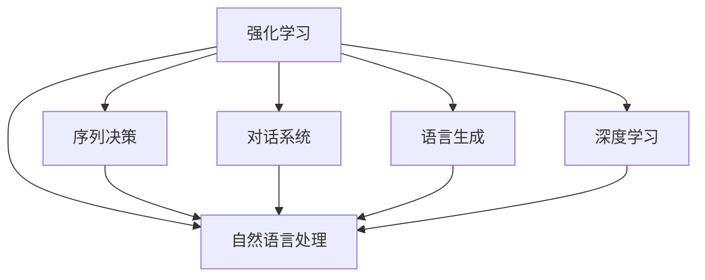

                 

# 强化学习Reinforcement Learning在自然语言处理的前沿进展

> 关键词：强化学习,自然语言处理,序列决策,对话系统,语言生成,深度学习

## 1. 背景介绍

### 1.1 问题由来
近年来，强化学习（Reinforcement Learning, RL）在自然语言处理（Natural Language Processing, NLP）领域取得了显著进展。传统NLP任务通常依赖于有监督学习，如分类、匹配、生成等，但在需要动态决策、复杂交互的场景下，如对话系统、游戏AI等，强化学习的优势逐渐显现。通过与环境交互，强化学习模型能够不断调整策略，学习最优的决策行为，从而在复杂多变的语言任务中取得优异表现。

强化学习在NLP中的应用，不仅拓展了任务解决的范围，还推动了语言生成、问答系统等技术的发展。它为处理未标注数据、实现自然语言交互提供了新的路径，开辟了NLP领域的广阔前景。本文将系统介绍强化学习在NLP中的核心概念、算法原理及实际应用，探索其前沿进展和未来趋势。

## 2. 核心概念与联系

### 2.1 核心概念概述

为更好地理解强化学习在NLP中的应用，本节将介绍几个密切相关的核心概念：

- 强化学习（Reinforcement Learning, RL）：通过智能体与环境的交互，学习最优策略以最大化累积奖励的机器学习范式。强化学习分为模型基（Model-based RL）和模型无关（Model-free RL）两大类。
- 自然语言处理（Natural Language Processing, NLP）：涉及计算机如何理解和生成人类语言的学科。包括文本分类、机器翻译、问答系统、情感分析等众多任务。
- 序列决策（Sequential Decision-Making）：通过一系列决策逐步解决问题，如对话系统、生成式文本等。
- 对话系统（Dialogue System）：模拟人类对话，实现人机交互的系统。包括任务型对话和开放域对话两大类。
- 语言生成（Language Generation）：生成自然流畅的语言文本，如文本摘要、对话生成、故事生成等。
- 深度学习（Deep Learning, DL）：基于神经网络的机器学习技术，广泛应用于强化学习中。

这些核心概念之间的逻辑关系可以通过以下Mermaid流程图来展示：



这个流程图展示了一些核心概念及其之间的关系：

1. 强化学习通过与环境交互学习最优策略。
2. 自然语言处理是强化学习的应用领域之一，处理语言理解与生成任务。
3. 序列决策和对话系统是自然语言处理中应用强化学习的重要场景。
4. 语言生成是自然语言处理的重要任务，强化学习在生成式文本中也有广泛应用。
5. 深度学习是强化学习在NLP中常用的技术手段。

## 3. 核心算法原理 & 具体操作步骤

### 3.1 算法原理概述

强化学习在NLP中的应用，主要体现在通过智能体与语言环境交互，学习语言决策策略，以优化目标任务。其核心思想是通过模型基（Model-based RL）或模型无关（Model-free RL）方法，智能体在每个时间步进行语言决策，并在特定环境下积累奖励（如回答问题的准确性、对话流畅性等），最终通过学习得到最优决策策略。

强化学习在NLP中的应用可以分为两种主要范式：

- 模型基强化学习（Model-based RL）：通过构建语言环境的动态模型，预测下一个语言状态和奖励，并据此进行策略优化。
- 模型无关强化学习（Model-free RL）：直接与语言环境交互，通过奖励信号（Reward Signal）优化策略，无需显式构建模型。

### 3.2 算法步骤详解

强化学习在NLP中的具体应用，通常包括以下几个关键步骤：

**Step 1: 构建语言环境**
- 定义语言环境，包括状态空间、动作空间、奖励函数等。对于NLP任务，状态空间可以是文本、上下文信息等，动作空间可以是生成文本、选择答案等。
- 设计奖励函数，评估语言决策的效果。例如，在问答系统中，奖励函数可以设计为回答准确度、流畅性等指标。

**Step 2: 训练智能体**
- 选择适当的强化学习算法，如Q-learning、Policy Gradient等，并设置相关超参数。
- 利用语言环境进行训练，智能体通过与环境交互积累经验，逐步优化决策策略。
- 在训练过程中，可以使用各种优化技巧，如经验回放（Experience Replay）、重要性采样（Importance Sampling）等，提升训练效率。

**Step 3: 评估与部署**
- 在训练完成后，使用测试集对智能体进行评估，比较不同策略的效果。
- 将优化后的智能体部署到实际应用中，进行交互测试。

### 3.3 算法优缺点

强化学习在NLP中的应用具有以下优点：
1. 适应性强。强化学习通过与环境交互，可以学习到适应各种场景的决策策略，具有很强的泛化能力。
2. 动态决策。强化学习能够处理非结构化语言环境，适合需要动态决策的复杂任务。
3. 自适应学习。强化学习模型能够根据新数据自动调整策略，具有一定的自适应学习能力。

同时，强化学习在NLP中也存在一些局限：
1. 训练复杂度高。强化学习的训练过程相对复杂，需要大量的计算资源和时间。
2. 探索与利用（Exploration vs. Exploitation）平衡难。在探索新策略和利用已有经验之间找到平衡，是强化学习的核心挑战。
3. 模型难以解释。强化学习模型的决策过程通常缺乏可解释性，难以对其推理逻辑进行分析和调试。

尽管存在这些局限性，强化学习在NLP中的应用前景仍然广阔，特别是在需要动态决策、复杂交互的场景中，它具有不可替代的优势。未来相关研究应聚焦于如何优化训练过程、提高模型可解释性、探索更多应用场景等。

### 3.4 算法应用领域

强化学习在NLP中的应用主要体现在以下几个领域：

- 对话系统：如AI客服、虚拟助手、多轮对话等。通过强化学习，使模型能够根据对话历史生成自然流畅的回复。
- 语言生成：如文本摘要、对话生成、故事生成等。通过强化学习，模型能够自动生成高质量的语言文本。
- 问答系统：如智能问答、信息检索等。通过强化学习，模型能够自动回答用户提出的问题。
- 自然语言推理（Natural Language Inference, NLI）：如判断推理、关系抽取等。通过强化学习，模型能够学习复杂的语言推理逻辑。
- 机器翻译：如基于翻译模型的对话系统等。通过强化学习，模型能够动态调整翻译策略，提高翻译质量。
- 自然语言生成（Natural Language Generation, NLG）：如自动生成报告、新闻摘要等。通过强化学习，模型能够生成符合语法和语义规范的文本。

这些领域中，对话系统和语言生成是强化学习在NLP中最具代表性、前景最广阔的应用场景。通过强化学习，使智能体能够根据环境变化进行动态决策，生成自然流畅的回复或文本，提升用户体验和系统性能。

## 4. 数学模型和公式 & 详细讲解 & 举例说明

### 4.1 数学模型构建

本节将使用数学语言对强化学习在NLP中的应用进行更加严格的刻画。

记智能体在状态 $s_t$ 下采取动作 $a_t$，产生下一个状态 $s_{t+1}$ 和奖励 $r_t$，则强化学习的目标是最小化总奖励的期望值。假设智能体的状态空间为 $\mathcal{S}$，动作空间为 $\mathcal{A}$，则强化学习的目标函数可以表示为：

$$
J(\pi) = \mathbb{E}\left[\sum_{t=1}^{\infty} \gamma^t r_t\right]
$$

其中 $\pi$ 为策略函数，$\gamma$ 为折扣因子，$r_t$ 为状态转移和动作的即时奖励。

### 4.2 公式推导过程

以下我们以对话系统为例，推导强化学习模型的核心公式。

假设对话系统的状态空间为 $\mathcal{S}$，动作空间为 $\mathcal{A}$，策略函数为 $\pi(a_t|s_t)$，状态转移函数为 $P(s_{t+1}|s_t,a_t)$，即时奖励函数为 $r(s_t,a_t)$。在每个时间步，智能体根据当前状态 $s_t$ 采取动作 $a_t$，环境根据动作 $a_t$ 转移至状态 $s_{t+1}$，并返回奖励 $r_t$。则对话系统的目标函数为：

$$
J(\pi) = \mathbb{E}\left[\sum_{t=1}^{\infty} \gamma^t r_t\right]
$$

在训练过程中，智能体通过与环境交互积累经验，并利用经验回放等技术进行训练。具体而言，智能体在每个时间步 $t$ 采取动作 $a_t$，并根据环境返回的状态 $s_{t+1}$ 和即时奖励 $r_t$，更新策略函数 $\pi(a_t|s_t)$。通过不断迭代，逐步优化策略，直到收敛。

### 4.3 案例分析与讲解

假设我们构建了一个简单的对话系统，用于回答天气问题。状态空间为 $\mathcal{S} = \{s_1, s_2, s_3\}$，动作空间为 $\mathcal{A} = \{a_1, a_2, a_3\}$，其中 $s_1$ 表示“询问天气”，$s_2$ 表示“提供天气”，$s_3$ 表示“结束对话”。动作 $a_1$ 表示“查询未来三天天气”，$a_2$ 表示“查询当前天气”，$a_3$ 表示“退出对话”。即时奖励函数为 $r(s_t,a_t) = \mathbb{I}(s_{t+1} = s_3)$，即当对话结束时，奖励为1，否则奖励为0。

在训练过程中，智能体通过与环境交互，逐步学习到最优策略。例如，当智能体接收到询问天气的请求，会采取动作 $a_1$ 查询未来三天天气，并根据返回的天气信息生成回复。若回复准确，智能体将获得1的奖励，对话继续进行。若回复错误，智能体将获得0的奖励，对话结束。通过不断迭代，智能体能够学习到如何根据对话历史生成最合适的回复，提高对话系统的效果。

## 5. 项目实践：代码实例和详细解释说明

### 5.1 开发环境搭建

在进行强化学习在NLP中的实践前，我们需要准备好开发环境。以下是使用Python进行TensorFlow开发的环境配置流程：

1. 安装Anaconda：从官网下载并安装Anaconda，用于创建独立的Python环境。

2. 创建并激活虚拟环境：
```bash
conda create -n rl-env python=3.8 
conda activate rl-env
```

3. 安装TensorFlow：根据CUDA版本，从官网获取对应的安装命令。例如：
```bash
conda install tensorflow=2.6 -c conda-forge
```

4. 安装TensorFlow Addons：用于安装TensorFlow中的增强模块。
```bash
pip install tensorflow-addons
```

5. 安装OpenAI Gym：用于构建和测试NLP环境。
```bash
pip install gym
```

6. 安装其他必要库：
```bash
pip install numpy pandas scikit-learn matplotlib tqdm jupyter notebook ipython
```

完成上述步骤后，即可在`rl-env`环境中开始强化学习在NLP中的实践。

### 5.2 源代码详细实现

这里我们以对话系统为例，使用TensorFlow和OpenAI Gym构建一个简单的强化学习模型，并应用于问答任务。

首先，定义问答环境类：

```python
from gym import Env
import numpy as np

class QADialogueEnv(Env):
    def __init__(self, max_steps=100):
        self.state_space = 3  # 状态空间大小
        self.action_space = 3  # 动作空间大小
        self.max_steps = max_steps
        self.current_state = 0
        self.current_reward = 0
    
    def step(self, action):
        if action == 0:  # 查询未来三天天气
            self.current_state = 1
            self.current_reward = 0
        elif action == 1:  # 查询当前天气
            self.current_state = 2
            self.current_reward = 0
        else:  # 退出对话
            self.current_state = 3
            self.current_reward = 1
        return self.current_state, self.current_reward, False, {}
    
    def reset(self):
        self.current_state = 0
        self.current_reward = 0
        return self.current_state, self.current_reward, False, {}
    
    def render(self):
        print(f"State: {self.current_state}, Reward: {self.current_reward}")
```

然后，定义强化学习模型：

```python
from tensorflow.keras.layers import Dense, Input
from tensorflow.keras.models import Model
import tensorflow as tf

class QADialogueAgent:
    def __init__(self, state_size, action_size):
        self.state_size = state_size
        self.action_size = action_size
        self.model = self.build_model()
    
    def build_model(self):
        inputs = Input(shape=(self.state_size,))
        x = Dense(32, activation='relu')(inputs)
        x = Dense(32, activation='relu')(x)
        outputs = Dense(self.action_size, activation='softmax')(x)
        model = Model(inputs=inputs, outputs=outputs)
        model.compile(optimizer=tf.keras.optimizers.Adam(), loss='mse')
        return model
    
    def act(self, state):
        state = np.reshape(state, (1, self.state_size))
        action_probs = self.model.predict(state)[0]
        return np.random.choice(self.action_size, p=action_probs)
    
    def train(self, env, episodes=1000, batch_size=32):
        for episode in range(episodes):
            state = env.reset()
            done = False
            total_reward = 0
            while not done:
                action = self.act(state)
                next_state, reward, done, info = env.step(action)
                self.model.fit([state], [action], batch_size=batch_size, epochs=1, verbose=0)
                state = next_state
                total_reward += reward
            print(f"Episode {episode+1}, Reward: {total_reward}")
```

最后，启动训练流程：

```python
agent = QADialogueAgent(state_size=3, action_size=3)
env = QADialogueEnv()
agent.train(env, episodes=1000, batch_size=32)
```

以上就是使用TensorFlow构建和训练一个简单的对话系统强化学习模型的完整代码实现。可以看到，TensorFlow和Gym提供了强大的工具和环境，使强化学习在NLP中的实践变得相对简单。

### 5.3 代码解读与分析

让我们再详细解读一下关键代码的实现细节：

**QADialogueEnv类**：
- `__init__`方法：初始化状态空间、动作空间、当前状态和奖励。
- `step`方法：根据动作更新状态和奖励，返回下一个状态和即时奖励。
- `reset`方法：重置状态和奖励。
- `render`方法：输出当前状态和奖励。

**QADialogueAgent类**：
- `__init__`方法：初始化状态大小、动作大小和模型。
- `build_model`方法：定义模型结构。
- `act`方法：根据当前状态选择动作。
- `train`方法：在环境中训练模型，累计奖励并更新模型参数。

**训练流程**：
- 初始化模型和环境。
- 循环迭代1000次，每次随机选择一个动作。
- 根据动作返回下一个状态和即时奖励，计算累积奖励并更新模型参数。
- 输出每个迭代的累积奖励。

可以看到，TensorFlow和Gym使得强化学习在NLP中的应用变得相对容易，开发者可以快速上手实验和训练模型。当然，工业级的系统实现还需考虑更多因素，如模型的保存和部署、超参数的自动搜索、更灵活的任务适配层等。但核心的强化学习范式基本与此类似。

## 6. 实际应用场景

### 6.1 智能客服系统

基于强化学习的对话系统可以广泛应用于智能客服系统的构建。传统客服往往需要配备大量人力，高峰期响应缓慢，且一致性和专业性难以保证。而使用强化学习的对话模型，可以7x24小时不间断服务，快速响应客户咨询，用自然流畅的语言解答各类常见问题。

在技术实现上，可以收集企业内部的历史客服对话记录，将问题和最佳答复构建成监督数据，在此基础上对预训练对话模型进行强化学习微调。微调后的对话模型能够自动理解用户意图，匹配最合适的答案模板进行回复。对于客户提出的新问题，还可以接入检索系统实时搜索相关内容，动态组织生成回答。如此构建的智能客服系统，能大幅提升客户咨询体验和问题解决效率。

### 6.2 金融舆情监测

金融机构需要实时监测市场舆论动向，以便及时应对负面信息传播，规避金融风险。传统的人工监测方式成本高、效率低，难以应对网络时代海量信息爆发的挑战。基于强化学习的文本分类和情感分析技术，为金融舆情监测提供了新的解决方案。

具体而言，可以收集金融领域相关的新闻、报道、评论等文本数据，并对其进行主题标注和情感标注。在此基础上对预训练语言模型进行强化学习微调，使其能够自动判断文本属于何种主题，情感倾向是正面、中性还是负面。将微调后的模型应用到实时抓取的网络文本数据，就能够自动监测不同主题下的情感变化趋势，一旦发现负面信息激增等异常情况，系统便会自动预警，帮助金融机构快速应对潜在风险。

### 6.3 个性化推荐系统

当前的推荐系统往往只依赖用户的历史行为数据进行物品推荐，无法深入理解用户的真实兴趣偏好。基于强化学习的个性化推荐系统可以更好地挖掘用户行为背后的语义信息，从而提供更精准、多样的推荐内容。

在实践中，可以收集用户浏览、点击、评论、分享等行为数据，提取和用户交互的物品标题、描述、标签等文本内容。将文本内容作为模型输入，用户的后续行为（如是否点击、购买等）作为监督信号，在此基础上强化学习微调预训练语言模型。微调后的模型能够从文本内容中准确把握用户的兴趣点。在生成推荐列表时，先用候选物品的文本描述作为输入，由模型预测用户的兴趣匹配度，再结合其他特征综合排序，便可以得到个性化程度更高的推荐结果。

### 6.4 未来应用展望

随着强化学习在NLP中的应用不断深入，其在更多领域的应用前景也将逐渐显现。

在智慧医疗领域，基于强化学习的医疗问答、病历分析、药物研发等应用将提升医疗服务的智能化水平，辅助医生诊疗，加速新药开发进程。

在智能教育领域，强化学习可应用于作业批改、学情分析、知识推荐等方面，因材施教，促进教育公平，提高教学质量。

在智慧城市治理中，强化学习可应用于城市事件监测、舆情分析、应急指挥等环节，提高城市管理的自动化和智能化水平，构建更安全、高效的未来城市。

此外，在企业生产、社会治理、文娱传媒等众多领域，基于强化学习的NLP应用也将不断涌现，为NLP技术带来了全新的突破。相信随着预训练语言模型和强化学习方法的持续演进，NLP技术将在更广阔的应用领域大放异彩，深刻影响人类的生产生活方式。

## 7. 工具和资源推荐
### 7.1 学习资源推荐

为了帮助开发者系统掌握强化学习在NLP中的应用，这里推荐一些优质的学习资源：

1. 《Reinforcement Learning: An Introduction》书籍：由Richard S. Sutton和Andrew G. Barto合著，全面介绍了强化学习的理论基础和应用场景，是学习强化学习的经典教材。

2. CS294T《Reinforcement Learning》课程：由加州伯克利大学开设的强化学习课程，由Pete L. Bartlett讲授，涵盖强化学习的基本概念、算法和应用。

3. OpenAI Gym：OpenAI推出的环境构建平台，包含大量经典的强化学习环境，适合学习和测试强化学习算法。

4. RLlib：由Facebook开发的分布式强化学习库，支持多种强化学习算法，具有高效、可扩展的特点。

5. TensorFlow Agents：TensorFlow提供的强化学习框架，支持多种模型基和模型无关算法，适合研究和实验强化学习模型。

通过对这些资源的学习实践，相信你一定能够快速掌握强化学习在NLP中的应用，并用于解决实际的NLP问题。
###  7.2 开发工具推荐

高效的开发离不开优秀的工具支持。以下是几款用于强化学习在NLP中开发的常用工具：

1. TensorFlow：由Google主导开发的开源深度学习框架，生产部署方便，适合大规模工程应用。

2. TensorFlow Agents：TensorFlow提供的强化学习框架，支持多种模型基和模型无关算法，适合研究和实验强化学习模型。

3. OpenAI Gym：OpenAI推出的环境构建平台，包含大量经典的强化学习环境，适合学习和测试强化学习算法。

4. RLlib：由Facebook开发的分布式强化学习库，支持多种强化学习算法，具有高效、可扩展的特点。

5. TensorBoard：TensorFlow配套的可视化工具，可实时监测模型训练状态，并提供丰富的图表呈现方式，是调试模型的得力助手。

6. Weights & Biases：模型训练的实验跟踪工具，可以记录和可视化模型训练过程中的各项指标，方便对比和调优。

合理利用这些工具，可以显著提升强化学习在NLP中的应用开发效率，加快创新迭代的步伐。

### 7.3 相关论文推荐

强化学习在NLP中的应用源于学界的持续研究。以下是几篇奠基性的相关论文，推荐阅读：

1. Reinforcement Learning for Learning to Read（QED）：提出使用强化学习模型学习自然语言理解任务，通过自主探索和奖励反馈，逐步提升语言理解能力。

2. Sequence to Sequence with Reinforcement Learning：提出使用强化学习模型优化序列生成任务，通过行为奖励指导模型生成高质量的语言文本。

3. A Survey on Deep Learning-Based Dialogue Systems：综述了基于深度学习和强化学习的对话系统研究进展，讨论了模型结构和优化方法。

4. Neural Dialogue Generation with Long-Term Rewards：提出使用强化学习模型优化对话生成，通过长序列奖励指导模型生成自然流畅的对话。

5. Towards AI-Compatible Dialogue Systems: Integrating AI to Human-Like Conversations：讨论了将强化学习应用于对话系统中的挑战和解决方案，提出集成AI技术和人类反馈的对话系统。

这些论文代表了大语言模型微调技术的发展脉络。通过学习这些前沿成果，可以帮助研究者把握学科前进方向，激发更多的创新灵感。

## 8. 总结：未来发展趋势与挑战

### 8.1 总结

本文对强化学习在自然语言处理中的应用进行了全面系统的介绍。首先阐述了强化学习在NLP中的研究背景和意义，明确了其在复杂交互任务中的独特优势。其次，从原理到实践，详细讲解了强化学习的核心概念和算法步骤，给出了微调任务开发的完整代码实例。同时，本文还探讨了强化学习在对话系统、语言生成等NLP领域的前沿进展和未来趋势。

通过本文的系统梳理，可以看到，强化学习在NLP中的应用前景广阔，特别是在需要动态决策、复杂交互的场景中，它具有不可替代的优势。未来，伴随预训练语言模型和强化学习方法的持续演进，NLP技术将在更广阔的应用领域大放异彩，深刻影响人类的生产生活方式。

### 8.2 未来发展趋势

展望未来，强化学习在NLP中的应用将呈现以下几个发展趋势：

1. 模型基强化学习（Model-based RL）的崛起。模型基方法通过构建语言环境的动态模型，预测下一个语言状态和奖励，具有更好的可解释性和鲁棒性。
2. 多智能体学习（Multi-Agent Learning）的应用。多智能体方法通过多个智能体之间的协作和竞争，优化复杂的对话系统和推荐系统。
3. 强化学习与深度学习的融合。深度学习提供丰富的特征表示，强化学习提供决策策略，二者结合将进一步提升NLP系统的性能。
4. 跨模态学习（Cross-Modal Learning）的探索。将文本、图像、语音等多模态信息融合，提升NLP系统的感知和推理能力。
5. 自监督预训练的增强。自监督预训练方法通过无标签数据进行模型训练，提升强化学习模型的初始化效果。
6. 更加高效的强化学习算法。如导数传播（Derivative Propagation）、非线性函数逼近等方法，将进一步提升强化学习算法的效率和效果。

以上趋势凸显了强化学习在NLP中的广阔前景。这些方向的探索发展，必将进一步提升NLP系统的性能和应用范围，为人类认知智能的进化带来深远影响。

### 8.3 面临的挑战

尽管强化学习在NLP中的应用前景广阔，但在迈向更加智能化、普适化应用的过程中，它仍面临诸多挑战：

1. 计算资源瓶颈。强化学习模型的训练和推理过程计算复杂度高，需要大量的计算资源和时间。如何优化训练过程，提高计算效率，是一个重要挑战。
2. 模型鲁棒性不足。强化学习模型在处理域外数据时，泛化性能往往大打折扣。如何提高模型的鲁棒性，避免灾难性遗忘，还需要更多理论和实践的积累。
3. 模型可解释性不足。强化学习模型的决策过程通常缺乏可解释性，难以对其推理逻辑进行分析和调试。如何赋予模型更强的可解释性，将是亟待攻克的难题。
4. 安全性有待保障。预训练语言模型难免会学习到有偏见、有害的信息，通过强化学习传递到下游任务，产生误导性、歧视性的输出，给实际应用带来安全隐患。如何从数据和算法层面消除模型偏见，避免恶意用途，确保输出的安全性，也将是重要的研究课题。
5. 知识整合能力不足。现有的强化学习模型往往局限于任务内数据，难以灵活吸收和运用更广泛的先验知识。如何让强化学习过程更好地与外部知识库、规则库等专家知识结合，形成更加全面、准确的信息整合能力，还有很大的想象空间。

正视强化学习在NLP中面临的这些挑战，积极应对并寻求突破，将是实现其广泛应用的关键。

### 8.4 研究展望

面对强化学习在NLP中的挑战，未来的研究需要在以下几个方面寻求新的突破：

1. 探索更加高效的强化学习算法。开发更加高效的模型基和模型无关方法，在保持高效的同时，提升模型的性能和可解释性。
2. 研究多智能体学习在NLP中的应用。通过多个智能体之间的协作和竞争，优化复杂的对话系统和推荐系统。
3. 引入自监督预训练和迁移学习。通过自监督预训练和迁移学习，提高强化学习模型的初始化效果和泛化能力。
4. 研究跨模态学习在NLP中的应用。将文本、图像、语音等多模态信息融合，提升NLP系统的感知和推理能力。
5. 融入更多先验知识。将符号化的先验知识，如知识图谱、逻辑规则等，与神经网络模型进行巧妙融合，引导强化学习过程学习更准确、合理的语言模型。

这些研究方向的探索，必将引领强化学习在NLP中的应用走向更高的台阶，为构建安全、可靠、可解释、可控的智能系统铺平道路。面向未来，强化学习在NLP中的研究将进一步与深度学习、知识表示、因果推理等技术融合，共同推动自然语言理解和智能交互系统的进步。

## 9. 附录：常见问题与解答

**Q1：强化学习在NLP中是否适合所有任务？**

A: 强化学习在NLP中并不适合所有任务，特别是需要大量标注数据的任务。但对于需要动态决策、复杂交互的场景，如对话系统、游戏AI等，强化学习具有显著优势。

**Q2：强化学习在NLP中如何应对探索与利用（Exploration vs. Exploitation）的平衡问题？**

A: 强化学习在NLP中通常使用经验回放（Experience Replay）、重要性采样（Importance Sampling）等技术应对探索与利用的平衡问题。通过保存和重放训练经验，在探索新策略的同时，利用已有经验，逐步优化决策策略。

**Q3：强化学习在NLP中如何提升模型的泛化能力？**

A: 强化学习在NLP中可以通过自监督预训练和迁移学习提升模型的泛化能力。通过大量无标签数据的自监督预训练，学习语言通用知识，提升模型的泛化能力。

**Q4：强化学习在NLP中如何处理长序列数据？**

A: 强化学习在NLP中通常使用模型基方法，通过构建语言环境的动态模型，预测下一个语言状态和奖励，从而处理长序列数据。

**Q5：强化学习在NLP中如何提升模型的可解释性？**

A: 强化学习在NLP中可以通过融合因果分析和博弈论工具提升模型的可解释性。通过因果分析方法识别模型决策的关键特征，增强输出解释的因果性和逻辑性。

以上是针对强化学习在NLP中应用的一些常见问题及解答，希望能够帮助开发者更好地理解和使用强化学习技术。

---

作者：禅与计算机程序设计艺术 / Zen and the Art of Computer Programming

