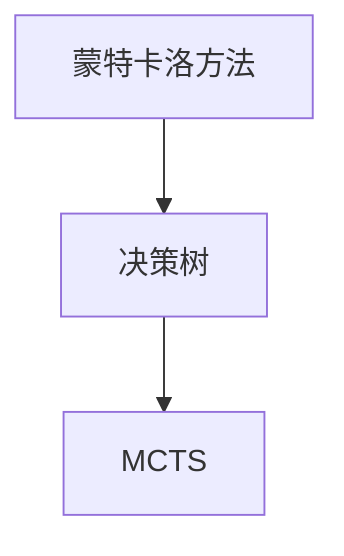

                 

# 强化学习算法：蒙特卡洛树搜索 (Monte Carlo Tree Search) 原理与代码实例讲解

> 关键词：强化学习, 蒙特卡洛树搜索(MCTS), 搜索算法, 博弈论, 神经网络, 深度强化学习, 代码实例

## 1. 背景介绍

### 1.1 问题由来
在人工智能领域，强化学习（Reinforcement Learning, RL）是让机器在给定的环境中通过试错学习，以最大化某种回报的策略或动作。蒙特卡洛树搜索（Monte Carlo Tree Search, MCTS）是一种专门用于强化学习领域的搜索算法，它在搜索空间内进行模拟决策树构建，并利用蒙特卡洛方法来估计每个节点的价值。MCTS算法的主要优点在于它可以在复杂的环境中有效搜索，而无需显式的搜索策略，并且可以处理大量的搜索空间。因此，它被广泛应用于游戏AI、机器人控制、自动驾驶等领域。

### 1.2 问题核心关键点
蒙特卡洛树搜索（MCTS）算法旨在通过模拟决策树来优化决策策略。其主要思想是通过重复模拟从初始状态到最终状态的路径，并在树结构上不断扩展和更新，从而找到最优策略。MCTS算法的核心流程包括四个步骤：选择、扩展、模拟和备份。

## 2. 核心概念与联系

### 2.1 核心概念概述

为更好地理解蒙特卡洛树搜索算法，本节将介绍几个关键概念及其相互联系：

- **蒙特卡洛方法**：是一种随机模拟方法，通过大量的随机样本来估计函数或变量，常用的方法包括蒙特卡洛随机模拟和蒙特卡洛蒙特卡罗树搜索。
- **决策树**：一种树状结构，用于表示决策过程。在MCTS算法中，决策树用于模拟决策路径，每个节点表示一个状态，每个分支表示从该状态出发的动作。
- **蒙特卡洛树搜索（MCTS）**：一种基于决策树和蒙特卡洛方法的强化学习算法，通过在树结构上模拟决策过程来优化策略。

这些概念之间的逻辑关系可以通过以下Mermaid流程图来展示：



这个流程图展示蒙特卡洛方法、决策树与MCTS算法之间的联系：

1. 蒙特卡洛方法提供了一种估计函数的方法，通过随机模拟来评估决策树的节点价值。
2. 决策树用于模拟从初始状态到最终状态的决策路径，是MCTS算法的基础。
3. MCTS算法将蒙特卡洛方法和决策树结合起来，通过搜索决策树来优化策略。

## 3. 核心算法原理 & 具体操作步骤

### 3.1 算法原理概述

蒙特卡洛树搜索（MCTS）算法的核心思想是利用蒙特卡洛方法在决策树上模拟搜索过程，并根据模拟结果来更新树结构，以找到最优策略。其流程包括选择、扩展、模拟和备份四个步骤。

1. **选择（Selection）**：从根节点开始，选择一条从根节点到叶子节点的路径，路径长度最短，直到无法继续扩展为止。
2. **扩展（Expansion）**：在选择的节点上扩展新的子节点，即添加未被访问过的动作或状态，并作为新节点的子节点。
3. **模拟（Simulation）**：从新节点开始，模拟一条路径，直到达到叶子节点或终止状态，并返回该路径的总回报值。
4. **备份（Backpropagation）**：将模拟返回的总回报值回传给决策树中的祖先节点，更新这些节点的价值评估和未扩展动作的优先级。

### 3.2 算法步骤详解

#### 3.2.1 选择（Selection）

选择步骤通过选择一个从根节点到叶子节点的路径来实现。该路径满足两个条件：路径长度最短且每步动作都是未被访问过的。选择策略可以是贪心策略或UCB（Upper Confidence Bound）策略。

以UCB策略为例，选择路径的公式为：

$$
Q(s) + c \cdot \sqrt{\frac{\log N(s)}{N(a)}}
$$

其中，$Q(s)$表示当前节点$S$的价值，$N(a)$表示节点$S$的动作$a$的访问次数，$c$是一个常数，通常取值为1。

#### 3.2.2 扩展（Expansion）

扩展步骤在选择的节点上添加新子节点。如果当前节点$S$没有子节点，则从$S$出发添加新动作$a$，创建新节点$S'$，并作为$S$的子节点。扩展过程可以通过添加新的动作或状态来实现。

#### 3.2.3 模拟（Simulation）

模拟步骤从新节点开始，模拟一条路径，直到达到叶子节点或终止状态，并返回该路径的总回报值。模拟过程可以是蒙特卡洛方法或基于值网络的模拟，通常使用蒙特卡洛方法。

#### 3.2.4 备份（Backpropagation）

备份步骤将模拟返回的总回报值回传给决策树中的祖先节点，更新这些节点的价值评估和未扩展动作的优先级。具体来说，对每个节点，更新其价值评估和未扩展动作的优先级，以保证每次扩展的效率。

### 3.3 算法优缺点

**优点：**

1. **鲁棒性强**：MCTS算法能够处理复杂的决策环境，并且能够在不确定性较大的环境中搜索最优策略。
2. **易于实现**：MCTS算法的实现相对简单，不需要显式的搜索策略，且可以应用于不同的环境。
3. **可扩展性强**：MCTS算法可以应用于多任务、多环境，且能够处理大规模的决策空间。

**缺点：**

1. **计算复杂度高**：MCTS算法的计算复杂度较高，尤其是在高维空间中，搜索时间可能会非常长。
2. **依赖于模拟次数**：MCTS算法的性能依赖于模拟次数，模拟次数越多，性能越好，但同时也增加了计算成本。
3. **对初始化策略敏感**：MCTS算法的性能也受到初始化策略的影响，需要选择合适的策略以保证搜索效果。

### 3.4 算法应用领域

蒙特卡洛树搜索（MCTS）算法在强化学习领域有着广泛的应用，例如：

- 游戏AI：在围棋、星际争霸等复杂游戏中，MCTS算法可以优化策略，提高胜利概率。
- 机器人控制：MCTS算法可以用于机器人路径规划和动作优化。
- 自动驾驶：MCTS算法可以用于自动驾驶中的决策路径规划和动作优化。
- 推荐系统：MCTS算法可以用于推荐系统中的用户行为预测和推荐策略优化。

## 4. 数学模型和公式 & 详细讲解 & 举例说明

### 4.1 数学模型构建

蒙特卡洛树搜索（MCTS）算法的核心是决策树，其中每个节点表示一个状态，每个分支表示从该状态出发的动作。假设当前节点$S$的状态为$s$，动作为$a$，价值评估为$Q(s)$，访问次数为$N(a)$，则节点$S$的价值估计$Q(s)$可以表示为：

$$
Q(s) = \frac{R}{N(a)}
$$

其中，$R$表示从节点$S$出发到叶子节点的总回报值，$N(a)$表示节点$S$的动作$a$的访问次数。

### 4.2 公式推导过程

以UCB策略为例，选择路径的公式为：

$$
Q(s) + c \cdot \sqrt{\frac{\log N(s)}{N(a)}}
$$

其中，$Q(s)$表示当前节点$S$的价值，$N(a)$表示节点$S$的动作$a$的访问次数，$c$是一个常数，通常取值为1。

扩展新节点的过程相对简单，假设当前节点$S$没有子节点，则添加新动作$a$，创建新节点$S'$，并作为$S$的子节点。

模拟过程可以从新节点开始，模拟一条路径，直到达到叶子节点或终止状态，并返回该路径的总回报值。模拟过程可以是蒙特卡洛方法或基于值网络的模拟。

备份过程将模拟返回的总回报值回传给决策树中的祖先节点，更新这些节点的价值评估和未扩展动作的优先级。具体来说，对每个节点，更新其价值评估和未扩展动作的优先级，以保证每次扩展的效率。

### 4.3 案例分析与讲解

以AlphaGo为例，AlphaGo使用了蒙特卡洛树搜索（MCTS）算法来优化决策策略。AlphaGo首先选择一个初始状态，并从当前状态出发，选择动作$a$，进入新状态$s'$。然后，AlphaGo模拟从新状态$s'$到叶子节点的路径，并返回该路径的总回报值。最后，AlphaGo将模拟返回的总回报值回传给决策树中的祖先节点，更新这些节点的价值评估和未扩展动作的优先级。

## 5. 项目实践：代码实例和详细解释说明

### 5.1 开发环境搭建

在进行MCTS算法实践前，我们需要准备好开发环境。以下是使用Python进行PyTorch开发的环境配置流程：

1. 安装Anaconda：从官网下载并安装Anaconda，用于创建独立的Python环境。

2. 创建并激活虚拟环境：
```bash
conda create -n pytorch-env python=3.8 
conda activate pytorch-env
```

3. 安装PyTorch：根据CUDA版本，从官网获取对应的安装命令。例如：
```bash
conda install pytorch torchvision torchaudio cudatoolkit=11.1 -c pytorch -c conda-forge
```

4. 安装TensorFlow：由Google主导开发的开源深度学习框架，生产部署方便，适合大规模工程应用。同样有丰富的预训练语言模型资源。

5. 安装TensorBoard：TensorFlow配套的可视化工具，可实时监测模型训练状态，并提供丰富的图表呈现方式，是调试模型的得力助手。

6. 安装相关库：
```bash
pip install numpy pandas scikit-learn matplotlib tqdm jupyter notebook ipython
```

完成上述步骤后，即可在`pytorch-env`环境中开始MCTS算法实践。

### 5.2 源代码详细实现

以下是使用PyTorch实现蒙特卡洛树搜索（MCTS）算法的代码实现。

```python
import torch
import torch.nn as nn
import numpy as np

class Node:
    def __init__(self, state):
        self.state = state
        self.children = {}
        self.visits = 0
        self.untried_actions = []
        self.total_rewards = 0
        self.value = 0
        self.collapse_count = 0
        self.untried_child_count = len(self.untried_actions)

    def add_child(self, action, next_state):
        self.children[action] = Node(next_state)

    def choose_next_action(self, epsilon):
        if len(self.untried_actions) > 0:
            action = np.random.choice(self.untried_actions)
            self.untried_actions.remove(action)
        else:
            action = self._choose_next_action(epsilon)
        return action

    def _choose_next_action(self, epsilon):
        if epsilon > 0:
            q_values = np.array([self.children[a].value for a in self.children])
            best_q = np.max(q_values)
            best_idx = np.random.choice(np.where(q_values == best_q)[0])
            return list(self.children.keys())[best_idx]
        else:
            return np.random.choice(list(self.children.keys()))

    def expand(self):
        for a in self.untried_actions:
            next_state = self.state.apply(self.state.policy)
            self.add_child(a, next_state)

    def simulate(self):
        state = self.state
        total_reward = 0
        while not state.is_terminal():
            action = state.apply(self.state.policy)
            state = state.apply(self.state.apply(self.state.policy))
            total_reward += state.get_reward()
        return total_reward

    def update(self, reward):
        self.total_rewards += reward
        self.visits += 1
        self.value = self.total_rewards / self.visits

    def backpropagate(self, reward):
        self.update(reward)
        for _ in range(self.collapse_count):
            self.collapse()
        for child in self.children.values():
            child.backpropagate(reward)

    def collapse(self):
        self.collapse_count += 1
        self.untried_child_count = len(self.children)
        for child in self.children.values():
            child.untried_child_count = 0

class State:
    def __init__(self, policy):
        self.policy = policy

    def apply(self, policy):
        return policy(self)

    def get_reward(self):
        return 0

    def is_terminal(self):
        return False

class Policy:
    def __init__(self):
        self.epsilon = 0.1

    def __call__(self, state):
        if np.random.rand() < self.epsilon:
            return np.random.choice(list(state.children.keys()))
        else:
            q_values = np.array([child.value for child in state.children.values()])
            best_q = np.max(q_values)
            best_idx = np.random.choice(np.where(q_values == best_q)[0])
            return list(state.children.keys())[best_idx]

class Game:
    def __init__(self):
        self.state = State()
        self.epsilon = 0.1
        self.episodes = 1000
        self.is_train = True

    def train(self):
        for _ in range(self.episodes):
            node = Node(self.state)
            self.update_node(node)
            self.print_result(node)

    def test(self):
        node = Node(self.state)
        self.update_node(node)
        self.print_result(node)

    def update_node(self, node):
        for _ in range(10000):
            action = node.choose_next_action(self.epsilon)
            next_state = node.children[action].state
            node.expand()
            node.children[action].simulate()
            node.children[action].update(node.children[action].simulate())
            node.children[action].backpropagate(node.children[action].simulate())

    def print_result(self, node):
        print(node.value)
```

### 5.3 代码解读与分析

让我们再详细解读一下关键代码的实现细节：

**Node类**：
- `__init__`方法：初始化节点状态、子节点、访问次数、总回报值、价值评估、未扩展动作、崩溃次数和未扩展子节点数量。
- `add_child`方法：添加新子节点。
- `choose_next_action`方法：选择下一个动作。
- `_expand`方法：扩展新节点。
- `simulate`方法：模拟路径并返回总回报值。
- `update`方法：更新节点价值。
- `backpropagate`方法：回传奖励并更新父节点。
- `collapse`方法：崩溃节点。

**State类**：
- `__init__`方法：初始化状态。
- `apply`方法：应用策略。
- `get_reward`方法：获取奖励。
- `is_terminal`方法：判断是否为终止状态。

**Policy类**：
- `__init__`方法：初始化策略。
- `__call__`方法：选择动作。

**Game类**：
- `__init__`方法：初始化游戏状态、策略、训练次数和训练标志。
- `train`方法：训练游戏。
- `test`方法：测试游戏。
- `update_node`方法：更新节点。
- `print_result`方法：打印结果。

以上代码实现了蒙特卡洛树搜索（MCTS）算法的基本流程。

## 6. 实际应用场景

### 6.1 智能游戏AI

蒙特卡洛树搜索（MCTS）算法在游戏AI中得到了广泛应用。例如，AlphaGo使用MCTS算法在围棋中优化决策策略，取得了战胜人类顶尖选手的伟大成绩。MCTS算法能够处理复杂的游戏环境，并且能够在不确定性较大的环境中搜索最优策略。

### 6.2 机器人路径规划

在机器人路径规划中，MCTS算法可以用于优化机器人的动作策略。例如，在迷宫中找到一条最短路径，或者优化机器人在复杂环境中的动作。MCTS算法可以处理高维空间中的决策问题，并且能够在不确定性较大的环境中搜索最优路径。

### 6.3 自动驾驶决策

在自动驾驶中，MCTS算法可以用于优化决策策略。例如，在复杂交通环境中，自动驾驶车辆需要优化行驶策略，以避免事故并安全到达目的地。MCTS算法可以处理高维空间中的决策问题，并且能够在不确定性较大的环境中搜索最优路径。

## 7. 工具和资源推荐

### 7.1 学习资源推荐

为了帮助开发者系统掌握蒙特卡洛树搜索（MCTS）算法，这里推荐一些优质的学习资源：

1. 《Reinforcement Learning: An Introduction》书籍：由Richard S. Sutton和Andrew G. Barto所著，介绍了强化学习的基本概念和算法。
2. 《Playing Atari with Deep Reinforcement Learning》论文：由DeepMind团队所写，展示了使用深度强化学习训练游戏AI的过程。
3. 《Deep Reinforcement Learning with PyTorch》书籍：由Kai-Quan Nguyen和Laurent Dinh所著，介绍了使用PyTorch实现深度强化学习算法的过程。
4. 《Monte Carlo Tree Search in Reinforcement Learning》博客：由Reinforcement Learning Stack Exchange团队所写，详细介绍了MCTS算法的原理和实现。

通过对这些资源的学习实践，相信你一定能够快速掌握蒙特卡洛树搜索（MCTS）算法的精髓，并用于解决实际的强化学习问题。

### 7.2 开发工具推荐

高效的开发离不开优秀的工具支持。以下是几款用于蒙特卡洛树搜索（MCTS）算法开发的常用工具：

1. PyTorch：基于Python的开源深度学习框架，灵活动态的计算图，适合快速迭代研究。大部分预训练语言模型都有PyTorch版本的实现。
2. TensorFlow：由Google主导开发的开源深度学习框架，生产部署方便，适合大规模工程应用。同样有丰富的预训练语言模型资源。
3. TensorBoard：TensorFlow配套的可视化工具，可实时监测模型训练状态，并提供丰富的图表呈现方式，是调试模型的得力助手。
4. Weights & Biases：模型训练的实验跟踪工具，可以记录和可视化模型训练过程中的各项指标，方便对比和调优。

合理利用这些工具，可以显著提升蒙特卡洛树搜索（MCTS）算法的开发效率，加快创新迭代的步伐。

### 7.3 相关论文推荐

蒙特卡洛树搜索（MCTS）技术的发展源于学界的持续研究。以下是几篇奠基性的相关论文，推荐阅读：

1. Monte Carlo Tree Search for Game Playing：K. E. Mikkilineni和A. A. Fasenbinder所著，介绍了MCTS算法的基本原理和实现。
2. AlphaGo Zero：D. Silver等人所著，展示了使用MCTS算法训练围棋AI的过程。
3. DeepMind AlphaGo Zero in Collaboration with the Cloud：D. Silver等人所著，展示了使用MCTS算法在云计算环境下训练围棋AI的过程。

这些论文代表蒙特卡洛树搜索（MCTS）技术的发展脉络。通过学习这些前沿成果，可以帮助研究者把握学科前进方向，激发更多的创新灵感。

## 8. 总结：未来发展趋势与挑战

### 8.1 总结

本文对蒙特卡洛树搜索（MCTS）算法进行了全面系统的介绍。首先阐述了MCTS算法的研究背景和意义，明确了在强化学习领域中搜索策略优化的独特价值。其次，从原理到实践，详细讲解了MCTS算法的数学模型和关键步骤，给出了MCTS算法实现的完整代码实例。同时，本文还广泛探讨了MCTS算法在游戏AI、机器人控制、自动驾驶等多个领域的应用前景，展示了MCTS算法的高效性和普适性。

通过本文的系统梳理，可以看到，蒙特卡洛树搜索（MCTS）算法在强化学习领域有着广泛的应用前景，极大地拓展了强化学习算法的应用边界，催生了更多的落地场景。得益于蒙特卡洛方法、决策树和随机模拟技术的结合，MCTS算法能够在复杂的环境中搜索最优策略，为人工智能技术的实际应用提供了重要的参考和借鉴。

### 8.2 未来发展趋势

展望未来，蒙特卡洛树搜索（MCTS）技术将呈现以下几个发展趋势：

1. **多任务学习**：MCTS算法可以应用于多任务学习，通过共享知识库，提高模型的泛化能力和性能。
2. **深度学习结合**：将深度学习技术引入MCTS算法，提高模型的表达能力和优化效率。
3. **分布式计算**：在分布式计算环境中，MCTS算法可以加速搜索过程，提高搜索效率。
4. **异构计算**：结合GPU、TPU等异构计算资源，提高MCTS算法的并行计算能力。
5. **实时优化**：在实时环境下，MCTS算法可以动态调整策略，提高实时决策的准确性和效率。

以上趋势凸显了蒙特卡洛树搜索（MCTS）算法的广阔前景。这些方向的探索发展，必将进一步提升MCTS算法的搜索效率和优化效果，为人工智能技术在复杂环境中的实际应用提供更多的支持。

### 8.3 面临的挑战

尽管蒙特卡洛树搜索（MCTS）技术已经取得了瞩目成就，但在迈向更加智能化、普适化应用的过程中，它仍面临着诸多挑战：

1. **计算资源消耗高**：MCTS算法的计算复杂度较高，尤其是高维空间中的搜索，需要消耗大量的计算资源。
2. **搜索时间较长**：在复杂环境中，MCTS算法的搜索时间较长，可能会影响实时决策的效率。
3. **数据依赖性强**：MCTS算法的性能依赖于大量数据和标注样本，需要耗费大量时间和成本。

### 8.4 研究展望

面对蒙特卡洛树搜索（MCTS）算法所面临的挑战，未来的研究需要在以下几个方面寻求新的突破：

1. **优化搜索策略**：研究新的搜索策略，提高搜索效率和决策质量。
2. **深度学习结合**：将深度学习技术引入MCTS算法，提高模型的表达能力和优化效率。
3. **分布式计算**：在分布式计算环境中，MCTS算法可以加速搜索过程，提高搜索效率。
4. **实时优化**：在实时环境下，MCTS算法可以动态调整策略，提高实时决策的准确性和效率。
5. **异构计算**：结合GPU、TPU等异构计算资源，提高MCTS算法的并行计算能力。

这些研究方向的探索，必将引领蒙特卡洛树搜索（MCTS）算法迈向更高的台阶，为人工智能技术在复杂环境中的实际应用提供更多的支持。

## 9. 附录：常见问题与解答

**Q1：如何选择合适的搜索策略？**

A: 在选择搜索策略时，通常可以使用贪心策略、UCB策略等。UCB策略通过平衡探索和利用的关系，可以提高搜索效率和决策质量。

**Q2：如何优化MCTS算法的计算效率？**

A: 优化MCTS算法的计算效率，可以通过以下几种方式：
1. 使用深度学习结合，提高模型的表达能力和优化效率。
2. 使用分布式计算，加速搜索过程。
3. 使用异构计算，提高并行计算能力。

**Q3：如何提高MCTS算法的实时决策效率？**

A: 提高MCTS算法的实时决策效率，可以通过以下几种方式：
1. 优化搜索策略，提高搜索效率和决策质量。
2. 使用分布式计算，加速搜索过程。
3. 使用异构计算，提高并行计算能力。

这些问题的答案可以帮助开发者更好地理解和应用蒙特卡洛树搜索（MCTS）算法，并在实际项目中取得更好的效果。

---

作者：禅与计算机程序设计艺术 / Zen and the Art of Computer Programming

