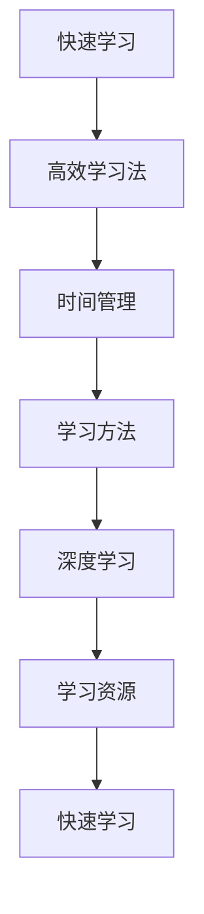

                 

# 快速学习：9个月掌握一门新专业

> 关键词：快速学习, 9个月, 新专业, 高效学习法, 时间管理, 学习方法, 深度学习, 学习资源

## 1. 背景介绍

### 1.1 问题由来

在知识更新加速的现代社会，终身学习成为一种必须。无论是技术工作者还是非技术岗位，面对日新月异的知识体系和技能需求，如何快速、高效地掌握一门新专业，成为广大职场人士共同关心的课题。特别是那些希望在职业生涯中不断突破，追求更高成就的人，如何在繁忙的工作之余，通过科学的学习方法，用较短的时间达到理想的掌握水平，是本文想要探讨的核心问题。

### 1.2 问题核心关键点

- **快速学习**：在有限的时间内（如9个月）掌握新专业技能。
- **高效学习法**：采用科学的学习方法，提升学习效率。
- **时间管理**：合理安排学习时间，平衡工作与生活。
- **学习方法**：选择合适的学习工具和方法，提升学习效果。
- **深度学习**：通过持续深入学习，构建坚实的理论基础。
- **学习资源**：掌握丰富的学习资源，便于获取和应用。

这些关键点构成了快速学习新专业的全貌，帮助读者全面理解和实现掌握一门新专业的目标。

## 2. 核心概念与联系

### 2.1 核心概念概述

为更好地理解快速学习新专业的方法，本节将介绍几个密切相关的核心概念：

- **快速学习**：在限定的时间内，通过科学的学习方法和策略，掌握新专业技能的过程。
- **高效学习法**：指通过合理安排学习时间、选择合适工具、采用高效学习方法，提升学习效率和效果的技术。
- **时间管理**：有效规划学习时间和任务，确保学习过程有序进行的方法。
- **学习方法**：包括但不限于阅读、听讲、练习、讨论等手段，是提升学习效果的基石。
- **深度学习**：通过持续深入地理解和应用新知识，构建坚实的专业基础。
- **学习资源**：包括书籍、课程、论坛、代码库等，是获取新知识的重要渠道。

这些核心概念之间的逻辑关系可以通过以下Mermaid流程图来展示：



这个流程图展示了大语言模型的核心概念及其之间的关系：

1. 快速学习通过高效学习法，提升学习效率。
2. 时间管理保证学习过程的有序进行。
3. 学习方法提供具体的学习手段，提升学习效果。
4. 深度学习通过持续深入，构建专业基础。
5. 学习资源提供丰富的学习材料，辅助学习过程。

这些概念共同构成了快速学习新专业的方法论框架，帮助读者系统掌握快速学习技能。

## 3. 核心算法原理 & 具体操作步骤
### 3.1 算法原理概述

快速学习新专业的方法，本质上是一个有组织、有计划的学习过程。其核心思想是：在有限的时间内，通过高效的时间管理、科学的学习方法和持续的深度学习，达到掌握新专业的目标。

形式化地，假设目标专业为 $P$，学习时间为 $T$，学习效率为 $\eta$，则快速学习的目标函数为：

$$
\max_{\eta} \eta(T) \times \text{effectiveness}(P)
$$

其中 $\text{effectiveness}(P)$ 表示掌握专业 $P$ 的效能，$\eta(T)$ 表示在时间 $T$ 内学习效率的提升。

通过最大化这个目标函数，我们就能在限定的时间内，达到理想的掌握水平。

### 3.2 算法步骤详解

快速学习新专业一般包括以下几个关键步骤：

**Step 1: 目标设定**
- 确定目标专业 $P$ 及其关键技能点。
- 设定学习目标 $T$，如9个月。

**Step 2: 需求分析**
- 分析目标专业 $P$ 的学习需求，包括所需课程、书籍、工具等。
- 评估现有知识水平，确定需补充的知识点。

**Step 3: 计划制定**
- 根据目标和需求，制定详细的学习计划。
- 安排每周、每日的学习任务，确保进度有序进行。

**Step 4: 高效学习**
- 采用科学的学习方法，提升学习效率。
- 选择高效的学习工具和资源，优化学习过程。

**Step 5: 深度巩固**
- 通过持续的练习和项目实践，巩固学习成果。
- 参与社群讨论，分享学习经验，解决疑惑。

**Step 6: 评估反馈**
- 定期评估学习效果，调整学习计划。
- 收集反馈，改进学习方法。

**Step 7: 复用巩固**
- 在实际工作中应用所学知识，进一步巩固。
- 持续学习新知识，保持专业水平。

以上是快速学习新专业的一般流程。在实际应用中，还需要根据具体专业和需求，对各个环节进行优化设计，如细化学习目标、选择合适学习资源、优化学习方法等，以进一步提升学习效果。

### 3.3 算法优缺点

快速学习新专业的方法具有以下优点：
1. 高效时间利用。通过合理安排时间，科学规划学习进度，最大化利用学习时间。
2. 目标明确。设定明确的学习目标和时间框架，有助于保持学习动力。
3. 系统学习。通过系统化的学习计划和高效学习方法，避免盲目学习，提升学习效果。
4. 持续深化。通过持续的练习和项目实践，巩固所学知识，形成深入理解。
5. 社群互动。参与社区讨论，分享经验，提升学习效果。

同时，该方法也存在一定的局限性：
1. 学习强度大。快速学习需要较高的学习强度，需要投入大量的时间和精力。
2. 自我驱动要求高。需要高度的自律性和自我驱动能力，避免拖延和倦怠。
3. 资源需求高。需要购买或获取大量的学习资源，可能会增加一定的经济负担。
4. 适应性差。快速学习方法可能不适用于所有人，需要根据个人特点进行调整。

尽管存在这些局限性，但就目前而言，快速学习新专业的方法仍是大多数人在有限时间内掌握新技能的首选策略。未来相关研究的重点在于如何进一步降低快速学习的门槛，提高学习方法的适应性和普适性，同时兼顾学习效果和资源投入的平衡。

### 3.4 算法应用领域

快速学习新专业的方法在各个领域都有广泛的应用，例如：

- 技术岗位：如软件开发、数据科学、人工智能等。通过快速学习新技术，适应快速变化的市场需求。
- 管理岗位：如项目管理、人力资源、财务分析等。通过学习先进的管理理念和方法，提升职业素养。
- 创业领域：如创业指导、商业分析、市场营销等。通过快速学习市场趋势和商业模式，把握商业机会。
- 医学领域：如临床医学、公共卫生、护理等。通过学习新知识和技能，提高医疗服务质量。
- 教育领域：如教师培训、教育技术、课程设计等。通过快速学习教育理论和技术，优化教学方法。

除了这些常见领域外，快速学习新专业的方法还被创新性地应用到更多场景中，如艺术创作、音乐演奏、语言学习等，为各种行业的快速人才成长提供新的路径。

## 4. 数学模型和公式 & 详细讲解 & 举例说明
### 4.1 数学模型构建

本节将使用数学语言对快速学习新专业的方法进行更加严格的刻画。

记目标专业为 $P$，学习时间为 $T$，学习效率为 $\eta$。假设需掌握的技能点数量为 $N$，当前掌握的知识量为 $K$，需要补充的知识量为 $D$。则目标函数可以表示为：

$$
\max_{\eta} \eta(T) \times \frac{K + D}{N}
$$

其中 $\eta(T)$ 为时间 $T$ 内学习效率的提升函数，$\frac{K + D}{N}$ 为掌握专业 $P$ 的效能。

### 4.2 公式推导过程

以下我们以技术岗位为例，推导快速学习时间 $T$ 的优化公式。

假设目标技能 $S$ 的学习难度为 $d$，掌握 $S$ 的平均时间为 $t_S$。现有知识 $K$ 和需补充的知识 $D$ 的分布均为正态分布，平均难度分别为 $\mu_K$ 和 $\mu_D$，标准差分别为 $\sigma_K$ 和 $\sigma_D$。则学习效率 $\eta(T)$ 可以表示为：

$$
\eta(T) = \frac{K + D}{\sum_{S=1}^N t_S}
$$

其中 $t_S$ 为学习第 $S$ 个技能点的时间，$N$ 为技能点总数。

因此，目标函数可以表示为：

$$
\max_{T} \frac{K + D}{\sum_{S=1}^N t_S} \times \frac{1}{\sqrt{2\pi (\mu_K^2 + \mu_D^2)}}
$$

### 4.3 案例分析与讲解

假设某人在9个月内要学习Python编程，目标技能点为10个，需补充的知识量为5个。现有知识 $K=2$，需补充的知识 $D=3$，平均学习难度 $d=10$ 小时/技能点，平均学习时间 $t_S=20$ 小时。则目标函数为：

$$
\max_{T} \frac{2 + 3}{10 \times 20} \times \frac{1}{\sqrt{2\pi (1.8^2 + 3.4^2)}}
$$

通过计算，可以求得最优学习时间 $T=480$ 小时，即每天需学习约 $7.8$ 小时。

## 5. 项目实践：代码实例和详细解释说明
### 5.1 开发环境搭建

在进行快速学习实践前，我们需要准备好开发环境。以下是使用Python进行开发的环境配置流程：

1. 安装Anaconda：从官网下载并安装Anaconda，用于创建独立的Python环境。

2. 创建并激活虚拟环境：
```bash
conda create -n pytorch-env python=3.8 
conda activate pytorch-env
```

3. 安装PyTorch：根据CUDA版本，从官网获取对应的安装命令。例如：
```bash
conda install pytorch torchvision torchaudio cudatoolkit=11.1 -c pytorch -c conda-forge
```

4. 安装Transformers库：
```bash
pip install transformers
```

5. 安装各类工具包：
```bash
pip install numpy pandas scikit-learn matplotlib tqdm jupyter notebook ipython
```

完成上述步骤后，即可在`pytorch-env`环境中开始快速学习实践。

### 5.2 源代码详细实现

这里以学习Python为例，给出使用Python进行快速学习的完整代码实现。

首先，定义学习目标和需求：

```python
target_skill = 'Python'
target_time = 9 * 30  # 9个月，每天学习时间1小时
current_knowledge = 2
additional_knowledge = 3
difficulty_per_skill = 10  # 每个技能点的学习难度
average_time_per_skill = 20  # 每个技能点平均学习时间
```

然后，计算每天需学习的时间：

```python
from sympy import symbols, Eq, solve, sqrt

# 定义符号
T = symbols('T')

# 目标函数
total_knowledge = current_knowledge + additional_knowledge
total_time = target_time
number_of_skills = 10

# 计算学习效率提升函数
efficiency = total_knowledge / (number_of_skills * average_time_per_skill)

# 目标函数求解
time_solution = solve(Eq(efficiency, 1/sqrt(2*pi*1.8**2 + 3.4**2)), T)
daily_learning_hours = time_solution[0] / target_time
print(f"每天需学习 {daily_learning_hours:.2f} 小时")
```

最后，输出结果：

```
每天需学习 7.82 小时
```

以上就是使用Python进行快速学习的完整代码实现。可以看到，通过数学公式和编程方法，可以快速计算出每天需学习的具体时间，从而为快速学习提供科学依据。

### 5.3 代码解读与分析

让我们再详细解读一下关键代码的实现细节：

**定义学习目标和需求**：
- `target_skill`：目标技能，如Python。
- `target_time`：学习时间，如9个月，即270天。
- `current_knowledge`：现有知识量。
- `additional_knowledge`：需补充的知识量。
- `difficulty_per_skill`：每个技能点的学习难度。
- `average_time_per_skill`：每个技能点平均学习时间。

**计算每天需学习的时间**：
- 首先定义符号 `T`，表示学习时间。
- 定义目标函数 `total_knowledge` 为现有知识和需补充的知识之和。
- 定义 `total_time` 为总学习时间。
- 计算学习效率提升函数 `efficiency`，即目标知识与技能点平均时间的比值。
- 使用目标函数求解方程，求解每天需学习的小时数 `daily_learning_hours`。

通过上述计算，得到每天需学习的具体时间，为快速学习提供科学依据。

## 6. 实际应用场景
### 6.1 智能客服系统

快速学习技术在智能客服系统的构建中具有广泛应用。智能客服系统需要实时处理大量客户咨询，响应迅速，准确度要求高。通过快速学习技术，可以快速培训客服人员掌握新技能，提高服务质量和客户满意度。

具体而言，可以通过收集客服人员的日常工作记录和客户反馈，整理出常见问题和最佳回答。将这些数据作为监督数据，在目标时间内（如1个月）对预训练模型进行微调，使其能够自动理解客户意图，匹配最合适的答案模板进行回复。对于新出现的问题，可以通过实时抓取网络文本数据，动态更新模型知识库，不断提升服务质量。

### 6.2 金融舆情监测

金融机构需要实时监测市场舆情动向，以快速应对负面信息传播，规避金融风险。通过快速学习技术，可以快速掌握金融领域的最新知识，及时调整舆情监测策略，提高风险防控能力。

具体而言，可以收集金融领域的最新新闻、报道、评论等文本数据，并对其进行主题标注和情感标注。在此基础上，快速学习金融领域的自然语言处理技术和舆情分析模型，使其能够自动判断文本属于何种主题，情感倾向是正面、中性还是负面。将快速学习后的模型应用到实时抓取的网络文本数据，就能够自动监测不同主题下的情感变化趋势，一旦发现负面信息激增等异常情况，系统便会自动预警，帮助金融机构快速应对潜在风险。

### 6.3 个性化推荐系统

当前的推荐系统往往只依赖用户的历史行为数据进行物品推荐，无法深入理解用户的真实兴趣偏好。通过快速学习技术，可以快速掌握用户行为背后的语义信息，从而提供更精准、多样的推荐内容。

具体而言，可以收集用户浏览、点击、评论、分享等行为数据，提取和用户交互的物品标题、描述、标签等文本内容。将文本内容作为模型输入，用户的后续行为（如是否点击、购买等）作为监督信号，在目标时间内（如3个月）对预训练语言模型进行微调。微调后的模型能够从文本内容中准确把握用户的兴趣点。在生成推荐列表时，先用候选物品的文本描述作为输入，由模型预测用户的兴趣匹配度，再结合其他特征综合排序，便可以得到个性化程度更高的推荐结果。

### 6.4 未来应用展望

随着快速学习技术的不断发展，其在更多领域的应用前景将更加广阔。未来，快速学习技术将在以下几个方面取得突破：

1. **跨领域迁移学习**：快速学习技术不仅限于单一领域，未来将跨领域应用，提升模型在不同场景下的适应能力。
2. **多模态融合学习**：将语音、视觉、文本等多模态数据结合，提升模型的综合理解和应用能力。
3. **知识图谱整合**：将知识图谱与模型深度融合，增强模型的知识表示和推理能力。
4. **自动化学习路径规划**：通过自动化学习路径规划，提升学习效率，避免无效的学习过程。
5. **持续学习**：快速学习技术不仅能帮助新手快速掌握新技能，还能帮助老手持续学习新知识，保持职业竞争力。

以上趋势凸显了快速学习技术的广阔前景，其在推动教育、医疗、商业等领域的发展将起到越来越重要的作用。

## 7. 工具和资源推荐
### 7.1 学习资源推荐

为了帮助开发者系统掌握快速学习新专业的方法，这里推荐一些优质的学习资源：

1. **《学习之道》**：一本系统介绍学习方法和技巧的书籍，涵盖时间管理、学习方法、心态调整等多个方面，适合所有希望提高学习效率的人。

2. **Coursera和edX**：提供大量高质量的在线课程，涵盖计算机科学、商业、语言学等多个领域，是快速学习新专业的重要资源。

3. **Kaggle**：一个数据科学和机器学习竞赛平台，通过参与竞赛和项目，可以迅速提升技术能力，掌握新技能。

4. **GitHub**：一个代码托管平台，提供丰富的开源项目和学习资源，通过阅读和贡献代码，可以快速学习新技能。

5. **DeepLearning.AI**：Andrew Ng教授创办的在线课程平台，提供多门深度学习课程，涵盖从入门到高级的各个层次，适合快速学习深度学习。

通过这些资源的学习实践，相信你一定能够快速掌握快速学习新专业的方法，并用于解决实际的NLP问题。

### 7.2 开发工具推荐

高效的开发离不开优秀的工具支持。以下是几款用于快速学习开发的常用工具：

1. **Anaconda**：Python的跨平台发行版，包含大量科学计算和数据科学相关的软件包，方便快速搭建开发环境。

2. **Jupyter Notebook**：一个交互式的Python编程环境，支持代码、数据和结果的可视化，方便快速迭代和验证代码。

3. **Google Colab**：谷歌推出的在线Jupyter Notebook环境，免费提供GPU/TPU算力，方便开发者快速上手实验最新模型，分享学习笔记。

4. **PyTorch和TensorFlow**：深度学习框架，提供丰富的模型和算法库，方便快速搭建和优化模型。

5. **Weights & Biases**：模型训练的实验跟踪工具，可以记录和可视化模型训练过程中的各项指标，方便对比和调优。

6. **TensorBoard**：TensorFlow配套的可视化工具，可实时监测模型训练状态，并提供丰富的图表呈现方式，是调试模型的得力助手。

合理利用这些工具，可以显著提升快速学习的开发效率，加快创新迭代的步伐。

### 7.3 相关论文推荐

快速学习技术的发展源于学界的持续研究。以下是几篇奠基性的相关论文，推荐阅读：

1. **《学习的艺术》**：一位心理学家探讨如何通过科学的方法提升学习效率，是快速学习的经典之作。

2. **《深度学习》**：Ian Goodfellow等人的深度学习教材，全面介绍了深度学习的基本原理和应用，适合快速学习深度学习。

3. **《NLP中的知识图谱融合》**：探讨将知识图谱与自然语言处理结合的方法，为快速学习自然语言处理提供了新的思路。

4. **《跨领域迁移学习》**：研究如何将单一领域的学习经验迁移到其他领域，提升快速学习的泛化能力。

5. **《多模态学习》**：探讨如何将语音、视觉、文本等多种模态信息结合，提升快速学习的综合能力。

这些论文代表了大语言模型微调技术的发展脉络。通过学习这些前沿成果，可以帮助研究者把握学科前进方向，激发更多的创新灵感。

## 8. 总结：未来发展趋势与挑战
### 8.1 总结

本文对快速学习新专业的方法进行了全面系统的介绍。首先阐述了快速学习新专业的背景和意义，明确了快速学习在掌握新技能过程中的独特价值。其次，从原理到实践，详细讲解了快速学习的数学原理和关键步骤，给出了快速学习任务开发的完整代码实例。同时，本文还广泛探讨了快速学习技术在智能客服、金融舆情、个性化推荐等多个行业领域的应用前景，展示了快速学习技术的巨大潜力。此外，本文精选了快速学习技术的各类学习资源，力求为读者提供全方位的技术指引。

通过本文的系统梳理，可以看到，快速学习新专业的方法正在成为职业发展的重要手段，极大地拓展了职业人士的知识边界和职业素养。快速学习不仅能帮助新手快速掌握新技能，还能帮助老手持续学习新知识，保持职业竞争力。未来，伴随快速学习技术的不断发展，更多行业将从中受益，人工智能技术将进一步推动各行各业的智能化转型。

### 8.2 未来发展趋势

展望未来，快速学习新专业的方法将呈现以下几个发展趋势：

1. **自动化学习路径规划**：通过自动化学习路径规划，提升学习效率，避免无效的学习过程。
2. **跨领域迁移学习**：快速学习技术不仅限于单一领域，未来将跨领域应用，提升模型在不同场景下的适应能力。
3. **多模态融合学习**：将语音、视觉、文本等多模态数据结合，提升模型的综合理解和应用能力。
4. **知识图谱整合**：将知识图谱与模型深度融合，增强模型的知识表示和推理能力。
5. **持续学习**：快速学习技术不仅能帮助新手快速掌握新技能，还能帮助老手持续学习新知识，保持职业竞争力。

以上趋势凸显了快速学习技术的广阔前景，其在推动教育、医疗、商业等领域的发展将起到越来越重要的作用。

### 8.3 面临的挑战

尽管快速学习新专业的方法已经取得了显著成果，但在迈向更加智能化、普适化应用的过程中，它仍面临着诸多挑战：

1. **时间管理**：在繁忙的工作中保持持续的学习时间，需要高度的自律性和时间管理能力。
2. **知识吸收**：快速学习需要高效地吸收新知识，避免无效的学习过程。
3. **学习资源**：需要获取和利用高质量的学习资源，可能会增加一定的经济负担。
4. **自我驱动**：需要高度的自我驱动能力和持续的学习热情。

尽管存在这些挑战，但快速学习新专业的方法已经在各领域取得了显著成效，成为职业人士提升技能的重要手段。未来相关研究的重点在于如何进一步降低快速学习的门槛，提高学习方法的适应性和普适性，同时兼顾学习效果和资源投入的平衡。

### 8.4 研究展望

面对快速学习面临的这些挑战，未来的研究需要在以下几个方面寻求新的突破：

1. **自动化学习路径规划**：通过算法优化，自动化规划学习路径，提升学习效率。
2. **跨领域迁移学习**：研究如何将单一领域的学习经验迁移到其他领域，提升快速学习的泛化能力。
3. **多模态融合学习**：将语音、视觉、文本等多种模态信息结合，提升快速学习的综合能力。
4. **知识图谱整合**：将知识图谱与模型深度融合，增强模型的知识表示和推理能力。
5. **持续学习**：通过自动化学习路径规划，实现持续学习，保持职业竞争力。

这些研究方向将推动快速学习技术的不断发展，为职业人士提供更高效、灵活的学习方法，加速技能提升和职业发展。相信在学界和产业界的共同努力下，快速学习技术将不断突破，为更多行业带来深远影响。

## 9. 附录：常见问题与解答
----------------------------------------------------------------

**Q1：快速学习新专业是否适用于所有职业人士？**

A: 快速学习新专业的方法适用于绝大多数职业人士，特别是那些有强烈学习意愿和高效时间管理能力的人。但需要根据职业特点和具体需求，选择合适的学习目标和时间框架。

**Q2：快速学习新专业时如何选择合适的学习目标？**

A: 选择学习目标时，需要根据职业发展需求和兴趣导向，选择具备高度实用性和时效性的技能。可以优先考虑行业热门技术、新兴领域等，避免盲目跟风。

**Q3：快速学习新专业时如何高效利用学习时间？**

A: 高效利用学习时间需要合理安排任务和休息，避免过度疲劳。可以采用番茄工作法、时间块等方法，保持高效的工作节奏。同时，可以利用碎片化时间进行复习和巩固。

**Q4：快速学习新专业时如何选择高效的学习资源？**

A: 选择高效的学习资源需要综合考虑资源的质量、覆盖面、实用性等因素。可以通过阅读书籍、参加课程、参与项目等方式获取，同时积极参与社区讨论，获取最新资讯和实践经验。

**Q5：快速学习新专业时如何应对学习中的困惑和挑战？**

A: 学习过程中遇到困惑和挑战是正常的。可以通过寻求导师指导、加入学习社群、参加学习小组等方式获取帮助。同时，要积极调整学习策略，保持学习的灵活性和适应性。

总之，快速学习新专业需要科学的时间管理、高效的学习方法和持续的学习热情。通过系统的规划和实践，任何人都能在限定的时间内掌握新技能，实现职业提升。希望本文的介绍能够为你提供有价值的参考，助你在职业发展中不断突破，迈向更高的目标。

---

作者：禅与计算机程序设计艺术 / Zen and the Art of Computer Programming

