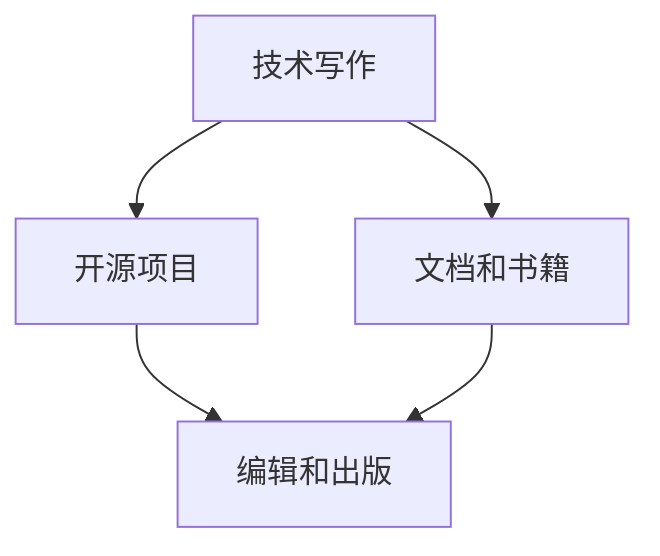

                 

# 技术作家之路：从开源项目到出版技术书籍

在当今这个信息爆炸的时代，技术的传播和共享变得前所未有的重要。技术作家通过写作和分享，让复杂的技术知识变得通俗易懂，让更多人能够理解和应用。本文将系统地介绍技术作家如何从开源项目起步，逐步积累经验，最终出版自己的技术书籍。我们将围绕技术作家的成长路径，深入剖析技术作家的核心技能、工具、资源、以及面临的挑战。

## 1. 背景介绍

### 1.1 技术作家重要性

技术作家作为技术知识传播的桥梁，扮演着举足轻重的角色。他们通过撰写博客、文档、书籍等形式，将复杂的技术原理、实践经验、前沿趋势等内容，传递给广大的开发者和技术爱好者。无论你是科技公司的一线开发者，还是研究机构的高阶专家，或是热爱技术的自由职业者，掌握技术作家技能都将成为你的重要竞争力。

### 1.2 技术作家范式演进

从早期的技术博客、开源文档到现代的技术书籍，技术作家的创作形式和内容不断演进，展现了技术传播的广泛应用和深度发展。技术博客简洁直接，适合分享个人心得和技术技巧；开源文档详细全面，助力开发者协作开发；技术书籍系统深入，为读者提供体系化的知识。

## 2. 核心概念与联系

### 2.1 核心概念概述

为更好地理解技术作家的成长路径，本节将介绍几个密切相关的核心概念：

- **技术写作**：通过文字、图像、代码等形式，将技术知识传递给他人的过程。
- **开源项目**：在开放源代码许可下，公开可访问、修改和分发的软件项目。
- **GitHub**：全球最大的开源代码托管平台，支持版本控制、协作开发等功能。
- **文档和书籍**：结构化、系统化的技术内容，供读者学习参考。
- **编辑和出版**：将技术写作成果整理、校对、排版，转化为可出版的文档或书籍。

这些核心概念之间的逻辑关系可以通过以下Mermaid流程图来展示：



这个流程图展示了几者之间的关联关系：

1. 技术写作是技术作家成长的基础，从开源项目获取实践经验。
2. 开源项目为技术作家提供了丰富的学习资源和协作机会。
3. 通过技术写作积累的内容，进一步出版成系统化的文档和书籍。
4. 编辑和出版是将技术写作成果转化为专业作品的关键步骤。

这些概念共同构成了技术作家成长和知识传播的框架，使其能够高效地将技术知识传递给广大读者。

## 3. 核心算法原理 & 具体操作步骤

### 3.1 算法原理概述

技术作家的成长路径和技术作家的写作流程，都可以用算法来描述。其核心思想是：将技术写作视为一个不断迭代优化的过程，通过开源项目积累实践经验，通过文档和书籍系统化传播知识，通过编辑和出版提升作品质量。

形式化地，假设技术作家在时间 $t$ 时的技能水平为 $S(t)$，写作数量为 $W(t)$，出版的书籍数量为 $B(t)$。则技术作家的成长模型可以表示为：

$$
S(t+1) = S(t) + f(W(t), B(t))
$$

其中，$f$ 表示技能提升的函数，受到写作量和出版量的影响。

### 3.2 算法步骤详解

技术作家的成长路径包括以下几个关键步骤：

**Step 1: 学习与实践**

- 通过学习编程、阅读技术书籍、参与开源项目，积累技术知识和实践经验。
- 在GitHub等平台上积极贡献代码、文档、笔记，记录学习过程和解决问题的方法。

**Step 2: 写作与分享**

- 将学习心得、项目经验、技术总结撰写成博客、文章、技术文档等，发布到技术社区。
- 通过社交媒体、博客平台、技术论坛等渠道，分享技术知识和心得，扩大影响力。

**Step 3: 编辑与优化**

- 对撰写的内容进行整理、校对、排版，形成系统化的技术文档或书籍。
- 邀请同行专家、编辑、技术博主等进行审阅和反馈，不断优化内容质量。

**Step 4: 出版与传播**

- 将编辑好的文档或书籍提交到出版社或自出版的平台进行审核和出版。
- 利用线上线下的各种渠道进行推广，包括技术论坛、社交媒体、书籍发布会等。

### 3.3 算法优缺点

技术作家成长路径和方法具有以下优点：

1. **实践导向**：通过开源项目和实际问题的解决，积累丰富的技术实践经验。
2. **知识传播**：技术写作和分享帮助开发者学习和交流，提升社区的技术水平。
3. **自我提升**：通过出版书籍，技术作家可以系统化地梳理知识，巩固自身技能。
4. **持续改进**：不断获取反馈和改进，使得技术作家的写作和出版能力持续提升。

同时，该方法也存在一定的局限性：

1. **时间成本高**：从实践到写作再到出版，需要大量的时间和精力投入。
2. **初期困难**：技术作家的起点和经验积累影响写作质量和影响力。
3. **市场竞争**：技术书籍市场竞争激烈，技术作家需要找到独特的切入点。
4. **平台限制**：不同平台对技术内容的发布规则和用户群体不同，需灵活应对。

尽管存在这些局限性，但就目前而言，技术作家成长路径和方法仍是大规模技术知识传播的重要范式。未来相关研究的重点在于如何进一步降低技术作家的入门门槛，提高写作效率，同时兼顾内容的深度和广度，确保技术传播的准确性和及时性。

### 3.4 算法应用领域

技术作家的成长方法和写作技巧在多个领域都得到了应用：

- **软件开发**：技术博客、开源文档、API文档等帮助开发者快速学习和上手新工具。
- **数据科学**：数据科学书籍、机器学习教程、Kaggle竞赛报告等促进知识传播和经验分享。
- **云计算**：云服务文档、使用指南、社区讨论等提升云计算技术的应用和普及。
- **人工智能**：AI技术论文、教程、实战项目等推动人工智能技术的普及和落地。
- **区块链**：区块链技术书籍、项目代码、白皮书等提升区块链应用的安全和普及。

## 4. 数学模型和公式 & 详细讲解 & 举例说明

### 4.1 数学模型构建

本节将使用数学语言对技术作家的成长路径进行更加严格的刻画。

记技术作家的技能水平为 $S(t)$，写作数量为 $W(t)$，出版的书籍数量为 $B(t)$。技术作家的成长模型可以表示为：

$$
S(t+1) = S(t) + f(W(t), B(t))
$$

其中，$f$ 表示技能提升的函数，受到写作量和出版量的影响。假设 $f$ 为一个线性函数，则有：

$$
f(W(t), B(t)) = \alpha W(t) + \beta B(t)
$$

其中 $\alpha$ 和 $\beta$ 为技能提升的系数，依赖于技术作家的经验和偏好。

### 4.2 公式推导过程

假设技术作家的技能提升系数 $\alpha = 0.5$，出版系数 $\beta = 0.8$。根据上述模型，技术作家的技能提升率可以表示为：

$$
\frac{dS(t)}{dt} = 0.5W(t) + 0.8B(t)
$$

通过对方程进行积分，可以得到技术作家技能随时间变化的累积增长率：

$$
S(t) = S_0 + 0.5\int W(t)dt + 0.8\int B(t)dt
$$

其中 $S_0$ 为技术作家初始的技能水平。

### 4.3 案例分析与讲解

假设技术作家初始技能水平 $S_0 = 50$，写作量 $W(t)$ 和出版量 $B(t)$ 随时间变化如下：

- $W(t)$：每月撰写5篇技术博客，第1年共60篇，第2年共72篇。
- $B(t)$：第一年出版1本技术书籍，第2年出版2本技术书籍。

将上述数据代入模型，计算技术作家的技能水平变化如下：

- 第1年末，$S(12) = 50 + 0.5 \times 60 + 0.8 \times 1 = 61$
- 第2年末，$S(24) = 61 + 0.5 \times 72 + 0.8 \times 2 = 79.6$

可以看出，技术作家通过持续的写作和出版，技能水平显著提升。

## 5. 项目实践：代码实例和详细解释说明

### 5.1 开发环境搭建

在进行技术写作和出版前，我们需要准备好开发环境。以下是使用Python进行Markdown开发的环境配置流程：

1. 安装Anaconda：从官网下载并安装Anaconda，用于创建独立的Python环境。

2. 创建并激活虚拟环境：
```bash
conda create -n markdown-env python=3.8 
conda activate markdown-env
```

3. 安装必要的工具包：
```bash
pip install markdown pygments sphinx-rtd-theme sphinx
```

4. 安装GitHub工具：
```bash
pip install gitpython
```

完成上述步骤后，即可在`markdown-env`环境中开始技术写作和出版的准备工作。

### 5.2 源代码详细实现

下面以编写一个简单的技术博客为例，展示如何使用Markdown和Sphinx进行文档编辑和出版。

首先，创建一个Markdown文件，命名为`blog.md`：

```markdown
# 技术博客标题

这是技术博客的正文内容，包含代码块、标题、列表、引用等元素。

```python
def hello_world():
    print("Hello, World!")
```

将上述代码保存为`blog.md`文件。

接着，创建一个Sphinx配置文件，命名为`sphinx_config.py`，配置相关参数：

```python
import os
import sys

def setup(app):
    app.add_css_file('style.css')
    app.add_js_file('script.js')
    app.add_css_file(os.path.join(app.srcdir, 'readthedocs', 'css', 'ipynb.js'))
    app.add_js_file(os.path.join(app.srcdir, 'readthedocs', 'js', 'readthedocs.js'))
    app.add_css_file(os.path.join(app.srcdir, 'readthedocs', 'css', 'readthedocs.css'))
```

然后，创建一个Sphinx项目文件夹，包含`Makefile`和`conf.py`文件：

```
conf.py:
from sphinx.ext.autodoc import setup as autodoc_setup

def setup(app):
    app.add_css_file('style.css')
    app.add_js_file('script.js')
    app.add_css_file(os.path.join(app.srcdir, 'readthedocs', 'css', 'ipynb.js'))
    app.add_js_file(os.path.join(app.srcdir, 'readthedocs', 'js', 'readthedocs.js'))
    app.add_css_file(os.path.join(app.srcdir, 'readthedocs', 'css', 'readthedocs.css'))
    autodoc_setup(app, default_role='programlist')
    app.add_css_file(os.path.join(app.srcdir, 'readthedocs', 'css', 'install.css'))

Makefile:
# sphinx-build 生成的 html 目录
html:
    sphinx-build -b html -d docs/doctrees -p mkdocs -P docs/doctrees/ build/html

clean:
    rm -rf build/html
```

最后，在命令行中执行以下命令进行出版：

```bash
sphinx-build -b html -d docs/doctrees -p markdown-env build/html
```

执行成功后，即可在`build/html`目录下生成出版后的技术博客。

### 5.3 代码解读与分析

让我们再详细解读一下关键代码的实现细节：

**Markdown文件**：
- 使用Markdown语法编写技术博客，包含标题、段落、代码块、列表等元素，适合在GitHub、Medium等平台发布。

**Sphinx配置文件**：
- 定义Sphinx项目所需的样式和脚本文件，优化页面加载速度和用户体验。

**Makefile**：
- 定义Sphinx项目的构建命令，包括生成HTML文档和清理已生成文档等操作。

通过这些工具和文件，技术作家可以高效地编辑和出版技术博客，不断提升自己的影响力和传播力。

## 6. 实际应用场景

### 6.1 开源项目贡献

技术作家通常从开源项目开始积累经验。通过参与开源项目，技术作家可以获得实践经验，并认识行业专家，这对后续的写作和出版大有裨益。

在实际工作中，技术作家可以通过以下方式进行开源项目贡献：

- **代码贡献**：在GitHub上搜索感兴趣的项目，参与其中的代码提交和修复。
- **文档贡献**：撰写项目文档，包括README、API文档、使用指南等，提升项目易用性。
- **社区参与**：在项目社区中提出问题、参与讨论，建立行业联系，扩大影响力。

例如，开源项目"NumPy"的文档贡献者，通过编写详尽的文档和使用指南，使得项目更加易于上手，受到了广泛好评。

### 6.2 技术博客和文章

技术博客和文章是技术作家最常用和最直观的传播形式。通过撰写和分享技术文章，技术作家可以展示自己的专业知识和实践经验，建立品牌影响力。

在撰写技术博客时，技术作家可以关注以下几个要点：

- **问题导向**：选择有价值的问题和案例，深入分析并提出解决方案。
- **通俗易懂**：用简洁的语言和生动的示例，让读者易于理解技术原理和应用方法。
- **图片和代码**：配合技术图片和代码示例，帮助读者更直观地理解技术内容。

例如，技术博主"Nikita"通过撰写多篇深度学习相关的技术博客，迅速建立了在AI领域的知名度和影响力。

### 6.3 技术书籍出版

技术书籍是技术作家最为系统化和权威化的传播形式，能够将复杂的知识体系化地呈现给读者。

在出版技术书籍时，技术作家可以关注以下几个要点：

- **选题策划**：选择有市场需求和学术价值的选题，确保书籍的实用性和前瞻性。
- **内容结构**：合理组织书籍章节和内容，确保读者能够系统地学习技术知识。
- **编辑校对**：邀请同行专家、编辑、技术博主等进行审阅和反馈，确保书籍质量。
- **宣传推广**：利用线上线下的各种渠道进行推广，包括技术论坛、社交媒体、书籍发布会等。

例如，"Deep Learning with Python"一书通过深入浅出的内容，详细讲解了深度学习技术，成为深度学习领域的经典教材。

## 7. 工具和资源推荐

### 7.1 学习资源推荐

为了帮助技术作家系统掌握技术写作和出版的技巧，这里推荐一些优质的学习资源：

1. **Coursera《技术写作与出版》课程**：系统讲解技术写作的各个方面，包括选题、写作、编辑、出版等，适合初学者和进阶者。

2. **Medium技术博客**：全球最大的技术内容平台，汇聚了大量优秀的技术博客和文章，提供了丰富的学习资源和灵感。

3. **GitHub文档和开源项目**：GitHub上的文档和开源项目，提供了大量的技术资源和实践经验，帮助技术作家提升技术写作能力。

4. **Sphinx官方文档**：Sphinx的官方文档，详细介绍了Sphinx的各种配置和功能，是技术作家进行文档出版的必备资源。

5. **Markdown手册**：Markdown的官方手册，介绍了Markdown语法的各种用法，是技术作家撰写技术博客的基础。

通过对这些资源的学习实践，相信你一定能够快速掌握技术作家技能，并用于撰写和传播技术知识。

### 7.2 开发工具推荐

高效的工具支持是技术作家撰写和出版的重要保障。以下是几款用于技术写作和出版的常用工具：

1. **GitHub**：全球最大的开源代码托管平台，支持版本控制、协作开发等功能，是技术作家撰写和发布技术博客的常用平台。

2. **Sphinx**：Python文档生成工具，支持Markdown、ReStructuredText等多种格式，是技术作家出版技术书籍的首选工具。

3. **Markdown编辑器**：如Typora、Sublime Text等，支持Markdown语法，适用于快速撰写和编辑技术博客。

4. **Jupyter Notebook**：支持代码和Markdown的交互式编写环境，适合撰写包含代码示例的技术文章。

5. **LaTeX**：专业的排版系统，适用于撰写复杂的技术书籍和学术论文。

6. **GitHub Pages**：GitHub提供的静态网站托管服务，支持自动发布Markdown文件生成的静态网站，适合技术作家的出版和分享。

合理利用这些工具，可以显著提升技术作家的撰写和出版效率，加速知识传播和经验积累。

### 7.3 相关论文推荐

技术作家技能的发展源于学界的持续研究。以下是几篇奠基性的相关论文，推荐阅读：

1. **"Writing with Care: The Design of Document User Interfaces"**：关于文档用户界面设计的经典论文，探讨了技术文档的可读性和易用性。

2. **"Technical Writing and Editing"**：技术写作和编辑领域的经典教材，详细介绍了技术写作的各个方面。

3. **"Writing Technical Documentation That Works"**：关于技术文档编写实践的指导性书籍，提供了大量的实例和建议。

4. **"Technical Writing: An Ever-Changing Profession"**：关于技术写作职业发展的探讨性文章，分析了技术作家的技能需求和发展方向。

5. **"Effective Technical Writing"**：关于技术写作技巧和方法的指导性书籍，提供了大量的实用建议。

这些论文代表了大规模技术知识传播的理论基础，对技术作家的成长和发展具有重要的参考价值。

## 8. 总结：未来发展趋势与挑战

### 8.1 研究成果总结

本文对技术作家的成长路径和技术作家的写作流程进行了全面系统的介绍。首先阐述了技术作家的重要性，明确了技术作家成长路径和技术作家写作流程的各个环节。其次，从原理到实践，详细讲解了技术作家成长路径的数学模型和具体操作步骤。同时，本文还广泛探讨了技术作家在开源项目、技术博客、技术书籍等多个领域的应用前景，展示了技术作家的巨大潜力。

通过本文的系统梳理，可以看到，技术作家技能和写作流程在大规模技术知识传播中扮演着重要角色。技术作家通过开源项目和实际问题的解决，积累丰富的技术实践经验，通过技术写作和分享，传播技术知识和经验，通过出版书籍，系统化地梳理和传播知识。技术作家的成长之路不仅需要技术积累和写作技巧，还需要不断迭代和优化，方能得到理想的效果。

### 8.2 未来发展趋势

展望未来，技术作家的成长方法和写作技巧将呈现以下几个发展趋势：

1. **自动化和智能化**：借助自动化工具和智能算法，提高技术作家的写作效率和质量，减少重复性工作。

2. **多渠道发布**：技术作家将通过多种渠道进行知识传播，如技术博客、开源项目、技术书籍、社交媒体等，进一步扩大影响力。

3. **社区合作**：技术作家将更注重与技术社区的合作，共同推动技术知识的传播和创新。

4. **全球化视野**：技术作家将拥有更广阔的国际视野，参与全球性的技术交流和合作。

5. **技术创新**：技术作家将更关注新兴技术，如AI、区块链、云计算等，推动这些技术的普及和落地。

以上趋势凸显了技术作家技能和写作流程的广阔前景。这些方向的探索发展，必将进一步提升技术作家的写作和出版能力，加速技术知识的传播和应用。

### 8.3 面临的挑战

尽管技术作家技能和写作流程已经取得了瞩目成就，但在迈向更加智能化、普适化应用的过程中，它仍面临着诸多挑战：

1. **时间成本高**：技术写作和出版的各个环节需要大量的时间和精力投入，对技术作家的自律和高效能力提出了更高要求。

2. **内容质量控制**：技术作家需要不断提升内容质量和严谨性，确保技术知识的准确性和及时性。

3. **市场竞争激烈**：技术书籍和博客市场竞争激烈，技术作家需要找到独特的切入点，获得更多读者的关注和认可。

4. **跨领域能力**：技术作家需要具备多领域的知识和技能，才能写出具有深度的技术文章和书籍。

5. **文化差异**：技术作家需要了解不同文化背景下的技术受众需求，提升内容的可读性和包容性。

这些挑战凸显了技术作家技能和写作流程的复杂性和多样性，需要技术作家不断提升自己的综合素质和能力，以应对各种挑战。

### 8.4 研究展望

面对技术作家技能和写作流程所面临的种种挑战，未来的研究需要在以下几个方面寻求新的突破：

1. **自动化工具的开发**：开发更多的自动化工具和智能算法，提高技术作家的写作效率和质量。

2. **内容质量和知识体系的提升**：通过技术教育、知识图谱等手段，提升技术作家的内容质量和知识体系。

3. **多渠道发布和推广**：探索更多多渠道发布和推广的策略，扩大技术作家的影响力。

4. **社区合作和全球化**：加强与技术社区的合作，推动全球性的技术交流和合作。

5. **跨领域技术和文化**：研究跨领域技术和文化融合的方法，提升技术作家的综合素质和能力。

这些研究方向的探索，必将引领技术作家技能和写作流程走向更高的台阶，为构建人机协同的智能系统铺平道路。面向未来，技术作家需要从数据、算法、工程、业务等多个维度协同发力，不断拓展技术知识传播的边界，让技术作家技能和写作流程发挥更大的作用。总之，技术作家技能和写作流程需要在持续创新和优化中，不断提升技术知识传播的效果和影响力。

## 9. 附录：常见问题与解答

**Q1：如何选择合适的技术写作方向？**

A: 技术作家的方向选择需要考虑个人兴趣、市场需求、技术积累等因素。可以从自己擅长的领域出发，如软件开发、数据科学、人工智能等，逐步拓展到其他相关领域。同时，关注技术社区的热门话题和趋势，寻找有价值和前瞻性的选题。

**Q2：技术写作和出版的关键是什么？**

A: 技术写作和出版的关键在于内容的深度和广度，以及传播的准确性和及时性。需要不断提升写作技巧和编辑能力，确保内容的准确性和可读性。同时，利用多种渠道进行传播，扩大影响力。

**Q3：技术作家如何与技术社区互动？**

A: 技术作家可以通过参与技术社区的讨论、提出问题、分享经验等方式进行互动。关注社区的热门话题和技术趋势，积极参与社区活动，提升影响力。

**Q4：技术作家需要哪些核心技能？**

A: 技术作家需要具备编程能力、文档编写能力、编辑校对能力、项目管理能力、社区互动能力等。需要不断提升技术积累和写作技巧，才能写出高质量的技术文章和书籍。

**Q5：技术作家的职业发展前景如何？**

A: 技术作家的职业发展前景广阔，包括技术博客作者、技术书籍作者、技术文档编写者、技术教育者等方向。通过持续学习和实践，技术作家可以逐步提升自己的影响力和职业地位，实现个人价值。

---

作者：禅与计算机程序设计艺术 / Zen and the Art of Computer Programming

