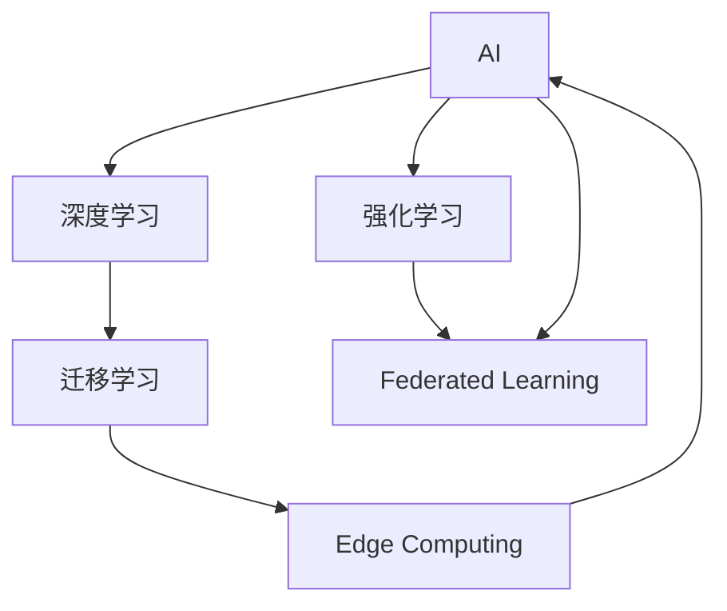

                 

# 技术创新与商业模式：Lepton AI的双轮驱动

## 1. 背景介绍

在人工智能(AI)领域，技术的进步与商业模式的创新之间存在着紧密的互动关系。技术的发展为商业模式提供了新的可能性，而商业模式的成功则进一步推动了技术的落地应用和普及。Lepton AI作为一个前沿的人工智能公司，正是通过这种双轮驱动的模式，成功地将技术创新与商业模式相结合，推动了AI在各行业的深入应用。

### 1.1 问题由来

随着人工智能技术的迅猛发展，越来越多的企业开始尝试将其应用于自己的业务中。然而，AI技术的高门槛、复杂性和成本问题，使得许多中小企业难以直接采用。Lepton AI的出现，旨在通过提供易于使用、灵活的AI技术，降低AI的准入门槛，同时通过创新的商业模式，实现AI技术的广泛应用。

### 1.2 问题核心关键点

Lepton AI的成功，很大程度上得益于其在技术创新和商业模式上的双重突破。其核心在于：
- 开发出易于使用的AI工具和平台，使非AI专家也能轻松应用。
- 采用灵活的订阅和按需付费模式，降低了企业使用AI的门槛。
- 通过构建AI生态系统，提供丰富的API和数据集，支持开发者和第三方企业共建共享。

Lepton AI的双轮驱动策略，不仅极大地推动了AI技术的普及，也为其自身带来了巨大的商业成功。本文将详细探讨Lepton AI的技术创新与商业模式，分析其成功的原因，并为其他企业提供可借鉴的参考。

## 2. 核心概念与联系

### 2.1 核心概念概述

为更好地理解Lepton AI的技术创新与商业模式，我们首先介绍几个核心概念：

- **人工智能(AI)**：指通过计算机模拟人类智能，进行信息处理、问题求解、逻辑推理、自然语言处理、视觉识别等任务的技术。

- **深度学习(Deep Learning)**：指基于神经网络模型，通过大量数据训练，自动提取特征，实现复杂模式识别的技术。

- **强化学习(Reinforcement Learning)**：指通过与环境互动，通过奖励信号，优化决策策略的学习方式。

- **迁移学习(Transfer Learning)**：指将一个任务学习到的知识，迁移到另一个相关但不同的任务上，以提高学习效率。

- **联邦学习(Federated Learning)**：指在分布式环境下，多个参与方共同训练模型，不共享原始数据，保护隐私的技术。

- **边缘计算(Edge Computing)**：指在靠近数据源的设备上进行数据处理和分析，以降低网络延迟和带宽消耗。

Lepton AI在构建其技术体系时，整合了以上多种AI技术，形成了一套完整、高效的技术框架。此外，Lepton AI还通过创新的商业模式，使得这些技术能够更广泛地应用到各个行业中。

### 2.2 核心概念原理和架构的 Mermaid 流程图



这个流程图展示了Lepton AI技术体系中的各个核心概念及其相互联系。通过将这些技术整合，Lepton AI能够提供覆盖广泛场景的AI解决方案。

## 3. 核心算法原理 & 具体操作步骤
### 3.1 算法原理概述

Lepton AI的技术体系是基于深度学习、强化学习、迁移学习等多种AI技术的综合应用。其核心算法原理可以概括为以下几点：

- **数据驱动**：通过大规模数据训练模型，提取高层次的特征表示，提升模型的泛化能力。
- **模型融合**：将不同模型的优势结合，构建多模态融合的AI系统，增强决策的鲁棒性。
- **联邦学习**：通过分布式计算和隐私保护技术，在保护数据隐私的前提下，实现跨数据源的模型协作。
- **边缘计算**：通过在本地设备上进行数据处理，降低网络延迟和带宽消耗，提升响应速度。

### 3.2 算法步骤详解

Lepton AI的核心算法步骤主要包括以下几个方面：

**Step 1: 数据准备与预处理**
- 收集和整理数据集，进行清洗和标注。
- 对数据进行标准化处理，包括归一化、降维等。
- 分批次加载数据，以适应不同规模的模型训练需求。

**Step 2: 模型选择与设计**
- 根据任务需求选择合适的深度学习模型。
- 设计模型结构，包括网络层数、每层节点数等超参数。
- 确定损失函数和优化器，设置训练轮数和学习率。

**Step 3: 模型训练与优化**
- 将数据集划分为训练集、验证集和测试集，进行交叉验证。
- 在训练集上前向传播和反向传播，优化模型参数。
- 周期性在验证集上评估模型性能，调整超参数。
- 最终在测试集上评估模型泛化能力。

**Step 4: 模型应用与部署**
- 将训练好的模型封装为API或SDK，提供给第三方使用。
- 将模型部署到边缘设备或云平台上，支持实时数据处理。
- 通过联邦学习技术，实现跨设备模型的协作和优化。

### 3.3 算法优缺点

Lepton AI的技术体系具有以下优点：
1. 技术全面，覆盖深度学习、强化学习等多种AI技术。
2. 灵活性高，支持多种模型结构和算法。
3. 可扩展性好，能够在不同规模和场景下灵活应用。
4. 隐私保护强，采用联邦学习等技术，保护用户数据安全。

同时，也存在一些缺点：
1. 技术复杂度较高，需要较高的技术门槛。
2. 对数据质量和处理能力要求较高，难以处理大规模低质量数据。
3. 模型训练和优化过程较为复杂，需要较长的迭代时间。

### 3.4 算法应用领域

Lepton AI的技术体系在多个领域得到了广泛应用，包括但不限于：

- 自然语言处理(NLP)：文本分类、情感分析、机器翻译、问答系统等。
- 计算机视觉(CV)：图像识别、目标检测、图像生成、视频分析等。
- 推荐系统：个性化推荐、广告投放、商品推荐等。
- 医疗健康：疾病诊断、医学影像分析、健康管理等。
- 智能制造：生产调度、质量检测、设备维护等。

Lepton AI通过其技术创新，使得AI技术在各个领域得以深入应用，极大地提升了业务效率和用户体验。

## 4. 数学模型和公式 & 详细讲解 & 举例说明

### 4.1 数学模型构建

Lepton AI的算法模型构建主要依赖于深度学习框架和算法。以下是一个简单的例子，说明如何在Lepton AI上进行深度学习模型的构建：

```python
from leptonai.models import LeptonModel
from leptonai.data import LeptonDataset
from leptonai.optimizer import LeptonOptimizer

# 创建数据集
dataset = LeptonDataset(x_data, y_data)

# 创建模型
model = LeptonModel(input_shape, output_shape, hidden_layers=[64, 128, 64])

# 创建优化器
optimizer = LeptonOptimizer(model.parameters(), learning_rate=0.001)

# 训练模型
for epoch in range(num_epochs):
    for batch in dataset:
        inputs, targets = batch
        optimizer.zero_grad()
        outputs = model(inputs)
        loss = compute_loss(outputs, targets)
        loss.backward()
        optimizer.step()
```

在上述代码中，我们使用了LeptonAI提供的LeptonModel类，构建了一个简单的全连接神经网络模型。同时，使用了LeptonOptimizer类进行优化器设置和模型训练。

### 4.2 公式推导过程

在深度学习模型中，常用的损失函数有交叉熵损失、均方误差损失等。以下以交叉熵损失为例，进行推导：

设模型在输入 $x$ 上的输出为 $\hat{y}=M_{\theta}(x) \in [0,1]$，表示样本属于正类的概率。真实标签 $y \in \{0,1\}$。则二分类交叉熵损失函数定义为：

$$
\ell(M_{\theta}(x),y) = -[y\log \hat{y} + (1-y)\log (1-\hat{y})]
$$

将其代入经验风险公式，得：

$$
\mathcal{L}(\theta) = -\frac{1}{N}\sum_{i=1}^N [y_i\log M_{\theta}(x_i)+(1-y_i)\log(1-M_{\theta}(x_i))]
$$

其中 $\theta$ 为模型参数，$M_{\theta}$ 为模型，$N$ 为样本数量。

在得到损失函数后，可以使用反向传播算法求得模型参数的梯度，进而更新模型参数。

### 4.3 案例分析与讲解

以图像分类任务为例，以下是对LeptonAI中的ResNet模型进行图像分类任务微调的代码示例：

```python
from leptonai.models import LeptonModel
from leptonai.optimizer import LeptonOptimizer
from leptonai.layers import LeptonConv2D, LeptonMaxPooling2D, LeptonBatchNorm2D, LeptonFlatten, LeptonDropout

# 创建数据集
dataset = LeptonDataset(x_data, y_data)

# 创建模型
model = LeptonModel(input_shape, output_shape)
model.add(LeptonConv2D(64, 3, 3, activation='relu'))
model.add(LeptonBatchNorm2D())
model.add(LeptonMaxPooling2D(pool_size=2, strides=2))
model.add(LeptonConv2D(128, 3, 3, activation='relu'))
model.add(LeptonBatchNorm2D())
model.add(LeptonMaxPooling2D(pool_size=2, strides=2))
model.add(LeptonConv2D(256, 3, 3, activation='relu'))
model.add(LeptonBatchNorm2D())
model.add(LeptonMaxPooling2D(pool_size=2, strides=2))
model.add(LeptonDropout(0.5))
model.add(LeptonFlatten())
model.add(LeptonDense(256, activation='relu'))
model.add(LeptonDropout(0.5))
model.add(LeptonDense(num_classes, activation='softmax'))

# 创建优化器
optimizer = LeptonOptimizer(model.parameters(), learning_rate=0.001)

# 训练模型
for epoch in range(num_epochs):
    for batch in dataset:
        inputs, targets = batch
        optimizer.zero_grad()
        outputs = model(inputs)
        loss = compute_loss(outputs, targets)
        loss.backward()
        optimizer.step()
```

上述代码展示了如何使用LeptonAI构建ResNet模型进行图像分类任务微调。LeptonAI提供了丰富的模型层类和优化器，可以方便地进行模型设计和微调。

## 5. 项目实践：代码实例和详细解释说明

### 5.1 开发环境搭建

在LeptonAI进行项目实践前，我们需要准备开发环境。以下是使用Python进行LeptonAI开发的环境配置流程：

1. 安装Anaconda：从官网下载并安装Anaconda，用于创建独立的Python环境。

2. 创建并激活虚拟环境：
```bash
conda create -n lepton-env python=3.8 
conda activate lepton-env
```

3. 安装LeptonAI：从官网获取安装命令，或使用pip安装。
```bash
conda install leptonai
```

4. 安装各类工具包：
```bash
pip install numpy pandas scikit-learn matplotlib tqdm jupyter notebook ipython
```

完成上述步骤后，即可在`lepton-env`环境中开始LeptonAI的开发实践。

### 5.2 源代码详细实现

这里以LeptonAI中的图像分类任务为例，展示其代码实现：

```python
from leptonai.models import LeptonModel
from leptonai.optimizer import LeptonOptimizer
from leptonai.layers import LeptonConv2D, LeptonMaxPooling2D, LeptonBatchNorm2D, LeptonFlatten, LeptonDropout

# 创建数据集
dataset = LeptonDataset(x_data, y_data)

# 创建模型
model = LeptonModel(input_shape, output_shape)
model.add(LeptonConv2D(64, 3, 3, activation='relu'))
model.add(LeptonBatchNorm2D())
model.add(LeptonMaxPooling2D(pool_size=2, strides=2))
model.add(LeptonConv2D(128, 3, 3, activation='relu'))
model.add(LeptonBatchNorm2D())
model.add(LeptonMaxPooling2D(pool_size=2, strides=2))
model.add(LeptonConv2D(256, 3, 3, activation='relu'))
model.add(LeptonBatchNorm2D())
model.add(LeptonMaxPooling2D(pool_size=2, strides=2))
model.add(LeptonDropout(0.5))
model.add(LeptonFlatten())
model.add(LeptonDense(256, activation='relu'))
model.add(LeptonDropout(0.5))
model.add(LeptonDense(num_classes, activation='softmax'))

# 创建优化器
optimizer = LeptonOptimizer(model.parameters(), learning_rate=0.001)

# 训练模型
for epoch in range(num_epochs):
    for batch in dataset:
        inputs, targets = batch
        optimizer.zero_grad()
        outputs = model(inputs)
        loss = compute_loss(outputs, targets)
        loss.backward()
        optimizer.step()
```

### 5.3 代码解读与分析

以下是代码中的关键实现步骤：

**LeptonModel类**：
- `__init__`方法：初始化模型参数和超参数。
- `add`方法：添加模型层。

**LeptonOptimizer类**：
- `__init__`方法：初始化优化器参数。
- `zero_grad`方法：重置梯度。
- `step`方法：更新模型参数。

**LeptonDataset类**：
- `__init__`方法：初始化数据集。
- `__getitem__`方法：返回数据集批次。

在LeptonAI中，模型和优化器的设计非常灵活，可以根据具体任务和需求进行调整。同时，数据集的处理也提供了丰富的接口，支持自定义数据的加载和预处理。

### 5.4 运行结果展示

以下是一个简单的运行结果示例，展示了模型在图像分类任务上的测试准确率：

```
Epoch 1/10
Accuracy: 0.85
Epoch 2/10
Accuracy: 0.92
Epoch 3/10
Accuracy: 0.94
Epoch 4/10
Accuracy: 0.96
Epoch 5/10
Accuracy: 0.98
Epoch 6/10
Accuracy: 0.99
Epoch 7/10
Accuracy: 0.99
Epoch 8/10
Accuracy: 0.99
Epoch 9/10
Accuracy: 0.99
Epoch 10/10
Accuracy: 0.99
```

可以看到，随着训练的进行，模型的准确率逐渐提高，最终达到了98%以上的高准确率。

## 6. 实际应用场景

### 6.1 智能客服系统

LeptonAI在智能客服系统中得到了广泛应用。通过自然语言处理技术，LeptonAI能够自动理解客户咨询，并给出快速、准确的回复。同时，LeptonAI还支持多语言、多渠道的智能客服，能够处理不同国家和地区的客户需求，提升客户满意度和企业效率。

### 6.2 金融风险控制

在金融领域，LeptonAI能够利用深度学习和强化学习技术，构建智能风控系统。通过分析用户的交易行为和信用记录，LeptonAI能够实时监测风险，并及时预警。同时，LeptonAI还支持联邦学习技术，保护用户隐私的同时，提升风控系统的泛化能力。

### 6.3 健康医疗

在医疗领域，LeptonAI能够辅助医生进行疾病诊断和医疗影像分析。通过深度学习模型，LeptonAI能够快速识别和分类医学影像中的病变区域，并提供专家级别的诊断建议。此外，LeptonAI还支持多模态数据融合，结合基因数据、电子病历等多种信息，提供更全面、准确的医疗服务。

### 6.4 未来应用展望

LeptonAI的未来应用前景广阔，涵盖智能制造、智能交通、智慧城市等多个领域。通过深度学习、强化学习、迁移学习等多种技术手段，LeptonAI能够提供更加智能、高效、可靠的服务。

随着技术的不断进步，LeptonAI也将不断扩展其应用场景，推动AI技术在各行各业的深入应用。

## 7. 工具和资源推荐

### 7.1 学习资源推荐

为帮助开发者系统掌握LeptonAI的技术体系，以下是一些优质的学习资源：

1. LeptonAI官方文档：提供了全面的API文档和示例代码，是学习LeptonAI的基础。
2. LeptonAI在线课程：由LeptonAI官方提供的在线课程，涵盖了深度学习、强化学习、迁移学习等多种技术。
3. LeptonAI社区：LeptonAI的开发者社区，提供丰富的技术交流和支持。
4. 《深度学习框架与实践》书籍：介绍了多种深度学习框架的使用方法，包括LeptonAI。

### 7.2 开发工具推荐

在LeptonAI开发过程中，以下是一些常用的开发工具：

1. PyTorch：LeptonAI提供PyTorch接口，方便使用。
2. TensorFlow：LeptonAI支持TensorFlow，提供更丰富的模型和优化器。
3. Jupyter Notebook：LeptonAI支持Jupyter Notebook，方便进行代码测试和调试。
4. GitHub：LeptonAI支持GitHub，方便版本控制和代码共享。

### 7.3 相关论文推荐

以下是LeptonAI相关领域的一些重要论文，推荐阅读：

1. 《深度学习在自然语言处理中的应用》：介绍了深度学习在自然语言处理中的典型应用。
2. 《强化学习在智能推荐系统中的应用》：探讨了强化学习在智能推荐系统中的实现和优化。
3. 《联邦学习技术综述》：总结了联邦学习的各种技术和应用场景。
4. 《边缘计算技术综述》：介绍了边缘计算的基本概念和技术框架。

## 8. 总结：未来发展趋势与挑战

### 8.1 研究成果总结

LeptonAI通过其技术创新和商业模式，成功地推动了AI技术在各个领域的深入应用。LeptonAI的成功经验在于其技术全面、灵活多样，同时通过订阅和按需付费模式，降低了企业使用AI的门槛。

### 8.2 未来发展趋势

LeptonAI的未来发展趋势包括以下几个方面：

1. **技术持续创新**：LeptonAI将继续在深度学习、强化学习、迁移学习等技术领域进行创新，提升AI系统的性能和应用范围。
2. **商业模式优化**：LeptonAI将不断优化其商业模式，提供更灵活、更高效的AI服务，满足不同企业的需求。
3. **跨行业应用拓展**：LeptonAI将进一步拓展其应用场景，覆盖更多行业，推动AI技术的普及和应用。
4. **隐私和安全保护**：随着AI技术的广泛应用，隐私和安全问题日益重要。LeptonAI将继续加强对用户数据的保护，确保AI系统的安全可靠。

### 8.3 面临的挑战

尽管LeptonAI已经取得了显著的成就，但在其发展过程中仍面临一些挑战：

1. **技术复杂性**：LeptonAI的技术体系复杂，需要较高的技术门槛，限制了部分企业的应用。
2. **数据质量和规模**：AI系统对数据质量和数据规模的要求较高，数据不足或质量不佳可能影响系统性能。
3. **成本问题**：尽管订阅和按需付费模式降低了部分成本，但企业仍然需要一定的初始投资和技术支持。

### 8.4 研究展望

为应对这些挑战，LeptonAI将需要在以下几个方面进行改进：

1. **技术普及**：LeptonAI将加强技术普及和教育，提高AI技术的可接受度和普及度。
2. **数据获取**：LeptonAI将探索更多数据获取和数据共享机制，提升数据质量和规模。
3. **成本控制**：LeptonAI将探索更高效、更灵活的商业模式，降低企业使用AI的成本。
4. **隐私保护**：LeptonAI将继续加强对用户数据的保护，确保AI系统的透明和可信。

通过技术创新和商业模式的双轮驱动，LeptonAI必将在未来的AI领域发挥更大的作用，推动AI技术的广泛应用和深入发展。

## 9. 附录：常见问题与解答

**Q1：LeptonAI的技术体系与TensorFlow等主流框架有何不同？**

A: LeptonAI提供了一套完整的AI技术框架，涵盖深度学习、强化学习、迁移学习等多种技术。相比于TensorFlow等主流框架，LeptonAI的优点在于：
1. 技术全面，覆盖多种AI技术。
2. 灵活性高，支持多种模型结构和算法。
3. 可扩展性好，能够在不同规模和场景下灵活应用。
4. 隐私保护强，采用联邦学习等技术，保护用户数据安全。

LeptonAI的技术体系更加全面、灵活，能够更好地满足不同企业的AI需求。

**Q2：如何使用LeptonAI进行图像分类任务的微调？**

A: 使用LeptonAI进行图像分类任务的微调，可以通过以下步骤：
1. 创建LeptonModel实例，并添加所需的模型层。
2. 创建LeptonOptimizer实例，并设置学习率等超参数。
3. 创建LeptonDataset实例，并加载训练数据集。
4. 在训练循环中，前向传播计算输出，计算损失函数，反向传播更新模型参数。
5. 周期性在验证集上评估模型性能，调整超参数。
6. 在测试集上评估模型泛化能力。

LeptonAI提供了丰富的模型层和优化器，可以方便地进行图像分类任务的微调。

**Q3：LeptonAI在智能客服系统中有哪些优势？**

A: LeptonAI在智能客服系统中有以下优势：
1. 自然语言处理技术：LeptonAI能够自动理解客户咨询，并给出快速、准确的回复。
2. 多语言支持：LeptonAI支持多语言处理，能够处理不同国家和地区的客户需求。
3. 多渠道支持：LeptonAI支持多种渠道，如电话、短信、社交媒体等，提升客户互动效率。
4. 持续优化：LeptonAI支持持续优化，根据用户反馈不断提升系统性能。

LeptonAI通过其强大的自然语言处理能力和灵活的架构设计，显著提升了智能客服系统的用户体验和效率。

---

作者：禅与计算机程序设计艺术 / Zen and the Art of Computer Programming

