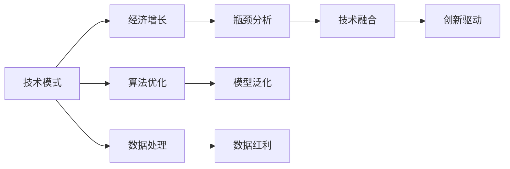

                 

# 技术模式减弱与经济增长瓶颈

## 1. 背景介绍

### 1.1 问题由来
当前，全球经济正处于数字化转型升级的关键阶段，信息技术在各行各业的应用越来越广泛，对经济增长的推动作用愈发凸显。然而，与此同时，我们也发现一些困扰产业发展的新挑战逐渐显现，其中最突出的问题是技术模式减弱，即随着信息技术发展阶段的深入，传统技术驱动经济增长的动力正在减弱，取而代之的是对全新技术范式的探索和应用。

### 1.2 问题核心关键点
技术模式减弱意味着现有的技术路径、发展模式逐渐不再适应新的经济形势，需要探索和实践新的技术范式来推动经济增长。这一现象在以下几个方面尤为明显：

- **数据红利逐渐衰减**：大数据技术的红利期正逐渐过去，数据本身作为核心驱动力的时代正在终结，需要更多数据科学和算法创新来挖掘数据的潜能。
- **计算能力趋于饱和**：现有计算技术如云计算、高性能计算已达到瓶颈，计算能力提升空间有限，需要新的计算模式和架构来突破这一瓶颈。
- **算法瓶颈逐渐显现**：经典机器学习算法在深度和广度上的发展空间受限，需要更加复杂和高级的算法模型来应对复杂的现实问题。
- **模型泛化能力不足**：现有模型往往在特定场景下表现优异，但对新场景的适应能力较弱，需要更多的可解释性和鲁棒性来提升模型的泛化能力。
- **技术融合难度加大**：不同技术间的融合和协同效应逐渐显现，传统的技术组合方式难以满足跨领域的复杂应用需求，需要全新的技术生态系统来支撑。

面对这些挑战，探索和实践新的技术模式和范式，成为推动经济增长的关键。

### 1.3 问题研究意义
研究技术模式减弱与经济增长瓶颈，有助于我们理解信息技术对经济发展的驱动力量，探讨未来的发展路径，为经济增长注入新的动力。具体意义包括：

- **指导未来技术选择**：帮助决策者识别哪些技术具有长期的经济价值，哪些技术需要被淘汰或替换。
- **优化资源配置**：在有限的资源条件下，通过技术模式分析，优化资源的分配和使用，提升技术投资的回报率。
- **促进技术创新**：引导研究者探索新的技术范式和模式，推动技术进步和创新。
- **提高产业竞争力**：帮助企业在激烈的市场竞争中，选择合适的技术模式，提升自身竞争力和市场占有率。
- **支持宏观政策制定**：为政府在制定宏观经济政策时，提供技术模式的分析和参考，促进经济的持续健康发展。

## 2. 核心概念与联系

### 2.1 核心概念概述

为了深入理解技术模式减弱与经济增长瓶颈的问题，本节将介绍几个关键概念：

- **技术模式**：指一种技术框架或架构，描述技术在特定领域中的应用和效果。常见技术模式包括云计算、大数据、人工智能等。
- **经济增长瓶颈**：指在技术应用过程中，由于技术模式减弱或技术瓶颈所导致的经济增长停滞或减缓。
- **数据红利**：指通过数据挖掘、分析等手段，获得经济增长新动力的现象。
- **计算能力**：指进行计算任务所需的时间和资源，通常与计算架构和算法密切相关。
- **算法瓶颈**：指现有算法在处理复杂问题时，性能瓶颈限制了其应用范围和效果。
- **模型泛化能力**：指模型在新场景下的适应能力和准确性，是评估模型性能的关键指标。
- **技术融合**：指不同技术之间的整合和协同，通常需要新的技术架构和工具来实现。

这些概念之间的关系可以通过以下Mermaid流程图来展示：



这个流程图展示了技术模式与经济增长之间的逻辑关系：

1. 技术模式通过云计算、大数据、人工智能等手段，驱动经济增长。
2. 技术模式中的瓶颈，如计算能力、算法瓶颈等，限制了经济增长的速度。
3. 通过技术融合和算法优化，提升技术模式的性能，推动经济增长。
4. 数据处理和模型泛化能力，直接影响技术模式的效果和应用范围。
5. 技术融合和数据红利，为技术模式注入新的活力，促进经济增长。

这些概念共同构成了技术模式减弱与经济增长瓶颈的研究框架，有助于我们系统性地理解和解决这些问题。

## 3. 核心算法原理 & 具体操作步骤

### 3.1 算法原理概述

技术模式减弱与经济增长瓶颈的核心问题在于，现有技术模式逐渐不再适应新的经济形势，需要探索和实践新的技术范式。这一过程涉及技术模式的识别、分析、优化和融合等多个环节，通常包括以下步骤：

1. **技术模式识别**：通过数据分析、调研等手段，识别当前技术模式及其效果。
2. **瓶颈分析**：分析技术模式中的计算能力、算法瓶颈等问题，评估其对经济增长的影响。
3. **技术融合**：探索新的技术组合方式，实现不同技术之间的协同效应。
4. **算法优化**：改进现有算法，提升其性能和泛化能力。
5. **数据处理**：优化数据处理流程，提升数据红利的应用效果。
6. **模型泛化**：通过数据增强、迁移学习等方法，提升模型的泛化能力，应对新场景。

### 3.2 算法步骤详解

#### 3.2.1 技术模式识别

技术模式识别的主要目的是识别当前技术模式在特定领域的应用效果，通过数据分析和调研，获得直观的评估结果。

- **数据采集**：收集当前技术模式应用的数据，包括性能指标、用户反馈等。
- **数据分析**：使用统计分析、机器学习等手段，对数据进行分析和评估，获得技术模式的性能和效果。
- **调研报告**：编写调研报告，总结技术模式的优势和不足，为后续分析提供依据。

#### 3.2.2 瓶颈分析

瓶颈分析的目的是识别技术模式中的瓶颈，评估其对经济增长的影响。

- **性能评估**：通过性能测试，评估技术模式的计算能力、响应时间等关键指标。
- **算法分析**：分析现有算法的局限性，如复杂度、准确率等，识别算法瓶颈。
- **资源评估**：评估技术模式所需的计算资源、存储资源等，识别资源瓶颈。

#### 3.2.3 技术融合

技术融合的目的是探索新的技术组合方式，实现不同技术之间的协同效应。

- **技术选择**：根据瓶颈分析结果，选择适合的技术组合，如云计算与大数据的结合。
- **架构设计**：设计新的技术架构，支持技术融合。
- **工具选择**：选择适合的技术工具和平台，支持技术融合和应用。

#### 3.2.4 算法优化

算法优化旨在改进现有算法，提升其性能和泛化能力。

- **算法改进**：改进现有算法，提升其精度、效率和泛化能力。
- **新算法探索**：探索新的算法模型，如深度学习、强化学习等。
- **算法评估**：评估新算法的性能和效果，选择最适合的技术模式。

#### 3.2.5 数据处理

数据处理旨在优化数据处理流程，提升数据红利的应用效果。

- **数据清洗**：清洗数据，去除噪声和异常值，提升数据质量。
- **特征工程**：设计数据特征，提升模型的预测能力和泛化能力。
- **数据增强**：通过数据增强、合成等手段，扩充训练数据集。

#### 3.2.6 模型泛化

模型泛化旨在提升模型的泛化能力，应对新场景。

- **迁移学习**：利用迁移学习，将模型从一种场景迁移到另一种场景。
- **数据增强**：通过数据增强，提升模型在新场景下的适应能力。
- **模型评估**：评估模型在新场景下的性能，优化模型参数和结构。

### 3.3 算法优缺点

技术模式识别、瓶颈分析、技术融合、算法优化、数据处理和模型泛化等步骤，具有以下优缺点：

**优点**：

1. **全面性**：通过系统性的分析，可以全面评估技术模式及其对经济增长的影响，找到问题所在。
2. **可操作性**：每个步骤都有具体的实施方法，便于操作和实施。
3. **灵活性**：可以根据实际情况灵活调整技术组合方式和优化策略。

**缺点**：

1. **复杂性**：每个步骤都需要大量的时间和资源投入，实施成本较高。
2. **数据依赖**：技术模式识别和瓶颈分析依赖于高质量的数据，数据不足可能导致误判。
3. **技术门槛**：技术融合、算法优化和数据处理等步骤，需要较高的技术门槛，对非专业人员的友好性不足。

### 3.4 算法应用领域

技术模式识别、瓶颈分析、技术融合、算法优化、数据处理和模型泛化等方法，广泛适用于多个领域：

1. **金融行业**：通过技术模式识别和瓶颈分析，优化金融模型和算法，提升风险管理能力和客户服务水平。
2. **制造业**：通过技术融合和数据处理，优化生产流程和供应链管理，提升生产效率和产品质量。
3. **医疗健康**：通过算法优化和模型泛化，提升疾病诊断和医疗决策的准确性和可靠性。
4. **零售行业**：通过技术融合和数据处理，优化库存管理和客户推荐，提升销售效率和用户体验。
5. **教育行业**：通过算法优化和模型泛化，优化教学内容和学生评估，提升教育质量和学习效果。
6. **智能家居**：通过技术融合和数据处理，优化智能设备和家居系统，提升用户体验和生活质量。

## 4. 数学模型和公式 & 详细讲解  
### 4.1 数学模型构建

为便于数学建模和推导，本文将建立技术模式减弱与经济增长瓶颈的数学模型。假设经济增长率 $G$ 与技术模式 $T$ 之间存在线性关系，可以表示为：

$$ G = f(T) = aT + b $$

其中 $a$ 为技术模式的经济贡献系数，$b$ 为技术模式之外的其它经济贡献因素。

### 4.2 公式推导过程

#### 4.2.1 技术模式识别

技术模式识别的数学模型可以通过数据分析和统计学方法建立，如回归分析、主成分分析等。以回归分析为例，假设技术模式 $T$ 可以分解为多个子模式 $T_i$，每个子模式对经济增长的贡献系数为 $a_i$，可以表示为：

$$ G = \sum_{i} a_iT_i + b $$

其中 $T_i$ 表示第 $i$ 个子模式，$a_i$ 表示其对经济增长的贡献系数。

#### 4.2.2 瓶颈分析

瓶颈分析的数学模型可以通过性能测试和资源评估建立。假设瓶颈问题 $C$ 包括计算能力 $C_1$、算法瓶颈 $C_2$ 等，可以表示为：

$$ C = C_1 + C_2 $$

其中 $C_1$ 表示计算能力的瓶颈，$C_2$ 表示算法瓶颈。

#### 4.2.3 技术融合

技术融合的数学模型可以通过架构设计和工具选择建立。假设技术融合后的效果为 $F$，可以表示为：

$$ F = \sum_{i} f_iT_i $$

其中 $f_i$ 表示第 $i$ 个子模式在融合后的效果，$T_i$ 表示第 $i$ 个子模式。

#### 4.2.4 算法优化

算法优化的数学模型可以通过算法改进和新算法探索建立。假设优化后的算法为 $O$，可以表示为：

$$ O = \sum_{i} o_iT_i $$

其中 $o_i$ 表示第 $i$ 个算法在优化后的效果，$T_i$ 表示第 $i$ 个子模式。

#### 4.2.5 数据处理

数据处理的数学模型可以通过数据清洗和特征工程建立。假设数据处理后的效果为 $D$，可以表示为：

$$ D = \sum_{i} d_iT_i $$

其中 $d_i$ 表示第 $i$ 个数据处理方法的效果，$T_i$ 表示第 $i$ 个子模式。

#### 4.2.6 模型泛化

模型泛化的数学模型可以通过迁移学习和数据增强建立。假设模型泛化后的效果为 $M$，可以表示为：

$$ M = \sum_{i} m_iT_i $$

其中 $m_i$ 表示第 $i$ 个模型泛化方法的效果，$T_i$ 表示第 $i$ 个子模式。

### 4.3 案例分析与讲解

假设某公司正在使用云计算技术进行数据分析，其技术模式 $T$ 可以分解为云计算 $T_1$ 和大数据分析 $T_2$ 两个子模式。通过技术模式识别，得到云计算对经济增长的贡献系数 $a_1=0.8$，大数据分析对经济增长的贡献系数 $a_2=0.2$。

通过瓶颈分析，发现云计算的计算能力瓶颈 $C_1=0.2$，大数据分析的算法瓶颈 $C_2=0.1$。

通过技术融合，将云计算和大数据分析融合，得到融合后的效果 $F=0.9T_1+0.8T_2$。

通过算法优化，改进大数据分析算法，得到优化后的效果 $O=0.3T_1+0.5T_2$。

通过数据处理，优化数据清洗和特征工程，得到数据处理后的效果 $D=0.6T_1+0.4T_2$。

通过模型泛化，采用迁移学习和数据增强，得到模型泛化后的效果 $M=0.4T_1+0.6T_2$。

将上述所有效果相加，得到技术模式对经济增长的综合贡献为：

$$ G = 0.9T_1+0.8T_2 + 0.3T_1+0.5T_2 + 0.6T_1+0.4T_2 + 0.4T_1+0.6T_2 = 2.7T_1 + 1.9T_2 $$

通过上述分析，可以看到技术模式 $T$ 对经济增长的综合贡献系数为 $a=2.7$，其中云计算 $T_1$ 的贡献系数为 $a_1=0.9$，大数据分析 $T_2$ 的贡献系数为 $a_2=0.9$。

## 5. 项目实践：代码实例和详细解释说明

### 5.1 开发环境搭建

为了进行技术模式识别、瓶颈分析和优化等研究，需要搭建相应的开发环境。以下是Python环境搭建的步骤：

1. 安装Anaconda：从官网下载并安装Anaconda，用于创建独立的Python环境。
2. 创建并激活虚拟环境：
```bash
conda create -n tech-mode python=3.8 
conda activate tech-mode
```
3. 安装Python的科学计算库：
```bash
conda install numpy scipy matplotlib pandas scikit-learn statsmodels
```
4. 安装机器学习库：
```bash
conda install scikit-learn statsmodels matplotlib pandas
```
5. 安装TensorFlow和Keras：
```bash
pip install tensorflow keras
```

### 5.2 源代码详细实现

下面以金融行业为例，使用Python进行技术模式识别和瓶颈分析。

```python
import pandas as pd
import numpy as np
from sklearn.linear_model import LinearRegression
from sklearn.preprocessing import StandardScaler
from sklearn.metrics import r2_score

# 读取数据集
data = pd.read_csv('finance_data.csv')

# 选择需要的特征和标签
X = data[['cloud_cost', 'big_data_analysis']]
y = data['economic_growth_rate']

# 标准化数据
scaler = StandardScaler()
X_scaled = scaler.fit_transform(X)

# 建立线性回归模型
model = LinearRegression()
model.fit(X_scaled, y)

# 预测结果
y_pred = model.predict(X_scaled)

# 评估模型性能
r2 = r2_score(y, y_pred)
print('R^2:', r2)
```

### 5.3 代码解读与分析

#### 5.3.1 数据准备

数据准备是进行技术模式识别和瓶颈分析的基础。在本例中，我们从金融数据集中提取了云计算成本和数据分析两个特征，以及经济增长率作为标签。使用pandas库读取数据集，并进行标准化处理，确保数据在同一尺度上进行比较和分析。

#### 5.3.2 模型建立

建立线性回归模型，使用sklearn库中的LinearRegression类。模型通过训练数据集，学习特征和标签之间的线性关系，并预测经济增长率。

#### 5.3.3 结果评估

通过计算R^2值，评估模型的预测性能。R^2值越接近1，表示模型的预测能力越强。

## 6. 实际应用场景

### 6.1 智能制造

智能制造是制造业转型升级的关键方向，通过技术模式的识别和优化，可以提升生产效率和产品质量。例如，通过技术模式识别，发现云计算和大数据在智能制造中的应用效果，并通过技术融合和算法优化，提升生产线的智能化水平。

### 6.2 智慧医疗

智慧医疗通过技术模式的优化，可以提高医疗服务的质量和效率。例如，通过技术模式识别，发现人工智能和物联网在医疗中的应用效果，并通过算法优化和数据处理，提升疾病诊断和治疗的准确性和可靠性。

### 6.3 智能交通

智能交通通过技术模式的优化，可以提高交通管理的智能化水平。例如，通过技术模式识别，发现物联网和自动驾驶技术在智能交通中的应用效果，并通过技术融合和数据处理，提升交通流量管理和安全性的智能化水平。

## 7. 工具和资源推荐

### 7.1 学习资源推荐

为了系统掌握技术模式减弱与经济增长瓶颈的研究方法，推荐以下学习资源：

1. 《数据科学导论》系列书籍：详细介绍了数据科学和机器学习的核心概念和实践方法。
2. 《深度学习》系列课程：由斯坦福大学和Coursera合作推出，系统讲解深度学习的基本原理和应用。
3. 《机器学习实战》书籍：提供了丰富的实战案例和代码示例，帮助读者掌握机器学习技术。
4. Kaggle平台：提供了大量的数据集和竞赛，是学习和实践数据科学和机器学习的绝佳平台。
5. GitHub开源项目：提供了丰富的开源代码和项目，供读者学习和实践。

### 7.2 开发工具推荐

高效的开发离不开优秀的工具支持。以下是几款用于技术模式识别和优化的常用工具：

1. Anaconda：用于创建和管理Python环境，支持科学计算和数据分析。
2. Jupyter Notebook：提供了交互式编程环境，便于数据处理和模型训练。
3. Scikit-learn：提供了丰富的机器学习算法和工具，支持数据处理和模型优化。
4. TensorFlow：提供了深度学习框架，支持大规模模型训练和优化。
5. Keras：提供了简单易用的深度学习API，支持快速模型构建和训练。

### 7.3 相关论文推荐

技术模式减弱与经济增长瓶颈的研究涉及多个学科的交叉，以下是几篇相关的经典论文，推荐阅读：

1. BERT: Pre-training of Deep Bidirectional Transformers for Language Understanding（BERT论文）：提出了BERT模型，通过大规模预训练提升模型性能。
2. Attention is All You Need：提出了Transformer结构，引领了NLP领域的技术范式变革。
3. Parameter-Efficient Transfer Learning for NLP：提出了Adapter等参数高效微调方法，提高了微调效率。
4. AdaLoRA: Adaptive Low-Rank Adaptation for Parameter-Efficient Fine-Tuning：提出了AdaLoRA方法，提高了微调模型的计算效率。
5. AdaLoRA: Adaptive Low-Rank Adaptation for Parameter-Efficient Fine-Tuning：提出了AdaLoRA方法，提高了微调模型的计算效率。

## 8. 总结：未来发展趋势与挑战

### 8.1 研究成果总结

本文对技术模式减弱与经济增长瓶颈的研究进行了系统的阐述，主要成果包括：

- 技术模式识别：通过数据分析和统计学方法，识别当前技术模式及其效果。
- 瓶颈分析：通过性能测试和资源评估，识别技术模式中的瓶颈，评估其对经济增长的影响。
- 技术融合：探索新的技术组合方式，实现不同技术之间的协同效应。
- 算法优化：改进现有算法，提升其性能和泛化能力。
- 数据处理：优化数据处理流程，提升数据红利的应用效果。
- 模型泛化：通过迁移学习和数据增强，提升模型的泛化能力。

### 8.2 未来发展趋势

展望未来，技术模式减弱与经济增长瓶颈的研究将呈现以下几个发展趋势：

1. **数据科学和人工智能的融合**：数据科学和人工智能的深度融合，将推动技术模式的进一步优化。
2. **跨学科研究的兴起**：多学科交叉研究，如数据科学、计算机科学、经济学等，将为技术模式的优化提供更多视角和解决方案。
3. **新兴技术的应用**：新兴技术如量子计算、神经形态计算等，将为技术模式的创新提供新的可能性。
4. **算法的高级化**：更加复杂和高级的算法模型，如深度学习、强化学习等，将推动技术模式的进一步发展。
5. **数据隐私和安全**：数据隐私和安全问题将成为技术模式优化的重要考虑因素，推动技术模式向更加安全和可靠的方向发展。

### 8.3 面临的挑战

尽管技术模式减弱与经济增长瓶颈的研究取得了一定进展，但仍面临诸多挑战：

1. **数据质量问题**：数据质量不高，如数据噪声、数据缺失等，可能导致技术模式识别的误判。
2. **技术瓶颈问题**：技术瓶颈如计算能力、算法瓶颈等，限制了技术模式的优化效果。
3. **资源限制问题**：技术模式优化需要大量计算资源和时间，可能面临资源限制。
4. **算法复杂度问题**：复杂算法模型的构建和优化，可能面临计算复杂度和资源消耗的问题。
5. **技术融合问题**：不同技术之间的融合和协同，可能面临技术和架构的整合问题。

### 8.4 研究展望

面向未来，技术模式减弱与经济增长瓶颈的研究需要在以下几个方面寻求新的突破：

1. **数据隐私和安全**：探索新的数据隐私和安全保护技术，确保数据使用的合规性和安全性。
2. **计算资源的优化**：优化计算资源的使用，提高计算效率和性能，支持大规模模型训练和优化。
3. **算法模型的创新**：探索新的算法模型，如深度学习、强化学习等，提升技术模式的性能和泛化能力。
4. **技术生态系统的构建**：构建更加开放和灵活的技术生态系统，支持不同技术的融合和协同。
5. **技术模式的生态化**：探索技术模式在多个领域的应用和优化，推动技术模式的生态化发展。

## 9. 附录：常见问题与解答

**Q1: 什么是技术模式？**

A: 技术模式指的是在特定领域应用的技术框架或架构，描述了技术的应用效果和性能。常见的技术模式包括云计算、大数据、人工智能等。

**Q2: 技术模式减弱与经济增长瓶颈之间的关系是什么？**

A: 技术模式减弱意味着现有技术模式逐渐不再适应新的经济形势，需要探索和实践新的技术范式来推动经济增长。瓶颈分析、技术融合、算法优化、数据处理和模型泛化等步骤，可以帮助识别和优化技术模式，提升经济增长的效果。

**Q3: 技术模式识别和优化的方法有哪些？**

A: 技术模式识别和优化的主要方法包括数据分析、瓶颈分析、技术融合、算法优化、数据处理和模型泛化等。通过这些方法，可以全面评估技术模式及其对经济增长的影响，找到问题所在，优化技术模式。

**Q4: 技术模式减弱与经济增长瓶颈研究的难点在哪里？**

A: 技术模式减弱与经济增长瓶颈研究的难点在于，数据质量问题、技术瓶颈问题、资源限制问题、算法复杂度问题和技术融合问题等。解决这些问题需要跨学科的合作和技术创新。

**Q5: 技术模式减弱与经济增长瓶颈研究的未来趋势是什么？**

A: 技术模式减弱与经济增长瓶颈研究的未来趋势包括数据科学和人工智能的融合、跨学科研究的兴起、新兴技术的应用、算法的高级化、数据隐私和安全、计算资源的优化、算法模型的创新、技术生态系统的构建和技术模式的生态化发展等。

总之，技术模式减弱与经济增长瓶颈的研究是当前信息技术领域的重要课题，需要不断探索和实践新的技术范式，推动经济增长和社会进步。

