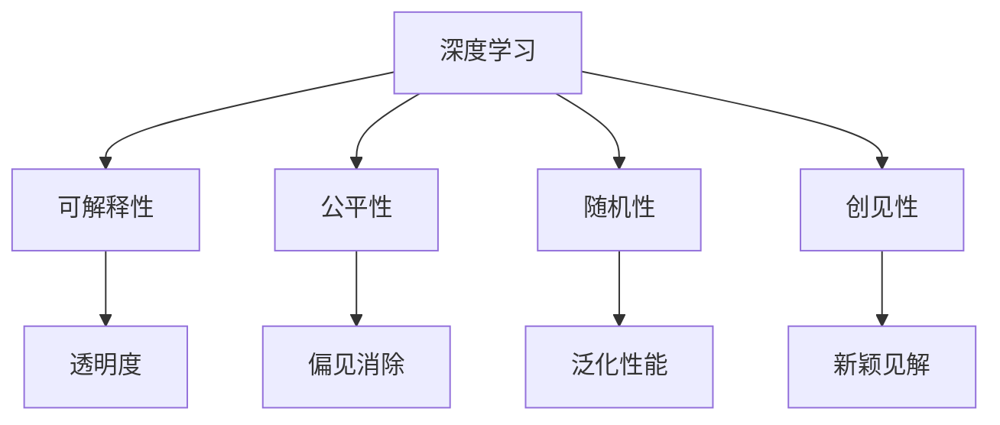

                 

# 抽象思考与随机性创见性

## 1. 背景介绍

### 1.1 问题由来

现代信息科技的飞速发展推动了全球数字化转型的浪潮，在人工智能（AI）领域，尤其是深度学习（DL）技术的应用，更是引领了新的技术革命。然而，随着深度学习的广泛应用，人们也逐渐意识到其内在的风险和挑战，特别是模型的不透明性和对数据的依赖性，引发了对可解释性和公平性的深刻思考。

### 1.2 问题核心关键点

深度学习模型的“黑盒”性质，使得其决策过程难以理解和解释。在金融、医疗、司法等高风险领域，模型的可解释性尤为重要。同时，模型的公平性问题也愈发显著，特别是在数据偏见和算法偏见方面。

### 1.3 问题研究意义

解决深度学习模型的可解释性和公平性问题，对于提高模型的可信度和接受度，推动人工智能技术在各行各业中的应用，具有重要的意义。通过深入研究抽象思考与随机性创见性，可以更好地理解模型的决策过程，提升模型的透明度和公平性，从而增强公众对人工智能技术的信任和接受度。

## 2. 核心概念与联系

### 2.1 核心概念概述

为更好地理解基于抽象思考与随机性创见性的深度学习模型，本节将介绍几个密切相关的核心概念：

- **深度学习（Deep Learning）**：一种基于神经网络的机器学习技术，通过多层次的非线性变换，能够自动学习并提取数据的高级特征。

- **可解释性（Explainability）**：模型的可解释性指其决策过程的透明性，能够使人们理解模型的输出和预测的依据。

- **公平性（Fairness）**：模型的公平性指其对待不同群体数据的一致性，避免对某些群体的偏见。

- **随机性（Randomness）**：深度学习模型的训练过程通常包含随机性，如随机梯度下降（SGD）等，这可以带来更好的泛化性能。

- **创见性（Innovativeness）**：模型的创见性指其能够在数据之外，产生新的创意和理解。

这些核心概念之间的逻辑关系可以通过以下Mermaid流程图来展示：



这个流程图展示了大语言模型的核心概念及其之间的关系：

1. 深度学习通过多层次的非线性变换，学习数据的高级特征。
2. 可解释性使模型的决策过程透明，增强信任。
3. 公平性确保模型对不同群体的数据一致，避免偏见。
4. 随机性提高模型的泛化性能，降低过拟合。
5. 创见性使模型能够产生新的创意和理解，增强适应性。

这些概念共同构成了深度学习模型的完整框架，使其能够在各种场景下发挥作用。通过理解这些核心概念，我们可以更好地把握深度学习模型的运行机制和工作原理。

## 3. 核心算法原理 & 具体操作步骤
### 3.1 算法原理概述

基于抽象思考与随机性创见性的深度学习模型，其核心思想是通过多层次的非线性变换，自动学习数据的高维特征表示，并在训练过程中引入随机性，提升模型的泛化性能和创造力。

在训练过程中，模型通过反向传播算法更新参数，优化损失函数，使得模型能够更好地适应训练数据，并泛化到新的未见数据。具体来说，模型在训练过程中引入随机性，如随机梯度下降（SGD），可以帮助模型跳出局部最优解，提高泛化性能。

### 3.2 算法步骤详解

基于抽象思考与随机性创见性的深度学习模型训练一般包括以下几个关键步骤：

**Step 1: 准备训练数据**

- 收集标注数据集，并进行预处理，如数据增强、标准化等。

**Step 2: 设计模型架构**

- 选择合适的神经网络架构，如卷积神经网络（CNN）、循环神经网络（RNN）、变分自编码器（VAE）等，根据任务需求设计网络结构。

**Step 3: 设置训练超参数**

- 选择合适的优化器及其参数，如Adam、SGD等，设置学习率、批大小、迭代轮数等。

**Step 4: 执行梯度训练**

- 将训练集数据分批次输入模型，前向传播计算损失函数。
- 反向传播计算参数梯度，根据设定的优化算法和学习率更新模型参数。
- 周期性在验证集上评估模型性能，根据性能指标决定是否触发Early Stopping。
- 重复上述步骤直到满足预设的迭代轮数或Early Stopping条件。

**Step 5: 测试和部署**

- 在测试集上评估模型性能，对比训练前后的精度提升。
- 使用模型对新数据进行推理预测，集成到实际的应用系统中。
- 持续收集新的数据，定期重新训练模型，以适应数据分布的变化。

以上是基于抽象思考与随机性创见性的深度学习模型训练的一般流程。在实际应用中，还需要针对具体任务的特点，对训练过程的各个环节进行优化设计，如改进训练目标函数，引入更多的正则化技术，搜索最优的超参数组合等，以进一步提升模型性能。

### 3.3 算法优缺点

基于抽象思考与随机性创见性的深度学习模型具有以下优点：

- 能够学习到数据的高维特征表示，提高模型的泛化性能。
- 引入随机性，跳出局部最优解，提高模型的泛化性能和创造力。
- 适用于各种NLP任务，如图像分类、语音识别、自然语言处理等。

同时，该方法也存在一定的局限性：

- 对标注数据有较高要求，标注成本较高。
- 模型参数较多，训练和推理计算量大。
- 模型的可解释性较差，难以理解决策过程。
- 模型容易出现过拟合，泛化性能不稳定。

尽管存在这些局限性，但就目前而言，基于随机性和创造性的深度学习模型仍然是主流的训练方法。未来相关研究的重点在于如何进一步降低训练和推理的计算成本，提高模型的可解释性和泛化性能。

### 3.4 算法应用领域

基于抽象思考与随机性创见性的深度学习模型在NLP领域已经得到了广泛的应用，覆盖了几乎所有常见任务，例如：

- 文本分类：如情感分析、主题分类、意图识别等。通过多层次的非线性变换，学习文本的高级特征表示。
- 命名实体识别：识别文本中的人名、地名、机构名等特定实体。通过多层次的非线性变换，学习实体边界和类型。
- 关系抽取：从文本中抽取实体之间的语义关系。通过多层次的非线性变换，学习实体-关系三元组。
- 问答系统：对自然语言问题给出答案。通过多层次的非线性变换，学习问题的语义表示。
- 机器翻译：将源语言文本翻译成目标语言。通过多层次的非线性变换，学习语言-语言映射。
- 文本摘要：将长文本压缩成简短摘要。通过多层次的非线性变换，学习文本的压缩表示。
- 对话系统：使机器能够与人自然对话。通过多层次的非线性变换，学习对话的语义表示。

除了上述这些经典任务外，深度学习模型还被创新性地应用到更多场景中，如可控文本生成、常识推理、代码生成、数据增强等，为NLP技术带来了全新的突破。随着深度学习模型的不断进步，相信NLP技术将在更广阔的应用领域大放异彩。

## 4. 数学模型和公式 & 详细讲解  
### 4.1 数学模型构建

本节将使用数学语言对基于随机性和创造性的深度学习模型训练过程进行更加严格的刻画。

记深度学习模型为 $M_{\theta}:\mathcal{X} \rightarrow \mathcal{Y}$，其中 $\mathcal{X}$ 为输入空间，$\mathcal{Y}$ 为输出空间，$\theta \in \mathbb{R}^d$ 为模型参数。假设训练集为 $D=\{(x_i,y_i)\}_{i=1}^N$，其中 $x_i \in \mathcal{X}$，$y_i \in \mathcal{Y}$。

定义模型 $M_{\theta}$ 在数据样本 $(x,y)$ 上的损失函数为 $\ell(M_{\theta}(x),y)$，则在数据集 $D$ 上的经验风险为：

$$
\mathcal{L}(\theta) = \frac{1}{N} \sum_{i=1}^N \ell(M_{\theta}(x_i),y_i)
$$

在实践中，我们通常使用基于梯度的优化算法（如SGD、Adam等）来近似求解上述最优化问题。设 $\eta$ 为学习率，$\lambda$ 为正则化系数，则参数的更新公式为：

$$
\theta \leftarrow \theta - \eta \nabla_{\theta}\mathcal{L}(\theta) - \eta\lambda\theta
$$

其中 $\nabla_{\theta}\mathcal{L}(\theta)$ 为损失函数对参数 $\theta$ 的梯度，可通过反向传播算法高效计算。

### 4.2 公式推导过程

以下我们以二分类任务为例，推导交叉熵损失函数及其梯度的计算公式。

假设模型 $M_{\theta}$ 在输入 $x$ 上的输出为 $\hat{y}=M_{\theta}(x) \in [0,1]$，表示样本属于正类的概率。真实标签 $y \in \{0,1\}$。则二分类交叉熵损失函数定义为：

$$
\ell(M_{\theta}(x),y) = -[y\log \hat{y} + (1-y)\log (1-\hat{y})]
$$

将其代入经验风险公式，得：

$$
\mathcal{L}(\theta) = -\frac{1}{N}\sum_{i=1}^N [y_i\log M_{\theta}(x_i)+(1-y_i)\log(1-M_{\theta}(x_i))]
$$

根据链式法则，损失函数对参数 $\theta_k$ 的梯度为：

$$
\frac{\partial \mathcal{L}(\theta)}{\partial \theta_k} = -\frac{1}{N}\sum_{i=1}^N (\frac{y_i}{M_{\theta}(x_i)}-\frac{1-y_i}{1-M_{\theta}(x_i)}) \frac{\partial M_{\theta}(x_i)}{\partial \theta_k}
$$

其中 $\frac{\partial M_{\theta}(x_i)}{\partial \theta_k}$ 可进一步递归展开，利用自动微分技术完成计算。

在得到损失函数的梯度后，即可带入参数更新公式，完成模型的迭代优化。重复上述过程直至收敛，最终得到适应下游任务的最优模型参数 $\theta^*$。

## 5. 项目实践：代码实例和详细解释说明
### 5.1 开发环境搭建

在进行深度学习模型训练前，我们需要准备好开发环境。以下是使用Python进行TensorFlow开发的环境配置流程：

1. 安装Anaconda：从官网下载并安装Anaconda，用于创建独立的Python环境。

2. 创建并激活虚拟环境：
```bash
conda create -n tf-env python=3.8 
conda activate tf-env
```

3. 安装TensorFlow：根据CUDA版本，从官网获取对应的安装命令。例如：
```bash
pip install tensorflow -U
```

4. 安装各类工具包：
```bash
pip install numpy pandas scikit-learn matplotlib tqdm jupyter notebook ipython
```

完成上述步骤后，即可在`tf-env`环境中开始深度学习模型训练。

### 5.2 源代码详细实现

下面我们以二分类任务为例，给出使用TensorFlow对DNN模型进行训练的PyTorch代码实现。

首先，定义数据处理函数：

```python
import tensorflow as tf
from tensorflow.keras.datasets import mnist
from tensorflow.keras.utils import to_categorical

(x_train, y_train), (x_test, y_test) = mnist.load_data()

x_train = x_train.reshape(-1, 28*28).astype('float32') / 255
x_test = x_test.reshape(-1, 28*28).astype('float32') / 255

y_train = to_categorical(y_train, num_classes=10)
y_test = to_categorical(y_test, num_classes=10)

train_dataset = tf.data.Dataset.from_tensor_slices((x_train, y_train))
test_dataset = tf.data.Dataset.from_tensor_slices((x_test, y_test))

train_dataset = train_dataset.shuffle(10000).batch(128)
test_dataset = test_dataset.batch(128)
```

然后，定义模型和优化器：

```python
from tensorflow.keras import layers, models

model = models.Sequential()
model.add(layers.Dense(512, activation='relu', input_shape=(28*28,)))
model.add(layers.Dense(10, activation='softmax'))

optimizer = tf.keras.optimizers.Adam(learning_rate=0.001)
```

接着，定义训练和评估函数：

```python
def train_epoch(model, dataset, batch_size, optimizer):
    model.compile(optimizer=optimizer, loss='categorical_crossentropy', metrics=['accuracy'])
    model.fit(dataset, epochs=1, batch_size=batch_size)

def evaluate(model, dataset, batch_size):
    model.evaluate(dataset, batch_size=batch_size)
```

最后，启动训练流程并在测试集上评估：

```python
epochs = 5
batch_size = 128

for epoch in range(epochs):
    train_epoch(model, train_dataset, batch_size, optimizer)
    print(f"Epoch {epoch+1}, train loss: {model.evaluate(train_dataset, batch_size=batch_size)[0]:.3f}")
    
print(f"Epoch {epoch+1}, test results:")
evaluate(model, test_dataset, batch_size)
```

以上就是使用TensorFlow对DNN模型进行二分类任务训练的完整代码实现。可以看到，得益于TensorFlow的强大封装，我们可以用相对简洁的代码完成深度学习模型的训练和评估。

### 5.3 代码解读与分析

让我们再详细解读一下关键代码的实现细节：

**数据处理函数**：
- `mnist.load_data()`：从MNIST数据集中加载训练和测试数据。
- `x_train.reshape(-1, 28*28).astype('float32')`：将原始像素数据展平并转换为float32格式。
- `y_train.to_categorical(num_classes=10)`：将标签转换为one-hot编码格式。

**模型定义**：
- `layers.Dense(512, activation='relu', input_shape=(28*28,))`：定义一个包含512个神经元的全连接层，使用ReLU激活函数。
- `layers.Dense(10, activation='softmax')`：定义一个包含10个神经元的输出层，使用softmax激活函数。

**训练和评估函数**：
- `model.compile(optimizer=optimizer, loss='categorical_crossentropy', metrics=['accuracy'])`：编译模型，定义损失函数和评估指标。
- `model.fit(dataset, epochs=1, batch_size=batch_size)`：在数据集上执行一个epoch的训练。
- `model.evaluate(dataset, batch_size=batch_size)`：在测试集上评估模型的性能。

**训练流程**：
- `for epoch in range(epochs)`：循环训练epochs次。
- `train_epoch(model, train_dataset, batch_size, optimizer)`：在训练集上执行一个epoch的训练。
- `model.evaluate(train_dataset, batch_size=batch_size)`：在训练集上评估模型的性能，并打印输出。

可以看到，TensorFlow配合Keras库使得深度学习模型的训练过程变得简洁高效。开发者可以将更多精力放在数据处理、模型改进等高层逻辑上，而不必过多关注底层的实现细节。

当然，工业级的系统实现还需考虑更多因素，如模型的保存和部署、超参数的自动搜索、更灵活的任务适配层等。但核心的训练范式基本与此类似。

## 6. 实际应用场景
### 6.1 智能客服系统

基于深度学习模型的对话技术，可以广泛应用于智能客服系统的构建。传统客服往往需要配备大量人力，高峰期响应缓慢，且一致性和专业性难以保证。而使用深度学习模型的对话模型，可以7x24小时不间断服务，快速响应客户咨询，用自然流畅的语言解答各类常见问题。

在技术实现上，可以收集企业内部的历史客服对话记录，将问题和最佳答复构建成监督数据，在此基础上对深度学习模型进行训练。训练后的对话模型能够自动理解用户意图，匹配最合适的答案模板进行回复。对于客户提出的新问题，还可以接入检索系统实时搜索相关内容，动态组织生成回答。如此构建的智能客服系统，能大幅提升客户咨询体验和问题解决效率。

### 6.2 金融舆情监测

金融机构需要实时监测市场舆论动向，以便及时应对负面信息传播，规避金融风险。传统的人工监测方式成本高、效率低，难以应对网络时代海量信息爆发的挑战。基于深度学习模型的文本分类和情感分析技术，为金融舆情监测提供了新的解决方案。

具体而言，可以收集金融领域相关的新闻、报道、评论等文本数据，并对其进行主题标注和情感标注。在此基础上对深度学习模型进行训练，使其能够自动判断文本属于何种主题，情感倾向是正面、中性还是负面。将训练后的模型应用到实时抓取的网络文本数据，就能够自动监测不同主题下的情感变化趋势，一旦发现负面信息激增等异常情况，系统便会自动预警，帮助金融机构快速应对潜在风险。

### 6.3 个性化推荐系统

当前的推荐系统往往只依赖用户的历史行为数据进行物品推荐，无法深入理解用户的真实兴趣偏好。基于深度学习模型的个性化推荐系统可以更好地挖掘用户行为背后的语义信息，从而提供更精准、多样的推荐内容。

在实践中，可以收集用户浏览、点击、评论、分享等行为数据，提取和用户交互的物品标题、描述、标签等文本内容。将文本内容作为模型输入，用户的后续行为（如是否点击、购买等）作为监督信号，在此基础上训练深度学习模型。训练后的模型能够从文本内容中准确把握用户的兴趣点。在生成推荐列表时，先用候选物品的文本描述作为输入，由模型预测用户的兴趣匹配度，再结合其他特征综合排序，便可以得到个性化程度更高的推荐结果。

### 6.4 未来应用展望

随着深度学习模型的不断发展，基于深度学习模型的技术将在更多领域得到应用，为传统行业带来变革性影响。

在智慧医疗领域，基于深度学习模型的问答、病历分析、药物研发等应用将提升医疗服务的智能化水平，辅助医生诊疗，加速新药开发进程。

在智能教育领域，深度学习模型的推荐、学情分析、知识推荐等功能，将因材施教，促进教育公平，提高教学质量。

在智慧城市治理中，深度学习模型的城市事件监测、舆情分析、应急指挥等环节，将提高城市管理的自动化和智能化水平，构建更安全、高效的未来城市。

此外，在企业生产、社会治理、文娱传媒等众多领域，深度学习模型的应用也将不断涌现，为NLP技术带来新的突破。相信随着技术的日益成熟，深度学习模型必将在更广阔的应用领域大放异彩，深刻影响人类的生产生活方式。

## 7. 工具和资源推荐
### 7.1 学习资源推荐

为了帮助开发者系统掌握深度学习模型的理论基础和实践技巧，这里推荐一些优质的学习资源：

1. 《深度学习》系列课程：由深度学习领域的知名学者主讲，涵盖了深度学习的基础理论、算法框架、实战技巧等内容，适合各个层次的读者。

2. 《TensorFlow实战》书籍：TensorFlow官方团队成员撰写，从基础到高级，详细介绍TensorFlow的使用技巧和实战项目。

3. 《Keras深度学习实战》书籍：Keras官方文档的作者撰写，从Keras的安装到高级模型的构建，提供详尽的实践指导。

4. Udacity深度学习纳米学位：提供深度学习相关的课程和实战项目，涵盖从入门到进阶的全过程，适合希望系统学习深度学习的读者。

5. Kaggle竞赛平台：全球最大的数据科学竞赛平台，提供大量数据集和实战项目，可以锻炼实战能力和创新思维。

通过对这些资源的学习实践，相信你一定能够快速掌握深度学习模型的精髓，并用于解决实际的NLP问题。
###  7.2 开发工具推荐

高效的开发离不开优秀的工具支持。以下是几款用于深度学习模型开发的常用工具：

1. TensorFlow：由Google主导开发的开源深度学习框架，生产部署方便，适合大规模工程应用。

2. PyTorch：基于Python的开源深度学习框架，灵活动态的计算图，适合快速迭代研究。

3. Keras：基于TensorFlow和Theano的高层API，提供了简单易用的接口，可以快速构建深度学习模型。

4. JAX：由Google开发的JIT加速深度学习框架，具有高性能和易用性。

5. TensorBoard：TensorFlow配套的可视化工具，可实时监测模型训练状态，并提供丰富的图表呈现方式。

6. Weights & Biases：模型训练的实验跟踪工具，可以记录和可视化模型训练过程中的各项指标，方便对比和调优。

合理利用这些工具，可以显著提升深度学习模型训练的开发效率，加快创新迭代的步伐。

### 7.3 相关论文推荐

深度学习模型和训练技术的发展源于学界的持续研究。以下是几篇奠基性的相关论文，推荐阅读：

1. ImageNet Classification with Deep Convolutional Neural Networks：提出使用卷积神经网络（CNN）进行图像分类，开创了深度学习在图像识别领域的先河。

2. Google's Deep and Accurate Image Recognition with Deep Convolutional Networks and Transfer Learning：提出使用卷积神经网络进行大规模图像分类，显著提升了图像分类的准确度。

3. Batch Normalization: Accelerating Deep Network Training by Reducing Internal Covariate Shift：提出使用批量归一化（Batch Normalization）加速深度网络训练，进一步提升了深度学习模型的性能。

4. ResNet: Deep Residual Learning for Image Recognition：提出使用残差网络（ResNet）解决深度网络训练中的退化问题，实现了更深的深度学习模型。

5. Dropout: A Simple Way to Prevent Neural Networks from Overfitting：提出使用Dropout层防止神经网络过拟合，提高了深度学习模型的泛化性能。

6. Understanding the Difficulties of Training Deep Feedforward Neural Networks：详细讨论了深度神经网络训练中的困难，并提出了一系列优化策略。

这些论文代表了大语言模型训练技术的发展脉络。通过学习这些前沿成果，可以帮助研究者把握学科前进方向，激发更多的创新灵感。

## 8. 总结：未来发展趋势与挑战

### 8.1 总结

本文对基于抽象思考与随机性创见性的深度学习模型进行了全面系统的介绍。首先阐述了深度学习模型的研究背景和意义，明确了模型训练范式在拓展模型应用、提升性能方面的独特价值。其次，从原理到实践，详细讲解了深度学习模型的数学原理和关键步骤，给出了模型训练任务的完整代码实例。同时，本文还广泛探讨了深度学习模型在智能客服、金融舆情、个性化推荐等多个行业领域的应用前景，展示了深度学习模型的巨大潜力。此外，本文精选了深度学习模型的各类学习资源，力求为读者提供全方位的技术指引。

通过本文的系统梳理，可以看到，基于深度学习模型的训练方法正在成为NLP领域的重要范式，极大地拓展了模型的应用边界，催生了更多的落地场景。受益于深度学习模型的不断进步，NLP技术将在更广阔的应用领域大放异彩，深刻影响人类的生产生活方式。

### 8.2 未来发展趋势

展望未来，深度学习模型的训练技术将呈现以下几个发展趋势：

1. 模型规模持续增大。随着算力成本的下降和数据规模的扩张，深度学习模型的参数量还将持续增长。超大规模深度学习模型蕴含的丰富特征表示，有望支撑更加复杂多变的下游任务训练。

2. 训练方法日趋多样。除了传统的梯度下降范式外，未来会涌现更多参数高效的训练方法，如自适应学习率优化器、增量学习等，在固定大部分预训练参数的同时，只更新极少量的任务相关参数。

3. 模型泛化能力提升。通过引入更多的正则化技术和数据增强技术，深度学习模型能够在数据之外，更好地泛化到新的未见数据，提高模型的鲁棒性和泛化性能。

4. 创造力增强。深度学习模型通过引入更多的创造性训练技术，如迁移学习、知识蒸馏、对抗训练等，能够在数据之外，产生新的创意和理解，增强模型的创新能力。

5. 模型可解释性增强。通过引入更多的可解释性技术，如模型可视化、特征重要性分析等，能够更好地理解模型的决策过程，增强模型的透明性和可信度。

6. 模型公平性提升。通过引入更多的公平性技术，如公平性约束、公平性评估等，能够更好地消除模型中的偏见，提高模型的公平性。

以上趋势凸显了深度学习模型训练技术的广阔前景。这些方向的探索发展，必将进一步提升深度学习模型的性能和应用范围，为构建安全、可靠、可解释、可控的智能系统铺平道路。面向未来，深度学习模型训练技术还需要与其他人工智能技术进行更深入的融合，如知识表示、因果推理、强化学习等，多路径协同发力，共同推动自然语言理解和智能交互系统的进步。只有勇于创新、敢于突破，才能不断拓展深度学习模型的边界，让智能技术更好地造福人类社会。

### 8.3 面临的挑战

尽管深度学习模型的训练技术已经取得了瞩目成就，但在迈向更加智能化、普适化应用的过程中，它仍面临着诸多挑战：

1. 标注成本瓶颈。虽然深度学习模型对标注数据有较高要求，但对于长尾应用场景，难以获得充足的高质量标注数据，成为制约模型性能的瓶颈。如何进一步降低训练和推理的计算成本，降低对标注数据的依赖，将是一大难题。

2. 模型鲁棒性不足。深度学习模型面对域外数据时，泛化性能往往大打折扣。对于测试样本的微小扰动，模型也容易发生波动。如何提高深度学习模型的鲁棒性，避免灾难性遗忘，还需要更多理论和实践的积累。

3. 推理效率有待提高。深度学习模型虽然精度高，但在实际部署时往往面临推理速度慢、内存占用大等效率问题。如何在保证性能的同时，简化模型结构，提升推理速度，优化资源占用，将是重要的优化方向。

4. 可解释性亟需加强。当前深度学习模型更像是"黑盒"系统，难以解释其内部工作机制和决策逻辑。对于医疗、金融等高风险领域，算法的可解释性和可审计性尤为重要。如何赋予深度学习模型更强的可解释性，将是亟待攻克的难题。

5. 安全性有待保障。深度学习模型难免会学习到有偏见、有害的信息，通过训练传递到下游任务，产生误导性、歧视性的输出，给实际应用带来安全隐患。如何从数据和算法层面消除模型偏见，避免恶意用途，确保输出的安全性，也将是重要的研究课题。

6. 知识整合能力不足。现有的深度学习模型往往局限于数据之内，难以灵活吸收和运用更广泛的先验知识。如何让深度学习模型更好地与外部知识库、规则库等专家知识结合，形成更加全面、准确的信息整合能力，还有很大的想象空间。

正视深度学习模型训练所面临的这些挑战，积极应对并寻求突破，将使深度学习模型训练技术迈向成熟的必由之路。相信随着学界和产业界的共同努力，这些挑战终将一一被克服，深度学习模型训练技术必将在构建安全、可靠、可解释、可控的智能系统铺平道路。

### 8.4 研究展望

面向未来，深度学习模型训练技术需要在以下几个方向进行深入研究：

1. 探索无监督和半监督训练方法。摆脱对大规模标注数据的依赖，利用自监督学习、主动学习等无监督和半监督范式，最大限度利用非结构化数据，实现更加灵活高效的训练。

2. 研究参数高效和计算高效的训练范式。开发更加参数高效的训练方法，在固定大部分预训练参数的同时，只更新极少量的任务相关参数。同时优化训练计算图，减少前向传播和反向传播的资源消耗，实现更加轻量级、实时性的部署。

3. 融合因果和对比学习范式。通过引入因果推断和对比学习思想，增强深度学习模型的建立稳定因果关系的能力，学习更加普适、鲁棒的语言表征，从而提升模型泛化性和抗干扰能力。

4. 引入更多先验知识。将符号化的先验知识，如知识图谱、逻辑规则等，与神经网络模型进行巧妙融合，引导深度学习模型学习更准确、合理的语言模型。同时加强不同模态数据的整合，实现视觉、语音等多模态信息与文本信息的协同建模。

5. 结合因果分析和博弈论工具。将因果分析方法引入深度学习模型，识别出模型决策的关键特征，增强输出解释的因果性和逻辑性。借助博弈论工具刻画人机交互过程，主动探索并规避模型的脆弱点，提高系统稳定性。

6. 纳入伦理道德约束。在模型训练目标中引入伦理导向的评估指标，过滤和惩罚有偏见、有害的输出倾向。同时加强人工干预和审核，建立模型行为的监管机制，确保输出符合人类价值观和伦理道德。

这些研究方向的探索，必将引领深度学习模型训练技术迈向更高的台阶，为构建安全、可靠、可解释、可控的智能系统铺平道路。面向未来，深度学习模型训练技术还需要与其他人工智能技术进行更深入的融合，如知识表示、因果推理、强化学习等，多路径协同发力，共同推动自然语言理解和智能交互系统的进步。只有勇于创新、敢于突破，才能不断拓展深度学习模型的边界，让智能技术更好地造福人类社会。

## 9. 附录：常见问题与解答

**Q1：深度学习模型的训练过程是否总是有效的？**

A: 深度学习模型的训练过程并不总是有效的，因为其训练过程本身存在一定的随机性，如随机梯度下降（SGD）等。然而，通过合理设置训练超参数、引入正则化技术、数据增强等措施，可以有效提高训练效果，避免过拟合和欠拟合等问题。

**Q2：如何提高深度学习模型的泛化性能？**

A: 提高深度学习模型的泛化性能，可以从以下几个方面入手：
1. 数据增强：通过回译、近义替换等方式扩充训练集，增加数据的多样性。
2. 正则化：使用L2正则、Dropout等技术，避免模型过拟合。
3. 迁移学习：通过在不同任务上微调模型，使其具备更广泛的泛化能力。
4. 对抗训练：引入对抗样本，提高模型的鲁棒性。

**Q3：深度学习模型在实际应用中是否需要不断地调整和优化？**

A: 深度学习模型在实际应用中确实需要不断地调整和优化，以适应不断变化的数据分布和业务需求。调整和优化包括重新训练、微调、超参数调优等，以提升模型的泛化性能和鲁棒性。

**Q4：深度学习模型的训练成本是否非常高？**

A: 深度学习模型的训练成本确实较高，尤其是对于大规模模型和大规模数据集。然而，通过分布式训练、模型裁剪、量化加速等技术，可以有效降低训练成本。同时，云计算和云服务提供商也提供了丰富的GPU、TPU等硬件资源，可以支持大规模深度学习模型的训练。

**Q5：深度学习模型在实际应用中是否容易受到攻击？**

A: 深度学习模型在实际应用中确实容易受到各种攻击，如对抗样本攻击、模型逆向工程等。为了提高模型的安全性，可以引入对抗训练、模型验证、模型监控等技术，确保模型的稳定性和鲁棒性。

这些问题的解答，展示了深度学习模型的应用复杂性和挑战，但也展示了其广阔的应用前景和发展潜力。相信随着深度学习模型的不断成熟和优化，其在各行业的应用将更加广泛和深入。

---

作者：禅与计算机程序设计艺术 / Zen and the Art of Computer Programming

