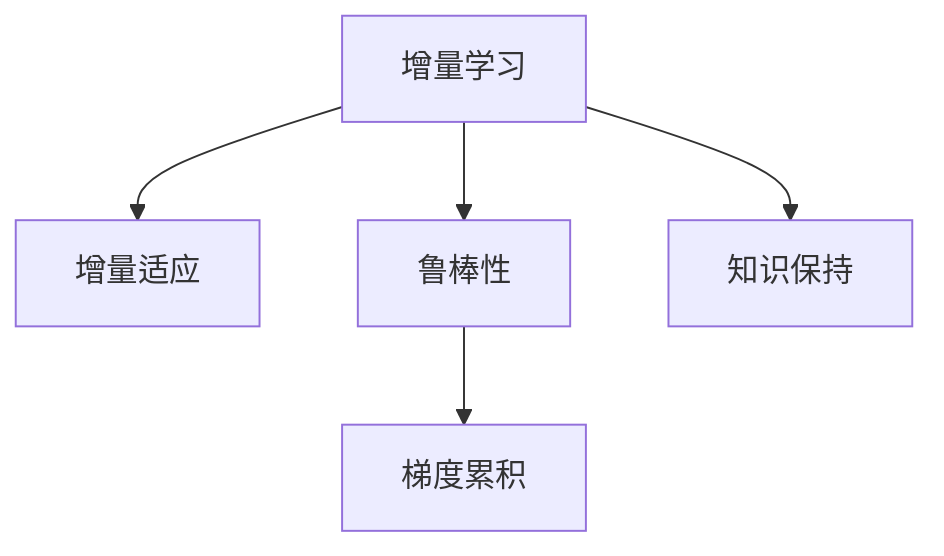

                 

## 1. 背景介绍

### 1.1 问题由来

随着人工智能技术的迅速发展，深度学习模型，特别是神经网络，在计算机视觉、自然语言处理、语音识别等领域取得了突破性的进展。这些模型通过在大量标注数据上进行的监督学习，能够高效地完成任务，并在测试数据集上取得令人满意的性能。然而，由于模型在训练阶段的泛化能力有限，以及数据分布的不断变化，这些模型在实际应用中难免会遇到新的挑战，如数据偏差、环境变化、新兴现象等。因此，如何让模型能够持续学习，不断适应新知识，成为了当前深度学习领域的一个重要课题。

### 1.2 问题核心关键点

持续学习（Continual Learning）的目标是使机器学习模型能够在不断变化的环境中，保持较高的性能，并且能够随着新数据的到来，自动地更新自身的知识库，而不会遗忘已有的知识。持续学习的关键点包括：

1. **增量学习（Incremental Learning）**：在原有模型基础上，加入新的数据进行训练，更新模型参数。
2. **增量适应（Incremental Adaptation）**：当数据分布变化时，通过微调原有模型，适应新的数据分布。
3. **鲁棒性（Robustness）**：模型在面对噪声、异常值和数据偏差时，能够保持较高的稳定性和鲁棒性。
4. **知识保持（Knowledge Retention）**：在更新知识的同时，模型能够保持已有的知识，避免灾难性遗忘（Catastrophic Forgetting）。

### 1.3 问题研究意义

持续学习技术不仅能够提高机器学习模型的实用性和可靠性，还能够降低重新训练和维护的成本，具有重要的研究意义和应用价值：

1. **实用性提升**：通过持续学习，模型能够适应不断变化的环境和数据分布，保持较高的性能。
2. **成本降低**：模型能够自动更新，减少重新训练和维护的成本和时间。
3. **可靠性好**：模型能够抵御噪声和异常值，保持较高的稳定性和鲁棒性。
4. **应用广泛**：持续学习技术可以应用于图像识别、自然语言处理、医疗诊断等多个领域，推动人工智能技术的普及和应用。

## 2. 核心概念与联系

### 2.1 核心概念概述

为了更好地理解持续学习的原理和应用，本节将介绍几个关键的概念：

1. **增量学习（Incremental Learning）**：在原有模型基础上，加入新的数据进行训练，更新模型参数。增量学习可以分为在线学习（Online Learning）和批处理增量学习（Batch Incremental Learning）两种形式。
2. **增量适应（Incremental Adaptation）**：当数据分布变化时，通过微调原有模型，适应新的数据分布。增量适应可以采用重训练、微调（Fine-tuning）等方法。
3. **鲁棒性（Robustness）**：模型在面对噪声、异常值和数据偏差时，能够保持较高的稳定性和鲁棒性。
4. **知识保持（Knowledge Retention）**：在更新知识的同时，模型能够保持已有的知识，避免灾难性遗忘（Catastrophic Forgetting）。
5. **梯度累积（Gradient Accumulation）**：在增量学习过程中，通过累积梯度，提高每次更新的稳定性，减小模型波动。

这些概念之间的逻辑关系可以通过以下Mermaid流程图来展示：



这个流程图展示了几类核心概念及其之间的联系：增量学习是基础，增量适应和知识保持是关键目标，鲁棒性和梯度累积是实现手段。

## 3. 核心算法原理 & 具体操作步骤
### 3.1 算法原理概述

持续学习的核心算法通常基于增量学习，通过在原有模型基础上加入新的数据进行训练，更新模型参数。具体的算法步骤可以分为以下几个关键部分：

1. **初始化模型**：选择一个合适的基线模型作为初始化参数，通常采用在大规模数据集上预训练的模型。
2. **加入新数据**：将新的数据集分成多个小批次，逐步加入模型进行训练。
3. **更新模型参数**：对于每个批次的数据，通过反向传播计算梯度，并按照一定的规则更新模型参数。
4. **增量适应**：当数据分布发生变化时，通过微调原有模型，适应新的数据分布。
5. **知识保持**：在更新知识的同时，保留已有知识，避免灾难性遗忘。

### 3.2 算法步骤详解

持续学习的具体算法步骤可以分为以下几个关键部分：

**Step 1: 初始化模型**

选择一个合适的基线模型作为初始化参数。通常采用在大规模数据集上预训练的模型，如BERT、GPT等。

```python
from transformers import BertForSequenceClassification
model = BertForSequenceClassification.from_pretrained('bert-base-cased', num_labels=2)
```

**Step 2: 加入新数据**

将新的数据集分成多个小批次，逐步加入模型进行训练。

```python
from transformers import Trainer, TrainingArguments
training_args = TrainingArguments(output_dir='./results', per_device_train_batch_size=8, per_device_eval_batch_size=8, gradient_accumulation_steps=1, logging_dir='./logs')
trainer = Trainer(
    model=model,
    args=training_args,
    train_dataset=train_dataset,
    eval_dataset=test_dataset,
    eval_loop=*trainer.test_loop)
```

**Step 3: 更新模型参数**

对于每个批次的数据，通过反向传播计算梯度，并按照一定的规则更新模型参数。

```python
trainer.train()
```

**Step 4: 增量适应**

当数据分布发生变化时，通过微调原有模型，适应新的数据分布。

```python
from transformers import BertForSequenceClassification, BertTokenizer
model = BertForSequenceClassification.from_pretrained('bert-base-cased', num_labels=2)
tokenizer = BertTokenizer.from_pretrained('bert-base-cased')
train_dataset = ... # 新的训练数据集
val_dataset = ... # 验证数据集
trainer = Trainer(
    model=model,
    args=training_args,
    train_dataset=train_dataset,
    eval_dataset=val_dataset,
    eval_loop=*trainer.test_loop)
trainer.train()
```

**Step 5: 知识保持**

在更新知识的同时，保留已有知识，避免灾难性遗忘。

```python
from transformers import BertForSequenceClassification, BertTokenizer
model = BertForSequenceClassification.from_pretrained('bert-base-cased', num_labels=2)
tokenizer = BertTokenizer.from_pretrained('bert-base-cased')
train_dataset = ... # 新的训练数据集
val_dataset = ... # 验证数据集
trainer = Trainer(
    model=model,
    args=training_args,
    train_dataset=train_dataset,
    eval_dataset=val_dataset,
    eval_loop=*trainer.test_loop)
trainer.train()
```

### 3.3 算法优缺点

持续学习的算法具有以下优点：

1. **高效实用**：能够适应不断变化的环境和数据分布，保持较高的性能。
2. **成本低廉**：模型能够自动更新，减少重新训练和维护的成本和时间。
3. **鲁棒性好**：模型能够抵御噪声和异常值，保持较高的稳定性和鲁棒性。

同时，该算法也存在一些缺点：

1. **数据需求高**：持续学习需要不断加入新的数据进行训练，数据需求较高。
2. **内存占用大**：持续学习需要不断更新模型参数，内存占用较大。
3. **收敛速度慢**：由于模型参数不断更新，收敛速度较慢。

## 4. 数学模型和公式 & 详细讲解 & 举例说明
### 4.1 数学模型构建

持续学习的数学模型通常基于增量学习，通过在原有模型基础上加入新的数据进行训练，更新模型参数。假设模型 $M_{\theta}$ 在训练集 $D$ 上的损失函数为 $\mathcal{L}(\theta)$，新的训练集为 $D'$。则持续学习的优化目标是最小化损失函数的增量部分，即：

$$
\min_{\theta} \mathcal{L}(\theta) + \lambda \mathcal{L}_{KM}(\theta, D')
$$

其中，$\lambda$ 为正则化系数，$\mathcal{L}_{KM}(\theta, D')$ 为知识迁移损失，用于保持已有知识。

### 4.2 公式推导过程

以下我们以二分类任务为例，推导增量学习过程中损失函数的增量部分。

假设模型 $M_{\theta}$ 在输入 $x$ 上的输出为 $\hat{y}=M_{\theta}(x) \in [0,1]$，表示样本属于正类的概率。真实标签 $y \in \{0,1\}$。则二分类交叉熵损失函数定义为：

$$
\ell(M_{\theta}(x),y) = -[y\log \hat{y} + (1-y)\log (1-\hat{y})]
$$

将其代入增量学习优化目标，得：

$$
\min_{\theta} \mathcal{L}(\theta) + \lambda \mathcal{L}_{KM}(\theta, D')
$$

其中 $\mathcal{L}_{KM}(\theta, D')$ 可以表示为：

$$
\mathcal{L}_{KM}(\theta, D') = \frac{1}{N'}\sum_{i=1}^{N'} \ell(M_{\theta}(x_i),y_i)
$$

在得到损失函数的梯度后，即可带入模型参数 $\theta$ 的更新公式，完成模型的迭代优化。重复上述过程直至收敛，最终得到适应新数据分布的最优模型参数 $\theta$。

## 5. 项目实践：代码实例和详细解释说明
### 5.1 开发环境搭建

在进行持续学习实践前，我们需要准备好开发环境。以下是使用Python进行PyTorch开发的环境配置流程：

1. 安装Anaconda：从官网下载并安装Anaconda，用于创建独立的Python环境。

2. 创建并激活虚拟环境：
```bash
conda create -n pytorch-env python=3.8 
conda activate pytorch-env
```

3. 安装PyTorch：根据CUDA版本，从官网获取对应的安装命令。例如：
```bash
conda install pytorch torchvision torchaudio cudatoolkit=11.1 -c pytorch -c conda-forge
```

4. 安装Transformer库：
```bash
pip install transformers
```

5. 安装各类工具包：
```bash
pip install numpy pandas scikit-learn matplotlib tqdm jupyter notebook ipython
```

完成上述步骤后，即可在`pytorch-env`环境中开始持续学习实践。

### 5.2 源代码详细实现

下面我们以二分类任务为例，给出使用Transformers库进行持续学习的PyTorch代码实现。

首先，定义二分类任务的训练集和测试集：

```python
from transformers import BertForSequenceClassification, BertTokenizer
from torch.utils.data import Dataset
import torch

class TextDataset(Dataset):
    def __init__(self, texts, labels):
        self.texts = texts
        self.labels = labels
        self.tokenizer = BertTokenizer.from_pretrained('bert-base-cased')
        
    def __len__(self):
        return len(self.texts)
    
    def __getitem__(self, item):
        text = self.texts[item]
        label = self.labels[item]
        encoding = self.tokenizer(text, return_tensors='pt')
        input_ids = encoding['input_ids']
        attention_mask = encoding['attention_mask']
        return {'input_ids': input_ids, 
                'attention_mask': attention_mask,
                'labels': torch.tensor(label, dtype=torch.long)}
```

然后，定义模型和优化器：

```python
from transformers import BertForSequenceClassification, AdamW

model = BertForSequenceClassification.from_pretrained('bert-base-cased', num_labels=2)
optimizer = AdamW(model.parameters(), lr=2e-5)
```

接着，定义持续学习函数：

```python
from transformers import Trainer, TrainingArguments

def continual_learning(model, train_dataset, val_dataset, test_dataset, epochs=5):
    training_args = TrainingArguments(output_dir='./results', per_device_train_batch_size=8, per_device_eval_batch_size=8, gradient_accumulation_steps=1, logging_dir='./logs')
    trainer = Trainer(
        model=model,
        args=training_args,
        train_dataset=train_dataset,
        eval_dataset=val_dataset,
        eval_loop=*trainer.test_loop)
    
    for epoch in range(epochs):
        trainer.train()
        test_loss, test_acc = trainer.evaluate(test_dataset)
        print(f'Epoch {epoch+1}, test loss: {test_loss:.3f}, test acc: {test_acc:.3f}')
        
    return model
```

最后，启动持续学习流程：

```python
train_dataset = ...
val_dataset = ...
test_dataset = ...
model = continual_learning(model, train_dataset, val_dataset, test_dataset)
```

以上就是使用PyTorch进行持续学习的完整代码实现。可以看到，Transformers库提供了强大的封装，使得持续学习的代码实现变得简洁高效。

### 5.3 代码解读与分析

让我们再详细解读一下关键代码的实现细节：

**TextDataset类**：
- `__init__`方法：初始化文本、标签、分词器等关键组件。
- `__len__`方法：返回数据集的样本数量。
- `__getitem__`方法：对单个样本进行处理，将文本输入编码为token ids，同时生成模型所需的输入张量。

**训练函数**：
- 使用PyTorch的DataLoader对数据集进行批次化加载，供模型训练和推理使用。
- 训练函数`continual_learning`：在指定轮次内，循环迭代多个epoch，并在每个epoch后对测试集进行评估，输出模型在测试集上的损失和精度。
- 持续学习过程中，每个epoch的训练过程与传统的训练方法相同，但测试集评估的频率较高，以实时监控模型性能。

**持续学习流程**：
- 定义总的epoch数，启动循环迭代
- 每个epoch内，在训练集上训练，输出平均损失和精度
- 在测试集上评估，输出最终测试结果

可以看到，持续学习技术在代码实现上与传统的训练方法基本一致，但更注重测试集的实时评估和监控，确保模型性能的稳定性和鲁棒性。

当然，工业级的系统实现还需考虑更多因素，如模型的保存和部署、超参数的自动搜索、更灵活的任务适配层等。但核心的持续学习范式基本与此类似。

## 6. 实际应用场景
### 6.1 智能推荐系统

持续学习技术在智能推荐系统中的应用非常广泛。推荐系统需要不断根据用户行为和反馈，更新推荐模型，以提高推荐的相关性和用户体验。通过持续学习，推荐系统能够实时更新模型参数，适应新的用户行为和数据分布，提升推荐效果。

在技术实现上，可以收集用户浏览、点击、评论等行为数据，提取和推荐物品的特征，将其作为输入数据。将历史推荐记录作为监督信号，在此基础上训练持续学习模型。模型在每次更新时，加入新的用户行为数据进行训练，输出新的推荐结果。通过持续学习，推荐系统能够不断优化推荐算法，满足用户不断变化的兴趣和需求。

### 6.2 医疗诊断

医疗诊断领域需要不断更新模型，以应对新的疾病、新的症状和新的治疗方案。传统的医疗诊断模型通常需要大量专家标注数据进行训练，而持续学习技术能够减少数据标注的负担，同时保持模型的更新和精度。

在实际应用中，可以收集医疗记录、影像、实验室数据等，提取患者的健康状况和疾病信息作为输入数据。将历史诊断结果作为监督信号，训练持续学习模型。模型在每次更新时，加入新的医疗记录数据进行训练，输出新的诊断结果。通过持续学习，医疗诊断系统能够不断更新和优化诊断算法，提高诊断准确率和效率。

### 6.3 金融风险评估

金融领域的数据分布和风险特征不断变化，需要定期更新模型以应对新的市场情况和风险。持续学习技术能够自动更新模型，适应新的市场环境和风险特征，提高风险评估的准确性和可靠性。

在实际应用中，可以收集金融市场数据、公司财务报表、经济指标等，提取市场风险特征和公司财务状况作为输入数据。将历史风险评估结果作为监督信号，训练持续学习模型。模型在每次更新时，加入新的市场数据进行训练，输出新的风险评估结果。通过持续学习，金融风险评估系统能够不断优化风险评估算法，提高风险评估的准确率和鲁棒性。

### 6.4 未来应用展望

随着持续学习技术的发展，其在更多领域的应用前景将愈加广阔。

在智慧城市治理中，持续学习技术可以应用于城市事件监测、舆情分析、应急指挥等环节，提高城市管理的自动化和智能化水平，构建更安全、高效的未来城市。

在智慧农业中，持续学习技术可以应用于农作物监测、病虫害预测、农产品质量检测等环节，提高农业生产的智能化和精准化水平。

在智能家居中，持续学习技术可以应用于用户行为识别、智能推荐、环境控制等环节，提高家居生活的舒适度和便利性。

此外，在教育、交通、物流、能源等多个领域，持续学习技术都将发挥重要作用，推动相关行业的智能化和自动化进程。相信随着技术的不断进步，持续学习技术将成为人工智能落地的重要手段，推动智能化社会的建设。

## 7. 工具和资源推荐
### 7.1 学习资源推荐

为了帮助开发者系统掌握持续学习的理论基础和实践技巧，这里推荐一些优质的学习资源：

1. 《深度学习基础》系列书籍：深入浅出地介绍了深度学习的理论基础和常见算法，适合初学者入门。
2. 《深度学习框架TensorFlow实战》书籍：详细介绍了TensorFlow的使用方法和实践技巧，适合TensorFlow用户。
3. 《在线学习与增量学习》论文综述：综述了增量学习领域的主要方法和应用，适合研究者深入理解。
4. 《连续学习与深度学习》在线课程：介绍持续学习的原理和应用，适合在线学习。
5. Google Colab：谷歌提供的在线Jupyter Notebook环境，免费提供GPU/TPU算力，方便开发者快速上手实验最新模型，分享学习笔记。

通过对这些资源的学习实践，相信你一定能够快速掌握持续学习的精髓，并用于解决实际的NLP问题。

### 7.2 开发工具推荐

高效的开发离不开优秀的工具支持。以下是几款用于持续学习开发的常用工具：

1. TensorFlow：由Google主导开发的开源深度学习框架，生产部署方便，适合大规模工程应用。
2. PyTorch：基于Python的开源深度学习框架，灵活动态的计算图，适合快速迭代研究。
3. HuggingFace Transformers库：提供了多种预训练模型和持续学习的实现，支持PyTorch和TensorFlow，是进行持续学习任务开发的利器。
4. Weights & Biases：模型训练的实验跟踪工具，可以记录和可视化模型训练过程中的各项指标，方便对比和调优。
5. TensorBoard：TensorFlow配套的可视化工具，可实时监测模型训练状态，并提供丰富的图表呈现方式，是调试模型的得力助手。

合理利用这些工具，可以显著提升持续学习任务的开发效率，加快创新迭代的步伐。

### 7.3 相关论文推荐

持续学习技术的发展源于学界的持续研究。以下是几篇奠基性的相关论文，推荐阅读：

1. "A Tutorial on Continual Learning"：综述了增量学习领域的主要方法和应用。
2. "Continual Learning with NeuroEvolution Strategies"：使用神经进化策略进行增量学习，取得了不错的效果。
3. "Neural Architecture Search for Continual Learning"：提出神经网络架构搜索方法，用于增量学习。
4. "Continuous Learning from Continuous Data Streams"：研究了从连续数据流中进行增量学习的算法。
5. "End-to-End Learning and Feature Extraction for Incremental Learning"：研究了端到端学习与特征提取在增量学习中的应用。

这些论文代表了大规模学习技术的发展脉络。通过学习这些前沿成果，可以帮助研究者把握学科前进方向，激发更多的创新灵感。

## 8. 总结：未来发展趋势与挑战
### 8.1 总结

本文对持续学习技术进行了全面系统的介绍。首先阐述了持续学习技术的背景和意义，明确了其在不断变化的环境和数据分布中的重要性和实用性。其次，从原理到实践，详细讲解了持续学习的数学原理和关键步骤，给出了持续学习任务开发的完整代码实例。同时，本文还广泛探讨了持续学习技术在多个行业领域的应用前景，展示了持续学习技术的巨大潜力。此外，本文精选了持续学习技术的各类学习资源，力求为读者提供全方位的技术指引。

通过本文的系统梳理，可以看到，持续学习技术正在成为深度学习的重要分支，极大地拓展了模型的实用性和可靠性，推动了人工智能技术的普及和应用。未来，伴随持续学习技术的不断演进，深度学习模型将能够更好地适应不断变化的环境和数据分布，为各行各业带来更加智能化、高效化的解决方案。

### 8.2 未来发展趋势

展望未来，持续学习技术将呈现以下几个发展趋势：

1. **高效实用**：通过优化算法和架构，提高持续学习的效率和实用性。
2. **实时性增强**：通过硬件优化和模型压缩，提升持续学习的实时性和可靠性。
3. **可解释性增强**：通过引入可解释性模型和可视化工具，提高持续学习的可解释性和可理解性。
4. **跨领域应用**：持续学习技术将逐步扩展到更多领域，推动各行业的智能化和自动化进程。
5. **智能适应**：通过智能算法和环境感知，提高持续学习的适应性和自学习能力。

这些趋势凸显了持续学习技术的广阔前景。这些方向的探索发展，必将进一步提升深度学习模型的性能和应用范围，为各行各业带来更加智能化、高效化的解决方案。

### 8.3 面临的挑战

尽管持续学习技术已经取得了瞩目成就，但在迈向更加智能化、普适化应用的过程中，它仍面临着诸多挑战：

1. **数据标注成本**：持续学习需要不断加入新的数据进行训练，数据标注成本较高。如何降低数据标注成本，提高数据利用率，将是未来的一个重要研究方向。
2. **模型稳定性**：持续学习模型在面对噪声、异常值和数据偏差时，保持较高的稳定性和鲁棒性。如何提高模型的鲁棒性和稳定性，将是未来的一个重要研究方向。
3. **灾难性遗忘**：持续学习模型在更新知识时，如何保持已有知识，避免灾难性遗忘。如何提高模型的知识保持能力，将是未来的一个重要研究方向。
4. **计算资源消耗**：持续学习模型在每次更新时，需要大量计算资源，如何优化计算资源消耗，提高模型更新效率，将是未来的一个重要研究方向。

这些挑战需要研究人员在理论、算法、架构等多个方面进行深入研究，才能更好地推动持续学习技术的普及和应用。

### 8.4 研究展望

面对持续学习技术所面临的种种挑战，未来的研究需要在以下几个方面寻求新的突破：

1. **无监督学习**：摆脱对大规模标注数据的依赖，利用自监督学习、主动学习等无监督范式，最大限度利用非结构化数据，实现更加灵活高效的持续学习。
2. **知识迁移**：将符号化的先验知识，如知识图谱、逻辑规则等，与神经网络模型进行巧妙融合，引导持续学习过程学习更准确、合理的语言模型。
3. **多任务学习**：将多个相关任务联合训练，提升模型的泛化能力和适应性，实现多任务持续学习。
4. **元学习**：通过元学习算法，在少量数据上快速学习新任务，提高模型的泛化能力和适应性。
5. **自适应学习**：通过自适应学习算法，根据环境变化和数据分布，动态调整模型参数，提高模型的适应性和自学习能力。
6. **鲁棒性增强**：通过引入鲁棒性模型和对抗训练算法，提高模型的鲁棒性和稳定性。

这些研究方向将进一步推动持续学习技术的成熟和应用，推动人工智能技术的普及和应用。相信随着技术的不断进步，持续学习技术将能够在更多领域发挥重要作用，推动智能社会的建设。

## 9. 附录：常见问题与解答
**Q1：持续学习与传统机器学习有什么区别？**

A: 持续学习与传统机器学习的主要区别在于模型的更新方式和时间频率。传统机器学习通常需要在大规模数据集上一次性训练模型，并使用固定数据集进行测试。而持续学习则是在模型训练过程中，不断地加入新的数据进行更新，使得模型能够适应不断变化的环境和数据分布。

**Q2：持续学习有哪些常见算法？**

A: 持续学习常见的算法包括：
1. **在线学习（Online Learning）**：每次加入新的数据时，更新模型参数。
2. **增量学习（Incremental Learning）**：在原有模型基础上，加入新的数据进行训练，更新模型参数。
3. **批处理增量学习（Batch Incremental Learning）**：将新的数据集分成多个小批次，逐步加入模型进行训练，更新模型参数。
4. **重训练（Re-training）**：完全重新训练模型，替换原有参数。
5. **微调（Fine-tuning）**：在原有模型基础上，通过加入新数据进行微调，更新模型参数。

这些算法各有优缺点，需要根据具体任务和数据特点进行选择。

**Q3：如何缓解持续学习中的灾难性遗忘问题？**

A: 灾难性遗忘是持续学习中常见的问题，可以通过以下方法缓解：
1. **知识迁移**：通过引入知识迁移损失，保持已有知识。
2. **权重更新策略**：使用不同的权重更新策略，如 exponentially decaying learning rate，逐步减少对原有模型的影响。
3. **记忆库**：将原有模型的参数部分冻结，只更新新知识相关的参数。
4. **动态权重**：根据新知识的优先级，动态调整模型参数的权重。

这些方法可以提高持续学习的知识保持能力，减少灾难性遗忘的风险。

**Q4：持续学习中如何进行参数更新？**

A: 持续学习的参数更新通常采用增量学习的方式，通过反向传播计算梯度，并按照一定的规则更新模型参数。具体的更新方式包括：
1. **批量更新**：每次加入新的数据，进行一次批量更新。
2. **在线更新**：每次加入新的数据，立即进行更新。
3. **自适应学习率**：根据梯度的变化，动态调整学习率，提高参数更新的稳定性。
4. **权重更新策略**：根据新知识的优先级，动态调整模型参数的权重。

这些方法可以提高参数更新的稳定性和效率，提高持续学习的实用性和可靠性。

**Q5：持续学习中如何进行模型评估？**

A: 持续学习的模型评估通常包括：
1. **离线评估**：在验证集上进行离线评估，评估模型的精度和鲁棒性。
2. **在线评估**：在实时数据上进行在线评估，评估模型的实时性能和鲁棒性。
3. **A/B测试**：对比新模型和原有模型的性能，评估新模型的实际效果。
4. **可视化工具**：使用可视化工具，实时监测模型的训练和评估状态。

这些方法可以帮助评估持续学习模型的性能和稳定性，确保模型能够适应新的数据分布。

综上所述，持续学习技术在深度学习领域具有广泛的应用前景和重要的研究意义。通过深入研究，持续学习技术将在更多领域发挥重要作用，推动人工智能技术的普及和应用。

