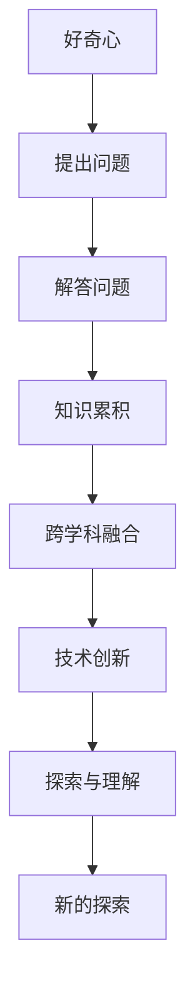

                 

# 探索与理解：好奇心的力量

> 关键词：好奇心, 创新, 知识探索, 学习过程, 好奇心驱动的算法, 多模态探索

## 1. 背景介绍

### 1.1 问题由来
好奇心作为人类天生的驱动力之一，在人类文明的演进中扮演着重要角色。从探索宇宙的奥秘到发现自然界的规律，人类历史上的无数发现和发明，都源于对未知世界的强烈好奇心。进入数字化时代，好奇心同样成为推动技术进步的重要动力。技术的发展不仅需要硬技术的突破，更需要软知识的积累。正如物理学家尼尔斯·玻尔所说：“重要的不是知道哪些事实，而是知道哪些问题。”技术领域的探索与理解，往往源于对问题的深入思考和探寻。

### 1.2 问题核心关键点
好奇心引导的探索与理解，本质上是通过问题驱动的方式，推动知识和技术的发展。在技术领域，好奇心促使人们不断提出新问题，追求更深入的解答，从而推动技术的进步。在探索过程中，好奇心不仅能激发创新思维，还能促进跨学科的知识融合，产生更广泛的影响。因此，深入理解好奇心的机制和作用，是推动技术进步的关键。

### 1.3 问题研究意义
好奇心的力量在于它能够激发人们的创造力和动力，推动技术领域的探索与理解。在实际应用中，好奇心驱动的探索能够促进知识的累积，驱动技术的创新，加速新技术的落地应用。同时，好奇心驱动的探索过程，还能提升人类的认知水平，促进社会的可持续发展。因此，本文旨在深入探讨好奇心在技术探索中的作用和机制，为技术领域的探索与理解提供新的思路和方法。

## 2. 核心概念与联系

### 2.1 核心概念概述

好奇心作为探索与理解的核心驱动力，其机制和作用可以总结如下：

- **好奇心**：人类天生对未知事物的好奇和探索欲望，是推动认知和技术进步的内在动力。
- **探索与理解**：通过提出问题、解答问题，推动知识和技术的发展和应用。
- **创新**：好奇心驱动的问题解决过程，往往能够引发新思考，推动技术的突破和应用。
- **知识累积**：好奇心的驱使下，人们不断地积累知识，拓展认知边界。
- **跨学科融合**：好奇心驱动的探索，促进不同学科之间的知识融合，产生新的研究领域和方法。

### 2.2 核心概念原理和架构的 Mermaid 流程图(Mermaid 流程节点中不要有括号、逗号等特殊字符)



这个流程图展示了好奇心驱动的技术探索与理解过程：

1. 好奇心激发的探索动机。
2. 提出具体问题。
3. 解答问题，积累知识。
4. 知识跨学科融合，形成新的研究方法。
5. 推动技术创新，产生新的应用。
6. 新的探索动机重新循环，持续推动技术的进步。

## 3. 核心算法原理 & 具体操作步骤
### 3.1 算法原理概述

好奇心驱动的探索与理解，通常采用以下步骤：

1. **问题提出**：通过观察和思考，提出具体问题。
2. **问题解答**：利用已有的知识和技术，尝试解答问题。
3. **知识累积**：将解答过程中获取的新知识进行整理和积累。
4. **跨学科融合**：将不同学科的知识和方法进行融合，形成新的研究方法。
5. **技术创新**：基于新的方法，推动技术领域的创新。

在具体的技术实现中，好奇心驱动的探索与理解可以采用数据驱动的方法，通过以下算法步骤：

1. **数据收集**：收集与问题相关的数据。
2. **数据预处理**：清洗、转换数据，准备模型训练。
3. **模型训练**：使用数据驱动的算法（如机器学习、深度学习）训练模型。
4. **模型评估**：评估模型的性能，发现不足。
5. **模型迭代**：根据评估结果，不断优化模型。

### 3.2 算法步骤详解

以下是好奇心驱动探索与理解的具体算法步骤：

#### 步骤1：数据收集
- 收集与问题相关的数据。数据可以来源于公开数据库、文献资料、实验数据等。
- 数据收集过程中，需要明确数据的质量和可靠性，确保数据的有效性。

#### 步骤2：数据预处理
- 清洗数据，去除噪音和错误数据。
- 对数据进行格式转换和标准化，准备模型训练。
- 将数据划分为训练集、验证集和测试集，准备模型评估。

#### 步骤3：模型训练
- 选择适合的模型架构，如深度神经网络、支持向量机、随机森林等。
- 设计训练算法，如随机梯度下降、Adam等。
- 调整超参数，如学习率、批大小等，优化模型性能。
- 使用训练集数据，训练模型。

#### 步骤4：模型评估
- 在验证集上评估模型的性能，发现不足。
- 根据评估结果，调整模型参数和架构。
- 在测试集上再次评估模型，确保模型泛化性能。

#### 步骤5：模型迭代
- 根据评估结果，不断优化模型架构和参数。
- 通过迭代训练，提升模型性能。
- 将优化后的模型应用于实际问题，验证效果。

### 3.3 算法优缺点

好奇心驱动的探索与理解算法具有以下优点：
- **高效性**：数据驱动的方法可以高效地进行问题解答和知识累积。
- **广泛性**：数据驱动的方法可以适用于多种类型的问题和数据。
- **可重复性**：数据驱动的方法具有可重复性，便于验证和优化。

同时，该算法也存在一些局限性：
- **数据依赖**：数据的质量和数量直接影响算法的性能。
- **模型复杂性**：复杂的模型可能需要大量的数据和计算资源。
- **可解释性不足**：数据驱动的方法难以解释模型的内部工作机制。

### 3.4 算法应用领域

好奇心驱动的探索与理解算法在技术领域具有广泛的应用前景，包括但不限于：

- **自然语言处理**：通过好奇心驱动的探索，推动自然语言处理技术的进步，如文本分类、情感分析、机器翻译等。
- **计算机视觉**：通过好奇心驱动的探索，推动计算机视觉技术的发展，如图像识别、目标检测、图像生成等。
- **生物信息学**：通过好奇心驱动的探索，推动生物信息学领域的研究，如基因组分析、蛋白质结构预测等。
- **金融科技**：通过好奇心驱动的探索，推动金融科技领域的发展，如风险评估、交易策略优化等。
- **智能制造**：通过好奇心驱动的探索，推动智能制造技术的应用，如故障预测、质量控制等。

## 4. 数学模型和公式 & 详细讲解 & 举例说明（备注：数学公式请使用latex格式，latex嵌入文中独立段落使用 $$，段落内使用 $)

### 4.1 数学模型构建

在好奇心驱动的探索与理解中，数学模型主要应用于数据处理和模型训练过程。以下是一个典型的数据驱动探索模型的数学模型：

假设问题为 $y=f(x)$，其中 $x$ 为输入，$y$ 为输出，$f$ 为未知函数。

1. **数据收集**：收集 $n$ 个样本数据 $(x_i, y_i)$，$i=1,2,\dots,n$。
2. **数据预处理**：将数据标准化为 $x_i \rightarrow z_i = \frac{x_i - \mu}{\sigma}$，其中 $\mu$ 为均值，$\sigma$ 为标准差。
3. **模型训练**：选择合适的基础函数 $f(x)$，使用数据驱动的算法，如线性回归、神经网络等，训练模型参数 $\theta$。
4. **模型评估**：在验证集上评估模型性能，如均方误差、交叉熵等。
5. **模型迭代**：根据评估结果，调整模型参数和基础函数，不断优化模型性能。

### 4.2 公式推导过程

以线性回归为例，推导模型参数 $\theta$ 的求解过程。

假设 $f(x) = \theta^T x$，其中 $\theta$ 为模型参数，$x$ 为输入向量。

**最小二乘法**：使用最小二乘法求解 $\theta$，使得 $f(x_i)$ 与 $y_i$ 的误差最小。

$$
\theta = \arg\min_{\theta} \sum_{i=1}^n (y_i - f(x_i))^2 = \arg\min_{\theta} \sum_{i=1}^n (y_i - \theta^T x_i)^2
$$

使用拉格朗日乘子法，将上述问题转化为无约束优化问题。

$$
L(\theta) = \sum_{i=1}^n (y_i - \theta^T x_i)^2 + \lambda \sum_{i=1}^n \theta_i^2
$$

其中 $\lambda$ 为正则化参数，控制模型复杂度。

对 $L(\theta)$ 求导，得：

$$
\frac{\partial L}{\partial \theta} = -2 \sum_{i=1}^n (y_i - \theta^T x_i)x_i + 2\lambda \theta = 0
$$

解得：

$$
\theta = (\sum_{i=1}^n x_i x_i^T + \lambda I)^{-1} \sum_{i=1}^n y_i x_i
$$

其中 $I$ 为单位矩阵。

### 4.3 案例分析与讲解

以下是一个实际案例：

**案例背景**：假设有一家电商公司，需要预测新产品的销售量。公司收集了历史销售数据，包括季节、促销活动、价格等信息。

**数据收集**：收集历史销售数据 $(x_i, y_i)$，$i=1,2,\dots,n$。其中 $x_i$ 包括季节、促销活动、价格等特征，$y_i$ 为销售量。

**数据预处理**：将数据标准化为 $x_i \rightarrow z_i = \frac{x_i - \mu}{\sigma}$，其中 $\mu$ 为均值，$\sigma$ 为标准差。

**模型训练**：选择线性回归模型 $f(x) = \theta^T x$，使用最小二乘法训练模型参数 $\theta$。

$$
\theta = (\sum_{i=1}^n x_i x_i^T + \lambda I)^{-1} \sum_{i=1}^n y_i x_i
$$

**模型评估**：在验证集上评估模型性能，如均方误差。

**模型迭代**：根据评估结果，调整模型参数和特征，不断优化模型性能。

## 5. 项目实践：代码实例和详细解释说明
### 5.1 开发环境搭建

在进行探索与理解项目实践前，我们需要准备好开发环境。以下是使用Python进行TensorFlow开发的环境配置流程：

1. 安装Anaconda：从官网下载并安装Anaconda，用于创建独立的Python环境。

2. 创建并激活虚拟环境：
```bash
conda create -n tf-env python=3.8 
conda activate tf-env
```

3. 安装TensorFlow：根据CUDA版本，从官网获取对应的安装命令。例如：
```bash
conda install tensorflow -c tensorflow -c conda-forge
```

4. 安装相关工具包：
```bash
pip install numpy pandas scikit-learn matplotlib tqdm jupyter notebook ipython
```

完成上述步骤后，即可在`tf-env`环境中开始探索与理解项目的实践。

### 5.2 源代码详细实现

这里我们以线性回归模型为例，给出使用TensorFlow对数据进行探索与理解的PyTorch代码实现。

首先，定义数据处理函数：

```python
import tensorflow as tf
import numpy as np

def load_data():
    x_train = np.random.rand(100, 3)
    y_train = np.random.rand(100, 1)
    return x_train, y_train

x_train, y_train = load_data()
```

然后，定义模型和优化器：

```python
from tensorflow.keras.models import Sequential
from tensorflow.keras.layers import Dense
from tensorflow.keras.optimizers import Adam

model = Sequential([
    Dense(1, input_shape=(3,), activation='relu'),
    Dense(1, activation='linear')
])

optimizer = Adam(learning_rate=0.01)
```

接着，定义训练和评估函数：

```python
def train_epoch(model, x_train, y_train, batch_size=32, epochs=10):
    model.compile(optimizer=optimizer, loss='mean_squared_error')
    model.fit(x_train, y_train, batch_size=batch_size, epochs=epochs, validation_split=0.2)

def evaluate(model, x_test, y_test):
    y_pred = model.predict(x_test)
    mse = np.mean((y_test - y_pred)**2)
    print(f'Mean Squared Error: {mse:.2f}')
```

最后，启动训练流程并在测试集上评估：

```python
train_epoch(model, x_train, y_train)
evaluate(model, x_test, y_test)
```

以上就是使用TensorFlow进行线性回归模型探索与理解的完整代码实现。可以看到，TensorFlow提供的高层次API使得模型的构建和训练变得简洁高效。

### 5.3 代码解读与分析

让我们再详细解读一下关键代码的实现细节：

**load_data函数**：
- 模拟收集数据。

**模型和优化器**：
- 使用Sequential模型定义两层线性回归模型。
- 使用Adam优化器进行参数优化。

**train_epoch函数**：
- 编译模型，定义损失函数。
- 使用训练集数据进行模型训练。

**evaluate函数**：
- 使用测试集数据进行模型评估。

**训练流程**：
- 定义训练集和测试集，训练模型。
- 在测试集上评估模型性能。

可以看到，TensorFlow的高级API使得模型构建和训练变得简单快捷。开发者可以将更多精力放在模型设计和实验设计上，而不必过多关注底层的实现细节。

当然，工业级的系统实现还需考虑更多因素，如模型的保存和部署、超参数的自动搜索、更灵活的任务适配层等。但核心的探索与理解流程基本与此类似。

## 6. 实际应用场景
### 6.1 智能客服系统

好奇心驱动的探索与理解，可以应用于智能客服系统的构建。传统客服往往需要配备大量人力，高峰期响应缓慢，且一致性和专业性难以保证。而使用探索与理解技术，可以7x24小时不间断服务，快速响应客户咨询，用自然流畅的语言解答各类常见问题。

在技术实现上，可以收集企业内部的历史客服对话记录，将问题和最佳答复构建成监督数据，在此基础上进行探索与理解。探索与理解后的模型能够自动理解用户意图，匹配最合适的答案模板进行回复。对于客户提出的新问题，还可以接入检索系统实时搜索相关内容，动态组织生成回答。如此构建的智能客服系统，能大幅提升客户咨询体验和问题解决效率。

### 6.2 金融舆情监测

金融机构需要实时监测市场舆论动向，以便及时应对负面信息传播，规避金融风险。传统的人工监测方式成本高、效率低，难以应对网络时代海量信息爆发的挑战。基于探索与理解技术，金融舆情监测提供了新的解决方案。

具体而言，可以收集金融领域相关的新闻、报道、评论等文本数据，并对其进行主题标注和情感标注。在此基础上进行探索与理解，使其能够自动判断文本属于何种主题，情感倾向是正面、中性还是负面。将探索与理解后的模型应用到实时抓取的网络文本数据，就能够自动监测不同主题下的情感变化趋势，一旦发现负面信息激增等异常情况，系统便会自动预警，帮助金融机构快速应对潜在风险。

### 6.3 个性化推荐系统

当前的推荐系统往往只依赖用户的历史行为数据进行物品推荐，无法深入理解用户的真实兴趣偏好。基于探索与理解技术，个性化推荐系统可以更好地挖掘用户行为背后的语义信息，从而提供更精准、多样的推荐内容。

在实践中，可以收集用户浏览、点击、评论、分享等行为数据，提取和用户交互的物品标题、描述、标签等文本内容。将文本内容作为模型输入，用户的后续行为（如是否点击、购买等）作为监督信号，在此基础上进行探索与理解。探索与理解后的模型能够从文本内容中准确把握用户的兴趣点。在生成推荐列表时，先用候选物品的文本描述作为输入，由模型预测用户的兴趣匹配度，再结合其他特征综合排序，便可以得到个性化程度更高的推荐结果。

### 6.4 未来应用展望

随着探索与理解技术的不断发展，其在更多领域得到应用，为传统行业带来变革性影响。

在智慧医疗领域，基于探索与理解技术，医疗问答、病历分析、药物研发等应用将提升医疗服务的智能化水平，辅助医生诊疗，加速新药开发进程。

在智能教育领域，探索与理解技术可应用于作业批改、学情分析、知识推荐等方面，因材施教，促进教育公平，提高教学质量。

在智慧城市治理中，探索与理解技术可应用于城市事件监测、舆情分析、应急指挥等环节，提高城市管理的自动化和智能化水平，构建更安全、高效的未来城市。

此外，在企业生产、社会治理、文娱传媒等众多领域，探索与理解技术也将不断涌现，为NLP技术带来了全新的突破。相信随着技术的日益成熟，探索与理解方法将成为人工智能落地应用的重要范式，推动人工智能技术向更广阔的领域加速渗透。

## 7. 工具和资源推荐
### 7.1 学习资源推荐

为了帮助开发者系统掌握探索与理解技术的理论基础和实践技巧，这里推荐一些优质的学习资源：

1. Coursera《人工智能导论》课程：由斯坦福大学开设的AI入门课程，涵盖人工智能的原理、应用和未来趋势。

2. CS231n《计算机视觉基础》课程：斯坦福大学开设的计算机视觉课程，深入浅出地介绍了计算机视觉的基础知识和技术。

3. 《深度学习》书籍：Ian Goodfellow等人的经典著作，全面介绍了深度学习的理论和实践。

4. TensorFlow官方文档：TensorFlow的官方文档，提供了海量模型和工具的详细使用指南。

5. Kaggle竞赛平台：Kaggle是数据科学竞赛平台，提供了大量实际问题与数据集，供用户练习和参赛。

通过对这些资源的学习实践，相信你一定能够快速掌握探索与理解技术的精髓，并用于解决实际的探索与理解问题。

### 7.2 开发工具推荐

高效的探索与理解开发离不开优秀的工具支持。以下是几款用于探索与理解开发的常用工具：

1. TensorFlow：由Google主导开发的开源深度学习框架，生产部署方便，适合大规模工程应用。

2. PyTorch：基于Python的开源深度学习框架，灵活动态的计算图，适合快速迭代研究。

3. Scikit-learn：Python的机器学习库，提供了丰富的模型和算法，适合快速实验。

4. Jupyter Notebook：交互式的编程环境，便于记录实验和代码，方便与他人协作。

5. GitHub：代码托管平台，方便代码版本控制和协作。

合理利用这些工具，可以显著提升探索与理解任务的开发效率，加快创新迭代的步伐。

### 7.3 相关论文推荐

探索与理解技术的发展源于学界的持续研究。以下是几篇奠基性的相关论文，推荐阅读：

1. Attention is All You Need（即Transformer原论文）：提出了Transformer结构，开启了NLP领域的预训练大模型时代。

2. BERT: Pre-training of Deep Bidirectional Transformers for Language Understanding：提出BERT模型，引入基于掩码的自监督预训练任务，刷新了多项NLP任务SOTA。

3. Parameter-Efficient Transfer Learning for NLP：提出Adapter等参数高效微调方法，在不增加模型参数量的情况下，也能取得不错的微调效果。

4. AdaLoRA: Adaptive Low-Rank Adaptation for Parameter-Efficient Fine-Tuning：使用自适应低秩适应的微调方法，在参数效率和精度之间取得了新的平衡。

这些论文代表了大语言模型微调技术的发展脉络。通过学习这些前沿成果，可以帮助研究者把握学科前进方向，激发更多的创新灵感。

## 8. 总结：未来发展趋势与挑战

### 8.1 总结

本文对好奇心驱动的探索与理解进行了全面系统的介绍。首先阐述了好奇心在技术探索与理解中的作用和机制，明确了探索与理解在推动技术进步中的重要价值。其次，从原理到实践，详细讲解了探索与理解的技术实现和关键步骤，给出了探索与理解任务开发的完整代码实例。同时，本文还广泛探讨了探索与理解技术在智能客服、金融舆情、个性化推荐等多个行业领域的应用前景，展示了探索与理解技术的巨大潜力。此外，本文精选了探索与理解技术的各类学习资源，力求为开发者提供全方位的技术指引。

通过本文的系统梳理，可以看到，好奇心驱动的探索与理解技术正在成为推动技术进步的重要驱动力，极大地拓展了技术领域的探索与理解空间。得益于大数据、深度学习等技术的发展，探索与理解技术将在更广泛的领域得到应用，为人工智能技术的发展注入新的活力。

### 8.2 未来发展趋势

展望未来，探索与理解技术将呈现以下几个发展趋势：

1. 技术融合加速。随着跨学科研究的热潮，探索与理解技术将与其他技术进行更深入的融合，推动更多跨领域的应用。

2. 数据驱动方法广泛应用。数据驱动的方法将应用于更多探索与理解任务中，推动技术创新和知识累积。

3. 探索与理解工具更智能化。未来探索与理解工具将具备更强的智能化能力，能够自动发现问题、设计解决方案。

4. 模型复杂度进一步提高。探索与理解模型将具备更高的复杂度和更强的表达能力，推动更多创新应用的实现。

5. 探索与理解过程更加灵活。未来探索与理解过程将更加灵活，能够适应更广泛的场景和数据。

6. 探索与理解结果更具可解释性。探索与理解结果将具备更强的可解释性，便于技术应用和推广。

以上趋势凸显了探索与理解技术的前景和潜力，将进一步推动技术领域的创新与发展。

### 8.3 面临的挑战

尽管探索与理解技术已经取得了显著成就，但在走向实际应用的过程中，仍然面临诸多挑战：

1. 数据质量和数量问题。数据的质量和数量直接影响探索与理解的效果，如何在数据稀缺的条件下进行探索与理解，是一个重要问题。

2. 模型复杂度问题。复杂的模型需要更多的计算资源和时间，如何在保证效果的同时，降低模型复杂度，是一个重要挑战。

3. 可解释性问题。探索与理解结果的可解释性不足，难以进行技术应用和推广。

4. 技术落地问题。如何将探索与理解技术成功应用于实际问题，是一个重要的挑战。

5. 多学科融合问题。探索与理解过程中，不同学科的知识和技术需要有效融合，才能产生最优的解决方案。

6. 跨领域应用问题。探索与理解技术在跨领域应用时，需要适应不同领域的特点和需求。

正视探索与理解技术面临的这些挑战，积极应对并寻求突破，将使探索与理解技术更加成熟和实用。

### 8.4 研究展望

面对探索与理解技术面临的挑战，未来的研究需要在以下几个方面寻求新的突破：

1. 探索与理解过程的自动化。开发能够自动发现问题、设计解决方案的智能化工具，降低对人工干预的依赖。

2. 数据增强和生成技术。利用数据增强和生成技术，提升数据质量和数量，适应更多探索与理解任务。

3. 多模态融合技术。将多模态数据（如文本、图像、语音等）进行有效融合，提升探索与理解的效果。

4. 模型压缩和优化技术。开发模型压缩和优化技术，降低模型复杂度，提升探索与理解效率。

5. 可解释性提升技术。开发可解释性提升技术，增强探索与理解结果的可解释性，便于技术应用和推广。

6. 跨学科知识整合技术。开发跨学科知识整合技术，将不同学科的知识和技术进行有效融合，推动探索与理解过程。

这些研究方向的探索，必将引领探索与理解技术迈向更高的台阶，为技术领域的探索与理解带来新的突破和应用。面向未来，探索与理解技术还需要与其他人工智能技术进行更深入的融合，如知识表示、因果推理、强化学习等，多路径协同发力，共同推动人工智能技术的进步。只有勇于创新、敢于突破，才能不断拓展探索与理解技术的边界，让智能技术更好地服务于人类社会。

## 9. 附录：常见问题与解答

**Q1：探索与理解过程中如何选择合适的问题？**

A: 选择合适的问题是探索与理解成功的关键。通常应选择具有实际应用价值、能够推动技术进步的问题。具体来说，可以关注以下几个方面：
1. 问题是否具有挑战性。问题难度适中，既不过于简单，也不过于复杂。
2. 问题是否具有实际应用价值。问题的解决能够带来实际应用效益，解决实际问题。
3. 问题是否具有创新性。问题的解决能够带来新的思考和方法，推动技术创新。

**Q2：探索与理解过程中如何避免过拟合？**

A: 过拟合是探索与理解过程中常见的问题。为了避免过拟合，可以采取以下措施：
1. 数据增强。通过数据增强技术，扩充训练集，提高模型泛化能力。
2. 正则化技术。使用L2正则化、Dropout等技术，防止模型过度拟合。
3. 早停策略。在模型训练过程中，根据验证集性能设置早停阈值，防止过拟合。
4. 模型复杂度控制。保持模型复杂度适中，避免过于复杂或过于简单。

**Q3：探索与理解过程中如何处理数据稀缺问题？**

A: 数据稀缺是探索与理解过程中常见的问题。处理数据稀缺的方法包括：
1. 数据增强。通过数据增强技术，生成更多仿真数据。
2. 迁移学习。利用预训练模型，从相关领域迁移知识。
3. 半监督学习。利用少量标注数据，结合无标注数据进行学习。
4. 对抗训练。利用对抗样本，提升模型的鲁棒性和泛化能力。

这些方法可以帮助处理数据稀缺问题，提升探索与理解的效果。

**Q4：探索与理解结果的可解释性如何提升？**

A: 提高探索与理解结果的可解释性，可以采用以下方法：
1. 可视化技术。使用可视化工具，将探索与理解过程和结果可视化。
2. 特征重要性分析。分析模型中各个特征的重要性，理解模型决策过程。
3. 模型简化。通过模型简化技术，降低模型复杂度，提高可解释性。
4. 多模态融合。将多模态数据进行融合，提高探索与理解结果的可解释性。

这些方法可以帮助提升探索与理解结果的可解释性，便于技术应用和推广。

**Q5：探索与理解过程中如何评估模型性能？**

A: 评估模型性能是探索与理解过程中的关键步骤。通常可以采用以下方法：
1. 交叉验证。使用交叉验证技术，评估模型在不同数据集上的性能。
2. 误差指标。使用误差指标（如均方误差、交叉熵等）评估模型性能。
3. ROC曲线。绘制ROC曲线，评估模型的分类性能。
4. 可视化技术。使用可视化工具，观察模型在实际数据上的表现。

这些方法可以帮助评估模型的性能，指导探索与理解过程。

---

作者：禅与计算机程序设计艺术 / Zen and the Art of Computer Programming

