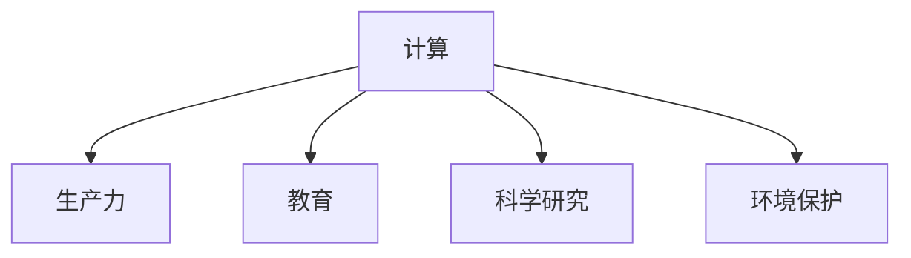

                 

# 推动社会进步的动力：人类计算的积极影响

## 1. 背景介绍

在现代科技飞速发展的今天，计算已成为推动社会进步的强大动力。从宏观到微观，从经济到社会，计算技术正在全方位、多层次地重塑着我们的世界。本文将深入探讨人类计算的积极影响，分析其在提升生产力、促进教育、推动科学研究、保护环境等方面的作用，并展望其未来发展趋势与挑战。

## 2. 核心概念与联系

### 2.1 核心概念概述

1. **计算**：指使用计算机或类似设备进行信息处理的过程，包括数据的收集、存储、处理、分析和展示。计算可以是基于规则的逻辑计算，也可以是基于统计学习、机器学习的非线性计算。

2. **生产力**：生产力是指单位时间内生产的产品或服务数量，是衡量社会进步的重要指标。计算技术通过优化资源配置、提高生产效率、增强决策支持等方式，对生产力产生积极影响。

3. **教育**：教育是人类文明进步的基础，计算技术在教育中的应用，如在线教育、自适应学习、智能辅导等，正在改变传统教学模式，提升教育质量和效率。

4. **科学研究**：计算技术在科学研究中的应用，如数据分析、模拟实验、知识图谱构建等，极大地促进了科学发现和技术创新。

5. **环境保护**：计算技术在环境保护中的应用，如数据分析、模拟预测、智能监测等，正在帮助人类更好地理解和保护自然环境。

这些概念之间的逻辑关系可以通过以下Mermaid流程图来展示：



这个流程图展示计算技术在多个领域的影响：

- 计算技术通过优化资源配置、提高生产效率，显著提升生产力。
- 通过在线教育、自适应学习、智能辅导等方式，改变传统教学模式，提升教育质量和效率。
- 通过数据分析、模拟实验、知识图谱构建等，促进科学研究和技术创新。
- 通过数据分析、模拟预测、智能监测等，保护自然环境，实现可持续发展。

## 3. 核心算法原理 & 具体操作步骤

### 3.1 算法原理概述

基于计算的社会进步效应主要体现在以下几个方面：

1. **数据驱动决策**：计算技术能够快速处理和分析海量数据，为决策提供科学的依据。
2. **自动化生产**：通过计算技术实现生产过程的自动化，显著提高生产效率和质量。
3. **智能辅助教育**：计算技术能够提供个性化的学习建议和资源，提升教育效果。
4. **科学研究加速**：计算技术能够模拟实验、构建知识图谱，加速科学发现和创新。
5. **环境保护支持**：计算技术能够进行数据分析、预测，支持环境保护和可持续发展。

### 3.2 算法步骤详解

1. **数据收集**：收集各个领域的数据，包括经济、教育、科学、环境等领域的相关数据。
2. **数据处理**：使用计算技术对数据进行清洗、转换和存储，为后续分析做准备。
3. **数据分析**：利用机器学习、统计分析等方法对数据进行深入分析，提取有价值的信息。
4. **模型构建**：基于分析结果，构建模型，预测未来趋势，优化决策方案。
5. **实施与评估**：将模型应用到实际场景中，评估实施效果，不断迭代优化。

### 3.3 算法优缺点

计算技术在推动社会进步方面有其显著的优势，但也存在一些不足：

**优点**：
- **效率提升**：计算技术能够快速处理和分析大量数据，提高决策和生产的效率。
- **精准度提高**：通过数据驱动的方法，计算能够提供更精准的决策支持。
- **可扩展性**：计算技术能够处理不同规模的数据，具有较强的可扩展性。

**缺点**：
- **隐私问题**：数据的收集和使用可能涉及隐私问题，需要合理的隐私保护措施。
- **技术依赖**：计算技术的应用依赖于高质量的数据和强大的计算能力，存在一定的技术门槛。
- **伦理挑战**：计算技术的应用可能带来伦理和道德方面的挑战，需要制定相应的规范和标准。

### 3.4 算法应用领域

计算技术的应用已经渗透到社会的各个领域，具体包括：

1. **经济**：大数据分析、智能推荐、金融预测等。
2. **教育**：在线教育、自适应学习、智能辅导等。
3. **科学研究**：科学模拟、知识图谱、大数据分析等。
4. **环境保护**：环境监测、污染预测、碳排放管理等。
5. **公共卫生**：疫情预测、疫苗研发、医疗数据分析等。

## 4. 数学模型和公式 & 详细讲解 & 举例说明

### 4.1 数学模型构建

以在线教育的推荐系统为例，构建如下数学模型：

设 $\mathcal{D} = \{(x_i, y_i)\}_{i=1}^N$ 为训练集，其中 $x_i$ 表示用户行为数据，$y_i$ 表示推荐结果（观看时长、评分等）。

**目标函数**：最小化预测误差，即最小化预测值与真实值之间的差异。
$$
\min_{\theta} \frac{1}{N} \sum_{i=1}^N (y_i - f_{\theta}(x_i))^2
$$

**损失函数**：
$$
L(\theta) = \frac{1}{N} \sum_{i=1}^N (y_i - f_{\theta}(x_i))^2
$$

**优化算法**：
$$
\theta \leftarrow \theta - \eta \nabla_{\theta}L(\theta)
$$

其中 $\theta$ 为模型参数，$\nabla_{\theta}L(\theta)$ 为损失函数对参数的梯度。

### 4.2 公式推导过程

推导过程如下：

1. 将损失函数 $L(\theta)$ 展开：
$$
L(\theta) = \frac{1}{N} \sum_{i=1}^N (y_i - f_{\theta}(x_i))^2
$$

2. 对 $\theta$ 求偏导：
$$
\frac{\partial L(\theta)}{\partial \theta} = -\frac{2}{N} \sum_{i=1}^N (y_i - f_{\theta}(x_i))f_{\theta}'(x_i) \frac{\partial x_i}{\partial \theta}
$$

3. 使用梯度下降法更新参数：
$$
\theta \leftarrow \theta - \eta \frac{\partial L(\theta)}{\partial \theta}
$$

### 4.3 案例分析与讲解

以推荐系统为例，分析计算在提升在线教育质量中的应用：

1. **数据收集**：收集用户的观看历史、互动行为等数据。
2. **数据处理**：对数据进行清洗和转换，提取特征。
3. **模型构建**：使用协同过滤、神经网络等方法，构建推荐模型。
4. **优化训练**：使用梯度下降等优化算法，训练模型。
5. **效果评估**：在测试集上评估模型的准确性和效率。

## 5. 项目实践：代码实例和详细解释说明

### 5.1 开发环境搭建

以下是使用Python进行TensorFlow开发的环境配置流程：

1. 安装Anaconda：从官网下载并安装Anaconda，用于创建独立的Python环境。

2. 创建并激活虚拟环境：
```bash
conda create -n tensorflow-env python=3.8 
conda activate tensorflow-env
```

3. 安装TensorFlow：根据CUDA版本，从官网获取对应的安装命令。例如：
```bash
conda install tensorflow=2.8 -c tf -c conda-forge
```

4. 安装各类工具包：
```bash
pip install numpy pandas scikit-learn matplotlib tqdm jupyter notebook ipython
```

完成上述步骤后，即可在`tensorflow-env`环境中开始项目实践。

### 5.2 源代码详细实现

我们使用TensorFlow的推荐系统API构建一个简单的在线教育推荐系统：

```python
import tensorflow as tf
from tensorflow.keras import layers

# 定义模型
model = tf.keras.Sequential([
    layers.Dense(32, activation='relu'),
    layers.Dense(16, activation='relu'),
    layers.Dense(1, activation='sigmoid')
])

# 编译模型
model.compile(optimizer='adam', loss='mse')

# 训练模型
model.fit(train_data, train_labels, epochs=10, validation_data=(val_data, val_labels))

# 评估模型
test_loss = model.evaluate(test_data, test_labels)
```

**详细解释与分析**：

- `Sequential` 层堆叠：使用 `Sequential` 模型定义一个简单的神经网络结构，包含两个全连接层和一个输出层。
- `Dense` 层定义：定义全连接层，使用 ReLU 激活函数增强非线性特性。
- `compile` 方法编译：设置损失函数为均方误差（mse），使用 Adam 优化器优化模型参数。
- `fit` 方法训练：使用训练数据集和标签进行模型训练，设定训练轮数为 10。
- `evaluate` 方法评估：使用测试数据集和标签评估模型效果，返回测试集上的均方误差损失。

### 5.3 代码解读与分析

**Sequential模型堆叠**：
- `Sequential` 是TensorFlow中常用的序列模型，用于堆叠多个层，构建神经网络。
- 模型由输入层、隐藏层、输出层组成，各层之间通过线性变换和激活函数连接。

**Dense层定义**：
- `Dense` 层是常用的全连接层，将输入数据线性变换为输出数据。
- 通过设置激活函数，引入非线性特性，增强模型表达能力。

**compile方法编译**：
- `compile` 方法用于配置模型的优化器和损失函数，设定训练时的参数。
- 设置均方误差（mse）作为损失函数，使用 Adam 优化器优化模型参数。

**fit方法训练**：
- `fit` 方法用于训练模型，通过指定训练数据和标签，对模型进行优化。
- 设定训练轮数为 10，表示模型在训练数据上反复训练 10 次，以更新模型参数。

**evaluate方法评估**：
- `evaluate` 方法用于评估模型，通过指定测试数据和标签，计算模型在测试集上的均方误差损失。
- 返回测试集上的损失值，用于评估模型性能。

**运行结果展示**：

在完成模型训练和评估后，输出测试集上的均方误差（mse）损失值，评估模型效果。

## 6. 实际应用场景

### 6.1 智慧医疗

在智慧医疗领域，计算技术通过数据分析和建模，支持疾病预测、药物研发、个性化治疗等方面，极大地提高了医疗服务的效率和质量。

1. **疾病预测**：通过收集患者的生理数据、历史病历等，利用机器学习模型预测疾病风险，提前干预，预防疾病。
2. **药物研发**：利用计算技术模拟分子结构、化学反应等，加速药物筛选和设计，提高研发效率。
3. **个性化治疗**：根据患者基因数据、生活习惯等，提供个性化的治疗方案，提高治疗效果。

### 6.2 智能交通

智能交通领域通过计算技术实现交通管理、车辆调度、智能导航等功能，提高了交通效率，减少了拥堵和事故。

1. **交通管理**：利用数据分析和模型预测，优化交通信号灯控制，提高交通流量和通行效率。
2. **车辆调度**：通过实时监控和路径规划，优化车辆调度，减少交通拥堵和碳排放。
3. **智能导航**：利用高精度地图和实时数据分析，提供智能导航服务，减少交通拥堵和事故。

### 6.3 智能家居

智能家居领域通过计算技术实现家居自动化、智能控制、安全监控等功能，提升了家居生活的便利性和安全性。

1. **家居自动化**：通过智能传感器和物联网设备，实现家居自动化控制，提高生活质量。
2. **智能控制**：利用语音识别、自然语言处理技术，实现智能家居控制，增强用户体验。
3. **安全监控**：通过视频监控、智能识别技术，实现安全监控，提高家居安全。

## 7. 工具和资源推荐

### 7.1 学习资源推荐

为了帮助开发者系统掌握计算技术的应用，这里推荐一些优质的学习资源：

1. 《深度学习》系列书籍：由深度学习领域的知名专家撰写，涵盖深度学习基础、算法、应用等方面，是深入学习计算技术的必读书籍。
2. Coursera《机器学习》课程：由斯坦福大学开设的机器学习课程，提供系统全面的学习内容，包括监督学习、无监督学习、深度学习等方面。
3. Kaggle平台：数据科学竞赛平台，提供大量数据集和比赛，有助于实践和提升计算技术的应用能力。
4. GitHub开源项目：GitHub上众多开源项目，涵盖各类计算技术的应用，可以参考和学习。
5. TensorFlow官方文档：TensorFlow官方文档，提供完整的API文档和示例代码，方便开发者学习和实践。

通过对这些资源的学习实践，相信你一定能够快速掌握计算技术的精髓，并用于解决实际的计算问题。

### 7.2 开发工具推荐

高效的开发离不开优秀的工具支持。以下是几款用于计算技术开发的常用工具：

1. TensorFlow：由Google主导开发的深度学习框架，生产部署方便，适合大规模工程应用。
2. PyTorch：基于Python的开源深度学习框架，灵活高效，适合快速迭代研究。
3. Jupyter Notebook：交互式笔记本环境，方便进行数据处理、模型训练和结果展示。
4. Visual Studio Code：轻量级、高效的全栈编辑器，支持多种编程语言和插件。
5. Docker：容器化技术，方便开发、测试和部署计算模型。

合理利用这些工具，可以显著提升计算技术应用的开发效率，加快创新迭代的步伐。

### 7.3 相关论文推荐

计算技术的发展源于学界的持续研究。以下是几篇奠基性的相关论文，推荐阅读：

1. "Deep Learning" 书籍：Ian Goodfellow, Yoshua Bengio, Aaron Courville 著，全面介绍了深度学习的基本概念、算法和应用。
2. "TensorFlow Whitepaper"：TensorFlow的官方白皮书，详细介绍了TensorFlow的设计思想和实现细节。
3. "Scikit-Learn" 书籍：Gael Varoquaux, Alexandre Gramfort, Arnaud Joly, Peter Prettenhofer, Pierre Weiss, Vincent Dubourg 著，介绍了机器学习算法的Python实现。
4. "PyTorch 1.0: An Easy-to-use Research Platform"：PyTorch的官方博客，介绍了PyTorch的设计理念和应用场景。
5. "A Survey of Deep Learning Techniques for Drug Discovery"：DeepMind的研究论文，介绍了计算技术在药物研发中的应用。

这些论文代表了大规模计算技术的发展脉络。通过学习这些前沿成果，可以帮助研究者把握学科前进方向，激发更多的创新灵感。

## 8. 总结：未来发展趋势与挑战

### 8.1 研究成果总结

计算技术在推动社会进步方面已经取得了显著的成就，主要体现在以下几个方面：

1. **生产力提升**：通过数据驱动决策和自动化生产，计算技术显著提高了生产效率和质量。
2. **教育改进**：通过在线教育、自适应学习等技术，计算技术提升了教育质量和效率。
3. **科学研究加速**：通过科学模拟和知识图谱构建，计算技术加速了科学发现和技术创新。
4. **环境保护支持**：通过数据分析和预测，计算技术支持环境保护和可持续发展。

### 8.2 未来发展趋势

展望未来，计算技术的发展将呈现以下几个趋势：

1. **计算能力提升**：随着硬件技术的不断进步，计算能力将大幅提升，支持更复杂的计算任务。
2. **智能技术融合**：计算技术将与智能技术（如自然语言处理、机器视觉、智能控制等）进一步融合，推动更多智能应用的开发。
3. **数据质量提升**：随着数据采集和处理技术的进步，数据质量将进一步提升，支持更精准的计算分析。
4. **多模态计算**：计算技术将拓展到多模态数据（如视频、图像、语音等），支持更全面的数据融合和分析。
5. **人工智能普及**：计算技术将推动人工智能技术的普及和应用，带来更多的社会和经济效益。

### 8.3 面临的挑战

尽管计算技术在推动社会进步方面取得了显著成就，但也面临诸多挑战：

1. **数据隐私**：计算技术的应用涉及大量数据，数据隐私和安全问题需要高度重视。
2. **计算资源**：大规模计算任务需要强大的计算资源支持，资源限制可能制约计算技术的广泛应用。
3. **技术普及**：计算技术的应用需要专业知识，技术普及度不足可能制约其应用范围。
4. **伦理问题**：计算技术的应用可能带来伦理和道德问题，需要制定相应的规范和标准。
5. **环境影响**：大规模计算任务可能带来环境问题，需要考虑可持续发展。

### 8.4 研究展望

面向未来，计算技术的研究和应用还需要在以下几个方面进行深入探索：

1. **数据隐私保护**：开发更高效的数据隐私保护技术，保护数据安全和用户隐私。
2. **计算资源优化**：优化计算资源配置，提高计算效率和资源利用率。
3. **技术普及推广**：通过教育、培训等方式，提高计算技术的普及度和应用能力。
4. **伦理道德规范**：制定计算技术的伦理道德规范，确保技术应用符合社会价值观和道德标准。
5. **环境友好计算**：开发环境友好计算技术，减少计算任务对环境的影响。

这些研究方向的探索，必将引领计算技术的发展，推动社会进步，为人类文明带来更加美好的未来。

## 9. 附录：常见问题与解答

**Q1：计算技术在推动社会进步方面的具体应用有哪些？**

A: 计算技术在推动社会进步方面的具体应用包括：
- 在经济领域，通过数据分析和预测，优化资源配置，提高生产效率和质量。
- 在教育领域，通过在线教育和自适应学习，提升教育质量和效率。
- 在科学研究领域，通过科学模拟和知识图谱构建，加速科学发现和技术创新。
- 在环境保护领域，通过数据分析和预测，支持环境保护和可持续发展。
- 在医疗领域，通过疾病预测和个性化治疗，提高医疗服务质量和效率。
- 在智能交通领域，通过交通管理和车辆调度，提高交通效率和安全性。
- 在智能家居领域，通过智能控制和安全监控，提升家居生活的便利性和安全性。

**Q2：计算技术在应用过程中需要注意哪些问题？**

A: 计算技术在应用过程中需要注意以下问题：
- 数据隐私问题：确保数据隐私和安全，防止数据泄露和滥用。
- 计算资源限制：合理配置计算资源，避免资源浪费和不足。
- 技术普及度：提高计算技术的普及度和应用能力，降低技术门槛。
- 伦理道德问题：制定计算技术的伦理道德规范，确保技术应用符合社会价值观和道德标准。
- 环境影响问题：开发环境友好计算技术，减少计算任务对环境的影响。

**Q3：如何提升计算技术的应用效果？**

A: 提升计算技术的应用效果需要从以下几个方面进行：
- 数据质量提升：通过数据采集和处理技术的进步，提升数据质量，支持更精准的计算分析。
- 计算能力提升：随着硬件技术的不断进步，提升计算能力，支持更复杂的计算任务。
- 技术融合应用：将计算技术与智能技术（如自然语言处理、机器视觉、智能控制等）进行融合，推动更多智能应用的开发。
- 多模态计算支持：拓展计算技术到多模态数据（如视频、图像、语音等），支持更全面的数据融合和分析。
- 应用场景创新：结合实际应用场景，开发创新性的计算应用，提升用户体验和效果。

通过这些措施，可以进一步提升计算技术的应用效果，推动社会进步。

---

作者：禅与计算机程序设计艺术 / Zen and the Art of Computer Programming

