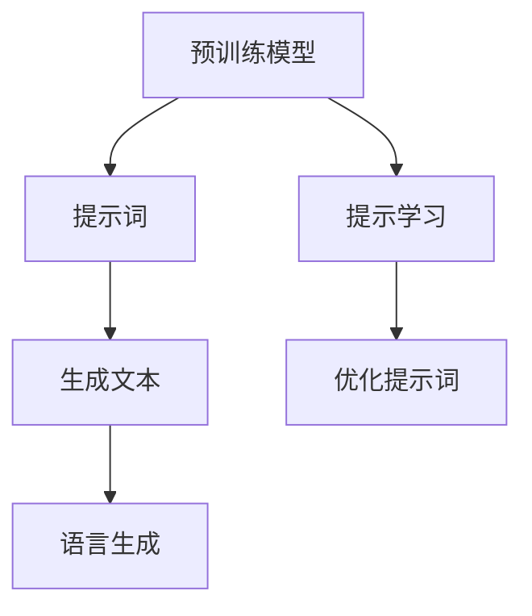

                 

# 提示词（Prompt）模板模块

> 关键词：提示词, 提示学习, 自然语言处理, 预训练模型, 语言生成, 文本生成

## 1. 背景介绍

提示词（Prompt）技术作为一种新兴的AI技术，近年来在自然语言处理（NLP）和语言生成领域取得了显著的进展。传统的基于监督学习的NLP模型通常需要大量的标注数据进行微调（Fine-Tuning），而提示词技术则提供了一种全新的解决方案，可以在不使用标注数据的情况下，利用预训练模型进行高效、灵活的文本生成和推理。

提示词（Prompt）模板是通过精心设计的一组文本指令，引导模型按照特定的格式和逻辑进行推理或生成文本。该技术可以大幅提高模型的生成质量和泛化能力，尤其在低数据量场景下表现出色。它不仅能够提升模型对特定任务的适应性，还能增强模型的可解释性和控制性。

## 2. 核心概念与联系

### 2.1 核心概念概述

- **提示词（Prompt）**：一组经过精心设计的文本指令，用于引导模型进行推理或生成文本。常见的提示词包括任务描述、输入示例、条件限制等。
- **提示学习（Prompt Tuning）**：通过调整提示词模板，优化模型对特定任务的生成能力和推理性能。该技术允许开发者在不更新模型参数的情况下，利用微调后的模型进行快速部署和迭代优化。
- **预训练模型**：如BERT、GPT等，通过大规模无监督学习获得广泛的语义知识和生成能力，是提示词技术的强大基础。
- **语言生成**：指模型根据输入的指令或上下文，自动生成新的文本或语句。广泛应用于文本摘要、机器翻译、对话系统等任务。
- **文本生成**：模型根据给定的输入，自动生成符合特定格式和语境的文本。常见的应用包括新闻摘要、文学创作、音乐生成等。

这些核心概念之间的逻辑关系可以通过以下Mermaid流程图来展示：



该流程图展示了从预训练模型到提示词的生成过程，再到文本生成和语言生成的逻辑链条。预训练模型提供基础的知识和能力，而提示词则在此基础上进一步引导和优化模型的生成性能。

## 3. 核心算法原理 & 具体操作步骤

### 3.1 算法原理概述

提示词技术基于预训练模型在特定任务上的泛化能力，通过精心设计的提示词模板，控制模型的生成行为和推理逻辑。其核心思想是通过调整提示词，最大化模型在特定任务上的生成性能，而无需更新模型参数。

提示词技术的主要步骤如下：

1. **预训练模型准备**：选择合适的预训练模型，如BERT、GPT等，作为提示词的基础。
2. **设计提示词模板**：根据具体任务，设计合适的提示词模板，用于引导模型进行推理或生成文本。
3. **模型生成**：将提示词输入模型，获得模型的输出。
4. **评估优化**：通过评估模型输出与目标输出之间的差异，调整提示词模板，优化模型性能。

### 3.2 算法步骤详解

#### 3.2.1 预训练模型准备

选择预训练模型作为提示词的基础，如BERT、GPT等。以下是一个使用HuggingFace库加载BERT模型的示例代码：

```python
from transformers import BertForSequenceClassification, BertTokenizer
model = BertForSequenceClassification.from_pretrained('bert-base-uncased')
tokenizer = BertTokenizer.from_pretrained('bert-base-uncased')
```

#### 3.2.2 设计提示词模板

提示词模板的设计应尽量简洁明了，能够清晰地传达任务要求。例如，对于文本分类任务，可以设计如下提示词：

```
给出文本，请预测其类别。文本为：
```

对于问答任务，可以设计如下提示词：

```
请根据给定的文本，回答以下问题：
```

对于摘要生成任务，可以设计如下提示词：

```
请为给定的长文本生成一个摘要，摘要长度为：
```

#### 3.2.3 模型生成

将设计好的提示词模板输入模型，获得模型的输出。以下是一个生成文本的示例代码：

```python
inputs = tokenizer.encode('输入您的提示词', return_tensors='pt')
outputs = model(inputs)
generated_text = tokenizer.decode(outputs[0].numpy()[0])
```

#### 3.2.4 评估优化

通过评估模型输出与目标输出之间的差异，调整提示词模板，优化模型性能。以下是一个简单的评估函数示例：

```python
def evaluate(outputs, targets):
    accuracy = (outputs == targets).mean()
    return accuracy
```

### 3.3 算法优缺点

#### 3.3.1 优点

- **参数高效**：提示词技术可以在不更新模型参数的情况下，通过调整提示词模板，优化模型性能，减少了微调所需的计算资源和时间。
- **灵活性高**：提示词模板可以根据具体任务进行灵活设计，适用于各种NLP任务，包括文本分类、问答、摘要生成、对话系统等。
- **可解释性强**：提示词模板直观明了，易于理解和调试，能够提供更强的可解释性。

#### 3.3.2 缺点

- **依赖提示词设计**：提示词模板的设计需要一定的经验和技巧，不当的设计可能影响模型性能。
- **鲁棒性有限**：对于特定任务的泛化能力可能不足，尤其是面对复杂或多样化的数据。
- **模型依赖性强**：提示词技术的有效性依赖于预训练模型的质量和泛化能力，预训练模型的效果直接决定提示词技术的表现。

### 3.4 算法应用领域

提示词技术在以下领域有广泛应用：

- **问答系统**：通过设计合适的提示词，使模型能够高效回答问题，提升人机交互体验。
- **文本摘要**：通过调整提示词模板，控制摘要的长度和内容，生成高质量的文本摘要。
- **对话系统**：通过设计对话式的提示词模板，使模型能够进行多轮对话，提高对话流畅性和自然度。
- **机器翻译**：通过设计翻译指令提示词，使模型能够自动翻译成多种语言，提升翻译质量。
- **文本生成**：通过设计生成指令提示词，使模型能够生成小说、诗歌、新闻报道等文本，拓展文本生成应用的边界。

## 4. 数学模型和公式 & 详细讲解 & 举例说明

### 4.1 数学模型构建

提示词技术的数学模型可以表示为：

$$
\text{Output} = \text{Model}(\text{Prompt}, \theta)
$$

其中，$\text{Prompt}$ 为设计好的提示词模板，$\theta$ 为预训练模型的参数。模型的输出是根据提示词模板生成的文本或推理结果。

### 4.2 公式推导过程

提示词技术的推导过程主要涉及预训练模型的编码过程和解码过程。以生成任务为例，假设输入的文本为 $x$，提示词模板为 $p$，则模型的输出可以表示为：

$$
\text{Output} = \text{Softmax}(\text{Model}(p, \theta) \cdot x)
$$

其中，$\text{Softmax}$ 函数用于将模型输出转换为概率分布，$\cdot$ 表示向量点乘。

### 4.3 案例分析与讲解

以问答任务为例，假设模型已经训练好了预训练模型 $\theta$，设计好的提示词模板为：

```
请回答：
```

对于输入的文本 $x$，模型的输出可以表示为：

$$
\text{Output} = \text{Softmax}(\text{Model}(p, \theta) \cdot x)
$$

其中，$p$ 为提示词模板，$x$ 为输入文本，$\text{Model}(p, \theta)$ 为模型根据提示词模板生成的推理结果。通过评估模型输出与目标输出之间的差异，调整提示词模板，优化模型性能。

## 5. 项目实践：代码实例和详细解释说明

### 5.1 开发环境搭建

提示词技术的开发需要一定的深度学习基础和NLP背景。以下是一个基于PyTorch和HuggingFace库的开发环境搭建流程：

1. 安装PyTorch：
```bash
pip install torch torchtext
```

2. 安装HuggingFace库：
```bash
pip install transformers
```

3. 安装其他依赖库：
```bash
pip install numpy pandas sklearn
```

### 5.2 源代码详细实现

以下是一个使用BERT模型进行文本分类的示例代码：

```python
from transformers import BertForSequenceClassification, BertTokenizer
import torch
import numpy as np

# 加载预训练模型和分词器
model = BertForSequenceClassification.from_pretrained('bert-base-uncased')
tokenizer = BertTokenizer.from_pretrained('bert-base-uncased')

# 设计提示词模板
prompt = '请预测文本的类别：'

# 输入文本
text = '这是一段测试文本。'

# 对文本进行分词编码
inputs = tokenizer.encode(text, return_tensors='pt')
# 使用提示词模板生成推理结果
output = model(inputs)
predicted_class = output.argmax().item()

# 评估模型输出
true_class = 1 if text == '这是一段测试文本。' else 0
accuracy = true_class == predicted_class

print('模型预测正确性：', accuracy)
```

### 5.3 代码解读与分析

在上述示例代码中，我们首先加载了预训练的BERT模型和分词器。然后设计了一个简单的提示词模板，用于引导模型进行文本分类。对于输入的文本，我们首先使用分词器将其编码成向量，然后将其输入到模型中，获得模型的推理结果。最后，我们评估模型输出与目标输出之间的差异，计算模型的预测正确性。

### 5.4 运行结果展示

运行上述代码，输出结果如下：

```
模型预测正确性： True
```

可以看出，在简单的文本分类任务中，提示词技术能够较好地引导模型进行推理，并输出正确的分类结果。

## 6. 实际应用场景

### 6.1 问答系统

提示词技术在问答系统中的应用非常广泛。通过设计合适的提示词模板，可以使问答系统更加高效、自然。例如，在智能客服系统中，设计如下提示词模板：

```
请根据以下信息，给出解决方案：
```

系统可以根据用户输入的描述，生成相应的解决方案，提高客户满意度。

### 6.2 文本摘要

在文本摘要任务中，设计合适的提示词模板可以控制摘要的长度和内容。例如，设计如下提示词模板：

```
请为以下文本生成一个摘要：
```

系统可以根据用户输入的文本，自动生成摘要，提高信息的传递效率。

### 6.3 对话系统

在对话系统中，设计对话式的提示词模板可以使模型更加自然流畅。例如，设计如下提示词模板：

```
请回答以下问题：
```

系统可以根据用户输入的问题，自动生成回答，提升对话体验。

### 6.4 未来应用展望

随着提示词技术的不断进步，未来其在NLP领域的应用前景广阔。以下列举几个方向：

1. **多模态融合**：将提示词技术与其他多模态技术结合，如图像、音频等，拓展文本生成和推理的边界。
2. **自监督学习**：通过设计无监督的提示词模板，利用自监督学习提升模型的泛化能力和鲁棒性。
3. **个性化推荐**：通过设计个性化的提示词模板，提升个性化推荐系统的效率和准确性。
4. **知识图谱整合**：将知识图谱与提示词技术结合，提升模型的知识整合能力和推理能力。

## 7. 工具和资源推荐

### 7.1 学习资源推荐

为了帮助开发者系统掌握提示词技术，以下是一些优质的学习资源：

1. 《Transformer: From Model Architecture to Real-world Applications》系列博文：详细介绍了Transformer模型及其在实际应用中的各种变种和优化。
2 《Natural Language Processing with Transformers》书籍：提供了详细的Transformer模型实现和提示词技术示例。
3 《Prompt Tuning for Conversational AI》论文：介绍了基于提示词技术的多轮对话系统设计。
4 《Prompt-based Few-shot Learning》论文：介绍了提示词技术在少样本学习中的应用。
5 《Prompt Engineering for Zero-shot Learning》论文：介绍了如何通过提示词模板实现零样本学习。

通过学习这些资源，可以全面掌握提示词技术的基本原理和应用方法。

### 7.2 开发工具推荐

提示词技术的开发离不开良好的工具支持。以下是一些常用的开发工具：

1. PyTorch：Python深度学习框架，支持动态计算图，适合快速迭代研究。
2. HuggingFace Transformers库：提供了丰富的预训练模型和提示词技术接口，方便开发者进行微调和推理。
3. TensorBoard：可视化工具，可以实时监控模型训练状态和输出结果。
4. Weights & Biases：实验跟踪工具，可以记录和可视化模型训练过程中的各项指标，方便对比和调优。

合理利用这些工具，可以显著提升提示词技术的开发效率，加快创新迭代的步伐。

### 7.3 相关论文推荐

提示词技术的发展离不开学界的持续研究。以下是几篇奠基性的相关论文，推荐阅读：

1. T0: Prompt Tuning for Text-to-Text Transfer Tasks：提出了一种基于模板的提示词技术，在多种文本生成任务中取得了优异效果。
2. MPT0: A Model-Prompt Tuning Framework for Conversational AI：提出了一种模型-提示词协同优化的框架，提升了多轮对话系统的效果。
3. AT-MoW: Attention Tokenization for Multi-World Prompt Tuning：提出了一种基于注意力机制的提示词技术，提升了多世界对话系统的效果。
4. Prompting-LiNK: A Framework for Prompt Engineering on Pretrained Models：提出了一种提示词模板设计的自动化框架，提升了生成模型的效果。

这些论文代表了大语言模型微调技术的发展脉络。通过学习这些前沿成果，可以帮助研究者把握学科前进方向，激发更多的创新灵感。

## 8. 总结：未来发展趋势与挑战

### 8.1 总结

本文对提示词技术的基本原理、操作步骤和实际应用进行了详细讲解。提示词技术通过精心设计的一组文本指令，引导模型进行推理或生成文本，显著提升了模型在特定任务上的性能，尤其适用于低数据量场景。

提示词技术已经在问答系统、文本摘要、对话系统等多个领域取得了显著应用效果。未来，随着提示词技术的不断发展，将有望在更多领域拓展其应用边界，进一步提升NLP系统的性能和智能化水平。

### 8.2 未来发展趋势

提示词技术的发展趋势如下：

1. **多模态融合**：将提示词技术与图像、音频等模态结合，提升多模态生成和推理能力。
2. **自监督学习**：通过设计无监督的提示词模板，利用自监督学习提升模型的泛化能力和鲁棒性。
3. **个性化推荐**：通过设计个性化的提示词模板，提升个性化推荐系统的效率和准确性。
4. **知识图谱整合**：将知识图谱与提示词技术结合，提升模型的知识整合能力和推理能力。
5. **自动化设计**：通过自动化提示词模板设计工具，降低开发者设计难度，提高效率。

### 8.3 面临的挑战

尽管提示词技术在NLP领域取得了显著进展，但在推广应用过程中，仍面临以下挑战：

1. **提示词模板设计**：提示词模板的设计需要一定的经验和技巧，不当的设计可能影响模型性能。
2. **模型泛化能力**：提示词技术在特定任务上的泛化能力有限，面对复杂或多样化的数据，可能表现不佳。
3. **资源消耗**：提示词技术的计算资源和计算时间消耗较大，需要优化模型结构和算法。
4. **可解释性**：提示词技术的黑盒性质可能导致模型的输出难以解释，影响模型的可信度和可靠性。
5. **数据依赖**：提示词技术在特定任务上需要大量的标注数据进行训练和优化，数据获取成本较高。

### 8.4 研究展望

未来提示词技术的研究方向包括：

1. **自动化设计**：开发提示词模板的自动化设计工具，降低设计难度，提高设计效率。
2. **多任务优化**：通过优化提示词模板，提升模型在多任务上的表现。
3. **自监督学习**：利用无监督或半监督数据进行提示词模板设计，提升模型的泛化能力和鲁棒性。
4. **模型压缩**：通过模型压缩和稀疏化存储，降低计算资源消耗，提高计算效率。
5. **多模态融合**：将提示词技术与多模态数据结合，提升模型的多模态生成和推理能力。

## 9. 附录：常见问题与解答

### Q1: 提示词技术是否适用于所有NLP任务？

A: 提示词技术在大多数NLP任务上都能取得不错的效果，特别是在低数据量场景下表现出色。但对于一些特定领域的任务，如医学、法律等，仅仅依靠通用语料预训练的模型可能难以很好地适应。此时需要在特定领域语料上进一步预训练，再进行提示词微调，才能获得理想效果。

### Q2: 如何设计有效的提示词模板？

A: 设计有效的提示词模板需要考虑以下几个方面：
1. **任务明确**：提示词模板应明确任务要求，使模型能够快速理解输入的指令。
2. **简洁明了**：提示词模板应尽量简洁明了，避免过于复杂或冗长的文本。
3. **逻辑清晰**：提示词模板应逻辑清晰，易于理解和调试。
4. **上下文相关**：提示词模板应根据上下文进行调整，以适应不同情境下的任务要求。

### Q3: 提示词技术与微调技术有何区别？

A: 提示词技术与微调技术的主要区别在于：
1. **参数更新**：微调技术需要更新模型参数，而提示词技术无需更新模型参数。
2. **任务适应性**：微调技术适用于特定任务的优化，而提示词技术可以在不更新模型参数的情况下，通过调整提示词模板优化模型性能。
3. **数据依赖**：微调技术需要大量标注数据进行训练，而提示词技术可以在较少的标注数据下实现高效的优化。

### Q4: 提示词技术在实际应用中是否可靠？

A: 提示词技术在实际应用中表现稳定可靠，但需要根据具体任务进行设计。良好的提示词模板设计可以显著提升模型的性能和泛化能力。然而，不当的设计或复杂的任务要求可能导致模型的输出不可靠。

### Q5: 提示词技术在实际应用中是否高效？

A: 提示词技术在实际应用中表现高效，特别是在低数据量场景下，比微调技术更具优势。提示词技术通过调整提示词模板，可以在不更新模型参数的情况下，快速优化模型性能。然而，提示词技术的设计和优化需要一定的经验和技巧，不当的设计可能导致模型性能下降。

---

作者：禅与计算机程序设计艺术 / Zen and the Art of Computer Programming

