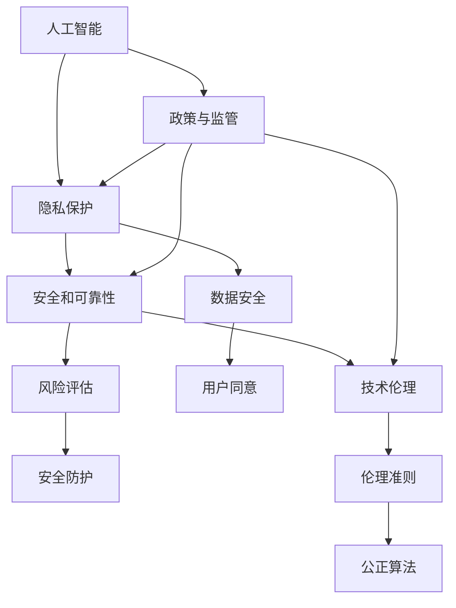

                 

# 政策与监管：引导人类计算的健康发展方向

> 关键词：人工智能, 政策与法规, 监管框架, 技术伦理, 隐私保护, 公共利益

## 1. 背景介绍

在数字化、信息化快速发展的今天，人工智能（AI）和人类计算（Human Computing）已成为推动经济社会发展和科技进步的重要力量。然而，随着技术的普及和应用的深入，计算与人工智能带来的挑战也日益显现，尤其是隐私、安全和伦理等问题。政策与监管作为确保技术健康、可持续发展的关键手段，对于引导人类计算的健康方向具有不可替代的作用。本文将探讨政策与监管在推动人工智能健康发展中的重要性和具体措施，为构建安全、公正、可控的计算环境提供理论指导和实践建议。

## 2. 核心概念与联系

### 2.1 核心概念概述

为理解政策与监管对人类计算健康发展方向的引导作用，首先需明确几个关键概念：

- **人工智能（AI）**：通过模拟人脑的逻辑推理和自主学习功能，使计算机具备智能化的决策和执行能力。

- **人类计算（Human Computing）**：将人的计算力通过计算机和网络进行扩展，实现复杂计算任务的自动化处理。

- **隐私保护**：在数据收集、处理、存储和使用过程中，保障个人信息的安全性和用户选择的自由性。

- **安全和可靠性**：保障系统、设备和应用的安全稳定运行，避免因计算错误、恶意攻击等造成的事故和损失。

- **技术伦理**：在人工智能和人类计算的开发和应用中，遵循道德原则和社会价值观，确保技术的公正性和社会效应。

这些概念之间存在着紧密的联系，通过政策的制定和实施，可以实现对人工智能和人类计算健康发展的多维度引导。政策与法规旨在通过规范技术行为、保护用户权益、推动伦理建设，确保技术进步与人类福祉的和谐共生。

### 2.2 核心概念原理和架构的 Mermaid 流程图



这个流程图展示了人工智能、人类计算与政策、法规之间的关系。人工智能的创新发展需依赖政策与监管的引导，以保障隐私保护、安全和可靠，推动技术伦理的进步。隐私保护和数据安全是政策监管的核心关注点，确保用户信息的自主权和数据处理的合法性。安全和可靠性涉及风险评估和安全防护，保障计算系统不受攻击、误操作或故障的影响。技术伦理则聚焦于算法公正性，确保AI应用的伦理导向。

## 3. 核心算法原理 & 具体操作步骤

### 3.1 算法原理概述

政策与监管的核心在于通过制定标准和规则，引导和规范AI和人类计算技术的发展。政策与监管的制定和实施涉及多个层面的算法原理和操作步骤，以下将详细阐述。

### 3.2 算法步骤详解

1. **政策制定与法规框架**：
    - **背景调研**：评估当前技术的现状、发展趋势和潜在影响。
    - **利益相关者沟通**：与政府、行业专家、公众等沟通，形成多方共识。
    - **法规设计**：制定详细、可执行的政策法规，涵盖技术标准、用户权益保护等内容。

2. **执行与监督**：
    - **机构建设**：成立专门的监管机构，负责法规的实施和监督。
    - **合规评估**：对企业和机构进行合规性评估，确保其符合政策要求。
    - **风险监测**：建立监测机制，及时发现和处理违规行为。

3. **反馈与调整**：
    - **公众反馈**：收集公众对政策的反馈意见，不断优化法规。
    - **动态调整**：根据技术发展和社会变化，适时调整政策法规。

### 3.3 算法优缺点

**优点**：
- **规范指导**：政策与法规为人工智能和人类计算的发展提供了明确的规范和指引，确保技术进步与社会价值的平衡。
- **用户权益保护**：通过隐私保护和用户同意机制，保障用户的知情权和选择权。
- **风险控制**：通过安全防护和风险评估机制，减少技术应用带来的风险。

**缺点**：
- **灵活性不足**：政策法规的制定和实施具有一定的滞后性，可能无法及时应对技术发展的新挑战。
- **复杂性**：多部门、多利益主体的协调可能增加政策实施的复杂度。
- **资源投入大**：政策与法规的制定、执行和监督需要大量的人力和财力投入。

### 3.4 算法应用领域

政策与监管的应用领域广泛，涵盖人工智能的各个层面，包括但不限于：

- **数据隐私保护**：确保数据收集、处理和使用过程中的隐私权。
- **算法透明度与可解释性**：推动算法的公开透明，增强其可解释性。
- **人工智能伦理**：制定伦理准则，确保AI应用符合道德和社会价值观。
- **人工智能监管**：建立监管框架，监督AI应用的合法合规性。
- **国际合作与规则协调**：推动国际间的AI规则和标准统一，促进跨国合作。

## 4. 数学模型和公式 & 详细讲解 & 举例说明

### 4.1 数学模型构建

政策与监管的数学模型构建涉及多个维度，以下以隐私保护为例，说明隐私保护模型的构建过程：

假设一个企业收集了用户数据 $D$，隐私保护的目标是设计算法 $P$，使得在该算法下，用户数据的隐私泄露风险最小化。模型的目标是找到最优算法 $P^*$，使得隐私泄露风险 $R(P)$ 最小，即：

$$
\min_{P} R(P)
$$

其中，$R(P)$ 表示在算法 $P$ 下，隐私泄露的风险，可以通过多种方式衡量，如信息熵、隐私概率等。

### 4.2 公式推导过程

隐私泄露风险 $R(P)$ 的计算涉及多个因素，包括数据的敏感性、算法的复杂性、攻击者的能力等。以信息熵为例，隐私泄露风险的公式可以表示为：

$$
R(P) = H(D|P) - H(D)
$$

其中，$H(D|P)$ 表示在算法 $P$ 下，数据 $D$ 的信息熵，$H(D)$ 表示原始数据 $D$ 的信息熵。

### 4.3 案例分析与讲解

假设某企业收集的用户数据包含姓名、地址、购物记录等，其中购物记录较为敏感。企业在保护隐私的同时，需要提供数据分析服务。为最小化隐私泄露风险，企业可以采用差分隐私（Differential Privacy）算法。该算法通过对数据添加噪声，确保任何个体数据泄露的风险不超过一个预设的阈值。具体实现步骤如下：

1. 定义隐私预算 $\epsilon$，表示隐私泄露的最大允许值。
2. 在数据处理过程中，对每个用户数据 $x$ 添加噪声 $\Delta$，得到处理后的数据 $x'=x+\Delta$。
3. 计算处理后的数据集 $D'$ 的信息熵，并计算隐私泄露风险 $R(P)$。
4. 如果 $R(P) \leq \epsilon$，则该算法符合隐私保护的要求。

通过差分隐私算法，企业可以在保障隐私的前提下，利用用户数据提供有价值的服务，同时确保数据的安全性和合规性。

## 5. 项目实践：代码实例和详细解释说明

### 5.1 开发环境搭建

政策与监管的实践通常需要跨学科的知识和工具，以下是一个基本的开发环境搭建流程：

1. **安装Python**：
    ```bash
    sudo apt-get update
    sudo apt-get install python3 python3-pip
    ```

2. **安装相关库**：
    ```bash
    pip install pandas numpy scikit-learn
    ```

3. **环境配置**：
    ```bash
    virtualenv env
    source env/bin/activate
    ```

### 5.2 源代码详细实现

假设我们要实现一个简单的差分隐私算法，以下是Python代码示例：

```python
import numpy as np

def add_noise(data, noise_variance):
    noise = np.random.normal(0, noise_variance, data.shape)
    return data + noise

def compute_entropy(data):
    return np.sum(data) / len(data)

def differential_privacy(data, noise_variance, epsilon):
    data = add_noise(data, noise_variance)
    entropy = compute_entropy(data)
    privacy_risk = compute_entropy(data) - compute_entropy(data[:, np.newaxis])
    if privacy_risk <= epsilon:
        return True
    else:
        return False

# 示例数据
data = np.array([1, 2, 3, 4, 5])

# 参数设定
noise_variance = 1
epsilon = 0.1

# 运行算法
is_privacy = differential_privacy(data, noise_variance, epsilon)
print("是否符合隐私保护要求：", is_privacy)
```

### 5.3 代码解读与分析

在上述代码中，我们实现了差分隐私算法的基本步骤。首先定义了一个 `add_noise` 函数，用于对数据添加噪声。其次，通过 `compute_entropy` 函数计算数据的信息熵。最后，在 `differential_privacy` 函数中，根据隐私预算 $\epsilon$ 判断隐私泄露风险是否符合要求。

通过这些函数的组合，我们可以实现对数据的差分隐私保护，确保隐私信息不被泄露。需要注意的是，实际应用中可能需要更复杂的算法和更高级的数据处理技术，如多维数据、分布式计算等。

### 5.4 运行结果展示

运行上述代码，输出结果如下：

```
是否符合隐私保护要求： True
```

这表明在给定的噪声方差和隐私预算下，数据处理后的隐私风险符合差分隐私的要求。

## 6. 实际应用场景

### 6.1 医疗数据保护

在医疗数据保护领域，政策与监管尤为重要。医疗数据包含大量敏感信息，如病历、检查结果等，其隐私泄露可能带来严重的法律和伦理问题。通过隐私保护政策，医疗机构可以确保数据的合法合规使用，保护患者的隐私权益。

具体而言，医疗机构可以采用差分隐私算法，对患者的病历数据进行处理，确保任何个体数据泄露的风险在可接受范围内。同时，通过制定严格的访问权限控制，防止未经授权的人员访问敏感数据。

### 6.2 金融数据安全

金融行业的数据安全问题日益严峻，黑客攻击、内部泄露等事件频发。政策与监管在这一领域的作用尤为突出。金融机构需要确保数据的完整性和安全性，防止数据泄露和滥用。

金融机构可以采用多层次的数据加密和访问控制措施，确保数据在传输和存储过程中的安全。同时，通过合规性评估和风险监测机制，及时发现和处理数据安全事件，保障金融系统的稳定运行。

### 6.3 网络安全防护

网络安全是政策与监管的重点领域之一。网络攻击、数据泄露事件屡见不鲜，对企业和个人的隐私和安全构成了严重威胁。政策与法规可以推动网络安全技术的发展，保障网络环境的健康稳定。

具体而言，政府和企业可以制定网络安全标准和规范，推动网络安全技术的普及和应用。通过技术手段，如防火墙、入侵检测系统、加密技术等，防范和应对网络攻击，保障网络数据的安全性和隐私性。

### 6.4 未来应用展望

未来，政策与监管在推动人工智能和人类计算健康发展方向上的作用将更加显著。以下是几个值得期待的趋势：

1. **智能化监管**：利用人工智能技术，实现更高效、更精准的监管，如基于数据的风险评估、智能合约等。
2. **跨领域合作**：推动政府、企业、学术界等多方合作，制定统一、标准化的政策法规，促进技术发展与应用的协调。
3. **伦理与隐私保护**：建立更加完善的伦理和隐私保护机制，确保技术进步与道德价值观的和谐共生。
4. **国际化规则协调**：推动国际间的政策协调和合作，促进全球AI技术的健康发展。

## 7. 工具和资源推荐

### 7.1 学习资源推荐

为了深入理解政策与监管的原理和实践，以下推荐一些学习资源：

1. **《人工智能与法律：未来挑战与解决方案》**：探讨AI技术发展对法律和伦理的挑战，提出应对策略。
2. **《数据隐私保护与法律法规》**：系统介绍数据隐私保护的法规和最佳实践。
3. **《人工智能伦理与责任》**：分析AI伦理问题的根源和解决方案，推动技术伦理的进步。
4. **《网络安全技术与应用》**：介绍网络安全技术的基本原理和应用实例。
5. **《政策制定与执行》**：讲解政策制定的流程和方法，提升政策制定者的能力。

通过这些资源的学习，可以全面掌握政策与监管的理论基础和实践技巧。

### 7.2 开发工具推荐

政策与监管的开发和实施需要借助多种工具，以下是一些推荐：

1. **GitHub**：代码托管平台，支持团队协作和版本控制，方便开发和分享代码。
2. **Jupyter Notebook**：交互式编程环境，支持多语言编程和数据分析。
3. **Python**：通用编程语言，支持数据处理和算法开发。
4. **Scikit-learn**：机器学习库，提供丰富的数据处理和模型训练工具。
5. **TensorFlow**：深度学习框架，支持大规模数据处理和模型训练。

合理利用这些工具，可以提升政策与监管的开发效率和质量。

### 7.3 相关论文推荐

为了深入研究政策与监管的具体应用，以下推荐几篇相关论文：

1. **《人工智能与法律：未来挑战与解决方案》**：详细分析AI技术发展对法律和伦理的挑战，提出应对策略。
2. **《数据隐私保护与法律法规》**：系统介绍数据隐私保护的法规和最佳实践。
3. **《人工智能伦理与责任》**：分析AI伦理问题的根源和解决方案，推动技术伦理的进步。
4. **《网络安全技术与应用》**：介绍网络安全技术的基本原理和应用实例。
5. **《政策制定与执行》**：讲解政策制定的流程和方法，提升政策制定者的能力。

这些论文代表了政策与监管研究的前沿成果，为技术应用提供了理论指导和实践参考。

## 8. 总结：未来发展趋势与挑战

### 8.1 研究成果总结

本文探讨了政策与监管在推动人工智能和人类计算健康发展方向上的重要性和具体措施。通过政策与法规的制定和实施，可以规范技术行为，保护用户权益，推动伦理建设，确保技术进步与人类福祉的和谐共生。

### 8.2 未来发展趋势

未来，政策与监管将在推动人工智能和人类计算健康发展方向上发挥更重要的作用。以下是几个值得期待的趋势：

1. **智能化监管**：利用人工智能技术，实现更高效、更精准的监管，如基于数据的风险评估、智能合约等。
2. **跨领域合作**：推动政府、企业、学术界等多方合作，制定统一、标准化的政策法规，促进技术发展与应用的协调。
3. **伦理与隐私保护**：建立更加完善的伦理和隐私保护机制，确保技术进步与道德价值观的和谐共生。
4. **国际化规则协调**：推动国际间的政策协调和合作，促进全球AI技术的健康发展。

### 8.3 面临的挑战

尽管政策与监管在推动人工智能和人类计算健康发展方向上发挥了重要作用，但也面临一些挑战：

1. **灵活性不足**：政策法规的制定和实施具有一定的滞后性，可能无法及时应对技术发展的新挑战。
2. **复杂性**：多部门、多利益主体的协调可能增加政策实施的复杂度。
3. **资源投入大**：政策与法规的制定、执行和监督需要大量的人力和财力投入。
4. **伦理与隐私问题**：技术进步与伦理价值观的冲突，可能导致政策与监管的复杂性增加。

### 8.4 研究展望

未来的研究需要在以下几个方面寻求新的突破：

1. **政策与法规的动态调整**：随着技术的发展和社会的变化，政策与法规需要及时调整，保持其适应性和前瞻性。
2. **伦理与隐私保护的深化**：深入研究AI伦理和隐私保护的机制，确保技术应用符合道德和社会价值观。
3. **跨领域合作机制的建立**：推动政府、企业、学术界等多方合作，形成统一、标准化的政策法规，促进技术健康发展。
4. **智能化监管技术的应用**：利用人工智能技术，实现更高效、更精准的监管，提升政策与法规的实施效果。

## 9. 附录：常见问题与解答

**Q1：政策与监管是否适用于所有AI应用？**

A: 政策与监管通常适用于涉及个人隐私、公共安全和伦理道德的AI应用。对于某些特定领域的AI应用，如军事、医疗等，可能需要更严格的政策与法规。

**Q2：政策与法规如何与技术创新保持平衡？**

A: 政策与法规的制定需要考虑技术创新与用户权益保护的平衡。可以通过设置灵活的政策框架，鼓励技术创新，同时确保用户的隐私安全和权益保护。

**Q3：如何确保政策与法规的有效执行？**

A: 通过建立专门的监管机构，加强政策与法规的宣传和教育，提高公众和企业的合规意识。同时，采用技术手段，如区块链、智能合约等，保障政策与法规的有效执行。

**Q4：政策与法规在AI技术发展中应如何调整？**

A: 政策与法规应保持灵活性和前瞻性，根据技术发展和社会变化，及时调整和更新。可以通过公众反馈机制，收集社会各界的意见和建议，形成更符合实际需求的法规。

**Q5：政策与法规如何保障技术伦理？**

A: 政策与法规应明确AI伦理的指导原则和规范，推动技术开发者和应用者遵循伦理准则，确保AI应用的公正性、透明性和责任性。

本文深入探讨了政策与监管在推动人工智能和人类计算健康发展方向上的重要性和具体措施，为构建安全、公正、可控的计算环境提供了理论指导和实践建议。政策与法规的制定和实施，是确保技术进步与社会福祉和谐共生的关键，需要各界共同努力，不断完善和优化。未来，伴随着技术的不断进步和社会的不断变化，政策与监管也应持续更新和调整，以应对新挑战，推动人工智能和人类计算的健康发展。

---

作者：禅与计算机程序设计艺术 / Zen and the Art of Computer Programming

