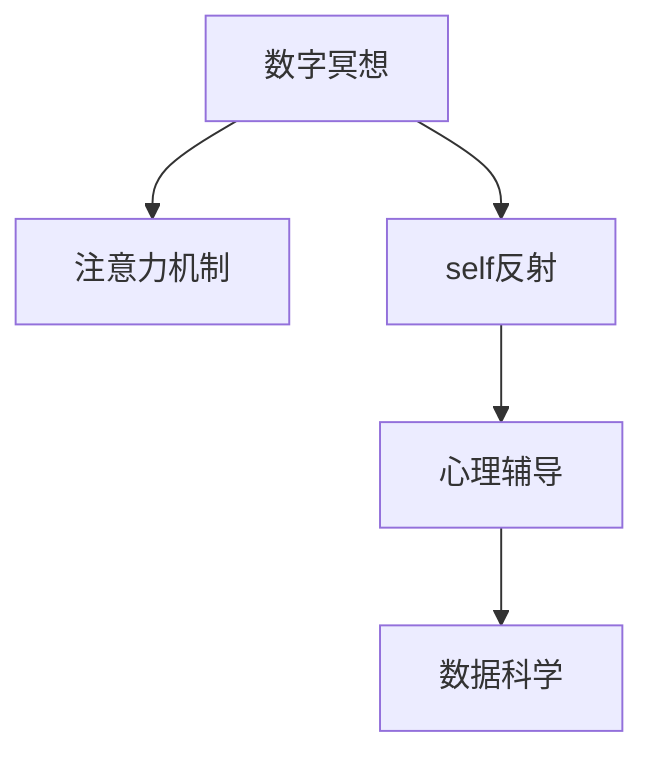

                 

# 数字化冥想：AI辅助的精神探索

> 关键词：数字冥想, AI辅助, 精神探索, 神经网络, 注意力机制, 自我反思, 心理辅导, 数据科学

## 1. 背景介绍

### 1.1 问题由来

在快节奏的现代社会中，人们的精神压力越来越大。如何在繁忙的工作和生活之余，保持内心的平静与安宁，成为越来越多人的共同追求。传统的冥想、瑜伽等精神修炼方法，虽然对心理健康有诸多好处，但需要投入大量时间和精力，难以大规模普及。

近年来，随着人工智能技术的发展，数字化冥想开始成为一种新的可能。通过结合AI技术，数字化冥想不仅能够随时随地进行，还能根据个体需求动态调整内容和形式，提供个性化精神体验。AI辅助的数字化冥想，有望成为现代精神探索的重要工具，为人们带来便捷和高效的精神放松与成长。

### 1.2 问题核心关键点

数字化冥想的核心在于将传统的冥想方法数字化、智能化，借助AI技术提升冥想的效果与体验。具体来说，包括以下几个关键点：

- **智能内容推荐**：根据用户心理状态和冥想目的，推荐个性化的冥想内容，包括音乐、冥想指导语、呼吸练习等。
- **动态调整优化**：通过实时监测用户生理和心理指标，动态调整冥想时长、深度等参数，提供最适合用户的冥想体验。
- **沉浸式体验**：利用虚拟现实、增强现实等技术，创造沉浸式的冥想环境，增强用户沉浸感和体验感。
- **多维度反馈**：结合生理数据、心理问卷、行为分析等多维度反馈，全面评估冥想效果，帮助用户持续改进。

这些关键点共同构成了数字化冥想的核心应用场景，使得AI技术能够在精神探索中发挥独特优势。

## 2. 核心概念与联系

### 2.1 核心概念概述

为了更好地理解数字化冥想的核心原理和技术框架，本节将介绍几个关键概念：

- **数字冥想(Digital Meditation)**：基于数字技术，结合AI算法和传感器，为用户提供智能化的冥想体验。

- **注意力机制(Attention Mechanism)**：通过深度学习中的注意力机制，使得数字化冥想能够关注用户注意力集中度，动态调整冥想内容和难度。

- **自反射(self-reflection)**：数字化冥想强调用户自我观察与自我反思，帮助用户更深入地了解内心世界。

- **心理辅导(Psychological Counseling)**：通过数据分析和AI算法，提供个性化的心理辅导服务，帮助用户提升心理健康水平。

- **数据科学(Data Science)**：利用机器学习、深度学习等数据科学方法，分析和优化数字化冥想体验。

这些概念之间的逻辑关系可以通过以下Mermaid流程图来展示：



这个流程图展示了数字化冥想系统的核心组件及其相互关系：

1. 数字冥想作为核心组件，通过注意力机制和自反射技术，提升冥想效果。
2. 心理辅导结合数据科学，提供个性化的心理支持。
3. 数据科学通过分析用户数据，不断优化冥想内容和服务。

## 3. 核心算法原理 & 具体操作步骤
### 3.1 算法原理概述

数字化冥想的核心算法基于深度学习中的注意力机制和自反思技术。通过训练神经网络模型，使模型能够根据用户的状态和需求，动态生成并调整冥想内容，提供个性化的冥想体验。

形式化地，假设用户状态为 $x$，冥想内容为 $y$。理想情况下，目标是最小化模型在给定 $x$ 下的输出 $y$ 与用户期望 $y^*$ 之间的差距：

$$
\hat{y} = \mathop{\arg\min}_{y} \mathcal{L}(y|x)
$$

其中 $\mathcal{L}$ 为损失函数，用于衡量预测输出与真实期望之间的差异。常见损失函数包括交叉熵、均方误差等。

### 3.2 算法步骤详解

数字化冥想的核心算法步骤如下：

**Step 1: 数据收集与预处理**
- 收集用户心理状态数据，包括心率、脑电波、情绪等。
- 收集冥想内容数据，包括音乐、指导语、呼吸练习等。
- 对数据进行预处理，如归一化、去噪、特征提取等。

**Step 2: 模型训练与优化**
- 选择合适的深度学习模型，如Transformer、GRU等。
- 定义损失函数，如交叉熵、均方误差等。
- 使用标注数据训练模型，并通过梯度下降等优化算法最小化损失函数。

**Step 3: 内容生成与调整**
- 在用户冥想过程中，实时监测生理和心理指标。
- 根据监测数据，动态调整冥想时长、深度、音乐等参数。
- 根据用户反馈，不断优化模型参数和内容推荐策略。

**Step 4: 用户体验与反馈**
- 提供沉浸式的虚拟现实、增强现实等体验，增强用户沉浸感。
- 结合生理和心理问卷，评估冥想效果，提供反馈和建议。
- 通过多渠道反馈机制，不断改进数字化冥想系统。

### 3.3 算法优缺点

数字化冥想基于深度学习和大数据分析技术，具有以下优点：

- **个性化体验**：根据用户状态和需求，动态生成个性化冥想内容，提升用户体验。
- **实时调整优化**：实时监测用户状态，动态调整冥想参数，提供最合适的体验。
- **沉浸式体验**：结合虚拟现实、增强现实等技术，创造沉浸式冥想环境。
- **多维度反馈**：结合生理和心理数据，全面评估冥想效果，提供个性化的心理辅导。

同时，该方法也存在一定的局限性：

- **数据隐私问题**：用户生理和心理数据敏感，需要严格保护。
- **技术门槛较高**：深度学习和大数据分析技术门槛较高，需要专业知识和技能。
- **算法复杂性**：深度学习模型复杂，训练和优化需要大量计算资源。
- **依赖标注数据**：需要大量标注数据训练模型，标注数据获取成本高。

尽管存在这些局限性，但数字化冥想仍是大数据、AI技术结合精神探索的重要方向，具有广泛的应用前景。

### 3.4 算法应用领域

数字化冥想技术可以广泛应用于多个领域，如：

- **心理健康**：帮助用户缓解压力、焦虑，提升心理健康水平。
- **教育培训**：通过冥想提升专注力和学习效率，帮助学生改善学习状态。
- **企业健康**：结合企业内部心理辅导，提升员工心理素质和工作效率。
- **个人成长**：帮助用户进行自我反思与自我提升，提升个人全面素质。

除了以上应用，数字化冥想还可以与其他技术进行融合，如智能家居、在线心理咨询等，为人们提供更加便捷和全面的精神支持。

## 4. 数学模型和公式 & 详细讲解 & 举例说明
### 4.1 数学模型构建

本节将使用数学语言对数字化冥想的核心算法进行更加严格的刻画。

假设用户状态向量为 $x \in \mathbb{R}^n$，冥想内容向量为 $y \in \mathbb{R}^m$。目标是通过深度学习模型，使得模型能够根据用户状态 $x$，预测最优冥想内容 $y$。形式化地，可以定义如下优化目标：

$$
\hat{y} = \mathop{\arg\min}_{y} \mathcal{L}(y|x)
$$

其中 $\mathcal{L}$ 为损失函数，用于衡量预测输出与真实期望之间的差异。假设 $\mathcal{L}$ 为交叉熵损失，则有：

$$
\mathcal{L}(y|x) = -\sum_{i=1}^m y_i \log \hat{y_i}
$$

其中 $y_i$ 为冥想内容的第 $i$ 个维度，$\hat{y_i}$ 为模型预测的该维度概率。

### 4.2 公式推导过程

以下我们以注意力机制为例，推导其基本原理和计算公式。

注意力机制的核心思想是，在输入序列中，不同位置的信息对当前位置的贡献程度不同。在数字化冥想中，这可以理解为，不同冥想内容对用户当前心理状态的影响程度不同。因此，通过引入注意力机制，可以使模型更加关注对用户有实际帮助的冥想内容。

假设用户状态向量为 $x \in \mathbb{R}^n$，冥想内容向量为 $y \in \mathbb{R}^m$。注意力机制通过计算注意力权重 $\alpha$，来动态调整每个冥想内容对用户状态的影响程度。其计算公式为：

$$
\alpha_i = \frac{e^{a_i \cdot x}}{\sum_{j=1}^m e^{a_j \cdot x}}
$$

其中 $a_i$ 为注意力向量的第 $i$ 个维度，$x$ 为用户状态向量。注意力向量 $a$ 的计算公式为：

$$
a_i = u_i \cdot x + v_i \cdot y + b
$$

其中 $u_i, v_i$ 为注意力向量 $a$ 的线性权重，$b$ 为偏置项。通过调整 $u_i, v_i$ 和 $b$，可以控制注意力机制的强度和方向。

### 4.3 案例分析与讲解

假设我们正在开发一款数字化冥想应用，用户状态向量 $x$ 包括心率、情绪和注意力集中度，冥想内容向量 $y$ 包括不同类型的冥想指导语、呼吸练习和音乐。我们希望用户在进行冥想时，能够根据自身状态，动态选择最适合自己的冥想内容。

在具体实现中，我们首先使用深度学习模型，如Transformer或GRU，对用户状态 $x$ 和冥想内容 $y$ 进行训练，使其能够根据 $x$ 预测 $y$。在用户进行冥想时，应用实时监测生理和心理指标，动态计算注意力权重 $\alpha$。根据 $\alpha$ 调整每个冥想内容对用户状态的影响程度，最终生成个性化的冥想内容。

例如，当用户情绪低沉、注意力不集中时，模型会根据这些指标，增强放松类冥想内容（如呼吸练习）的影响权重，弱化激活类冥想内容（如瑜伽指导语）的影响权重。通过这种方式，数字化冥想能够根据用户状态，动态调整冥想内容，提供更加个性化的体验。

## 5. 项目实践：代码实例和详细解释说明
### 5.1 开发环境搭建

在进行数字化冥想开发前，我们需要准备好开发环境。以下是使用Python进行深度学习开发的环境配置流程：

1. 安装Anaconda：从官网下载并安装Anaconda，用于创建独立的Python环境。

2. 创建并激活虚拟环境：
```bash
conda create -n meditation-env python=3.8 
conda activate meditation-env
```

3. 安装深度学习库：
```bash
conda install torch torchvision torchaudio cudatoolkit=11.1 -c pytorch -c conda-forge
```

4. 安装TensorBoard：
```bash
pip install tensorboard
```

5. 安装可视化工具：
```bash
pip install matplotlib
```

完成上述步骤后，即可在`meditation-env`环境中开始开发。

### 5.2 源代码详细实现

下面我们以冥想内容推荐为例，给出使用PyTorch实现注意力机制的代码实现。

首先，定义注意力机制的注意力计算函数：

```python
import torch
import torch.nn as nn
import torch.nn.functional as F

class Attention(nn.Module):
    def __init__(self, in_dim):
        super(Attention, self).__init__()
        self.W = nn.Linear(in_dim, in_dim)
        self.V = nn.Linear(in_dim, 1)
        self.b = nn.Parameter(torch.zeros(1))
    
    def forward(self, x, y):
        x = self.W(x)
        y = self.V(y)
        y = y + self.b
        alpha = F.softmax(y, dim=1)
        return alpha
```

然后，定义深度学习模型的前向传播函数：

```python
class MeditationModel(nn.Module):
    def __init__(self, input_dim, output_dim):
        super(MeditationModel, self).__init__()
        self.linear = nn.Linear(input_dim, output_dim)
        self.attention = Attention(output_dim)
    
    def forward(self, x, y):
        x = self.linear(x)
        alpha = self.attention(x, y)
        y = x @ alpha
        return y
```

最后，定义训练函数：

```python
from torch.utils.data import Dataset, DataLoader
from torch.optim import Adam

class MeditationDataset(Dataset):
    def __init__(self, x, y):
        self.x = x
        self.y = y
        
    def __len__(self):
        return len(self.x)
    
    def __getitem__(self, item):
        return self.x[item], self.y[item]

def train(model, data_loader, optimizer, num_epochs):
    device = torch.device('cuda') if torch.cuda.is_available() else torch.device('cpu')
    model.to(device)
    
    for epoch in range(num_epochs):
        for x, y in data_loader:
            x = x.to(device)
            y = y.to(device)
            optimizer.zero_grad()
            output = model(x, y)
            loss = F.cross_entropy(output, y)
            loss.backward()
            optimizer.step()
        print(f"Epoch {epoch+1}, loss: {loss:.3f}")
```

在具体实现中，我们使用注意力机制来动态调整冥想内容的权重，最终得到用户状态 $x$ 对应的冥想内容 $y$。通过训练模型，使得模型能够根据 $x$ 预测 $y$。

### 5.3 代码解读与分析

让我们再详细解读一下关键代码的实现细节：

**Attention类**：
- `__init__`方法：定义注意力机制的核心参数，包括线性层和偏置项。
- `forward`方法：计算注意力权重 $\alpha$，返回对冥想内容的加权输出。

**MeditationModel类**：
- `__init__`方法：定义深度学习模型的基本结构，包括线性层和注意力机制。
- `forward`方法：前向传播计算，先通过线性层计算 $x$，再计算注意力权重 $\alpha$，最终得到对冥想内容 $y$ 的预测。

**train函数**：
- 使用PyTorch的DataLoader对数据集进行批次化加载，供模型训练和推理使用。
- 使用Adam优化器更新模型参数，最小化交叉熵损失函数。

可以看到，PyTorch提供的高效计算图和自动微分功能，使得注意力机制的实现变得简洁高效。开发者可以将更多精力放在数据处理、模型改进等高层逻辑上，而不必过多关注底层的实现细节。

## 6. 实际应用场景

### 6.1 智能心理辅导

数字化冥想技术可以应用于智能心理辅导，帮助用户缓解压力、焦虑，提升心理健康水平。通过深度学习模型，系统能够根据用户生理和心理数据，动态调整冥想内容，提供个性化的心理支持。

例如，当用户情绪低落时，系统可以推荐放松类冥想内容，如呼吸练习和冥想指导语。当用户情绪紧张时，可以推荐激活类冥想内容，如瑜伽和动态冥想。通过这种方式，数字化冥想能够结合心理学知识，提供针对性的心理辅导服务。

### 6.2 企业员工健康管理

在企业内部，数字化冥想可以结合心理辅导，提升员工的心理素质和工作效率。通过智能内容推荐和动态调整，系统能够根据员工状态，提供最适合的冥想内容，帮助员工缓解压力，提升工作状态。

例如，对于高强度工作的员工，系统可以推荐短时间、高强度的冥想练习，如动态冥想和呼吸练习。对于低强度工作的员工，可以推荐长时间、放松的冥想练习，如静态冥想和音乐冥想。通过这种方式，数字化冥想能够根据员工的实际需求，提供个性化的健康管理服务。

### 6.3 个性化学习与发展

数字化冥想技术可以应用于个性化学习与发展，帮助用户提升专注力和学习效率。通过深度学习模型，系统能够根据用户的注意力集中度和学习状态，动态调整冥想内容，提供最合适的学习体验。

例如，对于需要深入思考的任务，系统可以推荐放松类冥想内容，如呼吸练习和冥想指导语。对于需要高强度思考的任务，可以推荐激活类冥想内容，如瑜伽和动态冥想。通过这种方式，数字化冥想能够根据用户的实际需求，提供个性化的学习支持。

### 6.4 未来应用展望

随着数字化冥想技术的发展，其应用领域将不断扩展，带来更多创新的应用场景：

- **虚拟现实冥想**：结合虚拟现实技术，创造沉浸式的冥想体验，提升用户的沉浸感和体验感。
- **多模态冥想**：结合视觉、听觉、触觉等多模态信息，提供更加丰富和多样的冥想内容。
- **智能推荐系统**：结合用户行为数据，推荐最适合的冥想内容，提升用户的体验和满意度。
- **自我反思与成长**：结合日记、心理问卷等工具，帮助用户进行自我反思和自我成长，提升全面素质。

以上趋势凸显了数字化冥想技术的广阔前景。这些方向的探索发展，必将进一步提升冥想的效果与体验，为人们带来更加便捷和高效的精神探索工具。

## 7. 工具和资源推荐
### 7.1 学习资源推荐

为了帮助开发者系统掌握数字化冥想的理论基础和实践技巧，这里推荐一些优质的学习资源：

1. **深度学习与神经网络基础**：掌握深度学习的基本概念和核心算法，如前向传播、反向传播、损失函数等。推荐《深度学习》一书，由Ian Goodfellow、Yoshua Bengio和Aaron Courville撰写，全面介绍深度学习的基本原理和实践应用。

2. **Transformer模型**：了解Transformer模型的原理和应用，掌握基于Transformer的深度学习算法。推荐《Transformers: From Principles to Practice》一书，由Jeffrey Pennington和Armand Joulin撰写，介绍Transformer模型的设计与实现。

3. **注意力机制**：深入理解注意力机制的基本原理和计算公式。推荐《Attention is All You Need》论文，由Ashish Vaswani等人撰写，介绍Transformer模型中的注意力机制。

4. **心理辅导与精神探索**：了解心理辅导的基本原理和方法，掌握心理辅导技术在数字化冥想中的应用。推荐《The Efficacy of Meditation》一书，由Eileen Luders等人撰写，介绍冥想在心理健康中的应用。

5. **数据科学与人工智能**：掌握数据科学和人工智能的基本工具和技术，如Python、TensorFlow、PyTorch等。推荐《Python数据科学手册》一书，由Jake VanderPlas撰写，介绍Python在数据科学中的应用。

通过学习这些资源，相信你一定能够快速掌握数字化冥想的核心技术，并用于解决实际的身心健康问题。

### 7.2 开发工具推荐

高效的开发离不开优秀的工具支持。以下是几款用于数字化冥想开发的常用工具：

1. **PyTorch**：基于Python的开源深度学习框架，灵活动态的计算图，适合快速迭代研究。大部分深度学习模型都有PyTorch版本的实现。

2. **TensorFlow**：由Google主导开发的开源深度学习框架，生产部署方便，适合大规模工程应用。同样有丰富的深度学习模型资源。

3. **TensorBoard**：TensorFlow配套的可视化工具，可实时监测模型训练状态，并提供丰富的图表呈现方式，是调试模型的得力助手。

4. **GitHub**：全球最大的代码托管平台，提供代码版本控制、协作开发等功能，是开发者进行项目管理、代码共享的利器。

5. **Jupyter Notebook**：交互式的代码开发工具，支持Python、R等语言，提供代码编辑、执行、展示等功能，适合快速原型设计和开发。

合理利用这些工具，可以显著提升数字化冥想系统的开发效率，加快创新迭代的步伐。

### 7.3 相关论文推荐

数字化冥想技术的发展源于学界的持续研究。以下是几篇奠基性的相关论文，推荐阅读：

1. **Attention is All You Need**：介绍Transformer模型中的注意力机制，标志着深度学习进入自注意力时代。

2. **Self-Attention with Transformer Networks**：介绍自注意力机制在深度学习中的应用，为注意力机制提供理论基础。

3. **Deep Recurrent Neural Networks for Speaker Recognition**：介绍长短期记忆网络（LSTM）的应用，为深度学习模型提供时间维度上的自注意力机制。

4. **Generative Adversarial Nets**：介绍生成对抗网络（GAN）的基本原理，为生成类数字化冥想内容提供基础。

5. **Mindfulness Meditation and Alleviation of Excessive Rumination: A Randomized Controlled Trial**：介绍正念冥想的生理和心理效果，为数字化冥想提供科学依据。

这些论文代表了大数据、AI技术结合精神探索的发展脉络。通过学习这些前沿成果，可以帮助研究者把握学科前进方向，激发更多的创新灵感。

## 8. 总结：未来发展趋势与挑战
### 8.1 总结

本文对数字化冥想的核心算法原理进行了全面系统的介绍。首先阐述了数字化冥想在精神探索中的重要意义，明确了其个性化体验、实时调整优化等核心价值。其次，从原理到实践，详细讲解了注意力机制和深度学习模型的训练过程，给出了数字化冥想系统开发的完整代码实例。同时，本文还广泛探讨了数字化冥想在智能心理辅导、企业员工健康管理、个性化学习与发展等多个领域的应用前景，展示了数字化冥想技术的巨大潜力。此外，本文精选了数字化冥想技术的各类学习资源，力求为读者提供全方位的技术指引。

通过本文的系统梳理，可以看到，数字化冥想技术正在成为精神探索的重要工具，其个性化体验和实时调整优化能力，使得AI技术在精神领域的应用变得更加便捷和高效。未来，伴随深度学习和大数据分析技术的不断进步，数字化冥想技术有望进一步提升用户体验，为人们的身心健康提供更加科学、可靠的支持。

### 8.2 未来发展趋势

展望未来，数字化冥想技术将呈现以下几个发展趋势：

1. **深度学习与大数据结合**：深度学习模型将不断优化，结合大数据技术，提供更加个性化和精准的冥想体验。

2. **多模态信息融合**：结合视觉、听觉、触觉等多模态信息，提升数字化冥想的沉浸感和体验感。

3. **智能推荐系统**：结合用户行为数据，推荐最适合的冥想内容，提升用户的体验和满意度。

4. **自我反思与成长**：结合日记、心理问卷等工具，帮助用户进行自我反思和自我成长，提升全面素质。

5. **虚拟现实与增强现实**：结合虚拟现实、增强现实等技术，创造沉浸式的冥想环境，增强用户沉浸感和体验感。

6. **跨领域应用拓展**：结合心理学、教育学、管理学等学科知识，拓展数字化冥想的应用场景，提升综合应用价值。

以上趋势凸显了数字化冥想技术的广阔前景。这些方向的探索发展，必将进一步提升冥想的效果与体验，为人们带来更加便捷和高效的精神探索工具。

### 8.3 面临的挑战

尽管数字化冥想技术已经取得了瞩目成就，但在迈向更加智能化、普适化应用的过程中，它仍面临着诸多挑战：

1. **数据隐私问题**：用户生理和心理数据敏感，需要严格保护。如何在数据收集和使用过程中保障用户隐私，是一个重要问题。

2. **技术门槛较高**：深度学习和大数据分析技术门槛较高，需要专业知识和技能。如何让更多非专业用户能够轻松上手，是一个挑战。

3. **算法复杂性**：深度学习模型复杂，训练和优化需要大量计算资源。如何降低模型复杂度，提高训练效率，是一个重要问题。

4. **依赖标注数据**：需要大量标注数据训练模型，标注数据获取成本高。如何降低对标注数据的依赖，是一个重要问题。

尽管存在这些挑战，但数字化冥想仍是大数据、AI技术结合精神探索的重要方向，具有广泛的应用前景。未来需要不断突破技术瓶颈，推动数字化冥想技术的普及和发展。

### 8.4 研究展望

面对数字化冥想技术面临的挑战，未来的研究需要在以下几个方面寻求新的突破：

1. **数据隐私保护**：探索数据匿名化、差分隐私等技术，保护用户隐私，同时提供高质量的数据服务。

2. **低成本标注数据获取**：探索无监督学习、半监督学习等技术，降低对标注数据的依赖，提升数字化冥想的可普及性。

3. **模型优化与压缩**：探索模型压缩、稀疏化存储等技术，降低模型复杂度，提高训练效率。

4. **个性化推荐算法**：探索基于深度学习的个性化推荐算法，提供更符合用户需求的冥想内容。

5. **跨领域知识融合**：结合心理学、教育学、管理学等学科知识，拓展数字化冥想的应用场景，提升综合应用价值。

这些研究方向将引领数字化冥想技术的不断进步，为人们的身心健康提供更加科学、可靠的支持。面向未来，数字化冥想技术还需要与其他人工智能技术进行更深入的融合，如自然语言处理、智能家居等，多路径协同发力，共同推动精神探索领域的进步。

## 9. 附录：常见问题与解答

**Q1：数字化冥想是否适用于所有用户？**

A: 数字化冥想技术适用于大多数人，但对于某些特定群体（如精神疾病患者、老年人群体等），仍需谨慎使用。数字化冥想系统需要结合专业心理辅导，才能提供安全、有效的服务。

**Q2：如何确保数字化冥想的效果？**

A: 数字化冥想的效果取决于多种因素，包括用户自身的心理状态、冥想内容的质量、模型的训练和优化等。建议在实际使用前，先进行小规模试点，评估系统的效果和用户体验，再逐步推广应用。

**Q3：数字化冥想是否会带来新的隐私问题？**

A: 数字化冥想需要收集用户的生理和心理数据，可能涉及隐私问题。建议在数据收集和使用过程中，遵守相关法律法规，保障用户隐私。

**Q4：如何保证数字化冥想的长期有效性？**

A: 数字化冥想的长期有效性需要定期更新和维护。建议定期评估冥想内容的质量和系统性能，及时进行调整和优化，确保系统的长期有效性。

通过本文的系统梳理，可以看到，数字化冥想技术正在成为精神探索的重要工具，其个性化体验和实时调整优化能力，使得AI技术在精神领域的应用变得更加便捷和高效。未来，伴随深度学习和大数据分析技术的不断进步，数字化冥想技术有望进一步提升用户体验，为人们的身心健康提供更加科学、可靠的支持。

