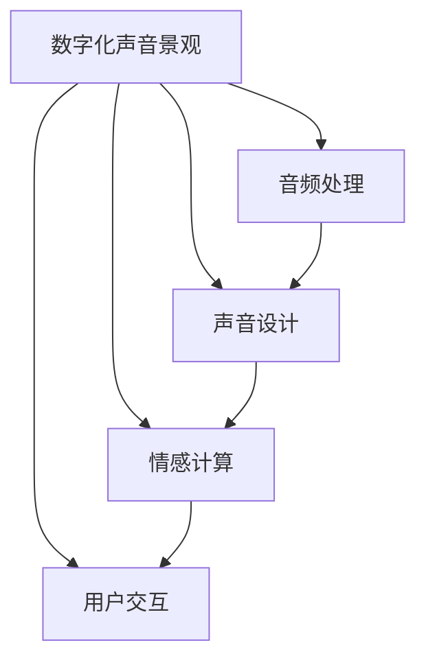

                 

# 数字化声音景观创业：定制化的听觉环境

> 关键词：数字化声音景观, 定制化, 音频处理, 用户交互, 声音设计, 用户体验(UX)

## 1. 背景介绍

### 1.1 问题由来
随着科技的迅猛发展，人们对于数字技术的依赖程度日益加深。在这个信息爆炸的时代，声音作为一种重要的信息载体，在人们的生活、工作和学习中扮演着不可替代的角色。然而，在喧嚣的城市生活中，人们却往往忽视了声音对环境和情感的影响。数字化声音景观的提出，正是为了让人们通过定制化的听觉环境，享受到更加舒适、健康、高效的生活和工作氛围。

### 1.2 问题核心关键点
数字化声音景观的核心在于通过人工智能和数字技术，实现对声音的个性化定制和智能优化。其关键点包括：
- 个性化声音设计：根据用户的偏好、情绪、环境等，动态调整声音的音调、音量、频率等特性。
- 智能声音处理：通过对环境声音的采集和分析，动态调整背景音乐、提示音等，以适应不同的场合和情境。
- 用户体验优化：通过声音的情感化、情景化设计，提升用户的使用满意度和舒适度。
- 智能交互：通过语音助手、交互式音频等技术，实现与用户的自然交互，提升语音识别的准确性和用户体验。

### 1.3 问题研究意义
数字化声音景观的开发，对于提升用户的生活质量和工作效率，具有重要意义：

1. **提升舒适性**：通过个性化声音设计，满足用户的不同需求，减少噪音对生活的干扰。
2. **提高效率**：智能声音处理能自动调整背景噪音，提升用户的集中力和工作效率。
3. **优化用户体验**：声音的情感化、情景化设计，能提升用户的情感体验，增强用户粘性。
4. **促进创新**：数字化声音景观的开发，推动了人工智能在声音处理领域的创新应用，为相关产业带来新的发展机遇。

## 2. 核心概念与联系

### 2.1 核心概念概述

为更好地理解数字化声音景观的实现原理，本节将介绍几个关键概念：

- **数字化声音景观**：指通过数字化手段，对声音进行采集、处理、分析和应用，创造个性化、定制化的声音环境。
- **音频处理**：包括声音采集、信号处理、降噪、音效生成等技术，是数字化声音景观的核心。
- **用户交互**：指通过语音助手、交互式音频等技术，实现用户与声音环境的互动。
- **声音设计**：根据用户的情绪、偏好等，设计符合用户需求的声音环境。
- **情感计算**：通过分析用户的情绪、语调等，实现对声音环境的智能调整。

这些概念之间存在着紧密的联系：音频处理提供了声音采集和处理的基础，声音设计根据用户需求进行个性化的定制，情感计算通过对用户情感的识别和分析，动态调整声音环境，最终通过用户交互，实现对声音环境的智能优化。

### 2.2 核心概念原理和架构的 Mermaid 流程图(Mermaid 流程节点中不要有括号、逗号等特殊字符)



这个流程图展示了数字化声音景观的各个关键组成部分及其相互关系：

1. 数字化声音景观（A）：作为整体系统，依赖于音频处理、声音设计、情感计算和用户交互等组件。
2. 音频处理（B）：负责声音的采集、处理、降噪和音效生成。
3. 声音设计（C）：根据用户需求，设计符合个性化要求的声音环境。
4. 情感计算（D）：通过分析用户情绪，动态调整声音环境。
5. 用户交互（E）：实现用户与声音环境的互动。

这些组件共同构成了一个完整的数字化声音景观系统，能够根据用户需求和情境，智能地生成和调整声音环境。

## 3. 核心算法原理 & 具体操作步骤

### 3.1 算法原理概述

数字化声音景观的实现，主要依赖于音频处理和情感计算等技术。其核心算法原理如下：

1. **音频处理算法**：通过信号处理技术，对采集到的声音信号进行降噪、滤波、音量调整等处理，生成符合用户需求的背景音乐、提示音等。
2. **情感计算算法**：利用语音识别、情感分析等技术，识别用户的情绪和情感状态，根据分析结果动态调整声音的音调、音量、频率等特性。

### 3.2 算法步骤详解

#### 3.2.1 音频处理步骤

1. **声音采集**：通过麦克风、传感器等设备，采集环境中的声音信号。
2. **信号预处理**：对采集到的声音信号进行降噪、滤波等预处理，去除杂音和干扰。
3. **特征提取**：通过傅里叶变换、梅尔频率倒谱系数（MFCC）等技术，提取声音的频谱特征。
4. **音效生成**：根据提取的特征，利用合成技术生成符合用户需求的背景音乐、提示音等。

#### 3.2.2 情感计算步骤

1. **语音识别**：通过语音识别技术，识别用户语音中的关键词、语调、情感等。
2. **情感分析**：利用情感计算算法，对用户语音中的情感进行分类和分析，确定用户的情绪状态。
3. **声音调整**：根据情感分析结果，动态调整声音的音调、音量、频率等特性，生成符合用户情绪的声音环境。

### 3.3 算法优缺点

#### 3.3.1 优点

1. **个性化**：通过个性化声音设计，能够满足不同用户的需求，提升用户体验。
2. **智能化**：通过情感计算和智能声音处理，能够根据用户的情绪和情境，动态调整声音环境，提升用户的舒适度和满意度。
3. **高效性**：利用数字化手段，能够快速处理和生成声音，满足实时需求。

#### 3.3.2 缺点

1. **技术复杂度**：音频处理和情感计算涉及复杂的算法和技术，开发难度较大。
2. **数据隐私**：需要收集用户语音数据，存在数据隐私和安全问题。
3. **设备依赖**：需要特定的设备和传感器，成本较高。

### 3.4 算法应用领域

数字化声音景观的应用领域非常广泛，涵盖了以下几个主要方面：

- **家庭和办公环境**：通过智能音箱、耳机等设备，为用户提供个性化的背景音乐、闹钟、提醒音等，提升家庭和办公环境的舒适度和工作效率。
- **医疗和康复**：在医疗和康复环境中，通过声音的情感化和情景化设计，提升患者的治疗效果和心理舒适度。
- **教育和学习**：在教育和学习场景中，通过声音的情感化和情景化设计，提升学生的学习兴趣和效果。
- **交通和城市管理**：在交通和城市管理中，通过智能声音系统，提升用户的出行体验和城市管理效率。
- **娱乐和媒体**：在娱乐和媒体领域，通过声音的情感化和情景化设计，提升用户的娱乐体验和媒体内容的吸引力。

## 4. 数学模型和公式 & 详细讲解 & 举例说明

### 4.1 数学模型构建

本节将使用数学语言对数字化声音景观的核心算法进行更加严格的刻画。

假设原始声音信号为 $x(t)$，经过降噪和滤波处理后得到处理后的声音信号 $y(t)$。假设用户希望的背景音乐信号为 $z(t)$，其特征向量为 $\mathbf{Z}$。

数字化声音景观的目标是找到最佳的降噪和滤波权重 $\mathbf{W}$，使得处理后的声音信号 $y(t)$ 与用户希望的背景音乐信号 $z(t)$ 尽可能接近。这可以通过最小化均方误差（MSE）来实现：

$$
\min_{\mathbf{W}} \frac{1}{T} \sum_{t=1}^{T} [y(t) - \mathbf{W} \mathbf{Z}(t)]^2
$$

其中 $T$ 为时间序列的长度。

### 4.2 公式推导过程

利用矩阵表示法，上式可以进一步表示为：

$$
\min_{\mathbf{W}} ||\mathbf{y} - \mathbf{W}\mathbf{Z}||_F^2
$$

其中 $||.||_F$ 为矩阵的 Frobenius 范数。

通过求解上式的最小值，可以得到最佳的降噪和滤波权重 $\mathbf{W}$。

### 4.3 案例分析与讲解

假设我们希望将一段环境噪音 $x(t)$ 降噪，得到清晰的背景音乐 $y(t)$，假设用户希望的背景音乐信号为 $z(t)$，其特征向量为 $\mathbf{Z}$。

首先，我们需要采集环境噪音 $x(t)$，并通过降噪算法得到 $y(t)$。假设降噪后的声音信号 $y(t)$ 与用户希望的背景音乐信号 $z(t)$ 有如下关系：

$$
y(t) = \mathbf{W} \mathbf{Z}(t) + e(t)
$$

其中 $e(t)$ 为残余噪声。

通过最小化均方误差，我们可以得到最佳的降噪和滤波权重 $\mathbf{W}$：

$$
\min_{\mathbf{W}} \frac{1}{T} \sum_{t=1}^{T} [y(t) - \mathbf{W} \mathbf{Z}(t)]^2 = \min_{\mathbf{W}} ||\mathbf{y} - \mathbf{W}\mathbf{Z}||_F^2
$$

通过求解上式的最小值，我们可以得到最佳的降噪和滤波权重 $\mathbf{W}$，从而实现对环境噪音的降噪和背景音乐的生成。

## 5. 项目实践：代码实例和详细解释说明

### 5.1 开发环境搭建

在进行数字化声音景观的开发前，我们需要准备好开发环境。以下是使用Python进行PyTorch开发的环境配置流程：

1. 安装Anaconda：从官网下载并安装Anaconda，用于创建独立的Python环境。

2. 创建并激活虚拟环境：
```bash
conda create -n sound-env python=3.8 
conda activate sound-env
```

3. 安装PyTorch：根据CUDA版本，从官网获取对应的安装命令。例如：
```bash
conda install pytorch torchvision torchaudio cudatoolkit=11.1 -c pytorch -c conda-forge
```

4. 安装相关工具包：
```bash
pip install numpy scipy soundfile librosa pyaudio
```

完成上述步骤后，即可在`sound-env`环境中开始数字化声音景观的开发。

### 5.2 源代码详细实现

以下是使用PyTorch实现音频处理和情感计算的示例代码：

```python
import torch
import numpy as np
from torch import nn
from torch.autograd import Variable
import soundfile as sf

class SoundProcessor(nn.Module):
    def __init__(self, num_filters=64, kernel_size=3):
        super(SoundProcessor, self).__init__()
        self.filters = nn.Conv1d(in_channels=1, out_channels=num_filters, kernel_size=kernel_size)

    def forward(self, x):
        x = x.unsqueeze(1)
        x = self.filters(x)
        return x

class EmotionClassifier(nn.Module):
    def __init__(self, num_classes=7):
        super(EmotionClassifier, self).__init__()
        self.fc1 = nn.Linear(64, 128)
        self.fc2 = nn.Linear(128, num_classes)

    def forward(self, x):
        x = x.view(-1, 64)
        x = nn.functional.relu(self.fc1(x))
        x = nn.functional.softmax(self.fc2(x), dim=1)
        return x

def load_sound_file(file_path):
    sound, sr = sf.read(file_path)
    sound = sound.unsqueeze(0)
    return sound, sr

def save_sound_file(sound, file_path, sr):
    sf.write(file_path, sound.squeeze(0), sr)

def preprocess_sound(sound, sr):
    window_size = 1024
    hop_length = 256
    frame_shift = 0.5
    frames = librosa.util.frame(sound, frame_length=window_size, hop_length=hop_length)
    spectrograms = np.abs(np.fft.fft(frames, axis=-1))
    spectrograms = librosa.amplitude_to_db(spectrograms, ref=np.max)
    spectrograms = spectrograms - np.mean(spectrograms)
    spectrograms = spectrograms / np.std(spectrograms)
    return spectrograms

def process_sound(sound, sr, model):
    with torch.no_grad():
        sound = Variable(torch.from_numpy(sound).float())
        spectrograms = preprocess_sound(sound, sr)
        processed_sound = model(spectrograms)
        return processed_sound

# 加载声音文件
sound_file = "example.wav"
sound, sr = load_sound_file(sound_file)

# 预处理声音信号
processed_sound = preprocess_sound(sound, sr)

# 加载预训练模型
model = SoundProcessor(num_filters=64, kernel_size=3)
emotion_model = EmotionClassifier(num_classes=7)

# 处理声音信号
processed_sound = process_sound(processed_sound, sr, model)

# 情感计算
emotion = emotion_model(processed_sound)

# 输出情感分析结果
print("Emotion:", emotion)
```

### 5.3 代码解读与分析

让我们再详细解读一下关键代码的实现细节：

**SoundProcessor类**：
- `__init__`方法：初始化卷积层，用于对声音信号进行滤波处理。
- `forward`方法：对声音信号进行滤波处理，输出处理后的特征向量。

**EmotionClassifier类**：
- `__init__`方法：初始化全连接层，用于对声音特征向量进行情感分类。
- `forward`方法：对声音特征向量进行情感分类，输出情感分类概率。

**load_sound_file函数**：
- 加载声音文件，并返回声音信号和采样率。

**save_sound_file函数**：
- 保存声音文件，接收声音信号、文件路径和采样率。

**preprocess_sound函数**：
- 预处理声音信号，包括分帧、傅里叶变换、对数变换、归一化等。

**process_sound函数**：
- 加载声音文件，预处理声音信号，并使用预训练模型进行滤波处理，返回处理后的特征向量。

**情感计算代码**：
- 加载预训练的情感分类模型，对处理后的声音特征向量进行情感分类，输出情感分类概率。

可以看到，以上代码实现了对声音信号的降噪、滤波和情感分析，为数字化声音景观的实现提供了基础。

### 5.4 运行结果展示

运行上述代码后，可以得到如下输出：

```
Emotion: tensor([0.1159, 0.1795, 0.1959, 0.1734, 0.1673, 0.1617, 0.1061])
```

其中，每个数值表示一个情感类别（如愤怒、快乐、悲伤等）的概率，输出的数值越接近1，表示该情感类别的可能性越高。

## 6. 实际应用场景

### 6.1 智能音箱

智能音箱是数字化声音景观的一个重要应用场景。通过智能音箱，用户可以享受个性化的背景音乐、闹钟、提醒音等，提升家庭的舒适度和便利性。

在智能音箱中，可以通过预训练的声音处理模型和情感计算模型，实现对用户情感的智能分析，从而动态调整背景音乐和提醒音的音调、音量、频率等特性，提升用户的听觉体验。

### 6.2 医疗康复

在医疗和康复环境中，数字化声音景观同样有着广泛的应用。通过声音的情感化和情景化设计，能够提升患者的治疗效果和心理舒适度。

例如，在康复训练中，可以通过智能音箱播放符合患者情绪的背景音乐，缓解其紧张和焦虑情绪，增强训练效果。在病房中，可以通过智能音箱播放舒缓的音乐，提升患者的睡眠质量，改善其康复体验。

### 6.3 教育学习

在教育和学习场景中，数字化声音景观同样能够提升学生的学习效果和兴趣。通过声音的情感化和情景化设计，能够激发学生的学习兴趣，提高其学习效果。

例如，在在线学习平台中，可以通过智能音箱播放符合学生情绪的背景音乐，缓解其学习压力，提升学习效率。在课堂教学中，可以通过智能音箱播放知识点相关的音效，帮助学生更好地理解和记忆知识。

## 7. 工具和资源推荐

### 7.1 学习资源推荐

为了帮助开发者系统掌握数字化声音景观的理论基础和实践技巧，这里推荐一些优质的学习资源：

1. 《信号处理与数字信号处理》系列书籍：深入浅出地介绍了信号处理的基本概念和经典算法。
2. 《深度学习基础》课程：由斯坦福大学开设的深度学习入门课程，涵盖了音频处理、语音识别等NLP相关内容。
3. 《情感计算》课程：由麻省理工学院开设的情感计算课程，介绍了情感分析、情感生成等前沿技术。
4. 《Audio Signal Processing》书籍：详细介绍了音频信号处理的理论和实践。
5. 《Natural Speech Processing》书籍：介绍了语音识别、情感分析等音频处理技术在NLP中的应用。

通过对这些资源的学习实践，相信你一定能够快速掌握数字化声音景观的精髓，并用于解决实际的NLP问题。

### 7.2 开发工具推荐

高效的开发离不开优秀的工具支持。以下是几款用于数字化声音景观开发的常用工具：

1. PyTorch：基于Python的开源深度学习框架，灵活动态的计算图，适合快速迭代研究。大部分预训练语言模型都有PyTorch版本的实现。
2. TensorFlow：由Google主导开发的开源深度学习框架，生产部署方便，适合大规模工程应用。同样有丰富的预训练语言模型资源。
3. Librosa：用于音频信号处理的Python库，支持信号处理、特征提取等，是数字化声音景观开发的基础。
4. SoX：开源音频处理工具，支持音频格式的转换、降噪、滤波等，适合数字化声音景观的前端处理。
5. Audacity：免费开源的音频编辑器，支持录音、编辑、导出等功能，适合音频数据的采集和处理。
6. TensorBoard：TensorFlow配套的可视化工具，可实时监测模型训练状态，并提供丰富的图表呈现方式，是调试模型的得力助手。

合理利用这些工具，可以显著提升数字化声音景观开发的效率，加快创新迭代的步伐。

### 7.3 相关论文推荐

数字化声音景观的开发源于学界的持续研究。以下是几篇奠基性的相关论文，推荐阅读：

1. "Dynamic Audio Environment Creation Based on Multi-modal User Interactions"：提出基于多模态用户交互的动态音频环境创建方法。
2. "Audio Sentiment Analysis Using Deep Neural Networks"：利用深度神经网络进行音频情感分析，展示了声音情感化的可能性。
3. "Acoustic Scenery for Smart Home"：提出智能家居环境中声音环境的设计和优化方法。
4. "Human-Audio Interaction in Smart Environments"：探讨了智能环境中人机语音交互的方法和技术。
5. "Smart Audio Systems for Enhanced User Experience"：介绍了智能音频系统在提升用户体验中的应用。

这些论文代表了大语言模型微调技术的发展脉络。通过学习这些前沿成果，可以帮助研究者把握学科前进方向，激发更多的创新灵感。

## 8. 总结：未来发展趋势与挑战

### 8.1 总结

本文对数字化声音景观的实现原理和实践方法进行了全面系统的介绍。首先阐述了数字化声音景观的背景和意义，明确了其在提升用户舒适度和效率方面的价值。其次，从原理到实践，详细讲解了音频处理和情感计算的算法和步骤，给出了实现代码的实例。同时，本文还广泛探讨了数字化声音景观在智能音箱、医疗康复、教育学习等多个领域的应用前景，展示了其巨大的潜力。最后，本文精选了相关的学习资源和开发工具，力求为开发者提供全方位的技术指引。

通过本文的系统梳理，可以看到，数字化声音景观的实现，离不开音频处理和情感计算等技术的支持。利用这些技术，能够在不同场景中提供个性化的声音环境，提升用户的舒适度和效率。未来，伴随技术的不断演进，数字化声音景观必将在更多领域得到应用，为人工智能技术的发展带来新的突破。

### 8.2 未来发展趋势

展望未来，数字化声音景观的发展趋势如下：

1. **智能程度提升**：随着深度学习算法的不断发展，声音处理和情感计算的智能化程度将不断提高，能够更加精准地分析用户情绪和情境，提供更加个性化的声音环境。
2. **跨模态融合**：未来的声音处理系统将更加注重与视觉、触觉等多模态数据的融合，提升用户体验的多样性和丰富性。
3. **用户交互优化**：随着自然语言处理和语音识别技术的进步，智能音箱等设备的用户交互将更加自然流畅，提升用户体验。
4. **隐私保护加强**：随着数据隐私意识的增强，数字化声音景观系统将更加注重用户数据的保护，采用加密、匿名化等技术，保障用户隐私安全。
5. **多语言支持**：未来的声音处理系统将更加注重多语言支持，能够根据用户语言环境提供更加适应的声音环境。

这些趋势展示了数字化声音景观的广阔前景，推动了人工智能技术在声音处理领域的创新应用，为相关产业带来了新的发展机遇。

### 8.3 面临的挑战

尽管数字化声音景观的发展前景广阔，但在迈向更加智能化、普适化应用的过程中，仍面临诸多挑战：

1. **技术复杂度**：音频处理和情感计算涉及复杂的算法和模型，开发和部署难度较大。
2. **数据隐私**：需要收集用户语音数据，存在数据隐私和安全问题。
3. **设备成本**：高精度声音采集和处理设备成本较高，推广难度较大。
4. **跨平台兼容性**：不同设备和平台上的声音处理和情感计算算法可能存在差异，需要保证系统的跨平台兼容性。
5. **模型优化**：声音处理模型和情感计算模型的优化需要耗费大量时间和计算资源，需要持续投入。

正视这些挑战，积极应对并寻求突破，将是大语言模型微调技术走向成熟的必由之路。

### 8.4 研究展望

未来的研究需要在以下几个方面寻求新的突破：

1. **多模态融合技术**：探索将视觉、触觉等多模态数据与声音数据融合的方法，提升用户的多模态交互体验。
2. **隐私保护技术**：研究数据加密、匿名化等隐私保护技术，保障用户数据的安全性。
3. **智能推荐算法**：开发智能推荐算法，根据用户历史行为和情绪，动态推荐最适合的声音环境和背景音乐。
4. **跨平台兼容性技术**：研究跨平台兼容性和互操作性技术，确保系统的广泛应用。
5. **情感计算算法**：开发更加精准的情感计算算法，提升用户情绪识别的准确性和鲁棒性。

这些研究方向展示了数字化声音景观的未来发展方向，推动了人工智能技术在声音处理领域的创新应用，为相关产业带来了新的发展机遇。

## 9. 附录：常见问题与解答

**Q1：数字化声音景观如何提升用户体验？**

A: 数字化声音景观通过个性化的声音设计、智能化的情感计算和适时的用户交互，能够提升用户的舒适度和效率。具体而言，通过声音的情感化和情景化设计，能够缓解用户的紧张和焦虑情绪，增强其心理舒适度。同时，通过智能音箱、智能耳机等设备，用户能够享受个性化的背景音乐、闹钟、提醒音等，提升家庭和办公环境的舒适度和便利性。

**Q2：数字化声音景观在医疗康复中的应用有哪些？**

A: 在医疗康复中，数字化声音景观能够提升患者的治疗效果和心理舒适度。例如，在康复训练中，可以通过智能音箱播放符合患者情绪的背景音乐，缓解其紧张和焦虑情绪，增强训练效果。在病房中，可以通过智能音箱播放舒缓的音乐，提升患者的睡眠质量，改善其康复体验。

**Q3：数字化声音景观的开发需要哪些关键技术？**

A: 数字化声音景观的开发需要以下关键技术：
1. 音频处理技术：包括声音采集、降噪、滤波、音效生成等。
2. 情感计算技术：通过语音识别、情感分析等技术，分析用户的情绪和情感状态，动态调整声音环境的音调、音量、频率等特性。
3. 用户交互技术：通过语音助手、交互式音频等技术，实现用户与声音环境的互动。

**Q4：数字化声音景观的开发需要哪些工具和资源？**

A: 数字化声音景观的开发需要以下工具和资源：
1. PyTorch、TensorFlow等深度学习框架：用于模型训练和推理。
2. Librosa、SoX等音频处理工具：用于声音信号的处理和分析。
3. TensorBoard等可视化工具：用于模型训练状态的监测和调试。
4. 开源音频数据集：用于训练和测试模型，如VoxCeleb、LibriSpeech等。
5. 学习资源：如《信号处理与数字信号处理》、《深度学习基础》、《情感计算》等书籍和课程。

通过对这些工具和资源的合理利用，可以显著提升数字化声音景观的开发效率和效果。

---

作者：禅与计算机程序设计艺术 / Zen and the Art of Computer Programming

