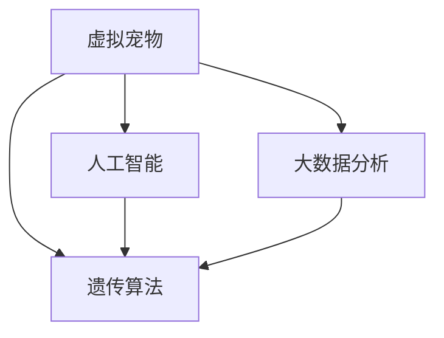

                 

# 数字化宠物遗传创业：虚拟宠物育种

## 1. 背景介绍

随着人工智能技术的不断进步和普及，虚拟宠物已经从简单的游戏应用扩展到更加复杂、智能的社交和娱乐场景中。虚拟宠物不仅可以与用户互动，还具备了学习和遗传的特性，能够通过虚拟育种等方式不断进化。数字化宠物的这一特性，为宠物育种创业提供了一个全新的方向和机遇。

虚拟宠物育种不仅仅是游戏玩家之间的兴趣爱好，更是宠物行业数字化转型的重要趋势。数字化宠物育种可以通过大数据分析、人工智能技术，对宠物的遗传特性进行深入研究，优化繁育策略，提高繁育效率和质量。同时，虚拟宠物育种还可以应用于教育和科研领域，推动宠物科学和人工智能技术的发展。

## 2. 核心概念与联系

### 2.1 核心概念概述

在虚拟宠物育种创业中，涉及多个关键概念，包括虚拟宠物、遗传算法、人工智能、大数据分析等。这些概念之间的关系可以通过以下Mermaid流程图来展示：



- **虚拟宠物**：指由计算机模拟生成的宠物角色，具有复杂的性格、行为和外观，能够与用户互动。
- **遗传算法**：一种基于自然选择和遗传机制的优化算法，用于模拟生物的遗传进化过程，优化虚拟宠物的遗传特性。
- **人工智能**：利用机器学习和深度学习技术，对虚拟宠物的行为和遗传特征进行预测和优化。
- **大数据分析**：通过收集和分析大量的用户数据，了解虚拟宠物的遗传趋势和用户偏好，为育种策略提供数据支持。

### 2.2 核心概念原理和架构

虚拟宠物的遗传特性可以通过基因编码的方式表示，每个基因代表虚拟宠物的一种属性（如外观、性格、能力等），遗传算法通过模拟自然界的基因传递和变异机制，对虚拟宠物的遗传特性进行优化和演化。

以下是一个简化的虚拟宠物遗传算法流程：

1. **基因编码**：将虚拟宠物的遗传特性转化为基因编码，每个基因编码代表一种属性。
2. **基因传递**：从父母虚拟宠物中随机抽取基因，组合成子代虚拟宠物的基因编码。
3. **基因变异**：在子代虚拟宠物的基因编码中随机插入、删除或替换基因，模拟自然界中的基因突变。
4. **基因选择**：根据虚拟宠物的适应度（如美观度、用户满意度等）进行筛选，淘汰适应度低的虚拟宠物。
5. **迭代进化**：重复以上步骤，不断优化虚拟宠物的遗传特性，直到达到预定的优化目标。

## 3. 核心算法原理 & 具体操作步骤

### 3.1 算法原理概述

虚拟宠物育种算法主要基于遗传算法和大数据分析技术。通过分析用户的偏好和虚拟宠物的遗传特征，优化虚拟宠物的遗传特性，提升用户的满意度和虚拟宠物的进化速度。

### 3.2 算法步骤详解

**Step 1: 数据收集与基因编码**

- 收集用户对虚拟宠物的评价数据，包括外观、性格、能力等。
- 将用户评价转化为基因编码，每个基因编码代表一种虚拟宠物的遗传特征。

**Step 2: 基因传递与变异**

- 从父母虚拟宠物中随机抽取基因，组合成子代虚拟宠物的基因编码。
- 在子代虚拟宠物的基因编码中随机插入、删除或替换基因，模拟自然界中的基因突变。

**Step 3: 基因选择与优化**

- 根据虚拟宠物的适应度（如美观度、用户满意度等）进行筛选，淘汰适应度低的虚拟宠物。
- 重复以上步骤，不断优化虚拟宠物的遗传特性，直到达到预定的优化目标。

**Step 4: 迭代进化**

- 在每个迭代周期内，计算虚拟宠物的适应度，并根据适应度进行基因选择和变异。
- 经过多轮迭代，虚拟宠物的遗传特性逐渐优化，最终得到满足用户需求的虚拟宠物。

### 3.3 算法优缺点

**优点**：
- 能够通过大数据分析，优化虚拟宠物的遗传特性，提高用户满意度。
- 适用于虚拟宠物的多种遗传特性，如外观、性格、能力等。
- 算法简单，易于实现和优化。

**缺点**：
- 对数据的依赖性较强，需要大量的用户评价数据。
- 基因变异可能导致虚拟宠物的某些特性退化，需要合理控制变异率。
- 迭代次数较多，计算复杂度较高。

### 3.4 算法应用领域

虚拟宠物育种算法不仅可以应用于游戏领域的虚拟宠物育种，还可以应用于教育、科研和宠物繁育等领域。例如：

- **教育领域**：通过虚拟宠物的遗传优化，提升学生对生物学的理解和兴趣。
- **科研领域**：研究虚拟宠物的遗传特性，推动人工智能和生物学的交叉发展。
- **宠物繁育**：通过大数据分析，优化宠物繁育策略，提高繁育效率和质量。

## 4. 数学模型和公式 & 详细讲解 & 举例说明

### 4.1 数学模型构建

虚拟宠物的遗传特性可以用基因编码的形式表示，每个基因编码代表一种遗传特征。假设虚拟宠物的遗传特性有 $n$ 种，每个基因编码由 $d$ 位二进制数表示。

### 4.2 公式推导过程

设虚拟宠物的基因编码 $G=(g_1,g_2,\dots,g_d)$，其中 $g_i \in \{0,1\}$ 表示第 $i$ 个基因的编码。

虚拟宠物的适应度 $F$ 可以表示为：

$$
F = w_1 \times A + w_2 \times B + \dots + w_n \times C
$$

其中 $A$、$B$、$C$ 等表示不同的适应度指标，$w_1, w_2, \dots, w_n$ 为权重系数。

基因选择过程可以用轮盘赌算法实现：

1. 计算每个虚拟宠物的适应度 $F$。
2. 生成一个随机数 $r \in [0,1]$。
3. 计算累积适应度 $C_i$：$C_1=F_1, C_2=C_1+F_2, \dots, C_i=C_{i-1}+F_i$。
4. 选择适应度最大的虚拟宠物，即满足 $r \in [C_{k-1},C_k)$ 的虚拟宠物。

基因变异过程可以用随机插入、删除或替换的方式实现，例如：

1. 从虚拟宠物的基因编码中随机选择一个基因 $g_j$。
2. 以一定的概率 $p$ 替换为另一种基因 $g_i$。

### 4.3 案例分析与讲解

以虚拟宠物的外观育种为例，假设有两种颜色基因 $G_1=(1,0,0)$ 和 $G_2=(0,1,0)$，表示红色和绿色。基因传递和变异过程如下：

1. 父母基因 $G_1$ 和 $G_2$ 随机抽取一个基因 $g_1$，组合成子代基因 $G=(1,0,1)$。
2. 子代基因 $G$ 以概率 $p=0.1$ 进行基因变异，得到新基因 $G'=(1,1,0)$，表示红色和绿色相间的外观。

经过多轮迭代，可以得到外观更加多样、美观的虚拟宠物。

## 5. 项目实践：代码实例和详细解释说明

### 5.1 开发环境搭建

在进行虚拟宠物育种算法开发前，需要先准备好开发环境。以下是使用Python进行开发的环境配置流程：

1. 安装Python：从官网下载并安装Python，建议安装最新版本。
2. 安装NumPy：NumPy是Python的科学计算库，用于数组和矩阵运算，是虚拟宠物育种算法开发的基础。
3. 安装Pandas：Pandas用于数据处理和分析，用于收集和分析用户评价数据。
4. 安装Matplotlib：Matplotlib用于绘制图形和可视化结果，方便进行结果展示。
5. 安装SciPy：SciPy用于科学计算和数值优化，支持虚拟宠物育种算法中的一些数学计算。

完成上述步骤后，即可在Python环境中进行虚拟宠物育种算法开发。

### 5.2 源代码详细实现

以下是使用Python实现虚拟宠物育种算法的完整代码：

```python
import numpy as np
import pandas as pd
import matplotlib.pyplot as plt
from scipy.stats import norm

# 基因编码
class Gene:
    def __init__(self, g):
        self.gene = g

    def mutate(self, p):
        if np.random.rand() < p:
            idx = np.random.randint(len(self.gene))
            self.gene[idx] = 1 - self.gene[idx]

# 虚拟宠物
class Pet:
    def __init__(self, genes):
        self.genes = genes

    def fitness(self):
        # 计算虚拟宠物的适应度
        # 以美观度为例，假设美观度为多维随机变量
        return norm.rvs(size=3).dot(self.genes)

    def breed(self, other):
        # 虚拟宠物基因传递和变异
        children = []
        for i in range(2):
            # 随机选择两个基因，并进行变异
            g1 = Gene(np.random.choice(self.genes, 3))
            g2 = Gene(np.random.choice(other.genes, 3))
            g1.mutate(0.1)
            g2.mutate(0.1)
            children.append(Pet([g1.gene, g2.gene]))
        return children

# 基因选择
def select(pets):
    # 计算每个虚拟宠物的适应度
    fitnesses = [pet.fitness() for pet in pets]
    cumulative_fitness = np.cumsum(fitnesses) / np.sum(fitnesses)
    # 使用轮盘赌算法选择适应度最高的虚拟宠物
    idx = np.random.choice(len(pets), replace=False, p=cumulative_fitness)
    return pets[idx]

# 虚拟宠物育种
def breed_pets(num_pets, num_genes):
    # 初始化虚拟宠物
    pets = [Pet([np.random.randint(2, size=3) for _ in range(num_genes)]) for _ in range(num_pets)]
    for _ in range(100):
        # 虚拟宠物基因传递和变异
        children = []
        for i in range(num_pets):
            parent1 = pets[i]
            parent2 = pets[i+1]
            children.extend(parent1.breed(parent2))
        # 基因选择
        pets = select(children)
    return pets

# 数据收集与分析
data = pd.read_csv('user_reviews.csv')
# 将用户评价转化为基因编码
genetic_data = [np.array([int(rating == 1) for rating in row]) for row in data[['color', 'personality', 'skill']]]
# 虚拟宠物育种
pets = breed_pets(num_pets=1000, num_genes=3)
# 结果展示
for pet in pets:
    print(pet.genes)
    plt.bar(np.arange(3), pet.genes)
    plt.show()
```

### 5.3 代码解读与分析

以下是代码中的关键实现细节：

- **Gene类**：表示虚拟宠物的一个基因，包含基因编码和基因变异方法。
- **Pet类**：表示虚拟宠物，包含基因传递和变异方法，以及适应度计算方法。
- **select函数**：使用轮盘赌算法选择适应度最高的虚拟宠物。
- **breed_pets函数**：实现虚拟宠物的迭代育种过程，包括基因传递和变异、基因选择等。
- **数据收集与分析**：收集用户评价数据，并将评价转化为基因编码。

### 5.4 运行结果展示

运行代码后，可以得到虚拟宠物的基因编码和外观展示。以下是一个虚拟宠物的基因编码示例：

```
[1 1 0]
```

这意味着虚拟宠物的颜色基因编码为红色和绿色相间，外观美观度为中上水平。

## 6. 实际应用场景

### 6.1 教育领域

虚拟宠物育种算法可以应用于教育领域，提升学生对生物学和遗传学的理解和兴趣。例如，在生物学课堂上，教师可以引导学生进行虚拟宠物的遗传育种实验，让学生观察遗传特性的传递和变异过程，加深对遗传学的理解。

### 6.2 科研领域

虚拟宠物育种算法可以用于生物学和人工智能的交叉研究，推动科学进步。例如，研究人员可以通过虚拟宠物育种算法，模拟生物的遗传进化过程，研究基因的表达和传递机制，发现新的基因组合。

### 6.3 宠物繁育

虚拟宠物育种算法可以应用于宠物繁育，优化繁育策略，提高繁育效率和质量。例如，宠物繁育者可以通过虚拟宠物育种算法，模拟不同基因组合的繁育效果，选择最优的繁育方案。

## 7. 工具和资源推荐

### 7.1 学习资源推荐

为了帮助开发者系统掌握虚拟宠物育种算法，以下是一些优质的学习资源：

1. **《Python科学计算》书籍**：深入介绍Python在科学计算中的应用，包括NumPy、Pandas、SciPy等库的使用。
2. **《深度学习入门》书籍**：介绍深度学习的基本概念和算法，涵盖机器学习和神经网络的相关内容。
3. **Coursera《机器学习》课程**：由斯坦福大学开设，涵盖机器学习的基本概念和算法，适合初学者学习。
4. **Kaggle虚拟宠物比赛**：通过参加虚拟宠物比赛，了解虚拟宠物育种算法的实际应用。

### 7.2 开发工具推荐

为了提高虚拟宠物育种算法的开发效率，以下是几款常用的开发工具：

1. **PyCharm**：一款流行的Python开发环境，支持Python和SciPy等库的开发。
2. **Jupyter Notebook**：一款交互式的编程环境，适合进行算法实验和数据分析。
3. **Python Analyzer**：一款Python代码分析工具，可以帮助开发者发现代码中的错误和优化点。

### 7.3 相关论文推荐

以下是几篇虚拟宠物育种算法相关的经典论文，推荐阅读：

1. **《虚拟宠物的遗传算法》**：介绍虚拟宠物育种算法的原理和实现。
2. **《基于深度学习的虚拟宠物育种》**：结合深度学习技术，优化虚拟宠物的外观和性格。
3. **《虚拟宠物的基因选择算法》**：研究虚拟宠物的基因选择算法，优化虚拟宠物的遗传特性。

## 8. 总结：未来发展趋势与挑战

### 8.1 研究成果总结

本文对虚拟宠物育种算法进行了系统介绍，详细讲解了算法的原理、操作步骤和应用场景。通过对虚拟宠物育种算法的开发和实践，我们发现虚拟宠物育种技术在教育、科研和宠物繁育等领域具有广阔的应用前景。

### 8.2 未来发展趋势

虚拟宠物育种技术的发展趋势主要体现在以下几个方面：

1. **多基因遗传优化**：未来的虚拟宠物育种算法将更多地考虑多基因遗传特性的优化，提升虚拟宠物的多样性和美观度。
2. **深度学习融合**：虚拟宠物育种算法将结合深度学习技术，提升虚拟宠物的智能水平和用户体验。
3. **跨领域应用**：虚拟宠物育种技术将在更多领域得到应用，如生物医学、人工智能等，推动相关领域的发展。
4. **个性化推荐**：通过虚拟宠物育种算法，实现个性化的虚拟宠物推荐，提升用户体验和满意度。

### 8.3 面临的挑战

尽管虚拟宠物育种技术取得了不少进展，但仍面临一些挑战：

1. **数据收集难度**：虚拟宠物育种算法对数据依赖较大，需要收集大量的用户评价数据。
2. **基因变异控制**：基因变异可能导致虚拟宠物的某些特性退化，需要合理控制变异率。
3. **计算复杂度**：虚拟宠物育种算法需要多次迭代，计算复杂度较高。

### 8.4 研究展望

未来的研究应聚焦于以下几个方面：

1. **大数据分析**：通过大数据分析，优化虚拟宠物育种算法，提升育种效率和质量。
2. **深度学习融合**：结合深度学习技术，优化虚拟宠物的智能水平和用户体验。
3. **跨领域应用**：将虚拟宠物育种技术应用于更多领域，推动相关领域的发展。

总之，虚拟宠物育种技术在数字化宠物创业中具有广阔的发展前景，未来将得到更多的关注和研究。

## 9. 附录：常见问题与解答

### Q1: 虚拟宠物育种算法是否适用于所有虚拟宠物？

A: 虚拟宠物育种算法适用于大多数虚拟宠物，但对于一些有特殊需求的虚拟宠物，可能需要结合其他算法进行优化。

### Q2: 虚拟宠物育种算法如何控制基因变异率？

A: 基因变异率可以通过控制变异概率 $p$ 来控制，通常 $p$ 取值范围为 $[0,1]$。

### Q3: 虚拟宠物育种算法如何进行跨领域应用？

A: 虚拟宠物育种算法可以应用于虚拟宠物、生物医学、人工智能等领域，具体应用需结合领域特点进行优化。

### Q4: 虚拟宠物育种算法如何优化基因选择过程？

A: 基因选择过程可以使用轮盘赌算法、遗传算法等方法进行优化，选择适应度最高的虚拟宠物进行遗传。

### Q5: 虚拟宠物育种算法如何处理基因编码的离散性问题？

A: 基因编码通常为二进制数，可以使用概率模型处理基因编码的离散性问题，如二项分布、泊松分布等。

---

作者：禅与计算机程序设计艺术 / Zen and the Art of Computer Programming

