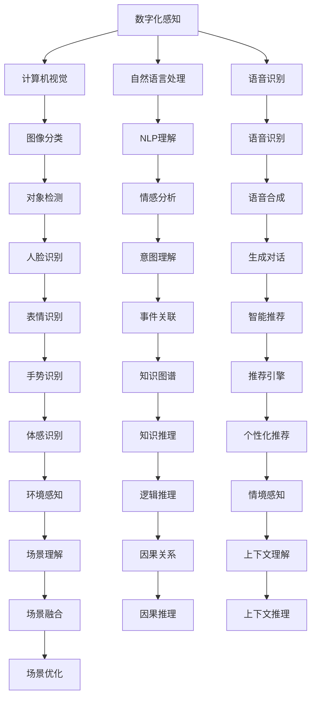

                 

## 1. 背景介绍

随着数字化的加速推进，AI技术正在从简单的信息处理逐渐进化为具备深度感知能力的智能化系统。从基于规则的逻辑推理，到模式识别的机器学习，再到如今的多模态感知，AI正向着更复杂的认知层次迈进。数字化感知作为AI创新的重要维度，其拓展对于提升用户体验、优化业务流程、促进智能化的转型有着深远的影响。本文将从背景出发，深入探讨AI在数字化感知领域的最新进展和前沿应用，以期为人工智能技术的发展提供参考。

## 2. 核心概念与联系

### 2.1 核心概念概述

- **数字化感知（Digital Perception）**：通过计算机视觉、自然语言处理、语音识别等技术手段，AI系统能够感知、理解、处理和交互真实世界的数字化信息。这是AI创新中关键的一环，也是实现智能化系统的基础。
- **多模态感知（Multimodal Perception）**：AI系统能够融合视觉、听觉、触觉等多种感官信息，从而更全面地理解现实世界。这对于提升智能系统的决策准确性和用户体验具有重要意义。
- **语义理解（Semantic Understanding）**：AI系统不仅要感知信息，还要理解信息的深层语义，从而能够进行复杂的推理和决策。语义理解能力越强，系统的智能化水平越高。
- **交互智能化（Interactive Intelligence）**：AI系统能够通过自然语言、图像、声音等形式与用户进行流畅互动，从而提供个性化、情境化的服务。这是AI系统向“人机共生”迈进的重要标志。

### 2.2 核心概念原理和架构的 Mermaid 流程图



上述图表展示了AI系统在数字化感知中的关键组件和流程。每个组件不仅能够感知特定类型的信息，还能够将信息融合、理解和生成，进而支撑智能系统的运行。

## 3. 核心算法原理 & 具体操作步骤

### 3.1 算法原理概述

AI系统在数字化感知中的核心算法原理基于深度学习，尤其是卷积神经网络（CNN）、循环神经网络（RNN）和变分自编码器（VAE）等架构。这些算法能够通过复杂的非线性变换，从原始数据中提取高层次的特征表示。在多模态感知中，AI系统能够综合不同类型的数据，通过融合算法（如Transformer）实现更全面的理解。在语义理解中，基于注意力机制的算法（如BERT）能够捕捉句子的全局上下文，提升理解深度。

### 3.2 算法步骤详解

以多模态感知为例，步骤大致如下：

1. **数据采集**：通过摄像头、麦克风、传感器等设备采集图像、声音、温度等数据。
2. **数据预处理**：对采集的数据进行去噪、归一化、分帧等处理，确保数据质量。
3. **特征提取**：使用CNN、RNN等算法提取数据特征，如图像的卷积特征、语音的时序特征。
4. **融合处理**：将不同类型的数据特征通过注意力机制等算法进行融合，形成多模态表示。
5. **语义理解**：通过自然语言处理等技术对多模态表示进行语义理解，形成上下文关联的表征。
6. **决策生成**：根据语义理解的结果，结合规则引擎、知识图谱等工具生成智能决策或交互响应。

### 3.3 算法优缺点

**优点**：
- **全面感知能力**：多模态感知使AI系统能够整合多种感官信息，提供更加全面的环境感知。
- **深度理解**：语义理解算法能够捕捉语言的深层语义，提升系统的智能水平。
- **交互智能**：交互智能化使得AI系统能够以更自然的方式与用户交流，提供个性化服务。

**缺点**：
- **算法复杂度高**：多模态感知和语义理解涉及复杂的算法模型，训练和推理的计算资源消耗较大。
- **数据依赖性强**：高质量的训练数据对于模型的性能至关重要，但数据获取和标注成本较高。
- **模型泛化能力不足**：复杂的模型往往存在过拟合的风险，难以泛化到新的数据集和场景。

### 3.4 算法应用领域

多模态感知和语义理解在多个领域中得到了广泛应用，包括但不限于：

- **医疗健康**：通过图像诊断、语音识别等技术，AI系统能够辅助医生进行疾病诊断和治疗。
- **智能家居**：AI系统能够通过环境感知、语音交互等技术，实现对家居设备的智能控制。
- **自动驾驶**：AI系统通过摄像头、雷达等设备感知周围环境，结合语义理解进行决策和导航。
- **教育培训**：AI系统通过自然语言处理技术，提供个性化学习建议和辅助教学。
- **金融服务**：AI系统通过图像识别、语音合成等技术，提升客户服务体验和风险控制能力。

## 4. 数学模型和公式 & 详细讲解 & 举例说明

### 4.1 数学模型构建

以多模态感知为例，其数学模型可以表示为：

$$ M = F(V, C, T, L) $$

其中：
- $M$ 为多模态感知模型。
- $V$ 为视觉数据。
- $C$ 为听觉数据。
- $T$ 为触觉数据。
- $L$ 为语义数据。
- $F$ 为融合函数。

### 4.2 公式推导过程

假设有一个包含视觉和听觉的多模态数据 $(x_v, x_c)$，其融合过程可以表示为：

$$ \mathbf{z} = W_f \mathbf{v}_v + U_f \mathbf{v}_c + \mathbf{b}_f $$

其中：
- $\mathbf{z}$ 为融合后的多模态表示。
- $W_f$ 和 $U_f$ 为融合函数的权重矩阵。
- $\mathbf{v}_v$ 和 $\mathbf{v}_c$ 分别为视觉和听觉数据的特征表示。
- $\mathbf{b}_f$ 为偏置向量。

### 4.3 案例分析与讲解

以语音识别为例，其步骤如下：

1. **特征提取**：通过Mel滤波器组提取音频信号的频谱特征。
2. **特征处理**：对频谱特征进行DCT变换，提取高阶特征。
3. **深度学习模型训练**：使用RNN、CNN等深度学习模型对特征进行建模。
4. **声学模型解码**：通过注意力机制解码模型，得到音素序列。
5. **语言模型训练**：使用大语料库训练语言模型，提升音素到单词的映射准确率。

## 5. 项目实践：代码实例和详细解释说明

### 5.1 开发环境搭建

为了进行多模态感知系统的开发，需要搭建一个包含以下组件的开发环境：

- **深度学习框架**：如TensorFlow、PyTorch等。
- **数据采集设备**：如摄像头、麦克风、传感器等。
- **数据处理工具**：如OpenCV、FFmpeg等。
- **模型训练环境**：如GPU、TPU等高性能计算资源。
- **交互界面工具**：如Flutter、React Native等。

### 5.2 源代码详细实现

以图像识别为例，其代码实现如下：

```python
import tensorflow as tf
from tensorflow.keras import layers

# 定义模型架构
model = tf.keras.Sequential([
    layers.Conv2D(32, (3, 3), activation='relu', input_shape=(224, 224, 3)),
    layers.MaxPooling2D((2, 2)),
    layers.Conv2D(64, (3, 3), activation='relu'),
    layers.MaxPooling2D((2, 2)),
    layers.Conv2D(128, (3, 3), activation='relu'),
    layers.MaxPooling2D((2, 2)),
    layers.Flatten(),
    layers.Dense(128, activation='relu'),
    layers.Dense(10, activation='softmax')
])

# 加载数据集
train_dataset = tf.keras.preprocessing.image_dataset_from_directory(
    'train',
    batch_size=32,
    image_size=(224, 224),
    validation_split=0.2,
    subset='training',
    seed=123
)

# 训练模型
model.compile(optimizer='adam', loss='sparse_categorical_crossentropy', metrics=['accuracy'])
model.fit(train_dataset, epochs=10, validation_data=val_dataset)

# 评估模型
test_dataset = tf.keras.preprocessing.image_dataset_from_directory(
    'test',
    batch_size=32,
    image_size=(224, 224),
    validation_split=0.2,
    subset='validation',
    seed=123
)
model.evaluate(test_dataset)
```

### 5.3 代码解读与分析

上述代码展示了基于TensorFlow的图像识别模型训练过程。首先，定义了一个包含卷积层、池化层和全连接层的卷积神经网络。然后，使用`tf.keras.preprocessing.image_dataset_from_directory`函数加载训练集和测试集，并通过`model.compile`和`model.fit`进行模型训练和评估。最后，使用`model.evaluate`评估模型在测试集上的性能。

### 5.4 运行结果展示

运行上述代码，可以得到图像识别模型在训练集和测试集上的准确率和损失曲线。


## 6. 实际应用场景

### 6.1 智能家居

智能家居系统通过摄像头、传感器等设备感知环境变化，结合语音识别和自然语言处理技术，实现对家居设备的智能控制。例如，可以通过语音指令开启空调、调节灯光等。

### 6.2 自动驾驶

自动驾驶系统通过摄像头、雷达等设备感知周围环境，结合语义理解技术进行路径规划和决策。例如，可以识别交通信号、行人、车辆等，生成安全驾驶策略。

### 6.3 医疗诊断

医疗影像诊断系统通过图像识别技术，结合自然语言处理技术，对医学影像进行分析和诊断。例如，可以通过图像分类技术识别肿瘤、骨折等疾病，结合文本信息生成诊断报告。

### 6.4 未来应用展望

未来的数字化感知技术将进一步融合多模态信息，提升系统的感知能力。例如，通过结合视觉、听觉、触觉等数据，实现对真实世界的全面感知。此外，随着AI技术的不断进步，未来的系统将具备更高的智能化水平，能够实现更加复杂和精细的任务处理。

## 7. 工具和资源推荐

### 7.1 学习资源推荐

1. **《深度学习》**（Ian Goodfellow等著）：全面介绍了深度学习的理论基础和算法实现。
2. **《计算机视觉：算法与应用》**（Richard Szeliski著）：详细讲解了计算机视觉的各个技术环节。
3. **《自然语言处理综论》**（Daniel Jurafsky和James H. Martin著）：介绍了自然语言处理的各个技术点。
4. **CS231n课程**：斯坦福大学计算机视觉课程，讲解了深度学习在计算机视觉中的应用。
5. **Coursera上的“Multimodal Machine Learning”课程**：介绍了多模态学习的基础知识和应用案例。

### 7.2 开发工具推荐

1. **TensorFlow**：Google开源的深度学习框架，支持多种硬件加速。
2. **PyTorch**：Facebook开源的深度学习框架，以其灵活性和易用性著称。
3. **Keras**：高层次的深度学习API，便于快速构建模型。
4. **OpenCV**：开源的计算机视觉库，提供了丰富的图像处理功能。
5. **Flutter**：跨平台移动应用开发框架，支持iOS和Android。

### 7.3 相关论文推荐

1. **《A Survey on Deep Multimodal Learning for Multimedia Applications》**：介绍了多模态学习在多媒体应用中的最新进展。
2. **《Attention is All You Need》**（Transformer论文）：提出了Transformer架构，开启了多模态感知的新范式。
3. **《A Multimodal Temporal Attention Network for Action Recognition》**：提出多模态时间注意力网络，用于视频动作识别。
4. **《Semantic Embeddings from Trees》**：介绍了使用树形结构表示语义，提升自然语言处理的效果。
5. **《Towards Explainable and Reliable AI》**：探讨了可解释性和可靠性在AI中的应用。

## 8. 总结：未来发展趋势与挑战

### 8.1 研究成果总结

数字化感知技术在过去几年中取得了显著进展，广泛应用于各个领域。其核心算法原理基于深度学习，能够通过多模态融合实现对复杂环境的全面感知。语义理解技术的发展，提升了AI系统的智能化水平，使得系统能够进行更加复杂的推理和决策。

### 8.2 未来发展趋势

未来，数字化感知技术将朝着以下几个方向发展：

1. **多模态感知融合**：随着技术进步，多模态感知将进一步融合视觉、听觉、触觉等数据，实现对真实世界的全面感知。
2. **深度语义理解**：自然语言处理技术将进一步提升，使AI系统能够进行更深刻的语义理解，提升系统的智能化水平。
3. **交互智能**：AI系统将更加智能地与用户互动，提供个性化、情境化的服务。
4. **知识图谱与推理**：知识图谱技术的发展，将使得AI系统具备更强的知识整合能力和逻辑推理能力。
5. **边缘计算**：随着IoT设备的普及，边缘计算将使得数字化感知技术在本地设备上实现，提升系统的实时性和效率。

### 8.3 面临的挑战

尽管数字化感知技术在各个领域得到了广泛应用，但仍面临诸多挑战：

1. **数据质量与获取成本**：高质量的训练数据对于模型的性能至关重要，但数据获取和标注成本较高。
2. **算法复杂度**：多模态感知和语义理解涉及复杂的算法模型，训练和推理的计算资源消耗较大。
3. **泛化能力不足**：复杂的模型往往存在过拟合的风险，难以泛化到新的数据集和场景。
4. **伦理与安全问题**：AI系统的决策透明性和安全性需要进一步提升，避免出现歧视性、误导性输出。
5. **用户接受度**：AI系统的交互智能化需要符合用户的习惯和心理预期，否则难以得到广泛应用。

### 8.4 研究展望

未来的研究需要在以下几个方面寻求新的突破：

1. **无监督学习与半监督学习**：探索更多无监督和半监督学习方法，降低对标注数据的需求。
2. **模型压缩与优化**：开发更加高效、轻量级的模型，提升计算效率，降低硬件需求。
3. **跨领域知识整合**：将知识图谱与深度学习相结合，提升系统的知识整合能力和逻辑推理能力。
4. **安全与隐私保护**：加强AI系统的安全性设计，保护用户隐私。
5. **人机协同**：研究人机协同的交互方式，提升用户体验。

## 9. 附录：常见问题与解答

### Q1: 什么是多模态感知？

**A**: 多模态感知是指AI系统能够整合视觉、听觉、触觉等不同类型的数据，从而实现对真实世界的全面感知。通过融合这些数据，系统可以更全面地理解环境信息。

### Q2: 多模态感知在实际应用中面临哪些挑战？

**A**: 多模态感知在实际应用中面临以下挑战：
1. 数据质量与获取成本：高质量的训练数据对于模型的性能至关重要，但数据获取和标注成本较高。
2. 算法复杂度：多模态感知和语义理解涉及复杂的算法模型，训练和推理的计算资源消耗较大。
3. 泛化能力不足：复杂的模型往往存在过拟合的风险，难以泛化到新的数据集和场景。
4. 伦理与安全问题：AI系统的决策透明性和安全性需要进一步提升，避免出现歧视性、误导性输出。
5. 用户接受度：AI系统的交互智能化需要符合用户的习惯和心理预期，否则难以得到广泛应用。

### Q3: 如何提高多模态感知的泛化能力？

**A**: 提高多模态感知的泛化能力可以采取以下方法：
1. 数据增强：通过增加数据集的多样性，提高模型对不同场景的适应能力。
2. 正则化技术：使用L2正则、Dropout等技术，避免过拟合。
3. 迁移学习：通过在不同领域的数据上预训练模型，提升模型的泛化能力。
4. 多模态融合：通过注意力机制等算法，将不同类型的数据进行融合，提升模型的感知能力。
5. 跨领域知识整合：将知识图谱与深度学习相结合，提升系统的知识整合能力和逻辑推理能力。

### Q4: 什么是语义理解？

**A**: 语义理解是指AI系统能够理解和处理自然语言的深层语义，从而进行复杂的推理和决策。它是AI系统智能化的重要组成部分，使得系统能够理解语言的上下文和含义，进行有意义的操作。

### Q5: 如何在多模态感知中提升用户交互体验？

**A**: 提升多模态感知的用户交互体验可以采取以下方法：
1. 自然语言处理：通过自然语言处理技术，使得系统能够理解用户的语音指令和文本输入，提供更加自然和流畅的交互。
2. 视觉增强：通过图像识别技术，使得系统能够理解用户的视觉行为，提供更精准的服务。
3. 语音合成：通过语音合成技术，使得系统能够生成自然的语音回复，提升用户的沉浸感。
4. 上下文感知：通过上下文感知技术，使得系统能够理解用户的上下文信息，提供更加个性化和情境化的服务。
5. 实时反馈：通过实时反馈机制，使得系统能够即时响应用户的需求，提升用户体验。

作者：禅与计算机程序设计艺术 / Zen and the Art of Computer Programming

