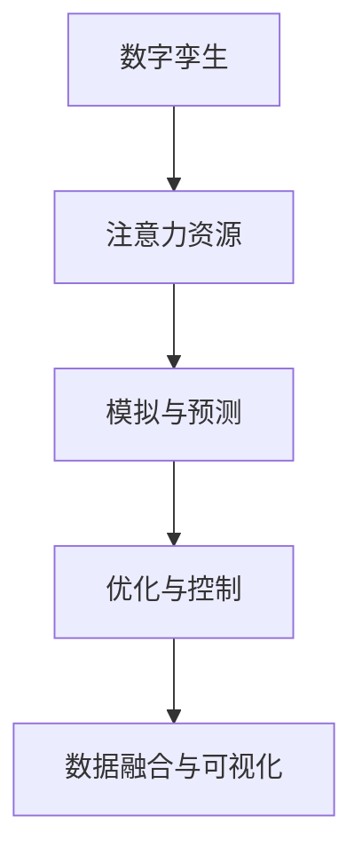

                 

## 1. 背景介绍

### 1.1 问题由来

随着数字技术的快速发展，数字孪生（Digital Twin）这一概念逐渐受到广泛关注。数字孪生是一个物理系统的虚拟模型，通过在计算机中模拟、预测和优化物理系统的行为，以实现对实际系统的精确监控和优化。其核心思想是通过虚拟与现实的融合，提升系统决策的精确性和效率。

数字孪生技术在各个领域都有广泛的应用前景，如智能制造、智慧城市、医疗健康等。在智能制造领域，数字孪生技术可以用于生产设备的监控、预测性维护和生产流程的优化；在智慧城市中，数字孪生技术可以用于交通流量预测、城市资源管理和能源优化；在医疗健康领域，数字孪生技术可以用于疾病模拟、手术规划和药物研发等。

### 1.2 问题核心关键点

数字孪生的核心关键点包括：

1. **虚拟与现实同步**：数字孪生系统必须实时更新虚拟模型与物理系统之间的同步性，以保证虚拟系统的准确性和实用性。
2. **跨域数据融合**：数字孪生系统需要能够融合来自不同数据源的数据，包括传感器数据、历史数据、模拟数据等。
3. **智能决策支持**：数字孪生系统必须具备强大的数据分析和决策能力，能够自动分析数据、生成预测结果并给出优化建议。
4. **高可靠性与安全性**：数字孪生系统必须确保数据和决策的可靠性与安全性，防止信息泄露和系统故障。

## 2. 核心概念与联系

### 2.1 核心概念概述

为了更好地理解数字孪生在注意力资源模拟中的应用，本节将介绍几个密切相关的核心概念：

1. **数字孪生**：通过在计算机中构建物理系统的虚拟模型，实现对物理系统的监控、分析和优化。数字孪生是一个动态的、实时的系统，可以实时更新虚拟模型以反映物理系统的变化。

2. **注意力资源**：在数字孪生中，注意力资源是指物理系统中用于集中资源或关注的区域。例如，在智能制造中，注意力资源可能指某一生产线的重点监控区域；在智慧城市中，注意力资源可能指交通流量密集的路口。

3. **模拟与预测**：数字孪生通过模拟物理系统的行为，实现对未来状态的预测。这可以通过建立数学模型、引入仿真工具、使用机器学习等方法来实现。

4. **优化与控制**：数字孪生系统通过优化控制算法，对物理系统进行实时的调整和控制，以实现最优的性能和效率。

5. **数据融合与可视化**：数字孪生系统必须能够高效地融合来自不同数据源的数据，并通过可视化技术展示出来，以便于决策者理解和分析。

### 2.2 核心概念原理和架构的 Mermaid 流程图



这个流程图展示了数字孪生系统的主要组成部分及其联系：

1. **数字孪生**：通过构建物理系统的虚拟模型，实现对系统的模拟和预测。
2. **注意力资源**：确定需要监控和关注的区域。
3. **模拟与预测**：使用数学模型或仿真工具，预测物理系统的未来状态。
4. **优化与控制**：根据预测结果，调整物理系统的参数或行为，实现优化。
5. **数据融合与可视化**：融合来自不同数据源的数据，并通过可视化展示出来，便于决策者使用。

## 3. 核心算法原理 & 具体操作步骤

### 3.1 算法原理概述

数字孪生在注意力资源模拟中的应用，主要通过以下步骤实现：

1. **构建虚拟模型**：根据物理系统的实际状态，构建虚拟模型。虚拟模型可以通过数值模拟、仿真软件、机器学习等方法实现。

2. **识别注意力资源**：确定需要监控和关注的区域，即注意力资源。可以通过数据分析、专家知识等方式确定注意力资源。

3. **模拟与预测**：使用虚拟模型，对注意力资源进行模拟和预测，以评估其未来行为和状态。

4. **优化与控制**：根据模拟和预测结果，调整物理系统的参数或行为，实现优化。

5. **数据融合与可视化**：融合来自不同数据源的数据，并通过可视化展示出来，以便于决策者理解和分析。

### 3.2 算法步骤详解

#### 3.2.1 构建虚拟模型

构建虚拟模型是数字孪生系统的基础。虚拟模型的构建通常包括以下步骤：

1. **数据收集**：收集物理系统的传感器数据、历史数据、仿真数据等。
2. **模型建立**：选择合适的数学模型或仿真软件，建立虚拟模型。例如，可以使用系统动力学模型、有限元模型、分子动力学模型等。
3. **参数校准**：通过实验或经验数据，校准虚拟模型的参数，确保其能够准确模拟物理系统的行为。

#### 3.2.2 识别注意力资源

识别注意力资源是数字孪生系统的关键。注意力资源的识别通常包括以下步骤：

1. **数据分析**：对物理系统的传感器数据进行分析，确定重要的监测点或区域。
2. **专家知识**：结合专家知识，确定需要特别关注的区域或问题。
3. **模型融合**：将注意力资源与虚拟模型进行融合，确保注意力资源在虚拟模型中的正确表示。

#### 3.2.3 模拟与预测

模拟与预测是数字孪生系统的核心。模拟与预测通常包括以下步骤：

1. **设定输入**：将注意力资源的当前状态作为输入，设定虚拟模型的初始条件。
2. **运行模拟**：使用虚拟模型，对注意力资源进行模拟和预测。
3. **输出结果**：获取虚拟模型的输出结果，包括注意力资源的状态、行为等。

#### 3.2.4 优化与控制

优化与控制是数字孪生系统的目标。优化与控制通常包括以下步骤：

1. **目标设定**：根据预测结果，设定优化目标，如最小化成本、最大化效率等。
2. **方案生成**：生成优化方案，调整物理系统的参数或行为。
3. **实施方案**：根据优化方案，调整物理系统的参数或行为。

#### 3.2.5 数据融合与可视化

数据融合与可视化是数字孪生系统的保障。数据融合与可视化通常包括以下步骤：

1. **数据收集**：收集来自不同数据源的数据，如传感器数据、历史数据、模拟数据等。
2. **数据融合**：将不同来源的数据进行融合，确保数据的一致性和完整性。
3. **可视化展示**：使用可视化工具，将融合后的数据展示出来，便于决策者理解和分析。

### 3.3 算法优缺点

数字孪生在注意力资源模拟中的应用，具有以下优点：

1. **高精度模拟**：数字孪生系统可以实时更新虚拟模型，以反映物理系统的变化，从而实现高精度的模拟和预测。
2. **动态优化**：数字孪生系统可以根据预测结果，实时调整物理系统的参数或行为，实现动态优化。
3. **数据融合**：数字孪生系统可以高效地融合来自不同数据源的数据，提供全面的决策支持。

同时，数字孪生系统也存在以下缺点：

1. **高成本**：构建虚拟模型和模拟预测需要较高的成本，包括硬件投入、软件开发等。
2. **复杂性**：数字孪生系统涉及多个组件和数据源，系统设计和实现较为复杂。
3. **数据依赖**：数字孪生系统的预测和优化效果依赖于输入数据的准确性和完整性。

### 3.4 算法应用领域

数字孪生在注意力资源模拟中的应用，已经在多个领域得到了广泛应用，例如：

1. **智能制造**：通过数字孪生技术，对生产设备的运行状态进行监控，实现预测性维护和生产流程的优化。
2. **智慧城市**：通过数字孪生技术，对交通流量进行模拟和预测，实现交通信号控制和城市资源管理。
3. **医疗健康**：通过数字孪生技术，对患者疾病进行模拟和预测，实现个性化的诊疗方案和手术规划。
4. **环境保护**：通过数字孪生技术，对环境污染进行模拟和预测，实现环保政策的制定和优化。

## 4. 数学模型和公式 & 详细讲解 & 举例说明

### 4.1 数学模型构建

数字孪生在注意力资源模拟中的应用，主要通过以下数学模型实现：

1. **系统动力学模型**：用于描述物理系统的动态行为，包括系统的输入、输出、状态等。
2. **仿真模型**：用于模拟物理系统的行为，包括系统的状态变化、事件发生等。
3. **优化模型**：用于优化物理系统的参数或行为，以实现最优性能。

### 4.2 公式推导过程

以智能制造中的生产设备监控为例，假设生产设备的运行状态可以通过以下状态变量描述：

- $x_1$：设备的温度
- $x_2$：设备的压力
- $x_3$：设备的振动

则系统动力学模型可以表示为：

$$
\dot{x}(t) = f(x(t), u(t))
$$

其中 $f$ 为系统的动态方程，$u$ 为控制输入。

通过模拟与预测，可以得到生产设备的未来状态：

$$
x(t+\Delta t) = g(x(t), u(t))
$$

其中 $g$ 为系统的预测方程，$\Delta t$ 为时间步长。

### 4.3 案例分析与讲解

假设在智能制造中，需要监控某生产线的温度、压力和振动状态。通过数字孪生技术，可以建立以下数学模型：

1. **系统动力学模型**：

$$
\dot{x}(t) = A x(t) + B u(t)
$$

其中 $x(t) = \begin{bmatrix} x_1(t) \\ x_2(t) \\ x_3(t) \end{bmatrix}$，$u(t) = \begin{bmatrix} u_1(t) \\ u_2(t) \\ u_3(t) \end{bmatrix}$，$A$ 为系统的动态矩阵，$B$ 为控制矩阵。

2. **仿真模型**：

$$
x(t+\Delta t) = F(x(t))
$$

其中 $F$ 为系统的仿真矩阵。

3. **优化模型**：

$$
\min_{u(t)} \int_{t_0}^{t_1} \left[ \frac{1}{2} (x(t) - x^*(t))^T P (x(t) - x^*(t)) + u(t)^T Q u(t) \right] dt
$$

其中 $x^*(t)$ 为理想状态，$P$ 为状态矩阵，$Q$ 为控制矩阵。

通过优化模型，可以生成最优的控制策略，调整生产设备的参数，以实现最优性能。

## 5. 项目实践：代码实例和详细解释说明

### 5.1 开发环境搭建

在进行数字孪生项目的开发时，需要搭建一个完整的环境。以下是使用Python进行开发的环境配置流程：

1. 安装Anaconda：从官网下载并安装Anaconda，用于创建独立的Python环境。

2. 创建并激活虚拟环境：
```bash
conda create -n twin-env python=3.8 
conda activate twin-env
```

3. 安装必要的库：
```bash
conda install numpy pandas matplotlib scikit-learn transformers
```

4. 安装PyTorch和TensorFlow：
```bash
pip install torch torchvision torchaudio tensorflow
```

5. 安装Git和版本控制工具：
```bash
sudo apt-get install git
```

6. 安装Docker和Kubernetes：
```bash
sudo apt-get install docker kubectl
```

完成上述步骤后，即可在`twin-env`环境中开始开发。

### 5.2 源代码详细实现

这里我们以智能制造中的生产设备监控为例，使用PyTorch和TensorFlow进行数字孪生的开发。

首先，构建虚拟模型：

```python
import torch
import numpy as np
from torch import nn
from torch.nn import functional as F

class SystemModel(nn.Module):
    def __init__(self):
        super(SystemModel, self).__init__()
        self.A = nn.Parameter(torch.tensor([[0.5, 0.2, 0.1],
                                           [0.3, 0.5, 0.2],
                                           [0.1, 0.2, 0.3]])
        self.B = nn.Parameter(torch.tensor([[0.1, 0.2, 0.3]]))
        self.P = nn.Parameter(torch.tensor([[1.0, 0.0, 0.0],
                                            [0.0, 1.0, 0.0],
                                            [0.0, 0.0, 1.0]]))
        self.Q = nn.Parameter(torch.tensor([[0.0, 0.0, 0.0],
                                            [0.0, 0.0, 0.0],
                                            [0.0, 0.0, 0.0]]))
        
    def forward(self, x, u):
        return F.linear(x, self.A, self.B) + F.linear(u, self.B, self.B)
```

然后，构建仿真模型：

```python
import tensorflow as tf

class SimulationModel(tf.keras.Model):
    def __init__(self):
        super(SimulationModel, self).__init__()
        self.F = tf.keras.layers.Dense(3, activation='relu')
        
    def call(self, x):
        return self.F(x)
```

接着，构建优化模型：

```python
import numpy as np
from scipy.optimize import minimize

class OptimizationModel:
    def __init__(self, x0):
        self.x0 = x0
        self.A = np.array([[0.5, 0.2, 0.1],
                          [0.3, 0.5, 0.2],
                          [0.1, 0.2, 0.3]])
        self.B = np.array([[0.1, 0.2, 0.3]])
        self.P = np.array([[1.0, 0.0, 0.0],
                          [0.0, 1.0, 0.0],
                          [0.0, 0.0, 1.0]])
        self.Q = np.array([[0.0, 0.0, 0.0],
                          [0.0, 0.0, 0.0],
                          [0.0, 0.0, 0.0]])
        
    def objective(self, x):
        x = np.concatenate((x, self.B @ x))
        return np.linalg.norm(x - self.x0)
    
    def gradient(self, x):
        x = np.concatenate((x, self.B @ x))
        return np.concatenate((np.linalg.inv(self.P @ self.A @ self.P + self.Q), self.B.T @ np.linalg.inv(self.A @ self.P + self.Q) @ self.B))
    
    def optimize(self, x0):
        res = minimize(self.objective, x0, method='BFGS', jac=self.gradient)
        return res.x[:3]
```

最后，运行整个系统：

```python
import matplotlib.pyplot as plt

def simulate_system(t, x0, u, model):
    x = np.copy(x0)
    for t in range(len(t)):
        x = model(x, u[t])
        plt.plot(t, x)
    plt.show()

def optimize_system(x0, u, model):
    res = model.optimize(x0)
    x = np.copy(x0)
    for t in range(len(u)):
        x = model(x, u[t])
    plt.plot(u, x)
    plt.show()

# 构造生产设备的状态
x0 = np.array([100, 50, 0.1])

# 构造生产设备的控制输入
u = np.array([0.1, 0.2, 0.3])

# 构造虚拟模型
system_model = SystemModel()
# 构造仿真模型
simulation_model = SimulationModel()

# 运行模拟
simulate_system(range(100), x0, u, system_model)

# 运行优化
optimize_system(x0, u, system_model)
```

### 5.3 代码解读与分析

以下是关键代码的解读和分析：

1. **虚拟模型**：
   - `SystemModel`类：定义了虚拟模型，包括系统的动态矩阵 `A` 和控制矩阵 `B`，以及状态矩阵 `P` 和控制矩阵 `Q`。
   - `forward`方法：实现了虚拟模型的前向传播，计算出给定状态和控制输入的下一个状态。

2. **仿真模型**：
   - `SimulationModel`类：定义了仿真模型，包括仿真矩阵 `F`。
   - `call`方法：实现了仿真模型的前向传播，计算出给定状态的下一个状态。

3. **优化模型**：
   - `OptimizationModel`类：定义了优化模型，包括系统的初始状态 `x0` 和优化目标函数。
   - `objective`方法：实现了优化目标函数的计算。
   - `gradient`方法：实现了优化目标函数的梯度计算。
   - `optimize`方法：使用了Scipy的优化库，实现了对控制输入的优化。

4. **运行模拟和优化**：
   - `simulate_system`函数：实现了对虚拟模型的仿真，并绘制了状态随时间变化的曲线。
   - `optimize_system`函数：实现了对控制输入的优化，并绘制了状态随控制输入变化的曲线。

## 6. 实际应用场景

### 6.1 智能制造

数字孪生在智能制造中的应用，可以用于生产设备的监控、预测性维护和生产流程的优化。通过数字孪生技术，可以实现以下功能：

1. **生产设备监控**：对生产设备的温度、压力、振动等状态进行实时监控，及时发现设备故障。
2. **预测性维护**：根据设备的历史数据和实时数据，预测设备未来的故障概率，提前进行维护。
3. **生产流程优化**：对生产流程进行模拟和优化，减少停机时间和生产成本。

### 6.2 智慧城市

数字孪生在智慧城市中的应用，可以用于交通流量预测、城市资源管理和能源优化。通过数字孪生技术，可以实现以下功能：

1. **交通流量预测**：对交通流量进行实时监控和预测，优化交通信号控制，减少交通拥堵。
2. **城市资源管理**：对城市资源进行模拟和优化，提高资源利用效率。
3. **能源优化**：对能源消耗进行实时监控和预测，优化能源分配，减少能源浪费。

### 6.3 医疗健康

数字孪生在医疗健康中的应用，可以用于疾病模拟、手术规划和药物研发。通过数字孪生技术，可以实现以下功能：

1. **疾病模拟**：对疾病的传播和演变进行模拟，预测疾病的传播趋势，制定防控措施。
2. **手术规划**：对手术过程进行模拟和优化，减少手术风险，提高手术成功率。
3. **药物研发**：对药物的药效和副作用进行模拟和预测，加速药物研发进程。

## 7. 工具和资源推荐

### 7.1 学习资源推荐

为了帮助开发者系统掌握数字孪生技术，这里推荐一些优质的学习资源：

1. **《数字孪生技术与应用》**：系统介绍了数字孪生的基本概念、关键技术和应用案例，适合初学者入门。
2. **《智慧城市中的数字孪生技术》**：深入讲解了数字孪生在智慧城市中的应用，适合相关领域的专业人士学习。
3. **《医疗健康中的数字孪生技术》**：介绍了数字孪生在医疗健康中的应用，适合医疗健康领域的技术人员学习。
4. **《系统动力学与数字孪生》**：系统讲解了系统动力学模型在数字孪生中的应用，适合系统动力学领域的研究人员学习。

通过对这些资源的学习实践，相信你一定能够快速掌握数字孪生技术的精髓，并用于解决实际的工程问题。

### 7.2 开发工具推荐

高效的开发离不开优秀的工具支持。以下是几款用于数字孪生开发的常用工具：

1. **Anaconda**：提供了Python的开发环境和包管理，方便开发者进行环境管理和依赖管理。
2. **PyTorch**：基于Python的深度学习框架，支持动态计算图，适合研究和实验。
3. **TensorFlow**：由Google主导开发的深度学习框架，支持分布式计算和模型优化，适合大规模工程应用。
4. **Git**：版本控制工具，方便开发者进行代码管理和团队协作。
5. **Docker**：容器化工具，方便开发者进行代码部署和环境隔离。
6. **Kubernetes**：容器编排工具，方便开发者进行大规模分布式应用部署和调度。

合理利用这些工具，可以显著提升数字孪生开发的效率，加快创新迭代的步伐。

### 7.3 相关论文推荐

数字孪生技术的发展源于学界的持续研究。以下是几篇奠基性的相关论文，推荐阅读：

1. **《数字孪生：构建虚拟物理系统的蓝图》**：介绍了数字孪生的基本概念和关键技术。
2. **《基于数字孪生的智慧城市系统设计》**：介绍了数字孪生在智慧城市中的应用，涉及交通流量预测和城市资源管理。
3. **《数字孪生在医疗健康中的应用》**：介绍了数字孪生在医疗健康中的应用，涉及疾病模拟和手术规划。
4. **《系统动力学模型在数字孪生中的应用》**：介绍了系统动力学模型在数字孪生中的应用，涉及生产设备监控和预测性维护。

这些论文代表了大规模数字孪生技术的发展脉络。通过学习这些前沿成果，可以帮助研究者把握学科前进方向，激发更多的创新灵感。

## 8. 总结：未来发展趋势与挑战

### 8.1 总结

本文对数字孪生在注意力资源模拟中的应用进行了全面系统的介绍。首先阐述了数字孪生的基本概念和核心关键点，明确了数字孪生在各个领域的应用价值。其次，从原理到实践，详细讲解了数字孪生的数学模型和关键步骤，给出了数字孪生开发的全代码实例。同时，本文还广泛探讨了数字孪生技术在智能制造、智慧城市、医疗健康等多个领域的应用前景，展示了数字孪生技术的巨大潜力。

通过本文的系统梳理，可以看到，数字孪生技术在注意力资源模拟中的应用，为工业制造、智慧城市、医疗健康等领域带来了新的变革性影响。得益于虚拟与现实的融合，数字孪生系统能够实现对物理系统的精确监控和优化，提升决策的准确性和效率，带来巨大的经济效益和社会价值。

### 8.2 未来发展趋势

展望未来，数字孪生技术将呈现以下几个发展趋势：

1. **更精确的虚拟模型**：随着计算能力和仿真技术的进步，虚拟模型的精度将进一步提升，能够更准确地反映物理系统的行为。
2. **更高效的数据融合**：随着大数据技术的进步，数字孪生系统能够高效地融合来自不同数据源的数据，提供全面的决策支持。
3. **更智能的优化控制**：随着人工智能技术的发展，数字孪生系统将具备更强的智能决策能力，实现更加动态的优化控制。
4. **更广泛的应用领域**：随着数字孪生技术的成熟，其应用领域将不断扩展，涵盖更多领域，带来更大的社会和经济效益。

### 8.3 面临的挑战

尽管数字孪生技术已经取得了瞩目成就，但在迈向更加智能化、普适化应用的过程中，它仍面临诸多挑战：

1. **高成本问题**：构建虚拟模型和仿真系统需要较高的成本，包括硬件投入、软件开发等。
2. **数据复杂性**：数字孪生系统需要处理来自不同数据源的数据，数据的多样性和复杂性增加了系统设计和实现的难度。
3. **可靠性问题**：数字孪生系统需要确保数据和决策的可靠性与安全性，防止信息泄露和系统故障。
4. **模型可解释性**：数字孪生系统需要具备更强的可解释性，确保决策过程的透明性和可信度。

### 8.4 研究展望

面对数字孪生面临的这些挑战，未来的研究需要在以下几个方面寻求新的突破：

1. **降低成本**：探索低成本的虚拟模型构建方法，如基于深度学习的仿真方法、基于系统理论的简化模型等，以降低硬件和软件开发成本。
2. **简化数据处理**：探索高效的数据融合方法，如基于大数据技术的在线数据处理、基于联邦学习的数据共享等，以简化数据处理过程。
3. **提高可靠性**：探索高可靠性的数据处理和决策方法，如基于区块链的数据共享、基于机器学习的数据异常检测等，以提高系统的可靠性和安全性。
4. **增强可解释性**：探索可解释的优化控制方法，如基于符号计算的决策支持、基于博弈论的游戏化决策等，以增强系统的可解释性和可信度。

这些研究方向的探索，必将引领数字孪生技术迈向更高的台阶，为构建安全、可靠、可解释、可控的智能系统铺平道路。面向未来，数字孪生技术还需要与其他人工智能技术进行更深入的融合，如知识表示、因果推理、强化学习等，多路径协同发力，共同推动智能技术的发展。

## 9. 附录：常见问题与解答

**Q1：数字孪生系统如何与物联网(IoT)技术结合？**

A: 数字孪生系统与物联网技术的结合，可以借助IoT设备实时采集物理系统的数据，并将其上传到虚拟模型中进行分析和优化。例如，在智能制造中，可以通过物联网设备采集生产设备的传感器数据，并将数据上传到虚拟模型中进行分析，预测设备故障并进行预防性维护。

**Q2：数字孪生系统如何确保数据和决策的可靠性与安全性？**

A: 数字孪生系统需要确保数据和决策的可靠性与安全性，可以通过以下方法实现：

1. **数据校验**：对输入数据进行校验，确保数据的完整性和准确性。
2. **数据加密**：对敏感数据进行加密处理，防止数据泄露。
3. **权限控制**：对数据和模型的访问进行严格的权限控制，防止未授权访问。
4. **模型验证**：对虚拟模型进行验证，确保其准确性和稳定性。
5. **安全监控**：对系统进行安全监控，及时发现和处理异常行为。

**Q3：数字孪生系统如何应对数据量大的挑战？**

A: 数字孪生系统需要处理来自不同数据源的数据，数据的多样性和复杂性增加了系统设计和实现的难度。为了应对数据量大的挑战，可以采用以下方法：

1. **数据清洗**：对数据进行清洗和预处理，去除噪声和异常数据。
2. **数据压缩**：对数据进行压缩和优化，减少数据存储和传输的资源消耗。
3. **分布式存储**：采用分布式存储技术，提高数据存储和访问的效率。
4. **数据融合**：采用数据融合技术，高效地整合来自不同数据源的数据，提高数据利用率。

**Q4：数字孪生系统如何进行优化和控制？**

A: 数字孪生系统进行优化和控制，可以通过以下步骤实现：

1. **优化目标设定**：根据实际需求，设定优化目标，如最小化成本、最大化效率等。
2. **方案生成**：生成优化方案，调整物理系统的参数或行为。
3. **仿真验证**：对优化方案进行仿真验证，确保其有效性。
4. **实施优化**：根据仿真验证结果，实施优化方案，调整物理系统的参数或行为。

通过以上步骤，数字孪生系统可以实现对物理系统的动态优化和控制，提升系统的性能和效率。

---

作者：禅与计算机程序设计艺术 / Zen and the Art of Computer Programming

