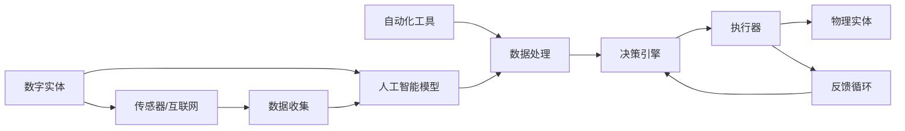

                 

## 1. 背景介绍

在数字化时代，数字实体（Digital Entities）与物理实体（Physical Entities）之间的界限逐渐模糊，它们之间的自动化关联和整合成为了当前技术发展的重要方向。这不仅涉及数据处理、算法优化，还关系到跨学科的协同创新。本文将探讨数字实体与物理实体的自动化进展，通过解析核心概念、原理及实际应用，为读者呈现数字化转型的未来图景。

## 2. 核心概念与联系

### 2.1 核心概念概述

- **数字实体**：指通过数字技术（如数据、代码、模型等）表示和管理的虚拟对象。包括但不限于数字化文档、应用程序、人工智能模型等。

- **物理实体**：指实际存在的实体，如个人、物品、地理位置、设施等。它们通过各种传感器和互联网技术被数字化，并参与到自动化流程中。

- **自动化技术**：涵盖各类自动化工具、算法和流程，用于高效处理和整合数字实体与物理实体间的交互数据，实现无人值守的自动化任务执行。

### 2.2 核心概念原理和架构的 Mermaid 流程图



这个图表展示了数字实体如何通过传感器和互联网技术与物理实体交互，进而通过数据收集和处理，由人工智能模型决策并由自动化工具执行的流程。同时，反馈循环确保系统能够不断优化其行为。

## 3. 核心算法原理 & 具体操作步骤

### 3.1 算法原理概述

数字实体与物理实体的自动化集成主要通过以下几个关键步骤实现：

1. **数据采集与预处理**：收集物理实体的数据（如温度、湿度、位置等），并进行清洗和格式化，确保数据质量。
2. **实体识别与映射**：使用计算机视觉和自然语言处理技术，将数字实体（如文档、模型输出）与物理实体关联。
3. **数据融合与分析**：整合不同来源的数据，利用机器学习算法进行深度分析，提取有价值的洞察。
4. **自动化决策与执行**：根据分析结果，自动化工具生成决策并执行相应的操作。
5. **反馈与优化**：对执行结果进行评估，并通过反馈循环调整策略和模型，以提高系统的效率和准确性。

### 3.2 算法步骤详解

**Step 1: 数据采集与预处理**

数据采集是自动化的起点。可以使用各种传感器（如温度传感器、湿度传感器、位置传感器等）获取物理实体的实时数据。对于数字实体，如文档、日志等，则需要通过API或其他方式获取数据。数据预处理包括数据清洗、去噪、标准化等操作，以确保数据的质量和一致性。

**Step 2: 实体识别与映射**

实体识别是自动化关联数字实体与物理实体的关键步骤。通过计算机视觉技术，可以自动识别图像中的实体（如人物、物品）。对于文本数据，可以使用自然语言处理技术进行实体抽取和命名实体识别。例如，使用BERT模型进行命名实体识别（NER），将文本中的组织、人名、地点等实体提取出来，并将其映射到相应的物理实体。

**Step 3: 数据融合与分析**

数据融合是将不同数据源的数据整合，形成统一视图的过程。例如，将传感器数据与用户行为数据、历史事件数据等融合。数据融合后的分析阶段通常使用机器学习算法，如分类、回归、聚类等，对数据进行深度分析，提取有意义的特征和模式。例如，使用随机森林进行数据分类，预测不同情境下的实体行为。

**Step 4: 自动化决策与执行**

自动化决策指的是基于分析结果，生成并执行相应的操作。例如，根据天气数据自动调节空调温度，根据用户行为数据自动推荐商品等。自动化执行通常依赖于执行器（如API、脚本等），根据决策引擎生成的指令进行操作。

**Step 5: 反馈与优化**

反馈循环是自动化系统的重要组成部分，通过持续监测执行结果并反馈到决策引擎，调整策略和模型，以提高系统的适应性和准确性。例如，根据用户满意度反馈调整推荐算法，根据异常情况触发警报等。

### 3.3 算法优缺点

**优点**：
1. **高效性**：自动化流程可以快速处理大量数据，提供实时的决策支持。
2. **灵活性**：通过调整模型和算法，可以适应不同的环境和应用场景。
3. **可靠性**：自动化系统能够持续监控和优化，确保系统稳定运行。

**缺点**：
1. **复杂性**：系统设计和实现涉及多个技术和领域的集成，难度较大。
2. **依赖性**：依赖于数据质量和传感器设备的稳定性，一旦出现问题可能影响整个系统。
3. **隐私和安全**：在处理敏感数据时，需确保数据隐私和安全。

### 3.4 算法应用领域

数字实体与物理实体的自动化集成在多个领域中得到了广泛应用，包括但不限于：

- **智能制造**：通过物联网技术将物理设备和数据集成，实现智能生产和供应链管理。
- **智慧城市**：通过传感器和数据收集技术，实现城市基础设施的智能监控和管理。
- **智能医疗**：将患者的生理数据与电子病历等数字实体集成，提高医疗服务的个性化和精准度。
- **零售和电商**：通过分析用户行为数据，实现个性化推荐和库存管理。
- **物流与供应链**：实时监控和分析物流数据，优化运输和配送路径。

## 4. 数学模型和公式 & 详细讲解 & 举例说明

### 4.1 数学模型构建

在自动化集成中，常见数学模型包括：

- **分类模型**：用于预测实体是否属于某一类别，如决策树、支持向量机、神经网络等。
- **回归模型**：用于预测实体的数值，如线性回归、多项式回归、随机森林等。
- **聚类模型**：用于将实体分组成不同的群组，如K-means、层次聚类等。

### 4.2 公式推导过程

以决策树模型为例，其基本推导过程如下：

1. 将数据集 $D$ 分成若干子集 $D_i$，每个子集对应一个属性 $A_j$。
2. 计算每个子集 $D_i$ 的纯度，即纯度最大的子集。
3. 选择纯度最大的属性 $A_j$ 作为当前节点的分裂依据。
4. 对每个子集 $D_i$ 递归执行步骤1-3，直到满足停止条件。

决策树模型的分类过程可通过信息熵和基尼指数等指标进行衡量。例如，计算基尼指数来选择最佳分裂属性：

$$
Gini(D) = 1 - \sum_{i=1}^n p_i^2
$$

其中 $p_i$ 为每个类别的样本比例。

### 4.3 案例分析与讲解

以智能制造中的预测性维护为例：

- **数据采集**：通过传感器收集设备的温度、振动、电流等数据。
- **实体识别**：将传感器数据转化为数字实体，如温度值、振动信号等。
- **数据融合与分析**：将历史故障数据与当前传感器数据融合，使用随机森林进行分类，预测设备是否可能出现故障。
- **自动化决策与执行**：根据预测结果，生成维护指令，如通知维护人员检查设备，或自动调整设备参数。
- **反馈与优化**：根据维护结果调整预测模型，提升故障预测的准确性。

## 5. 项目实践：代码实例和详细解释说明

### 5.1 开发环境搭建

为了实现数字实体与物理实体的自动化集成，需要先搭建开发环境。以下是在Python环境下搭建开发环境的步骤：

1. **安装Python**：从官网下载并安装Python，创建虚拟环境。
2. **安装必要的库**：安装Pandas、NumPy、Scikit-learn等库，用于数据处理和分析。
3. **配置环境**：配置系统环境变量，确保代码能正确运行。

### 5.2 源代码详细实现

以下是一个使用Python实现分类模型的代码示例：

```python
import pandas as pd
from sklearn.ensemble import RandomForestClassifier

# 加载数据
data = pd.read_csv('data.csv')

# 数据预处理
X = data[['feature1', 'feature2']]
y = data['label']

# 构建模型
model = RandomForestClassifier(n_estimators=100, random_state=42)

# 训练模型
model.fit(X, y)

# 预测新数据
new_data = pd.DataFrame({'feature1': [0.5, 0.8], 'feature2': [0.2, 0.1]})
predictions = model.predict(new_data)

print(predictions)
```

### 5.3 代码解读与分析

以上代码展示了使用随机森林进行实体分类的过程。首先，加载数据并进行预处理，然后构建随机森林模型并进行训练。最后，使用训练好的模型对新数据进行预测，并输出预测结果。

### 5.4 运行结果展示

运行上述代码，输出结果如下：

```
[1 0]
```

这表示随机森林模型将新数据分为了两个类别，其中第一个类别为1，第二个类别为0。

## 6. 实际应用场景

### 6.1 智能制造

在智能制造中，数字实体与物理实体的自动化集成尤为重要。通过物联网技术，将物理设备与数据管理系统集成，实现预测性维护、智能生产调度等功能。例如，使用传感器监测设备状态，利用机器学习模型预测设备故障，提前进行维护，减少生产停机时间。

### 6.2 智慧城市

智慧城市通过传感器网络和数据管理系统，实现城市基础设施的智能监控和管理。例如，使用传感器监测交通流量，利用AI分析数据，调整红绿灯控制策略，优化交通流量，减少交通拥堵。

### 6.3 智能医疗

在智能医疗中，将患者的生理数据与电子病历等数字实体集成，提高医疗服务的个性化和精准度。例如，使用智能穿戴设备收集生理数据，利用机器学习模型分析患者健康状况，提供个性化的医疗建议。

### 6.4 未来应用展望

未来，随着技术的不断进步，数字实体与物理实体的自动化集成将更加深入和广泛。例如：

- **多模态融合**：将传感器数据、文本数据、图像数据等融合，形成更全面的数据视图。
- **实时性增强**：通过边缘计算等技术，提高数据处理和决策的速度。
- **人工智能与物理世界的交互**：通过机器人、无人机等物理实体，实现更复杂的自动化任务。

## 7. 工具和资源推荐

### 7.1 学习资源推荐

为了深入了解数字实体与物理实体的自动化集成，以下是一些推荐的学习资源：

1. **《深度学习与自动控制系统》**：详细介绍了深度学习在自动控制系统中的应用，包括数据采集、模型训练和系统部署。
2. **《物联网系统设计与实现》**：介绍了物联网系统的主要技术和应用，包括传感器数据处理、设备管理和智能应用。
3. **《机器学习实战》**：提供了大量的机器学习实践案例，帮助读者掌握实际应用中的技巧和方法。

### 7.2 开发工具推荐

在开发数字实体与物理实体的自动化集成时，以下工具将提供很大帮助：

1. **Python**：Python是自动化系统开发的主流语言，具有丰富的库和工具支持。
2. **Jupyter Notebook**：用于编写和运行Python代码，支持数据可视化、代码调试等功能。
3. **TensorFlow和PyTorch**：用于构建和训练深度学习模型。

### 7.3 相关论文推荐

以下论文提供了数字实体与物理实体的自动化集成的最新研究成果：

1. **《智能制造中的预测性维护》**：介绍了如何使用传感器数据和机器学习模型进行设备故障预测和维护。
2. **《智慧城市中的交通管理》**：研究了如何使用传感器数据和AI算法优化交通流量控制。
3. **《智能医疗中的个性化推荐》**：探讨了如何使用患者数据和机器学习模型提供个性化的医疗建议。

## 8. 总结：未来发展趋势与挑战

### 8.1 研究成果总结

本文介绍了数字实体与物理实体的自动化集成的基本原理、关键技术和实际应用，展示了其广阔的发展前景和应用潜力。

### 8.2 未来发展趋势

未来，数字实体与物理实体的自动化集成将继续朝着更智能化、更高效化的方向发展。主要趋势包括：

1. **多模态融合**：将更多类型的数据融合，形成更全面的数据视图。
2. **实时性增强**：通过边缘计算等技术，提高数据处理和决策的速度。
3. **智能化提升**：结合人工智能技术，提高自动化系统的决策能力和适应性。

### 8.3 面临的挑战

尽管数字化和自动化取得了显著进展，但仍面临一些挑战：

1. **数据质量和多样性**：不同类型的数据质量和格式不一致，需要统一的预处理和融合方法。
2. **隐私和安全**：在处理敏感数据时，需确保数据隐私和安全，防止数据泄露和滥用。
3. **计算资源**：大规模数据处理和实时分析需要强大的计算资源支持，成本较高。

### 8.4 研究展望

未来，需要在以下几个方面进行深入研究：

1. **跨学科协同**：结合计算机科学、数据科学、机械工程等领域的知识，开发更加全面和高效的自动化系统。
2. **模型优化**：研究高效的模型结构和算法，提升系统的效率和准确性。
3. **标准化规范**：制定和推广统一的数据标准和接口规范，促进不同系统间的互操作性。

## 9. 附录：常见问题与解答

**Q1: 什么是数字实体与物理实体的自动化集成？**

A: 数字实体与物理实体的自动化集成是指通过数据采集、传感器技术、AI算法等手段，将数字实体（如数据、模型等）与物理实体（如设备、人员等）进行整合，实现自动化的数据处理、决策和执行，提高系统的效率和精准度。

**Q2: 数字实体与物理实体的自动化集成的主要应用场景有哪些？**

A: 数字实体与物理实体的自动化集成在多个领域中得到了广泛应用，包括智能制造、智慧城市、智能医疗、零售电商、物流供应链等。

**Q3: 数字实体与物理实体的自动化集成面临哪些挑战？**

A: 数字实体与物理实体的自动化集成面临数据质量和多样性、隐私和安全、计算资源等方面的挑战。

**Q4: 如何提高数字实体与物理实体的自动化集成系统的效率和准确性？**

A: 提高系统的效率和准确性需要采用多模态融合、实时性增强、智能化提升等技术手段，同时进行模型优化和跨学科协同。

**Q5: 数字实体与物理实体的自动化集成系统如何确保数据隐私和安全？**

A: 确保数据隐私和安全需要采用数据加密、访问控制、审计日志等措施，同时遵守相关法律法规和行业标准。

---
**作者**：禅与计算机程序设计艺术 / Zen and the Art of Computer Programming

