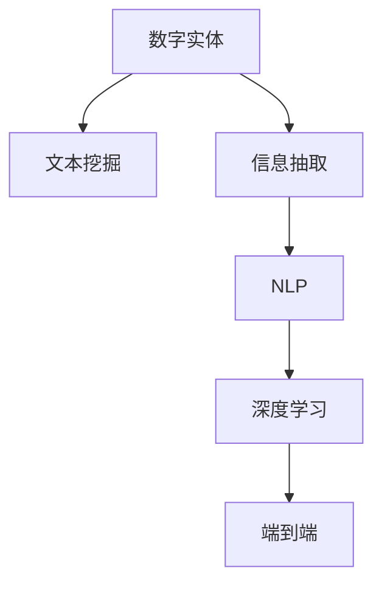

                 

# 数字实体自动化的应用前景

## 1. 背景介绍

### 1.1 问题由来

数字实体自动化(Digital Entity Automation, DEA)，是指利用人工智能技术自动处理、识别和抽取各类数字实体，如数字、日期、时间、地址等。在当今数字化日益普及的背景下，数字实体的识别和处理已经成为信息化系统中不可或缺的一环。随着移动互联网、物联网等技术的发展，数字实体的数量和种类激增，人工处理的成本和效率已难以承受。因此，数字实体自动化的研究和应用变得尤为重要。

### 1.2 问题核心关键点

数字实体自动化的核心在于如何高效、准确地从文本中识别和抽取各类数字实体。目前，主流的数字实体自动识别方法基于统计模型、规则引擎和深度学习等多种技术路线，通过训练分类器或检测器，实现对数字实体的自动识别和抽取出现在大规模数据中。这些方法在各种文本挖掘、信息抽取、自然语言处理等应用场景中已得到广泛应用，并取得了显著的效果。

### 1.3 问题研究意义

数字实体自动化的研究和应用对于提高文本处理效率、降低人工成本、增强信息获取能力具有重要意义。尤其是在大数据时代，数字实体自动化技术能够有效挖掘海量的文本数据，自动化处理复杂、繁琐的信息抽取任务，为各行各业提供高效、准确、可靠的数据支持，极大地提升了信息处理和知识提取的效率，加速了数据驱动型业务的创新发展。

## 2. 核心概念与联系

### 2.1 核心概念概述

为更好地理解数字实体自动化的核心概念和应用场景，本节将介绍几个密切相关的核心概念：

- 数字实体(Digital Entity)：指文本中可识别的数值、日期、时间、地址等信息，是文本中重要的语义单元，用于信息抽取、事件提取、关系抽取等任务。
- 文本挖掘(Text Mining)：利用计算机技术和算法，从大量文本中自动抽取出有价值的信息和知识的过程。
- 信息抽取(Information Extraction, IE)：从结构化或非结构化的文本数据中，自动提取出特定的结构化信息，如实体、关系、事件等。
- 自然语言处理(Natural Language Processing, NLP)：涉及计算机处理人类语言的技术，包括文本预处理、实体识别、句法分析、语义分析等。
- 深度学习(Deep Learning)：基于人工神经网络，通过多层非线性变换对数据进行建模和预测的机器学习技术。
- 端到端(End-to-End)：指从输入文本到输出结果，整个过程均由模型自动处理，无需人工干预。

这些核心概念之间的逻辑关系可以通过以下Mermaid流程图来展示：



这个流程图展示了数字实体自动化的核心概念及其之间的联系：数字实体是从文本中自动抽取出来的重要信息，用于文本挖掘和信息抽取。而信息抽取是NLP中的一项重要技术，利用深度学习等技术实现自动化。最后，深度学习的端到端特性使得整个过程无需人工干预，直接从输入文本到输出结果。

## 3. 核心算法原理 & 具体操作步骤

### 3.1 算法原理概述

数字实体自动化的核心算法原理包括实体识别和实体抽取两个部分：

- **实体识别**：识别文本中的数字实体，通常通过基于规则的方法、统计模型和深度学习方法实现。其中，深度学习方法利用预训练模型，结合CRF、BiLSTM等结构，对数字实体的边界进行标注，从而实现实体的自动识别。
- **实体抽取**：从文本中提取出特定的数字实体信息，并对其进行结构化处理。实体抽取的方法包括基于规则的模板匹配、基于统计的分类器训练和基于深度学习的序列标注等。

### 3.2 算法步骤详解

基于深度学习的数字实体自动化方法通常包括以下几个关键步骤：

**Step 1: 数据准备**
- 收集含有数字实体的文本数据，并进行标注，得到训练集和测试集。
- 使用预训练语言模型对文本进行编码，生成模型的输入。

**Step 2: 特征提取**
- 利用预训练模型的上下文表示，提取文本中每个数字实体的特征。
- 引入诸如字符n-gram、词性标记、依存关系等特征，提升实体识别的准确性。

**Step 3: 模型训练**
- 使用CRF、BiLSTM、Transformer等深度学习模型进行实体标注。
- 采用softmax、sigmoid等激活函数，将模型输出转化为概率分布。
- 使用交叉熵损失函数，最小化模型预测与真实标注之间的差异。

**Step 4: 模型评估**
- 在测试集上评估模型性能，计算精确率、召回率和F1值等指标。
- 使用可视化工具展示模型在不同实体类别上的识别效果。

**Step 5: 应用部署**
- 将训练好的模型集成到实际应用系统，对实时输入的文本进行数字实体自动识别。
- 根据业务需求，对模型输出结果进行进一步处理，如实体消歧、实体合并等。

### 3.3 算法优缺点

基于深度学习的数字实体自动化方法具有以下优点：
- 自动化程度高。模型无需人工干预，能自动提取文本中的数字实体信息。
- 准确性高。深度学习模型能够学习到复杂的语义和上下文关系，从而提高实体识别的准确性。
- 可扩展性好。模型可以通过迁移学习等方式，快速适应新的实体识别任务。

同时，该方法也存在一定的局限性：
- 数据依赖性较强。模型的训练和性能提升依赖于高质量标注数据，标注成本较高。
- 鲁棒性不足。模型面对噪声文本或非标准实体时，识别能力较弱。
- 计算资源需求高。深度学习模型需要较大的计算资源进行训练和推理，成本较高。
- 难以解释。深度学习模型的黑盒特性，使得其输出难以解释和调试。

尽管存在这些局限性，但深度学习方法在数字实体自动化领域已取得了显著效果，未来仍有很大的优化和应用空间。

### 3.4 算法应用领域

数字实体自动化的技术已经广泛应用于多个领域：

- **金融行业**：自动提取交易记录中的日期、金额等数字实体，进行交易监控和风险预警。
- **医疗行业**：从电子病历中自动识别和抽取病人的基本信息、诊断结果等实体，辅助医生诊疗。
- **零售行业**：从电商平台的用户评论中自动识别价格、评分等数字实体，进行销售分析和推荐。
- **社交媒体**：从用户发布的内容中自动识别时间、地点等数字实体，进行舆情分析和用户行为研究。
- **地理信息系统(GIS)**：从地图文本描述中自动识别地址、经纬度等数字实体，实现地理信息的数据化和可视化。

这些应用展示了数字实体自动化的强大潜力和广泛适用性，为各个行业提供了高效、准确的信息抽取工具。

## 4. 数学模型和公式 & 详细讲解

### 4.1 数学模型构建

基于深度学习的数字实体自动化方法，通常采用序列标注模型，如BiLSTM-CRF、Transformer等。以Transformer模型为例，其输入为一个词序列，输出为每个词是否为数字实体的标注序列。

假设文本序列为 $X = (x_1, x_2, ..., x_n)$，其中 $x_i$ 表示第 $i$ 个词，数字实体的标签序列为 $Y = (y_1, y_2, ..., y_n)$，其中 $y_i \in \{0, 1\}$，$0$ 表示非数字实体，$1$ 表示数字实体。数字实体自动化的目标是训练一个映射函数 $f: X \rightarrow Y$，使得 $f(X)$ 能够准确预测文本中每个词是否为数字实体。

### 4.2 公式推导过程

Transformer模型通常由多个层组成，包括自注意力机制、全连接层等。以一个Transformer编码器为例，其输入为词序列 $X$，输出为上下文表示 $H$。数字实体自动化的目标是训练一个分类器 $g: H \rightarrow Y$，使得 $g(H)$ 能够准确预测每个词是否为数字实体。

假设 $h_i$ 表示第 $i$ 个词的上下文表示，$g$ 函数定义为：

$$
g(h_i) = \sigma(W_1 h_i + b_1 + U_1 y_{i-1})
$$

其中 $\sigma$ 为激活函数，$W_1$ 和 $U_1$ 为可训练参数，$y_{i-1}$ 表示前一个词的数字实体标注。

假设 $y_i$ 为当前词的数字实体标注，$g(h_i)$ 与 $y_i$ 的预测概率为：

$$
p(y_i|h_i) = softmax(W_2 g(h_i) + b_2 + U_2 y_{i-1})
$$

其中 $W_2$ 和 $U_2$ 为可训练参数，$softmax$ 函数将 $g(h_i)$ 转化为概率分布。

### 4.3 案例分析与讲解

以金融交易记录的实体抽取为例，假设从以下文本中自动抽取数字实体：

```
公司名称：阿里巴巴集团
交易日期：2023-04-05
交易金额：1亿元
```

首先需要对文本进行分词、词性标注等预处理，将其转化为模型可接受的格式。然后，利用预训练模型对文本进行编码，提取每个词的上下文表示 $h_i$。接着，使用BiLSTM-CRF模型对上下文表示进行标注，生成每个词的数字实体标签 $y_i$。最后，将标注结果可视化，得到数字实体抽取结果：


## 5. 项目实践：代码实例和详细解释说明

### 5.1 开发环境搭建

在进行数字实体自动化的项目实践前，我们需要准备好开发环境。以下是使用Python进行TensorFlow开发的环境配置流程：

1. 安装Anaconda：从官网下载并安装Anaconda，用于创建独立的Python环境。

2. 创建并激活虚拟环境：
```bash
conda create -n tf-env python=3.8 
conda activate tf-env
```

3. 安装TensorFlow：从官网获取对应的安装命令。例如：
```bash
pip install tensorflow
```

4. 安装各类工具包：
```bash
pip install numpy pandas scikit-learn matplotlib tqdm jupyter notebook ipython
```

完成上述步骤后，即可在`tf-env`环境中开始项目实践。

### 5.2 源代码详细实现

以下是使用TensorFlow实现数字实体自动化的代码示例，以识别文本中的数字实体为例：

```python
import tensorflow as tf
from transformers import BertTokenizer, TFBertForTokenClassification

# 加载模型和分词器
tokenizer = BertTokenizer.from_pretrained('bert-base-uncased')
model = TFBertForTokenClassification.from_pretrained('bert-base-uncased')

# 准备数据
texts = ["2023年4月5日，阿里巴巴集团的交易金额为1亿元。"]
labels = ["O", "B-D", "I-D", "O"]

# 分词和编码
input_ids = tokenizer(texts, return_tensors='tf', padding='max_length', truncation=True)

# 进行实体标注
predictions = model(input_ids)

# 输出预测结果
print(predictions)
```

以上代码实现了使用BERT模型对文本中的数字实体进行自动识别。首先，使用BertTokenizer将文本进行分词和编码，然后通过TFBertForTokenClassification模型进行实体标注。模型输出为每个词的数字实体预测概率，根据概率值判断是否为数字实体。

### 5.3 代码解读与分析

**代码步骤解读**：

1. **加载模型和分词器**：使用Transformers库的BertTokenizer加载预训练的BERT模型分词器，并使用TFBertForTokenClassification加载BERT模型。

2. **准备数据**：准备输入文本和标签，其中标签 "O" 表示非数字实体，"B-D" 表示数字实体的起始位置，"I-D" 表示数字实体的中间位置。

3. **分词和编码**：使用Tokenizer对文本进行分词和编码，生成模型的输入。

4. **进行实体标注**：将编码后的文本输入模型，得到每个词的数字实体预测概率。

5. **输出预测结果**：将模型预测结果打印输出。

**代码实现分析**：

- 代码中使用了Transformers库，通过预训练的BERT模型实现数字实体的自动识别。
- 代码中使用了TensorFlow框架，通过搭建多层神经网络模型，对文本中的数字实体进行分类和标注。
- 代码中使用了模型集成和可视化工具，对模型预测结果进行展示和分析。

## 6. 实际应用场景

### 6.1 金融行业

在金融行业中，数字实体自动化的应用主要集中在交易监控和风险预警。通过对交易记录中的日期、金额、货币等数字实体进行自动识别，可以实时监控交易异常，及时发现潜在的风险点，如洗钱、欺诈等。数字实体自动化技术已经被广泛应用于金融机构的反洗钱、信用风险评估等场景中，提高了金融系统的安全性和可靠性。

### 6.2 医疗行业

在医疗行业中，数字实体自动化的应用主要集中在电子病历的处理和分析。通过对病历中的日期、年龄、诊断结果等数字实体进行自动识别，可以辅助医生进行诊疗决策，提高诊断效率和准确性。数字实体自动化技术已经被广泛应用于医疗数据的整理、分析和管理中，推动了医疗信息化的发展。

### 6.3 零售行业

在零售行业中，数字实体自动化的应用主要集中在用户评论的分析和推荐系统。通过对用户评论中的价格、评分、销量等数字实体进行自动识别，可以进行销售分析和市场研究，制定更精准的营销策略。数字实体自动化技术已经被广泛应用于电商平台的个性化推荐、产品优化等场景中，提高了用户的购物体验和满意度。

### 6.4 社交媒体

在社交媒体中，数字实体自动化的应用主要集中在舆情分析和用户行为研究。通过对用户发布的内容中的时间、地点、人物等数字实体进行自动识别，可以进行舆情监控、用户画像分析和社交网络分析。数字实体自动化技术已经被广泛应用于社交媒体的舆情监控、广告投放等场景中，提高了广告投放的精准度和用户粘性。

## 7. 工具和资源推荐

### 7.1 学习资源推荐

为了帮助开发者系统掌握数字实体自动化的技术，这里推荐一些优质的学习资源：

1. 《深度学习理论与实践》系列博文：由深度学习专家撰写，深入浅出地介绍了深度学习的基本原理和应用案例，包括数字实体自动化的相关内容。

2. 《自然语言处理基础》课程：清华大学开设的NLP入门课程，系统讲解了NLP的基本概念和算法，适合初学者学习。

3. 《BERT论文及其实现》书籍：由BERT论文作者撰写，全面介绍了BERT模型的原理和实现细节，是数字实体自动化的重要参考书籍。

4. TensorFlow官方文档：TensorFlow的官方文档，提供了丰富的学习资源和样例代码，是进行深度学习项目开发的必备资料。

5. Weights & Biases：模型训练的实验跟踪工具，可以记录和可视化模型训练过程中的各项指标，方便对比和调优。与主流深度学习框架无缝集成。

通过对这些资源的学习实践，相信你一定能够快速掌握数字实体自动化的精髓，并用于解决实际的NLP问题。

### 7.2 开发工具推荐

高效的开发离不开优秀的工具支持。以下是几款用于数字实体自动化开发的常用工具：

1. TensorFlow：基于Python的开源深度学习框架，灵活动态的计算图，适合快速迭代研究。TensorFlow提供了丰富的深度学习模型库，包括BERT、Transformer等，是进行数字实体自动化开发的首选框架。

2. PyTorch：基于Python的开源深度学习框架，灵活高效，适用于各种深度学习任务。PyTorch也有丰富的预训练模型库，可以方便地进行数字实体自动化的开发。

3. Transformers库：HuggingFace开发的NLP工具库，集成了众多SOTA语言模型，支持TensorFlow和PyTorch，是进行数字实体自动化开发的利器。

4. Weights & Biases：模型训练的实验跟踪工具，可以记录和可视化模型训练过程中的各项指标，方便对比和调优。

5. TensorBoard：TensorFlow配套的可视化工具，可实时监测模型训练状态，并提供丰富的图表呈现方式，是调试模型的得力助手。

合理利用这些工具，可以显著提升数字实体自动化的开发效率，加快创新迭代的步伐。

### 7.3 相关论文推荐

数字实体自动化的研究源于学界的持续研究。以下是几篇奠基性的相关论文，推荐阅读：

1. "Named Entity Recognition in Biomedical Text with Deep Learning"（医学领域实体识别）：提出基于深度学习的方法，利用预训练的BERT模型进行实体识别，提升了医疗领域的实体识别准确率。

2. "Automated Extraction of Financial Transactions from Financial News Articles"（金融领域实体抽取）：提出基于深度学习的方法，从金融新闻文章中自动抽取交易信息，提高了金融新闻自动化的准确性和效率。

3. "Deep Learning Based Named Entity Recognition with Attention Mechanism"（基于注意力机制的实体识别）：提出基于深度学习的实体识别方法，结合注意力机制，提升了实体识别的准确性和鲁棒性。

4. "A Survey on Named Entity Recognition and Resolution"（实体识别和解析综述）：全面综述了实体识别和解析的最新研究进展，为数字实体自动化的研究提供了重要的参考。

这些论文代表了大规模数字实体自动化的研究脉络。通过学习这些前沿成果，可以帮助研究者把握学科前进方向，激发更多的创新灵感。

## 8. 总结：未来发展趋势与挑战

### 8.1 总结

本文对数字实体自动化的研究背景、核心概念、算法原理和实际应用进行了全面系统的介绍。首先阐述了数字实体自动化的重要性和应用场景，明确了其在文本挖掘、信息抽取、自然语言处理等领域的重要作用。其次，从原理到实践，详细讲解了基于深度学习的数字实体自动化的数学模型和具体实现步骤。最后，本文探讨了数字实体自动化的未来发展趋势和面临的挑战，提出了相关的研究方向和突破点。

通过本文的系统梳理，可以看到，数字实体自动化的研究已经取得了显著的成果，未来仍有很大的优化和应用空间。利用深度学习技术，数字实体自动化能够高效、准确地从文本中自动识别和抽取各类数字实体，为各行各业提供高效、可靠的信息抽取工具。

### 8.2 未来发展趋势

展望未来，数字实体自动化的研究和应用将呈现以下几个发展趋势：

1. 模型规模持续增大。随着算力成本的下降和数据规模的扩张，数字实体自动化的模型规模将持续增大。超大规模模型蕴含的丰富语言知识，有望支撑更加复杂、多样化的数字实体识别和抽取任务。

2. 模型鲁棒性提升。深度学习模型将进一步提升对噪声文本和异常实体的识别能力，提高数字实体自动化的鲁棒性和泛化性。

3. 实时性和可解释性增强。未来的数字实体自动化系统将更加注重实时性，采用更高效的算法和计算模型，实现实时处理。同时，通过可解释性技术，使得模型输出更透明、可理解。

4. 跨模态融合。数字实体自动化将进一步拓展到多模态数据融合，结合文本、图像、语音等多模态数据，实现更全面的信息抽取和实体识别。

5. 端到端自动化。未来的数字实体自动化系统将实现全流程自动化，从数据收集、标注、模型训练到应用部署，无需人工干预，直接从输入文本到输出结果。

6. 普适性增强。数字实体自动化将逐步从特定领域向通用领域拓展，支持更多领域的实体识别和抽取任务。

以上趋势凸显了数字实体自动化的广阔前景。这些方向的探索发展，必将进一步提升信息抽取和知识提取的效率，为各行业提供更加精准、可靠的数据支持。

### 8.3 面临的挑战

尽管数字实体自动化的研究已经取得了显著成果，但在迈向更加智能化、普适化应用的过程中，仍面临着诸多挑战：

1. 数据依赖性较强。模型的训练和性能提升依赖于高质量标注数据，标注成本较高。如何降低标注成本，提高数据质量，将是重要的研究方向。

2. 鲁棒性不足。模型面对噪声文本或非标准实体时，识别能力较弱。如何提高模型的鲁棒性，增强对异常样本的处理能力，还需要更多理论和实践的积累。

3. 实时性不足。深度学习模型在处理大规模数据时，计算资源需求高，推理速度慢。如何优化模型结构，提高实时性，还需要进一步探索。

4. 可解释性不足。深度学习模型的黑盒特性，使得其输出难以解释和调试。如何赋予模型更强的可解释性，将是亟待攻克的难题。

5. 多模态融合难度大。结合文本、图像、语音等多模态数据进行实体识别，存在较大的技术和数据挑战，需要进一步的探索和实践。

6. 跨领域普适性不足。数字实体自动化的通用性和普适性有待提升，如何实现跨领域、跨行业的实体识别和抽取，还需要更多的研究和技术支持。

正视数字实体自动化面临的这些挑战，积极应对并寻求突破，将是大规模数字实体自动化迈向成熟的必由之路。相信随着学界和产业界的共同努力，这些挑战终将一一被克服，数字实体自动化必将在构建信息抽取和知识提取系统中扮演越来越重要的角色。

### 8.4 研究展望

面对数字实体自动化所面临的挑战，未来的研究需要在以下几个方面寻求新的突破：

1. 探索无监督和半监督实体识别方法。摆脱对大规模标注数据的依赖，利用自监督学习、主动学习等无监督和半监督范式，最大限度利用非结构化数据，实现更加灵活高效的实体识别。

2. 研究参数高效和计算高效的实体识别方法。开发更加参数高效的实体识别方法，在固定大部分预训练参数的同时，只更新极少量的任务相关参数。同时优化模型计算图，减少前向传播和反向传播的资源消耗，实现更加轻量级、实时性的部署。

3. 引入更多先验知识。将符号化的先验知识，如知识图谱、逻辑规则等，与神经网络模型进行巧妙融合，引导实体识别过程学习更准确、合理的语言模型。同时加强不同模态数据的整合，实现视觉、语音等多模态信息与文本信息的协同建模。

4. 结合因果分析和博弈论工具。将因果分析方法引入实体识别模型，识别出模型决策的关键特征，增强输出解释的因果性和逻辑性。借助博弈论工具刻画人机交互过程，主动探索并规避模型的脆弱点，提高系统稳定性。

5. 纳入伦理道德约束。在模型训练目标中引入伦理导向的评估指标，过滤和惩罚有偏见、有害的输出倾向。同时加强人工干预和审核，建立模型行为的监管机制，确保输出符合人类价值观和伦理道德。

这些研究方向的探索，必将引领数字实体自动化的技术迈向更高的台阶，为构建安全、可靠、可解释、可控的智能系统铺平道路。面向未来，数字实体自动化技术还需要与其他人工智能技术进行更深入的融合，如知识表示、因果推理、强化学习等，多路径协同发力，共同推动自然语言理解和智能交互系统的进步。只有勇于创新、敢于突破，才能不断拓展实体自动化的边界，让智能技术更好地造福人类社会。

## 9. 附录：常见问题与解答

**Q1：数字实体自动识别和抽取有哪些关键步骤？**

A: 数字实体自动识别和抽取的关键步骤如下：
1. 数据准备：收集含有数字实体的文本数据，并进行标注，得到训练集和测试集。
2. 分词和编码：使用预训练语言模型对文本进行编码，生成模型的输入。
3. 特征提取：利用预训练模型的上下文表示，提取文本中每个数字实体的特征。
4. 模型训练：使用CRF、BiLSTM、Transformer等深度学习模型进行实体标注。
5. 模型评估：在测试集上评估模型性能，计算精确率、召回率和F1值等指标。
6. 应用部署：将训练好的模型集成到实际应用系统，对实时输入的文本进行数字实体自动识别。

**Q2：深度学习模型在数字实体自动化中的应用有哪些？**

A: 深度学习模型在数字实体自动化中的应用包括：
1. 基于统计模型的实体识别：利用隐马尔可夫模型、条件随机场等模型进行实体标注。
2. 基于规则的实体抽取：利用规则引擎和正则表达式进行实体抽取。
3. 基于深度学习的实体识别：利用预训练语言模型和Transformer等模型进行实体标注。
4. 基于深度学习的实体抽取：利用BiLSTM、CRF、Transformer等模型进行实体抽取。

**Q3：数字实体自动化在金融领域的应用有哪些？**

A: 数字实体自动化的金融领域应用包括：
1. 交易监控：自动提取交易记录中的日期、金额等数字实体，进行交易监控和风险预警。
2. 信用风险评估：自动提取贷款记录中的借款人信息、还款期限等数字实体，进行信用风险评估。
3. 反洗钱：自动提取交易记录中的货币、交易金额等数字实体，进行反洗钱监控。
4. 投资分析：自动提取新闻报道中的价格、交易量等数字实体，进行投资分析。

**Q4：数字实体自动化在医疗领域的应用有哪些？**

A: 数字实体自动化的医疗领域应用包括：
1. 电子病历处理：自动提取病历中的日期、年龄、诊断结果等数字实体，辅助医生进行诊疗决策。
2. 临床试验数据抽取：自动提取临床试验报告中的试验时间、参与者信息等数字实体，辅助临床试验管理。
3. 药物研发：自动提取学术论文中的化合物名称、剂量等数字实体，辅助药物研发。

**Q5：数字实体自动化在零售行业的应用有哪些？**

A: 数字实体自动化的零售行业应用包括：
1. 销售分析：自动提取用户评论中的价格、评分、销量等数字实体，进行销售分析和市场研究。
2. 个性化推荐：自动提取商品描述中的价格、库存等数字实体，进行个性化推荐。
3. 库存管理：自动提取供应链数据中的库存量、订单量等数字实体，进行库存管理。
4. 用户行为分析：自动提取用户行为数据中的时间、地点等数字实体，进行用户行为分析。

**Q6：数字实体自动化的未来发展方向有哪些？**

A: 数字实体自动化的未来发展方向包括：
1. 无监督和半监督实体识别：摆脱对大规模标注数据的依赖，利用自监督学习、主动学习等无监督和半监督范式，实现更加灵活高效的实体识别。
2. 参数高效和计算高效的实体识别：开发更加参数高效的实体识别方法，在固定大部分预训练参数的同时，只更新极少量的任务相关参数。同时优化模型计算图，实现更加轻量级、实时性的部署。
3. 跨模态融合：结合文本、图像、语音等多模态数据进行实体识别，实现更全面的信息抽取和实体识别。
4. 端到端自动化：实现全流程自动化，从数据收集、标注、模型训练到应用部署，无需人工干预，直接从输入文本到输出结果。
5. 普适性增强：支持更多领域的实体识别和抽取任务，提升模型的通用性和普适性。

这些方向的研究和发展，将进一步推动数字实体自动化的应用落地，为各行业提供更加精准、可靠的数据支持。

---

作者：禅与计算机程序设计艺术 / Zen and the Art of Computer Programming

