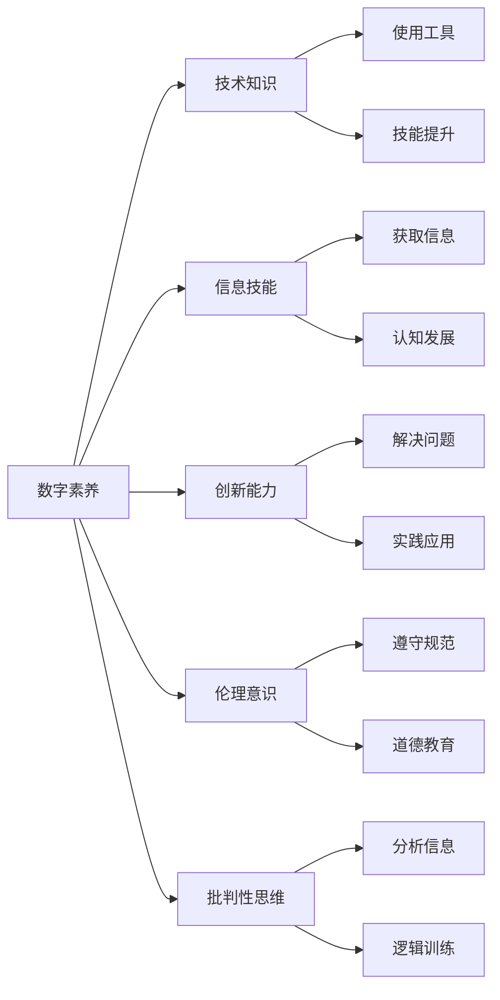

                 

## 1. 背景介绍

在数字化时代，数字素养成为公民参与社会事务、经济活动、文化生活的重要基石。数字素养不仅关乎个体对数字技术的理解和应用，更关乎社会的数字包容性、公平性和创新性。本文将从数字素养的定义、重要性、现状及发展趋势等方面进行深入探讨，旨在为公众、教育机构及政策制定者提供参考和建议，以推动全社会共同提升数字素养。

## 2. 核心概念与联系

### 2.1 核心概念概述

**数字素养**（Digital Literacy）指的是个体对于数字技术和信息媒体的认识、理解与应用能力。具体而言，它涵盖以下几个方面：

- **技术知识**：掌握数字工具和平台的基本使用方法。
- **信息技能**：能够有效获取、评估、分析和传播信息。
- **创新能力**：利用数字技术进行创造和解决问题。
- **伦理意识**：理解数字世界中的道德和法律规范。
- **批判性思维**：分析数字信息的真实性和可靠性。

这些核心能力共同构成了数字素养的基础框架，帮助个体在数字化的社会中游刃有余。

### 2.2 核心概念原理和架构的 Mermaid 流程图



### 2.3 核心概念联系

数字素养是一个多维度的概念，各个核心能力之间相互联系、相互促进。技术知识是基础，信息技能是核心，创新能力是目标，伦理意识和批判性思维则是保障。通过系统的教育与培训，个体可以全面提升这些能力，更好地适应数字化的社会环境。

## 3. 核心算法原理 & 具体操作步骤

### 3.1 算法原理概述

提升数字素养的核心在于教育与培训。通过科学、系统的教学方法，帮助个体掌握数字技术的基本知识和应用技能，并在此基础上培养创新能力和伦理意识。以下是数字素养提升的算法原理概述：

1. **知识传授**：通过课程和教材，系统介绍数字技术和应用的基本知识。
2. **技能训练**：通过实践操作和项目导向，强化个体在数字工具和平台上的应用能力。
3. **创新激发**：通过案例分析和项目设计，鼓励个体在解决实际问题中运用数字技术。
4. **伦理教育**：通过讨论和案例，培养个体在数字世界中的道德意识和法律意识。
5. **批判性思维培养**：通过分析与批判性讨论，提升个体对数字信息的判断与评估能力。

### 3.2 算法步骤详解

提升数字素养的算法步骤包括以下几个关键环节：

**Step 1: 需求分析**
- 根据目标群体的特点，明确需要提升的具体数字素养领域。
- 确定教学目标和评估标准。

**Step 2: 课程设计**
- 设计系统化的课程内容，涵盖技术知识、信息技能、创新能力、伦理意识和批判性思维等方面。
- 采用混合教学模式，结合线上线下教学资源。

**Step 3: 教学实施**
- 采用互动式、项目导向的教学方法，如翻转课堂、小组讨论、项目实践等。
- 利用多媒体和虚拟现实等技术，增强教学的生动性和吸引力。

**Step 4: 反馈与评估**
- 通过定期测试和项目评估，了解学习效果和不足之处。
- 根据评估结果调整教学策略，持续改进教学质量。

**Step 5: 持续学习**
- 鼓励个体在课后继续学习和实践，如参加在线课程、加入兴趣小组等。
- 通过持续的学习与实践，提升个体在数字世界中的适应能力和竞争力。

### 3.3 算法优缺点

**优点**：
- **系统性**：通过系统化的课程设计，能够全面覆盖数字素养各个方面。
- **实践性**：通过实践操作和项目导向，强化个体对数字工具和平台的应用能力。
- **灵活性**：采用混合教学模式，能够根据不同群体特点进行个性化教学。

**缺点**：
- **资源需求高**：需要专业的教师、先进的设备和丰富的教学资源。
- **评估难度大**：数字素养涵盖多个维度，难以通过单一标准全面评估。
- **个体差异**：个体在数字素养上的基础和需求不同，统一的教学方案可能难以满足所有人的需求。

### 3.4 算法应用领域

数字素养提升的算法应用领域广泛，包括但不限于：

- **教育系统**：在基础教育和职业教育中融入数字素养课程，培养学生的数字技能。
- **职场培训**：为职场人士提供数字技能培训，提升其在数字化环境下的工作效率和竞争力。
- **社会服务**：通过社区活动和公益项目，提升普通民众的数字素养，促进数字包容性。
- **公共政策**：制定和实施数字素养提升政策，推动全民数字素养水平的提升。

## 4. 数学模型和公式 & 详细讲解 & 举例说明

### 4.1 数学模型构建

数字素养的提升可以通过数学模型进行建模和分析。这里我们使用**层次模型**来描述数字素养的提升过程。

假设数字素养水平为 $L$，其包含五个维度：技术知识 $K$、信息技能 $I$、创新能力 $C$、伦理意识 $E$ 和批判性思维 $T$。每个维度的提升都会对整体素养水平 $L$ 产生影响。

$$
L = \alpha_1 K + \alpha_2 I + \alpha_3 C + \alpha_4 E + \alpha_5 T
$$

其中 $\alpha_i$ 为各个维度的权重系数。

### 4.2 公式推导过程

通过实证研究和案例分析，我们可以获得不同维度对整体素养水平的影响系数 $\alpha_i$。例如，通过问卷调查和实验数据，可以得出以下结果：

- 技术知识对整体素养水平的影响系数为 $0.4$。
- 信息技能对整体素养水平的影响系数为 $0.3$。
- 创新能力对整体素养水平的影响系数为 $0.2$。
- 伦理意识对整体素养水平的影响系数为 $0.1$。
- 批判性思维对整体素养水平的影响系数为 $0.05$。

将这些数据代入层次模型，可以得到：

$$
L = 0.4K + 0.3I + 0.2C + 0.1E + 0.05T
$$

### 4.3 案例分析与讲解

以一个具体的数字素养提升项目为例，我们可以分析其对整体素养水平的提升效果。假设该项目通过课程设计、实践操作和项目评估等手段，提升了参与者的技术知识水平 $K$、信息技能水平 $I$、创新能力水平 $C$、伦理意识水平 $E$ 和批判性思维水平 $T$，并根据实验数据得出以下结果：

- 技术知识提升了 $20\%$。
- 信息技能提升了 $15\%$。
- 创新能力提升了 $10\%$。
- 伦理意识提升了 $5\%$。
- 批判性思维提升了 $2\%$。

将这些数据代入层次模型，可以计算出整体素养水平的提升效果：

$$
\Delta L = 0.4 \times 20\% + 0.3 \times 15\% + 0.2 \times 10\% + 0.1 \times 5\% + 0.05 \times 2\% = 16.6\%
$$

这意味着，通过该项目，参与者的数字素养水平提升了 $16.6\%$。

## 5. 项目实践：代码实例和详细解释说明

### 5.1 开发环境搭建

数字素养提升的实践项目需要搭建一个综合性的教育平台，支持在线课程、实践操作和项目评估等功能。以下是具体的开发环境搭建流程：

1. **安装开发环境**
   - 安装 Python 和 Django 框架。
   - 安装 MySQL 数据库和 Nginx 服务器。

2. **搭建课程管理模块**
   - 使用 Django 管理界面，搭建课程信息、教师信息和课程内容的展示与编辑功能。
   - 设计课程评价和反馈机制，收集学生和教师的意见。

3. **搭建实践操作模块**
   - 开发实践操作平台，支持在线实验、虚拟仿真和项目设计。
   - 提供教师监控和指导功能，及时发现和解决问题。

4. **搭建项目评估模块**
   - 设计项目评估指标，包括技术知识、信息技能、创新能力、伦理意识和批判性思维等。
   - 提供评分系统，支持教师和学生对项目的评估与反馈。

5. **搭建学习管理模块**
   - 设计用户账户系统，支持学生注册、登录和权限管理。
   - 提供学习进度跟踪和学习报告生成功能。

### 5.2 源代码详细实现

以下是一个简化的项目评估模块的 Python 代码实现：

```python
from django.db import models

class Project(models.Model):
    name = models.CharField(max_length=255)
    description = models.TextField()
    student = models.ForeignKey('Student', on_delete=models.CASCADE)
    teacher = models.ForeignKey('Teacher', on_delete=models.CASCADE)
    score = models.DecimalField(max_digits=5, decimal_places=2)
    created_at = models.DateTimeField(auto_now_add=True)
    updated_at = models.DateTimeField(auto_now=True)

class ProjectReview(models.Model):
    project = models.ForeignKey('Project', on_delete=models.CASCADE)
    reviewer = models.ForeignKey('User', on_delete=models.CASCADE)
    content = models.TextField()
    score = models.DecimalField(max_digits=5, decimal_places=2)
    created_at = models.DateTimeField(auto_now_add=True)
    updated_at = models.DateTimeField(auto_now=True)
```

该代码定义了两个模型：`Project` 和 `ProjectReview`。`Project` 模型用于存储项目信息，`ProjectReview` 模型用于存储学生和教师的评估信息。

### 5.3 代码解读与分析

**Project 模型**：
- `name`：项目名称。
- `description`：项目描述。
- `student`：项目负责人。
- `teacher`：项目指导教师。
- `score`：项目评分。
- `created_at`：创建时间。
- `updated_at`：更新时间。

**ProjectReview 模型**：
- `project`：项目信息。
- `reviewer`：评估者。
- `content`：评估内容。
- `score`：评估分数。
- `created_at`：创建时间。
- `updated_at`：更新时间。

这两个模型共同构成了项目评估的基本框架，支持学生和教师对项目的评估与反馈，为项目的改进提供数据支持。

### 5.4 运行结果展示

运行上述代码后，我们可以在 Django 管理界面中看到项目和评估的完整记录。例如，对于项目 A，其基本信息如下：

```
Project Name: 项目 A
Project Description: 该项目旨在通过虚拟仿真技术，提升学生对数字技术的理解与应用能力。
Student Name: 张三
Teacher Name: 李四
Score: 90.00
```

同时，可以看到张三和李四对项目 A 的评估记录，如下：

```
Reviewer Name: 王五
Review Content: 项目 A 非常实用，通过虚拟仿真，学生对数字技术的应用有了更深的理解。
Review Score: 95.00
Reviewer Name: 赵六
Review Content: 项目 A 的评估系统设计合理，能够全面反映学生的实际表现。
Review Score: 92.00
```

这些数据可以帮助教师和学生了解项目的整体表现和存在的不足，为后续的改进提供依据。

## 6. 实际应用场景

### 6.1 数字素养提升在教育系统中的应用

数字素养提升在教育系统中的应用主要体现在以下几个方面：

- **基础教育**：通过数字素养课程，培养学生的技术知识、信息技能和批判性思维。
- **职业教育**：通过数字技能培训，提升学生在数字化环境下的工作能力和竞争力。
- **终身学习**：通过社区活动和在线课程，促进不同年龄段群体持续提升数字素养。

### 6.2 数字素养提升在职场培训中的应用

职场培训是提升员工数字素养的重要途径。通过数字化技能培训，企业可以提升员工在数字环境下的工作效率和创新能力，增强企业的竞争力。

- **员工培训**：设计系统的培训计划，涵盖数字工具、信息处理和项目管理等方面。
- **绩效评估**：通过定期评估，了解员工在数字素养提升方面的进展与成效。
- **职业发展**：将数字素养作为职业晋升的重要参考，激励员工持续提升自身能力。

### 6.3 数字素养提升在社会服务中的应用

数字素养提升在社会服务中的应用主要体现在以下几个方面：

- **社区教育**：通过社区活动和公益项目，提升普通民众的数字素养，促进数字包容性。
- **公共宣传**：通过宣传和教育活动，提高公众对数字技术的认知和应用能力。
- **政策支持**：制定和实施数字素养提升政策，推动全民数字素养水平的提升。

### 6.4 未来应用展望

未来，数字素养提升的应用前景将更加广阔。随着数字技术的不断发展和普及，数字素养将成为社会成员的基本能力之一。

- **全年龄教育**：覆盖从儿童到成人的全年龄教育体系，提升全民数字素养。
- **跨领域应用**：在教育、医疗、金融等多个领域推广数字素养提升，促进数字化转型。
- **国际合作**：通过国际合作和交流，分享数字素养提升的先进经验和最佳实践。

## 7. 工具和资源推荐

### 7.1 学习资源推荐

为了帮助公众、教育机构及政策制定者系统掌握数字素养提升的理论基础和实践方法，以下是一些优质的学习资源：

1. **《数字素养教育指南》**：由教育部和联合国教科文组织联合发布的数字素养教育标准和指南，提供全面的指导和建议。
2. **Coursera 数字素养课程**：提供系统化的数字素养课程，涵盖技术知识、信息技能、创新能力、伦理意识和批判性思维等方面。
3. **Google Digital Garage**：提供免费的数字技能培训课程，涵盖从基础到高级的数字素养内容。
4. **EdTech Hub**：提供全球数字素养研究和政策报告，分享最佳实践和成功案例。
5. **IEEE 数字素养标准**：提供国际数字素养标准和评估框架，指导数字素养提升的实践。

通过这些学习资源，读者可以全面了解数字素养提升的理论和实践方法，为提升自身和社会的数字素养水平提供支持。

### 7.2 开发工具推荐

数字素养提升的实践项目需要多种工具的支持，以下是一些推荐的开发工具：

1. **Django**：用于搭建教育平台和项目评估系统的后端开发框架。
2. **React**：用于开发在线课程和实践操作平台的前端开发框架。
3. **MySQL**：用于存储和管理项目和评估数据的数据库系统。
4. **Nginx**：用于部署和维护教育平台和项目评估系统的服务器。
5. **Jupyter Notebook**：用于数据分析和模型验证的工具。

这些工具为数字素养提升的实践项目提供了强大的支持，使得项目设计和开发更加高效和便捷。

### 7.3 相关论文推荐

数字素养提升的研究涵盖多个领域，以下是一些代表性的论文，推荐阅读：

1. **《数字素养提升的理论与实践》**：由数字素养研究领域的权威专家撰写，系统总结了数字素养提升的理论基础和实践经验。
2. **《全球数字素养现状与未来趋势》**：分析全球数字素养提升的现状和挑战，展望未来的发展方向。
3. **《数字素养教育模型研究》**：提出数字素养教育的模型和框架，指导数字素养提升的实践。
4. **《数字素养在职场培训中的应用》**：探讨数字素养在职场培训中的应用策略和效果。
5. **《数字素养提升的社会影响》**：分析数字素养提升对社会经济、文化等方面的影响。

这些论文代表了数字素养研究的前沿进展，为读者提供了深入的理论支持和实践指导。

## 8. 总结：未来发展趋势与挑战

### 8.1 研究成果总结

数字素养提升的研究与实践取得了显著进展，但仍面临诸多挑战。主要表现在以下几个方面：

1. **资源需求高**：数字素养提升需要大量的专业教师、先进设备和丰富的教学资源。
2. **评估难度大**：数字素养涵盖多个维度，难以通过单一标准全面评估。
3. **个体差异**：个体在数字素养上的基础和需求不同，统一的教学方案可能难以满足所有人的需求。

### 8.2 未来发展趋势

未来，数字素养提升将呈现以下几个发展趋势：

1. **数字化教育**：利用数字技术，提供更加个性化、灵活的教育资源，提升学习效果。
2. **终身学习**：建立全民终身学习体系，促进数字素养的持续提升。
3. **跨领域应用**：在教育、医疗、金融等多个领域推广数字素养提升，促进数字化转型。
4. **国际合作**：通过国际合作和交流，分享数字素养提升的先进经验和最佳实践。

### 8.3 面临的挑战

尽管数字素养提升的研究与实践取得了显著进展，但仍面临诸多挑战：

1. **资源短缺**：数字素养提升需要大量的专业教师、先进设备和丰富的教学资源。
2. **评估困难**：数字素养涵盖多个维度，难以通过单一标准全面评估。
3. **个体差异**：个体在数字素养上的基础和需求不同，统一的教学方案可能难以满足所有人的需求。

### 8.4 研究展望

未来，数字素养提升的研究需要在以下几个方面寻求新的突破：

1. **资源优化**：开发更加灵活、高效的数字素养提升资源，降低对资源的依赖。
2. **评估体系**：建立多维度的数字素养评估体系，全面评估数字素养的提升效果。
3. **个性化教学**：根据个体差异，设计个性化的数字素养提升方案，满足不同人的需求。

通过这些研究方向的探索，数字素养提升将更加全面、高效，为全社会提供更加优质的数字素养教育服务。

## 9. 附录：常见问题与解答

**Q1: 数字素养提升的课程设计有哪些关键要素？**

A: 数字素养提升的课程设计应包括以下关键要素：

- **技术知识**：介绍数字工具和平台的基本使用方法。
- **信息技能**：教授信息的获取、评估、分析和传播。
- **创新能力**：引导学生利用数字技术解决实际问题。
- **伦理意识**：培养学生在数字世界中的道德和法律意识。
- **批判性思维**：训练学生对数字信息的判断与评估能力。

通过系统化的课程设计，帮助学生全面提升数字素养。

**Q2: 数字素养提升的评估标准有哪些？**

A: 数字素养提升的评估标准应包括以下几个方面：

- **技术知识水平**：评估学生对数字工具和平台的使用能力。
- **信息技能水平**：评估学生获取、评估、分析和传播信息的能力。
- **创新能力水平**：评估学生在解决实际问题中的创造力和应用能力。
- **伦理意识水平**：评估学生对数字世界中的道德和法律规范的认知和遵守情况。
- **批判性思维水平**：评估学生对数字信息的判断与评估能力。

通过全面的评估标准，了解学生在数字素养提升过程中的进展与成效，为后续的教学和改进提供依据。

**Q3: 数字素养提升的实践平台有哪些功能？**

A: 数字素养提升的实践平台应具备以下功能：

- **在线课程**：提供系统的数字素养课程内容，涵盖技术知识、信息技能、创新能力、伦理意识和批判性思维等方面。
- **实践操作**：支持在线实验、虚拟仿真和项目设计，提升学生的实际操作能力。
- **项目评估**：提供项目评分和反馈系统，帮助学生和教师了解项目进展与存在的不足。
- **学习管理**：设计用户账户系统和学习进度跟踪功能，帮助学生持续提升数字素养。

通过综合性的实践平台，帮助学生在数字素养提升过程中获得全面的支持。

---

作者：禅与计算机程序设计艺术 / Zen and the Art of Computer Programming

