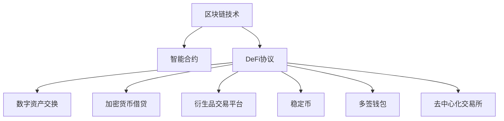

                 

# 数字资产银行创业：加密货币的金融服务

## 1. 背景介绍

### 1.1 问题由来

随着区块链技术的不断成熟和普及，数字资产（加密货币）逐渐从边缘化的投资工具演变为一个具有巨大潜力的新兴金融市场。这一领域迎来了前所未有的创新和机遇，也吸引了许多创业者和投资者的关注。尤其是在DeFi（去中心化金融）的浪潮推动下，数字资产的金融服务应用层出不穷，包括去中心化借贷、抵押借贷、稳定币、衍生品交易等。

数字资产银行作为专注于数字货币交易和管理的金融机构，为数字资产持有者提供全方位、专业的金融服务。这类创业项目通过利用区块链和智能合约技术，为数字资产用户提供安全、便捷、高效的金融解决方案。本文将深入探讨数字资产银行创业的核心概念、关键技术，以及未来的发展趋势和挑战。

### 1.2 问题核心关键点

1. **区块链技术**：是数字资产银行的核心底层技术，确保资产的安全性和不可篡改性。
2. **智能合约**：用于自动化执行交易和金融逻辑，减少中间环节，提高效率。
3. **去中心化金融（DeFi）**：基于区块链的金融服务模式，摒弃传统金融机构的中心化管理。
4. **数字钱包**：数字资产的存储和交易管理工具，保护用户的资产安全。
5. **加密货币借贷**：利用区块链去中心化机制，实现点对点的借贷服务。
6. **衍生品交易**：包括期货、期权等金融衍生品，为市场提供风险管理和套利机会。
7. **稳定币**：通过算法或机制稳定币值，降低数字货币的波动性，提高使用价值。

这些关键概念构成了数字资产银行创业的基础，也是本文讨论的重点。

## 2. 核心概念与联系

### 2.1 核心概念概述

为了更清晰地理解数字资产银行创业的技术框架和应用场景，本文将详细介绍与之密切相关的核心概念及其相互关系：

1. **区块链技术**：一种去中心化的分布式账本技术，通过共识机制确保数据的不可篡改性和透明性。
2. **智能合约**：一种基于区块链的程序，可以自动执行和验证金融合约条款，减少信任成本。
3. **DeFi协议**：建立在区块链上的金融协议，提供去中心化的金融服务，如借贷、交易、保险等。
4. **数字资产交换**：通过区块链进行数字资产的交易，包括链上和链下交易。
5. **加密货币借贷**：用户借贷加密货币或抵押数字资产获取贷款，采用去中心化借贷协议，提高资金使用效率。
6. **衍生品交易平台**：提供加密货币期货、期权等衍生品交易，利用杠杆效应，增加收益空间。
7. **稳定币**：通过算法或机制保持币值稳定的数字货币，减少加密货币的波动性，提高其使用价值。
8. **多签钱包**：需要多个签名才能进行交易的钱包，增强资金安全性。
9. **去中心化交易所（DEX）**：基于区块链的去中心化交易平台，提供交易的自动化和去中介化。

这些概念之间的逻辑关系可以通过以下Mermaid流程图来展示：



这个流程图展示了区块链技术如何在数字资产银行创业中发挥关键作用，从智能合约的自动执行，到DeFi协议的去中心化金融服务，再到数字资产交换和借贷，衍生品交易平台，以及稳定币和钱包的安全管理，最终连接到去中心化交易所，共同构成了数字资产银行创业的技术生态。

## 3. 核心算法原理 & 具体操作步骤

### 3.1 算法原理概述

数字资产银行创业的核心算法原理主要围绕以下几个方面展开：

1. **区块链共识机制**：保证区块链网络的安全性和去中心化。
2. **智能合约逻辑**：定义和执行金融协议的规则，确保合约自动执行和验证。
3. **加密货币借贷算法**：设计有效的借贷利率模型和抵押比例，降低借贷风险。
4. **衍生品定价模型**：利用市场数据和算法模型，合理定价加密货币衍生品。
5. **稳定币机制**：通过算法或机制维持稳定币值的稳定。
6. **数字钱包安全**：实现多签和多重加密，保护用户资产安全。
7. **DeFi协议设计**：构建安全、高效的去中心化金融服务协议。
8. **去中心化交易所设计**：实现自动化、去中介化的交易，降低交易成本。

### 3.2 算法步骤详解

以下是数字资产银行创业过程中，关键算法的详细步骤：

#### 3.2.1 区块链共识机制设计

**Step 1: 选择合适的共识算法**  
根据应用场景和需求，选择适合的共识算法，如PoW（工作量证明）、PoS（权益证明）、DPoS（委托权益证明）等。

**Step 2: 设计网络节点**  
确定网络节点数量和分布，确保网络的去中心化和安全性。

**Step 3: 实现共识算法**  
通过编程实现共识算法，确保网络中的节点能够达成一致，并处理交易和数据更新。

#### 3.2.2 智能合约逻辑编写

**Step 1: 定义合约参数**  
明确合约的参数，如借贷利率、抵押比例、贷款额度等。

**Step 2: 编写合约逻辑**  
根据参数定义，编写智能合约的执行逻辑，包括贷款申请、审批、发放、还款等环节。

**Step 3: 测试和优化**  
通过模拟测试和实际测试，验证合约逻辑的正确性和性能，进行优化调整。

#### 3.2.3 加密货币借贷算法设计

**Step 1: 设计借贷利率模型**  
考虑风险、市场利率和供需关系，设计合理的借贷利率模型。

**Step 2: 实现抵押机制**  
确保借款人提供足够的抵押品，设计抵押品管理和价值评估逻辑。

**Step 3: 编写借贷代码**  
根据算法设计，编写借贷功能的智能合约代码，确保贷款申请、审批、发放、还款等过程自动化执行。

#### 3.2.4 衍生品定价模型构建

**Step 1: 收集市场数据**  
收集加密货币和衍生品市场的交易数据和市场情绪，作为定价模型输入。

**Step 2: 选择定价模型**  
选择合适的定价模型，如期权定价模型、期货定价模型等。

**Step 3: 实现定价算法**  
通过编程实现定价算法，确保衍生品价格与市场情况匹配。

#### 3.2.5 稳定币机制设计

**Step 1: 设计稳定币算法**  
选择算法或机制，如算法稳定币（如MakerDAO的DAI）或储备稳定币（如USDC）。

**Step 2: 确定算法参数**  
确定算法参数，如美元挂钩比例、超额抵押比例等。

**Step 3: 实现稳定机制**  
通过编程实现稳定机制，确保稳定币币值的稳定。

#### 3.2.6 数字钱包安全设计

**Step 1: 实现多签机制**  
通过智能合约实现多签机制，确保多个持有人需要共同签名才能进行交易。

**Step 2: 实现多重加密**  
采用多重加密技术，确保用户私钥的安全性和交易的不可篡改性。

**Step 3: 实现钱包管理**  
设计友好的用户界面和接口，方便用户管理资产和交易。

#### 3.2.7 DeFi协议设计

**Step 1: 设计协议规则**  
明确协议的规则和条款，确保金融服务的公平性和透明性。

**Step 2: 编写协议代码**  
根据规则设计，编写DeFi协议的智能合约代码，确保协议自动化执行。

**Step 3: 实现风险控制**  
在协议设计中，考虑风险控制，如抵押比例、清算机制等。

#### 3.2.8 去中心化交易所设计

**Step 1: 设计交易逻辑**  
明确交易所的交易逻辑，包括订单匹配、价格计算等。

**Step 2: 实现智能合约**  
根据交易逻辑设计，编写去中心化交易所的智能合约代码，确保交易自动化执行。

**Step 3: 实现交易接口**  
设计友好的交易接口，方便用户进行交易操作。

### 3.3 算法优缺点

#### 3.3.1 优点

1. **去中心化**：区块链技术确保了去中心化，减少了传统金融机构的信任和中介成本。
2. **高效率**：智能合约的自动化执行，提高了交易和金融服务的效率。
3. **高安全性**：通过多签和多重加密，增强了数字资产和交易的安全性。
4. **低成本**：降低了交易和金融服务的成本，提高了资金使用效率。
5. **创新性**：DeFi协议和去中心化交易所，带来了新的金融服务模式和应用场景。

#### 3.3.2 缺点

1. **技术门槛高**：需要较高的技术水平和编程能力，开发周期长。
2. **监管风险**：去中心化的特性，增加了监管难度和法律风险。
3. **市场波动性**：加密货币和市场的波动性，增加了金融服务的风险。
4. **系统复杂性**：智能合约和共识机制的复杂性，增加了系统的维护和优化难度。
5. **用户教育**：需要用户具备一定的区块链和加密货币知识，推广难度大。

## 4. 数学模型和公式 & 详细讲解 & 举例说明

### 4.1 数学模型构建

在数字资产银行创业中，数学模型主要应用于以下几个方面：

1. **借贷利率模型**：考虑市场利率、借款人信用、抵押品价值等因素，设计合理的借贷利率模型。
2. **衍生品定价模型**：利用金融数学和统计学模型，合理定价加密货币衍生品。
3. **稳定币算法**：通过数学模型，保持稳定币币值的稳定。
4. **风险评估模型**：利用数学模型，评估金融服务的风险。

### 4.2 公式推导过程

以下是数字资产银行创业中，关键数学模型的推导过程：

#### 4.2.1 借贷利率模型

假设借贷利率模型为：  
$$r(t) = \alpha f(t) + \beta g(t) + \gamma h(t)$$  
其中：
- $r(t)$：t时刻的借贷利率
- $\alpha$：市场利率系数
- $f(t)$：市场利率
- $\beta$：借款人信用系数
- $g(t)$：借款人信用评分
- $\gamma$：抵押品价值系数
- $h(t)$：抵押品价值

#### 4.2.2 衍生品定价模型

假设衍生品定价模型为：  
$$C(S, T, K, r, \sigma) = S_0 N(d_1) - K e^{-rt} N(d_2)$$  
其中：
- $C$：衍生品价格
- $S$：标的资产价格
- $T$：到期时间
- $K$：执行价格
- $r$：无风险利率
- $\sigma$：标的资产价格波动率
- $N(d_1)$：标准正态分布累积概率
- $d_1 = \frac{\ln(S/K) + (r + \frac{\sigma^2}{2}T)}{\sigma\sqrt{T}}$
- $d_2 = d_1 - \sigma\sqrt{T}$

#### 4.2.3 稳定币算法

假设稳定币算法为：  
$$D = \frac{E}{P}$$  
其中：
- $D$：稳定币数量
- $E$：系统储备资产价值
- $P$：稳定币面值

### 4.3 案例分析与讲解

#### 4.3.1 借贷利率模型应用案例

某数字资产银行希望设计一个借贷利率模型，考虑市场利率、借款人信用评分和抵押品价值。市场利率为5%，借款人信用评分为70分，抵押品价值为50万美元。

1. 确定参数：
- $\alpha = 0.2$
- $\beta = 0.3$
- $\gamma = 0.5$

2. 计算借贷利率：
- $f(t) = 0.05$
- $g(t) = 0.7$
- $h(t) = 500,000$

3. 代入模型：
- $r(t) = 0.2 \times 0.05 + 0.3 \times 0.7 + 0.5 \times 500,000$
- $r(t) = 0.01 + 0.21 + 250,000$
- $r(t) = 250,021$

因此，该借款人在t时刻的借贷利率为2.51%。

#### 4.3.2 衍生品定价模型应用案例

假设某衍生品市场提供欧式期权交易，标的资产价格为100美元，执行价格为110美元，到期时间为3个月，无风险利率为2%，标的资产价格波动率为20%。

1. 确定参数：
- $S = 100$
- $K = 110$
- $T = 3$个月
- $r = 0.02$
- $\sigma = 0.2$

2. 计算$d_1$和$d_2$：
- $d_1 = \frac{\ln(100/110) + (0.02 + (0.2^2)/2 \times 3}{0.2 \times \sqrt{3}}$
- $d_1 = \frac{-0.218 + 0.012}{0.2 \times 1.732}$
- $d_1 = -0.096$

- $d_2 = d_1 - 0.2 \times \sqrt{3}$
- $d_2 = -0.096 - 0.2 \times 1.732$
- $d_2 = -1.072$

3. 计算衍生品价格：
- $C = 100 \times N(d_1) - 110 \times e^{-0.02 \times 3} \times N(d_2)$
- $C = 100 \times 0.653 - 110 \times 0.945 \times 0.541$
- $C = 65.3 - 50.9$
- $C = 14.4$

因此，该期权的价格为14.4美元。

## 5. 项目实践：代码实例和详细解释说明

### 5.1 开发环境搭建

在进行数字资产银行创业项目开发前，需要准备好开发环境。以下是使用Python进行以太坊智能合约开发的环境配置流程：

1. 安装Truffle：从官网下载并安装Truffle，用于构建和管理智能合约。

2. 安装Node.js：确保Node.js版本与Truffle兼容，从官网下载并安装。

3. 安装Ganache：从官网下载并安装Ganache，用于本地测试智能合约。

4. 安装Web3.js：通过npm安装Web3.js，用于与以太坊网络交互。

5. 安装Web3.js的依赖包：
```bash
npm install web3
```

完成上述步骤后，即可在Truffle环境下进行项目开发。

### 5.2 源代码详细实现

以下是数字资产银行创业项目中使用Solidity编写的借贷合同（LendingContract）示例：

```solidity
pragma solidity ^0.8.0;

contract LendingContract {
    address public owner;
    uint256 public totalDebt;
    mapping(address => uint256) public debt;
    
    constructor() {
        owner = msg.sender;
        totalDebt = 0;
    }
    
    function lend(uint256 amount, address borrower, uint256 interestRate, uint256 maturityDate) public payable {
        require(msg.sender == owner, "Only the owner can lend");
        require(maturityDate > block.timestamp, "Maturity date must be in the future");
        
        uint256 interest = amount * interestRate * (maturityDate - block.timestamp) / 365;
        debt[borrower] = amount + interest;
        totalDebt += amount;
    }
    
    function repay(uint256 amount, address borrower) public {
        require(msg.sender == owner, "Only the owner can repay");
        require(debt[borrower] >= amount, "Borrower has not borrowed enough");
        debt[borrower] -= amount;
        totalDebt -= amount;
    }
    
    function getTotalDebt() public view returns (uint256) {
        return totalDebt;
    }
    
    function getDebt(address borrower) public view returns (uint256) {
        return debt[borrower];
    }
}
```

### 5.3 代码解读与分析

**LendingContract类**：
- `constructor`方法：初始化所有者和总债务。
- `lend`方法：管理员向借款人提供贷款，计算并扣除利息。
- `repay`方法：管理员向借款人偿还贷款，更新债务余额和总债务。
- `getTotalDebt`方法：获取总债务余额。
- `getDebt`方法：获取指定借款人的债务余额。

**参数解释**：
- `owner`：合约所有者地址，即管理员。
- `totalDebt`：总债务余额。
- `debt`：借款人债务余额映射表。

### 5.4 运行结果展示

在Ganache环境中，使用上述借贷合同进行测试，输入借款金额、借款人地址、利率和到期日等参数，即可自动执行借贷和还款操作，并显示当前总债务和借款人债务余额。

## 6. 实际应用场景

### 6.1 智能合约借贷

数字资产银行创业项目中，智能合约借贷是核心功能之一。通过智能合约，借款人可以自动申请、审批和还款，避免了传统借贷中繁琐的手续和中介环节，提高了资金使用效率。

具体应用场景包括：
- **自动申请和审批**：借款人通过智能合约申请贷款，系统根据预设条件自动审批，如信用评分、抵押品价值等。
- **自动还款提醒**：系统在贷款到期日前自动提醒借款人还款，避免逾期风险。
- **还款自动化**：借款人通过智能合约还款，系统自动更新债务余额和总债务。

### 6.2 去中心化交易所

数字资产银行创业项目中，去中心化交易所（DEX）是提供交易服务的核心功能。通过DEX，用户可以进行加密货币的买卖、交易对的管理和订单匹配等操作。

具体应用场景包括：
- **交易自动化**：用户通过智能合约下单，系统自动匹配订单，进行交易。
- **去中介化**：去中心化交易所减少了中间环节，降低了交易成本。
- **流动性提供**：用户可以成为流动性提供者，获取交易手续费收益。

### 6.3 稳定币发行

数字资产银行创业项目中，稳定币发行是重要的金融服务。通过算法或机制设计，稳定币可以保持币值稳定，降低加密货币的波动性，提高其使用价值。

具体应用场景包括：
- **算法稳定币**：如MakerDAO的DAI，通过超额抵押和多重机制保持稳定币值。
- **储备稳定币**：如USDC，通过银行发行和储备资产支持，保持稳定币值。

### 6.4 未来应用展望

随着数字资产银行创业项目的不断发展和成熟，未来将涌现更多的应用场景和创新点。以下是几个未来应用展望：

#### 6.4.1 跨链金融服务

跨链金融服务将成为数字资产银行创业的重要方向。通过跨链技术，不同区块链之间的资产可以自由转移和交易，实现更加多样化的金融服务。

#### 6.4.2 去中心化保险

去中心化保险将为数字资产提供新的风险管理解决方案。通过智能合约，用户可以自动投保和理赔，提高金融服务的灵活性和安全性。

#### 6.4.3 链下资产管理

链下资产管理将通过区块链技术，实现对传统金融资产的数字化和智能化管理，如债券、股票等。通过智能合约和自动化交易，提高资产管理的效率和透明度。

## 7. 工具和资源推荐

### 7.1 学习资源推荐

为了帮助开发者系统掌握数字资产银行创业的核心技术和应用场景，这里推荐一些优质的学习资源：

1. **Truffle文档**：Truffle官方文档，详细介绍了Truffle的使用方法、智能合约开发和测试工具。

2. **Solidity官方文档**：Solidity官方文档，介绍了Solidity的语法和智能合约开发。

3. **Blockchain Basics with Solidity**：一本介绍区块链和Solidity的入门书籍，适合初学者学习。

4. **Ethereum and Solidity in Action**：一本介绍Ethereum和Solidity的项目实战书籍，包含大量项目实例和实践经验。

5. **DeFi Stack**：DeFi项目的开源代码库，提供大量去中心化金融服务项目的参考和学习资源。

6. **CryptoZombies**：通过编程游戏学习Solidity的在线平台，适合初学者实践智能合约开发。

### 7.2 开发工具推荐

以下是几款用于数字资产银行创业开发的常用工具：

1. **Truffle**：用于构建和管理以太坊智能合约，提供了开发、测试、部署和调试的工具链。

2. **Ganache**：本地测试以太坊智能合约的工具，提供了模拟以太坊网络的开发环境。

3. **Web3.js**：用于与以太坊网络交互的JavaScript库，方便开发者进行区块链操作。

4. **MyEtherWallet**：基于浏览器的数字资产钱包，方便用户管理资产和进行交易。

5. **Infura**：以太坊公共节点服务提供商，提供了快速便捷的区块链API，方便开发者测试和部署智能合约。

6. **Remix IDE**：基于Web的智能合约开发环境，支持多种编程语言和开发工具。

### 7.3 相关论文推荐

数字资产银行创业涉及的技术和应用领域众多，以下是几篇相关领域的经典论文，推荐阅读：

1. **Blockchain Contracts**：深入探讨智能合约的设计、编写和测试，介绍了智能合约的安全性和优化方法。

2. **DeFi Protocols**：分析了DeFi协议的设计和实现，介绍了DeFi金融服务的安全性和应用场景。

3. **Stablecoins**：探讨了稳定币的设计和机制，介绍了不同类型的稳定币和其保持稳定币值的方法。

4. **Blockchain Oracles**：介绍了区块链 oracle 的概念、应用和设计，探讨了去中心化数据源的实现方法。

5. **Blockchain Voting**：分析了区块链投票系统的设计和实现，探讨了去中心化投票的可行性和安全性。

这些论文代表了数字资产银行创业的技术前沿，可以帮助研究者深入理解相关技术原理和实现细节。

## 8. 总结：未来发展趋势与挑战

### 8.1 总结

本文对数字资产银行创业的核心概念、关键技术、项目实践和未来展望进行了全面系统的介绍。从区块链共识机制、智能合约逻辑、加密货币借贷算法、衍生品定价模型、稳定币机制、数字钱包安全、DeFi协议设计、去中心化交易所设计等方面，详细讲解了数字资产银行创业的技术生态和应用场景。通过本文的学习和实践，相信读者能够全面理解数字资产银行创业的核心原理和实际应用，掌握相关的技术工具和开发方法。

### 8.2 未来发展趋势

展望未来，数字资产银行创业将呈现以下几个发展趋势：

1. **技术融合创新**：区块链、智能合约、DeFi协议、稳定币等技术的融合创新，将带来更多的应用场景和商业机会。
2. **跨链金融服务**：通过跨链技术，实现不同区块链之间的资产自由转移和交易，提高金融服务的灵活性和安全性。
3. **去中心化保险**：去中心化保险将为数字资产提供新的风险管理解决方案，通过智能合约实现自动投保和理赔。
4. **链下资产管理**：通过区块链技术，实现对传统金融资产的数字化和智能化管理，提高资产管理的效率和透明度。
5. **去中心化交易所**：去中心化交易所将带来更加高效、安全、去中介化的交易体验，减少交易成本。
6. **链上治理机制**：通过区块链智能合约和投票机制，实现数字资产银行治理的透明化和民主化。
7. **隐私保护**：利用零知识证明、隐私计算等技术，保护用户隐私和数据安全。
8. **金融普惠**：数字资产银行创业项目将为传统金融服务覆盖不到的领域提供新的解决方案，促进金融普惠。

### 8.3 面临的挑战

尽管数字资产银行创业项目取得了显著进展，但在走向成熟和广泛应用的过程中，仍面临以下挑战：

1. **技术成熟度**：当前数字资产银行创业的技术仍处于快速发展阶段，尚未完全成熟，存在安全性、稳定性和可靠性问题。
2. **监管环境**：不同国家和地区的监管政策不同，数字资产银行创业项目需应对复杂的监管环境和法律风险。
3. **市场教育**：数字资产和区块链技术相对较新，普通用户对其认识不足，需进行广泛的市场教育和技术推广。
4. **用户体验**：数字资产银行创业项目需提供直观、友好的用户界面和交互体验，吸引更多用户使用。
5. **系统扩展性**：随着用户和交易量的增加，数字资产银行创业项目需优化系统架构，提升扩展性和性能。
6. **去中心化挑战**：去中心化的特性带来了信任和协作的挑战，需设计和优化治理机制。
7. **安全漏洞**：智能合约和区块链系统存在潜在的安全漏洞，需持续进行安全审计和优化。

### 8.4 研究展望

面对数字资产银行创业面临的挑战，未来的研究需要在以下几个方面寻求新的突破：

1. **技术优化**：优化智能合约和区块链系统，提高其安全性、稳定性和可靠性。
2. **监管合规**：探索数字资产银行创业项目的监管合规路径，制定行业标准和规范。
3. **市场推广**：通过教育和推广，提高数字资产和区块链技术的普及度和认知度。
4. **用户体验优化**：设计和优化用户界面和交互体验，提升用户体验和满意度。
5. **系统扩展**：优化系统架构，提升数字资产银行创业项目的扩展性和性能。
6. **治理机制**：设计和优化数字资产银行创业项目的治理机制，确保系统的透明性和公平性。
7. **安全防护**：持续进行安全审计和优化，保护数字资产银行创业项目的安全性和可靠性。

这些研究方向将推动数字资产银行创业项目的不断发展和成熟，为数字资产和区块链技术的应用提供新的方向和动力。

## 9. 附录：常见问题与解答

**Q1：数字资产银行创业项目有哪些核心技术和应用场景？**

A: 数字资产银行创业项目的核心技术和应用场景包括区块链共识机制、智能合约、加密货币借贷、衍生品定价、稳定币机制、数字钱包安全、DeFi协议设计、去中心化交易所设计等。这些技术和应用场景为数字资产持有者提供全方位、专业的金融服务，涵盖贷款、借贷、交易、保险等。

**Q2：如何进行数字资产银行创业项目的开发？**

A: 数字资产银行创业项目的开发需要具备以下步骤：
1. 选择合适的区块链平台和编程语言，如以太坊和Solidity。
2. 设计智能合约逻辑，包括借贷、交易、保险等。
3. 编写智能合约代码，并在本地测试环境中进行测试。
4. 部署智能合约到区块链网络，并进行实际测试。
5. 优化智能合约和系统架构，确保安全和可靠性。

**Q3：数字资产银行创业项目面临哪些挑战？**

A: 数字资产银行创业项目面临的挑战包括技术成熟度不足、监管环境复杂、市场教育难度大、用户体验问题、系统扩展性需求、去中心化协作挑战、安全漏洞风险等。解决这些问题需要多方协同努力，技术、监管、市场、用户等多方面的共同努力。

**Q4：如何保障数字资产银行创业项目的安全性？**

A: 保障数字资产银行创业项目的安全性需要从多个方面进行：
1. 采用多签和多重加密机制，增强资金和数据的安全性。
2. 进行定期安全审计，发现和修复潜在的安全漏洞。
3. 设计去中心化治理机制，确保系统的透明性和公平性。
4. 引入隐私计算和零知识证明技术，保护用户隐私。
5. 持续优化系统架构和性能，确保系统的稳定性和可靠性。

**Q5：数字资产银行创业项目的未来发展方向是什么？**

A: 数字资产银行创业项目的未来发展方向包括技术融合创新、跨链金融服务、去中心化保险、链下资产管理、去中心化交易所、链上治理机制、隐私保护、金融普惠等。通过技术创新和应用拓展，数字资产银行创业项目将为数字资产和区块链技术带来更广阔的应用前景。

---

作者：禅与计算机程序设计艺术 / Zen and the Art of Computer Programming

