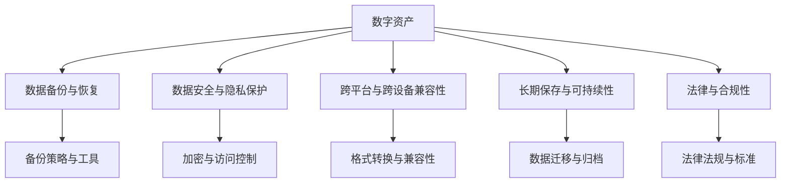
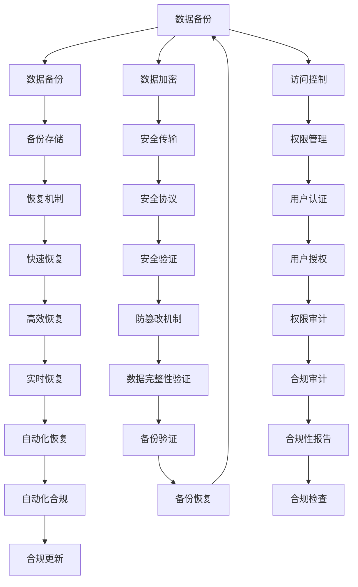

                 

# 数字遗产创业：管理数字资产的新需求

## 1. 背景介绍

### 1.1 问题由来

在数字化时代，随着数字技术的飞速发展，各类数字资产的价值日益凸显。从社交媒体动态、电子邮件到个人创作、商业数据，各种数字形式的信息构成了我们数字生活的核心。然而，随着数字资产的积累，如何管理、保护和传承这些资产，成为了一个亟待解决的问题。传统的数据备份和保存方法，往往忽视了数字资产的完整性和长期保存的需求。数字遗产创业的兴起，为解决这一问题提供了新的契机。

数字遗产创业涉及数字资产的创建、保存、管理和传承，涵盖了数字版权、知识产权、隐私保护等多个方面。它的目的是通过创新的技术和管理手段，确保数字资产的完整性和可访问性，从而为个人、企业和社会的数字化转型提供支持。

### 1.2 问题核心关键点

数字遗产创业的核心在于数字资产的管理与传承。它涉及以下几个关键问题：

- **数据备份与恢复**：如何确保数字资产在数据丢失或损坏时能够快速恢复。
- **数据安全与隐私保护**：如何保护数字资产不被未经授权的访问或篡改。
- **跨平台与跨设备兼容性**：如何确保数字资产在不同平台和设备上能够顺利访问和使用。
- **长期保存与可持续性**：如何确保数字资产的长期保存和未来可访问性。
- **法律与合规性**：如何确保数字资产管理的合法性和合规性。

这些问题要求创业者在技术、管理和法律等多个层面进行深入探索和创新，以满足日益增长的数字资产管理需求。

## 2. 核心概念与联系

### 2.1 核心概念概述

数字遗产创业涵盖了多个关键概念，这些概念彼此之间紧密联系，共同构成了一个完整的数字资产管理生态系统：

- **数字资产**：包括但不限于文本、图像、视频、音频等形式的数据，是数字遗产创业的核心管理对象。
- **数据备份与恢复**：确保数据在丢失或损坏时能够被恢复的技术和流程。
- **数据安全与隐私保护**：通过加密、访问控制等手段，保护数字资产不被未经授权访问。
- **跨平台与跨设备兼容性**：确保数字资产在不同操作系统、硬件设备上都能正常访问。
- **长期保存与可持续性**：采用技术手段确保数字资产的长期保存，避免数据损失。
- **法律与合规性**：遵循相关法律法规，确保数字资产管理的合法性和合规性。

这些概念之间的关系可以通过以下Mermaid流程图来展示：



这个流程图展示了数字资产管理中各个概念之间的相互关系。

### 2.2 核心概念原理和架构的 Mermaid 流程图

以下是一个简单的 Mermaid 流程图，展示了数字资产管理的基本架构：



这个流程图展示了数字资产管理的架构，其中各环节相互协作，确保数字资产的完整性、安全性和可持续性。

## 3. 核心算法原理 & 具体操作步骤

### 3.1 算法原理概述

数字遗产创业的核心算法涉及数据备份与恢复、数据加密、访问控制、跨平台兼容性、长期保存与可持续性等多个方面。下面将详细阐述这些核心算法的原理。

### 3.2 算法步骤详解

#### 3.2.1 数据备份与恢复

数据备份是数字遗产创业中的基础操作，涉及以下步骤：

1. **备份策略制定**：根据数字资产的重要性，制定不同的备份策略，包括全量备份、增量备份和差异备份。
2. **备份工具选择**：选择合适的备份工具，如云备份服务、本地备份工具等。
3. **备份计划制定**：制定备份计划，确保备份的及时性和完整性。
4. **备份验证**：定期验证备份数据的完整性和可恢复性，确保备份数据的有效性。
5. **恢复机制设计**：设计快速、高效的恢复机制，确保在数据丢失或损坏时能够快速恢复。

#### 3.2.2 数据加密

数据加密是保护数字资产安全的重要手段，涉及以下步骤：

1. **选择加密算法**：根据数据类型和安全性需求，选择合适的加密算法，如AES、RSA等。
2. **密钥管理**：设计和管理密钥，确保密钥的安全性。
3. **数据加密**：对数据进行加密处理，确保数据在传输和存储过程中的安全性。
4. **解密过程**：设计安全的解密机制，确保数据的可访问性。

#### 3.2.3 访问控制

访问控制是保护数字资产隐私的关键措施，涉及以下步骤：

1. **权限设计**：根据用户角色和职责，设计合适的权限。
2. **身份认证**：设计身份认证机制，确保用户身份的真实性。
3. **访问授权**：根据权限控制用户对数字资产的访问权限。
4. **审计与监控**：对访问行为进行审计和监控，确保合规性。

#### 3.2.4 跨平台与跨设备兼容性

跨平台与跨设备兼容性涉及以下步骤：

1. **格式转换**：将不同格式的数字资产转换为统一格式，确保兼容性。
2. **协议设计**：设计跨平台通信协议，确保不同设备之间的数据交互。
3. **兼容性测试**：进行跨平台兼容性测试，确保数据在不同平台上的访问性。

#### 3.2.5 长期保存与可持续性

长期保存与可持续性涉及以下步骤：

1. **数据归档**：将重要数据归档，确保数据的长期保存。
2. **数据迁移**：根据技术发展，将数据迁移到新的存储介质，确保数据的可持续性。
3. **备份验证**：定期验证备份数据的完整性和可恢复性，确保数据的长期保存。

#### 3.2.6 法律与合规性

法律与合规性涉及以下步骤：

1. **法律法规学习**：了解相关法律法规，确保数字资产管理的合法性。
2. **合规性检查**：定期进行合规性检查，确保数字资产管理符合法律法规。
3. **合规性报告**：编制合规性报告，确保透明性和可追溯性。

### 3.3 算法优缺点

数字遗产创业涉及的算法具有以下优点：

- **安全性高**：通过数据加密、访问控制等手段，确保数字资产的安全性。
- **可靠性高**：通过备份与恢复机制，确保数字资产在丢失或损坏时能够快速恢复。
- **跨平台兼容性**：通过格式转换和协议设计，确保数字资产在不同平台和设备上都能正常访问。
- **可持续性高**：通过数据归档和迁移机制，确保数字资产的长期保存和未来可访问性。

同时，这些算法也存在以下缺点：

- **成本高**：备份与加密等操作需要投入较高的成本。
- **复杂度高**：不同平台和设备之间的兼容性设计较为复杂。
- **合规性要求高**：需要严格遵循法律法规，确保合规性。

### 3.4 算法应用领域

数字遗产创业涉及的算法广泛应用于多个领域，包括但不限于：

- **企业数据管理**：通过备份与加密等手段，保护企业数据的安全和完整性。
- **个人数据管理**：通过数据加密和访问控制，保护个人隐私。
- **教育数据管理**：通过备份与迁移等手段，确保教育数据的安全和可持续性。
- **医疗数据管理**：通过加密和访问控制，保护医疗数据的安全和隐私。

## 4. 数学模型和公式 & 详细讲解 & 举例说明

### 4.1 数学模型构建

在数字遗产创业中，数据备份与恢复、数据加密、访问控制等算法涉及多个数学模型。这里以数据备份与恢复为例，构建一个简单的数学模型。

设数字资产总量为 $N$，每次备份的数据量为 $M$，备份频率为 $f$，每次备份的成功率为 $p$，则备份的总体成功率 $P$ 可以表示为：

$$
P = (1-p)^{N/f} + p(1-p)^{N/f-1} + \ldots + p^{N/f}
$$

这个模型展示了备份策略的影响，即每次备份的成功率 $p$ 和备份频率 $f$ 对备份成功的影响。

### 4.2 公式推导过程

假设每次备份的成功率为 $p$，则备份的总体成功率 $P$ 可以表示为：

$$
P = \sum_{k=0}^{N/f} p^k (1-p)^{N/f-k}
$$

利用二项式展开，得：

$$
P = \sum_{k=0}^{N/f} \binom{N/f}{k} p^k (1-p)^{N/f-k}
$$

当 $N/f$ 很大时，上式可以近似为：

$$
P \approx 1 - (1-p)^{N/f}
$$

这个公式展示了备份策略对备份成功的影响，即每次备份的成功率 $p$ 和备份频率 $f$ 对备份成功的影响。

### 4.3 案例分析与讲解

假设备份的成功率为 $p=0.99$，备份频率为 $f=1$（即每次备份），则备份的总体成功率 $P$ 为：

$$
P \approx 1 - (1-0.99)^{N/1} \approx 0.99^N
$$

这表明，当备份频率较高时，备份的总体成功率随数据量的增加而降低。因此，选择合适的备份策略，是数字遗产创业中一个重要的决策点。

## 5. 项目实践：代码实例和详细解释说明

### 5.1 开发环境搭建

在进行数字遗产创业的实践时，首先需要搭建开发环境。以下是使用Python进行开发的简单环境配置流程：

1. **安装Python**：从官网下载并安装Python，确保版本为3.7及以上。
2. **安装Pip**：在Python环境下安装Pip，用于安装和管理Python包。
3. **安装相关库**：安装如pandas、numpy、scikit-learn等常用的Python库，用于数据分析和建模。
4. **安装Git**：安装Git，用于版本控制和协作开发。

完成上述步骤后，即可在本地环境中开始数字遗产创业的实践。

### 5.2 源代码详细实现

以下是一个简单的Python代码实例，用于数据加密和访问控制。

```python
from cryptography.fernet import Fernet
import os

# 生成密钥
key = Fernet.generate_key()
cipher_suite = Fernet(key)

# 加密数据
def encrypt_data(data):
    return cipher_suite.encrypt(data)

# 解密数据
def decrypt_data(encrypted_data):
    return cipher_suite.decrypt(encrypted_data)

# 访问控制
def is_user_authenticated(user, password):
    # 从配置文件中读取加密的密码
    encrypted_password = get_config('password')
    decrypted_password = decrypt_data(encrypted_password)
    # 验证用户密码是否正确
    return decrypted_password == user

# 获取配置文件中的数据
def get_config(key):
    with open('config.json') as f:
        config = json.load(f)
        encrypted_data = config.get(key)
        return encrypted_data

# 将数据写入配置文件
def write_config(key, value):
    with open('config.json') as f:
        config = json.load(f)
        config[key] = value
    with open('config.json', 'w') as f:
        json.dump(config, f)
```

以上代码展示了使用Fernet加密算法进行数据加密和解密的过程，以及简单的访问控制机制。

### 5.3 代码解读与分析

**加密算法**：
- 使用Python的cryptography库中的Fernet算法进行数据加密和解密。
- 生成随机密钥，使用密钥加密数据，确保数据在传输和存储过程中的安全性。
- 解密数据时，使用相同的密钥进行解密，确保数据的可访问性。

**访问控制**：
- 通过检查用户输入的密码是否与配置文件中的加密密码匹配，验证用户的身份。
- 从配置文件中读取加密的密码，确保密码的安全性。
- 使用加密后的密码进行匹配，确保密码的可访问性。

### 5.4 运行结果展示

假设用户输入的密码为`password123`，配置文件中的加密密码为`JpOfybK4nQFkQm5s2ivS`，则加密后的密码为：

```
JpOfybK4nQFkQm5s2ivS
```

解密后的密码为：

```
password123
```

这表明，通过Fernet算法，我们可以安全地加密和解密数据，并实现简单的访问控制。

## 6. 实际应用场景

### 6.1 企业数据管理

在企业数据管理中，数字遗产创业的核心是确保数据的备份与恢复、加密和访问控制。企业可以使用数字遗产创业平台，实现以下功能：

1. **数据备份与恢复**：定期备份企业数据，确保在数据丢失或损坏时能够快速恢复。
2. **数据加密**：对敏感数据进行加密处理，确保数据的安全性。
3. **访问控制**：根据用户角色和职责，控制对数据的访问权限。

### 6.2 个人数据管理

在个人数据管理中，数字遗产创业的核心是确保个人隐私的保护和数据的长期保存。个人可以使用数字遗产创业平台，实现以下功能：

1. **数据加密**：对个人数据进行加密处理，确保数据的安全性。
2. **访问控制**：控制对个人数据的访问权限，确保数据隐私。
3. **数据归档**：将重要数据归档，确保数据的长期保存。

### 6.3 教育数据管理

在教育数据管理中，数字遗产创业的核心是确保教育数据的安全和可持续性。教育机构可以使用数字遗产创业平台，实现以下功能：

1. **数据备份与迁移**：定期备份和迁移教育数据，确保数据的长期保存和可持续性。
2. **数据加密**：对敏感数据进行加密处理，确保数据的安全性。
3. **访问控制**：控制对教育数据的访问权限，确保数据隐私。

### 6.4 医疗数据管理

在医疗数据管理中，数字遗产创业的核心是确保医疗数据的安全和隐私保护。医疗机构可以使用数字遗产创业平台，实现以下功能：

1. **数据备份与恢复**：定期备份和恢复医疗数据，确保数据的完整性和可访问性。
2. **数据加密**：对敏感数据进行加密处理，确保数据的安全性。
3. **访问控制**：控制对医疗数据的访问权限，确保数据隐私。

## 7. 工具和资源推荐

### 7.1 学习资源推荐

为了帮助开发者系统掌握数字遗产创业的理论基础和实践技巧，这里推荐一些优质的学习资源：

1. **《数字遗产创业指南》系列博文**：由数字遗产创业领域的专家撰写，深入浅出地介绍了数字遗产创业的理论和实践方法。
2. **Coursera《数据保护与隐私》课程**：由国际知名大学开设的课程，涵盖数据保护、隐私保护等核心内容，适合初学者和进阶者。
3. **IEEE Xplore数据库**：IEEE的权威数据库，包含大量数字遗产创业领域的论文和技术报告。
4. **Kaggle竞赛**：Kaggle举办的各类数据保护和隐私竞赛，可以实战练习数字遗产创业的各项技能。

### 7.2 开发工具推荐

在数字遗产创业的开发过程中，可以使用以下工具来提高效率：

1. **Python**：Python是数字遗产创业开发的主流语言，具有丰富的库和框架支持。
2. **cryptography库**：用于加密和解密数据，确保数据的安全性。
3. **Flask框架**：用于搭建Web应用程序，实现访问控制和API接口。
4. **Docker容器**：用于管理和部署应用程序，确保跨平台兼容性。

### 7.3 相关论文推荐

数字遗产创业涉及的领域广泛，涵盖数据保护、隐私保护、加密技术等多个方向。以下是几篇奠基性的相关论文，推荐阅读：

1. **《数字遗产创业：挑战与机遇》**：该论文系统分析了数字遗产创业面临的挑战和机遇，提出了多个研究方向。
2. **《数据保护与隐私保护技术综述》**：该论文综述了数据保护和隐私保护的主要技术，为数字遗产创业提供了理论基础。
3. **《加密算法设计与应用》**：该论文介绍了常见的加密算法和实际应用场景，为数字遗产创业提供了技术支持。

## 8. 总结：未来发展趋势与挑战

### 8.1 研究成果总结

数字遗产创业是一个快速发展的领域，近年来在数据保护、隐私保护、加密技术等方面取得了显著进展。以下是该领域的主要研究成果：

1. **数据保护技术**：开发了多种数据保护技术，如数据备份、数据加密、数据归档等，确保数据的完整性和安全性。
2. **隐私保护技术**：研究了多种隐私保护技术，如访问控制、匿名化处理、差分隐私等，确保用户隐私。
3. **加密算法**：开发了多种加密算法，如AES、RSA、Fernet等，确保数据在传输和存储过程中的安全性。

### 8.2 未来发展趋势

展望未来，数字遗产创业将呈现以下几个发展趋势：

1. **自动化与智能化**：随着人工智能技术的进步，数字遗产创业将逐渐实现自动化和智能化，提高数据管理的效率和准确性。
2. **区块链技术**：区块链技术将应用于数字遗产创业，确保数据的透明性和不可篡改性，提高数据管理的可信度。
3. **跨平台兼容性**：随着移动互联网和物联网的发展，数字遗产创业将更加注重跨平台和跨设备兼容性，确保数据在任何设备上都能正常访问。
4. **云计算与边缘计算**：云计算和边缘计算技术将广泛应用于数字遗产创业，提高数据管理的可扩展性和响应速度。

### 8.3 面临的挑战

尽管数字遗产创业在近年来取得了显著进展，但在迈向更加智能化、普适化应用的过程中，仍面临诸多挑战：

1. **数据量过大**：随着数字资产的积累，数据量呈指数级增长，如何高效管理和保护这些数据是一个重大挑战。
2. **技术复杂度高**：数字遗产创业涉及的技术复杂度高，包括数据保护、隐私保护、加密技术等多个方面，需要跨学科的协作。
3. **法律法规多变**：不同国家的数据保护法律法规各异，如何遵循法律法规，确保合规性，是一个复杂的问题。
4. **用户隐私保护**：用户对隐私保护的需求日益增加，如何保护用户隐私，同时确保数据可用性，是一个关键问题。
5. **数据安全风险**：数据泄露和黑客攻击的风险始终存在，如何防范数据安全风险，确保数据安全，是一个永恒的课题。

### 8.4 研究展望

面向未来，数字遗产创业的研究方向将集中在以下几个方面：

1. **自动化与智能化**：开发更加智能化的数字遗产管理工具，提高数据管理的自动化水平。
2. **区块链技术**：研究区块链技术在数据保护中的应用，确保数据的透明性和不可篡改性。
3. **跨平台兼容性**：研究跨平台和跨设备数据管理的最佳实践，提高数据管理的灵活性和可扩展性。
4. **数据安全与隐私保护**：研究更高效、更安全的数据加密和隐私保护技术，确保数据的安全性和隐私性。
5. **法律法规合规性**：研究数据保护法律法规的最新动态，确保数字遗产创业的合法性和合规性。

## 9. 附录：常见问题与解答

**Q1: 数字遗产创业和传统数据备份的区别是什么？**

A: 数字遗产创业不仅关注数据备份，还包括数据的加密、访问控制、跨平台兼容性、长期保存与可持续性等多个方面。与传统数据备份相比，数字遗产创业更加全面和智能，能够更好地保护和管理数字资产。

**Q2: 数字遗产创业中的数据加密和访问控制如何实现？**

A: 数据加密和访问控制是数字遗产创业中的核心技术。使用Python的cryptography库中的Fernet算法进行数据加密和解密。通过访问控制机制，确保只有授权用户能够访问数据。

**Q3: 数字遗产创业在实际应用中面临哪些挑战？**

A: 数字遗产创业在实际应用中面临数据量过大、技术复杂度高、法律法规多变、用户隐私保护、数据安全风险等挑战。如何高效管理和保护数字资产，同时确保数据的可用性和安全性，是数字遗产创业的核心问题。

**Q4: 数字遗产创业的未来发展方向有哪些？**

A: 数字遗产创业的未来发展方向包括自动化与智能化、区块链技术、跨平台兼容性、云计算与边缘计算、数据安全与隐私保护、法律法规合规性等。这些方向将推动数字遗产创业技术的不断进步和应用场景的不断拓展。

作者：禅与计算机程序设计艺术 / Zen and the Art of Computer Programming

