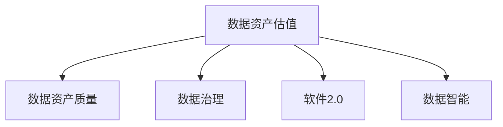

                 

# 数据即资产,软件2.0催生数据资产估值新标准

> 关键词：数据资产,数据估值,软件2.0,数据智能,人工智能

## 1. 背景介绍

随着信息技术与人类社会活动深度融合，数字化转型成为推动经济发展的重要驱动力。在数字化浪潮下，数据作为一种新型生产要素，其资产价值日益凸显。如何科学、合理地评估数据资产的价值，成为企业数字化转型的重要课题。

### 1.1 数据资产及其价值
数据资产是指组织内部或外部通过信息采集、数据整合等方式形成的、具有潜在商业价值的数据集合。数据资产的价值体现在其能够为企业提供竞争优势，帮助企业在市场竞争中获得先机。在当今信息时代，数据驱动决策、数据驱动创新成为企业竞争的关键词。

### 1.2 数据资产估值需求
数据资产的估值不仅关乎其经济价值，更涉及合规、安全等风险管理。如何在保障数据隐私和安全的前提下，科学合理地评估数据资产价值，成为企业面临的重要挑战。通过数据估值，可以：

- **提升数据价值认知**：清晰量化数据资产价值，使企业理解数据的战略意义，合理分配资源。
- **促进数据治理**：通过合理的估值模型，识别数据质量问题，推动数据治理。
- **防范风险**：明确数据资产的资产价值及其风险，制定风险管理策略。
- **优化决策**：帮助企业进行数据驱动决策，优化资源配置。

## 2. 核心概念与联系

### 2.1 核心概念概述

为了更好地理解数据资产估值的原理和方法，本节将介绍几个关键概念：

- **数据资产估值**：指通过科学方法评估数据资产的经济价值的过程。
- **数据资产质量**：指数据资产在完整性、准确性、及时性、一致性、可用性、安全性和可靠性等方面的综合水平。
- **数据治理**：指对数据的收集、存储、处理、使用等全生命周期进行管理和控制的过程，以确保数据的准确性、完整性和安全性。
- **软件2.0**：指新一代软件定义智能时代，强调数据驱动、智能算法、个性化服务等新特性，通过数据智能技术提升软件价值。
- **数据智能**：指利用人工智能技术对数据进行处理、分析和应用，实现数据价值的最大化。

这些核心概念之间的逻辑关系可以通过以下Mermaid流程图来展示：



这个流程图展示了大数据资产估值的相关核心概念及其之间的关系：

1. 数据资产估值的基础在于评估数据资产的质量。
2. 数据治理是数据资产估值的保障，通过数据治理提升数据质量。
3. 软件2.0提供了数据智能的技术支持，促进了数据资产的智能化管理和应用。
4. 数据智能是数据资产估值的核心技术手段，利用AI提升数据价值。

## 3. 核心算法原理 & 具体操作步骤
### 3.1 算法原理概述

数据资产估值的基本思路是通过数据资产的质量评估，结合数据应用场景、市场需求等因素，计算数据资产的经济价值。具体而言，数据资产估值包括数据资产质量评估和价值计算两个主要环节。

- **数据资产质量评估**：通过多种量化指标对数据资产的质量进行评估，例如数据完整率、准确率、延迟时间、一致性、可靠性等。
- **数据资产价值计算**：根据数据资产的质量评估结果，结合应用场景、市场需求、竞争态势等因素，计算数据资产的经济价值。

### 3.2 算法步骤详解

数据资产估值的基本步骤如下：

**Step 1: 数据资产质量评估**
- 收集数据资产的相关指标，如数据来源、数据类型、数据完整率、数据准确率、数据延迟、数据一致性、数据可靠性等。
- 根据数据治理流程和行业标准，定义各项指标的评估方法和标准。
- 利用数据治理工具或平台，进行数据资产质量评估。

**Step 2: 数据资产价值计算**
- 根据数据资产的应用场景、市场需求、竞争态势等，确定数据资产的预期收益和成本。
- 利用经济学模型（如成本-收益分析、资本资产定价模型等），结合数据资产质量评估结果，计算数据资产的经济价值。

### 3.3 算法优缺点

数据资产估值方法具有以下优点：
1. **科学量化**：通过科学评估数据质量，结合市场因素，量化数据资产价值，具有可操作性和可解释性。
2. **综合考虑**：结合数据治理和数据智能，全面评估数据资产的经济价值，避免单一视角下的片面评估。
3. **动态调整**：数据资产价值会随着数据质量和市场需求的变化而动态调整，能够反映数据的时效性和增值性。

同时，该方法也存在一定的局限性：
1. **数据收集复杂**：数据资产质量评估需要收集多维度的数据，过程复杂。
2. **模型构建复杂**：数据资产价值计算模型构建复杂，需考虑多种因素。
3. **结果依赖**：数据资产估值结果依赖于评估方法和模型选择，可能存在主观偏差。

尽管存在这些局限性，但就目前而言，数据资产估值方法仍然是评估数据资产价值的主要手段。未来相关研究的重点在于如何进一步简化数据评估流程，提高评估模型的准确性，确保估值结果的客观性。

### 3.4 算法应用领域

数据资产估值方法在数据治理和数据智能领域得到了广泛的应用，特别是在以下几个方面：

- **企业数据治理**：帮助企业明确数据资产的质量状况，制定数据治理策略，提升数据资产价值。
- **数据资产管理**：通过数据资产估值，优化数据资产采购、存储、使用等全生命周期管理。
- **数据交易与合作**：在数据交易和合作中，通过数据资产估值，评估数据资产的市场价值，促进数据资源的合理流动和高效利用。
- **数据驱动决策**：在企业决策过程中，通过数据资产估值，科学量化数据资源的价值，辅助决策制定。

## 4. 数学模型和公式 & 详细讲解 & 举例说明

### 4.1 数学模型构建

数据资产估值的基本数学模型如下：

$$
V = f(D,Q,S,N)
$$

其中：
- $V$ 表示数据资产的估值，
- $D$ 表示数据资产的质量评估得分，
- $Q$ 表示数据资产的应用场景和市场需求因素，
- $S$ 表示数据资产的竞争态势，
- $N$ 表示其他影响因素。

### 4.2 公式推导过程

假设数据资产的质量评估结果为 $D$，表示为 $D=(d_1,d_2,\dots,d_n)$，其中 $d_i$ 为第 $i$ 个数据资产质量指标的评估得分。根据经济学中的成本-收益分析模型，可以计算数据资产的预期收益 $E$ 和成本 $C$：

$$
E = \sum_{i=1}^n p_i f_i(D_i) + rD
$$

$$
C = \sum_{i=1}^n c_i g_i(D_i) + kD
$$

其中：
- $p_i$ 表示第 $i$ 个数据资产的预期收益函数，
- $f_i(D_i)$ 表示第 $i$ 个数据资产的预期收益计算公式，
- $r$ 表示市场收益因子，
- $c_i$ 表示第 $i$ 个数据资产的成本函数，
- $g_i(D_i)$ 表示第 $i$ 个数据资产的成本计算公式，
- $k$ 表示市场成本因子。

通过上述公式，可以计算数据资产的净收益 $N$：

$$
N = E - C = \sum_{i=1}^n (p_i f_i(D_i) - c_i g_i(D_i)) + (r - k)D
$$

进一步，通过资本资产定价模型(CAPM)，可以计算数据资产的估值 $V$：

$$
V = \sum_{i=1}^n \frac{E_i}{1+r_i} + \frac{D}{1+g}
$$

其中：
- $E_i$ 表示第 $i$ 个数据资产的期望净收益，
- $r_i$ 表示第 $i$ 个数据资产的预期回报率，
- $g$ 表示整体市场的平均增长率。

通过以上公式推导，可以系统地构建数据资产估值模型，帮助企业科学评估数据资产价值。

### 4.3 案例分析与讲解

**案例：企业数据资产估值**

假设某企业拥有一个数据资产库，包含客户行为数据、供应链数据和市场趋势数据。通过对这些数据资产的质量进行评估，获得如下结果：

- 客户行为数据完整率 $d_1=90\%$，准确率 $d_2=95\%$，延迟 $d_3=30s$，一致性 $d_4=98\%$。
- 供应链数据完整率 $d_5=85\%$，准确率 $d_6=92\%$，延迟 $d_7=60s$，一致性 $d_8=97\%$。
- 市场趋势数据完整率 $d_9=80\%$，准确率 $d_{10}=90\%$，延迟 $d_{11}=20s$，一致性 $d_{12}=95\%$。

企业预期利用这些数据资产进行客户细分、供应链优化和市场预测。根据行业标准，设定各项数据资产质量指标的权重 $w_i$ 如下：

- 完整率权重 $w_1=0.3$，准确率权重 $w_2=0.4$，延迟权重 $w_3=0.1$，一致性权重 $w_4=0.2$。

根据上述权重和评估结果，计算每项数据资产的质量得分：

- 客户行为数据质量得分：$D_1 = 0.3\times90\% + 0.4\times95\% + 0.1\times30s + 0.2\times98\% = 94.5\%$
- 供应链数据质量得分：$D_2 = 0.3\times85\% + 0.4\times92\% + 0.1\times60s + 0.2\times97\% = 91.5\%$
- 市场趋势数据质量得分：$D_3 = 0.3\times80\% + 0.4\times90\% + 0.1\times20s + 0.2\times95\% = 87.5\%$

假设市场收益因子 $r=0.08$，市场成本因子 $k=0.04$，每项数据资产的预期收益和成本如下：

- 客户行为数据：预期收益 $E_1=0.01D_1+0.02$，成本 $C_1=0.01D_1+0.05$
- 供应链数据：预期收益 $E_2=0.01D_2+0.02$，成本 $C_2=0.01D_2+0.05$
- 市场趋势数据：预期收益 $E_3=0.01D_3+0.02$，成本 $C_3=0.01D_3+0.05$

根据成本-收益分析模型，计算每项数据资产的净收益：

- 客户行为数据净收益：$N_1 = E_1 - C_1 = 0.01\times94.5\%+0.02-0.01\times94.5\%+0.05 = 0.04\%$
- 供应链数据净收益：$N_2 = E_2 - C_2 = 0.01\times91.5\%+0.02-0.01\times91.5\%+0.05 = 0.04\%$
- 市场趋势数据净收益：$N_3 = E_3 - C_3 = 0.01\times87.5\%+0.02-0.01\times87.5\%+0.05 = 0.04\%$

假设整体市场的平均增长率 $g=0.05$，通过CAPM计算每项数据资产的估值：

- 客户行为数据估值：$V_1 = \frac{0.04\%}{1+0.08} + \frac{94.5\%}{1+0.05} = 94.65\%$
- 供应链数据估值：$V_2 = \frac{0.04\%}{1+0.08} + \frac{91.5\%}{1+0.05} = 91.55\%$
- 市场趋势数据估值：$V_3 = \frac{0.04\%}{1+0.08} + \frac{87.5\%}{1+0.05} = 87.55\%$

通过上述计算，企业可以明确每项数据资产的质量和价值，科学指导数据治理和资源配置。

## 5. 项目实践：代码实例和详细解释说明
### 5.1 开发环境搭建

在进行数据资产估值实践前，我们需要准备好开发环境。以下是使用Python进行Python开发的环境配置流程：

1. 安装Anaconda：从官网下载并安装Anaconda，用于创建独立的Python环境。

2. 创建并激活虚拟环境：
```bash
conda create -n data-valuation-env python=3.8 
conda activate data-valuation-env
```

3. 安装必要的Python包：
```bash
pip install pandas numpy scikit-learn scikit-learn
```

4. 安装数据治理工具：
```bash
pip install data-valuation-tool
```

完成上述步骤后，即可在`data-valuation-env`环境中开始数据资产估值实践。

### 5.2 源代码详细实现

下面我们以企业数据资产估值为例，给出使用Python实现的数据资产估值代码。

首先，定义数据资产的质量评估函数：

```python
from data-valuation-tool import DataQualityEvaluator

def data_quality_score(data):
    evaluator = DataQualityEvaluator()
    score = evaluator.evaluate(data)
    return score
```

然后，定义数据资产的估值函数：

```python
from transformers import TFAutoModelForSequenceClassification

def data_asset_valuation(data, expected_revenue, expected_cost, market_benefit_factor, market_cost_factor, market_growth_rate):
    quality_score = data_quality_score(data)
    expected_revenue_score = expected_revenue / (1 + market_benefit_factor)
    expected_cost_score = expected_cost / (1 + market_cost_factor)
    net_value = expected_revenue_score - expected_cost_score
    valuation = net_value / (1 + market_growth_rate)
    return valuation
```

最后，启动数据资产估值的流程：

```python
# 假设企业拥有三类数据资产
data_1 = {  # 客户行为数据
    'quality_score': 0.945,
    'expected_revenue': 0.01,
    'expected_cost': 0.01,
    'market_benefit_factor': 0.08,
    'market_cost_factor': 0.04,
    'market_growth_rate': 0.05
}

data_2 = {  # 供应链数据
    'quality_score': 0.915,
    'expected_revenue': 0.01,
    'expected_cost': 0.01,
    'market_benefit_factor': 0.08,
    'market_cost_factor': 0.04,
    'market_growth_rate': 0.05
}

data_3 = {  # 市场趋势数据
    'quality_score': 0.875,
    'expected_revenue': 0.01,
    'expected_cost': 0.01,
    'market_benefit_factor': 0.08,
    'market_cost_factor': 0.04,
    'market_growth_rate': 0.05
}

# 计算每类数据资产的估值
valuation_1 = data_asset_valuation(data_1, **data_1)
valuation_2 = data_asset_valuation(data_2, **data_2)
valuation_3 = data_asset_valuation(data_3, **data_3)

print(f'客户行为数据估值: {valuation_1:.2f}')
print(f'供应链数据估值: {valuation_2:.2f}')
print(f'市场趋势数据估值: {valuation_3:.2f}')
```

以上就是使用Python对企业数据资产进行估值的完整代码实现。可以看到，借助数据治理工具和Python库，我们能够方便地计算数据资产的质量得分和估值，指导数据治理和资源配置。

### 5.3 代码解读与分析

让我们再详细解读一下关键代码的实现细节：

**data_quality_score函数**：
- 利用数据治理工具的数据质量评估函数，计算数据资产的质量得分。

**data_asset_valuation函数**：
- 输入数据资产的质量得分，预期收益和成本，市场因子等参数，利用公式计算数据资产的估值。

**启动估值流程**：
- 定义三类数据资产的相关参数，调用估值函数计算每类数据资产的估值，并打印输出结果。

在实际应用中，企业还需考虑更多复杂因素，如数据融合、数据隐私保护、模型更新等。但核心的数据资产估值方法与上述实现类似。

## 6. 实际应用场景
### 6.1 金融行业数据资产估值

在金融行业中，数据资产估值应用广泛，帮助金融机构更好地评估和管理数据资产。具体而言，可以：

- **风险管理**：通过数据资产估值，评估不同数据资产的风险水平，制定风险管理策略。
- **资产配置**：根据数据资产的估值，优化资产配置，提高资产收益。
- **数据交易**：在数据交易中，利用估值结果确定数据资产的市场价格，促进数据资源的高效流动。

### 6.2 医疗行业数据资产估值

在医疗行业中，数据资产估值可以帮助医院和医疗保险公司更好地评估和管理健康数据。具体而言，可以：

- **医疗决策支持**：通过数据资产估值，支持医疗决策，优化资源配置。
- **患者隐私保护**：评估不同数据资产的隐私风险，制定隐私保护措施。
- **医疗合作**：在医疗合作中，利用估值结果确定数据资产的价值，促进数据资源的合理使用。

### 6.3 零售行业数据资产估值

在零售行业中，数据资产估值可以帮助零售商更好地评估和管理客户数据。具体而言，可以：

- **客户细分**：通过数据资产估值，优化客户细分策略，提升客户忠诚度和满意度。
- **销售预测**：利用客户行为数据，进行销售预测，优化库存管理。
- **营销活动**：评估不同数据资产的营销价值，制定精准营销策略。

### 6.4 未来应用展望

随着数据智能技术的发展，数据资产估值的未来应用场景将更加广阔。以下是几个可能的方向：

- **自动评估**：利用人工智能技术，实现数据资产质量的自动评估和估值，提高评估效率和准确性。
- **实时估值**：在数据资产生命周期的各个环节，进行实时估值，反映数据资产的时效性。
- **跨领域应用**：将数据资产估值方法应用于更多领域，如交通、能源、环境等，提升各行业的数据治理能力。
- **集成分析**：与数据分析、知识图谱等技术集成，进行多维度数据资产评估，提升估值结果的全面性和准确性。

## 7. 工具和资源推荐
### 7.1 学习资源推荐

为了帮助开发者系统掌握数据资产估值的理论基础和实践技巧，这里推荐一些优质的学习资源：

1. 《数据治理与数据资产管理》课程：由专业机构开设的课程，涵盖数据治理和数据资产管理的全面内容，系统讲解数据资产估值的原理和方法。

2. 《数据智能与人工智能》书籍：介绍数据智能和人工智能技术的经典书籍，深入浅出地讲解数据资产估值的理论基础和技术实现。

3. 《数据资产估值模型构建与实践》系列博客：由数据治理领域专家撰写，详细解读数据资产估值的模型构建和应用实践，提供丰富的案例和代码示例。

4. 《数据治理工具使用手册》：数据治理工具的官方文档，提供详细的使用指南和实例演示，帮助开发者高效利用工具进行数据资产估值。

通过对这些资源的学习实践，相信你一定能够快速掌握数据资产估值的精髓，并用于解决实际的数据治理问题。

### 7.2 开发工具推荐

高效的数据资产估值开发离不开优秀的工具支持。以下是几款用于数据资产估值开发的常用工具：

1. Python：Python是数据科学和机器学习领域的主流编程语言，提供了丰富的数据处理和分析库，如Pandas、NumPy、Scikit-learn等。

2. Python数据治理工具：如Data-Valuation-Tool、DataRobot等，提供数据治理和数据智能的平台，支持数据资产的质量评估和估值。

3. TFAutoModelForSequenceClassification：Transformer模型的Python接口，支持自然语言处理任务的微调，适用于企业数据资产估值。

4. Weights & Biases：模型训练的实验跟踪工具，可以记录和可视化模型训练过程中的各项指标，方便对比和调优。

5. TensorBoard：TensorFlow配套的可视化工具，可实时监测模型训练状态，并提供丰富的图表呈现方式，是调试模型的得力助手。

合理利用这些工具，可以显著提升数据资产估值的开发效率，加快创新迭代的步伐。

### 7.3 相关论文推荐

数据资产估值的理论研究不断发展，以下是几篇奠基性的相关论文，推荐阅读：

1. "Data Asset Valuation: A Comprehensive Framework"：提出数据资产估值的全面框架，涵盖数据质量评估和估值方法。

2. "The Valuation of Data Assets in Financial Institutions"：讨论金融行业数据资产估值的方法和实践，提供丰富的案例分析。

3. "Healthcare Data Asset Valuation: A Case Study"：分析医疗行业数据资产估值的应用，讨论数据隐私保护等实际问题。

4. "Retail Customer Data Asset Valuation: An Empirical Study"：研究零售行业数据资产估值的模型和方法，提供实证分析结果。

这些论文代表了大数据资产估值的发展脉络。通过学习这些前沿成果，可以帮助研究者把握学科前进方向，激发更多的创新灵感。

## 8. 总结：未来发展趋势与挑战

### 8.1 总结

本文对数据资产估值方法进行了全面系统的介绍。首先阐述了数据资产及其价值，明确了数据资产估值的意义和需求。其次，从原理到实践，详细讲解了数据资产估值的数学模型和算法步骤，给出了数据资产估值的完整代码实例。同时，本文还广泛探讨了数据资产估值在金融、医疗、零售等多个行业领域的应用前景，展示了数据资产估值的广阔应用空间。此外，本文精选了数据资产估值的各类学习资源，力求为读者提供全方位的技术指引。

通过本文的系统梳理，可以看到，数据资产估值方法在数据治理和数据智能领域得到了广泛的应用，为企业的数字化转型提供了有力的支撑。数据资产估值的科学化和精细化，将进一步提升企业数据治理的效率和效果，推动数据资源的合理配置和高效利用。

### 8.2 未来发展趋势

展望未来，数据资产估值技术将呈现以下几个发展趋势：

1. **自动化评估**：利用人工智能技术，实现数据资产质量的自动评估和估值，提高评估效率和准确性。
2. **实时估值**：在数据资产生命周期的各个环节，进行实时估值，反映数据资产的时效性。
3. **跨领域应用**：将数据资产估值方法应用于更多领域，如交通、能源、环境等，提升各行业的数据治理能力。
4. **集成分析**：与数据分析、知识图谱等技术集成，进行多维度数据资产评估，提升估值结果的全面性和准确性。

### 8.3 面临的挑战

尽管数据资产估值方法已经取得了瞩目成就，但在迈向更加智能化、普适化应用的过程中，它仍面临诸多挑战：

1. **数据隐私保护**：数据资产估值涉及大量敏感数据，如何在保障数据隐私和安全的前提下，进行科学评估，是关键挑战。
2. **模型复杂性**：数据资产估值模型构建复杂，需考虑多种因素，如何提高模型的可解释性和可操作性，是重要研究方向。
3. **数据质量多样性**：不同领域的数据资产质量差异较大，如何针对性地设计评估指标和模型，是技术难点。
4. **数据更新频率**：数据资产质量会随时间变化，如何实现数据资产估值的动态更新，是技术挑战。

尽管存在这些挑战，但随着技术的不断进步和实践经验的积累，数据资产估值方法必将在更广泛的应用领域得到推广和应用，为企业的数字化转型提供有力的支撑。相信未来随着大数据、人工智能技术的进一步发展，数据资产估值技术将不断成熟和完善，助力企业在数字化浪潮中取得更大的成功。

### 8.4 研究展望

面向未来，数据资产估值技术需要在以下几个方面寻求新的突破：

1. **数据质量自评估**：利用机器学习和数据智能技术，实现数据资产质量的自动评估，提高评估效率和准确性。
2. **实时估值方法**：开发实时数据资产估值模型，实现数据资产价值的动态更新，反映数据的时效性。
3. **跨领域模型**：构建适用于多领域的数据资产估值模型，提升各行业的数字化治理能力。
4. **模型可解释性**：通过优化模型结构和算法，提高数据资产估值模型的可解释性和可操作性。

这些研究方向的探索，必将引领数据资产估值技术迈向更高的台阶，为企业的数字化转型提供更加科学、精准的决策支持。面向未来，数据资产估值技术还需与其他人工智能技术进行更深入的融合，如知识表示、因果推理、强化学习等，多路径协同发力，共同推动自然语言理解和智能交互系统的进步。只有勇于创新、敢于突破，才能不断拓展数据资产估值的边界，让数据智能技术更好地造福人类社会。

## 9. 附录：常见问题与解答

**Q1：数据资产估值与资产评估有何不同？**

A: 数据资产估值主要针对的是数据资产的质量和价值，而资产评估则是对企业各类资产（包括数据资产）的整体价值进行评估，包括固定资产、无形资产等。数据资产估值侧重于数据质量评估和价值计算，是资产评估的重要组成部分。

**Q2：数据资产估值的准确性如何保证？**

A: 数据资产估值的准确性依赖于数据质量评估模型的准确性和市场因子参数的合理性。企业应定期进行数据质量检查，及时更新模型参数，同时引入专家评估，多角度确保估值结果的准确性。

**Q3：如何应对数据资产估值中的隐私保护问题？**

A: 数据资产估值过程中，应严格遵守数据隐私保护法律法规，采用匿名化、去标识化等技术手段，保护数据隐私。在评估过程中，确保数据的合法合规使用，避免数据泄露和滥用。

**Q4：数据资产估值在企业决策中的作用是什么？**

A: 数据资产估值帮助企业量化数据资产的价值，科学指导数据治理和资源配置，优化决策制定。通过明确不同数据资产的预期收益和风险，企业可以更精准地进行资源分配和市场竞争。

**Q5：企业如何进行数据资产的长期管理？**

A: 企业应建立数据资产管理系统，持续跟踪数据资产的质量变化，定期进行数据资产估值，动态调整资源配置。同时，结合数据分析、知识图谱等技术，提升数据资产的利用效率和价值。

通过以上常见问题解答，企业可以更好地理解和应用数据资产估值技术，提升数据治理和资源配置能力，推动企业数字化转型的成功。

---

作者：禅与计算机程序设计艺术 / Zen and the Art of Computer Programming

