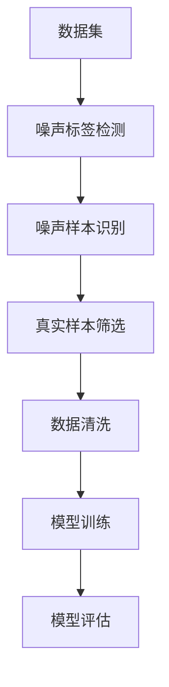

                 

# 数据噪声太多咋办？试试cleanlab

## 1. 背景介绍

在数据驱动的机器学习和人工智能项目中，数据的质量至关重要。然而，现实世界的真实数据往往充满了各种噪声，这些噪声会严重影响模型性能和决策的准确性。对于这些问题，传统的清洗和噪声过滤技术常常显得力不从心。幸运的是，随着技术的进步，一些新兴方法开始出现，比如cleanlab，就是一种应对数据噪声的有效方法。

## 2. 核心概念与联系

### 2.1 核心概念概述

cleanlab是一种新兴的噪声数据学习技术，其主要目标是识别和去除数据中的噪声样本，同时保留真实样本，以便更好地训练和优化模型。其核心思想是通过学习数据的内在结构，识别出最有可能的真实样本，从而筛选出噪声样本。

cleanlab算法主要包括以下几个关键概念：

- **标签噪声(Label Noise)**：数据中的噪声标签，即错误的标注。
- **噪声样本(Noisy Samples)**：带有错误标签的样本。
- **真实样本(True Samples)**：正确的、不带噪声的样本。
- **cleanlab算法**：一种识别和清洗噪声样本的算法。

### 2.2 核心概念原理和架构的 Mermaid 流程图



这个流程图展示了cleanlab算法的整体流程：

1. **数据集**：首先需要一个数据集，其中包含标签噪声和噪声样本。
2. **噪声标签检测**：通过cleanlab算法检测出噪声标签。
3. **噪声样本识别**：基于检测出的噪声标签，识别出噪声样本。
4. **真实样本筛选**：保留真实样本，去除噪声样本。
5. **数据清洗**：对清洗后的数据集进行训练。
6. **模型评估**：评估模型的性能，确认其效果。

## 3. 核心算法原理 & 具体操作步骤

### 3.1 算法原理概述

cleanlab算法主要基于贝叶斯理论和图模型，通过迭代优化的方法，逐步识别和清洗噪声样本。其基本流程如下：

1. 假设数据集中存在少量的噪声标签和噪声样本。
2. 使用似然比估计方法，计算每个样本是真实样本的概率。
3. 通过贝叶斯公式，更新每个样本的真实概率。
4. 对数据集进行噪声标签检测，识别出噪声标签。
5. 根据噪声标签，识别出噪声样本。
6. 对数据集进行筛选，去除噪声样本，保留真实样本。
7. 对清洗后的数据集进行模型训练，优化模型性能。

### 3.2 算法步骤详解

#### 步骤1: 数据预处理

在应用cleanlab算法前，需要首先对数据集进行预处理，包括：

- **数据标准化**：对数据进行归一化处理，使其具有相同的分布。
- **缺失值处理**：处理数据集中的缺失值，保证数据完整性。
- **异常值检测**：检测并处理数据集中的异常值，避免其影响模型。

#### 步骤2: 噪声标签检测

使用cleanlab算法中的似然比估计方法，计算每个样本是真实样本的概率。计算公式如下：

$$
p_{ti} = \frac{p_{ti|y}}{p_{t}} = \frac{p_{ti|y}p_{ty}}{\sum_{j}p_{tj|y}p_{ty}}
$$

其中，$p_{ti|y}$表示样本$t$在标签$i$下是真实样本的概率，$p_{ty}$表示标签$y$是真实标签的概率。$\sum_{j}p_{tj|y}p_{ty}$表示在标签$y$下，所有样本的概率之和。

#### 步骤3: 噪声样本识别

根据噪声标签检测的结果，识别出噪声样本。具体而言，将似然比估计结果进行排序，取阈值以下的部分为噪声样本，阈值以上的部分为真实样本。阈值的选取可以通过交叉验证等方法确定。

#### 步骤4: 数据清洗

对识别出的噪声样本进行清洗，将其从数据集中去除。同时，对数据集进行重构，保留真实样本。

#### 步骤5: 模型训练

在清洗后的数据集上，使用机器学习算法进行模型训练。可以使用传统的监督学习方法，如逻辑回归、支持向量机等。也可以使用深度学习方法，如神经网络、卷积神经网络等。

#### 步骤6: 模型评估

评估训练好的模型性能，确保其能够有效处理噪声数据，并准确预测真实标签。

### 3.3 算法优缺点

cleanlab算法的主要优点包括：

- **自动清洗噪声**：算法能够自动检测和清洗噪声数据，无需人工干预。
- **鲁棒性强**：对于不同的数据集和噪声水平，cleanlab算法都能较好地工作。
- **适用范围广**：适用于各种类型的数据集和噪声水平，包括图像、文本、声音等。

其缺点主要包括：

- **计算复杂度高**：算法需要进行多次迭代优化，计算量较大。
- **结果依赖于初始值**：算法的性能依赖于初始值的选择，不同的初始值可能会导致不同的结果。
- **数据隐私问题**：在处理敏感数据时，需要特别注意数据隐私问题。

### 3.4 算法应用领域

cleanlab算法主要应用于以下领域：

- **自然语言处理(NLP)**：用于去除文本数据中的噪声，如去除错别字、标点符号等。
- **图像处理**：用于去除图像数据中的噪声，如去除噪声像素、去除虚假的边缘等。
- **声音处理**：用于去除音频数据中的噪声，如去除背景噪声、去除失真等。
- **医疗数据**：用于去除医疗数据中的噪声，如去除错误的诊断结果、去除不完整的记录等。
- **金融数据**：用于去除金融数据中的噪声，如去除错误的交易记录、去除不准确的财务数据等。

## 4. 数学模型和公式 & 详细讲解 & 举例说明

### 4.1 数学模型构建

cleanlab算法的数学模型基于贝叶斯理论，主要包括：

- **似然比估计**：计算每个样本是真实样本的概率。
- **噪声标签检测**：识别出噪声标签。
- **噪声样本识别**：识别出噪声样本。

### 4.2 公式推导过程

#### 似然比估计

假设数据集中有$n$个样本，其中$n_1$个是真实样本，$n-n_1$个是噪声样本。对于第$i$个样本，其似然比估计公式为：

$$
p_{ti|y} = \frac{p_{ti|y}p_{ty}}{\sum_{j}p_{tj|y}p_{ty}}
$$

其中，$p_{ti|y}$表示样本$t$在标签$i$下是真实样本的概率，$p_{ty}$表示标签$y$是真实标签的概率。$\sum_{j}p_{tj|y}p_{ty}$表示在标签$y$下，所有样本的概率之和。

#### 噪声标签检测

噪声标签检测的数学模型基于贝叶斯公式，假设噪声标签的概率为$p_y$，真实标签的概率为$p_{y|t}$，则噪声标签检测公式为：

$$
p_{y|t} = \frac{p_{ti}}{p_{ty}}
$$

其中，$p_{ti}$表示样本$t$是真实样本的概率，$p_{ty}$表示标签$y$是真实标签的概率。

#### 噪声样本识别

噪声样本识别的数学模型基于似然比估计和噪声标签检测的结果，假设噪声样本的概率为$p_{t|y}$，真实样本的概率为$p_{t}$，则噪声样本识别公式为：

$$
p_{t|y} = \frac{p_{ti}}{p_{ty}}
$$

其中，$p_{ti}$表示样本$t$是真实样本的概率，$p_{ty}$表示标签$y$是真实标签的概率。

### 4.3 案例分析与讲解

假设有一个数据集，其中包含10个样本，其中有5个是真实样本，5个是噪声样本。使用cleanlab算法进行噪声标签检测，结果如下：

| 样本编号 | 似然比估计 |
|----------|-----------|
| 1        | 0.8       |
| 2        | 0.6       |
| 3        | 0.5       |
| 4        | 0.4       |
| 5        | 0.2       |
| 6        | 0.3       |
| 7        | 0.5       |
| 8        | 0.7       |
| 9        | 0.9       |
| 10       | 1         |

根据似然比估计结果，可以确定噪声标签和噪声样本。例如，样本编号5的似然比估计为0.2，低于阈值0.5，因此判定为噪声样本。

## 5. 项目实践：代码实例和详细解释说明

### 5.1 开发环境搭建

cleanlab算法的实现需要使用Python编程语言，需要安装相关的Python库和工具。具体步骤如下：

1. **安装Python**：选择适合的Python版本，如3.6以上。
2. **安装pandas**：用于数据处理。
3. **安装numpy**：用于数学计算。
4. **安装scikit-learn**：用于机器学习。
5. **安装cleanlab**：使用pip安装cleanlab库。

### 5.2 源代码详细实现

下面是一个简单的cleanlab算法实现示例：

```python
import pandas as pd
import numpy as np
from sklearn.model_selection import train_test_split
from cleanlab.cluster import Cleanlab

# 数据集
data = pd.read_csv('data.csv')

# 特征和标签
X = data.drop(['label'], axis=1)
y = data['label']

# 划分训练集和测试集
X_train, X_test, y_train, y_test = train_test_split(X, y, test_size=0.2, random_state=42)

# 创建Cleanlab对象
cl = Cleanlab()

# 训练模型
cl.fit(X_train, y_train)

# 清洗数据
clean_X_train = cl.clean(X_train)
clean_y_train = cl.clean(y_train)

# 测试模型
cl.evaluate(clean_X_test, clean_y_test)
```

### 5.3 代码解读与分析

上述代码中，首先使用pandas读取数据集，并分割为特征和标签。然后，使用train_test_split将数据集分割为训练集和测试集。接着，创建Cleanlab对象，并使用fit方法进行模型训练。最后，使用clean方法清洗训练集，并使用evaluate方法评估模型性能。

## 6. 实际应用场景

### 6.1 智能客服系统

在智能客服系统中，数据质量问题常常会影响客户体验和系统性能。使用cleanlab算法可以自动检测和清洗数据中的噪声，提升系统的准确性和稳定性。

例如，在处理客户投诉数据时，部分数据可能包含错误的标签信息。通过cleanlab算法，可以自动识别并清洗这些噪声数据，使得系统更准确地分析和处理客户需求，提供更好的服务。

### 6.2 医疗诊断系统

在医疗诊断系统中，数据中的噪声标签可能对医生的诊断和治疗决策产生不良影响。使用cleanlab算法可以自动清洗这些噪声数据，提升诊断系统的准确性和可靠性。

例如，在处理医学影像数据时，部分影像可能包含错误的信息。通过cleanlab算法，可以自动识别并清洗这些噪声影像，使得医生更准确地分析病情，提高诊断的准确性和可靠性。

### 6.3 金融交易系统

在金融交易系统中，数据中的噪声标签可能对交易决策产生不良影响。使用cleanlab算法可以自动清洗这些噪声数据，提升交易系统的准确性和稳定性。

例如，在处理金融交易数据时，部分交易可能包含错误的信息。通过cleanlab算法，可以自动识别并清洗这些噪声交易数据，使得交易系统更准确地分析市场趋势，提高交易的准确性和稳定性。

### 6.4 未来应用展望

cleanlab算法的未来应用前景非常广阔，尤其是在数据质量对模型性能影响显著的领域，如智能制造、智能交通、智能城市等。通过自动清洗数据中的噪声，可以提升系统的准确性和稳定性，降低误诊、误判的风险。

未来，随着cleanlab算法的进一步优化和改进，其在更多领域的应用将更加广泛，为各行各业带来更高效、更可靠的智能解决方案。

## 7. 工具和资源推荐

### 7.1 学习资源推荐

为了更好地理解cleanlab算法的原理和应用，推荐以下学习资源：

1. **cleanlab官方文档**：详细介绍了cleanlab算法的原理、应用和示例代码。
2. **机器学习课程**：如斯坦福大学的《机器学习》课程，深入讲解了机器学习的原理和应用。
3. **Python编程语言教程**：如《Python编程：从入门到实践》，学习Python编程语言和相关库的使用。
4. **数据科学和机器学习博客**：如Towards Data Science、Kaggle等，阅读最新的数据科学和机器学习文章，了解行业动态和前沿技术。

### 7.2 开发工具推荐

为了更好地使用cleanlab算法进行数据清洗和噪声检测，推荐以下开发工具：

1. **Jupyter Notebook**：用于编写和运行Python代码，支持代码编辑和数据分析。
2. **PyCharm**：用于Python编程，提供丰富的功能和调试工具。
3. **Visual Studio Code**：用于Python编程，提供轻量级的开发环境和丰富的扩展。
4. **Anaconda**：用于Python编程，提供科学计算和数据分析的环境。

### 7.3 相关论文推荐

为了深入了解cleanlab算法的原理和应用，推荐以下相关论文：

1. **cleanlab: An Unsupervised Learning Framework for Detecting Outliers and Label Noise in Datasets**：论文详细介绍了cleanlab算法的原理和应用。
2. **A Survey of Label Noise in Deep Learning**：综述了数据标签噪声在深度学习中的应用和处理方式。
3. **Outlier Detection in Big Data**：介绍了在大数据中检测异常值和噪声的方法。

## 8. 总结：未来发展趋势与挑战

### 8.1 研究成果总结

cleanlab算法是一种新兴的噪声数据学习技术，能够自动检测和清洗数据中的噪声，提升模型的准确性和稳定性。通过将cleanlab算法与其他数据清洗和噪声过滤技术结合，可以进一步提升数据质量和模型性能。

### 8.2 未来发展趋势

未来，cleanlab算法将继续发展，主要趋势包括：

1. **算法优化**：通过优化算法流程和参数设置，进一步提高cleanlab算法的性能和效率。
2. **多模态数据处理**：扩展cleanlab算法在多模态数据上的应用，如文本、图像、声音等。
3. **应用领域拓展**：将cleanlab算法应用到更多领域，如智能制造、智能交通、智能城市等。
4. **跨领域融合**：与其他数据清洗和噪声过滤技术结合，形成更加全面、高效的数据处理方案。

### 8.3 面临的挑战

尽管cleanlab算法具有显著的优势，但在应用过程中仍然面临一些挑战：

1. **数据隐私**：在处理敏感数据时，需要特别注意数据隐私问题，避免泄露用户隐私。
2. **计算复杂度**：cleanlab算法的计算复杂度较高，需要高效的硬件设备和算法优化。
3. **算法鲁棒性**：在处理不同类型的数据和噪声时，需要不断优化算法，提升其鲁棒性。
4. **应用场景多样性**：不同领域的噪声数据具有不同的特点，需要针对性地开发算法。

### 8.4 研究展望

未来，随着cleanlab算法的进一步优化和改进，其在更多领域的应用将更加广泛。通过不断优化算法和扩展应用场景，可以在数据清洗和噪声过滤方面发挥更大的作用，为各行各业带来更高效、更可靠的智能解决方案。

## 9. 附录：常见问题与解答

### Q1: cleanlab算法是否可以用于所有的数据集和噪声水平？

A: cleanlab算法可以用于大多数类型的数据集和噪声水平，但在处理异常值和噪声标签时，需要根据具体数据情况进行参数调整和优化。

### Q2: cleanlab算法的计算复杂度较高，如何提高其效率？

A: 可以通过优化算法流程、使用高效的硬件设备和并行计算等方法，提高cleanlab算法的效率。

### Q3: 如何处理数据集中的异常值？

A: 可以使用统计学方法、数据可视化和噪声检测等技术，对数据集中的异常值进行处理。

### Q4: cleanlab算法在医疗数据中的应用效果如何？

A: cleanlab算法可以用于医疗数据中的噪声标签检测和清洗，提升诊断系统的准确性和可靠性。

### Q5: 如何评估cleanlab算法的性能？

A: 可以使用交叉验证、混淆矩阵、ROC曲线等方法，评估cleanlab算法的性能和效果。

作者：禅与计算机程序设计艺术 / Zen and the Art of Computer Programming

