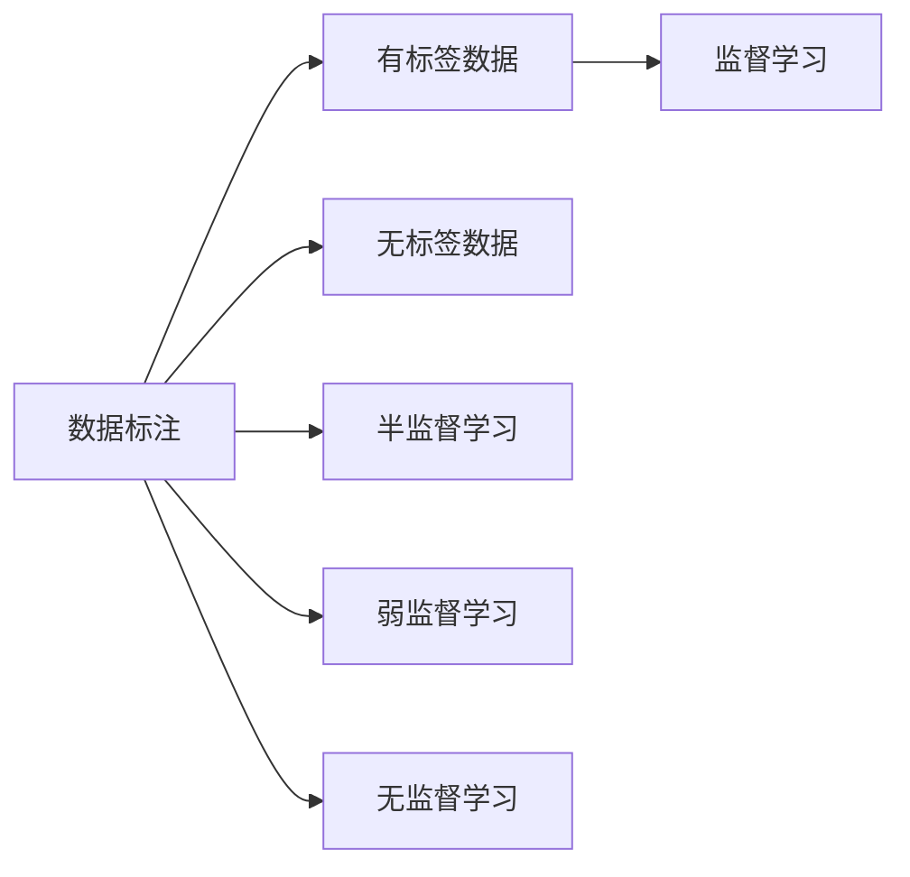

                 

# 数据标注：人工智能发展背后的无名功臣

> 关键词：数据标注,人工智能,机器学习,深度学习,自然语言处理,计算机视觉,机器学习算法,数据质量,标注规范,工具和资源

## 1. 背景介绍

### 1.1 问题由来

在人工智能(AI)发展迅猛的今天，从语音识别到图像分类，从自然语言处理到推荐系统，深度学习算法在各个领域都取得了卓越的成就。然而，背后支撑这些模型性能突破的关键力量，往往不是复杂的模型架构或尖端算法，而是容易被忽视的**数据标注**工作。

数据标注是指通过对原始数据添加标签（即“标注”），为机器学习模型提供训练所需的有标签样本的过程。在训练过程中，模型通过学习这些标签，识别数据中的模式和规律，从而实现对数据的分类、识别或生成。标注数据的质量直接影响到模型学习的效果和应用表现。但这项幕后工作往往被视为繁琐、重复且不引人注目的，很少受到公众和媒体的关注。

### 1.2 问题核心关键点

数据标注是人工智能技术实现从理论到应用的重要环节。一个模型性能的好坏，往往取决于所训练数据的质量和数量。高质量的标注数据不仅能够帮助模型快速收敛，提高预测准确度，还能增强模型的泛化能力，使其在实际应用中表现更为稳定。

然而，数据标注也面临着诸多挑战：

- **标注成本高**：高精度的标注通常需要专业标注员进行，成本昂贵，且耗时耗力。
- **标注质量参差不齐**：标注员的主观差异、标准不统一、标注过程中的人为错误等问题，可能导致数据质量不稳定。
- **标注数据获取难**：某些领域（如医疗、法律）的标注数据获取难度大，标注样本数量有限。
- **标注效率低**：大规模数据集的高效标注需要高效的工具和流程支持，传统方式难以应对海量数据标注任务。

这些问题的存在，极大地影响了人工智能技术的推广和应用，也对研究者的研究方向提出了新的挑战。本文将系统介绍数据标注的原理和实践，探讨其在人工智能发展中的关键作用，并展望未来的发展方向。

## 2. 核心概念与联系

### 2.1 核心概念概述

为更好理解数据标注在人工智能中的角色，本节将介绍几个核心概念：

- **数据标注**：指通过对原始数据添加标签（即“标注”），为机器学习模型提供训练所需的有标签样本的过程。
- **有标签数据**：指通过标注员人工标注的、带有标签的数据，供模型训练使用。
- **无标签数据**：指未被标注的原始数据，需要通过自动化的方式进行标注或与标注数据结合。
- **监督学习**：一种机器学习方法，通过有标签数据进行训练，使得模型能够预测未知数据标签。
- **半监督学习**：结合有标签和无标签数据进行训练，增强模型的泛化能力。
- **弱监督学习**：使用粗粒度标注数据进行训练，适用于标注成本高、标注数据少的场景。
- **无监督学习**：仅使用无标签数据进行训练，通过模型自身学习规律和特征。

这些概念之间通过标注数据这一核心环节紧密相连，共同构成了机器学习模型的训练基础。

### 2.2 核心概念原理和架构的 Mermaid 流程图



这个流程图展示了数据标注在机器学习中的重要地位。无论是有监督学习、半监督学习还是无监督学习，数据标注都是核心环节。标注数据的质量直接影响到模型性能的好坏，是机器学习技术实现落地应用的重要保障。

## 3. 核心算法原理 & 具体操作步骤

### 3.1 算法原理概述

数据标注的本质是给原始数据添加标签，使其成为训练模型所需的有标签样本。这一过程包括两个主要步骤：

1. **数据收集**：获取原始数据，可以是文本、图像、音频等。
2. **数据标注**：对原始数据进行标注，生成有标签的数据集。

数据标注算法通常分为两类：

- **手动标注**：由人工标注员对数据进行逐个标注，生成带有标签的数据集。
- **自动化标注**：通过机器学习算法自动对数据进行标注，生成初步的标注结果，再由人工进行复审和修正。

### 3.2 算法步骤详解

#### 3.2.1 数据收集

数据收集是数据标注的第一步。通常情况下，数据收集可以通过以下方式实现：

1. **公开数据集**：利用已有的公共数据集，如ImageNet、COCO、Wiener Mobile Lab等，作为标注数据源。
2. **爬虫技术**：使用爬虫技术从互联网抓取数据，如网页内容、图片、视频等。
3. **数据捐赠**：从研究机构、企业、政府等处获取捐赠的数据，用于标注任务。
4. **传感器数据**：通过传感器、日志文件等实时采集数据。

#### 3.2.2 数据标注

数据标注是数据标注的核心环节。这一过程可以分为以下步骤：

1. **标注定义**：确定标注类型和标注标准。如在自然语言处理领域，常见的标注类型包括词性标注、命名实体识别、情感分析等。
2. **标注工具**：使用标注工具进行数据标注。常见的标注工具包括Labelbox、Prodigy、CVAT等。
3. **标注审核**：对标注结果进行审核，确保标注质量。通常需要多轮审核，涉及标注员、审核员和项目经理等角色。
4. **标注存储**：将标注结果存储到标注工具中，形成标注数据集。

### 3.3 算法优缺点

数据标注作为一种重要的预处理环节，具有以下优点：

- **提高模型性能**：标注数据提供有标签样本，使得模型能够更准确地学习数据特征，提高预测性能。
- **增强模型泛化**：通过使用标注数据，模型能够适应不同的数据分布，提升泛化能力。
- **降低模型偏差**：标注数据的存在，使得模型在训练过程中能够更全面地考虑各种情况，减少偏差。

然而，数据标注也存在一些缺点：

- **成本高**：高质量的标注数据通常需要人工标注，成本较高。
- **时间耗长**：数据标注是一个劳动密集型过程，需要大量人力和时间。
- **质量不稳定**：标注过程中可能存在标注员主观差异、标准不统一等问题，导致标注质量不稳定。

### 3.4 算法应用领域

数据标注的应用领域非常广泛，涵盖了自然语言处理、计算机视觉、语音识别、推荐系统等多个领域。

- **自然语言处理**：文本分类、命名实体识别、情感分析、机器翻译等任务都需要标注数据进行训练。
- **计算机视觉**：图像分类、目标检测、语义分割、场景理解等任务依赖标注数据。
- **语音识别**：语音转文字、文本语音合成、情感识别等任务需要标注数据支持。
- **推荐系统**：用户行为分析、物品推荐、广告投放等任务需要标注数据辅助训练。

## 4. 数学模型和公式 & 详细讲解 & 举例说明

### 4.1 数学模型构建

在机器学习模型中，数据标注是训练过程的重要环节。假设我们有一个由 $n$ 个样本组成的训练集，每个样本由输入 $x$ 和对应的标签 $y$ 组成。训练模型的目标是找到一个最优的参数 $\theta$，使得模型 $f_\theta$ 能够准确预测输入 $x$ 对应的标签 $y$。

假设模型 $f_\theta$ 是线性的，则训练目标为：

$$
\min_{\theta} \frac{1}{n} \sum_{i=1}^n \ell(f_\theta(x_i), y_i)
$$

其中 $\ell$ 为损失函数，通常使用交叉熵损失函数：

$$
\ell(f_\theta(x_i), y_i) = -y_i \log f_\theta(x_i) - (1-y_i) \log (1 - f_\theta(x_i))
$$

### 4.2 公式推导过程

在线性回归中，假设模型 $f_\theta(x) = \theta^T x$，其中 $x$ 是输入特征向量，$\theta$ 是参数向量。我们的目标是最小化损失函数：

$$
L(\theta) = \frac{1}{n} \sum_{i=1}^n (y_i - f_\theta(x_i))^2
$$

对损失函数求导，得：

$$
\frac{\partial L(\theta)}{\partial \theta} = \frac{2}{n} \sum_{i=1}^n (y_i - f_\theta(x_i)) x_i
$$

令 $\frac{\partial L(\theta)}{\partial \theta} = 0$，解得：

$$
\theta = (\frac{1}{n} \sum_{i=1}^n x_i x_i^T)^{-1} \sum_{i=1}^n x_i y_i
$$

即最小二乘法解。

### 4.3 案例分析与讲解

以文本分类为例，训练一个分类模型需要标注数据集 $\{(x_i, y_i)\}_{i=1}^N$，其中 $x_i$ 为输入文本，$y_i$ 为文本所属的类别。假设模型 $f_\theta$ 为线性分类器，其输出 $f_\theta(x)$ 表示文本属于类别 $k$ 的概率。训练目标为最小化交叉熵损失函数：

$$
L(\theta) = -\frac{1}{N} \sum_{i=1}^N \sum_{k=1}^C y_{ik} \log f_\theta(x_i, k)
$$

其中 $C$ 为类别数，$y_{ik}$ 表示文本 $x_i$ 属于类别 $k$ 的标注。

假设 $f_\theta(x)$ 为sigmoid函数，即：

$$
f_\theta(x) = \frac{1}{1+e^{-\theta^T x}}
$$

则训练目标变为：

$$
L(\theta) = -\frac{1}{N} \sum_{i=1}^N \sum_{k=1}^C y_{ik} \log \frac{f_\theta(x_i, k)}{1-f_\theta(x_i, k)}
$$

通过梯度下降算法，可以求得最优参数 $\theta$。

## 5. 项目实践：代码实例和详细解释说明

### 5.1 开发环境搭建

在进行数据标注实践前，我们需要准备好开发环境。以下是使用Python进行PyTorch开发的环境配置流程：

1. 安装Anaconda：从官网下载并安装Anaconda，用于创建独立的Python环境。

2. 创建并激活虚拟环境：
```bash
conda create -n pytorch-env python=3.8 
conda activate pytorch-env
```

3. 安装PyTorch：根据CUDA版本，从官网获取对应的安装命令。例如：
```bash
conda install pytorch torchvision torchaudio cudatoolkit=11.1 -c pytorch -c conda-forge
```

4. 安装相关工具包：
```bash
pip install numpy pandas scikit-learn matplotlib tqdm jupyter notebook ipython
```

5. 安装Labelbox：
```bash
pip install labelbox
```

完成上述步骤后，即可在`pytorch-env`环境中开始数据标注实践。

### 5.2 源代码详细实现

这里我们以文本分类任务为例，给出使用Labelbox进行标注的Python代码实现。

首先，定义文本分类任务的数据处理函数：

```python
from labelbox import LabelboxDataset
import torch

class TextClassificationDataset(LabelboxDataset):
    def __init__(self, data_path, class_names, tokenizer, max_len=128):
        super().__init__(data_path)
        self.tokenizer = tokenizer
        self.class_names = class_names
        self.max_len = max_len
        
    def __getitem__(self, item):
        data = self._data[item]
        text = data['text']
        labels = data['labels']
        
        encoding = self.tokenizer(text, return_tensors='pt', max_length=self.max_len, padding='max_length', truncation=True)
        input_ids = encoding['input_ids'][0]
        attention_mask = encoding['attention_mask'][0]
        
        # 对label进行编码
        encoded_labels = [self.class_names.index(label) for label in labels] 
        encoded_labels.extend([0] * (self.max_len - len(encoded_labels)))
        labels = torch.tensor(encoded_labels, dtype=torch.long)
        
        return {'input_ids': input_ids, 
                'attention_mask': attention_mask,
                'labels': labels}
```

然后，定义模型和优化器：

```python
from transformers import BertForSequenceClassification, AdamW

model = BertForSequenceClassification.from_pretrained('bert-base-cased', num_labels=len(class_names))

optimizer = AdamW(model.parameters(), lr=2e-5)
```

接着，定义训练和评估函数：

```python
from torch.utils.data import DataLoader
from tqdm import tqdm

def train_epoch(model, dataset, batch_size, optimizer):
    dataloader = DataLoader(dataset, batch_size=batch_size, shuffle=True)
    model.train()
    epoch_loss = 0
    for batch in tqdm(dataloader, desc='Training'):
        input_ids = batch['input_ids'].to(device)
        attention_mask = batch['attention_mask'].to(device)
        labels = batch['labels'].to(device)
        model.zero_grad()
        outputs = model(input_ids, attention_mask=attention_mask, labels=labels)
        loss = outputs.loss
        epoch_loss += loss.item()
        loss.backward()
        optimizer.step()
    return epoch_loss / len(dataloader)

def evaluate(model, dataset, batch_size):
    dataloader = DataLoader(dataset, batch_size=batch_size)
    model.eval()
    preds, labels = [], []
    with torch.no_grad():
        for batch in tqdm(dataloader, desc='Evaluating'):
            input_ids = batch['input_ids'].to(device)
            attention_mask = batch['attention_mask'].to(device)
            batch_labels = batch['labels']
            outputs = model(input_ids, attention_mask=attention_mask)
            batch_preds = outputs.logits.argmax(dim=2).to('cpu').tolist()
            batch_labels = batch_labels.to('cpu').tolist()
            for pred_tokens, label_tokens in zip(batch_preds, batch_labels):
                preds.append(pred_tokens[:len(label_tokens)])
                labels.append(label_tokens)
                
    print(classification_report(labels, preds))
```

最后，启动训练流程并在测试集上评估：

```python
epochs = 5
batch_size = 16

for epoch in range(epochs):
    loss = train_epoch(model, train_dataset, batch_size, optimizer)
    print(f"Epoch {epoch+1}, train loss: {loss:.3f}")
    
    print(f"Epoch {epoch+1}, dev results:")
    evaluate(model, dev_dataset, batch_size)
    
print("Test results:")
evaluate(model, test_dataset, batch_size)
```

以上就是使用PyTorch和Labelbox进行文本分类任务数据标注的完整代码实现。可以看到，得益于Labelbox的强大封装，我们可以用相对简洁的代码完成文本分类的标注和模型微调。

### 5.3 代码解读与分析

让我们再详细解读一下关键代码的实现细节：

**TextClassificationDataset类**：
- `__init__`方法：初始化数据路径、类别名、分词器等关键组件。
- `__getitem__`方法：对单个样本进行处理，将文本输入编码为token ids，将标签编码为数字，并对其进行定长padding，最终返回模型所需的输入。

**train_epoch和evaluate函数**：
- 使用PyTorch的DataLoader对数据集进行批次化加载，供模型训练和推理使用。
- 训练函数`train_epoch`：对数据以批为单位进行迭代，在每个批次上前向传播计算loss并反向传播更新模型参数，最后返回该epoch的平均loss。
- 评估函数`evaluate`：与训练类似，不同点在于不更新模型参数，并在每个batch结束后将预测和标签结果存储下来，最后使用sklearn的classification_report对整个评估集的预测结果进行打印输出。

**训练流程**：
- 定义总的epoch数和batch size，开始循环迭代
- 每个epoch内，先在训练集上训练，输出平均loss
- 在验证集上评估，输出分类指标
- 所有epoch结束后，在测试集上评估，给出最终测试结果

可以看到，PyTorch配合Labelbox使得文本分类的标注和模型微调代码实现变得简洁高效。开发者可以将更多精力放在数据处理、模型改进等高层逻辑上，而不必过多关注底层的实现细节。

当然，工业级的系统实现还需考虑更多因素，如模型的保存和部署、超参数的自动搜索、更灵活的任务适配层等。但核心的标注范式基本与此类似。

## 6. 实际应用场景

### 6.1 智能客服系统

基于大语言模型微调的对话技术，可以广泛应用于智能客服系统的构建。传统客服往往需要配备大量人力，高峰期响应缓慢，且一致性和专业性难以保证。而使用微调后的对话模型，可以7x24小时不间断服务，快速响应客户咨询，用自然流畅的语言解答各类常见问题。

在技术实现上，可以收集企业内部的历史客服对话记录，将问题和最佳答复构建成监督数据，在此基础上对预训练对话模型进行微调。微调后的对话模型能够自动理解用户意图，匹配最合适的答案模板进行回复。对于客户提出的新问题，还可以接入检索系统实时搜索相关内容，动态组织生成回答。如此构建的智能客服系统，能大幅提升客户咨询体验和问题解决效率。

### 6.2 金融舆情监测

金融机构需要实时监测市场舆论动向，以便及时应对负面信息传播，规避金融风险。传统的人工监测方式成本高、效率低，难以应对网络时代海量信息爆发的挑战。基于大语言模型微调的文本分类和情感分析技术，为金融舆情监测提供了新的解决方案。

具体而言，可以收集金融领域相关的新闻、报道、评论等文本数据，并对其进行主题标注和情感标注。在此基础上对预训练语言模型进行微调，使其能够自动判断文本属于何种主题，情感倾向是正面、中性还是负面。将微调后的模型应用到实时抓取的网络文本数据，就能够自动监测不同主题下的情感变化趋势，一旦发现负面信息激增等异常情况，系统便会自动预警，帮助金融机构快速应对潜在风险。

### 6.3 个性化推荐系统

当前的推荐系统往往只依赖用户的历史行为数据进行物品推荐，无法深入理解用户的真实兴趣偏好。基于大语言模型微调技术，个性化推荐系统可以更好地挖掘用户行为背后的语义信息，从而提供更精准、多样的推荐内容。

在实践中，可以收集用户浏览、点击、评论、分享等行为数据，提取和用户交互的物品标题、描述、标签等文本内容。将文本内容作为模型输入，用户的后续行为（如是否点击、购买等）作为监督信号，在此基础上微调预训练语言模型。微调后的模型能够从文本内容中准确把握用户的兴趣点。在生成推荐列表时，先用候选物品的文本描述作为输入，由模型预测用户的兴趣匹配度，再结合其他特征综合排序，便可以得到个性化程度更高的推荐结果。

### 6.4 未来应用展望

随着大语言模型和微调方法的不断发展，基于微调范式将在更多领域得到应用，为传统行业带来变革性影响。

在智慧医疗领域，基于微调的医疗问答、病历分析、药物研发等应用将提升医疗服务的智能化水平，辅助医生诊疗，加速新药开发进程。

在智能教育领域，微调技术可应用于作业批改、学情分析、知识推荐等方面，因材施教，促进教育公平，提高教学质量。

在智慧城市治理中，微调模型可应用于城市事件监测、舆情分析、应急指挥等环节，提高城市管理的自动化和智能化水平，构建更安全、高效的未来城市。

此外，在企业生产、社会治理、文娱传媒等众多领域，基于大模型微调的人工智能应用也将不断涌现，为NLP技术带来新的突破。随着预训练模型和微调方法的持续演进，相信NLP技术将在更广阔的应用领域大放异彩。

## 7. 工具和资源推荐

### 7.1 学习资源推荐

为了帮助开发者系统掌握数据标注的原理和实践，这里推荐一些优质的学习资源：

1. 《深度学习与自然语言处理》课程：斯坦福大学开设的NLP明星课程，涵盖了从基础到前沿的自然语言处理技术，推荐给所有对NLP感兴趣的开发者。

2. Labelbox官方文档：提供全面的Labelbox使用指南和案例教程，涵盖数据标注、模型训练、部署等全流程。

3. DataCamp：提供丰富的在线数据科学和机器学习课程，包括数据标注、数据清洗、特征工程等关键技能。

4. Coursera和Udacity：提供多种数据标注相关的在线课程，涵盖数据标注、机器学习、深度学习等多个方向。

5. 《标注与数据预处理：自然语言处理应用实战》书籍：全面介绍了数据标注和数据预处理的实践技巧，提供了丰富的代码示例和项目案例。

通过对这些资源的学习实践，相信你一定能够快速掌握数据标注的精髓，并用于解决实际的NLP问题。

### 7.2 开发工具推荐

高效的开发离不开优秀的工具支持。以下是几款用于数据标注开发的常用工具：

1. Labelbox：强大的标注平台，支持文本、图像、视频等多模态数据标注，提供自动化标注和人工审核机制，高效易用。

2. Prodigy：基于PyTorch和HuggingFace的标注平台，支持动态标注、自动化标注和模型训练，界面友好。

3. CVAT：基于Web的标注平台，支持图像、视频、深度学习框架等，功能强大，支持多种数据标注工作流程。

4. HoloLabelbox：一个开源的标签管理工具，支持多种标注格式和数据源，适合小规模标注任务。

5. OpenCV：开源计算机视觉库，支持图像、视频标注，提供丰富的图像处理算法。

合理利用这些工具，可以显著提升数据标注的效率和质量，加快模型训练和部署的速度。

### 7.3 相关论文推荐

数据标注作为机器学习的重要预处理环节，一直是学界和产业界研究的焦点。以下是几篇奠基性的相关论文，推荐阅读：

1. "Labelbox: Your Computer Vision Data Labeling Partner"：介绍Labelbox平台的设计理念和应用场景，提供了丰富的标注示例和案例。

2. "A Survey on Data Annotation for AI and Data Science"：综述了数据标注在AI和数据科学中的研究进展和应用场景，涵盖文本、图像、音频等多种数据类型。

3. "Data Annotation as a Service for Natural Language Processing"：讨论了NLP领域中数据标注的现状、挑战和解决方案，提供了丰富的标注工具和平台。

4. "Data Annotation Workflow: A Survey and Future Challenges"：综述了数据标注的工作流程、技术和挑战，提出了未来的研究方向和改进建议。

5. "Efficient Data Annotation: A Review"：讨论了数据标注的效率提升方法，包括自动化标注、协同标注和众包标注等。

这些论文代表了大数据标注领域的最新研究进展，通过学习这些前沿成果，可以帮助研究者把握学科前进方向，激发更多的创新灵感。

## 8. 总结：未来发展趋势与挑战

### 8.1 研究成果总结

本文对数据标注在人工智能中的作用进行了全面系统的介绍。首先阐述了数据标注的重要性，以及其在人工智能技术实现中的核心地位。其次，从原理到实践，详细讲解了数据标注的数学模型和实现细节，提供了完整的代码示例。同时，本文还广泛探讨了数据标注在多个领域的应用前景，展示了其广阔的发展空间。最后，本文精选了数据标注领域的优质学习资源和开发工具，力求为读者提供全方位的技术指引。

通过本文的系统梳理，可以看到，数据标注作为人工智能技术的重要预处理环节，其重要性不容忽视。无论是有监督学习、半监督学习还是无监督学习，数据标注都是不可替代的关键步骤。只有标注数据质量高、数量充足，才能真正发挥人工智能技术的潜力，推动技术的落地应用。

### 8.2 未来发展趋势

展望未来，数据标注技术将呈现以下几个发展趋势：

1. **自动化标注技术发展**：自动化标注技术正在不断进步，越来越多的自动标注方法被应用于实践。如利用预训练模型对文本进行分类，自动生成标注结果。
2. **跨领域数据共享**：随着数据标注技术的不断发展，跨领域的标注数据共享将变得更加容易，有助于提升模型泛化能力。
3. **协同标注和众包标注**：利用协同标注和众包标注技术，可以大幅提升标注效率和质量，降低标注成本。
4. **标注数据质量提升**：利用标注数据清洗和增强技术，可以提升标注数据的质量，减少标注误差。
5. **数据标注标准化**：建立统一的数据标注标准，有助于提高数据标注的规范性和一致性，便于数据共享和复用。

这些趋势将推动数据标注技术的发展，提升标注数据的质量和效率，为人工智能技术的落地应用提供坚实的基础。

### 8.3 面临的挑战

尽管数据标注技术在不断进步，但在实际应用中仍面临诸多挑战：

1. **标注成本高**：高质量的标注数据需要大量人力和时间，成本较高。
2. **标注质量不稳定**：标注过程中可能存在标注员主观差异、标准不统一等问题，导致标注质量不稳定。
3. **标注数据获取难**：某些领域（如医疗、法律）的标注数据获取难度大，标注样本数量有限。
4. **标注效率低**：大规模数据集的高效标注需要高效的工具和流程支持，传统方式难以应对海量数据标注任务。

这些问题的存在，极大地影响了人工智能技术的推广和应用，也对研究者的研究方向提出了新的挑战。

### 8.4 研究展望

面对数据标注面临的挑战，未来的研究需要在以下几个方面寻求新的突破：

1. **自动化标注技术**：进一步提升自动化标注的精度和可靠性，减少对人工标注的依赖。
2. **跨领域标注方法**：开发跨领域的数据标注方法，提升模型的泛化能力。
3. **数据标注标准化**：建立统一的数据标注标准，提升标注数据的质量和规范性。
4. **标注数据增强**：利用数据增强技术，提升标注数据的多样性和覆盖面。
5. **协同标注和众包标注**：利用协同标注和众包标注技术，提升标注效率和质量。

这些研究方向将推动数据标注技术的进步，提升标注数据的质量和效率，为人工智能技术的落地应用提供坚实的基础。

## 9. 附录：常见问题与解答

**Q1：如何判断标注数据的质量？**

A: 判断标注数据质量主要从以下几个方面进行：

1. **标注规范性**：标注数据是否遵循统一的标准，如词性标注、命名实体识别等。
2. **标注一致性**：不同标注员对同一数据的标注结果是否一致，是否存在明显的歧义。
3. **标注准确性**：标注数据是否准确反映了原始数据的意图和内容，是否存在明显的标注错误。

可以使用一些工具和算法对标注数据进行评估，如使用BLEU、ROUGE等指标评估文本分类标注质量，使用IoU等指标评估图像分割标注质量。

**Q2：如何处理标注数据中的噪声和错误？**

A: 标注数据中的噪声和错误是常见问题，通常需要采用以下方法进行处理：

1. **数据清洗**：使用数据清洗技术，如去除无关数据、修正错误标注等，提高标注数据的质量。
2. **人工审核**：对标注数据进行人工审核，修正错误标注，确保标注数据的质量。
3. **众包标注**：利用众包平台，收集多标注员的数据，综合多人的标注结果，减少标注误差。
4. **自动化校正**：利用预训练模型对标注数据进行自动化校正，减少标注误差。

这些方法可以结合使用，提升标注数据的准确性和一致性。

**Q3：如何高效标注大规模数据集？**

A: 标注大规模数据集通常需要高效的标注工具和流程支持，以下是一些常用的方法：

1. **批量标注**：使用批量标注工具，如Labelbox、Prodigy等，提高标注效率。
2. **自动化标注**：利用预训练模型对数据进行自动化标注，减少人工标注的工作量。
3. **众包标注**：利用众包平台，如Amazon Mechanical Turk，收集多标注员的数据，提高标注效率。
4. **分布式标注**：利用分布式标注系统，将标注任务分配到多个标注员，提高标注效率。

这些方法可以结合使用，大幅提升大规模数据集的标注效率。

---

作者：禅与计算机程序设计艺术 / Zen and the Art of Computer Programming

