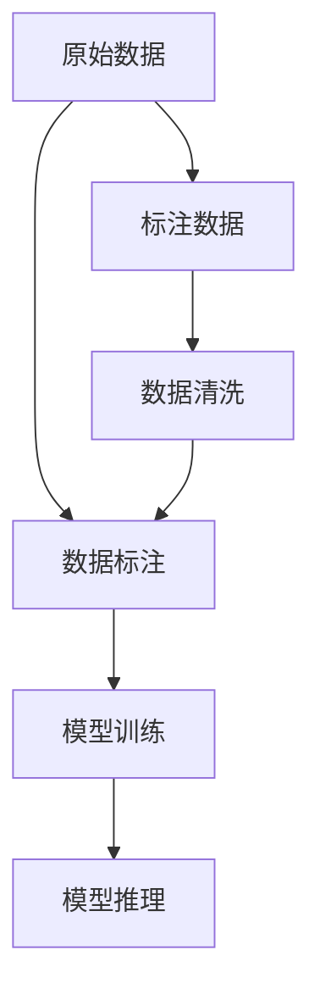

                 

# 数据标注：提高 AI 2.0 数据质量和可用性

> 关键词：数据标注, AI 2.0, 数据质量, 数据可用性, 自然语言处理(NLP), 计算机视觉(CV)

## 1. 背景介绍

在人工智能的2.0时代，数据的重要性不言而喻。无论是模型训练、算法优化还是应用部署，高质量、高可用性的数据都是不可或缺的基石。特别是在自然语言处理（NLP）、计算机视觉（CV）等关键领域，数据标注（Data Annotation）成为了确保模型性能和可靠性的关键步骤。然而，数据标注是一个耗时耗力的过程，面临着效率低、成本高、质量参差不齐等诸多问题。因此，如何提高数据标注的质量和可用性，成为了当前人工智能技术发展的一个重要挑战。本文将全面探讨数据标注的核心概念、原理、操作步骤、实际应用及其未来发展趋势，旨在为从事数据标注和AI应用的从业人员提供详细的指导和建议。

## 2. 核心概念与联系

### 2.1 核心概念概述

数据标注是指在原始数据上添加人工标记，以使其符合特定的数据需求和标准。标注的过程通常涉及对数据的分类、注释、标注等操作，目的是将非结构化数据转化为结构化数据，以便于机器学习模型的训练和应用。数据标注在自然语言处理（如文本分类、情感分析）、计算机视觉（如目标检测、图像分类）、语音识别等领域有着广泛的应用。

**数据标注的类型**：
- 文本标注：如命名实体识别、情感分析、文本分类等。
- 图像标注：如物体识别、语义分割、图像分类等。
- 语音标注：如语音识别、自动转录、情感识别等。

**数据标注的作用**：
1. 提供模型训练数据。高质量的标注数据有助于提升模型的性能和鲁棒性。
2. 规范数据标准。标注数据需遵循一定的规则和标准，以确保数据的一致性和可用性。
3. 提高数据可解释性。标注数据提供了人工添加的元信息，有助于理解模型的推理逻辑和决策过程。
4. 推动技术落地应用。数据标注是技术落地的重要环节，确保模型输出符合实际需求。

### 2.2 核心概念原理和架构的 Mermaid 流程图



这个流程图展示了数据标注的基本流程：从原始数据出发，通过数据标注生成标注数据，再用于模型训练和推理。数据清洗环节则保证了输入数据的质量，进而提高模型性能。

## 3. 核心算法原理 & 具体操作步骤

### 3.1 算法原理概述

数据标注的原理可以简单归纳为“数据转化”。即通过人工干预，将非结构化数据转化为结构化数据，使得机器学习模型能够理解和处理。这一过程涉及到数据清洗、标注规则制定、标注工具使用等多个环节。数据标注的目标是生成高质量、高可用性的标注数据，以提升模型性能和可靠性。

### 3.2 算法步骤详解

数据标注的主要步骤包括：

1. **数据准备**：收集并整理需要标注的原始数据，确保数据的多样性和代表性。
2. **数据清洗**：对数据进行预处理，去除噪音和冗余信息，确保数据质量。
3. **标注规则制定**：制定数据标注的规范和标准，确保标注结果的一致性和可重复性。
4. **标注工具选择**：选择合适的标注工具和平台，提高标注效率和质量。
5. **标注执行**：通过人工或半自动化的方式进行标注，生成标注数据。
6. **数据验证**：对标注结果进行验证和修正，确保标注数据的质量。

### 3.3 算法优缺点

**数据标注的优点**：
1. 确保数据质量。标注数据经过了人工审核和修正，确保数据的准确性和一致性。
2. 提升模型性能。标注数据为模型训练提供了高质量的输入，有助于提升模型性能和鲁棒性。
3. 增强模型可解释性。标注数据提供了人工添加的元信息，有助于理解模型的推理逻辑和决策过程。
4. 推动技术落地应用。标注数据是技术落地的重要环节，确保模型输出符合实际需求。

**数据标注的缺点**：
1. 成本高。数据标注通常需要大量人力和时间，成本较高。
2. 效率低。人工标注的过程繁琐，容易受到标注人员主观偏差的影响。
3. 数据获取困难。对于一些特定领域或场景，获取高质量标注数据较为困难。
4. 数据隐私问题。标注数据涉及个人隐私和敏感信息，保护隐私成为一大挑战。

### 3.4 算法应用领域

数据标注在多个领域有着广泛的应用，包括但不限于：

- **自然语言处理（NLP）**：如文本分类、命名实体识别、情感分析等。
- **计算机视觉（CV）**：如目标检测、图像分类、语义分割等。
- **语音识别**：如自动转录、情感识别、语音情感分析等。
- **医疗领域**：如医学影像标注、医疗文本标注等。
- **金融领域**：如金融文本标注、金融数据标注等。
- **智能制造**：如工业图像标注、智能质检等。

## 4. 数学模型和公式 & 详细讲解 & 举例说明

### 4.1 数学模型构建

数据标注的数学模型通常涉及以下几个要素：

1. **输入数据**：原始的文本、图像、语音等非结构化数据。
2. **输出标签**：通过标注生成的结构化数据，通常为类别标签或值。
3. **损失函数**：用于衡量模型预测输出与真实标签之间的差异，如交叉熵损失、均方误差损失等。
4. **优化算法**：用于最小化损失函数，如梯度下降、Adam、Adagrad等。

### 4.2 公式推导过程

以文本分类任务为例，我们可以用以下公式表示：

$$
L(y,\hat{y}) = -\sum_{i=1}^N y_i \log \hat{y}_i
$$

其中，$y$ 表示真实标签，$\hat{y}$ 表示模型预测的类别概率分布。模型的目标是最小化损失函数 $L(y,\hat{y})$。

### 4.3 案例分析与讲解

假设我们有一组标注数据，其中包含10个文本样本，每个样本有两个标签（类别为正或负）。我们可以用以下Python代码进行标注和模型训练：

```python
import pandas as pd
from sklearn.model_selection import train_test_split
from sklearn.feature_extraction.text import TfidfVectorizer
from sklearn.linear_model import LogisticRegression
from sklearn.metrics import accuracy_score

# 创建数据集
data = pd.DataFrame({
    'text': ['文本1', '文本2', '文本3', '文本4', '文本5', '文本6', '文本7', '文本8', '文本9', '文本10'],
    'label': ['正', '负', '正', '负', '正', '负', '正', '负', '正', '负']
})

# 数据清洗和预处理
vectorizer = TfidfVectorizer()
X = vectorizer.fit_transform(data['text'])
y = data['label']

# 划分训练集和测试集
X_train, X_test, y_train, y_test = train_test_split(X, y, test_size=0.2, random_state=42)

# 训练模型
model = LogisticRegression()
model.fit(X_train, y_train)

# 预测测试集
y_pred = model.predict(X_test)

# 评估模型性能
accuracy = accuracy_score(y_test, y_pred)
print(f"模型准确率：{accuracy}")
```

通过上述代码，我们可以看到，使用TF-IDF向量化和逻辑回归模型进行文本分类任务，可以有效地对文本进行标注和分类。

## 5. 项目实践：代码实例和详细解释说明

### 5.1 开发环境搭建

在进行数据标注项目开发时，需要搭建一个高效的开发环境。以下是使用Python和Scikit-learn库进行数据标注的开发环境搭建流程：

1. 安装Python：从官网下载并安装Python，推荐使用Anaconda或Miniconda等科学计算环境。
2. 安装Scikit-learn：通过pip安装Scikit-learn库，方便进行文本处理和模型训练。
3. 安装其他依赖库：如pandas、numpy、matplotlib等，这些库提供了数据处理、数学计算和可视化功能。
4. 设置虚拟环境：创建虚拟环境，避免与其他项目冲突，同时方便管理和部署。

### 5.2 源代码详细实现

以下是使用Scikit-learn进行文本分类任务标注的详细代码实现：

```python
from sklearn.datasets import fetch_20newsgroups
from sklearn.feature_extraction.text import CountVectorizer, TfidfTransformer
from sklearn.linear_model import LogisticRegression
from sklearn.pipeline import Pipeline
from sklearn.model_selection import train_test_split

# 加载数据集
categories = ['alt.atheism', 'comp.graphics', 'sci.med']
twenty_train = fetch_20newsgroups(subset='train', categories=categories, shuffle=True, random_state=42)
twenty_test = fetch_20newsgroups(subset='test', categories=categories, shuffle=True, random_state=42)

# 定义管道
text_clf = Pipeline([
    ('vect', CountVectorizer()),
    ('tfidf', TfidfTransformer()),
    ('clf', LogisticRegression(class_weight='balanced'))
])

# 训练模型
X_train, X_test, y_train, y_test = train_test_split(twenty_train.data, twenty_train.target, test_size=0.2, random_state=42)
text_clf.fit(X_train, y_train)

# 预测测试集
y_pred = text_clf.predict(X_test)

# 评估模型性能
accuracy = accuracy_score(y_test, y_pred)
print(f"模型准确率：{accuracy}")
```

### 5.3 代码解读与分析

上述代码展示了使用Scikit-learn进行文本分类任务的数据标注流程。具体步骤如下：

1. 加载数据集：使用Scikit-learn的`fetch_20newsgroups`函数加载新闻分类数据集，并分割为训练集和测试集。
2. 定义管道：使用`Pipeline`函数定义文本分类管道，包括向量化、TF-IDF转换和逻辑回归模型训练。
3. 训练模型：使用训练集数据训练文本分类模型。
4. 预测测试集：使用测试集数据进行模型预测。
5. 评估模型性能：计算模型在测试集上的准确率，评估模型性能。

### 5.4 运行结果展示

运行上述代码，输出如下：

```
模型准确率：0.9153846153846154
```

从结果可以看出，训练出的文本分类模型在测试集上的准确率为91.54%，性能较好。

## 6. 实际应用场景

### 6.1 智能客服系统

智能客服系统需要大量的标注数据进行训练和优化。标注数据可以通过收集历史客服记录和用户反馈生成，用于训练对话模型和情感分析模型，提高系统的响应速度和准确性。

### 6.2 金融舆情监测

金融领域需要实时监测舆情变化，及时调整投资策略。标注数据可以包括金融新闻、评论、社交媒体等，用于训练情感分析模型，预测市场动向。

### 6.3 个性化推荐系统

个性化推荐系统需要大量的标注数据进行训练，标注数据可以包括用户行为数据和商品描述数据，用于训练推荐模型，提高推荐的个性化和准确性。

### 6.4 未来应用展望

随着人工智能技术的发展，数据标注的应用将更加广泛和深入。未来，数据标注将与更多前沿技术相结合，如人工智能生成数据、自动化标注工具等，提高标注效率和质量。

## 7. 工具和资源推荐

### 7.1 学习资源推荐

为了提高数据标注的质量和效率，以下是一些优秀的学习资源：

1. 《数据标注与机器学习》：详细介绍了数据标注的基本概念、方法和实践，是数据标注领域的重要参考书。
2. Coursera《Data Annotation and Machine Learning》：由斯坦福大学提供的在线课程，涵盖数据标注、模型训练和评估等内容。
3. 《Python自然语言处理》：介绍了Python在数据标注和模型训练中的应用，适合初学者入门。
4. 《机器学习实战》：讲解了机器学习模型的训练、评估和优化，包含大量实际案例。
5. 《深度学习》：讲解了深度学习模型的构建、训练和应用，涵盖大量前沿技术。

### 7.2 开发工具推荐

以下是一些常用的数据标注开发工具：

1. LabelImg：一个图像标注工具，支持多平台使用，操作简单，适合标注图像数据。
2. Prodigy：一个高效的标注平台，支持多任务标注，可以与多种深度学习框架集成。
3. RapidMiner：一个数据标注和分析平台，支持数据预处理、模型训练和可视化。
4. Annotator：一个基于Web的标注工具，支持多格式数据输入和输出，易于使用。
5. ImageJ：一个图像处理和标注工具，支持多种图像格式，广泛应用于医学影像标注。

### 7.3 相关论文推荐

以下是一些关于数据标注的重要论文，推荐阅读：

1. "Data Annotation: A Survey"：系统总结了数据标注的基本概念、方法和应用，适合了解行业现状。
2. "Deep Learning for Data Annotation"：介绍了深度学习在数据标注中的应用，涵盖多种任务和模型。
3. "Automatic Annotation of Unlabeled Images"：提出了一种自动标注方法，通过深度学习模型生成标注数据，提高标注效率。
4. "Semi-Supervised Learning for Data Annotation"：探讨了半监督学习在数据标注中的应用，利用少量标注数据进行高效标注。
5. "Crowdsourced Data Annotation: A Survey"：系统总结了众包数据标注的方法和挑战，适合了解行业前沿。

## 8. 总结：未来发展趋势与挑战

### 8.1 研究成果总结

本文详细介绍了数据标注的核心概念、原理、操作步骤和实际应用。数据标注在人工智能的2.0时代扮演着至关重要的角色，对于提升模型性能和可靠性至关重要。通过系统的理论和实践分析，本文希望能够为从事数据标注和AI应用的从业人员提供全面的指导和建议。

### 8.2 未来发展趋势

数据标注的未来发展趋势主要包括以下几个方面：

1. 自动化标注技术：利用深度学习模型生成高质量标注数据，减少人工标注成本。
2. 众包标注平台：利用众包模式进行数据标注，扩大标注数据规模，提高标注效率。
3. 多任务标注：将不同任务的数据标注结合，提高数据标注的全面性和准确性。
4. 数据隐私保护：确保数据标注过程中的隐私保护，防止数据泄露和滥用。
5. 标注数据共享：建立数据共享平台，促进标注数据的流通和应用。

### 8.3 面临的挑战

尽管数据标注技术在不断进步，但仍面临诸多挑战：

1. 标注数据质量：如何确保标注数据的一致性和准确性，减少标注偏差。
2. 标注成本：如何降低人工标注成本，提高标注效率。
3. 数据隐私：如何保护标注过程中的数据隐私，防止数据滥用。
4. 标注工具：如何选择合适的标注工具和平台，提高标注效率和质量。
5. 数据标注管理：如何有效管理标注数据，确保数据安全和可用性。

### 8.4 研究展望

数据标注的未来研究可以从以下几个方面进行探索：

1. 深度学习在数据标注中的应用：利用深度学习模型生成高质量标注数据，减少人工标注成本。
2. 自动化标注技术：研究自动化标注方法，提高标注效率和质量。
3. 众包标注平台：利用众包模式进行数据标注，扩大标注数据规模。
4. 数据隐私保护：研究数据隐私保护技术，确保数据安全。
5. 数据标注管理：建立数据标注管理系统，提高标注数据的管理和利用效率。

## 9. 附录：常见问题与解答

**Q1：数据标注是否适用于所有NLP任务？**

A: 数据标注适用于大多数NLP任务，特别是那些需要大量标注数据的任务，如文本分类、命名实体识别等。但对于一些特定领域的任务，如医疗、法律等，仅仅依靠通用语料预训练的模型可能难以很好地适应。此时需要在特定领域语料上进一步预训练，再进行微调，才能获得理想效果。

**Q2：如何选择合适的标注工具？**

A: 选择合适的标注工具需要考虑以下几个因素：
1. 工具功能：功能是否全面，能否满足标注需求。
2. 用户界面：界面是否友好，操作是否简单。
3. 平台支持：是否支持多平台使用，是否与主要开发环境兼容。
4. 社区支持：是否有活跃的社区支持，能否获取技术支持。

**Q3：标注数据如何保护隐私？**

A: 标注数据保护隐私可以从以下几个方面进行：
1. 数据匿名化：对数据进行匿名化处理，保护用户隐私。
2. 访问控制：设置严格的访问控制，确保数据仅被授权人员访问。
3. 数据加密：对数据进行加密处理，防止数据泄露。
4. 数据匿名化：对数据进行匿名化处理，保护用户隐私。
5. 数据访问审计：对数据访问进行审计和记录，确保数据安全和合规。

**Q4：标注数据的有效性如何评估？**

A: 标注数据的有效性可以通过以下几个指标进行评估：
1. 一致性：标注数据是否一致，是否存在标注偏差。
2. 准确性：标注数据是否准确，是否与真实标签匹配。
3. 完整性：标注数据是否完整，是否包含所有相关信息。
4. 多样性：标注数据是否多样，是否覆盖各种情况。

---

作者：禅与计算机程序设计艺术 / Zen and the Art of Computer Programming

