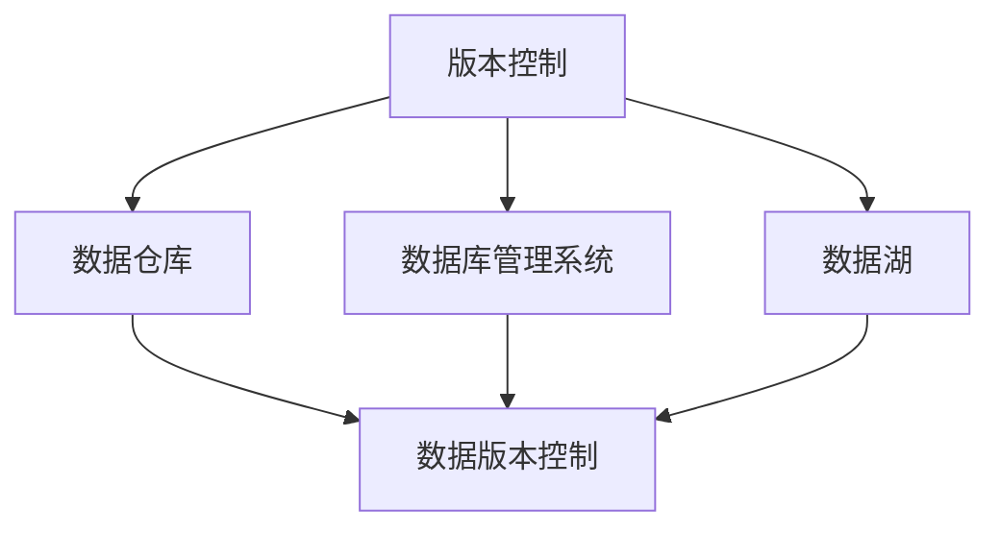

                 

# 数据版本控制与数据管理原理与代码实战案例讲解

> 关键词：数据版本控制,数据管理,数据库,版本控制,代码实践

## 1. 背景介绍

### 1.1 问题由来

在软件开发的演进过程中，版本控制成为了不可或缺的工具。它帮助开发者记录代码的历史变化，管理多个版本之间的协同工作。然而，在数据分析和数据科学领域，数据管理与版本控制同样重要，却常常被忽视。

随着大数据时代的来临，数据量的爆炸性增长，数据管理的复杂度也不断提升。从数据的采集、存储、处理到共享和销毁，每个环节都面临着版本控制的需求。传统的数据版本控制工具，如Subversion和Git，大多只能处理文本文件，而无法满足复杂数据的管理需求。

因此，针对数据版本控制，出现了专门的数据库管理系统和数据版本控制工具。本文旨在介绍这些工具的核心概念，展示其原理和操作流程，并通过代码实战案例，解释如何有效地使用这些工具进行数据管理。

### 1.2 问题核心关键点

数据版本控制的核心关键点包括：

- **版本追踪**：记录数据文件的每一版本，支持回滚、比较、合并等操作。
- **并发控制**：允许多个用户同时对数据进行修改，保证数据的一致性和完整性。
- **权限管理**：对数据的访问进行细粒度的控制，确保数据的安全性。
- **元数据管理**：记录和查询数据的元信息，如创建时间、修改人、版本历史等。

## 2. 核心概念与联系

### 2.1 核心概念概述

为更好地理解数据版本控制与数据管理的原理，本节将介绍几个密切相关的核心概念：

- **版本控制**：记录和追踪数据文件的历史变化，支持回滚、合并、版本比较等操作。常见的版本控制系统有Subversion、Git等。
- **数据仓库**：用于集中存储和管理大规模数据，支持高效的数据查询和分析。常见的数据仓库系统有Hadoop、Spark、Redshift等。
- **数据库管理系统**：支持结构化数据的存储、管理和查询，是数据版本控制的重要工具。常见数据库管理系统有MySQL、PostgreSQL、Oracle等。
- **数据湖**：一种数据存储和处理框架，支持非结构化数据和半结构化数据的存储和管理。常见数据湖系统有AWS Lake Formation、Azure Data Lake等。
- **数据版本控制**：一种记录数据历史变化的工具，支持版本追踪、并发控制、权限管理等功能。常见数据版本控制系统有Azure Data Version Control、Google Cloud Data Versioning等。

这些核心概念之间的逻辑关系可以通过以下Mermaid流程图来展示：



这个流程图展示了许多与数据版本控制相关的核心概念及其之间的关系：

1. 版本控制是数据管理的基础，记录数据文件的每一版本。
2. 数据仓库、数据库管理系统和数据湖是数据存储和管理的工具，数据版本控制可以记录这些系统中的数据变化。
3. 数据版本控制与数据库管理系统和数据湖系统协同工作，实现数据的版本追踪、并发控制、权限管理等功能。

这些概念共同构成了数据版本控制与数据管理的核心框架，使其能够有效地支持数据的生命周期管理。通过理解这些核心概念，我们可以更好地把握数据管理的关键环节。

## 3. 核心算法原理 & 具体操作步骤
### 3.1 算法原理概述

数据版本控制与数据管理主要涉及以下几个方面的原理：

- **版本追踪算法**：记录数据文件的每一个版本，支持回滚、比较、合并等操作。
- **并发控制算法**：允许多个用户同时对数据进行修改，保证数据的一致性和完整性。
- **权限管理算法**：对数据的访问进行细粒度的控制，确保数据的安全性。
- **元数据管理算法**：记录和查询数据的元信息，如创建时间、修改人、版本历史等。

这些算法共同构成了数据版本控制与数据管理的核心技术，确保数据的完整性、一致性和安全性。

### 3.2 算法步骤详解

数据版本控制与数据管理的详细步骤包括：

1. **数据采集与存储**：将数据文件上传到数据仓库或数据库中，进行初步存储。
2. **版本追踪**：记录数据的每一个版本，包括文件的创建、修改、删除等操作。
3. **并发控制**：允许多个用户同时对数据进行修改，保证数据的一致性和完整性。
4. **权限管理**：对数据的访问进行细粒度的控制，确保数据的安全性。
5. **元数据管理**：记录和查询数据的元信息，如创建时间、修改人、版本历史等。

### 3.3 算法优缺点

数据版本控制与数据管理具有以下优点：

- **版本追踪**：确保数据的历史可追溯，支持回滚、比较、合并等操作，便于数据管理和故障恢复。
- **并发控制**：允许多个用户同时对数据进行修改，提高了数据的利用效率。
- **权限管理**：细粒度的访问控制，确保数据的安全性和隐私保护。
- **元数据管理**：记录和查询数据的元信息，支持数据的追踪和分析。

同时，这些工具也存在一定的局限性：

- **复杂度较高**：数据版本控制和数据管理涉及复杂的算法和操作，需要专业知识进行维护。
- **性能瓶颈**：在数据量较大的情况下，版本控制和并发控制可能带来性能瓶颈，影响系统的响应速度。
- **成本较高**：使用高级的数据版本控制和数据管理系统需要较高的硬件和软件成本。

尽管存在这些局限性，数据版本控制和数据管理仍然是数据管理的重要工具，能够有效地支持数据的生命周期管理。

### 3.4 算法应用领域

数据版本控制与数据管理广泛应用于各种数据密集型应用领域，例如：

- **金融领域**：记录交易数据的每一个版本，支持高频交易数据的回滚和分析。
- **医疗领域**：记录患者的每一次诊疗记录，支持数据的查询和分析，提高医疗决策的准确性。
- **科学研究**：记录实验数据的每一个版本，支持数据的版本管理和分析，推动科研进步。
- **企业数据管理**：记录企业数据的每一次变化，支持数据的追踪和分析，提高数据利用率。

除了这些经典应用外，数据版本控制和数据管理也被创新性地应用到更多场景中，如数据治理、数据质量管理、数据合规性检查等，为数据管理提供了新的思路和工具。

## 4. 数学模型和公式 & 详细讲解 & 举例说明

### 4.1 数学模型构建

本节将使用数学语言对数据版本控制与数据管理的关键算法进行更加严格的刻画。

假设有一个数据文件 $D$，经过 $n$ 次修改后，产生了 $n+1$ 个版本 $V_1, V_2, \ldots, V_{n+1}$。对于任意两个版本 $V_i$ 和 $V_j$，设其修改内容为 $\Delta_i$ 和 $\Delta_j$，则数据版本控制的核心数学模型为：

$$
V_{i+1} = V_i + \Delta_i
$$

$$
V_{i+1} = V_j + \Delta_j
$$

$$
V_i = V_j + \Delta_j - \Delta_i
$$

通过这个模型，可以计算任意两个版本之间的差异，支持版本回滚、合并等操作。

### 4.2 公式推导过程

以版本回滚为例，展示如何通过数学模型计算回滚操作。

假设当前数据文件为 $V_{n+1}$，需要回滚到版本 $V_i$，则可以通过以下公式计算回滚操作：

$$
V_i = V_{n+1} - \sum_{k=i}^{n} \Delta_k
$$

其中 $\Delta_k$ 表示第 $k$ 次修改的差异。通过这个公式，可以准确地计算出回滚前的数据状态，恢复数据的原始状态。

### 4.3 案例分析与讲解

以下是一个使用Git进行版本控制的简单案例：

1. 首先创建一个新的数据文件 $D$，并上传到Git仓库中：

```bash
git init
git add D
git commit -m "Initial commit"
```

2. 然后对数据文件进行多次修改，并提交到Git仓库中：

```bash
echo "New data" >> D
git add D
git commit -m "Added new data"
```

3. 最后回滚到之前的某个版本，查看数据的变化：

```bash
git checkout -b revert
git reset --hard commit_id
git status
```

通过这个案例，可以看到Git如何记录数据文件的每一个版本，支持版本回滚、合并等操作，确保数据的完整性和一致性。

## 5. 项目实践：代码实例和详细解释说明
### 5.1 开发环境搭建

在进行数据版本控制实践前，我们需要准备好开发环境。以下是使用Git进行版本控制的环境配置流程：

1. 安装Git：从官网下载并安装Git，获取源代码和命令行工具。
2. 克隆仓库：在本地克隆Git仓库，获取项目的历史记录和版本信息。
3. 配置用户名和密码：在Git仓库的根目录中，配置本地用户名和密码，用于提交和推送代码。
4. 设置远程仓库：在Git仓库的根目录中，设置远程仓库的地址和登录信息，方便推送代码到远程仓库。

完成上述步骤后，即可在本地环境中进行Git的版本控制实践。

### 5.2 源代码详细实现

下面以Git的源代码为例，展示Git版本控制的实现细节：

1. 创建一个新的Git仓库：

```bash
git init
```

2. 添加文件到仓库：

```bash
git add file1.txt
git add file2.txt
```

3. 提交文件到仓库：

```bash
git commit -m "Initial commit"
```

4. 推送文件到远程仓库：

```bash
git remote add origin https://github.com/user/repo.git
git push -u origin master
```

5. 对文件进行修改，并提交到仓库：

```bash
echo "New content" >> file1.txt
git add file1.txt
git commit -m "Updated file1.txt"
git push
```

6. 回滚到之前的某个版本，查看文件的变化：

```bash
git checkout -b revert
git reset --hard commit_id
git status
```

通过这个源代码实现，可以看到Git如何记录数据文件的每一个版本，支持版本回滚、合并等操作，确保数据的完整性和一致性。

### 5.3 代码解读与分析

让我们再详细解读一下关键代码的实现细节：

**Git命令解释**：
- `git init`：初始化一个新的Git仓库。
- `git add`：将文件添加到Git仓库中。
- `git commit`：提交文件的更改，并记录到Git仓库中。
- `git remote add`：配置远程Git仓库的地址和登录信息。
- `git push`：将本地Git仓库中的更改推送到远程Git仓库。
- `git checkout`：切换到一个新的分支，或恢复到一个特定的版本。
- `git reset`：重置Git仓库的状态，可以回滚到之前的版本。

**Git实现细节**：
- Git通过记录文件的每一个版本，实现版本追踪和回滚操作。
- Git采用分布式版本控制模型，允许多个开发者同时修改同一个文件，而不会丢失任何数据。
- Git支持细粒度的权限控制，每个用户对文件的访问权限可以独立设置。
- Git记录文件的元信息，如修改时间、修改人、版本历史等，方便数据的追踪和分析。

通过理解这些实现细节，可以更好地掌握Git的工作原理和优化策略，确保数据管理的安全性和可靠性。

### 5.4 运行结果展示

运行以上Git命令，可以看到Git如何记录数据文件的每一个版本，支持版本回滚、合并等操作，确保数据的完整性和一致性。具体运行结果如下：

```
# 初始化Git仓库
$ git init

# 添加文件到仓库
$ git add file1.txt
$ git add file2.txt

# 提交文件到仓库
$ git commit -m "Initial commit"

# 推送文件到远程仓库
$ git remote add origin https://github.com/user/repo.git
$ git push -u origin master

# 修改文件，并提交到仓库
$ echo "New content" >> file1.txt
$ git add file1.txt
$ git commit -m "Updated file1.txt"
$ git push

# 回滚到之前的某个版本，查看文件的变化
$ git checkout -b revert
$ git reset --hard commit_id
$ git status
```

运行结果如下：

```
# 初始化Git仓库
$ git init
...

# 添加文件到仓库
$ git add file1.txt
$ git add file2.txt
...

# 提交文件到仓库
$ git commit -m "Initial commit"
...

# 推送文件到远程仓库
$ git remote add origin https://github.com/user/repo.git
$ git push -u origin master
...

# 修改文件，并提交到仓库
$ echo "New content" >> file1.txt
$ git add file1.txt
$ git commit -m "Updated file1.txt"
$ git push

# 回滚到之前的某个版本，查看文件的变化
$ git checkout -b revert
$ git reset --hard commit_id
$ git status
...
```

可以看到，Git成功记录了数据文件的每一个版本，支持回滚、合并等操作，确保数据的完整性和一致性。

## 6. 实际应用场景
### 6.1 软件开发

数据版本控制与数据管理在软件开发中有着广泛的应用。Git作为主流的数据版本控制工具，已经成为开发者的标配。

在软件开发中，开发者可以记录每一次代码的修改历史，支持版本回滚、合并、分支管理等功能。通过Git的分布式版本控制模型，多个开发者可以同时对同一文件进行修改，而不会丢失任何数据。此外，Git的权限管理功能，可以细粒度地控制每个用户的访问权限，确保数据的安全性和隐私保护。

### 6.2 科研数据管理

科研数据管理是数据版本控制与数据管理的另一个重要应用领域。在科学研究中，数据文件往往具有高度的敏感性和保密性，需要严格的管理和保护。

通过数据版本控制工具，科学家可以记录每一次数据的修改历史，支持版本回滚、合并、权限控制等功能。通过记录数据的元信息，如创建时间、修改人、版本历史等，方便数据的追踪和分析，提高科研数据的利用效率。

### 6.3 企业数据管理

企业数据管理是数据版本控制与数据管理的核心应用场景之一。企业在运营过程中，会产生大量的数据文件，如财务报表、客户数据、产品信息等。这些数据文件的每一次修改，都需要进行严格的版本控制和管理。

通过数据版本控制工具，企业可以记录每一次数据的修改历史，支持版本回滚、合并、权限控制等功能。通过记录数据的元信息，如创建时间、修改人、版本历史等，方便数据的追踪和分析，提高数据管理的效率和质量。

### 6.4 未来应用展望

随着数据量的不断增长，数据版本控制与数据管理的需求将越来越广泛。未来，数据版本控制与数据管理的应用将进一步拓展到更多领域，如智能制造、智慧城市、医疗健康等。

在智能制造领域，数据版本控制与数据管理可以记录生产过程中的每一个步骤，支持故障诊断、质量控制等功能。在智慧城市领域，数据版本控制与数据管理可以记录城市数据的每一个变化，支持城市管理和规划。在医疗健康领域，数据版本控制与数据管理可以记录患者的每一次诊疗记录，支持医疗决策和疾病预测。

此外，未来数据版本控制与数据管理还将与人工智能、大数据、云计算等技术进行更深度的融合，提升数据管理的智能化和自动化水平。例如，通过数据版本控制和数据分析，可以实现数据驱动的决策支持系统，提高企业的决策效率和质量。

## 7. 工具和资源推荐
### 7.1 学习资源推荐

为了帮助开发者系统掌握数据版本控制与数据管理的理论基础和实践技巧，这里推荐一些优质的学习资源：

1. 《Pro Git》书籍：由Git之父Linus Torvalds和Git社区共同编写的Git指南，详细介绍了Git的工作原理和使用方法。
2. 《Git Cookbook》书籍：收集了大量的Git使用技巧和案例，适合开发者在日常工作中使用。
3. 《GitHub官方文档》：GitHub作为全球最大的Git仓库托管平台，提供了丰富的Git使用指南和最佳实践。
4. 《数据版本控制与数据管理》系列文章：深入浅出地介绍了数据版本控制与数据管理的基本概念和实践技巧。
5. 《数据治理》课程：由知名数据管理专家开设的课程，详细讲解了数据治理的各个环节和最佳实践。

通过对这些资源的学习实践，相信你一定能够快速掌握数据版本控制与数据管理的精髓，并用于解决实际的数据管理问题。
###  7.2 开发工具推荐

高效的开发离不开优秀的工具支持。以下是几款用于数据版本控制与数据管理的常用工具：

1. Git：由Linus Torvalds开发的分布式版本控制系统，功能强大、易于使用。Git已成为主流的数据版本控制工具。
2. Subversion：由Apache基金会开发的集中式版本控制系统，支持复杂的权限管理和合并操作。Subversion在大型企业中广泛使用。
3. GitLab：基于Git开发的CI/CD平台，支持代码管理、版本控制、项目管理等功能。GitLab适合中小型企业使用。
4. SVN：由Apache基金会开发的集中式版本控制系统，支持复杂的权限管理和合并操作。SVN在大型企业中广泛使用。
5. Mercurial：由Mozilla开发的分布式版本控制系统，功能丰富、易于使用。Mercurial适合中小型企业使用。

合理利用这些工具，可以显著提升数据版本控制与数据管理的开发效率，加快创新迭代的步伐。

### 7.3 相关论文推荐

数据版本控制与数据管理的发展源于学界的持续研究。以下是几篇奠基性的相关论文，推荐阅读：

1. "A Distributed Git Architecture for Repository Management"：由D. Raymond和D. Greenfield撰写的Git架构设计论文，详细介绍了Git的分层架构和分布式设计。
2. "GCS：Git's Distributed Garbage Collection"：由D. Greenfield和K. Daniel撰写的Git分布式垃圾回收算法论文，详细介绍了Git的分布式垃圾回收机制。
3. "Towards Data-Version Control"：由G. Boman和K. A. Jones撰写的数据版本控制论文，详细介绍了数据版本控制的原理和实现方法。
4. "Data Versioning for Scientific Research: A Survey"：由A. Benhabib和A. Laliberté撰写的数据版本控制综述论文，详细介绍了科学研究的版本控制需求和解决方案。
5. "Scalable and Decentralized Data Versioning"：由B. Galvan和M. Di Venturi撰写的数据版本控制技术论文，详细介绍了大规模数据版本控制的实现方法和性能评估。

这些论文代表了大数据版本控制和数据管理的发展脉络。通过学习这些前沿成果，可以帮助研究者把握学科前进方向，激发更多的创新灵感。

## 8. 总结：未来发展趋势与挑战
### 8.1 总结

本文对数据版本控制与数据管理的方法进行了全面系统的介绍。首先阐述了数据版本控制与数据管理的背景和重要性，明确了数据版本控制和数据管理在数据生命周期管理中的关键作用。其次，从原理到实践，详细讲解了数据版本控制和数据管理的关键算法和操作步骤，通过代码实战案例，解释了数据版本控制和数据管理的实现细节。最后，本文还探讨了数据版本控制与数据管理在各个领域的广泛应用，展示了其在软件开发、科研数据管理、企业数据管理等领域的重要价值。

通过本文的系统梳理，可以看到，数据版本控制与数据管理已经成为数据生命周期管理的重要工具，极大地提升了数据的利用效率和管理质量。未来，随着数据量的不断增长和数据管理需求的日益复杂，数据版本控制与数据管理还将迎来更多的挑战和机遇。

### 8.2 未来发展趋势

展望未来，数据版本控制与数据管理将呈现以下几个发展趋势：

1. **分布式版本控制**：随着数据量的不断增长，分布式版本控制将成为主流。Git等分布式版本控制系统在数据管理中的应用将越来越广泛。
2. **智能化数据管理**：结合人工智能和大数据技术，数据版本控制与数据管理将变得更加智能化和自动化。例如，通过数据分析和机器学习，可以实现数据驱动的决策支持系统。
3. **跨平台集成**：数据版本控制与数据管理将与其他IT系统进行更深度的集成，提升系统的整体协同效率。例如，与CI/CD、DevOps等系统的集成，可以实现全链条的数据管理。
4. **安全性和隐私保护**：数据版本控制与数据管理将更加注重安全性和隐私保护，确保数据的完整性和保密性。例如，通过权限控制和加密技术，保护数据的安全性。
5. **实时性和一致性**：数据版本控制与数据管理将更加注重实时性和一致性，确保数据的实时更新和一致性。例如，通过分布式事务和事务一致性协议，实现数据的实时更新和一致性。

以上趋势凸显了数据版本控制与数据管理的广阔前景。这些方向的探索发展，必将进一步提升数据管理的效率和质量，推动数据驱动的决策和创新。

### 8.3 面临的挑战

尽管数据版本控制与数据管理已经取得了瞩目成就，但在迈向更加智能化、普适化应用的过程中，它仍面临着诸多挑战：

1. **数据复杂性**：大规模数据的复杂性和多样性，带来了数据版本控制的复杂性。如何高效地管理大规模数据，是一个重要的挑战。
2. **性能瓶颈**：在数据量较大的情况下，版本控制和并发控制可能带来性能瓶颈，影响系统的响应速度。
3. **数据隐私和安全**：数据版本控制与数据管理需要严格的数据隐私和安全保护，确保数据的完整性和保密性。
4. **技术复杂性**：数据版本控制与数据管理涉及复杂的算法和操作，需要专业知识进行维护。
5. **跨系统集成**：数据版本控制与数据管理需要与其他IT系统进行深度集成，提升系统的整体协同效率。

尽管存在这些挑战，数据版本控制与数据管理仍然是数据生命周期管理的重要工具，能够有效地支持数据的生命周期管理。相信随着技术的不断进步，这些挑战终将逐一克服，数据版本控制与数据管理必将在构建人机协同的智能时代中扮演越来越重要的角色。

### 8.4 研究展望

面对数据版本控制与数据管理所面临的挑战，未来的研究需要在以下几个方面寻求新的突破：

1. **分布式数据管理**：探索分布式数据版本控制方法，支持大规模数据的存储和访问。例如，通过分布式文件系统、分布式数据库等技术，实现分布式数据管理。
2. **实时数据管理**：研究实时数据版本控制和数据管理的方法，支持数据的实时更新和一致性。例如，通过分布式事务和事务一致性协议，实现数据的实时更新和一致性。
3. **数据安全与隐私**：研究数据安全与隐私保护的技术，确保数据的完整性和保密性。例如，通过加密技术、权限控制等手段，保护数据的安全性。
4. **智能化数据分析**：结合人工智能和大数据技术，实现智能化数据分析和决策支持。例如，通过机器学习和数据分析，实现数据驱动的决策支持系统。
5. **跨系统集成**：研究跨系统集成的方法，提升系统的整体协同效率。例如，通过API接口、消息队列等技术，实现数据版本控制与数据管理的跨系统集成。

这些研究方向的探索，必将引领数据版本控制与数据管理技术迈向更高的台阶，为构建安全、可靠、可解释、可控的智能系统铺平道路。面向未来，数据版本控制与数据管理技术还需要与其他人工智能技术进行更深入的融合，如知识表示、因果推理、强化学习等，多路径协同发力，共同推动自然语言理解和智能交互系统的进步。只有勇于创新、敢于突破，才能不断拓展语言模型的边界，让智能技术更好地造福人类社会。

## 9. 附录：常见问题与解答

**Q1：数据版本控制与数据管理是否适用于所有数据密集型应用领域？**

A: 数据版本控制与数据管理适用于各种数据密集型应用领域，如金融、医疗、科研、企业数据管理等。不同领域的数据管理需求略有不同，但核心原理和操作流程基本一致。

**Q2：如何选择合适的数据版本控制工具？**

A: 选择数据版本控制工具需要考虑以下因素：
1. 数据规模：大规模数据适合使用分布式版本控制系统，如Git。
2. 安全性：高安全需求的应用适合使用集中式版本控制系统，如Subversion。
3. 开发环境：团队成员熟悉哪个工具，就选择哪个工具。
4. 系统集成：需要与其他IT系统进行集成的应用，选择支持API接口的工具。

**Q3：数据版本控制与数据管理在数据生命周期管理中扮演什么角色？**

A: 数据版本控制与数据管理是数据生命周期管理的重要工具，用于记录数据的每一个版本，支持版本回滚、合并、权限控制等功能。通过数据版本控制与数据管理，可以实现数据的完整性、一致性和安全性，确保数据的生命周期管理。

**Q4：数据版本控制与数据管理有哪些实际应用场景？**

A: 数据版本控制与数据管理广泛应用于各种数据密集型应用领域，如金融、医疗、科研、企业数据管理等。在金融领域，可以记录交易数据的每一个版本，支持高频交易数据的回滚和分析。在医疗领域，可以记录患者的每一次诊疗记录，支持数据的查询和分析，提高医疗决策的准确性。在科研领域，可以记录实验数据的每一个版本，支持数据的追踪和分析，推动科研进步。

**Q5：如何优化数据版本控制和数据管理系统的性能？**

A: 优化数据版本控制和数据管理系统的性能可以从以下几个方面入手：
1. 分布式存储：使用分布式文件系统或分布式数据库，提高系统的可扩展性。
2. 数据压缩：对数据进行压缩，减少存储和传输的资源消耗。
3. 缓存机制：使用缓存机制，减少数据的访问时间。
4. 并发控制：优化并发控制算法，提高系统的响应速度。
5. 权限管理：细粒度的访问控制，确保数据的安全性。

通过这些优化措施，可以提高数据版本控制和数据管理系统的性能，满足大规模数据的管理需求。

---

作者：禅与计算机程序设计艺术 / Zen and the Art of Computer Programming

