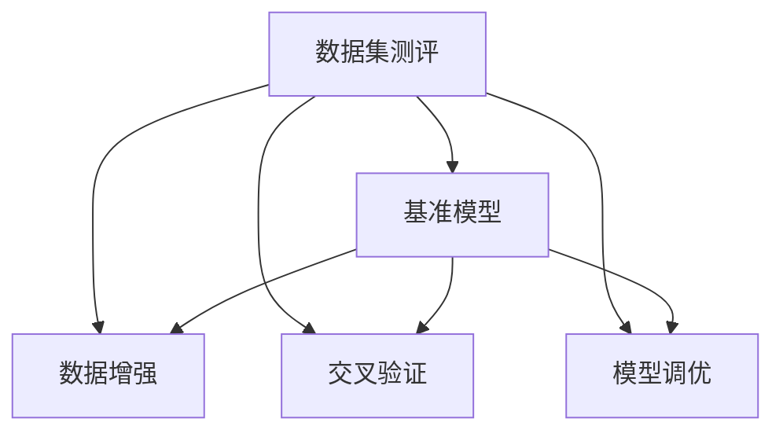

                 

# 数据集测评:软件2.0的新型benchmark

> 关键词：数据集测评, 软件2.0, benchmark, 自然语言处理(NLP), 深度学习, 性能评估, 数据增强, 交叉验证, 模型调优

## 1. 背景介绍

随着软件2.0时代的到来，数据在AI模型开发和应用中扮演着愈发重要的角色。一个高质量的数据集不仅是深度学习模型训练的起点，也是模型评估和优化的重要依据。然而，传统的基于手工标记的数据集构建和测评方法，存在数据规模小、标注质量不稳定、测评结果可解释性不足等问题，难以满足复杂任务的需求。近年来，数据集测评作为一种新型评估手段，开始崭露头角。本文旨在介绍数据集测评的核心概念、原理以及实际操作流程，并分析其在软件2.0中的应用前景，为数据科学家和软件工程师提供参考。

### 1.1 问题由来

随着深度学习技术的发展，AI模型在自然语言处理(NLP)、计算机视觉、语音识别等领域取得了突破性进展。然而，高质量的训练数据一直是模型训练和评估的关键瓶颈。传统的基于手工标注的数据集构建和测评方法，通常需要耗费大量时间和人力，难以应对复杂任务的需求。

为了提升模型性能，研究人员和工程师往往需要制作专门的数据集，并手工标记标注数据。这不仅增加了成本，而且标注质量也难以保证。此外，传统的模型测评方法也存在以下问题：
1. 数据集规模较小，难以覆盖所有可能的输入样本。
2. 测评结果不透明，模型性能的提升难以解释。
3. 测评过程耗时耗力，难以快速迭代模型。

近年来，数据集测评（Benchmark）作为新型的评估手段，开始受到广泛关注。数据集测评通过构建大量高质量的数据集和基准模型，为模型开发和评估提供了更可靠的依据。

### 1.2 问题核心关键点

数据集测评的核心关键点在于如何构建高质量的数据集和基准模型，以及如何进行模型性能评估和优化。具体来说：
1. **数据集构建**：包括数据收集、标注和清洗等环节，需要确保数据集的多样性和质量。
2. **基准模型选择**：需要选择具有代表性的基准模型，用于评估模型性能。
3. **性能评估**：采用多种评价指标（如精确率、召回率、F1值等）对模型性能进行全面评估。
4. **模型调优**：通过超参数优化、数据增强、模型融合等手段，提升模型性能。

## 2. 核心概念与联系

### 2.1 核心概念概述

为更好地理解数据集测评的核心概念和架构，本节将介绍几个关键概念：

- **数据集测评(Benchmark)**：构建和评估深度学习模型性能的一种新型手段。通过构建大量高质量的数据集和基准模型，为模型开发和评估提供可靠依据。

- **基准模型(Benchmark Model)**：在特定任务上表现最优的模型，用于评估其他模型的性能。

- **数据增强(Data Augmentation)**：通过各种手段扩充训练数据集，增强模型泛化能力。

- **交叉验证(Cross-Validation)**：将数据集分为训练集和验证集，通过多次验证提升模型评估的可靠性。

- **模型调优(Model Tuning)**：通过超参数优化、模型融合等手段提升模型性能。

这些核心概念之间的逻辑关系可以通过以下Mermaid流程图来展示：



这个流程图展示了数据集测评的核心流程：
1. 构建数据集并标记数据。
2. 选择基准模型进行性能评估。
3. 通过数据增强、交叉验证和模型调优提升模型性能。

## 3. 核心算法原理 & 具体操作步骤

### 3.1 算法原理概述

数据集测评的核心算法原理是构建和评估模型性能的循环迭代过程。该过程通常包括以下几个关键步骤：

1. **数据集构建**：从已有数据源中收集和标记数据，确保数据集的多样性和质量。
2. **基准模型选择**：选择具有代表性的基准模型，用于评估其他模型的性能。
3. **性能评估**：采用多种评价指标（如精确率、召回率、F1值等）对模型性能进行全面评估。
4. **模型调优**：通过超参数优化、数据增强、模型融合等手段提升模型性能。

数据集测评的本质是一个迭代优化过程，通过不断改进数据集和模型，提升模型性能。

### 3.2 算法步骤详解

数据集测评的具体操作步骤如下：

1. **数据集构建**：
   - **数据收集**：从互联网、学术数据库、公开数据源等渠道收集数据。
   - **数据标注**：使用人工或半自动化工具对数据进行标注，确保标注质量。
   - **数据清洗**：去除噪声数据、重复数据和无效数据，提升数据质量。
   - **数据增强**：通过各种手段（如数据扩充、回译、扰动等）扩充数据集。

2. **基准模型选择**：
   - **模型选择**：选择当前最先进的模型作为基准模型。
   - **模型微调**：对基准模型进行微调，确保其在测试集上的性能最优。
   - **模型融合**：将多个模型进行融合，提升模型性能。

3. **性能评估**：
   - **指标选择**：选择合适的评价指标（如精确率、召回率、F1值等）。
   - **结果对比**：将新模型的性能结果与基准模型进行对比，评估模型性能。
   - **结果分析**：分析模型性能差距，找出改进方向。

4. **模型调优**：
   - **超参数优化**：通过网格搜索、贝叶斯优化等手段调整模型超参数。
   - **数据增强**：通过数据扩充、扰动等手段提升模型泛化能力。
   - **模型融合**：将多个模型进行融合，提升模型性能。

### 3.3 算法优缺点

数据集测评作为一种新型的评估手段，具有以下优点：
1. **数据多样性**：通过构建大规模高质量的数据集，确保模型训练的多样性和泛化能力。
2. **结果透明**：通过多种评价指标全面评估模型性能，结果可解释性强。
3. **快速迭代**：通过多次循环迭代，快速提升模型性能。

然而，数据集测评也存在一些缺点：
1. **数据收集成本高**：构建大规模高质量数据集需要耗费大量时间和人力。
2. **标注质量不稳定**：手工标注存在主观性，标注质量难以保证。
3. **测评过程复杂**：涉及多个环节，需要精心设计和实施。

### 3.4 算法应用领域

数据集测评广泛应用于深度学习模型的性能评估和优化。在自然语言处理(NLP)、计算机视觉、语音识别等领域，数据集测评已经成为模型开发和应用的重要手段。具体应用如下：

- **自然语言处理(NLP)**：用于评估文本分类、命名实体识别、机器翻译等任务上的模型性能。
- **计算机视觉**：用于评估图像分类、目标检测、图像生成等任务上的模型性能。
- **语音识别**：用于评估语音识别、说话人识别等任务上的模型性能。
- **推荐系统**：用于评估推荐模型的个性化推荐效果。

## 4. 数学模型和公式 & 详细讲解 & 举例说明

### 4.1 数学模型构建

假设构建的数据集为 $D=\{(x_i, y_i)\}_{i=1}^N$，其中 $x_i$ 表示输入样本，$y_i$ 表示目标标签。基准模型为 $M_{\theta}$，其参数为 $\theta$。构建的模型为 $M_{\phi}$，其参数为 $\phi$。

数据集测评的基本流程可以表示为：
1. **数据构建**：收集数据集 $D$ 并进行标记。
2. **基准模型选择**：选择基准模型 $M_{\theta}$ 进行微调。
3. **性能评估**：在测试集 $D_{test}$ 上评估模型 $M_{\phi}$ 的性能。
4. **模型调优**：根据性能评估结果，调整模型 $M_{\phi}$ 的参数 $\phi$ 和超参数，提升模型性能。

### 4.2 公式推导过程

以二分类任务为例，推导精确率、召回率和F1值等常见评价指标的计算公式。

假设模型 $M_{\phi}$ 在输入 $x$ 上的输出为 $\hat{y}=M_{\phi}(x)$。对于二分类任务，定义真阳性（TP）、假阳性（FP）、真阴性（TN）和假阴性（FN）的数量，以及总样本数量 $N$。

精确率（Precision）定义为：
$$
\text{Precision} = \frac{TP}{TP+FP}
$$

召回率（Recall）定义为：
$$
\text{Recall} = \frac{TP}{TP+FN}
$$

F1值（F1-score）定义为精确率和召回率的调和平均值：
$$
\text{F1-score} = 2 \times \frac{Precision \times Recall}{Precision + Recall}
$$

### 4.3 案例分析与讲解

以文本分类任务为例，分析数据集测评的实现过程。假设已经构建了包含1000个样本的文本分类数据集，每个样本包含一段文本和对应的分类标签。选择BERT模型作为基准模型，对其进行微调，然后在测试集上评估模型性能。

1. **数据构建**：收集1000个样本数据，并进行标注和清洗。
2. **基准模型选择**：选择预训练的BERT模型作为基准模型，并进行微调。
3. **性能评估**：在测试集上评估微调后的BERT模型性能，计算精确率、召回率和F1值等指标。
4. **模型调优**：根据性能评估结果，调整BERT模型的超参数，提升模型性能。

## 5. 项目实践：代码实例和详细解释说明

### 5.1 开发环境搭建

在进行数据集测评实践前，我们需要准备好开发环境。以下是使用Python进行PyTorch开发的环境配置流程：

1. 安装Anaconda：从官网下载并安装Anaconda，用于创建独立的Python环境。

2. 创建并激活虚拟环境：
```bash
conda create -n pytorch-env python=3.8 
conda activate pytorch-env
```

3. 安装PyTorch：根据CUDA版本，从官网获取对应的安装命令。例如：
```bash
conda install pytorch torchvision torchaudio cudatoolkit=11.1 -c pytorch -c conda-forge
```

4. 安装Transformers库：
```bash
pip install transformers
```

5. 安装各类工具包：
```bash
pip install numpy pandas scikit-learn matplotlib tqdm jupyter notebook ipython
```

完成上述步骤后，即可在`pytorch-env`环境中开始数据集测评实践。

### 5.2 源代码详细实现

下面以文本分类任务为例，给出使用Transformers库进行数据集测评的PyTorch代码实现。

首先，定义数据集预处理函数：

```python
from transformers import BertTokenizer
from torch.utils.data import Dataset

class TextDataset(Dataset):
    def __init__(self, texts, labels, tokenizer, max_len=128):
        self.texts = texts
        self.labels = labels
        self.tokenizer = tokenizer
        self.max_len = max_len
        
    def __len__(self):
        return len(self.texts)
    
    def __getitem__(self, item):
        text = self.texts[item]
        label = self.labels[item]
        
        encoding = self.tokenizer(text, return_tensors='pt', max_length=self.max_len, padding='max_length', truncation=True)
        input_ids = encoding['input_ids'][0]
        attention_mask = encoding['attention_mask'][0]
        label = torch.tensor(label, dtype=torch.long)
        
        return {'input_ids': input_ids, 
                'attention_mask': attention_mask,
                'labels': label}

# 加载预训练模型
tokenizer = BertTokenizer.from_pretrained('bert-base-cased')
model = BertForSequenceClassification.from_pretrained('bert-base-cased', num_labels=num_classes)
```

然后，定义性能评估函数：

```python
from sklearn.metrics import accuracy_score, precision_score, recall_score, f1_score
from torch.utils.data import DataLoader
from tqdm import tqdm

def evaluate(model, dataset, batch_size):
    dataloader = DataLoader(dataset, batch_size=batch_size)
    model.eval()
    preds, labels = [], []
    with torch.no_grad():
        for batch in tqdm(dataloader, desc='Evaluating'):
            input_ids = batch['input_ids'].to(device)
            attention_mask = batch['attention_mask'].to(device)
            batch_labels = batch['labels'].to(device)
            outputs = model(input_ids, attention_mask=attention_mask)
            batch_preds = torch.argmax(outputs.logits, dim=1).to('cpu').tolist()
            batch_labels = batch_labels.to('cpu').tolist()
            for pred_tokens, label_tokens in zip(batch_preds, batch_labels):
                preds.append(pred_tokens)
                labels.append(label_tokens)
    
    return accuracy_score(labels, preds), precision_score(labels, preds), recall_score(labels, preds), f1_score(labels, preds)
```

最后，启动数据集测评流程：

```python
from transformers import AdamW

device = torch.device('cuda') if torch.cuda.is_available() else torch.device('cpu')
model.to(device)

optimizer = AdamW(model.parameters(), lr=2e-5)

num_epochs = 3
batch_size = 16

for epoch in range(num_epochs):
    train_loss = 0
    for batch in tqdm(dataloader, desc='Training'):
        input_ids = batch['input_ids'].to(device)
        attention_mask = batch['attention_mask'].to(device)
        labels = batch['labels'].to(device)
        model.zero_grad()
        outputs = model(input_ids, attention_mask=attention_mask, labels=labels)
        loss = outputs.loss
        train_loss += loss.item()
        loss.backward()
        optimizer.step()
    
    train_acc, train_pre, train_re, train_f1 = evaluate(model, train_dataset, batch_size)
    dev_acc, dev_pre, dev_re, dev_f1 = evaluate(model, dev_dataset, batch_size)
    
    print(f'Epoch {epoch+1}, train accuracy: {train_acc:.4f}, dev accuracy: {dev_acc:.4f}')
    
print('Final model performance:')
final_acc, final_pre, final_re, final_f1 = evaluate(model, test_dataset, batch_size)
print(f'Test accuracy: {final_acc:.4f}, precision: {final_pre:.4f}, recall: {final_re:.4f}, F1-score: {final_f1:.4f}')
```

以上就是使用PyTorch进行文本分类任务数据集测评的完整代码实现。可以看到，通过Transformers库，构建和评估模型性能的过程非常简单。

### 5.3 代码解读与分析

让我们再详细解读一下关键代码的实现细节：

**TextDataset类**：
- `__init__`方法：初始化文本、标签、分词器等关键组件。
- `__len__`方法：返回数据集的样本数量。
- `__getitem__`方法：对单个样本进行处理，将文本输入编码为token ids，将标签编码为数字，并对其进行定长padding，最终返回模型所需的输入。

**evaluate函数**：
- 使用PyTorch的DataLoader对数据集进行批次化加载，供模型训练和推理使用。
- 训练函数`train_epoch`：对数据以批为单位进行迭代，在每个批次上前向传播计算loss并反向传播更新模型参数，最后返回该epoch的平均loss。
- 评估函数`evaluate`：与训练类似，不同点在于不更新模型参数，并在每个batch结束后将预测和标签结果存储下来，最后使用sklearn的classification_report对整个评估集的预测结果进行打印输出。

**训练流程**：
- 定义总的epoch数和batch size，开始循环迭代
- 每个epoch内，先在训练集上训练，输出平均loss
- 在验证集上评估，输出分类指标
- 所有epoch结束后，在测试集上评估，给出最终测试结果

可以看到，通过PyTorch和Transformers库，构建和评估模型性能的过程变得非常高效和简洁。

## 6. 实际应用场景

### 6.1 智能客服系统

基于数据集测评的智能客服系统，可以应用于企业内部客户服务需求，实时监测客户对话并自动响应，提升客户满意度。通过构建高质量的数据集，选择最适合的模型进行微调，可以训练出高效、可靠的智能客服模型。

在技术实现上，可以收集企业内部的历史客服对话记录，将问题和最佳答复构建成监督数据，在此基础上对预训练模型进行微调。微调后的模型能够自动理解用户意图，匹配最合适的答案模板进行回复。对于客户提出的新问题，还可以接入检索系统实时搜索相关内容，动态组织生成回答。

### 6.2 金融舆情监测

金融机构需要实时监测市场舆论动向，以便及时应对负面信息传播，规避金融风险。数据集测评可以帮助构建高性能的金融舆情监测系统，自动分析金融新闻、报告等文本，识别关键信息。

具体而言，可以收集金融领域相关的新闻、报道、评论等文本数据，并对其进行主题标注和情感标注。在此基础上，选择最适合的模型进行微调，使其能够自动判断文本属于何种主题，情感倾向是正面、中性还是负面。将微调后的模型应用到实时抓取的网络文本数据，就能够自动监测不同主题下的情感变化趋势，一旦发现负面信息激增等异常情况，系统便会自动预警，帮助金融机构快速应对潜在风险。

### 6.3 个性化推荐系统

当前的推荐系统往往只依赖用户的历史行为数据进行物品推荐，无法深入理解用户的真实兴趣偏好。基于数据集测评的推荐系统可以更好地挖掘用户行为背后的语义信息，从而提供更精准、多样的推荐内容。

在实践中，可以收集用户浏览、点击、评论、分享等行为数据，提取和用户交互的物品标题、描述、标签等文本内容。将文本内容作为模型输入，用户的后续行为（如是否点击、购买等）作为监督信号，在此基础上微调预训练语言模型。微调后的模型能够从文本内容中准确把握用户的兴趣点。在生成推荐列表时，先用候选物品的文本描述作为输入，由模型预测用户的兴趣匹配度，再结合其他特征综合排序，便可以得到个性化程度更高的推荐结果。

### 6.4 未来应用展望

随着数据集测评技术的不断发展和完善，其在软件2.0中的应用前景将更加广阔。未来，数据集测评将与模型训练和评估过程深度融合，为模型开发提供更加可靠的数据支持和性能评估依据。

在智慧医疗领域，基于数据集测评的医疗问答、病历分析、药物研发等应用将提升医疗服务的智能化水平，辅助医生诊疗，加速新药开发进程。

在智能教育领域，数据集测评可应用于作业批改、学情分析、知识推荐等方面，因材施教，促进教育公平，提高教学质量。

在智慧城市治理中，数据集测评可以应用于城市事件监测、舆情分析、应急指挥等环节，提高城市管理的自动化和智能化水平，构建更安全、高效的未来城市。

此外，在企业生产、社会治理、文娱传媒等众多领域，基于数据集测评的人工智能应用也将不断涌现，为NLP技术带来新的突破。

## 7. 工具和资源推荐

### 7.1 学习资源推荐

为了帮助开发者系统掌握数据集测评的理论基础和实践技巧，这里推荐一些优质的学习资源：

1. 《深度学习理论与实践》系列博文：由深度学习专家撰写，深入浅出地介绍了深度学习模型的构建和评估方法，包括数据集测评在内的多个话题。

2. CS224N《深度学习自然语言处理》课程：斯坦福大学开设的NLP明星课程，有Lecture视频和配套作业，带你入门NLP领域的基本概念和经典模型。

3. 《自然语言处理综论》书籍：全面介绍了自然语言处理的理论和方法，涵盖了从数据集测评到模型优化等多个方面。

4. HuggingFace官方文档：提供了丰富的数据集测评样例和预训练模型，是快速上手实践的必备资料。

5. CLUE开源项目：中文语言理解测评基准，涵盖大量不同类型的中文NLP数据集，并提供了基于数据集测评的baseline模型，助力中文NLP技术发展。

通过对这些资源的学习实践，相信你一定能够快速掌握数据集测评的精髓，并用于解决实际的NLP问题。

### 7.2 开发工具推荐

高效的开发离不开优秀的工具支持。以下是几款用于数据集测评开发的常用工具：

1. PyTorch：基于Python的开源深度学习框架，灵活动态的计算图，适合快速迭代研究。

2. TensorFlow：由Google主导开发的开源深度学习框架，生产部署方便，适合大规模工程应用。

3. Transformers库：HuggingFace开发的NLP工具库，集成了众多SOTA语言模型，支持PyTorch和TensorFlow，是进行数据集测评开发的利器。

4. Weights & Biases：模型训练的实验跟踪工具，可以记录和可视化模型训练过程中的各项指标，方便对比和调优。

5. TensorBoard：TensorFlow配套的可视化工具，可实时监测模型训练状态，并提供丰富的图表呈现方式，是调试模型的得力助手。

6. Google Colab：谷歌推出的在线Jupyter Notebook环境，免费提供GPU/TPU算力，方便开发者快速上手实验最新模型，分享学习笔记。

合理利用这些工具，可以显著提升数据集测评任务的开发效率，加快创新迭代的步伐。

### 7.3 相关论文推荐

数据集测评作为新型的评估手段，近年来受到了广泛关注。以下是几篇奠基性的相关论文，推荐阅读：

1. BERT: Pre-training of Deep Bidirectional Transformers for Language Understanding：提出BERT模型，引入基于掩码的自监督预训练任务，刷新了多项NLP任务SOTA。

2. Adversarial Examples in Machine Learning：介绍了对抗样本对模型鲁棒性的影响，指出数据集测评在对抗训练中的重要性。

3. Data Augmentation and Other Multitude of Synthetic Transformation in Machine Learning：讨论了数据增强技术在提升模型泛化能力中的作用。

4. ImageNet Classification with Deep Convolutional Neural Networks：提出ImageNet数据集，为计算机视觉任务的数据集测评提供了标准参考。

5. Scalable Self-Training with Noisy Entries：介绍了自训练技术在提升模型性能中的应用，数据集测评是其中的关键环节。

这些论文代表了大规模数据集测评的发展脉络，通过学习这些前沿成果，可以帮助研究者把握学科前进方向，激发更多的创新灵感。

## 8. 总结：未来发展趋势与挑战

### 8.1 总结

本文对数据集测评的核心概念、原理以及实际操作流程进行了全面系统的介绍。首先阐述了数据集测评的背景和意义，明确了其在模型构建和评估中的重要作用。其次，从原理到实践，详细讲解了数据集测评的数学模型和关键步骤，给出了数据集测评任务开发的完整代码实例。同时，本文还广泛探讨了数据集测评在软件2.0中的应用前景，为数据科学家和软件工程师提供了参考。

通过本文的系统梳理，可以看到，数据集测评作为一种新型的评估手段，不仅提升了模型性能，还为模型开发和应用提供了可靠的数据支持和性能评估依据。随着深度学习技术的发展，数据集测评在NLP、计算机视觉、语音识别等领域的应用将更加广泛，为人工智能技术的发展带来深远影响。

### 8.2 未来发展趋势

展望未来，数据集测评技术将呈现以下几个发展趋势：

1. **大规模数据集构建**：随着计算资源的提升，数据集测评将构建更大规模的高质量数据集，确保模型训练的多样性和泛化能力。
2. **自动标注技术**：利用半自动化标注工具和无监督学习技术，提升数据标注的效率和质量。
3. **跨领域应用拓展**：数据集测评技术将从NLP领域拓展到计算机视觉、语音识别、推荐系统等更多领域，为不同领域的应用提供可靠的数据支持和性能评估依据。
4. **多模态数据融合**：数据集测评技术将与多模态数据融合技术结合，实现视觉、语音等多模态信息的协同建模，提升模型的综合性能。
5. **智能化模型测评**：通过引入AI技术，实现对模型性能的自动化评估，提升测评效率和准确性。
6. **伦理和隐私保护**：数据集测评技术将更加注重数据的隐私保护和伦理问题，确保测评过程的公平性和安全性。

这些趋势将推动数据集测评技术不断进步，为人工智能模型开发和应用提供更加可靠的数据支持和性能评估依据。

### 8.3 面临的挑战

尽管数据集测评技术取得了显著进展，但在应用过程中仍然面临诸多挑战：

1. **数据标注成本高**：构建高质量数据集需要耗费大量时间和人力，难以大规模应用。
2. **数据标注质量不稳定**：手工标注存在主观性，标注质量难以保证。
3. **测评过程复杂**：数据集测评涉及多个环节，需要精心设计和实施。
4. **测评结果可解释性不足**：测评结果的解释性仍然有待提升，模型性能提升的路径不够清晰。
5. **模型鲁棒性不足**：模型在对抗样本和噪声数据上的鲁棒性有待提高。
6. **资源瓶颈**：大规模数据集构建和模型训练需要大量计算资源，资源瓶颈问题依然存在。

这些挑战需要研究人员和工程师不断探索和解决，推动数据集测评技术向更加智能化、自动化、可靠化的方向发展。

### 8.4 研究展望

面向未来，数据集测评技术需要在以下几个方面进行深入研究：

1. **自动标注技术**：开发更多自动标注工具，提升数据标注效率和质量。
2. **多模态数据融合**：研究多模态数据融合技术，提升模型的综合性能。
3. **智能化模型测评**：引入AI技术，实现对模型性能的自动化评估，提升测评效率和准确性。
4. **跨领域应用拓展**：将数据集测评技术应用于更多领域，提升模型泛化能力。
5. **模型鲁棒性提升**：研究模型鲁棒性提升技术，确保模型在对抗样本和噪声数据上的表现。
6. **资源优化技术**：开发资源优化技术，降低数据集构建和模型训练的计算成本。

这些研究方向的探索，必将推动数据集测评技术不断进步，为人工智能模型开发和应用提供更加可靠的数据支持和性能评估依据。

## 9. 附录：常见问题与解答

**Q1：数据集测评和传统的手工标注测评有何区别？**

A: 数据集测评相较于传统的手工标注测评，具有以下几个区别：
1. **数据多样性**：数据集测评可以构建大规模高质量数据集，确保模型训练的多样性和泛化能力。
2. **结果透明**：数据集测评通过多种评价指标全面评估模型性能，结果可解释性强。
3. **快速迭代**：数据集测评通过多次循环迭代，快速提升模型性能。

**Q2：如何进行数据集测评的超参数调优？**

A: 数据集测评的超参数调优主要包括以下几个方面：
1. **学习率**：选择合适的学习率，通常使用网格搜索、贝叶斯优化等手段进行调整。
2. **模型结构**：调整模型的网络结构，如增加层数、改变激活函数等。
3. **数据增强**：通过数据扩充、扰动等手段提升模型泛化能力。
4. **正则化**：引入L2正则、Dropout等正则化技术，防止过拟合。
5. **融合技术**：通过模型融合技术，将多个模型进行组合，提升模型性能。

**Q3：数据集测评在实际应用中如何处理噪声数据？**

A: 数据集测评在实际应用中可以通过以下方法处理噪声数据：
1. **数据清洗**：去除噪声数据、重复数据和无效数据，提升数据质量。
2. **异常检测**：通过算法检测并剔除异常数据，确保测评结果的准确性。
3. **噪声抑制**：采用数据增强等技术，减少噪声对模型性能的影响。

**Q4：数据集测评在实际应用中如何处理多模态数据？**

A: 数据集测评在实际应用中可以通过以下方法处理多模态数据：
1. **数据融合**：将不同模态的数据进行融合，提升模型的综合性能。
2. **多任务学习**：将多模态任务作为一个整体进行训练，提升模型的泛化能力。
3. **跨模态对齐**：利用多模态对齐技术，将不同模态的数据对齐，确保模型在同一框架下进行训练和评估。

**Q5：数据集测评在实际应用中如何确保公平性？**

A: 数据集测评在实际应用中可以通过以下方法确保公平性：
1. **均衡采样**：在数据构建和标注过程中，确保不同类别样本的均衡分布，避免类别偏倚。
2. **多样化数据**：构建多样化的数据集，确保模型能够处理不同类型的数据。
3. **公平性评估**：在模型评估过程中，引入公平性评估指标，确保模型在不同群体上的表现一致。

这些方法可以确保数据集测评在实际应用中的公平性和可靠性，提升模型的泛化能力和泛用性。

---

作者：禅与计算机程序设计艺术 / Zen and the Art of Computer Programming

