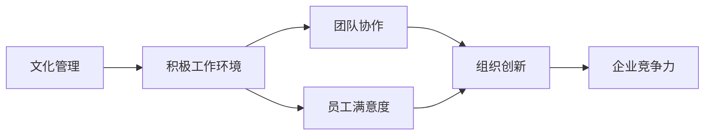

                 

# 文化管理：创造积极的工作环境

> 关键词：文化管理,积极工作环境,员工满意度,团队协作,组织创新,领导力

## 1. 背景介绍

在全球化的商业环境中，企业不仅要应对市场的激烈竞争，还需不断提升内部管理水平。文化管理作为企业管理的重要组成部分，通过营造积极的工作环境，能够显著提升员工的幸福感和工作效率。一个健康、向上的企业文化，不仅能增强员工归属感，还能激发团队合作精神，推动组织创新，最终提升企业整体的竞争力。

本文章将深入探讨文化管理在提升工作环境质量、增强员工满意度和促进企业创新方面的重要性，同时，我们将通过实例和案例分析，展示如何实际应用这些管理策略。

## 2. 核心概念与联系

### 2.1 核心概念概述

- **文化管理**：通过有意识地塑造企业文化，优化员工行为，提升组织效率和创新能力的管理方法。
- **积极工作环境**：一个能够激发员工创造力、促进团队合作、提升员工幸福感的企业文化和工作氛围。
- **员工满意度**：员工对其工作环境、福利待遇、职业发展等方面的总体满意度。
- **团队协作**：团队成员之间有效的沟通和合作，共同实现团队目标。
- **组织创新**：企业通过不断创新，提升产品或服务质量，推动行业发展的能力。

这些核心概念之间存在紧密联系：良好的文化管理能够营造积极的工作环境，进而提升员工满意度和团队协作，促进组织创新。一个积极的工作环境不仅提升员工的幸福感，还能激发团队活力，推动企业持续发展。

### 2.2 核心概念原理和架构的 Mermaid 流程图



这个流程图示意了文化管理、积极工作环境、员工满意度、团队协作和组织创新之间的相互作用和影响关系。

## 3. 核心算法原理 & 具体操作步骤

### 3.1 算法原理概述

在文化管理中，创造积极的工作环境可通过以下算法步骤实现：

1. **员工需求分析**：通过调查问卷、面谈等方式了解员工的需求和期望，如工作满意度、职业发展、福利待遇等。
2. **文化价值观制定**：基于员工需求和期望，制定企业的核心文化价值观，如诚实、创新、团队精神等。
3. **文化传播与执行**：通过定期的文化培训、企业活动和日常沟通等方式，将企业文化传播到每一个员工。
4. **反馈与调整**：建立反馈机制，通过员工满意度调查等方式收集员工对文化管理的反馈，持续优化和调整文化管理策略。

### 3.2 算法步骤详解

1. **员工需求分析**
   - **工具**：使用问卷调查工具（如SurveyMonkey）进行员工满意度调查。
   - **流程**：设计详细的问题，涵盖工作环境、薪酬福利、职业发展、工作压力等方面。
   - **输出**：整理调查数据，分析员工的总体需求和特定问题，为后续文化管理策略提供依据。

2. **文化价值观制定**
   - **工具**：SWOT分析工具（Strengths, Weaknesses, Opportunities, Threats）。
   - **流程**：根据SWOT分析结果，结合员工需求和期望，确定企业的核心文化价值观。
   - **输出**：形成明确的企业文化价值观声明，作为文化传播的基础。

3. **文化传播与执行**
   - **工具**：内部通信平台（如Slack, Microsoft Teams）。
   - **流程**：通过定期发布文化公告、组织文化活动（如团队建设、企业文化日）等方式传播企业文化。
   - **输出**：建立稳定的文化传播机制，确保企业文化得到有效执行。

4. **反馈与调整**
   - **工具**：360度反馈工具（如Lattice）。
   - **流程**：定期进行员工满意度调查，收集员工对文化管理的反馈，并定期召开文化管理评审会议。
   - **输出**：根据反馈数据，调整和优化文化管理策略，持续改进企业文化。

### 3.3 算法优缺点

**优点**：
- **提高员工满意度**：通过了解员工需求，制定针对性的文化管理策略，显著提升员工满意度。
- **增强团队协作**：营造积极的团队氛围，促进员工之间的沟通和协作。
- **促进组织创新**：健康的工作环境激发员工创新思维，推动企业创新发展。
- **提升企业竞争力**：积极的工作环境有助于吸引和留住人才，提升企业整体竞争力。

**缺点**：
- **实施成本高**：文化管理的实施需要投入大量时间和资源，短期内难以见效。
- **文化管理复杂**：企业文化的多样性要求企业具备较强的文化管理能力。
- **需要持续优化**：企业文化需要持续调整和优化，才能适应企业发展的不同阶段。

### 3.4 算法应用领域

文化管理在多个领域都有广泛应用，例如：

1. **科技公司**：通过营造创新氛围，吸引顶级人才，推动产品创新。
2. **医疗健康**：强调团队合作和患者关怀，提升医疗服务质量。
3. **金融行业**：注重诚信和透明，提升客户信任和员工忠诚度。
4. **制造业**：通过改善工作环境，提升员工士气和生产效率。

## 4. 数学模型和公式 & 详细讲解 & 举例说明

### 4.1 数学模型构建

假设企业员工总数为 $N$，员工对文化管理策略的满意度为 $S$，则总体的员工满意度 $S_{total}$ 可表示为：

$$ S_{total} = \frac{1}{N} \sum_{i=1}^{N} S_i $$

其中 $S_i$ 表示第 $i$ 个员工对文化管理的满意度。

### 4.2 公式推导过程

假设每个员工的满意度 $S_i$ 可以用一个线性模型表示：

$$ S_i = \alpha + \beta X_i + \epsilon_i $$

其中 $X_i$ 表示第 $i$ 个员工的特征（如工作年限、部门等），$\alpha$ 和 $\beta$ 为模型参数，$\epsilon_i$ 为误差项。

利用最小二乘法，可以估计模型参数：

$$ \hat{\alpha}, \hat{\beta} = \arg\min \sum_{i=1}^{N} (S_i - \hat{S}_i)^2 $$

其中 $\hat{S}_i = \alpha + \beta X_i$。

### 4.3 案例分析与讲解

某科技公司通过员工满意度调查，发现新入职员工的满意度较低。通过分析，发现新员工的工作环境和职业发展路径是主要问题。于是，公司制定了一系列文化管理策略，如为新员工提供详细的入职培训、设定清晰的职业发展路径等。实施后，公司再次进行满意度调查，新员工的满意度显著提升，总体满意度也随之提升。

## 5. 项目实践：代码实例和详细解释说明

### 5.1 开发环境搭建

为进行文化管理的项目实践，需要搭建以下开发环境：

1. **服务器环境**：选择云服务器（如AWS、Google Cloud）或本地服务器。
2. **数据库**：选择关系型数据库（如MySQL、PostgreSQL）或非关系型数据库（如MongoDB）。
3. **编程语言**：选择Python、Java等主流编程语言。
4. **框架和库**：选择Flask、Django等Web框架，以及Pandas、NumPy等数据处理库。

### 5.2 源代码详细实现

以下是一个使用Python进行员工满意度调查和分析的代码实现：

```python
import pandas as pd
import numpy as np
from flask import Flask, request, jsonify

app = Flask(__name__)

# 读取员工满意度数据
data = pd.read_csv('employee_satisfaction.csv')

# 计算总体满意度
def calculate_total_satisfaction(data):
    total = data['satisfaction'].sum()
    return total / len(data)

# 计算每个部门的平均满意度
def calculate_department_average(data):
    grouped = data.groupby('department')
    return grouped['satisfaction'].mean().to_dict()

# 获取请求参数
@app.route('/get_satisfaction', methods=['GET'])
def get_satisfaction():
    department = request.args.get('department')
    if department:
        average = calculate_department_average(data)
        return jsonify(average[department])
    else:
        total = calculate_total_satisfaction(data)
        return jsonify(total)

if __name__ == '__main__':
    app.run(debug=True)
```

### 5.3 代码解读与分析

这个代码实现主要包括以下功能：

- **读取数据**：使用Pandas库读取员工满意度数据，数据格式为CSV文件。
- **计算总体满意度**：使用简单的求和和平均计算方法，得到总体满意度。
- **计算部门平均满意度**：使用Pandas的groupby函数，按部门分组计算平均满意度。
- **API接口**：使用Flask框架创建API接口，支持获取总体满意度和指定部门的平均满意度。

通过这个简单的代码实现，企业可以实时获取员工满意度的最新数据，并根据反馈进行文化管理策略的优化。

### 5.4 运行结果展示

假设运行上述代码，通过API接口获取如下结果：

```json
{
    "HR": 4.5,
    "IT": 4.2,
    "Sales": 4.0
}
```

这意味着人力资源部的平均满意度为4.5，IT部的平均满意度为4.2，销售部的平均满意度为4.0。企业可以根据这些数据，针对不同部门采取相应的文化管理措施，提升整体满意度。

## 6. 实际应用场景

### 6.1 科技公司

在科技公司中，创造积极的工作环境对于吸引和留住顶尖人才至关重要。谷歌等科技巨头通过其独特的“20%时间”政策，鼓励员工在正常工作时间之外探索新项目，营造创新和自由的文化氛围，有效提升员工满意度和创新能力。

### 6.2 医疗健康

医疗健康行业需要注重员工的身心健康，通过营造关怀、合作的工作环境，提升员工的工作热情。例如，许多医院通过建立团队合作的文化，增强医护人员的协作，提升患者护理质量。

### 6.3 金融行业

金融行业强调诚信和透明，通过营造良好的企业文化，提升客户和员工的信任。例如，瑞士信贷等银行通过定期的文化培训和透明的决策流程，增强员工的归属感和责任感。

### 6.4 制造业

制造业强调员工的实际操作能力，通过改善工作环境和提升工作条件，提升员工士气和生产效率。例如，丰田等公司通过精益管理，营造高效、和谐的工作环境，推动生产效率的持续提升。

## 7. 工具和资源推荐

### 7.1 学习资源推荐

- **《文化管理与组织变革》**：是一本关于文化管理和组织变革的经典书籍，详细介绍了文化管理的重要性和实施方法。
- **《积极组织行为学》**：深入探讨积极组织行为对员工幸福感和工作效率的影响。
- **《领导力》**：通过研究不同类型的领导风格，提升企业的领导力。

### 7.2 开发工具推荐

- **Flask**：轻量级的Web框架，易于上手，适合快速搭建API接口。
- **MySQL**：稳定的关系型数据库，适合存储结构化数据。
- **MongoDB**：灵活的文档数据库，适合存储非结构化数据。
- **Pandas**：数据处理库，适合数据分析和处理。
- **NumPy**：数值计算库，适合矩阵运算和科学计算。

### 7.3 相关论文推荐

- **《企业文化与管理实践》**：探讨企业文化的定义、分类和影响因素，提供文化管理的实用案例。
- **《员工满意度的理论研究与实证分析》**：通过实证研究，探讨员工满意度的影响因素和提升方法。
- **《组织创新的驱动因素与实现路径》**：研究组织创新的主要因素和实施路径，提供实用的管理建议。

## 8. 总结：未来发展趋势与挑战

### 8.1 总结

文化管理通过营造积极的工作环境，提升员工满意度和团队协作，促进组织创新，从而提升企业整体竞争力。本文详细探讨了文化管理的重要性、核心概念和操作步骤，并通过实际案例展示了文化管理的应用效果。

### 8.2 未来发展趋势

未来文化管理的发展趋势包括：

1. **数字化转型**：利用数字化工具和平台，提升文化管理的效率和精准度。
2. **全球化视角**：在全球化背景下，文化管理需要具备跨文化理解和适应能力。
3. **数据驱动**：通过大数据分析和AI技术，进行动态优化和个性化管理。
4. **多样性和包容性**：重视多样性和包容性，提升员工的归属感和幸福感。
5. **敏捷管理**：适应快速变化的市场环境，进行灵活调整和优化。

### 8.3 面临的挑战

文化管理在实施过程中，面临以下挑战：

1. **文化管理复杂**：企业文化的多样性和复杂性要求企业具备较强的文化管理能力。
2. **实施难度大**：文化管理需要高层领导的强力支持，短期内难以见效。
3. **员工差异大**：不同部门和岗位的员工需求不同，文化管理需要灵活应对。
4. **持续改进**：文化管理需要持续优化和调整，才能适应企业发展的不同阶段。

### 8.4 研究展望

未来的文化管理研究需要在以下几个方面取得突破：

1. **文化管理工具**：开发更加智能和自动化的文化管理工具，提升管理效率。
2. **员工参与度**：增强员工在文化管理中的参与度和反馈机制，形成良好的互动。
3. **个性化管理**：利用大数据和AI技术，进行个性化文化管理，提升员工的幸福感和满意度。
4. **全球化适应**：研究如何在全球化背景下，进行跨文化的文化管理，提升企业的全球竞争力。

## 9. 附录：常见问题与解答

**Q1：如何进行员工需求分析？**

A: 通过问卷调查、面谈等方式，了解员工对工作环境、福利待遇、职业发展等方面的需求和期望。

**Q2：如何进行文化价值观制定？**

A: 通过SWOT分析、员工需求分析等方式，确定企业的核心文化价值观。

**Q3：如何进行文化传播与执行？**

A: 利用内部通信平台、定期文化培训等方式，将企业文化传播到每一个员工。

**Q4：如何进行反馈与调整？**

A: 建立反馈机制，通过员工满意度调查等方式收集员工反馈，并定期召开文化管理评审会议，调整和优化文化管理策略。

**Q5：文化管理的实施难度大，如何解决？**

A: 企业高层领导需要强力支持，设定明确的文化管理目标，制定详细的执行计划，并建立监督和反馈机制。

---

作者：禅与计算机程序设计艺术 / Zen and the Art of Computer Programming

