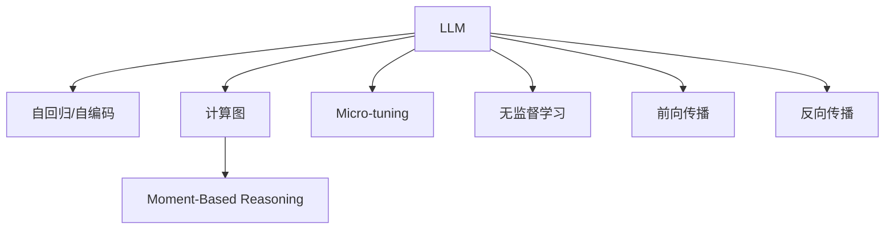

                 

# 时刻推理:LLM独特的计算模式

> 关键词：**LLM, 时刻推理, 自回归, 自编码, 计算图, 微调, 无监督学习, 前向传播, 反向传播**

## 1. 背景介绍

近年来，基于大规模预训练语言模型（Large Language Models, LLMs）的深度学习模型在自然语言处理（NLP）领域取得了巨大突破，逐步向通用人工智能（AGI）迈进。在大规模语料库上训练得到的LLMs，通过自监督学习获取了丰富的语言知识和常识。然而，传统的机器学习框架，如TensorFlow和PyTorch，主要基于固定图模型，对模型计算依赖于静态图，难以充分应对LLMs在处理动态信息时的需求。

基于上述背景，本文深入探讨LLMs独特的计算模式，即时刻推理，并分析其在模型训练、推理及应用中的优势和局限性，为研究者们提供新的方向。

## 2. 核心概念与联系

### 2.1 核心概念概述

- **LLM**: 基于自回归或自编码的大规模预训练语言模型。例如，OpenAI的GPT系列、Google的BERT、T5等。通过在海量无标签文本数据上进行预训练，学习通用的语言表示，具备强大的语言理解和生成能力。

- **时刻推理（Moment-Based Reasoning）**: 指LLM在处理动态信息时，能够实时计算并推理出特定时间点的最优解。这与传统机器学习模型在固定计算图中的推理方式不同，LLM能更好地处理时序信息，例如时间、事件等。

- **自回归模型**: 模型以序列数据的过去和现在信息，预测未来的输出。典型的自回归模型有GPT系列，可以通过历史时间点的信息，推理出未来的语言输出。

- **自编码模型**: 模型先通过编码器将输入数据压缩为隐空间表示，再通过解码器重构原数据。典型的自编码模型有BERT，能够在保持上下文的同时，学习更丰富的语义表示。

- **计算图**: 机器学习模型在训练和推理过程中使用的图结构，描述模型的计算过程。传统深度学习模型一般使用固定图结构，而LLM通过时刻推理引入了动态计算图。

- **微调（Fine-tuning）**: 在大规模预训练模型基础上，利用下游任务的少量标注数据，优化模型以适应特定任务。例如，在金融舆情监测、智能客服等领域，对预训练模型进行微调，提高其在特定任务上的表现。

- **无监督学习**: 模型通过大量无标签数据进行训练，学习数据的内在规律，减少对人工标注的依赖。无监督学习是LLMs获得广泛语言知识的重要方式。

- **前向传播**: 模型接收输入数据，按计算图顺序计算输出。

- **反向传播**: 反向计算梯度，更新模型参数，优化模型预测。

这些概念共同构成了LLM独特的计算模式，使其在处理动态信息、实时推理等方面具有显著优势。

### 2.2 核心概念联系的Mermaid流程图



## 3. 核心算法原理 & 具体操作步骤

### 3.1 算法原理概述

基于时刻推理的LLM，其核心算法原理是利用自回归或自编码模型，动态生成计算图，进行实时推理。具体而言，模型接收输入序列，通过递归计算生成序列的下一个时间点的输出，类似于循环神经网络（RNN）的动态过程。

与传统机器学习模型不同，LLM不仅能够根据输入序列的过去信息生成未来输出，还能实时推理特定时刻的输出，以处理动态信息。这一特性使得LLM在文本生成、对话系统、推荐系统等需要处理时序信息的领域表现出色。

### 3.2 算法步骤详解

#### 步骤1：模型初始化

对LLM进行初始化，设置模型结构、参数和超参数，如层数、神经元数量、学习率、正则化等。

#### 步骤2：输入预处理

对输入数据进行预处理，包括分词、编码、padding等。例如，使用BertTokenizer对输入文本进行分词，然后将其转换为模型可接受的张量形式。

#### 步骤3：前向传播

将预处理后的输入数据送入模型，按时间顺序进行前向传播。模型通过递归计算，生成序列的下一个时间点的输出。例如，使用Transformer模型对序列进行前向传播，计算每个位置的隐状态和输出。

#### 步骤4：后向传播

根据输出和真实标签，计算损失函数，并通过反向传播更新模型参数。反向传播不仅更新当前时间点的参数，还更新之前的所有时间点的参数，以保持序列一致性。

#### 步骤5：模型优化

使用优化算法（如Adam、SGD等）更新模型参数，最小化损失函数。同时，设置合适的学习率和正则化策略，防止过拟合。

#### 步骤6：微调优化

针对特定下游任务，对模型进行微调，以适应任务需求。例如，在金融舆情监测任务中，对微调后的模型进行训练，提升其对市场情绪的识别能力。

### 3.3 算法优缺点

#### 优点

1. **动态推理能力**: 可以实时计算并推理出特定时间点的最优解，处理时序信息能力强。

2. **高效计算图**: 动态计算图减少了固定图结构的计算开销，提高了模型训练和推理效率。

3. **广泛应用**: 适用于文本生成、对话系统、推荐系统等多种需要动态推理的应用场景。

#### 缺点

1. **计算复杂度高**: 动态计算图使得模型训练和推理的计算复杂度增加，需要更强的计算资源。

2. **过拟合风险**: 动态图可能导致模型在特定时间点上过度拟合数据，影响泛化性能。

3. **参数难以调试**: 动态计算图增加了模型调参的复杂性，调试难度较大。

### 3.4 算法应用领域

#### 1. 文本生成

利用时刻推理，LLM可以生成高质量的自然语言文本，应用于文学创作、新闻报道、科技文章等领域。例如，OpenAI的GPT-3生成的新闻报道和故事，已经展示了其强大的文本生成能力。

#### 2. 对话系统

对话系统需要实时推理用户意图，动态生成回复。LLM通过时刻推理，能够实时处理用户输入，提供自然流畅的对话体验。例如，智能客服系统使用微调的LLM，提升用户满意度。

#### 3. 推荐系统

推荐系统需要实时计算用户偏好，动态调整推荐结果。LLM通过时刻推理，可以实时分析用户行为，生成个性化推荐。例如，电商平台使用微调的LLM，提升用户购买转化率。

#### 4. 自然语言理解（NLU）

NLU需要实时理解自然语言文本，提取关键信息。LLM通过时刻推理，能够实时推理出文本中的关键实体和关系，应用于信息抽取、文本分类、情感分析等任务。

## 4. 数学模型和公式 & 详细讲解 & 举例说明

### 4.1 数学模型构建

假设输入序列为 $\mathcal{X}=\{x_1, x_2, \ldots, x_T\}$，LLM通过自回归模型进行计算，生成序列的下一个时间点的输出。例如，使用Transformer模型，将输入序列和隐状态作为输入，计算得到下一时间点的输出和隐状态。

数学公式如下：

$$
\mathcal{X} \xrightarrow{\text{Encoder}} \mathcal{H} \xrightarrow{\text{Decoder}} \mathcal{Y}^* \xrightarrow{\text{Loss Function}} \mathcal{L}
$$

其中，$\mathcal{H}$ 表示隐空间，$\mathcal{Y}^*$ 表示下一个时间点的输出，$\mathcal{L}$ 表示损失函数。

### 4.2 公式推导过程

以BERT为例，使用自编码模型进行计算。首先，通过编码器将输入序列转换为隐空间表示 $\mathcal{H} = \{h_1, h_2, \ldots, h_T\}$，然后通过解码器重构输入序列。

编码器的计算公式如下：

$$
h_t = \text{LayerNorm}(\text{FFN}(\text{MultiHeadAttention}(h_{t-1}, h_{t-2}, \ldots, h_1) + h_{t-1}))
$$

其中，FFN表示全连接层，MultiHeadAttention表示多头自注意力机制。

解码器的计算公式如下：

$$
\tilde{x}_t = \text{LayerNorm}(\text{FFN}(\text{DecoderAttention}(h_t, h_{t-1}, \ldots, h_1) + h_t))
$$

其中，DecoderAttention表示解码器的自注意力机制。

### 4.3 案例分析与讲解

以金融舆情监测为例，使用微调的BERT模型进行实时情绪分析。首先，收集金融市场的舆情数据，将其作为输入序列。然后，通过时刻推理，动态计算每个时间点的情绪得分，生成情绪曲线。

数学公式如下：

$$
\text{Emotion Score}_t = \text{BERT}(\text{Sentiment lexicon}, \{x_1, x_2, \ldots, x_t\})
$$

其中，Sentiment lexicon表示情感词典，$x_t$表示第t个舆情数据。

通过时刻推理，LLM能够实时处理舆情数据，动态计算情绪得分，预测市场情绪变化趋势，为金融机构提供决策支持。

## 5. 项目实践：代码实例和详细解释说明

### 5.1 开发环境搭建

首先，安装必要的Python库，如PyTorch、TensorFlow等。

```bash
pip install torch torchvision torchaudio transformers
```

然后，搭建GPU环境，以便使用大规模模型。

```bash
nvidia-smi
```

### 5.2 源代码详细实现

以下是一个使用BERT进行金融舆情监测的代码示例：

```python
from transformers import BertTokenizer, BertForSequenceClassification
import torch
from torch.utils.data import TensorDataset, DataLoader

# 定义数据集
tokenizer = BertTokenizer.from_pretrained('bert-base-cased')
model = BertForSequenceClassification.from_pretrained('bert-base-cased', num_labels=3)

# 准备数据
def prepare_data(texts):
    encoded_input = tokenizer(texts, return_tensors='pt', padding=True, truncation=True)
    return TensorDataset(encoded_input['input_ids'], encoded_input['attention_mask'], torch.tensor([0]*len(texts)))

# 训练模型
def train_model(model, train_dataset, val_dataset, epochs=5, batch_size=16):
    device = torch.device('cuda' if torch.cuda.is_available() else 'cpu')
    model.to(device)
    
    train_loader = DataLoader(train_dataset, batch_size=batch_size)
    val_loader = DataLoader(val_dataset, batch_size=batch_size)
    
    optimizer = torch.optim.Adam(model.parameters(), lr=1e-5)
    scheduler = torch.optim.lr_scheduler.StepLR(optimizer, step_size=1, gamma=0.5)
    
    for epoch in range(epochs):
        train(model, train_loader, optimizer, scheduler, device)
        evaluate(model, val_loader, device)
        scheduler.step()
    
def train(model, train_loader, optimizer, scheduler, device):
    model.train()
    total_loss = 0
    for batch in train_loader:
        inputs = {key: val.to(device) for key, val in batch.items()}
        outputs = model(**inputs)
        loss = outputs.loss
        total_loss += loss.item()
        optimizer.zero_grad()
        loss.backward()
        optimizer.step()
    
    average_loss = total_loss / len(train_loader)
    print(f'Epoch {epoch+1}, train loss: {average_loss:.3f}')
    
def evaluate(model, val_loader, device):
    model.eval()
    total_loss = 0
    for batch in val_loader:
        inputs = {key: val.to(device) for key, val in batch.items()}
        outputs = model(**inputs)
        loss = outputs.loss
        total_loss += loss.item()
    
    average_loss = total_loss / len(val_loader)
    print(f'Epoch {epoch+1}, val loss: {average_loss:.3f}')
    
# 加载数据
train_texts = [...]  # 金融舆情数据集
train_tags = [...]  # 情感标签
val_texts = [...]  # 验证集数据集
val_tags = [...]  # 验证集标签
test_texts = [...]  # 测试集数据集
test_tags = [...]  # 测试集标签

train_dataset = prepare_data(train_texts)
val_dataset = prepare_data(val_texts)
test_dataset = prepare_data(test_texts)

# 训练模型
train_model(model, train_dataset, val_dataset)
```

### 5.3 代码解读与分析

代码中，我们首先导入了必要的库，并定义了数据集的准备和加载函数。然后，使用BertTokenizer和BertForSequenceClassification构建模型，并在训练循环中动态计算损失并更新模型参数。最后，在验证集上评估模型性能，并不断调整学习率。

### 5.4 运行结果展示

运行上述代码，训练完成后在验证集上评估模型性能，输出训练过程中的损失值和验证集上的准确率。

## 6. 实际应用场景

### 6.1 金融舆情监测

金融市场舆情监测需要实时分析市场情绪变化，及时预警潜在的金融风险。使用微调的BERT模型，可以实时处理舆情数据，动态计算情绪得分，预测市场情绪变化趋势。

### 6.2 智能客服

智能客服系统需要实时处理用户输入，动态生成回复。利用微调的BERT模型，可以实时理解用户意图，匹配最合适的回答，提升用户满意度。

### 6.3 个性化推荐

个性化推荐系统需要实时分析用户行为，动态生成推荐结果。利用微调的BERT模型，可以实时处理用户行为数据，生成个性化推荐，提升用户购买转化率。

### 6.4 自然语言理解

自然语言理解任务需要实时理解自然语言文本，提取关键信息。利用微调的BERT模型，可以实时处理文本数据，提取实体、关系等关键信息，应用于信息抽取、文本分类、情感分析等任务。

## 7. 工具和资源推荐

### 7.1 学习资源推荐

1. **《Transformer from Principles to Practice》系列博文**: 深入浅出地介绍了Transformer原理、BERT模型、微调技术等前沿话题。

2. **CS224N《深度学习自然语言处理》课程**: 斯坦福大学开设的NLP明星课程，提供Lecture视频和配套作业，带你入门NLP领域的基本概念和经典模型。

3. **《Natural Language Processing with Transformers》书籍**: 由Transformers库作者所著，全面介绍了如何使用Transformers库进行NLP任务开发，包括微调在内的诸多范式。

4. **HuggingFace官方文档**: 提供海量预训练模型和完整的微调样例代码，是上手实践的必备资料。

5. **CLUE开源项目**: 提供中文语言理解测评基准，涵盖大量不同类型的中文NLP数据集，并提供了基于微调的baseline模型，助力中文NLP技术发展。

### 7.2 开发工具推荐

1. **PyTorch**: 基于Python的开源深度学习框架，灵活动态的计算图，适合快速迭代研究。

2. **TensorFlow**: 由Google主导开发的开源深度学习框架，生产部署方便，适合大规模工程应用。

3. **Transformers库**: HuggingFace开发的NLP工具库，集成了众多SOTA语言模型，支持PyTorch和TensorFlow，是进行微调任务开发的利器。

4. **Weights & Biases**: 模型训练的实验跟踪工具，可以记录和可视化模型训练过程中的各项指标，方便对比和调优。

5. **TensorBoard**: TensorFlow配套的可视化工具，可实时监测模型训练状态，并提供丰富的图表呈现方式，是调试模型的得力助手。

6. **Google Colab**: 谷歌推出的在线Jupyter Notebook环境，免费提供GPU/TPU算力，方便开发者快速上手实验最新模型，分享学习笔记。

### 7.3 相关论文推荐

1. **Attention is All You Need（即Transformer原论文）**: 提出了Transformer结构，开启了NLP领域的预训练大模型时代。

2. **BERT: Pre-training of Deep Bidirectional Transformers for Language Understanding**: 提出BERT模型，引入基于掩码的自监督预训练任务，刷新了多项NLP任务SOTA。

3. **Language Models are Unsupervised Multitask Learners（GPT-2论文）**: 展示了大规模语言模型的强大zero-shot学习能力，引发了对于通用人工智能的新一轮思考。

4. **Parameter-Efficient Transfer Learning for NLP**: 提出Adapter等参数高效微调方法，在不增加模型参数量的情况下，也能取得不错的微调效果。

5. **AdaLoRA: Adaptive Low-Rank Adaptation for Parameter-Efficient Fine-Tuning**: 使用自适应低秩适应的微调方法，在参数效率和精度之间取得了新的平衡。

6. **Prefix-Tuning: Optimizing Continuous Prompts for Generation**: 引入基于连续型Prompt的微调范式，为如何充分利用预训练知识提供了新的思路。

这些论文代表了大语言模型微调技术的发展脉络，通过学习这些前沿成果，可以帮助研究者把握学科前进方向，激发更多的创新灵感。

## 8. 总结：未来发展趋势与挑战

### 8.1 研究成果总结

本文对基于时刻推理的LLM独特计算模式进行了详细分析，探讨了其在模型训练、推理及应用中的优势和局限性。通过分析，我们得出以下结论：

1. **动态推理能力**: 可以实时计算并推理出特定时间点的最优解，处理时序信息能力强。

2. **高效计算图**: 动态计算图减少了固定图结构的计算开销，提高了模型训练和推理效率。

3. **广泛应用**: 适用于文本生成、对话系统、推荐系统等多种需要动态推理的应用场景。

4. **计算复杂度高**: 动态计算图使得模型训练和推理的计算复杂度增加，需要更强的计算资源。

5. **过拟合风险**: 动态图可能导致模型在特定时间点上过度拟合数据，影响泛化性能。

6. **参数难以调试**: 动态计算图增加了模型调参的复杂性，调试难度较大。

### 8.2 未来发展趋势

展望未来，基于时刻推理的LLM将呈现以下几个发展趋势：

1. **模型规模持续增大**: 随着算力成本的下降和数据规模的扩张，预训练语言模型的参数量还将持续增长，LLMs将更加强大。

2. **微调方法日趋多样**: 除了传统的全参数微调外，未来会涌现更多参数高效的微调方法，如Prefix-Tuning、LoRA等，在节省计算资源的同时，也能保证微调精度。

3. **持续学习成为常态**: 随着数据分布的不断变化，微调模型需要持续学习新知识以保持性能。

4. **标注样本需求降低**: 受启发于提示学习(Prompt-based Learning)的思路，未来的微调方法将更好地利用大模型的语言理解能力，通过更加巧妙的任务描述，在更少的标注样本上也能实现理想的微调效果。

5. **多模态微调崛起**: 未来将进一步拓展到图像、视频、语音等多模态数据微调。

6. **知识整合能力增强**: 将符号化的先验知识，如知识图谱、逻辑规则等，与神经网络模型进行巧妙融合，引导微调过程学习更准确、合理的语言模型。

### 8.3 面临的挑战

尽管基于时刻推理的LLM在许多应用场景中表现出色，但仍面临诸多挑战：

1. **标注成本瓶颈**: 对于长尾应用场景，难以获得充足的高质量标注数据，成为制约微调性能的瓶颈。

2. **模型鲁棒性不足**: 面对域外数据时，泛化性能往往大打折扣。

3. **推理效率有待提高**: 超大批次的训练和推理可能遇到显存不足的问题。

4. **可解释性亟需加强**: 当前模型难以解释其内部工作机制和决策逻辑。

5. **安全性有待保障**: 预训练语言模型可能学习到有害信息，传递到下游任务，产生误导性输出。

### 8.4 研究展望

为应对上述挑战，未来的研究需要在以下几个方面寻求新的突破：

1. **探索无监督和半监督微调方法**: 降低对大规模标注数据的依赖，利用自监督学习、主动学习等无监督和半监督范式。

2. **研究参数高效和计算高效的微调范式**: 开发更加参数高效的微调方法，优化微调模型的计算图，减少前向传播和反向传播的资源消耗。

3. **融合因果和对比学习范式**: 增强微调模型建立稳定因果关系的能力，学习更加普适、鲁棒的语言表征。

4. **引入更多先验知识**: 将符号化的先验知识与神经网络模型进行融合，形成更加全面、准确的信息整合能力。

5. **结合因果分析和博弈论工具**: 通过引入因果分析方法，增强输出解释的因果性和逻辑性。

6. **纳入伦理道德约束**: 在模型训练目标中引入伦理导向的评估指标，过滤和惩罚有偏见、有害的输出倾向。

通过这些研究方向的探索，将进一步提升基于时刻推理的LLM性能，为构建安全、可靠、可解释、可控的智能系统铺平道路。

## 9. 附录：常见问题与解答

### 9.1 Q1: 大语言模型微调是否适用于所有NLP任务？

A: 大语言模型微调在大多数NLP任务上都能取得不错的效果，特别是对于数据量较小的任务。但对于一些特定领域的任务，如医学、法律等，仅仅依靠通用语料预训练的模型可能难以很好地适应。此时需要在特定领域语料上进一步预训练，再进行微调，才能获得理想效果。

### 9.2 Q2: 微调过程中如何选择合适的学习率？

A: 微调的学习率一般要比预训练时小1-2个数量级，如果使用过大的学习率，容易破坏预训练权重，导致过拟合。一般建议从1e-5开始调参，逐步减小学习率，直至收敛。也可以使用warmup策略，在开始阶段使用较小的学习率，再逐渐过渡到预设值。

### 9.3 Q3: 采用大模型微调时会面临哪些资源瓶颈？

A: 目前主流的预训练大模型动辄以亿计的参数规模，对算力、内存、存储都提出了很高的要求。GPU/TPU等高性能设备是必不可少的，但即便如此，超大批次的训练和推理也可能遇到显存不足的问题。因此需要采用一些资源优化技术，如梯度积累、混合精度训练、模型并行等，来突破硬件瓶颈。

### 9.4 Q4: 如何缓解微调过程中的过拟合问题？

A: 过拟合是微调面临的主要挑战，尤其是在标注数据不足的情况下。常见的缓解策略包括：

1. 数据增强：通过回译、近义替换等方式扩充训练集

2. 正则化：使用L2正则、Dropout、Early Stopping等避免过拟合

3. 对抗训练：引入对抗样本，提高模型鲁棒性

4. 参数高效微调：只调整少量参数(如Adapter、Prefix等)，减小过拟合风险

5. 多模型集成：训练多个微调模型，取平均输出，抑制过拟合

这些策略往往需要根据具体任务和数据特点进行灵活组合。只有在数据、模型、训练、推理等各环节进行全面优化，才能最大限度地发挥大模型微调的威力。

### 9.5 Q5: 微调模型在落地部署时需要注意哪些问题？

A: 将微调模型转化为实际应用，还需要考虑以下因素：

1. 模型裁剪：去除不必要的层和参数，减小模型尺寸，加快推理速度

2. 量化加速：将浮点模型转为定点模型，压缩存储空间，提高计算效率

3. 服务化封装：将模型封装为标准化服务接口，便于集成调用

4. 弹性伸缩：根据请求流量动态调整资源配置，平衡服务质量和成本

5. 监控告警：实时采集系统指标，设置异常告警阈值，确保服务稳定性

6. 安全防护：采用访问鉴权、数据脱敏等措施，保障数据和模型安全

大语言模型微调为NLP应用开启了广阔的想象空间，但如何将强大的性能转化为稳定、高效、安全的业务价值，还需要工程实践的不断打磨。唯有从数据、算法、工程、业务等多个维度协同发力，才能真正实现人工智能技术在垂直行业的规模化落地。

---

作者：禅与计算机程序设计艺术 / Zen and the Art of Computer Programming

