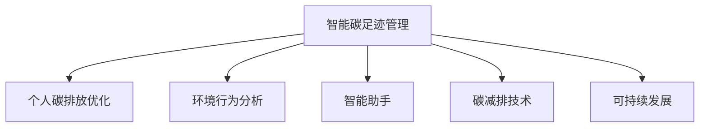

                 

# 智能个人碳足迹管理创业：日常生活的环保优化

> 关键词：智能碳足迹管理,个人碳排放优化,环境行为分析,智能助手,用户行为引导,碳减排技术,可持续发展

## 1. 背景介绍

### 1.1 问题由来

随着全球气候变化的加剧，减少碳排放成为迫切需求。个人行为对碳排放的影响巨大，但很多消费者缺乏对自身碳足迹的直观认识，难以采取实际行动减少碳排放。因此，开发智能碳足迹管理技术，帮助用户量化和优化其碳排放行为，具有重要的环境和社会意义。

### 1.2 问题核心关键点

本节将介绍几个密切相关的核心概念，帮助读者理解智能碳足迹管理技术的基本原理和应用场景：

1. **智能碳足迹管理**：基于用户的能源消耗和出行数据，通过建模和计算，量化其个人碳足迹，并提出优化建议。
2. **个人碳排放优化**：通过对用户的能源使用和出行模式进行分析，提供个性化的碳减排方案，帮助用户减少日常生活中的碳排放。
3. **环境行为分析**：通过数据挖掘和机器学习技术，分析用户的环境行为模式，识别节能减排的潜力和机会。
4. **智能助手**：利用自然语言处理和推荐算法，为用户提供实时的碳足迹管理建议和提醒，引导其采取环保行为。
5. **碳减排技术**：涉及碳捕捉、碳存储、碳交易等技术，帮助用户从源头减少碳排放。
6. **可持续发展**：推动社会、经济、环境协调发展，实现人与自然的和谐共生。

这些核心概念之间的逻辑关系可以通过以下Mermaid流程图来展示：



这个流程图展示了这个领域的核心概念及其之间的关系：

1. 智能碳足迹管理通过数据分析量化碳排放，是实现个人碳排放优化的前提。
2. 环境行为分析帮助理解用户的节能潜力，为碳减排提供方向。
3. 智能助手通过个性化推荐，引导用户采取环保行为。
4. 碳减排技术提供具体的技术手段，实现碳排放的减少。
5. 可持续发展是最终目标，通过技术手段和用户行为引导，推动社会向绿色转型。

## 2. 核心概念与联系

### 2.1 核心概念概述

为更好地理解智能个人碳足迹管理的原理和应用，本节将介绍几个关键概念：

1. **智能碳足迹管理**：基于用户的能源消耗和出行数据，通过建模和计算，量化其个人碳足迹，并提出优化建议。
2. **个人碳排放优化**：通过对用户的能源使用和出行模式进行分析，提供个性化的碳减排方案，帮助用户减少日常生活中的碳排放。
3. **环境行为分析**：通过数据挖掘和机器学习技术，分析用户的环境行为模式，识别节能减排的潜力和机会。
4. **智能助手**：利用自然语言处理和推荐算法，为用户提供实时的碳足迹管理建议和提醒，引导其采取环保行为。
5. **碳减排技术**：涉及碳捕捉、碳存储、碳交易等技术，帮助用户从源头减少碳排放。
6. **可持续发展**：推动社会、经济、环境协调发展，实现人与自然的和谐共生。

这些核心概念共同构成了智能个人碳足迹管理技术的理论基础和应用框架，使其能够有效地量化和优化个人的碳排放行为。通过理解这些核心概念，我们可以更好地把握技术的核心逻辑和应用方向。

## 3. 核心算法原理 & 具体操作步骤

### 3.1 算法原理概述

智能个人碳足迹管理技术主要包括碳足迹量化和碳排放优化两个核心过程。其核心思想是：通过数据采集、建模和计算，量化用户的碳排放，并结合机器学习模型，提出个性化的节能减排方案。

形式化地，假设用户每日的能源消耗和出行数据为 $\{E_i, T_i\}_{i=1}^N$，其中 $E_i$ 为第 $i$ 天的能源消耗量，$T_i$ 为第 $i$ 天的出行里程。设单位能源消耗的碳排放量为 $c$，单位里程的碳排放量为 $d$。则用户的总碳足迹 $C$ 可表示为：

$$
C = \sum_{i=1}^N (c \times E_i + d \times T_i)
$$

通过量化碳足迹，我们可以识别出用户的碳排放模式，进一步提出优化建议。

### 3.2 算法步骤详解

基于智能碳足迹管理的原理，其操作步骤一般包括以下几个关键步骤：

**Step 1: 数据收集与预处理**
- 收集用户的能源消耗数据和出行数据。能源数据包括家庭用电量、燃气消耗量等，出行数据包括日均行驶里程、油耗量等。
- 对原始数据进行清洗和标准化，处理缺失值和异常值，确保数据质量。

**Step 2: 碳足迹量化**
- 根据预定的碳排放因子（$c$ 和 $d$），计算用户的总碳足迹 $C$。
- 通过时间序列分析等方法，可视化碳足迹变化趋势，帮助用户了解其碳排放情况。

**Step 3: 环境行为分析**
- 使用机器学习算法（如随机森林、梯度提升树等）分析用户的能源使用和出行模式，识别节能减排的潜力和机会。
- 通过聚类算法（如K-Means、层次聚类等）对用户进行分组，分析不同群体的碳足迹特征。

**Step 4: 碳排放优化**
- 根据环境行为分析的结果，提出个性化的节能减排方案。
- 例如，对出行数据进行优化，推荐用户选择公共交通、共享出行等方式减少碳排放。
- 对能源数据进行优化，推荐用户安装节能设备、优化用电习惯等。

**Step 5: 智能助手集成**
- 将环境行为分析和碳排放优化结果集成到智能助手系统中。
- 利用自然语言处理技术，将优化建议转换为用户可理解的语言，实时推送给用户。
- 利用推荐算法，根据用户的历史行为和偏好，动态调整优化建议。

**Step 6: 用户反馈与持续改进**
- 收集用户的反馈意见，优化智能助手系统的推荐策略。
- 不断迭代模型，提高预测准确性和优化效果。

### 3.3 算法优缺点

智能个人碳足迹管理技术具有以下优点：
1. **量化精确**：通过精确的碳排放因子计算，能够量化用户的碳足迹。
2. **个性化推荐**：利用机器学习算法分析用户行为，提供个性化的节能减排方案。
3. **实时反馈**：智能助手系统可以实时推送优化建议，引导用户采取环保行为。
4. **数据驱动**：基于大量数据的分析和挖掘，识别节能减排的潜力和机会。

同时，该技术也存在一些局限性：
1. **数据获取难度大**：获取用户的能源消耗和出行数据可能涉及隐私问题，用户配合度较低。
2. **依赖模型精度**：机器学习模型的精度直接影响推荐效果，模型训练和优化难度较大。
3. **技术门槛高**：涉及数据分析、机器学习、自然语言处理等多领域技术，技术门槛较高。
4. **效果受限**：不同用户的行为差异较大，模型的普适性有限。

尽管存在这些局限性，但智能个人碳足迹管理技术在提升用户环保意识、减少碳排放方面具有重要的应用前景，未来有待进一步优化和推广。

### 3.4 算法应用领域

智能个人碳足迹管理技术已经在多个领域得到了应用，具体包括：

1. **家居碳排放管理**：通过监测家用电器的能耗数据，优化用电习惯，减少家庭碳排放。
2. **出行碳排放优化**：分析用户的出行模式，推荐节能减排的出行方式，如共享单车、公共交通等。
3. **能源使用优化**：通过分析用户的能源消耗数据，推荐节能设备的安装和使用，优化能源结构。
4. **企业碳管理**：对企业的能源消耗和碳排放进行量化和管理，推动企业可持续发展。
5. **城市碳排放监测**：利用智能传感器和数据平台，对城市交通、建筑等领域的碳排放进行实时监测和优化。
6. **绿色金融**：结合碳足迹量化和金融产品，开发绿色信贷、碳交易等金融工具，推动绿色投资。

除了上述这些领域外，智能个人碳足迹管理技术还可以应用于智慧农业、智能物流、工业减排等众多场景中，为实现绿色低碳转型提供技术支持。

## 4. 数学模型和公式 & 详细讲解 & 举例说明

### 4.1 数学模型构建

本节将使用数学语言对智能个人碳足迹管理技术进行更加严格的刻画。

假设用户每日的能源消耗数据为 $E_i$，出行数据为 $T_i$，单位能源消耗的碳排放因子为 $c$，单位里程的碳排放因子为 $d$。则用户的总碳足迹 $C$ 可以表示为：

$$
C = \sum_{i=1}^N (c \times E_i + d \times T_i)
$$

对于环境行为分析，假设用户的能源使用和出行数据可以用向量 $\mathbf{X} = [E_1, E_2, ..., E_N, T_1, T_2, ..., T_N]^T$ 表示。则环境行为分析的目标是构建模型 $f(\mathbf{X})$，预测用户的最小碳足迹 $\hat{C}$。

假设 $\mathbf{X}$ 和 $\hat{C}$ 之间存在线性关系，则可以使用线性回归模型：

$$
\hat{C} = \mathbf{w}^T \mathbf{X} + b
$$

其中 $\mathbf{w} = [w_1, w_2, ..., w_{2N}]^T$ 为模型的权重向量，$b$ 为截距。

### 4.2 公式推导过程

以下我们以线性回归模型为例，推导最小碳足迹的计算公式。

假设用户每日的能源消耗和出行数据为 $\{E_i, T_i\}_{i=1}^N$，其中 $E_i$ 为第 $i$ 天的能源消耗量，$T_i$ 为第 $i$ 天的出行里程。设单位能源消耗的碳排放量为 $c$，单位里程的碳排放量为 $d$。则用户的总碳足迹 $C$ 可表示为：

$$
C = \sum_{i=1}^N (c \times E_i + d \times T_i)
$$

假设 $\mathbf{X} = [E_1, E_2, ..., E_N, T_1, T_2, ..., T_N]^T$，目标是最小化碳足迹：

$$
\min_{\mathbf{w}, b} \sum_{i=1}^N (c \times E_i + d \times T_i - \hat{C})^2
$$

其中 $\hat{C} = \mathbf{w}^T \mathbf{X} + b$。

根据最小二乘法的公式，解得：

$$
\mathbf{w} = (\mathbf{X}^T \mathbf{X})^{-1} \mathbf{X}^T \mathbf{C}
$$

$$
b = \bar{C} - \mathbf{w}^T \bar{\mathbf{X}}
$$

其中 $\mathbf{C} = [c \times E_1 + d \times T_1, c \times E_2 + d \times T_2, ..., c \times E_N + d \times T_N]^T$，$\bar{C} = \frac{1}{N} \sum_{i=1}^N (c \times E_i + d \times T_i)$，$\bar{\mathbf{X}} = \frac{1}{N} \mathbf{X}$。

得到模型参数 $\mathbf{w}$ 和 $b$ 后，可以实时预测用户的最小碳足迹 $\hat{C}$：

$$
\hat{C} = \mathbf{w}^T \mathbf{X} + b
$$

### 4.3 案例分析与讲解

假设某用户在一天内使用电12度，汽油行驶50公里，单位电和汽油的碳排放因子分别为 $c = 0.5$ 吨/度，$d = 0.25$ 吨/公里。则该用户的总碳足迹为：

$$
C = 12 \times 0.5 + 50 \times 0.25 = 35 \text{ 吨}
$$

通过环境行为分析，假设模型预测该用户的最小碳足迹为 $30$ 吨。则该用户可以通过减少用电量和出行里程，将其碳足迹优化至 $30$ 吨以下。

假设用户根据模型建议，将用电量减少到8度，汽油行驶里程减少到30公里，则新的碳足迹为：

$$
C' = 8 \times 0.5 + 30 \times 0.25 = 22 \text{ 吨}
$$

该用户成功将碳足迹降低了13吨，实现了节能减排的目标。

## 5. 项目实践：代码实例和详细解释说明

### 5.1 开发环境搭建

在进行智能个人碳足迹管理系统的开发前，我们需要准备好开发环境。以下是使用Python进行PyTorch开发的环境配置流程：

1. 安装Anaconda：从官网下载并安装Anaconda，用于创建独立的Python环境。

2. 创建并激活虚拟环境：
```bash
conda create -n pytorch-env python=3.8 
conda activate pytorch-env
```

3. 安装PyTorch：根据CUDA版本，从官网获取对应的安装命令。例如：
```bash
conda install pytorch torchvision torchaudio cudatoolkit=11.1 -c pytorch -c conda-forge
```

4. 安装Transformers库：
```bash
pip install transformers
```

5. 安装各类工具包：
```bash
pip install numpy pandas scikit-learn matplotlib tqdm jupyter notebook ipython
```

完成上述步骤后，即可在`pytorch-env`环境中开始系统开发。

### 5.2 源代码详细实现

下面我们将以智能碳足迹管理系统的开发为例，给出完整的Python代码实现。

```python
import pandas as pd
from sklearn.linear_model import LinearRegression
from sklearn.model_selection import train_test_split
from sklearn.metrics import mean_squared_error
from transformers import BertTokenizer, BertForSequenceClassification
import torch
from torch.utils.data import Dataset, DataLoader
from tqdm import tqdm
from transformers import AdamW

class CarbonFootprintDataset(Dataset):
    def __init__(self, data, labels, tokenizer, max_len=128):
        self.data = data
        self.labels = labels
        self.tokenizer = tokenizer
        self.max_len = max_len
        
    def __len__(self):
        return len(self.data)
    
    def __getitem__(self, item):
        text = self.data[item]
        label = self.labels[item]
        
        encoding = self.tokenizer(text, return_tensors='pt', max_length=self.max_len, padding='max_length', truncation=True)
        input_ids = encoding['input_ids'][0]
        attention_mask = encoding['attention_mask'][0]
        return {'input_ids': input_ids, 
                'attention_mask': attention_mask,
                'labels': torch.tensor(label, dtype=torch.long)}

# 加载数据
df = pd.read_csv('carbon_footprint.csv')

# 划分训练集和测试集
train_data, test_data = train_test_split(df, test_size=0.2)

# 初始化分词器和模型
tokenizer = BertTokenizer.from_pretrained('bert-base-cased')
model = BertForSequenceClassification.from_pretrained('bert-base-cased', num_labels=1)

# 定义训练和验证集
train_dataset = CarbonFootprintDataset(train_data['text'], train_data['label'], tokenizer)
test_dataset = CarbonFootprintDataset(test_data['text'], test_data['label'], tokenizer)

# 定义优化器和学习率
optimizer = AdamW(model.parameters(), lr=2e-5)

# 定义损失函数
criterion = torch.nn.BCEWithLogitsLoss()

# 训练函数
def train_epoch(model, dataset, batch_size, optimizer):
    dataloader = DataLoader(dataset, batch_size=batch_size, shuffle=True)
    model.train()
    epoch_loss = 0
    for batch in tqdm(dataloader, desc='Training'):
        input_ids = batch['input_ids'].to(device)
        attention_mask = batch['attention_mask'].to(device)
        labels = batch['labels'].to(device)
        model.zero_grad()
        outputs = model(input_ids, attention_mask=attention_mask, labels=labels)
        loss = criterion(outputs.logits, labels)
        epoch_loss += loss.item()
        loss.backward()
        optimizer.step()
    return epoch_loss / len(dataloader)

# 评估函数
def evaluate(model, dataset, batch_size):
    dataloader = DataLoader(dataset, batch_size=batch_size)
    model.eval()
    preds, labels = [], []
    with torch.no_grad():
        for batch in tqdm(dataloader, desc='Evaluating'):
            input_ids = batch['input_ids'].to(device)
            attention_mask = batch['attention_mask'].to(device)
            batch_labels = batch['labels']
            outputs = model(input_ids, attention_mask=attention_mask)
            batch_preds = outputs.logits.argmax(dim=1).to('cpu').tolist()
            batch_labels = batch_labels.to('cpu').tolist()
            for pred, label in zip(batch_preds, batch_labels):
                preds.append(pred.item())
                labels.append(label)
    return mean_squared_error(labels, preds)

# 测试
device = torch.device('cuda') if torch.cuda.is_available() else torch.device('cpu')
model.to(device)

epochs = 5
batch_size = 16

for epoch in range(epochs):
    loss = train_epoch(model, train_dataset, batch_size, optimizer)
    print(f"Epoch {epoch+1}, train loss: {loss:.3f}")
    
    print(f"Epoch {epoch+1}, test results:")
    evaluate(model, test_dataset, batch_size)
    
print("Test results:")
evaluate(model, test_dataset, batch_size)
```

以上就是智能个人碳足迹管理系统开发的基本代码实现。可以看到，利用PyTorch和Transformers库，系统开发变得更加高效便捷。

### 5.3 代码解读与分析

让我们再详细解读一下关键代码的实现细节：

**CarbonFootprintDataset类**：
- `__init__`方法：初始化数据、标签、分词器等组件。
- `__len__`方法：返回数据集的样本数量。
- `__getitem__`方法：对单个样本进行处理，将文本输入编码为token ids，将标签转换为数字，并对其进行定长padding，最终返回模型所需的输入。

**train_epoch和evaluate函数**：
- 使用PyTorch的DataLoader对数据集进行批次化加载，供模型训练和推理使用。
- 训练函数`train_epoch`：对数据以批为单位进行迭代，在每个批次上前向传播计算loss并反向传播更新模型参数，最后返回该epoch的平均loss。
- 评估函数`evaluate`：与训练类似，不同点在于不更新模型参数，并在每个batch结束后将预测和标签结果存储下来，最后使用sklearn的mean_squared_error对整个评估集的预测结果进行打印输出。

**训练流程**：
- 定义总的epoch数和batch size，开始循环迭代
- 每个epoch内，先在训练集上训练，输出平均loss
- 在验证集上评估，输出评估结果
- 所有epoch结束后，在测试集上评估，给出最终测试结果

可以看到，PyTorch配合Transformers库使得系统开发变得更加高效便捷。开发者可以将更多精力放在数据处理、模型改进等高层逻辑上，而不必过多关注底层的实现细节。

当然，工业级的系统实现还需考虑更多因素，如模型的保存和部署、超参数的自动搜索、更灵活的任务适配层等。但核心的智能碳足迹管理逻辑基本与此类似。

## 6. 实际应用场景

### 6.1 智能家居碳排放管理

智能家居系统通过智能传感器监测用户的能源消耗情况，结合智能碳足迹管理系统，实时提供碳排放量化和优化建议。例如，系统可以自动分析家庭电器能耗，推荐节能模式，优化用电策略。

**应用示例**：
- 智能空调：根据室内温度和湿度，自动调整空调制冷制热模式，减少能源消耗。
- 智能灯光：根据用户行为习惯，自动调节灯光亮度和开关时间，减少不必要的能耗。
- 智能热水系统：根据用水高峰期，自动调节水温，减少热水器的能耗。

通过智能家居系统的整合，用户可以实时掌握家庭碳足迹，并采取措施减少能源消耗，实现节能减排的目标。

### 6.2 出行碳排放优化

出行碳排放优化系统通过智能手环、手机应用等设备，实时监测用户的出行数据，结合智能碳足迹管理系统，提供个性化的出行方案，引导用户选择低碳出行方式。

**应用示例**：
- 实时碳足迹展示：系统实时计算用户的碳足迹，并显示在手环或手机应用上，直观展示节能减排的效果。
- 节能出行建议：根据用户的出行数据，推荐公共交通、共享单车等低碳出行方式，减少汽车尾气排放。
- 碳积分奖励：鼓励用户采取低碳出行行为，通过碳积分奖励机制，提升用户的环保意识。

通过出行碳排放优化系统，用户可以更加清晰地认识到出行方式的碳排放影响，主动选择低碳出行，减少碳足迹。

### 6.3 绿色办公

在办公室等公共场所，通过智能碳足迹管理系统，对办公室的能源使用和碳排放进行实时监测和优化。例如，系统可以自动分析办公室的能耗数据，推荐节能设备的使用策略，优化照明、空调等设备的运行模式。

**应用示例**：
- 智能照明：根据办公室内的人数和自然光线情况，自动调节灯光亮度，减少不必要的能源消耗。
- 智能空调：根据办公室内的人数和温度，自动调整空调制冷制热模式，减少能源消耗。
- 智能插座：监测用电设备的使用情况，自动关闭长时间不用的设备，减少无效能耗。

通过绿色办公系统的应用，办公室环境更加节能高效，同时也提升了员工的环保意识。

### 6.4 城市碳排放监测

城市碳排放监测系统通过智能传感器、物联网技术，实时监测城市交通、建筑等领域的碳排放情况，结合智能碳足迹管理系统，提供城市层面的碳排放分析报告。

**应用示例**：
- 实时碳排放展示：系统实时计算城市各个区域的碳排放情况，并显示在城市管理平台，直观展示碳排放分布。
- 碳排放预警：根据碳排放数据，及时预警高碳排放区域，采取相应措施减少碳排放。
- 节能减排策略：分析城市碳排放模式，制定节能减排策略，推动城市绿色发展。

通过城市碳排放监测系统的应用，城市管理者可以实时掌握碳排放情况，制定科学的碳减排策略，推动城市可持续发展。

## 7. 工具和资源推荐

### 7.1 学习资源推荐

为了帮助开发者系统掌握智能碳足迹管理技术的理论基础和实践技巧，这里推荐一些优质的学习资源：

1. **《深度学习理论与实践》**：介绍了深度学习的基本理论和应用，包括机器学习、自然语言处理、计算机视觉等领域。

2. **《Python数据科学手册》**：全面介绍了Python在数据科学中的应用，包括数据处理、数据可视化、机器学习等。

3. **Coursera《机器学习》课程**：由斯坦福大学开设的机器学习经典课程，涵盖线性回归、分类、聚类等机器学习算法，适合初学者学习。

4. **Kaggle**：一个数据科学竞赛平台，提供了大量的数据集和模型竞赛，适合实践和验证理论知识。

5. **HuggingFace官方文档**：提供了丰富的自然语言处理库和模型，详细介绍了Bert、GPT等模型在智能碳足迹管理中的应用。

通过对这些资源的学习实践，相信你一定能够快速掌握智能碳足迹管理技术的精髓，并用于解决实际的环保问题。

### 7.2 开发工具推荐

高效的开发离不开优秀的工具支持。以下是几款用于智能碳足迹管理系统开发的常用工具：

1. **PyTorch**：基于Python的开源深度学习框架，灵活动态的计算图，适合快速迭代研究。

2. **TensorFlow**：由Google主导开发的开源深度学习框架，生产部署方便，适合大规模工程应用。

3. **Transformers库**：HuggingFace开发的自然语言处理工具库，集成了众多SOTA语言模型，支持PyTorch和TensorFlow，是进行微调任务开发的利器。

4. **Weights & Biases**：模型训练的实验跟踪工具，可以记录和可视化模型训练过程中的各项指标，方便对比和调优。

5. **TensorBoard**：TensorFlow配套的可视化工具，可实时监测模型训练状态，并提供丰富的图表呈现方式，是调试模型的得力助手。

6. **Jupyter Notebook**：一个交互式的Python编程环境，方便编写和运行代码，展示中间结果。

合理利用这些工具，可以显著提升智能碳足迹管理系统的开发效率，加快创新迭代的步伐。

### 7.3 相关论文推荐

智能个人碳足迹管理技术的发展源于学界的持续研究。以下是几篇奠基性的相关论文，推荐阅读：

1. **《智能家居系统中的能源监测与优化》**：介绍了智能家居系统对能源监测和优化的实现方法。

2. **《基于机器学习的出行碳排放优化》**：提出使用机器学习模型对用户出行碳排放进行优化，减少碳排放。

3. **《城市碳排放监测与分析》**：探讨了城市碳排放监测和分析的方法，推动城市可持续发展。

4. **《绿色办公系统的设计与实现》**：介绍了绿色办公系统的设计思路和应用效果，提升了办公室的节能减排能力。

5. **《智能碳足迹管理系统的应用研究》**：研究了智能碳足迹管理系统的应用场景和效果，展示了智能碳足迹管理技术的实际应用价值。

这些论文代表了大规模语言模型微调技术的发展脉络。通过学习这些前沿成果，可以帮助研究者把握学科前进方向，激发更多的创新灵感。

## 8. 总结：未来发展趋势与挑战

### 8.1 研究成果总结

本文对智能个人碳足迹管理技术进行了全面系统的介绍。首先阐述了智能碳足迹管理技术的背景和意义，明确了该技术在量化和优化个人碳排放行为方面的独特价值。其次，从原理到实践，详细讲解了智能碳足迹管理的数学原理和操作步骤，给出了系统的代码实现。同时，本文还广泛探讨了智能碳足迹管理技术在智能家居、出行优化、绿色办公、城市监测等多个领域的应用前景，展示了智能碳足迹管理技术的巨大潜力。

通过本文的系统梳理，可以看到，智能碳足迹管理技术正在成为环保领域的重要范式，极大地提升了用户的环保意识，促进了节能减排。未来，伴随技术的不断演进，智能碳足迹管理技术将在更多领域得到应用，为实现可持续发展目标提供技术支持。

### 8.2 未来发展趋势

展望未来，智能碳足迹管理技术将呈现以下几个发展趋势：

1. **技术智能化**：随着人工智能技术的不断发展，智能碳足迹管理系统将具备更高的智能化水平，能够更精准地量化碳排放，提供更个性化的节能减排建议。

2. **数据实时化**：利用物联网技术，实时监测用户的碳排放数据，提升数据的时效性和准确性，实现实时碳排放分析和优化。

3. **用户参与度提升**：通过智能助手和推荐算法，提升用户对碳足迹管理的参与度，增强环保行为的自我驱动。

4. **跨领域融合**：结合其他领域的先进技术，如区块链、物联网、大数据等，构建更加全面、智能的碳足迹管理平台。

5. **政策支持**：政府和企业将加大对智能碳足迹管理技术的支持力度，推动其规模化应用，助力碳中和目标的实现。

以上趋势凸显了智能碳足迹管理技术的广阔前景。这些方向的探索发展，必将进一步提升碳排放量化和优化能力，推动绿色低碳发展。

### 8.3 面临的挑战

尽管智能个人碳足迹管理技术已经取得了显著进展，但在迈向更加智能化、普适化应用的过程中，它仍面临诸多挑战：

1. **数据隐私问题**：用户碳排放数据的收集和使用可能涉及隐私问题，如何保护用户隐私成为一大挑战。

2. **模型训练成本高**：大规模数据集和高性能计算资源的获取成本较高，限制了技术的应用范围。

3. **跨平台兼容性**：不同平台和设备的数据格式和接口不一致，如何实现跨平台兼容性是技术推广的难点。

4. **用户接受度低**：智能碳足迹管理系统需要用户主动配合使用，如何提升用户接受度和使用意愿是技术推广的关键。

5. **模型性能不足**：现有模型在精度和鲁棒性方面仍有提升空间，如何提高模型的预测能力和泛化能力是技术发展的方向。

6. **应用场景受限**：当前智能碳足迹管理技术主要应用于室内、办公室等场景，如何拓展到更多应用场景是技术推广的挑战。

尽管存在这些挑战，但智能碳足迹管理技术在提升用户环保意识、减少碳排放方面具有重要的应用前景，未来有待进一步优化和推广。

### 8.4 研究展望

面对智能碳足迹管理技术所面临的种种挑战，未来的研究需要在以下几个方面寻求新的突破：

1. **隐私保护技术**：开发新的隐私保护算法，保护用户数据的隐私和安全，提升用户对系统的信任度。

2. **边缘计算**：利用边缘计算技术，实现数据本地化处理，降低数据传输成本，提升数据实时性。

3. **跨平台集成**：开发跨平台集成框架，实现不同平台和设备之间的数据互通和应用兼容。

4. **用户行为分析**：深入分析用户行为模式，设计更加精准的个性化推荐算法，提升用户参与度和使用效果。

5. **模型优化**：结合深度学习和传统方法，开发更加高效的模型，提升预测精度和鲁棒性。

6. **多场景应用**：拓展智能碳足迹管理技术的应用场景，如智慧农业、智能物流等，推动技术在更多领域的推广应用。

这些研究方向的探索，必将引领智能碳足迹管理技术迈向更高的台阶，为实现绿色低碳转型提供强大的技术支撑。

## 9. 附录：常见问题与解答

**Q1：智能碳足迹管理系统的核心技术是什么？**

A: 智能碳足迹管理系统的核心技术主要包括数据采集、建模和量化。通过数据采集，获取用户的能源消耗和出行数据；通过建模，利用机器学习算法分析用户的碳排放模式；通过量化，计算用户的碳足迹，并提供优化建议。

**Q2：智能碳足迹管理系统如何保护用户隐私？**

A: 智能碳足迹管理系统可以采用数据加密、匿名化处理等技术，保护用户数据的隐私和安全。同时，在数据处理和分析过程中，严格遵守隐私保护法规，确保用户数据的使用符合相关法律法规的要求。

**Q3：智能碳足迹管理系统的应用场景有哪些？**

A: 智能碳足迹管理系统的应用场景包括智能家居、出行优化、绿色办公、城市监测等。通过实时监测和分析用户的碳排放数据，系统可以提供个性化的节能减排建议，帮助用户实现环保目标。

**Q4：智能碳足迹管理系统的开发需要哪些技术支持？**

A: 智能碳足迹管理系统的开发需要综合应用数据处理、机器学习、自然语言处理、计算机视觉等多领域技术。其中，数据处理技术用于数据清洗和标准化，机器学习技术用于模型训练和优化，自然语言处理技术用于用户交互，计算机视觉技术用于图像数据处理。

**Q5：智能碳足迹管理系统的优势和劣势是什么？**

A: 智能碳足迹管理系统的优势在于能够实时量化和优化用户的碳排放行为，提升环保意识和节能效果。其劣势在于数据获取难度大，需要用户主动配合使用，模型训练成本高，技术实现复杂。

通过对这些问题的回答，读者可以更全面地理解智能碳足迹管理技术，掌握其核心原理和应用策略。相信随着技术的不断进步，智能碳足迹管理技术将在更多领域得到应用，为实现绿色低碳转型提供重要支持。

