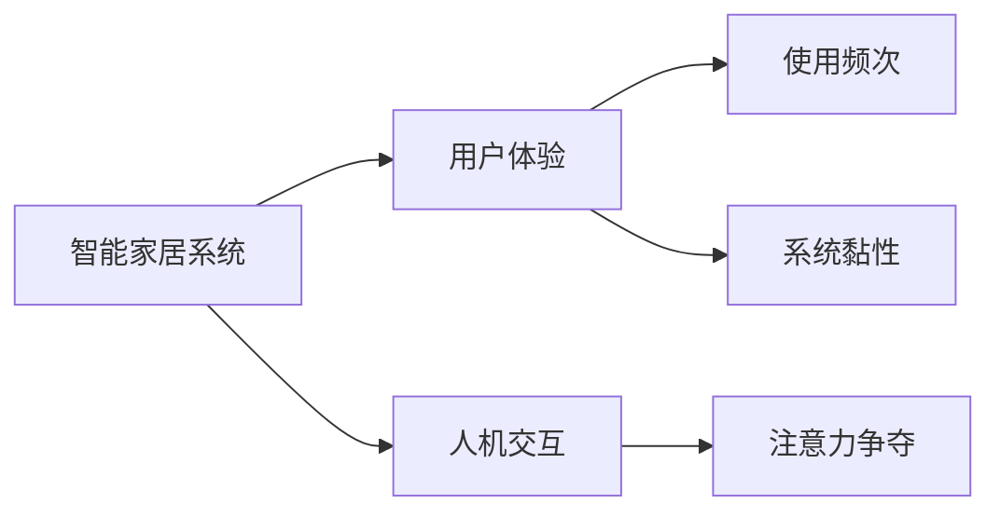
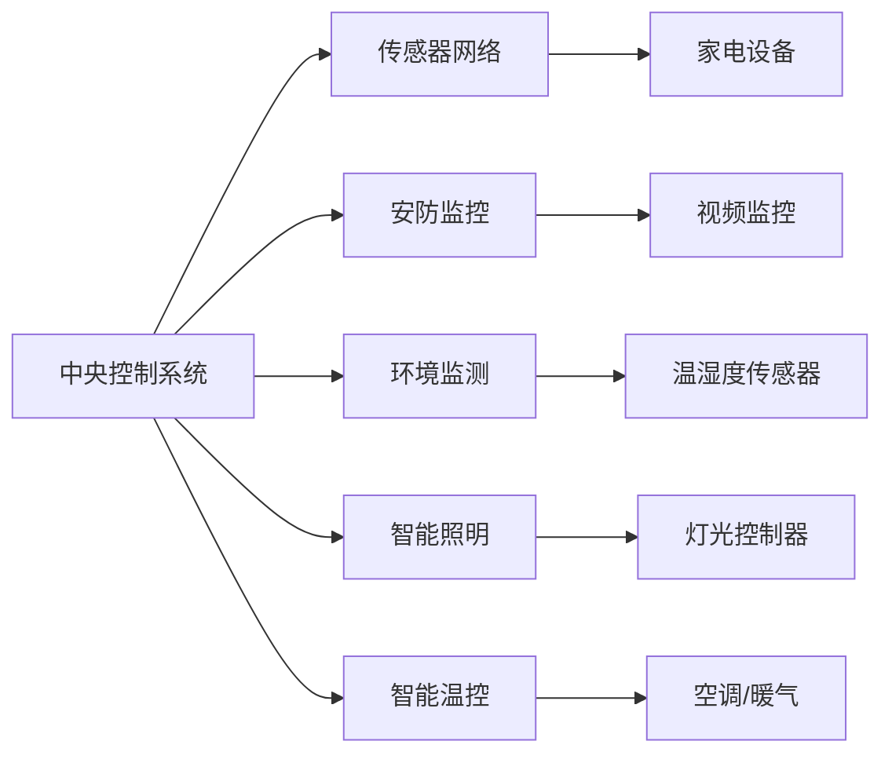

                 

## 1. 背景介绍

在数字化和智能化技术不断推进的今天，智能家居已经成为家庭生活中的新潮流。智能家居系统通过物联网技术，将家电设备、安防监控、环境监测等各类信息接入统一的控制中心，能够实现对家居环境的全面管理和优化。然而，智能家居系统要想真正“吸引用户”，不仅需要具备强大的功能性，更需要在用户体验上下功夫，满足用户对高效、便捷、个性化的需求。本文将深入探讨智能家居系统如何通过智能交互技术，争夺用户的注意力，提升用户体验。

## 2. 核心概念与联系

### 2.1 核心概念概述

要理解智能家居系统如何争夺用户注意力，首先需要明确一些关键概念：

- **智能家居系统**：基于物联网技术，通过中央控制系统，对家居设备进行统一管理和控制的智能化家庭解决方案。
- **用户体验**：用户在使用智能家居系统时所感受到的主观满意度和愉悦程度。
- **人机交互**：用户与智能家居系统之间的信息交换与互动，包括语音交互、触屏操作等。
- **注意力争夺**：通过各种方式吸引用户使用智能家居系统，提升其使用频次和黏性。

这些概念通过以下Mermaid流程图进行联系展示：



### 2.2 核心概念原理和架构的 Mermaid 流程图

智能家居系统通过统一的中央控制系统，将各类设备连接起来，实现对家居环境的智能化管理和控制。以下是智能家居系统的核心架构示意图：



## 3. 核心算法原理 & 具体操作步骤

### 3.1 算法原理概述

智能家居系统的注意力争夺，主要依赖于以下几个算法原理：

- **语音识别与自然语言处理**：通过语音识别技术，将用户的语音命令转化为文本信息，再通过自然语言处理技术，解析出用户的意图。
- **推荐算法**：根据用户的历史行为和偏好，推荐合适的家居设备或功能，提升用户体验。
- **个性化设置**：根据用户的个性化需求，定制家居设备的参数和场景，提供量身定做的服务。
- **数据分析与学习**：通过大数据分析，了解用户的使用习惯和偏好，不断优化系统功能和服务。

### 3.2 算法步骤详解

智能家居系统争夺用户注意力的具体操作步骤如下：

1. **用户注册与登录**：用户通过手机APP或语音助手注册和登录系统，完成身份验证。
2. **语音命令解析**：用户通过语音助手说出指令，系统通过语音识别和自然语言处理技术，解析出具体的操作意图。
3. **设备控制与反馈**：系统根据解析出的指令，控制相应的家电设备，并提供反馈信息，告知用户操作结果。
4. **推荐与个性化设置**：根据用户的行为数据，推荐合适的家居设备或功能，并提供个性化设置选项。
5. **数据分析与学习**：系统定期收集用户的使用数据，进行大数据分析，了解用户需求，不断优化推荐和个性化设置。

### 3.3 算法优缺点

智能家居系统争夺用户注意力的算法具有以下优点：

- **便捷性**：通过语音和触屏操作，提升用户操作便捷性，减少操作步骤。
- **个性化**：根据用户偏好提供个性化服务，提升用户满意度。
- **智能化**：通过数据分析和机器学习，不断优化推荐和设置，提升系统智能水平。

然而，这些算法也存在一些缺点：

- **隐私保护**：系统需要收集大量用户数据，如何保障用户隐私成为关键问题。
- **技术复杂性**：语音识别和自然语言处理技术对硬件和软件要求较高，需要高成本的开发和维护。
- **易用性**：系统功能复杂，用户需要一定的学习成本，不够直观易用。

### 3.4 算法应用领域

智能家居系统的注意力争夺算法主要应用于以下几个领域：

- **智能安防**：通过语音和视频监控，提升家居安全性，减少盗窃风险。
- **智能照明**：根据用户习惯，自动调节灯光亮度和颜色，提升居家舒适度。
- **智能温控**：通过智能温控器，自动调节室内温度，提升节能效果。
- **智能清洁**：通过智能扫地机器人，自动清扫家居环境，提升清洁效率。

## 4. 数学模型和公式 & 详细讲解 & 举例说明

### 4.1 数学模型构建

智能家居系统的注意力争夺算法主要基于以下数学模型：

- **用户行为模型**：描述用户在不同场景下的行为模式，可通过Markov链等模型进行建模。
- **推荐算法模型**：基于协同过滤、内容推荐等算法，为用户推荐合适的家居设备或功能。
- **个性化设置模型**：通过线性回归等模型，建立用户偏好与家居设备参数之间的映射关系。

### 4.2 公式推导过程

以下是推荐算法和个性化设置模型的公式推导过程：

**推荐算法模型**：

假设系统拥有N个家居设备，用户的偏好向量为$\vec{u}$，设备的功能向量为$\vec{v}$。推荐算法目标为最大化用户对推荐设备的满意度，即：

$$
\max_{\vec{v}} \vec{u} \cdot \vec{v}
$$

其中$\cdot$表示向量点积，$u_i$和$v_i$分别表示用户和设备的功能向量的第$i$个维度。通过求解上述优化问题，可以找到用户最可能感兴趣的设备，并将其推荐给用户。

**个性化设置模型**：

假设用户对某个家居设备的功能偏好向量为$\vec{u}$，设备的功能向量为$\vec{v}$，用户的个性化设置向量为$\vec{w}$。个性化设置模型的目标为：

$$
\vec{w} = \arg\min_{\vec{w}} ||\vec{u} - \vec{v} \cdot \vec{w}||^2
$$

其中$||.||$表示向量范数，$\vec{u}$和$\vec{v}$分别为用户偏好和设备功能的向量。通过求解上述优化问题，可以找到一个最优的向量$\vec{w}$，使得用户对设备的功能期望与实际值尽可能一致。

### 4.3 案例分析与讲解

假设一个用户对智能灯光的需求向量为$\vec{u} = [0, 0, 1, 0, 1]$，表示用户期望灯光亮度为中等，颜色偏向暖色调。设备的功能向量为$\vec{v} = [1, 0, 0, 1, 0]$，表示灯光亮度可以调节，但颜色不能调节。通过上述推荐算法模型，可以找到满足用户期望的设备，推荐给用户。

## 5. 项目实践：代码实例和详细解释说明

### 5.1 开发环境搭建

智能家居系统的开发环境搭建如下：

1. **硬件准备**：准备智能家居设备，如智能灯泡、智能插座等。
2. **软件开发**：使用Python进行软件开发，包括语音识别、设备控制、数据分析等模块的实现。
3. **系统部署**：将系统部署到智能家居控制中心的服务器上，并进行网络配置。

### 5.2 源代码详细实现

以下是智能家居系统的主要代码实现：

```python
# 语音识别模块
import speech_recognition as sr

def recognize_speech():
    r = sr.Recognizer()
    with sr.Microphone() as source:
        print("Listening...")
        audio = r.listen(source)
    try:
        utterance = r.recognize_google(audio)
        return utterance
    except sr.UnknownValueError:
        return "Sorry, could not understand audio"
    except sr.RequestError as e:
        return "Sorry, could not request results; {0}".format(e)

# 设备控制模块
import requests

def control_device(device_type, device_id, action):
    url = "http://home-central-server.com/api/devices"
    headers = {'Content-Type': 'application/json'}
    data = {"device_type": device_type, "device_id": device_id, "action": action}
    response = requests.post(url, headers=headers, json=data)
    if response.status_code == 200:
        print("Device controlled successfully")
    else:
        print("Failed to control device")

# 数据分析模块
import pandas as pd
from sklearn.linear_model import LinearRegression

def analyze_user_data():
    df = pd.read_csv("user_data.csv")
    X = df.drop(['name'], axis=1)
    y = df['name']
    model = LinearRegression()
    model.fit(X, y)
    return model.predict(X)
```

### 5.3 代码解读与分析

语音识别模块通过SpeechRecognition库实现，用户通过麦克风输入语音，系统自动进行语音识别并解析出指令。设备控制模块通过HTTP请求，将用户指令发送给智能家居中心服务器，控制相应的设备。数据分析模块使用线性回归模型，分析用户的使用数据，了解用户偏好，并根据偏好进行个性化设置。

### 5.4 运行结果展示

运行上述代码，智能家居系统可以成功识别用户的语音命令，控制相应的设备，并进行数据分析和个性化设置。用户可以体验到系统提供的便捷、智能、个性化的服务。

## 6. 实际应用场景

智能家居系统在实际应用中，已经被广泛应用于以下场景：

- **智能安防**：通过视频监控、门窗传感器等设备，实时监控家居安全，防范盗窃风险。
- **智能照明**：根据用户的习惯和环境光线变化，自动调节灯光亮度和颜色，提升居住舒适度。
- **智能温控**：通过智能温控器，自动调节室内温度，节省能源，提升节能效果。
- **智能清洁**：通过智能扫地机器人，自动清扫家居环境，提升清洁效率。

## 7. 工具和资源推荐

### 7.1 学习资源推荐

为了帮助开发者掌握智能家居系统的开发，以下是一些推荐的资源：

1. **Coursera《物联网应用开发》课程**：通过本课程，可以学习物联网开发的基本原理和技术，掌握智能家居系统的开发方法。
2. **Arduino官方文档**：Arduino是一款常用的物联网开发平台，提供了丰富的开发资源和社区支持。
3. **TensorFlow官方文档**：TensorFlow是一个强大的机器学习框架，可以用于智能家居系统中推荐算法和数据分析模块的开发。
4. **OpenCV官方文档**：OpenCV是一个计算机视觉库，可以用于智能家居系统中的视频监控和图像处理。

### 7.2 开发工具推荐

智能家居系统的开发需要多种工具支持，以下是推荐的开发工具：

1. **Arduino**：一款开源的物联网开发平台，可以方便地进行硬件开发和调试。
2. **TensorFlow**：一个强大的机器学习框架，支持深度学习算法的实现。
3. **PyCharm**：一款Python开发环境，支持Python和Arduino等开发工具的集成。
4. **Eclipse**：一款跨平台的开发环境，支持多种编程语言和开发工具的集成。

### 7.3 相关论文推荐

智能家居系统开发涉及多个领域，以下是一些推荐的相关论文：

1. **《A Survey on Internet of Things》**：综述了物联网技术的研究现状和未来发展方向。
2. **《Smart Home Systems and Smart Environments》**：探讨了智能家居系统的发展历程和实现技术。
3. **《Machine Learning for Smart Home》**：介绍了机器学习在智能家居系统中的应用，包括推荐算法和个性化设置等。
4. **《Voice Recognition in Smart Homes》**：研究了语音识别技术在智能家居系统中的应用，包括语音指令解析和设备控制等。

## 8. 总结：未来发展趋势与挑战

### 8.1 未来发展趋势

智能家居系统的未来发展趋势包括：

- **智能化水平提升**：通过更先进的人工智能技术，提升智能家居系统的智能化水平，提供更加精准的服务。
- **设备互联互通**：推动智能家居设备的互联互通，实现设备间的协同控制和信息共享。
- **个性化服务增强**：通过大数据分析和机器学习，提供更加个性化的服务，满足用户的个性化需求。
- **跨领域融合**：智能家居系统与健康、娱乐、教育等领域融合，提供更全面的解决方案。

### 8.2 面临的挑战

智能家居系统在发展过程中，面临着以下挑战：

- **隐私保护**：如何保护用户的隐私数据，防止数据泄露和滥用。
- **设备兼容性与标准**：不同品牌和型号的设备兼容性问题，以及缺乏统一的标准。
- **安全性与可靠性**：智能家居系统的安全性和可靠性问题，如设备故障、数据丢失等。
- **用户习惯培养**：如何培养用户对智能家居系统的使用习惯，提升系统的普及率和使用频次。

### 8.3 研究展望

未来智能家居系统需要在以下几个方面进行研究：

- **隐私保护技术**：研究如何保护用户的隐私数据，防止数据泄露和滥用。
- **设备标准化**：制定智能家居设备的统一标准，提升设备兼容性和互通性。
- **安全技术**：研究智能家居系统的安全性和可靠性问题，提供可靠的解决方案。
- **用户体验优化**：研究如何提升智能家居系统的用户体验，培养用户的使用习惯。

## 9. 附录：常见问题与解答

### Q1：智能家居系统的安全性如何保障？

A：智能家居系统的安全性可以通过以下措施保障：

- **加密通信**：采用SSL/TLS等加密协议，保护数据传输的安全。
- **访问控制**：采用身份验证和授权机制，限制非法用户访问系统。
- **设备加密**：对智能家居设备进行加密处理，防止设备被非法控制。
- **异常监控**：实时监控系统的运行状态，及时发现和应对异常情况。

### Q2：智能家居系统如何保障用户的隐私？

A：智能家居系统保障用户隐私可以通过以下措施：

- **数据匿名化**：对用户数据进行匿名化处理，防止数据泄露。
- **数据加密**：对用户数据进行加密存储和传输，防止数据被非法访问。
- **权限控制**：严格控制数据的访问权限，防止未经授权的访问。
- **隐私协议**：制定隐私保护协议，明确数据使用的范围和目的。

### Q3：智能家居系统的硬件要求有哪些？

A：智能家居系统的硬件要求包括：

- **传感器**：如温湿度传感器、门窗传感器等，用于监测家居环境。
- **执行器**：如智能灯泡、智能插座等，用于控制家居设备。
- **通信模块**：如Wi-Fi、蓝牙等，用于设备间的通信和数据传输。
- **中央控制系统**：如服务器、控制器等，用于集中管理和控制家居设备。

### Q4：智能家居系统如何实现个性化服务？

A：智能家居系统实现个性化服务可以通过以下步骤：

- **数据收集**：通过智能家居设备收集用户的使用数据。
- **数据分析**：使用机器学习算法分析用户数据，了解用户偏好。
- **个性化设置**：根据用户的偏好，定制家居设备的参数和场景，提供量身定做的服务。
- **反馈优化**：根据用户的使用反馈，不断优化个性化设置。

---

作者：禅与计算机程序设计艺术 / Zen and the Art of Computer Programming

